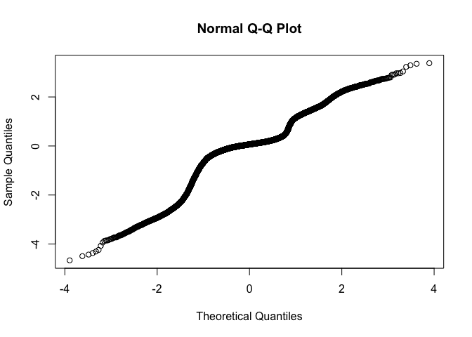
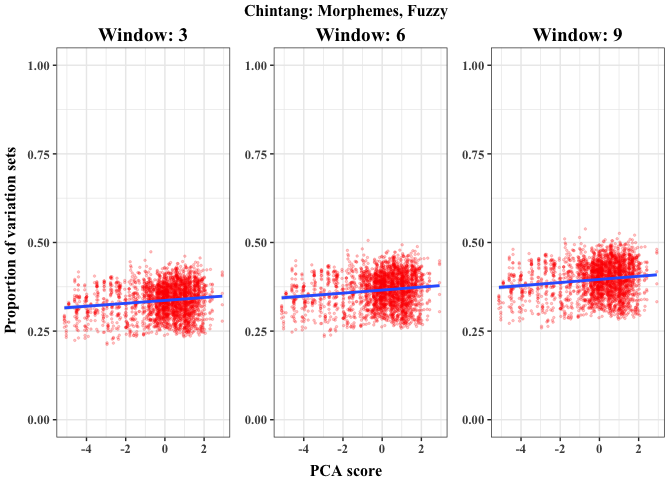

analysis
================
Nicholas Lester

# Variation set analysis (second revision, Cognition)

This file contains the code for the analysis of proportion of utterances
belonging to variation sets in the ACQDIV corpora (child-surrounding
speech; **CSS**), as well as two corpora of adult-directed speech
(**ADS**).

The analyses are divided into three broad sections:  
\* Longitudinal analysis of VS proportions in ACQDIV  
\* Cross-sectional analysis of VS proportions between ACQDIV and ADS  
\* Comparisons of each of the prior analyses against random baselines

## 1.0 Preliminaries

### 1.1 Clear memory

``` r
rm(list = ls(all = T))
```

### 1.2 Install/load libraries

Check if necessary libraries are installed. If so, load. If not, install
and load.

``` r
list.of.packages =  c("lmerTest", 
                      "ggplot2", 
                      "visreg", 
                      "mgcv", 
                      "dplyr", 
                      "ggpubr", 
                      "car", 
                      "gridExtra", 
                      "cowplot")
new.packages = list.of.packages[!(list.of.packages %in% installed.packages()[,"Package"])]
if(length(new.packages)){
    install.packages(new.packages)
}

invisible(lapply(list.of.packages, library, character.only = TRUE))
```

### 1.3 Load the data

The data are split into two sets: CSS-only (the primary analyses) and
ADS-vs-CSS (supplementary comparisons of variation sets in English and
Chintang ADS vs. CSS).

#### 1.3.1 All data

``` r
# Original data
load("../Data/Public/modeling_data.Rdata")

# Random data
load("../Data/Public/modeling_data_random.Rdata")
```

#### 1.3.2 Separate fuzzy/strict data for each dataset

Here we create individual datasets for the type of match
(SequenceMatcher, or *fuzzy*, and identity matching, or *strict*). We do
this for both the original (i.e., true, or non-simulated data) and a
randomized version of the same.

##### 1.3.2.1 Original data

**CSS**

``` r
css = final.dataset %>%
      filter(!corpus %in% c("Chintang_Adults", "English_Adults")  &
             is.finite(logit.vs.percentage))

css.morph = css %>% 
            filter(level.of.analysis == "morpheme")

css.word = css %>%
           filter(level.of.analysis == "word")

#### Morphemes
morph.langs = c("Chintang", "Inuktitut", "Turkish", "Yucatec", "Sesotho")

css.morph.fuzzy = css.morph %>% filter(match_type == "fuzzy" & corpus %in% morph.langs)

css.morph.strict = css.morph %>% filter(match_type == "strict" & corpus %in% morph.langs)

#### Words
css.word.fuzzy = css.word %>% filter(match_type == "fuzzy")

css.word.strict = css.word %>% filter(match_type == "strict")
```

**ADS**

``` r
## ADS
#### English
eng = final.dataset %>%
      filter(corpus %in% c("English_Adults", 
                           "English_Manchester1"))
###### Fuzzy
ads.fuzzy.eng = eng %>%
                filter(match_type == "fuzzy" &
                       level.of.analysis == "word")

###### Strict
ads.strict.eng = eng %>%
                 filter(match_type == "strict" &
                        level.of.analysis == "word")
#### Chintang
cnt = final.dataset %>%
      filter(corpus %in% c("Chintang_Adults", 
                           "Chintang"))
###### Fuzzy
ads.fuzzy.cnt = cnt %>%
                filter(match_type == "fuzzy" &
                       level.of.analysis == "word")

###### Strict
ads.strict.cnt = cnt %>%
                 filter(match_type == "strict" &
                        level.of.analysis == "word")
```

##### 1.3.2.2 Random data

**CSS**

``` r
css.rand = all.data.rand %>%
           filter(!corpus %in% c("English_Adults",
                                 "Chintang_Adults"))

#### Words
###### Fuzzy
css.word.fuzzy.rand = css.rand %>%
                      filter(match_type == "fuzzy" &
                             level.of.analysis == "word")
  
###### Strict
css.word.strict.rand = css.rand %>%
                       filter(match_type == "strict" &
                              level.of.analysis == "word")
#### Morphemes
###### Fuzzy
css.morph.fuzzy.rand = css.rand %>%
                      filter(match_type == "fuzzy" &
                             level.of.analysis == "morpheme")
###### Strict
css.morph.strict.rand = css.rand %>%
                        filter(match_type == "strict" &
                               level.of.analysis == "morpheme")
```

**ADS**

``` r
#### English
eng.rand = all.data.rand %>%
           filter(corpus %in% c("English_Manchester1", 
                                "English_Adults"))
  
###### Fuzzy
ads.fuzzy.eng.rand = eng.rand %>%
                     filter(match_type == "fuzzy" &
                            level.of.analysis == "word")
                        
###### Strict
ads.strict.eng.rand = eng.rand %>%
                      filter(match_type == "strict" &
                             level.of.analysis == "word")
#### Chintang
cnt.rand = all.data.rand %>%
           filter(corpus %in% c("Chintang",
                                "Chintang_Adults"))
###### Fuzzy
ads.fuzzy.cnt.rand = cnt.rand %>%
                     filter(match_type == "fuzzy" &
                            level.of.analysis == "word")

###### Strict
ads.strict.cnt.rand = cnt.rand %>%
                      filter(match_type == "strict" &
                             level.of.analysis == "word")
```

### 1.4 Functions

The first two functions are necessary given that we are modeling
proportions using linear models (we need to stretch the {0,1} range into
{-inf,inf} range). The last deals with exporting model results
efficiently (not implemented in the repository, but available to whoever
is interested).

``` r
logit = function(p){
  return(log(p/(1-p)))
}

ilogit = function(x){
  return(exp(x)/(1+exp(x)))
}

# mod = the lmer model object of choice
# f = the location you would like to save the output
mod.sums = function(mod, f){
    mod.sum = summary(mod)
    write.table(file = f, round(mod.sum$coefficients, 3), sep="\t", quote=F, row.names=T)
}
```

## 2.0 Longitudinal analysis of CSS (no random baseline)

This section contains models designed to compare longitudinal effects
across languages. It does not contain comparisons against random
baselines. Different methods for removing outliers were applied. In the
paper, we report the SD-based approach as it produced the best-behaved
residuals.

### 2.1 Modeling

#### 2.1.1 Full models (corpus as interacting term)

In these models, we include all data points from all corpora. Language
is treated as an interaction term with the relevant developmental index.
Treatment contrasts are applied; visualization and/or reordering of
levels prior to computing the model can reveal specific contrasts
between languages.

Models were fit with intercept adjustments for session, nested in
speaker, nested in corpus. In some cases, we were forced to rely on the
simpler speaker-nested-in-corpus structure (otherwise, the models break
down). This difference does not seem to play any important role in the
model outcomes.

We use four indices of development to represent the “longitudinal”
aspect of the analyses: age, MLU, lexical/morphological diversity, and
the scores of a principal component analysis (PCA) from the principal
component (which for all languages captured two or more of the
developmental indices simultaneously).

We also run models with and without outliers, where outliers are defined
in two ways: values falling beyond (a) 1.5 times the interquartile range
(IQR) above or below the mean and (b) 2 times the standard deviation
above or below the mean.

##### 2.1.1.1 Words, fuzzy

Word-level matching, with SequenceMatcher similarity criterion set to
.55. Sub-sections correspond to each developmental index (here and for
the following sections).

**Age**

``` r
## Full sample
mod.words.fuzzy.age.full = lmer(logit.vs.percentage ~ corpus*logAge.scaled + window_size + mean.nv.lens.words.scaled + number.of.utterances.scaled + number.of.speakers.scaled +  (1|corpus/target.child/session_id), data = css.word.fuzzy, control = lmerControl(optimizer="bobyqa", optCtrl=list(maxfun=2e5)))

anova(mod.words.fuzzy.age.full)
```

    ## Type III Analysis of Variance Table with Satterthwaite's method
    ##                              Sum Sq Mean Sq NumDF   DenDF    F value
    ## corpus                         2.54    0.36     7     2.0     6.3244
    ## logAge.scaled                  0.00    0.00     1  1030.7     0.0001
    ## window_size                 2146.77 2146.77     1 17175.0 37364.8282
    ## mean.nv.lens.words.scaled      3.64    3.64     1  2121.4    63.3875
    ## number.of.utterances.scaled    0.00    0.00     1  2125.7     0.0318
    ## number.of.speakers.scaled      0.12    0.12     1  2122.0     2.0529
    ## corpus:logAge.scaled          27.58    3.94     7  1575.2    68.5853
    ##                                Pr(>F)    
    ## corpus                         0.1433    
    ## logAge.scaled                  0.9932    
    ## window_size                 < 2.2e-16 ***
    ## mean.nv.lens.words.scaled   2.741e-15 ***
    ## number.of.utterances.scaled    0.8585    
    ## number.of.speakers.scaled      0.1521    
    ## corpus:logAge.scaled        < 2.2e-16 ***
    ## ---
    ## Signif. codes:  0 '***' 0.001 '**' 0.01 '*' 0.05 '.' 0.1 ' ' 1

``` r
summary(mod.words.fuzzy.age.full)
```

    ## Linear mixed model fit by REML. t-tests use Satterthwaite's method [
    ## lmerModLmerTest]
    ## Formula: logit.vs.percentage ~ corpus * logAge.scaled + window_size +  
    ##     mean.nv.lens.words.scaled + number.of.utterances.scaled +  
    ##     number.of.speakers.scaled + (1 | corpus/target.child/session_id)
    ##    Data: css.word.fuzzy
    ## Control: lmerControl(optimizer = "bobyqa", optCtrl = list(maxfun = 2e+05))
    ## 
    ## REML criterion at convergence: 6094
    ## 
    ## Scaled residuals: 
    ##      Min       1Q   Median       3Q      Max 
    ## -16.4117  -0.3342   0.1778   0.5047  18.2998 
    ## 
    ## Random effects:
    ##  Groups                           Name        Variance Std.Dev.
    ##  session_id:(target.child:corpus) (Intercept) 0.11168  0.3342  
    ##  target.child:corpus              (Intercept) 0.08110  0.2848  
    ##  corpus                           (Intercept) 0.04581  0.2140  
    ##  Residual                                     0.05745  0.2397  
    ## Number of obs: 19323, groups:  
    ## session_id:(target.child:corpus), 2147; target.child:corpus, 41; corpus, 8
    ## 
    ## Fixed effects:
    ##                                           Estimate Std. Error         df
    ## (Intercept)                             -1.576e+00  2.454e-01  1.427e-05
    ## corpusEnglish_Manchester1               -6.830e-01  3.366e-01  1.264e-05
    ## corpusInuktitut                         -4.462e-01  3.638e-01  1.725e-05
    ## corpusJapanese_MiiPro                   -8.102e-01  3.697e-01  1.840e-05
    ## corpusRussian                           -1.266e-01  3.526e-01  1.522e-05
    ## corpusSesotho                           -2.083e+00  3.685e-01  1.816e-05
    ## corpusTurkish                            7.326e-03  3.709e-01  1.863e-05
    ## corpusYucatec                           -5.731e-01  3.664e-01  1.775e-05
    ## logAge.scaled                            1.158e-01  2.788e-02  1.524e+03
    ## window_size                              1.291e-01  6.678e-04  1.717e+04
    ## mean.nv.lens.words.scaled                3.141e-01  3.945e-02  2.121e+03
    ## number.of.utterances.scaled              2.281e-03  1.279e-02  2.126e+03
    ## number.of.speakers.scaled               -1.931e-02  1.348e-02  2.122e+03
    ## corpusEnglish_Manchester1:logAge.scaled -4.344e-01  4.805e-02  2.088e+03
    ## corpusInuktitut:logAge.scaled            1.019e+00  2.300e-01  7.990e+02
    ## corpusJapanese_MiiPro:logAge.scaled     -2.754e-01  8.241e-02  2.125e+03
    ## corpusRussian:logAge.scaled             -3.947e-01  3.536e-02  1.859e+03
    ## corpusSesotho:logAge.scaled             -6.917e-01  1.023e-01  1.114e+03
    ## corpusTurkish:logAge.scaled              3.731e-01  4.783e-02  2.052e+03
    ## corpusYucatec:logAge.scaled             -5.245e-01  5.769e-02  2.118e+03
    ##                                         t value Pr(>|t|)    
    ## (Intercept)                              -6.423 0.999884    
    ## corpusEnglish_Manchester1                -2.029 0.999911    
    ## corpusInuktitut                          -1.227 0.999890    
    ## corpusJapanese_MiiPro                    -2.191 0.999873    
    ## corpusRussian                            -0.359 0.999921    
    ## corpusSesotho                            -5.652 0.999857    
    ## corpusTurkish                             0.020 0.999959    
    ## corpusYucatec                            -1.564 0.999883    
    ## logAge.scaled                             4.155 3.44e-05 ***
    ## window_size                             193.300  < 2e-16 ***
    ## mean.nv.lens.words.scaled                 7.962 2.74e-15 ***
    ## number.of.utterances.scaled               0.178 0.858493    
    ## number.of.speakers.scaled                -1.433 0.152065    
    ## corpusEnglish_Manchester1:logAge.scaled  -9.040  < 2e-16 ***
    ## corpusInuktitut:logAge.scaled             4.429 1.08e-05 ***
    ## corpusJapanese_MiiPro:logAge.scaled      -3.342 0.000847 ***
    ## corpusRussian:logAge.scaled             -11.163  < 2e-16 ***
    ## corpusSesotho:logAge.scaled              -6.762 2.19e-11 ***
    ## corpusTurkish:logAge.scaled               7.800 9.76e-15 ***
    ## corpusYucatec:logAge.scaled              -9.092  < 2e-16 ***
    ## ---
    ## Signif. codes:  0 '***' 0.001 '**' 0.01 '*' 0.05 '.' 0.1 ' ' 1

``` r
qqnorm(resid(mod.words.fuzzy.age.full))
```

<!-- -->

``` r
mod.sums(mod.words.fuzzy.age.full, "../testmod.txt")

## IQR outliers removed (simplified RE structure)
mod.words.fuzzy.age.iqr = lmer(logit.vs.percentage ~ corpus*logAge.scaled + window_size + mean.nv.lens.words.scaled + number.of.utterances.scaled + number.of.speakers.scaled +  (1|corpus/target.child), data = css.word.fuzzy %>% filter(IQR.outliers=="no"), control = lmerControl(optimizer="bobyqa", optCtrl=list(maxfun=2e5)))

anova(mod.words.fuzzy.age.iqr)
```

    ## Type III Analysis of Variance Table with Satterthwaite's method
    ##                              Sum Sq Mean Sq NumDF DenDF    F value
    ## corpus                         3.66    0.52     7     2     4.6714
    ## logAge.scaled                 22.55   22.55     1 16359   201.3856
    ## window_size                 1817.25 1817.25     1 18736 16231.1167
    ## mean.nv.lens.words.scaled     54.29   54.29     1 18749   484.8788
    ## number.of.utterances.scaled    0.45    0.45     1 18755     3.9951
    ## number.of.speakers.scaled      1.89    1.89     1 18751    16.8563
    ## corpus:logAge.scaled         408.56   58.37     7 18124   521.3027
    ##                                Pr(>F)    
    ## corpus                        0.18761    
    ## logAge.scaled               < 2.2e-16 ***
    ## window_size                 < 2.2e-16 ***
    ## mean.nv.lens.words.scaled   < 2.2e-16 ***
    ## number.of.utterances.scaled   0.04565 *  
    ## number.of.speakers.scaled   4.049e-05 ***
    ## corpus:logAge.scaled        < 2.2e-16 ***
    ## ---
    ## Signif. codes:  0 '***' 0.001 '**' 0.01 '*' 0.05 '.' 0.1 ' ' 1

``` r
summary(mod.words.fuzzy.age.iqr)
```

    ## Linear mixed model fit by REML. t-tests use Satterthwaite's method [
    ## lmerModLmerTest]
    ## Formula: logit.vs.percentage ~ corpus * logAge.scaled + window_size +  
    ##     mean.nv.lens.words.scaled + number.of.utterances.scaled +  
    ##     number.of.speakers.scaled + (1 | corpus/target.child)
    ##    Data: css.word.fuzzy %>% filter(IQR.outliers == "no")
    ## Control: lmerControl(optimizer = "bobyqa", optCtrl = list(maxfun = 2e+05))
    ## 
    ## REML criterion at convergence: 12505.5
    ## 
    ## Scaled residuals: 
    ##     Min      1Q  Median      3Q     Max 
    ## -9.3703 -0.5325  0.0465  0.5814  7.4526 
    ## 
    ## Random effects:
    ##  Groups              Name        Variance Std.Dev.
    ##  target.child:corpus (Intercept) 0.18305  0.4278  
    ##  corpus              (Intercept) 0.06475  0.2545  
    ##  Residual                        0.11196  0.3346  
    ## Number of obs: 18788, groups:  target.child:corpus, 39; corpus, 8
    ## 
    ## Fixed effects:
    ##                                           Estimate Std. Error         df
    ## (Intercept)                             -1.516e+00  3.088e-01  1.149e-05
    ## corpusEnglish_Manchester1               -6.739e-01  4.188e-01  9.718e-06
    ## corpusInuktitut                          2.132e-01  4.548e-01  1.351e-05
    ## corpusJapanese_MiiPro                   -8.292e-01  4.549e-01  1.353e-05
    ## corpusRussian                           -1.495e-01  4.438e-01  1.225e-05
    ## corpusSesotho                           -2.122e+00  4.706e-01  1.549e-05
    ## corpusTurkish                            6.828e-02  5.022e-01  2.010e-05
    ## corpusYucatec                           -5.576e-01  4.704e-01  1.546e-05
    ## logAge.scaled                            1.024e-01  9.517e-03  1.866e+04
    ## window_size                              1.221e-01  9.586e-04  1.874e+04
    ## mean.nv.lens.words.scaled                2.891e-01  1.313e-02  1.875e+04
    ## number.of.utterances.scaled              8.461e-03  4.233e-03  1.876e+04
    ## number.of.speakers.scaled               -1.825e-02  4.444e-03  1.875e+04
    ## corpusEnglish_Manchester1:logAge.scaled -3.841e-01  1.603e-02  1.877e+04
    ## corpusInuktitut:logAge.scaled           -3.077e-01  9.202e-02  1.526e+04
    ## corpusJapanese_MiiPro:logAge.scaled     -2.457e-01  2.712e-02  1.875e+04
    ## corpusRussian:logAge.scaled             -3.751e-01  1.193e-02  1.874e+04
    ## corpusSesotho:logAge.scaled             -8.682e-01  3.571e-02  1.841e+04
    ## corpusTurkish:logAge.scaled              3.526e-01  1.630e-02  1.877e+04
    ## corpusYucatec:logAge.scaled             -4.784e-01  1.904e-02  1.877e+04
    ##                                         t value Pr(>|t|)    
    ## (Intercept)                              -4.908  0.99991    
    ## corpusEnglish_Manchester1                -1.609  0.99993    
    ## corpusInuktitut                           0.469  0.99993    
    ## corpusJapanese_MiiPro                    -1.823  0.99991    
    ## corpusRussian                            -0.337  0.99994    
    ## corpusSesotho                            -4.509  0.99988    
    ## corpusTurkish                             0.136  0.99992    
    ## corpusYucatec                            -1.185  0.99990    
    ## logAge.scaled                            10.756  < 2e-16 ***
    ## window_size                             127.401  < 2e-16 ***
    ## mean.nv.lens.words.scaled                22.020  < 2e-16 ***
    ## number.of.utterances.scaled               1.999  0.04565 *  
    ## number.of.speakers.scaled                -4.106 4.05e-05 ***
    ## corpusEnglish_Manchester1:logAge.scaled -23.962  < 2e-16 ***
    ## corpusInuktitut:logAge.scaled            -3.343  0.00083 ***
    ## corpusJapanese_MiiPro:logAge.scaled      -9.062  < 2e-16 ***
    ## corpusRussian:logAge.scaled             -31.446  < 2e-16 ***
    ## corpusSesotho:logAge.scaled             -24.315  < 2e-16 ***
    ## corpusTurkish:logAge.scaled              21.631  < 2e-16 ***
    ## corpusYucatec:logAge.scaled             -25.119  < 2e-16 ***
    ## ---
    ## Signif. codes:  0 '***' 0.001 '**' 0.01 '*' 0.05 '.' 0.1 ' ' 1

``` r
qqnorm(resid(mod.words.fuzzy.age.iqr))
```

<!-- -->

``` r
## 2*SD outliers removed
mod.words.fuzzy.age.sd = lmer(logit.vs.percentage ~ corpus*logAge.scaled + window_size + mean.nv.lens.words.scaled + number.of.utterances.scaled + number.of.speakers.scaled +  (1|corpus/target.child/session_id), data = css.word.fuzzy  %>% filter(SD.outliers=="no"), control = lmerControl(optimizer="bobyqa", optCtrl=list(maxfun=2e5)))

anova(mod.words.fuzzy.age.sd)
```

    ## Type III Analysis of Variance Table with Satterthwaite's method
    ##                             Sum Sq Mean Sq NumDF   DenDF    F value
    ## corpus                        1.02    0.15     7    34.3    12.5323
    ## logAge.scaled                 0.15    0.15     1  1604.4    12.8413
    ## window_size                 528.73  528.73     1 11794.9 45522.9237
    ## mean.nv.lens.words.scaled     1.47    1.47     1  1995.3   126.3177
    ## number.of.utterances.scaled   0.03    0.03     1  1994.6     2.3553
    ## number.of.speakers.scaled     0.06    0.06     1  1984.3     4.9335
    ## corpus:logAge.scaled          6.27    0.90     7  1867.8    77.1174
    ##                                Pr(>F)    
    ## corpus                      7.556e-08 ***
    ## logAge.scaled               0.0003492 ***
    ## window_size                 < 2.2e-16 ***
    ## mean.nv.lens.words.scaled   < 2.2e-16 ***
    ## number.of.utterances.scaled 0.1250181    
    ## number.of.speakers.scaled   0.0264530 *  
    ## corpus:logAge.scaled        < 2.2e-16 ***
    ## ---
    ## Signif. codes:  0 '***' 0.001 '**' 0.01 '*' 0.05 '.' 0.1 ' ' 1

``` r
summary(mod.words.fuzzy.age.sd)
```

    ## Linear mixed model fit by REML. t-tests use Satterthwaite's method [
    ## lmerModLmerTest]
    ## Formula: logit.vs.percentage ~ corpus * logAge.scaled + window_size +  
    ##     mean.nv.lens.words.scaled + number.of.utterances.scaled +  
    ##     number.of.speakers.scaled + (1 | corpus/target.child/session_id)
    ##    Data: css.word.fuzzy %>% filter(SD.outliers == "no")
    ## Control: lmerControl(optimizer = "bobyqa", optCtrl = list(maxfun = 2e+05))
    ## 
    ## REML criterion at convergence: -14837.9
    ## 
    ## Scaled residuals: 
    ##     Min      1Q  Median      3Q     Max 
    ## -6.3131 -0.4070  0.1344  0.5267  6.0685 
    ## 
    ## Random effects:
    ##  Groups                           Name        Variance Std.Dev.
    ##  session_id:(target.child:corpus) (Intercept) 0.055475 0.23553 
    ##  target.child:corpus              (Intercept) 0.120162 0.34664 
    ##  corpus                           (Intercept) 0.001741 0.04172 
    ##  Residual                                     0.011614 0.10777 
    ## Number of obs: 13771, groups:  
    ## session_id:(target.child:corpus), 2097; target.child:corpus, 39; corpus, 8
    ## 
    ## Fixed effects:
    ##                                           Estimate Std. Error         df
    ## (Intercept)                             -1.340e+00  1.490e-01  3.342e+01
    ## corpusEnglish_Manchester1               -6.373e-01  1.850e-01  3.528e+01
    ## corpusInuktitut                         -8.988e-04  2.401e-01  3.587e+01
    ## corpusJapanese_MiiPro                   -8.426e-01  2.432e-01  3.798e+01
    ## corpusRussian                           -1.414e-01  2.216e-01  3.371e+01
    ## corpusSesotho                           -2.041e+00  2.560e-01  3.231e+01
    ## corpusTurkish                            4.744e-02  2.952e-01  3.217e+01
    ## corpusYucatec                           -4.361e-01  2.543e-01  3.152e+01
    ## logAge.scaled                            6.465e-02  2.036e-02  1.975e+03
    ## window_size                              9.538e-02  4.470e-04  1.179e+04
    ## mean.nv.lens.words.scaled                3.244e-01  2.886e-02  1.995e+03
    ## number.of.utterances.scaled              1.396e-02  9.096e-03  1.995e+03
    ## number.of.speakers.scaled               -2.123e-02  9.557e-03  1.984e+03
    ## corpusEnglish_Manchester1:logAge.scaled -3.322e-01  3.421e-02  2.013e+03
    ## corpusInuktitut:logAge.scaled            2.702e-01  1.792e-01  1.411e+03
    ## corpusJapanese_MiiPro:logAge.scaled     -2.073e-01  5.829e-02  1.990e+03
    ## corpusRussian:logAge.scaled             -3.007e-01  2.554e-02  2.019e+03
    ## corpusSesotho:logAge.scaled             -7.407e-01  7.724e-02  1.832e+03
    ## corpusTurkish:logAge.scaled              3.545e-01  3.711e-02  2.003e+03
    ## corpusYucatec:logAge.scaled             -3.137e-01  4.348e-02  1.998e+03
    ##                                         t value Pr(>|t|)    
    ## (Intercept)                              -8.993 1.92e-10 ***
    ## corpusEnglish_Manchester1                -3.446 0.001489 ** 
    ## corpusInuktitut                          -0.004 0.997034    
    ## corpusJapanese_MiiPro                    -3.464 0.001334 ** 
    ## corpusRussian                            -0.638 0.527586    
    ## corpusSesotho                            -7.973 3.94e-09 ***
    ## corpusTurkish                             0.161 0.873327    
    ## corpusYucatec                            -1.715 0.096231 .  
    ## logAge.scaled                             3.175 0.001519 ** 
    ## window_size                             213.361  < 2e-16 ***
    ## mean.nv.lens.words.scaled                11.239  < 2e-16 ***
    ## number.of.utterances.scaled               1.535 0.125018    
    ## number.of.speakers.scaled                -2.221 0.026453 *  
    ## corpusEnglish_Manchester1:logAge.scaled  -9.710  < 2e-16 ***
    ## corpusInuktitut:logAge.scaled             1.508 0.131808    
    ## corpusJapanese_MiiPro:logAge.scaled      -3.557 0.000385 ***
    ## corpusRussian:logAge.scaled             -11.773  < 2e-16 ***
    ## corpusSesotho:logAge.scaled              -9.590  < 2e-16 ***
    ## corpusTurkish:logAge.scaled               9.554  < 2e-16 ***
    ## corpusYucatec:logAge.scaled              -7.216 7.58e-13 ***
    ## ---
    ## Signif. codes:  0 '***' 0.001 '**' 0.01 '*' 0.05 '.' 0.1 ' ' 1

``` r
qqnorm(resid(mod.words.fuzzy.age.sd)) # this produces best looking residuals
```

<!-- -->

**MLU**

``` r
## Full sample
mod.words.fuzzy.mlu.full = lmer(logit.vs.percentage ~ corpus*MLUw.scaled + window_size + mean.nv.lens.words.scaled + number.of.utterances.scaled + number.of.speakers.scaled +  (1|corpus/target.child/session_id), data = css.word.fuzzy, control = lmerControl(optimizer="bobyqa", optCtrl=list(maxfun=2e5)))

anova(mod.words.fuzzy.mlu.full)
```

    ## Type III Analysis of Variance Table with Satterthwaite's method
    ##                              Sum Sq Mean Sq NumDF   DenDF    F value
    ## corpus                         1.61    0.23     7     2.0     3.9968
    ## MLUw.scaled                    0.27    0.27     1  1911.4     4.6587
    ## window_size                 2146.77 2146.77     1 17175.0 37364.8446
    ## mean.nv.lens.words.scaled      1.91    1.91     1  2125.5    33.2326
    ## number.of.utterances.scaled    0.00    0.00     1  2124.0     0.0071
    ## number.of.speakers.scaled      0.07    0.07     1  2123.8     1.2103
    ## corpus:MLUw.scaled            10.66    1.52     7  2052.4    26.5071
    ##                                Pr(>F)    
    ## corpus                        0.21468    
    ## MLUw.scaled                   0.03102 *  
    ## window_size                 < 2.2e-16 ***
    ## mean.nv.lens.words.scaled    9.37e-09 ***
    ## number.of.utterances.scaled   0.93294    
    ## number.of.speakers.scaled     0.27140    
    ## corpus:MLUw.scaled          < 2.2e-16 ***
    ## ---
    ## Signif. codes:  0 '***' 0.001 '**' 0.01 '*' 0.05 '.' 0.1 ' ' 1

``` r
summary(mod.words.fuzzy.mlu.full)
```

    ## Linear mixed model fit by REML. t-tests use Satterthwaite's method [
    ## lmerModLmerTest]
    ## Formula: 
    ## logit.vs.percentage ~ corpus * MLUw.scaled + window_size + mean.nv.lens.words.scaled +  
    ##     number.of.utterances.scaled + number.of.speakers.scaled +  
    ##     (1 | corpus/target.child/session_id)
    ##    Data: css.word.fuzzy
    ## Control: lmerControl(optimizer = "bobyqa", optCtrl = list(maxfun = 2e+05))
    ## 
    ## REML criterion at convergence: 6311.8
    ## 
    ## Scaled residuals: 
    ##      Min       1Q   Median       3Q      Max 
    ## -16.4874  -0.3349   0.1790   0.5051  18.2881 
    ## 
    ## Random effects:
    ##  Groups                           Name        Variance Std.Dev.
    ##  session_id:(target.child:corpus) (Intercept) 0.12433  0.3526  
    ##  target.child:corpus              (Intercept) 0.08863  0.2977  
    ##  corpus                           (Intercept) 0.11704  0.3421  
    ##  Residual                                     0.05745  0.2397  
    ## Number of obs: 19323, groups:  
    ## session_id:(target.child:corpus), 2147; target.child:corpus, 41; corpus, 8
    ## 
    ## Fixed effects:
    ##                                         Estimate Std. Error         df
    ## (Intercept)                           -1.576e+00  3.648e-01  3.860e-05
    ## corpusEnglish_Manchester1             -6.159e-01  5.080e-01  3.628e-05
    ## corpusInuktitut                        6.109e-01  5.553e-01  5.177e-05
    ## corpusJapanese_MiiPro                 -8.274e-01  5.273e-01  4.209e-05
    ## corpusRussian                         -4.733e-01  5.202e-01  3.987e-05
    ## corpusSesotho                         -2.128e+00  5.322e-01  4.369e-05
    ## corpusTurkish                         -2.229e-01  5.390e-01  4.597e-05
    ## corpusYucatec                         -5.896e-01  5.303e-01  4.306e-05
    ## MLUw.scaled                            8.253e-02  4.237e-02  2.127e+03
    ## window_size                            1.291e-01  6.678e-04  1.718e+04
    ## mean.nv.lens.words.scaled              2.438e-01  4.229e-02  2.126e+03
    ## number.of.utterances.scaled           -1.119e-03  1.329e-02  2.124e+03
    ## number.of.speakers.scaled             -1.551e-02  1.410e-02  2.124e+03
    ## corpusEnglish_Manchester1:MLUw.scaled -2.350e-01  4.685e-02  2.125e+03
    ## corpusInuktitut:MLUw.scaled            9.506e-01  1.983e-01  1.723e+03
    ## corpusJapanese_MiiPro:MLUw.scaled     -2.354e-01  8.146e-02  2.128e+03
    ## corpusRussian:MLUw.scaled             -5.621e-01  6.077e-02  2.124e+03
    ## corpusSesotho:MLUw.scaled             -2.858e-01  5.812e-02  2.097e+03
    ## corpusTurkish:MLUw.scaled              4.100e-01  9.491e-02  2.119e+03
    ## corpusYucatec:MLUw.scaled             -1.898e-01  5.023e-02  2.124e+03
    ##                                       t value Pr(>|t|)    
    ## (Intercept)                            -4.321 0.999721    
    ## corpusEnglish_Manchester1              -1.212 0.999782    
    ## corpusInuktitut                         1.100 0.999704    
    ## corpusJapanese_MiiPro                  -1.569 0.999740    
    ## corpusRussian                          -0.910 0.999774    
    ## corpusSesotho                          -3.998 0.999690    
    ## corpusTurkish                          -0.414 0.999779    
    ## corpusYucatec                          -1.112 0.999749    
    ## MLUw.scaled                             1.948 0.051558 .  
    ## window_size                           193.300  < 2e-16 ***
    ## mean.nv.lens.words.scaled               5.765 9.37e-09 ***
    ## number.of.utterances.scaled            -0.084 0.932942    
    ## number.of.speakers.scaled              -1.100 0.271401    
    ## corpusEnglish_Manchester1:MLUw.scaled  -5.017 5.68e-07 ***
    ## corpusInuktitut:MLUw.scaled             4.794 1.78e-06 ***
    ## corpusJapanese_MiiPro:MLUw.scaled      -2.889 0.003899 ** 
    ## corpusRussian:MLUw.scaled              -9.250  < 2e-16 ***
    ## corpusSesotho:MLUw.scaled              -4.918 9.43e-07 ***
    ## corpusTurkish:MLUw.scaled               4.320 1.63e-05 ***
    ## corpusYucatec:MLUw.scaled              -3.778 0.000162 ***
    ## ---
    ## Signif. codes:  0 '***' 0.001 '**' 0.01 '*' 0.05 '.' 0.1 ' ' 1

``` r
qqnorm(resid(mod.words.fuzzy.mlu.full))
```

<!-- -->

``` r
## IQR outliers removed (simplified)
mod.words.fuzzy.mlu.iqr = lmer(logit.vs.percentage ~ corpus*MLUw.scaled + window_size + mean.nv.lens.words.scaled + number.of.utterances.scaled + number.of.speakers.scaled +  (1|corpus/target.child), data = css.word.fuzzy %>% filter(IQR.outliers=="no"), control = lmerControl(optimizer="bobyqa", optCtrl=list(maxfun=2e5)))

anova(mod.words.fuzzy.mlu.iqr)
```

    ## Type III Analysis of Variance Table with Satterthwaite's method
    ##                              Sum Sq Mean Sq NumDF DenDF    F value
    ## corpus                         2.68    0.38     7     2     3.0867
    ## MLUw.scaled                    5.07    5.07     1 18199    40.9439
    ## window_size                 1805.19 1805.19     1 18737 14580.5724
    ## mean.nv.lens.words.scaled     31.12   31.12     1 18754   251.3737
    ## number.of.utterances.scaled    0.02    0.02     1 18756     0.1229
    ## number.of.speakers.scaled      1.30    1.30     1 18756    10.5079
    ## corpus:MLUw.scaled           150.09   21.44     7 18616   173.1795
    ##                                Pr(>F)    
    ## corpus                       0.266437    
    ## MLUw.scaled                 1.605e-10 ***
    ## window_size                 < 2.2e-16 ***
    ## mean.nv.lens.words.scaled   < 2.2e-16 ***
    ## number.of.utterances.scaled  0.725905    
    ## number.of.speakers.scaled    0.001191 ** 
    ## corpus:MLUw.scaled          < 2.2e-16 ***
    ## ---
    ## Signif. codes:  0 '***' 0.001 '**' 0.01 '*' 0.05 '.' 0.1 ' ' 1

``` r
summary(mod.words.fuzzy.mlu.iqr)
```

    ## Linear mixed model fit by REML. t-tests use Satterthwaite's method [
    ## lmerModLmerTest]
    ## Formula: 
    ## logit.vs.percentage ~ corpus * MLUw.scaled + window_size + mean.nv.lens.words.scaled +  
    ##     number.of.utterances.scaled + number.of.speakers.scaled +  
    ##     (1 | corpus/target.child)
    ##    Data: css.word.fuzzy %>% filter(IQR.outliers == "no")
    ## Control: lmerControl(optimizer = "bobyqa", optCtrl = list(maxfun = 2e+05))
    ## 
    ## REML criterion at convergence: 14388.3
    ## 
    ## Scaled residuals: 
    ##     Min      1Q  Median      3Q     Max 
    ## -9.0375 -0.5337  0.0462  0.5705  7.4074 
    ## 
    ## Random effects:
    ##  Groups              Name        Variance Std.Dev.
    ##  target.child:corpus (Intercept) 0.1622   0.4027  
    ##  corpus              (Intercept) 0.1281   0.3579  
    ##  Residual                        0.1238   0.3519  
    ## Number of obs: 18788, groups:  target.child:corpus, 39; corpus, 8
    ## 
    ## Fixed effects:
    ##                                         Estimate Std. Error         df
    ## (Intercept)                           -1.534e+00  3.941e-01  1.012e-05
    ## corpusEnglish_Manchester1             -5.959e-01  5.449e-01  9.248e-06
    ## corpusInuktitut                        1.171e-01  5.733e-01  1.133e-05
    ## corpusJapanese_MiiPro                 -8.133e-01  5.696e-01  1.105e-05
    ## corpusRussian                         -4.682e-01  5.622e-01  1.048e-05
    ## corpusSesotho                         -2.227e+00  5.812e-01  1.197e-05
    ## corpusTurkish                         -4.105e-02  6.047e-01  1.403e-05
    ## corpusYucatec                         -5.536e-01  5.810e-01  1.195e-05
    ## MLUw.scaled                            3.793e-02  1.401e-02  1.876e+04
    ## window_size                            1.217e-01  1.008e-03  1.874e+04
    ## mean.nv.lens.words.scaled              2.230e-01  1.407e-02  1.875e+04
    ## number.of.utterances.scaled            1.540e-03  4.392e-03  1.876e+04
    ## number.of.speakers.scaled             -1.508e-02  4.653e-03  1.876e+04
    ## corpusEnglish_Manchester1:MLUw.scaled -1.765e-01  1.547e-02  1.876e+04
    ## corpusInuktitut:MLUw.scaled           -6.261e-02  7.543e-02  1.774e+04
    ## corpusJapanese_MiiPro:MLUw.scaled     -1.789e-01  2.679e-02  1.876e+04
    ## corpusRussian:MLUw.scaled             -5.099e-01  2.014e-02  1.877e+04
    ## corpusSesotho:MLUw.scaled             -2.351e-01  1.930e-02  1.877e+04
    ## corpusTurkish:MLUw.scaled              4.389e-01  3.135e-02  1.875e+04
    ## corpusYucatec:MLUw.scaled             -1.363e-01  1.653e-02  1.876e+04
    ##                                       t value Pr(>|t|)    
    ## (Intercept)                            -3.893  0.99992    
    ## corpusEnglish_Manchester1              -1.094  0.99994    
    ## corpusInuktitut                         0.204  0.99995    
    ## corpusJapanese_MiiPro                  -1.428  0.99993    
    ## corpusRussian                          -0.833  0.99993    
    ## corpusSesotho                          -3.831  0.99991    
    ## corpusTurkish                          -0.068  0.99995    
    ## corpusYucatec                          -0.953  0.99992    
    ## MLUw.scaled                             2.709  0.00676 ** 
    ## window_size                           120.750  < 2e-16 ***
    ## mean.nv.lens.words.scaled              15.855  < 2e-16 ***
    ## number.of.utterances.scaled             0.351  0.72590    
    ## number.of.speakers.scaled              -3.242  0.00119 ** 
    ## corpusEnglish_Manchester1:MLUw.scaled -11.408  < 2e-16 ***
    ## corpusInuktitut:MLUw.scaled            -0.830  0.40658    
    ## corpusJapanese_MiiPro:MLUw.scaled      -6.677 2.51e-11 ***
    ## corpusRussian:MLUw.scaled             -25.317  < 2e-16 ***
    ## corpusSesotho:MLUw.scaled             -12.185  < 2e-16 ***
    ## corpusTurkish:MLUw.scaled              13.999  < 2e-16 ***
    ## corpusYucatec:MLUw.scaled              -8.246  < 2e-16 ***
    ## ---
    ## Signif. codes:  0 '***' 0.001 '**' 0.01 '*' 0.05 '.' 0.1 ' ' 1

``` r
qqnorm(resid(mod.words.fuzzy.mlu.iqr))
```

<!-- -->

``` r
## 2*SD outliers removed
mod.words.fuzzy.mlu.sd = lmer(logit.vs.percentage ~ corpus*MLUw.scaled + window_size + mean.nv.lens.words.scaled + number.of.utterances.scaled + number.of.speakers.scaled +  (1|corpus/target.child/session_id), data = css.word.fuzzy  %>% filter(SD.outliers=="no"), control = lmerControl(optimizer="bobyqa", optCtrl=list(maxfun=2e5)))

anova(mod.words.fuzzy.mlu.sd)
```

    ## Type III Analysis of Variance Table with Satterthwaite's method
    ##                             Sum Sq Mean Sq NumDF   DenDF    F value
    ## corpus                        0.53    0.08     7     2.0     6.5537
    ## MLUw.scaled                   0.01    0.01     1  1898.2     0.6262
    ## window_size                 528.49  528.49     1 11794.9 45511.6166
    ## mean.nv.lens.words.scaled     0.94    0.94     1  1998.3    80.9191
    ## number.of.utterances.scaled   0.01    0.01     1  1996.9     0.9047
    ## number.of.speakers.scaled     0.04    0.04     1  1990.1     3.1095
    ## corpus:MLUw.scaled            3.17    0.45     7  1970.3    38.9809
    ##                              Pr(>F)    
    ## corpus                      0.13873    
    ## MLUw.scaled                 0.42885    
    ## window_size                 < 2e-16 ***
    ## mean.nv.lens.words.scaled   < 2e-16 ***
    ## number.of.utterances.scaled 0.34165    
    ## number.of.speakers.scaled   0.07799 .  
    ## corpus:MLUw.scaled          < 2e-16 ***
    ## ---
    ## Signif. codes:  0 '***' 0.001 '**' 0.01 '*' 0.05 '.' 0.1 ' ' 1

``` r
summary(mod.words.fuzzy.mlu.sd)
```

    ## Linear mixed model fit by REML. t-tests use Satterthwaite's method [
    ## lmerModLmerTest]
    ## Formula: 
    ## logit.vs.percentage ~ corpus * MLUw.scaled + window_size + mean.nv.lens.words.scaled +  
    ##     number.of.utterances.scaled + number.of.speakers.scaled +  
    ##     (1 | corpus/target.child/session_id)
    ##    Data: css.word.fuzzy %>% filter(SD.outliers == "no")
    ## Control: lmerControl(optimizer = "bobyqa", optCtrl = list(maxfun = 2e+05))
    ## 
    ## REML criterion at convergence: -14627.7
    ## 
    ## Scaled residuals: 
    ##     Min      1Q  Median      3Q     Max 
    ## -6.2171 -0.4082  0.1365  0.5267  6.0353 
    ## 
    ## Random effects:
    ##  Groups                           Name        Variance Std.Dev.
    ##  session_id:(target.child:corpus) (Intercept) 0.06162  0.2482  
    ##  target.child:corpus              (Intercept) 0.13070  0.3615  
    ##  corpus                           (Intercept) 0.03661  0.1913  
    ##  Residual                                     0.01161  0.1078  
    ## Number of obs: 13771, groups:  
    ## session_id:(target.child:corpus), 2097; target.child:corpus, 39; corpus, 8
    ## 
    ## Fixed effects:
    ##                                         Estimate Std. Error         df
    ## (Intercept)                           -1.360e+00  2.430e-01  3.919e-05
    ## corpusEnglish_Manchester1             -5.597e-01  3.268e-01  3.207e-05
    ## corpusInuktitut                        9.182e-02  3.860e-01  6.241e-05
    ## corpusJapanese_MiiPro                 -8.461e-01  3.621e-01  4.835e-05
    ## corpusRussian                         -4.101e-01  3.510e-01  4.267e-05
    ## corpusSesotho                         -2.090e+00  3.757e-01  5.598e-05
    ## corpusTurkish                          2.290e-01  4.096e-01  7.914e-05
    ## corpusYucatec                         -4.276e-01  3.742e-01  5.512e-05
    ## MLUw.scaled                            1.425e-02  3.016e-02  2.000e+03
    ## window_size                            9.537e-02  4.470e-04  1.179e+04
    ## mean.nv.lens.words.scaled              2.779e-01  3.089e-02  1.998e+03
    ## number.of.utterances.scaled            8.993e-03  9.455e-03  1.997e+03
    ## number.of.speakers.scaled             -1.770e-02  1.004e-02  1.990e+03
    ## corpusEnglish_Manchester1:MLUw.scaled -1.466e-01  3.320e-02  1.997e+03
    ## corpusInuktitut:MLUw.scaled            4.569e-02  1.574e-01  1.783e+03
    ## corpusJapanese_MiiPro:MLUw.scaled     -1.476e-01  5.756e-02  2.011e+03
    ## corpusRussian:MLUw.scaled             -4.147e-01  4.321e-02  2.016e+03
    ## corpusSesotho:MLUw.scaled             -2.173e-01  4.166e-02  2.007e+03
    ## corpusTurkish:MLUw.scaled              6.622e-01  7.362e-02  1.976e+03
    ## corpusYucatec:MLUw.scaled             -4.222e-02  3.661e-02  1.998e+03
    ##                                       t value Pr(>|t|)    
    ## (Intercept)                            -5.599   0.9997    
    ## corpusEnglish_Manchester1              -1.712   0.9998    
    ## corpusInuktitut                         0.238   0.9997    
    ## corpusJapanese_MiiPro                  -2.336   0.9997    
    ## corpusRussian                          -1.168   0.9997    
    ## corpusSesotho                          -5.564   0.9996    
    ## corpusTurkish                           0.559   0.9996    
    ## corpusYucatec                          -1.143   0.9997    
    ## MLUw.scaled                             0.473   0.6366    
    ## window_size                           213.335  < 2e-16 ***
    ## mean.nv.lens.words.scaled               8.996  < 2e-16 ***
    ## number.of.utterances.scaled             0.951   0.3417    
    ## number.of.speakers.scaled              -1.763   0.0780 .  
    ## corpusEnglish_Manchester1:MLUw.scaled  -4.415 1.06e-05 ***
    ## corpusInuktitut:MLUw.scaled             0.290   0.7717    
    ## corpusJapanese_MiiPro:MLUw.scaled      -2.565   0.0104 *  
    ## corpusRussian:MLUw.scaled              -9.598  < 2e-16 ***
    ## corpusSesotho:MLUw.scaled              -5.218 2.00e-07 ***
    ## corpusTurkish:MLUw.scaled               8.995  < 2e-16 ***
    ## corpusYucatec:MLUw.scaled              -1.153   0.2489    
    ## ---
    ## Signif. codes:  0 '***' 0.001 '**' 0.01 '*' 0.05 '.' 0.1 ' ' 1

``` r
qqnorm(resid(mod.words.fuzzy.mlu.sd))
```

<!-- -->

**PCA**

``` r
# Using PCA
## Full sample (simplified RE structure)
mod.words.fuzzy.pca.full = lmer(logit.vs.percentage ~ corpus*PC1_word + window_size + mean.nv.lens.words.scaled + number.of.utterances.scaled + number.of.speakers.scaled +  (1|corpus/target.child), data = css.word.fuzzy, control = lmerControl(optimizer="bobyqa", optCtrl=list(maxfun=2e5)))

anova(mod.words.fuzzy.pca.full)
```

    ## Type III Analysis of Variance Table with Satterthwaite's method
    ##                              Sum Sq Mean Sq NumDF DenDF    F value
    ## corpus                         0.56    0.08     7     2     0.4770
    ## PC1_word                       5.31    5.31     1 18859    31.4629
    ## window_size                 2146.77 2146.77     1 19270 12725.6841
    ## mean.nv.lens.words.scaled     65.84   65.84     1 19303   390.3167
    ## number.of.utterances.scaled    0.00    0.00     1 19303     0.0154
    ## number.of.speakers.scaled      1.72    1.72     1 19302    10.1765
    ## corpus:PC1_word              428.46   61.21     7 18944   362.8349
    ##                                Pr(>F)    
    ## corpus                       0.806533    
    ## PC1_word                    2.061e-08 ***
    ## window_size                 < 2.2e-16 ***
    ## mean.nv.lens.words.scaled   < 2.2e-16 ***
    ## number.of.utterances.scaled  0.901131    
    ## number.of.speakers.scaled    0.001425 ** 
    ## corpus:PC1_word             < 2.2e-16 ***
    ## ---
    ## Signif. codes:  0 '***' 0.001 '**' 0.01 '*' 0.05 '.' 0.1 ' ' 1

``` r
summary(mod.words.fuzzy.pca.full)
```

    ## Linear mixed model fit by REML. t-tests use Satterthwaite's method [
    ## lmerModLmerTest]
    ## Formula: 
    ## logit.vs.percentage ~ corpus * PC1_word + window_size + mean.nv.lens.words.scaled +  
    ##     number.of.utterances.scaled + number.of.speakers.scaled +  
    ##     (1 | corpus/target.child)
    ##    Data: css.word.fuzzy
    ## Control: lmerControl(optimizer = "bobyqa", optCtrl = list(maxfun = 2e+05))
    ## 
    ## REML criterion at convergence: 20747.6
    ## 
    ## Scaled residuals: 
    ##     Min      1Q  Median      3Q     Max 
    ## -9.2492 -0.4475  0.0592  0.5089  9.8191 
    ## 
    ## Random effects:
    ##  Groups              Name        Variance Std.Dev.
    ##  target.child:corpus (Intercept) 0.08353  0.2890  
    ##  corpus              (Intercept) 1.05135  1.0254  
    ##  Residual                        0.16870  0.4107  
    ## Number of obs: 19323, groups:  target.child:corpus, 41; corpus, 8
    ## 
    ## Fixed effects:
    ##                                      Estimate Std. Error         df
    ## (Intercept)                        -1.585e+00  1.032e+00  7.036e-05
    ## corpusEnglish_Manchester1          -6.203e-01  1.457e+00  6.988e-05
    ## corpusInuktitut                    -1.618e-01  1.462e+00  7.087e-05
    ## corpusJapanese_MiiPro              -8.807e-01  1.462e+00  7.085e-05
    ## corpusRussian                      -3.039e-01  1.461e+00  7.055e-05
    ## corpusSesotho                      -2.299e+00  1.465e+00  7.128e-05
    ## corpusTurkish                      -4.453e-01  1.463e+00  7.091e-05
    ## corpusYucatec                      -7.311e-01  1.465e+00  7.129e-05
    ## PC1_word                            8.385e-02  8.651e-03  1.845e+04
    ## window_size                         1.291e-01  1.144e-03  1.927e+04
    ## mean.nv.lens.words.scaled           3.146e-01  1.592e-02  1.930e+04
    ## number.of.utterances.scaled        -6.396e-04  5.148e-03  1.930e+04
    ## number.of.speakers.scaled          -1.712e-02  5.367e-03  1.930e+04
    ## corpusEnglish_Manchester1:PC1_word -1.572e-01  9.332e-03  1.874e+04
    ## corpusInuktitut:PC1_word            1.740e-01  2.843e-02  1.821e+04
    ## corpusJapanese_MiiPro:PC1_word     -2.584e-01  2.425e-02  1.930e+04
    ## corpusRussian:PC1_word             -2.548e-01  1.024e-02  1.883e+04
    ## corpusSesotho:PC1_word             -3.586e-01  1.949e-02  1.766e+04
    ## corpusTurkish:PC1_word              2.419e-01  1.382e-02  1.911e+04
    ## corpusYucatec:PC1_word             -3.041e-01  1.367e-02  1.922e+04
    ##                                    t value Pr(>|t|)    
    ## (Intercept)                         -1.536  0.99958    
    ## corpusEnglish_Manchester1           -0.426  0.99968    
    ## corpusInuktitut                     -0.111  0.99977    
    ## corpusJapanese_MiiPro               -0.602  0.99965    
    ## corpusRussian                       -0.208  0.99972    
    ## corpusSesotho                       -1.570  0.99958    
    ## corpusTurkish                       -0.304  0.99970    
    ## corpusYucatec                       -0.499  0.99966    
    ## PC1_word                             9.692  < 2e-16 ***
    ## window_size                        112.808  < 2e-16 ***
    ## mean.nv.lens.words.scaled           19.756  < 2e-16 ***
    ## number.of.utterances.scaled         -0.124  0.90113    
    ## number.of.speakers.scaled           -3.190  0.00142 ** 
    ## corpusEnglish_Manchester1:PC1_word -16.844  < 2e-16 ***
    ## corpusInuktitut:PC1_word             6.119 9.59e-10 ***
    ## corpusJapanese_MiiPro:PC1_word     -10.653  < 2e-16 ***
    ## corpusRussian:PC1_word             -24.882  < 2e-16 ***
    ## corpusSesotho:PC1_word             -18.401  < 2e-16 ***
    ## corpusTurkish:PC1_word              17.510  < 2e-16 ***
    ## corpusYucatec:PC1_word             -22.246  < 2e-16 ***
    ## ---
    ## Signif. codes:  0 '***' 0.001 '**' 0.01 '*' 0.05 '.' 0.1 ' ' 1

``` r
qqnorm(resid(mod.words.fuzzy.pca.full))
```

<!-- -->

``` r
## IQR outliers removed (simplified RE structure)
mod.words.fuzzy.pca.iqr = lmer(logit.vs.percentage ~ corpus*PC1_word + window_size + mean.nv.lens.words.scaled + number.of.utterances.scaled + number.of.speakers.scaled +  (1|corpus/target.child), data = css.word.fuzzy %>% filter(IQR.outliers=="no"), control = lmerControl(optimizer="bobyqa", optCtrl=list(maxfun=2e5)))

anova(mod.words.fuzzy.pca.iqr)
```

    ## Type III Analysis of Variance Table with Satterthwaite's method
    ##                              Sum Sq Mean Sq NumDF DenDF    F value  Pr(>F)
    ## corpus                         3.32    0.47     7     2     4.1508 0.20784
    ## PC1_word                      25.97   25.97     1 18699   227.6008 < 2e-16
    ## window_size                 1812.19 1812.19     1 18737 15880.9798 < 2e-16
    ## mean.nv.lens.words.scaled     54.10   54.10     1 18753   474.0647 < 2e-16
    ## number.of.utterances.scaled    0.27    0.27     1 18754     2.3616 0.12437
    ## number.of.speakers.scaled      1.22    1.22     1 18753    10.7238 0.00106
    ## corpus:PC1_word              333.26   47.61     7 18721   417.2134 < 2e-16
    ##                                
    ## corpus                         
    ## PC1_word                    ***
    ## window_size                 ***
    ## mean.nv.lens.words.scaled   ***
    ## number.of.utterances.scaled    
    ## number.of.speakers.scaled   ** 
    ## corpus:PC1_word             ***
    ## ---
    ## Signif. codes:  0 '***' 0.001 '**' 0.01 '*' 0.05 '.' 0.1 ' ' 1

``` r
summary(mod.words.fuzzy.pca.iqr)
```

    ## Linear mixed model fit by REML. t-tests use Satterthwaite's method [
    ## lmerModLmerTest]
    ## Formula: 
    ## logit.vs.percentage ~ corpus * PC1_word + window_size + mean.nv.lens.words.scaled +  
    ##     number.of.utterances.scaled + number.of.speakers.scaled +  
    ##     (1 | corpus/target.child)
    ##    Data: css.word.fuzzy %>% filter(IQR.outliers == "no")
    ## Control: lmerControl(optimizer = "bobyqa", optCtrl = list(maxfun = 2e+05))
    ## 
    ## REML criterion at convergence: 12869.6
    ## 
    ## Scaled residuals: 
    ##     Min      1Q  Median      3Q     Max 
    ## -9.8752 -0.5358  0.0475  0.5766  8.0660 
    ## 
    ## Random effects:
    ##  Groups              Name        Variance Std.Dev.
    ##  target.child:corpus (Intercept) 0.1624   0.4030  
    ##  corpus              (Intercept) 0.1032   0.3212  
    ##  Residual                        0.1141   0.3378  
    ## Number of obs: 18788, groups:  target.child:corpus, 39; corpus, 8
    ## 
    ## Fixed effects:
    ##                                      Estimate Std. Error         df
    ## (Intercept)                        -1.534e+00  3.610e-01  1.767e-05
    ## corpusEnglish_Manchester1          -6.059e-01  4.971e-01  1.587e-05
    ## corpusInuktitut                     1.782e-01  5.242e-01  1.963e-05
    ## corpusJapanese_MiiPro              -8.824e-01  5.239e-01  1.959e-05
    ## corpusRussian                      -3.105e-01  5.160e-01  1.843e-05
    ## corpusSesotho                      -2.401e+00  5.364e-01  2.153e-05
    ## corpusTurkish                      -3.731e-01  5.612e-01  2.579e-05
    ## corpusYucatec                      -6.874e-01  5.365e-01  2.153e-05
    ## PC1_word                            5.629e-02  7.243e-03  1.871e+04
    ## window_size                         1.220e-01  9.677e-04  1.874e+04
    ## mean.nv.lens.words.scaled           2.911e-01  1.337e-02  1.875e+04
    ## number.of.utterances.scaled         6.602e-03  4.296e-03  1.875e+04
    ## number.of.speakers.scaled          -1.463e-02  4.469e-03  1.875e+04
    ## corpusEnglish_Manchester1:PC1_word -1.217e-01  7.806e-03  1.874e+04
    ## corpusInuktitut:PC1_word           -1.042e-01  2.568e-02  1.847e+04
    ## corpusJapanese_MiiPro:PC1_word     -2.197e-01  2.015e-02  1.876e+04
    ## corpusRussian:PC1_word             -2.230e-01  8.558e-03  1.875e+04
    ## corpusSesotho:PC1_word             -3.460e-01  1.621e-02  1.863e+04
    ## corpusTurkish:PC1_word              2.457e-01  1.166e-02  1.877e+04
    ## corpusYucatec:PC1_word             -2.538e-01  1.138e-02  1.877e+04
    ##                                    t value Pr(>|t|)    
    ## (Intercept)                         -4.248  0.99987    
    ## corpusEnglish_Manchester1           -1.219  0.99990    
    ## corpusInuktitut                      0.340  0.99990    
    ## corpusJapanese_MiiPro               -1.684  0.99987    
    ## corpusRussian                       -0.602  0.99990    
    ## corpusSesotho                       -4.476  0.99984    
    ## corpusTurkish                       -0.665  0.99986    
    ## corpusYucatec                       -1.281  0.99986    
    ## PC1_word                             7.772 8.14e-15 ***
    ## window_size                        126.020  < 2e-16 ***
    ## mean.nv.lens.words.scaled           21.773  < 2e-16 ***
    ## number.of.utterances.scaled          1.537  0.12437    
    ## number.of.speakers.scaled           -3.275  0.00106 ** 
    ## corpusEnglish_Manchester1:PC1_word -15.590  < 2e-16 ***
    ## corpusInuktitut:PC1_word            -4.058 4.96e-05 ***
    ## corpusJapanese_MiiPro:PC1_word     -10.908  < 2e-16 ***
    ## corpusRussian:PC1_word             -26.058  < 2e-16 ***
    ## corpusSesotho:PC1_word             -21.351  < 2e-16 ***
    ## corpusTurkish:PC1_word              21.064  < 2e-16 ***
    ## corpusYucatec:PC1_word             -22.301  < 2e-16 ***
    ## ---
    ## Signif. codes:  0 '***' 0.001 '**' 0.01 '*' 0.05 '.' 0.1 ' ' 1

``` r
qqnorm(resid(mod.words.fuzzy.pca.iqr))
```

<!-- -->

``` r
## 2*SD outliers removed
mod.words.fuzzy.pca.sd = lmer(logit.vs.percentage ~ corpus*PC1_word + window_size + mean.nv.lens.words.scaled + number.of.utterances.scaled + number.of.speakers.scaled +  (1|corpus/target.child/session_id), data = css.word.fuzzy  %>% filter(SD.outliers=="no"), control = lmerControl(optimizer="bobyqa", optCtrl=list(maxfun=2e5)))

anova(mod.words.fuzzy.pca.sd)
```

    ## Type III Analysis of Variance Table with Satterthwaite's method
    ##                             Sum Sq Mean Sq NumDF   DenDF    F value
    ## corpus                        0.80    0.11     7     2.0     9.7969
    ## PC1_word                      0.29    0.29     1  1997.2    24.6203
    ## window_size                 528.63  528.63     1 11797.2 45516.5767
    ## mean.nv.lens.words.scaled     1.50    1.50     1  1997.1   129.0274
    ## number.of.utterances.scaled   0.02    0.02     1  1991.8     1.7623
    ## number.of.speakers.scaled     0.04    0.04     1  1985.2     3.2079
    ## corpus:PC1_word               5.15    0.74     7  1996.6    63.3607
    ##                                Pr(>F)    
    ## corpus                        0.09572 .  
    ## PC1_word                    7.573e-07 ***
    ## window_size                 < 2.2e-16 ***
    ## mean.nv.lens.words.scaled   < 2.2e-16 ***
    ## number.of.utterances.scaled   0.18449    
    ## number.of.speakers.scaled     0.07344 .  
    ## corpus:PC1_word             < 2.2e-16 ***
    ## ---
    ## Signif. codes:  0 '***' 0.001 '**' 0.01 '*' 0.05 '.' 0.1 ' ' 1

``` r
summary(mod.words.fuzzy.pca.sd)
```

    ## Linear mixed model fit by REML. t-tests use Satterthwaite's method [
    ## lmerModLmerTest]
    ## Formula: 
    ## logit.vs.percentage ~ corpus * PC1_word + window_size + mean.nv.lens.words.scaled +  
    ##     number.of.utterances.scaled + number.of.speakers.scaled +  
    ##     (1 | corpus/target.child/session_id)
    ##    Data: css.word.fuzzy %>% filter(SD.outliers == "no")
    ## Control: lmerControl(optimizer = "bobyqa", optCtrl = list(maxfun = 2e+05))
    ## 
    ## REML criterion at convergence: -14780.9
    ## 
    ## Scaled residuals: 
    ##     Min      1Q  Median      3Q     Max 
    ## -6.2551 -0.4070  0.1362  0.5269  6.0583 
    ## 
    ## Random effects:
    ##  Groups                           Name        Variance Std.Dev.
    ##  session_id:(target.child:corpus) (Intercept) 0.05674  0.2382  
    ##  target.child:corpus              (Intercept) 0.12725  0.3567  
    ##  corpus                           (Intercept) 0.01846  0.1359  
    ##  Residual                                     0.01161  0.1078  
    ## Number of obs: 13771, groups:  
    ## session_id:(target.child:corpus), 2097; target.child:corpus, 39; corpus, 8
    ## 
    ## Fixed effects:
    ##                                      Estimate Std. Error         df
    ## (Intercept)                        -1.357e+00  2.002e-01  4.434e-05
    ## corpusEnglish_Manchester1          -5.729e-01  2.634e-01  3.323e-05
    ## corpusInuktitut                     8.135e-02  3.054e-01  6.005e-05
    ## corpusJapanese_MiiPro              -9.031e-01  3.037e-01  5.872e-05
    ## corpusRussian                      -2.778e-01  2.917e-01  4.998e-05
    ## corpusSesotho                      -2.282e+00  3.188e-01  7.128e-05
    ## corpusTurkish                      -3.443e-01  3.514e-01  1.052e-04
    ## corpusYucatec                      -4.897e-01  3.192e-01  7.163e-05
    ## PC1_word                            3.080e-02  1.555e-02  2.007e+03
    ## window_size                         9.537e-02  4.470e-04  1.180e+04
    ## mean.nv.lens.words.scaled           3.343e-01  2.943e-02  1.997e+03
    ## number.of.utterances.scaled         1.228e-02  9.249e-03  1.992e+03
    ## number.of.speakers.scaled          -1.726e-02  9.635e-03  1.985e+03
    ## corpusEnglish_Manchester1:PC1_word -9.337e-02  1.675e-02  2.012e+03
    ## corpusInuktitut:PC1_word           -3.105e-02  5.320e-02  1.946e+03
    ## corpusJapanese_MiiPro:PC1_word     -1.912e-01  4.337e-02  2.003e+03
    ## corpusRussian:PC1_word             -1.730e-01  1.837e-02  2.022e+03
    ## corpusSesotho:PC1_word             -3.032e-01  3.485e-02  1.975e+03
    ## corpusTurkish:PC1_word              2.683e-01  2.659e-02  2.001e+03
    ## corpusYucatec:PC1_word             -1.247e-01  2.570e-02  2.004e+03
    ##                                    t value Pr(>|t|)    
    ## (Intercept)                         -6.777   0.9997    
    ## corpusEnglish_Manchester1           -2.175   0.9998    
    ## corpusInuktitut                      0.266   0.9997    
    ## corpusJapanese_MiiPro               -2.973   0.9996    
    ## corpusRussian                       -0.952   0.9997    
    ## corpusSesotho                       -7.157   0.9995    
    ## corpusTurkish                       -0.980   0.9994    
    ## corpusYucatec                       -1.534   0.9996    
    ## PC1_word                             1.980   0.0478 *  
    ## window_size                        213.346  < 2e-16 ***
    ## mean.nv.lens.words.scaled           11.359  < 2e-16 ***
    ## number.of.utterances.scaled          1.328   0.1845    
    ## number.of.speakers.scaled           -1.791   0.0734 .  
    ## corpusEnglish_Manchester1:PC1_word  -5.573 2.85e-08 ***
    ## corpusInuktitut:PC1_word            -0.584   0.5596    
    ## corpusJapanese_MiiPro:PC1_word      -4.408 1.10e-05 ***
    ## corpusRussian:PC1_word              -9.420  < 2e-16 ***
    ## corpusSesotho:PC1_word              -8.702  < 2e-16 ***
    ## corpusTurkish:PC1_word              10.091  < 2e-16 ***
    ## corpusYucatec:PC1_word              -4.850 1.33e-06 ***
    ## ---
    ## Signif. codes:  0 '***' 0.001 '**' 0.01 '*' 0.05 '.' 0.1 ' ' 1

``` r
qqnorm(resid(mod.words.fuzzy.pca.sd))
```

<!-- -->

**Entropy**

``` r
## Full sample (simplified RE structure)
mod.words.fuzzy.ent.full = lmer(logit.vs.percentage ~ corpus*WordEnt.scaled + window_size + mean.nv.lens.words.scaled + number.of.utterances.scaled + number.of.speakers.scaled +  (1|corpus/target.child), data = css.word.fuzzy, control = lmerControl(optimizer="bobyqa", optCtrl=list(maxfun=2e5)))

anova(mod.words.fuzzy.ent.full)
```

    ## Type III Analysis of Variance Table with Satterthwaite's method
    ##                              Sum Sq Mean Sq NumDF DenDF    F value
    ## corpus                         0.45    0.06     7     2     0.3651
    ## WordEnt.scaled                21.02   21.02     1 19201   119.1108
    ## window_size                 2146.77 2146.77     1 19270 12166.9023
    ## mean.nv.lens.words.scaled     54.35   54.35     1 19303   308.0380
    ## number.of.utterances.scaled    0.00    0.00     1 19302     0.0271
    ## number.of.speakers.scaled      1.81    1.81     1 19303    10.2576
    ## corpus:WordEnt.scaled        384.35   54.91     7 18970   311.1866
    ##                                Pr(>F)    
    ## corpus                       0.867773    
    ## WordEnt.scaled              < 2.2e-16 ***
    ## window_size                 < 2.2e-16 ***
    ## mean.nv.lens.words.scaled   < 2.2e-16 ***
    ## number.of.utterances.scaled  0.869178    
    ## number.of.speakers.scaled    0.001363 ** 
    ## corpus:WordEnt.scaled       < 2.2e-16 ***
    ## ---
    ## Signif. codes:  0 '***' 0.001 '**' 0.01 '*' 0.05 '.' 0.1 ' ' 1

``` r
summary(mod.words.fuzzy.ent.full)
```

    ## Linear mixed model fit by REML. t-tests use Satterthwaite's method [
    ## lmerModLmerTest]
    ## Formula: logit.vs.percentage ~ corpus * WordEnt.scaled + window_size +  
    ##     mean.nv.lens.words.scaled + number.of.utterances.scaled +  
    ##     number.of.speakers.scaled + (1 | corpus/target.child)
    ##    Data: css.word.fuzzy
    ## Control: lmerControl(optimizer = "bobyqa", optCtrl = list(maxfun = 2e+05))
    ## 
    ## REML criterion at convergence: 21599.1
    ## 
    ## Scaled residuals: 
    ##     Min      1Q  Median      3Q     Max 
    ## -9.1704 -0.4586  0.0496  0.5333  9.6442 
    ## 
    ## Random effects:
    ##  Groups              Name        Variance Std.Dev.
    ##  target.child:corpus (Intercept) 0.07275  0.2697  
    ##  corpus              (Intercept) 1.35427  1.1637  
    ##  Residual                        0.17644  0.4201  
    ## Number of obs: 19323, groups:  target.child:corpus, 41; corpus, 8
    ## 
    ## Fixed effects:
    ##                                            Estimate Std. Error         df
    ## (Intercept)                              -1.594e+00  1.169e+00  1.705e-04
    ## corpusEnglish_Manchester1                -6.604e-01  1.651e+00  1.697e-04
    ## corpusInuktitut                          -2.494e-01  1.656e+00  1.716e-04
    ## corpusJapanese_MiiPro                    -8.199e-01  1.656e+00  1.717e-04
    ## corpusRussian                            -1.652e-01  1.654e+00  1.708e-04
    ## corpusSesotho                            -2.242e+00  1.657e+00  1.720e-04
    ## corpusTurkish                            -3.120e-01  1.655e+00  1.714e-04
    ## corpusYucatec                            -4.722e-01  1.657e+00  1.720e-04
    ## WordEnt.scaled                            6.424e-02  1.037e-02  1.906e+04
    ## window_size                               1.291e-01  1.170e-03  1.927e+04
    ## mean.nv.lens.words.scaled                 2.796e-01  1.593e-02  1.930e+04
    ## number.of.utterances.scaled              -8.984e-04  5.454e-03  1.930e+04
    ## number.of.speakers.scaled                -1.762e-02  5.500e-03  1.930e+04
    ## corpusEnglish_Manchester1:WordEnt.scaled -2.760e-01  1.925e-02  1.924e+04
    ## corpusInuktitut:WordEnt.scaled           -8.546e-02  4.648e-02  1.716e+04
    ## corpusJapanese_MiiPro:WordEnt.scaled     -2.167e-01  7.011e-02  1.929e+04
    ## corpusRussian:WordEnt.scaled             -3.331e-01  1.535e-02  1.925e+04
    ## corpusSesotho:WordEnt.scaled             -3.751e-01  2.906e-02  1.930e+04
    ## corpusTurkish:WordEnt.scaled              1.822e-01  1.298e-02  1.910e+04
    ## corpusYucatec:WordEnt.scaled             -4.378e-01  2.171e-02  1.930e+04
    ##                                          t value Pr(>|t|)    
    ## (Intercept)                               -1.364  0.99909    
    ## corpusEnglish_Manchester1                 -0.400  0.99930    
    ## corpusInuktitut                           -0.151  0.99946    
    ## corpusJapanese_MiiPro                     -0.495  0.99926    
    ## corpusRussian                             -0.100  0.99953    
    ## corpusSesotho                             -1.353  0.99908    
    ## corpusTurkish                             -0.188  0.99942    
    ## corpusYucatec                             -0.285  0.99935    
    ## WordEnt.scaled                             6.196 5.91e-10 ***
    ## window_size                              110.304  < 2e-16 ***
    ## mean.nv.lens.words.scaled                 17.551  < 2e-16 ***
    ## number.of.utterances.scaled               -0.165  0.86918    
    ## number.of.speakers.scaled                 -3.203  0.00136 ** 
    ## corpusEnglish_Manchester1:WordEnt.scaled -14.337  < 2e-16 ***
    ## corpusInuktitut:WordEnt.scaled            -1.839  0.06597 .  
    ## corpusJapanese_MiiPro:WordEnt.scaled      -3.092  0.00199 ** 
    ## corpusRussian:WordEnt.scaled             -21.702  < 2e-16 ***
    ## corpusSesotho:WordEnt.scaled             -12.908  < 2e-16 ***
    ## corpusTurkish:WordEnt.scaled              14.042  < 2e-16 ***
    ## corpusYucatec:WordEnt.scaled             -20.166  < 2e-16 ***
    ## ---
    ## Signif. codes:  0 '***' 0.001 '**' 0.01 '*' 0.05 '.' 0.1 ' ' 1

``` r
qqnorm(resid(mod.words.fuzzy.ent.full))
```

<!-- -->

``` r
## IQR outliers removed
mod.words.fuzzy.ent.iqr = lmer(logit.vs.percentage ~ corpus*WordEnt.scaled + window_size + mean.nv.lens.words.scaled + number.of.utterances.scaled + number.of.speakers.scaled +  (1|corpus/target.child/session_id), data = css.word.fuzzy %>% filter(IQR.outliers=="no"), control = lmerControl(optimizer="bobyqa", optCtrl=list(maxfun=2e5)))

anova(mod.words.fuzzy.ent.iqr)
```

    ## Type III Analysis of Variance Table with Satterthwaite's method
    ##                              Sum Sq Mean Sq NumDF   DenDF    F value
    ## corpus                         3.39    0.48     7    33.7    16.1992
    ## WordEnt.scaled                 0.48    0.48     1  2087.5    15.9112
    ## window_size                 1900.26 1900.26     1 16636.5 63540.8087
    ## mean.nv.lens.words.scaled      1.54    1.54     1  2070.8    51.4180
    ## number.of.utterances.scaled    0.01    0.01     1  2073.3     0.3029
    ## number.of.speakers.scaled      0.08    0.08     1  2071.3     2.5408
    ## corpus:WordEnt.scaled         10.52    1.50     7  2056.1    50.2640
    ##                                Pr(>F)    
    ## corpus                      4.069e-09 ***
    ## WordEnt.scaled              6.867e-05 ***
    ## window_size                 < 2.2e-16 ***
    ## mean.nv.lens.words.scaled   1.034e-12 ***
    ## number.of.utterances.scaled    0.5821    
    ## number.of.speakers.scaled      0.1111    
    ## corpus:WordEnt.scaled       < 2.2e-16 ***
    ## ---
    ## Signif. codes:  0 '***' 0.001 '**' 0.01 '*' 0.05 '.' 0.1 ' ' 1

``` r
summary(mod.words.fuzzy.ent.iqr)
```

    ## Linear mixed model fit by REML. t-tests use Satterthwaite's method [
    ## lmerModLmerTest]
    ## Formula: logit.vs.percentage ~ corpus * WordEnt.scaled + window_size +  
    ##     mean.nv.lens.words.scaled + number.of.utterances.scaled +  
    ##     number.of.speakers.scaled + (1 | corpus/target.child/session_id)
    ##    Data: css.word.fuzzy %>% filter(IQR.outliers == "no")
    ## Control: lmerControl(optimizer = "bobyqa", optCtrl = list(maxfun = 2e+05))
    ## 
    ## REML criterion at convergence: -5149.5
    ## 
    ## Scaled residuals: 
    ##      Min       1Q   Median       3Q      Max 
    ## -17.7129  -0.4275   0.2052   0.6368   9.5073 
    ## 
    ## Random effects:
    ##  Groups                           Name        Variance  Std.Dev. 
    ##  session_id:(target.child:corpus) (Intercept) 9.885e-02 0.3144077
    ##  target.child:corpus              (Intercept) 1.293e-01 0.3595838
    ##  corpus                           (Intercept) 3.053e-08 0.0001747
    ##  Residual                                     2.991e-02 0.1729340
    ## Number of obs: 18788, groups:  
    ## session_id:(target.child:corpus), 2133; target.child:corpus, 39; corpus, 8
    ## 
    ## Fixed effects:
    ##                                            Estimate Std. Error         df
    ## (Intercept)                              -1.557e+00  1.493e-01  2.844e+01
    ## corpusEnglish_Manchester1                -6.544e-01  1.833e-01  2.870e+01
    ## corpusInuktitut                           2.608e-01  2.701e-01  4.814e+01
    ## corpusJapanese_MiiPro                    -8.288e-01  2.690e-01  4.791e+01
    ## corpusRussian                            -1.854e-01  2.235e-01  2.939e+01
    ## corpusSesotho                            -2.410e+00  2.582e-01  2.826e+01
    ## corpusTurkish                            -3.296e-01  2.986e-01  2.846e+01
    ## corpusYucatec                            -4.621e-01  2.582e-01  2.827e+01
    ## WordEnt.scaled                            4.555e-02  2.367e-02  2.083e+03
    ## window_size                               1.252e-01  4.968e-04  1.664e+04
    ## mean.nv.lens.words.scaled                 2.628e-01  3.666e-02  2.071e+03
    ## number.of.utterances.scaled               6.867e-03  1.248e-02  2.073e+03
    ## number.of.speakers.scaled                -2.001e-02  1.256e-02  2.071e+03
    ## corpusEnglish_Manchester1:WordEnt.scaled -2.382e-01  4.388e-02  2.085e+03
    ## corpusInuktitut:WordEnt.scaled           -1.346e-01  1.118e-01  1.925e+03
    ## corpusJapanese_MiiPro:WordEnt.scaled     -2.036e-01  1.600e-01  2.060e+03
    ## corpusRussian:WordEnt.scaled             -3.117e-01  3.502e-02  2.084e+03
    ## corpusSesotho:WordEnt.scaled             -2.083e-01  6.643e-02  2.081e+03
    ## corpusTurkish:WordEnt.scaled              1.967e-01  2.970e-02  2.090e+03
    ## corpusYucatec:WordEnt.scaled             -3.344e-01  4.966e-02  2.082e+03
    ##                                          t value Pr(>|t|)    
    ## (Intercept)                              -10.431 3.14e-11 ***
    ## corpusEnglish_Manchester1                 -3.571  0.00128 ** 
    ## corpusInuktitut                            0.966  0.33908    
    ## corpusJapanese_MiiPro                     -3.081  0.00342 ** 
    ## corpusRussian                             -0.830  0.41338    
    ## corpusSesotho                             -9.334 3.94e-10 ***
    ## corpusTurkish                             -1.104  0.27899    
    ## corpusYucatec                             -1.790  0.08423 .  
    ## WordEnt.scaled                             1.924  0.05449 .  
    ## window_size                              252.073  < 2e-16 ***
    ## mean.nv.lens.words.scaled                  7.171 1.03e-12 ***
    ## number.of.utterances.scaled                0.550  0.58214    
    ## number.of.speakers.scaled                 -1.594  0.11109    
    ## corpusEnglish_Manchester1:WordEnt.scaled  -5.429 6.33e-08 ***
    ## corpusInuktitut:WordEnt.scaled            -1.204  0.22863    
    ## corpusJapanese_MiiPro:WordEnt.scaled      -1.272  0.20339    
    ## corpusRussian:WordEnt.scaled              -8.900  < 2e-16 ***
    ## corpusSesotho:WordEnt.scaled              -3.136  0.00174 ** 
    ## corpusTurkish:WordEnt.scaled               6.623 4.45e-11 ***
    ## corpusYucatec:WordEnt.scaled              -6.734 2.13e-11 ***
    ## ---
    ## Signif. codes:  0 '***' 0.001 '**' 0.01 '*' 0.05 '.' 0.1 ' ' 1
    ## convergence code: 0
    ## unable to evaluate scaled gradient
    ## Model failed to converge: degenerate  Hessian with 1 negative eigenvalues

``` r
qqnorm(resid(mod.words.fuzzy.ent.iqr))
```

<!-- -->

``` r
## 2*SD outliers removed
mod.words.fuzzy.ent.sd = lmer(logit.vs.percentage ~ corpus*WordEnt.scaled + window_size + mean.nv.lens.words.scaled + number.of.utterances.scaled + number.of.speakers.scaled +  (1|corpus/target.child/session_id), data = css.word.fuzzy  %>% filter(SD.outliers=="no"), control = lmerControl(optimizer="bobyqa", optCtrl=list(maxfun=2e5)))

anova(mod.words.fuzzy.ent.sd)
```

    ## Type III Analysis of Variance Table with Satterthwaite's method
    ##                             Sum Sq Mean Sq NumDF   DenDF    F value
    ## corpus                        1.20    0.17     7     2.0    14.7723
    ## WordEnt.scaled                0.20    0.20     1  2000.0    16.9038
    ## window_size                 528.35  528.35     1 11798.0 45496.8698
    ## mean.nv.lens.words.scaled     1.04    1.04     1  1997.7    89.6824
    ## number.of.utterances.scaled   0.02    0.02     1  1995.3     1.7284
    ## number.of.speakers.scaled     0.05    0.05     1  1987.5     4.6948
    ## corpus:WordEnt.scaled         3.69    0.53     7  1987.7    45.4303
    ##                                Pr(>F)    
    ## corpus                        0.06485 .  
    ## WordEnt.scaled              4.091e-05 ***
    ## window_size                 < 2.2e-16 ***
    ## mean.nv.lens.words.scaled   < 2.2e-16 ***
    ## number.of.utterances.scaled   0.18876    
    ## number.of.speakers.scaled     0.03037 *  
    ## corpus:WordEnt.scaled       < 2.2e-16 ***
    ## ---
    ## Signif. codes:  0 '***' 0.001 '**' 0.01 '*' 0.05 '.' 0.1 ' ' 1

``` r
summary(mod.words.fuzzy.ent.sd)
```

    ## Linear mixed model fit by REML. t-tests use Satterthwaite's method [
    ## lmerModLmerTest]
    ## Formula: logit.vs.percentage ~ corpus * WordEnt.scaled + window_size +  
    ##     mean.nv.lens.words.scaled + number.of.utterances.scaled +  
    ##     number.of.speakers.scaled + (1 | corpus/target.child/session_id)
    ##    Data: css.word.fuzzy %>% filter(SD.outliers == "no")
    ## Control: lmerControl(optimizer = "bobyqa", optCtrl = list(maxfun = 2e+05))
    ## 
    ## REML criterion at convergence: -14559.8
    ## 
    ## Scaled residuals: 
    ##     Min      1Q  Median      3Q     Max 
    ## -6.2283 -0.4056  0.1346  0.5273  6.0066 
    ## 
    ## Random effects:
    ##  Groups                           Name        Variance Std.Dev.
    ##  session_id:(target.child:corpus) (Intercept) 0.063855 0.2527  
    ##  target.child:corpus              (Intercept) 0.116016 0.3406  
    ##  corpus                           (Intercept) 0.003069 0.0554  
    ##  Residual                                     0.011613 0.1078  
    ## Number of obs: 13771, groups:  
    ## session_id:(target.child:corpus), 2097; target.child:corpus, 39; corpus, 8
    ## 
    ## Fixed effects:
    ##                                            Estimate Std. Error         df
    ## (Intercept)                              -1.352e+00  1.513e-01  4.324e-06
    ## corpusEnglish_Manchester1                -6.233e-01  1.896e-01  2.669e-06
    ## corpusInuktitut                           1.614e-01  2.572e-01  9.036e-06
    ## corpusJapanese_MiiPro                    -8.400e-01  2.578e-01  9.108e-06
    ## corpusRussian                            -1.832e-01  2.244e-01  5.230e-06
    ## corpusSesotho                            -2.274e+00  2.560e-01  8.862e-06
    ## corpusTurkish                            -3.255e-01  2.923e-01  1.507e-05
    ## corpusYucatec                            -4.057e-01  2.560e-01  8.864e-06
    ## WordEnt.scaled                            2.360e-02  1.921e-02  2.011e+03
    ## window_size                               9.534e-02  4.470e-04  1.180e+04
    ## mean.nv.lens.words.scaled                 2.881e-01  3.042e-02  1.998e+03
    ## number.of.utterances.scaled               1.332e-02  1.013e-02  1.995e+03
    ## number.of.speakers.scaled                -2.213e-02  1.021e-02  1.987e+03
    ## corpusEnglish_Manchester1:WordEnt.scaled -2.042e-01  3.541e-02  2.002e+03
    ## corpusInuktitut:WordEnt.scaled           -1.368e-01  8.802e-02  1.935e+03
    ## corpusJapanese_MiiPro:WordEnt.scaled     -1.831e-01  1.285e-01  1.981e+03
    ## corpusRussian:WordEnt.scaled             -2.488e-01  2.836e-02  2.022e+03
    ## corpusSesotho:WordEnt.scaled             -1.824e-01  5.622e-02  1.988e+03
    ## corpusTurkish:WordEnt.scaled              1.781e-01  2.494e-02  2.005e+03
    ## corpusYucatec:WordEnt.scaled             -1.341e-01  4.256e-02  1.993e+03
    ##                                          t value Pr(>|t|)    
    ## (Intercept)                               -8.938  0.99996    
    ## corpusEnglish_Manchester1                 -3.287  0.99998    
    ## corpusInuktitut                            0.628  0.99995    
    ## corpusJapanese_MiiPro                     -3.259  0.99993    
    ## corpusRussian                             -0.816  0.99997    
    ## corpusSesotho                             -8.885  0.99992    
    ## corpusTurkish                             -1.114  0.99990    
    ## corpusYucatec                             -1.585  0.99994    
    ## WordEnt.scaled                             1.229  0.21938    
    ## window_size                              213.300  < 2e-16 ***
    ## mean.nv.lens.words.scaled                  9.470  < 2e-16 ***
    ## number.of.utterances.scaled                1.315  0.18876    
    ## number.of.speakers.scaled                 -2.167  0.03037 *  
    ## corpusEnglish_Manchester1:WordEnt.scaled  -5.766 9.39e-09 ***
    ## corpusInuktitut:WordEnt.scaled            -1.554  0.12033    
    ## corpusJapanese_MiiPro:WordEnt.scaled      -1.425  0.15430    
    ## corpusRussian:WordEnt.scaled              -8.772  < 2e-16 ***
    ## corpusSesotho:WordEnt.scaled              -3.245  0.00119 ** 
    ## corpusTurkish:WordEnt.scaled               7.143 1.27e-12 ***
    ## corpusYucatec:WordEnt.scaled              -3.151  0.00165 ** 
    ## ---
    ## Signif. codes:  0 '***' 0.001 '**' 0.01 '*' 0.05 '.' 0.1 ' ' 1
    ## convergence code: 0
    ## unable to evaluate scaled gradient
    ## Model failed to converge: degenerate  Hessian with 1 negative eigenvalues

``` r
qqnorm(resid(mod.words.fuzzy.ent.sd))
```

<!-- -->

The residual plots demonstrate that (a) leaving in all datapoints
performs just as badly as removing outliers defined as 1.5\*IQR
above/below the mean and (b) removing outliers defined as 2\*SD
above/below the mean improves the situation.

##### 2.1.1.2 Words, strict

**Age**

``` r
## Full sample
mod.words.strict.age.full = lmer(logit.vs.percentage ~ corpus*logAge.scaled + window_size + mean.nv.lens.words.scaled + number.of.utterances.scaled + number.of.speakers.scaled +  (1|corpus/target.child/session_id), data = css.word.strict, control = lmerControl(optimizer="bobyqa", optCtrl=list(maxfun=2e5)))

anova(mod.words.strict.age.full)
```

    ## Type III Analysis of Variance Table with Satterthwaite's method
    ##                              Sum Sq Mean Sq NumDF   DenDF    F value
    ## corpus                         0.80    0.11     7   439.6     1.9876
    ## logAge.scaled                  0.00    0.00     1  1019.3     0.0419
    ## window_size                 1434.20 1434.20     1 17159.0 24903.7598
    ## mean.nv.lens.words.scaled      0.43    0.43     1  2118.3     7.4564
    ## number.of.utterances.scaled    0.08    0.08     1  2123.0     1.3185
    ## number.of.speakers.scaled      1.01    1.01     1  2118.9    17.5089
    ## corpus:logAge.scaled          19.46    2.78     7  1565.8    48.2846
    ##                                Pr(>F)    
    ## corpus                       0.055329 .  
    ## logAge.scaled                0.837861    
    ## window_size                 < 2.2e-16 ***
    ## mean.nv.lens.words.scaled    0.006373 ** 
    ## number.of.utterances.scaled  0.250994    
    ## number.of.speakers.scaled   2.976e-05 ***
    ## corpus:logAge.scaled        < 2.2e-16 ***
    ## ---
    ## Signif. codes:  0 '***' 0.001 '**' 0.01 '*' 0.05 '.' 0.1 ' ' 1

``` r
summary(mod.words.strict.age.full)
```

    ## Linear mixed model fit by REML. t-tests use Satterthwaite's method [
    ## lmerModLmerTest]
    ## Formula: logit.vs.percentage ~ corpus * logAge.scaled + window_size +  
    ##     mean.nv.lens.words.scaled + number.of.utterances.scaled +  
    ##     number.of.speakers.scaled + (1 | corpus/target.child/session_id)
    ##    Data: css.word.strict
    ## Control: lmerControl(optimizer = "bobyqa", optCtrl = list(maxfun = 2e+05))
    ## 
    ## REML criterion at convergence: 6848.3
    ## 
    ## Scaled residuals: 
    ##      Min       1Q   Median       3Q      Max 
    ## -16.1246  -0.3152   0.1659   0.4808  17.9171 
    ## 
    ## Random effects:
    ##  Groups                           Name        Variance Std.Dev.
    ##  session_id:(target.child:corpus) (Intercept) 0.15911  0.3989  
    ##  target.child:corpus              (Intercept) 0.11840  0.3441  
    ##  corpus                           (Intercept) 0.08207  0.2865  
    ##  Residual                                     0.05759  0.2400  
    ## Number of obs: 19305, groups:  
    ## session_id:(target.child:corpus), 2145; target.child:corpus, 41; corpus, 8
    ## 
    ## Fixed effects:
    ##                                           Estimate Std. Error         df
    ## (Intercept)                             -2.262e+00  3.210e-01  6.977e+02
    ## corpusEnglish_Manchester1               -2.162e-01  4.424e-01  1.098e+03
    ## corpusInuktitut                         -5.864e-01  4.725e-01  5.207e+02
    ## corpusJapanese_MiiPro                   -9.696e-02  4.789e-01  5.584e+02
    ## corpusRussian                           -3.509e-02  4.602e-01  6.067e+02
    ## corpusSesotho                           -1.378e+00  4.780e-01  3.839e+02
    ## corpusTurkish                            8.199e-02  4.802e-01  5.182e+02
    ## corpusYucatec                           -6.857e-01  4.757e-01  3.800e+02
    ## logAge.scaled                            1.297e-01  3.307e-02  1.530e+03
    ## window_size                              1.056e-01  6.689e-04  1.716e+04
    ## mean.nv.lens.words.scaled                1.277e-01  4.675e-02  2.118e+03
    ## number.of.utterances.scaled              1.741e-02  1.516e-02  2.123e+03
    ## number.of.speakers.scaled               -6.684e-02  1.597e-02  2.119e+03
    ## corpusEnglish_Manchester1:logAge.scaled -4.811e-01  5.693e-02  2.089e+03
    ## corpusInuktitut:logAge.scaled            1.193e+00  2.732e-01  7.890e+02
    ## corpusJapanese_MiiPro:logAge.scaled     -2.999e-01  9.760e-02  2.122e+03
    ## corpusRussian:logAge.scaled             -4.794e-01  4.192e-02  1.862e+03
    ## corpusSesotho:logAge.scaled             -7.332e-01  1.217e-01  1.102e+03
    ## corpusTurkish:logAge.scaled              2.301e-01  5.667e-02  2.053e+03
    ## corpusYucatec:logAge.scaled             -5.339e-01  6.833e-02  2.117e+03
    ##                                         t value Pr(>|t|)    
    ## (Intercept)                              -7.048 4.38e-12 ***
    ## corpusEnglish_Manchester1                -0.489  0.62519    
    ## corpusInuktitut                          -1.241  0.21514    
    ## corpusJapanese_MiiPro                    -0.202  0.83962    
    ## corpusRussian                            -0.076  0.93924    
    ## corpusSesotho                            -2.883  0.00416 ** 
    ## corpusTurkish                             0.171  0.86449    
    ## corpusYucatec                            -1.441  0.15027    
    ## logAge.scaled                             3.923 9.15e-05 ***
    ## window_size                             157.809  < 2e-16 ***
    ## mean.nv.lens.words.scaled                 2.731  0.00637 ** 
    ## number.of.utterances.scaled               1.148  0.25099    
    ## number.of.speakers.scaled                -4.184 2.98e-05 ***
    ## corpusEnglish_Manchester1:logAge.scaled  -8.450  < 2e-16 ***
    ## corpusInuktitut:logAge.scaled             4.367 1.43e-05 ***
    ## corpusJapanese_MiiPro:logAge.scaled      -3.073  0.00215 ** 
    ## corpusRussian:logAge.scaled             -11.438  < 2e-16 ***
    ## corpusSesotho:logAge.scaled              -6.026 2.29e-09 ***
    ## corpusTurkish:logAge.scaled               4.061 5.08e-05 ***
    ## corpusYucatec:logAge.scaled              -7.813 8.75e-15 ***
    ## ---
    ## Signif. codes:  0 '***' 0.001 '**' 0.01 '*' 0.05 '.' 0.1 ' ' 1

``` r
qqnorm(resid(mod.words.strict.age.full))
```

<!-- -->

``` r
## IQR outliers removed
mod.words.strict.age.iqr = lmer(logit.vs.percentage ~ corpus*logAge.scaled + window_size + mean.nv.lens.words.scaled + number.of.utterances.scaled + number.of.speakers.scaled +  (1|corpus/target.child/session_id), data = css.word.strict %>% filter(IQR.outliers=="no"), control = lmerControl(optimizer="bobyqa", optCtrl=list(maxfun=2e5)))

anova(mod.words.strict.age.iqr)
```

    ## Type III Analysis of Variance Table with Satterthwaite's method
    ##                              Sum Sq Mean Sq NumDF   DenDF    F value
    ## corpus                         0.54    0.08     7    27.7     2.3122
    ## logAge.scaled                  1.26    1.26     1  1733.4    37.7883
    ## window_size                 1249.41 1249.41     1 16637.0 37584.0117
    ## mean.nv.lens.words.scaled      0.95    0.95     1  2073.7    28.6435
    ## number.of.utterances.scaled    0.15    0.15     1  2078.1     4.6536
    ## number.of.speakers.scaled      0.69    0.69     1  2077.4    20.8729
    ## corpus:logAge.scaled          15.17    2.17     7  1983.0    65.1936
    ##                                Pr(>F)    
    ## corpus                        0.05445 .  
    ## logAge.scaled               9.764e-10 ***
    ## window_size                 < 2.2e-16 ***
    ## mean.nv.lens.words.scaled   9.661e-08 ***
    ## number.of.utterances.scaled   0.03110 *  
    ## number.of.speakers.scaled   5.196e-06 ***
    ## corpus:logAge.scaled        < 2.2e-16 ***
    ## ---
    ## Signif. codes:  0 '***' 0.001 '**' 0.01 '*' 0.05 '.' 0.1 ' ' 1

``` r
summary(mod.words.strict.age.iqr)
```

    ## Linear mixed model fit by REML. t-tests use Satterthwaite's method [
    ## lmerModLmerTest]
    ## Formula: logit.vs.percentage ~ corpus * logAge.scaled + window_size +  
    ##     mean.nv.lens.words.scaled + number.of.utterances.scaled +  
    ##     number.of.speakers.scaled + (1 | corpus/target.child/session_id)
    ##    Data: css.word.strict %>% filter(IQR.outliers == "no")
    ## Control: lmerControl(optimizer = "bobyqa", optCtrl = list(maxfun = 2e+05))
    ## 
    ## REML criterion at convergence: -3024.8
    ## 
    ## Scaled residuals: 
    ##     Min      1Q  Median      3Q     Max 
    ## -9.6014 -0.3832  0.1811  0.5721 23.0677 
    ## 
    ## Random effects:
    ##  Groups                           Name        Variance  Std.Dev.
    ##  session_id:(target.child:corpus) (Intercept) 0.1159982 0.34059 
    ##  target.child:corpus              (Intercept) 0.3986104 0.63136 
    ##  corpus                           (Intercept) 0.0002488 0.01577 
    ##  Residual                                     0.0332432 0.18233 
    ## Number of obs: 18766, groups:  
    ## session_id:(target.child:corpus), 2129; target.child:corpus, 39; corpus, 8
    ## 
    ## Fixed effects:
    ##                                           Estimate Std. Error         df
    ## (Intercept)                             -2.234e+00  2.600e-01  2.645e+01
    ## corpusEnglish_Manchester1               -1.857e-01  3.187e-01  2.657e+01
    ## corpusInuktitut                          4.027e-01  4.200e-01  2.873e+01
    ## corpusJapanese_MiiPro                   -1.602e-01  4.220e-01  2.941e+01
    ## corpusRussian                           -1.501e-02  3.871e-01  2.687e+01
    ## corpusSesotho                           -1.347e+00  4.514e-01  2.671e+01
    ## corpusTurkish                            1.267e-01  5.228e-01  2.705e+01
    ## corpusYucatec                           -6.673e-01  4.494e-01  2.625e+01
    ## logAge.scaled                            1.371e-01  2.914e-02  2.096e+03
    ## window_size                              1.016e-01  5.240e-04  1.664e+04
    ## mean.nv.lens.words.scaled                2.196e-01  4.103e-02  2.074e+03
    ## number.of.utterances.scaled              2.802e-02  1.299e-02  2.078e+03
    ## number.of.speakers.scaled               -6.238e-02  1.365e-02  2.077e+03
    ## corpusEnglish_Manchester1:logAge.scaled -4.834e-01  4.911e-02  2.093e+03
    ## corpusInuktitut:logAge.scaled           -4.655e-01  2.761e-01  1.549e+03
    ## corpusJapanese_MiiPro:logAge.scaled     -3.096e-01  8.339e-02  2.077e+03
    ## corpusRussian:logAge.scaled             -4.919e-01  3.658e-02  2.102e+03
    ## corpusSesotho:logAge.scaled             -9.993e-01  1.090e-01  2.058e+03
    ## corpusTurkish:logAge.scaled              2.643e-01  5.092e-02  2.094e+03
    ## corpusYucatec:logAge.scaled             -5.546e-01  5.867e-02  2.085e+03
    ##                                         t value Pr(>|t|)    
    ## (Intercept)                              -8.592 3.92e-09 ***
    ## corpusEnglish_Manchester1                -0.583  0.56504    
    ## corpusInuktitut                           0.959  0.34561    
    ## corpusJapanese_MiiPro                    -0.380  0.70702    
    ## corpusRussian                            -0.039  0.96935    
    ## corpusSesotho                            -2.984  0.00601 ** 
    ## corpusTurkish                             0.242  0.81030    
    ## corpusYucatec                            -1.485  0.14951    
    ## logAge.scaled                             4.705 2.71e-06 ***
    ## window_size                             193.866  < 2e-16 ***
    ## mean.nv.lens.words.scaled                 5.352 9.66e-08 ***
    ## number.of.utterances.scaled               2.157  0.03110 *  
    ## number.of.speakers.scaled                -4.569 5.20e-06 ***
    ## corpusEnglish_Manchester1:logAge.scaled  -9.842  < 2e-16 ***
    ## corpusInuktitut:logAge.scaled            -1.686  0.09200 .  
    ## corpusJapanese_MiiPro:logAge.scaled      -3.713  0.00021 ***
    ## corpusRussian:logAge.scaled             -13.445  < 2e-16 ***
    ## corpusSesotho:logAge.scaled              -9.167  < 2e-16 ***
    ## corpusTurkish:logAge.scaled               5.189 2.32e-07 ***
    ## corpusYucatec:logAge.scaled              -9.453  < 2e-16 ***
    ## ---
    ## Signif. codes:  0 '***' 0.001 '**' 0.01 '*' 0.05 '.' 0.1 ' ' 1
    ## convergence code: 0
    ## unable to evaluate scaled gradient
    ## Model failed to converge: degenerate  Hessian with 1 negative eigenvalues

``` r
qqnorm(resid(mod.words.strict.age.iqr))
```

<!-- -->

``` r
## 2*SD outliers removed
mod.words.strict.age.sd = lmer(logit.vs.percentage ~ corpus*logAge.scaled + window_size + mean.nv.lens.words.scaled + number.of.utterances.scaled + number.of.speakers.scaled +  (1|corpus/target.child/session_id), data = css.word.strict  %>% filter(SD.outliers=="no"), control = lmerControl(optimizer="bobyqa", optCtrl=list(maxfun=2e5)))

anova(mod.words.strict.age.sd)
```

    ## Type III Analysis of Variance Table with Satterthwaite's method
    ##                             Sum Sq Mean Sq NumDF   DenDF    F value
    ## corpus                        0.22    0.03     7     2.0     2.5693
    ## logAge.scaled                 0.14    0.14     1  1846.9    11.1725
    ## window_size                 365.31  365.31     1 11810.6 29314.0417
    ## mean.nv.lens.words.scaled     0.59    0.59     1  1938.1    47.4415
    ## number.of.utterances.scaled   0.08    0.08     1  1958.1     6.6454
    ## number.of.speakers.scaled     0.22    0.22     1  1950.6    17.2686
    ## corpus:logAge.scaled          5.28    0.75     7  1924.0    60.5806
    ##                                Pr(>F)    
    ## corpus                      0.3086059    
    ## logAge.scaled               0.0008468 ***
    ## window_size                 < 2.2e-16 ***
    ## mean.nv.lens.words.scaled   7.632e-12 ***
    ## number.of.utterances.scaled 0.0100140 *  
    ## number.of.speakers.scaled   3.385e-05 ***
    ## corpus:logAge.scaled        < 2.2e-16 ***
    ## ---
    ## Signif. codes:  0 '***' 0.001 '**' 0.01 '*' 0.05 '.' 0.1 ' ' 1

``` r
summary(mod.words.strict.age.sd)
```

    ## Linear mixed model fit by REML. t-tests use Satterthwaite's method [
    ## lmerModLmerTest]
    ## Formula: logit.vs.percentage ~ corpus * logAge.scaled + window_size +  
    ##     mean.nv.lens.words.scaled + number.of.utterances.scaled +  
    ##     number.of.speakers.scaled + (1 | corpus/target.child/session_id)
    ##    Data: css.word.strict %>% filter(SD.outliers == "no")
    ## Control: lmerControl(optimizer = "bobyqa", optCtrl = list(maxfun = 2e+05))
    ## 
    ## REML criterion at convergence: -13885.8
    ## 
    ## Scaled residuals: 
    ##     Min      1Q  Median      3Q     Max 
    ## -8.0378 -0.3999  0.1294  0.5316  5.7230 
    ## 
    ## Random effects:
    ##  Groups                           Name        Variance Std.Dev.
    ##  session_id:(target.child:corpus) (Intercept) 0.06073  0.24644 
    ##  target.child:corpus              (Intercept) 0.26633  0.51607 
    ##  corpus                           (Intercept) 0.00855  0.09246 
    ##  Residual                                     0.01246  0.11163 
    ## Number of obs: 13725, groups:  
    ## session_id:(target.child:corpus), 2055; target.child:corpus, 39; corpus, 8
    ## 
    ## Fixed effects:
    ##                                           Estimate Std. Error         df
    ## (Intercept)                             -2.096e+00  2.312e-01  2.686e-04
    ## corpusEnglish_Manchester1               -1.150e-01  2.907e-01  1.678e-04
    ## corpusInuktitut                          2.526e-01  3.650e-01  4.174e-04
    ## corpusJapanese_MiiPro                   -1.198e-01  3.665e-01  4.240e-04
    ## corpusRussian                            2.896e-03  3.414e-01  3.192e-04
    ## corpusSesotho                           -1.271e+00  3.905e-01  5.466e-04
    ## corpusTurkish                            7.163e-02  4.456e-01  9.270e-04
    ## corpusYucatec                           -6.065e-01  3.893e-01  5.399e-04
    ## logAge.scaled                            7.556e-02  2.242e-02  1.993e+03
    ## window_size                              7.643e-02  4.464e-04  1.181e+04
    ## mean.nv.lens.words.scaled                2.137e-01  3.103e-02  1.938e+03
    ## number.of.utterances.scaled              2.505e-02  9.716e-03  1.958e+03
    ## number.of.speakers.scaled               -4.379e-02  1.054e-02  1.951e+03
    ## corpusEnglish_Manchester1:logAge.scaled -3.648e-01  3.652e-02  1.970e+03
    ## corpusInuktitut:logAge.scaled            4.192e-01  2.071e-01  1.760e+03
    ## corpusJapanese_MiiPro:logAge.scaled     -2.290e-01  6.141e-02  1.948e+03
    ## corpusRussian:logAge.scaled             -3.500e-01  2.774e-02  1.997e+03
    ## corpusSesotho:logAge.scaled             -7.763e-01  8.257e-02  1.967e+03
    ## corpusTurkish:logAge.scaled              2.191e-01  4.002e-02  1.949e+03
    ## corpusYucatec:logAge.scaled             -3.178e-01  4.764e-02  1.948e+03
    ##                                         t value Pr(>|t|)    
    ## (Intercept)                              -9.066 0.998120    
    ## corpusEnglish_Manchester1                -0.395 0.999310    
    ## corpusInuktitut                           0.692 0.998242    
    ## corpusJapanese_MiiPro                    -0.327 0.998534    
    ## corpusRussian                             0.008 0.999854    
    ## corpusSesotho                            -3.256 0.996928    
    ## corpusTurkish                             0.161 0.997810    
    ## corpusYucatec                            -1.558 0.997359    
    ## logAge.scaled                             3.371 0.000764 ***
    ## window_size                             171.213  < 2e-16 ***
    ## mean.nv.lens.words.scaled                 6.888 7.63e-12 ***
    ## number.of.utterances.scaled               2.578 0.010014 *  
    ## number.of.speakers.scaled                -4.156 3.39e-05 ***
    ## corpusEnglish_Manchester1:logAge.scaled  -9.989  < 2e-16 ***
    ## corpusInuktitut:logAge.scaled             2.024 0.043139 *  
    ## corpusJapanese_MiiPro:logAge.scaled      -3.729 0.000198 ***
    ## corpusRussian:logAge.scaled             -12.616  < 2e-16 ***
    ## corpusSesotho:logAge.scaled              -9.401  < 2e-16 ***
    ## corpusTurkish:logAge.scaled               5.475 4.95e-08 ***
    ## corpusYucatec:logAge.scaled              -6.670 3.31e-11 ***
    ## ---
    ## Signif. codes:  0 '***' 0.001 '**' 0.01 '*' 0.05 '.' 0.1 ' ' 1

``` r
qqnorm(resid(mod.words.strict.age.sd)) # this produces best looking residuals
```

<!-- -->

**MLU**

``` r
# Using MLU
## Full sample (simplified RE structure)
mod.words.strict.mlu.full = lmer(logit.vs.percentage ~ corpus*MLUw.scaled + window_size + mean.nv.lens.words.scaled + number.of.utterances.scaled + number.of.speakers.scaled +  (1|corpus/target.child), data = css.word.strict, control = lmerControl(optimizer="bobyqa", optCtrl=list(maxfun=2e5)))

anova(mod.words.strict.mlu.full)
```

    ## Type III Analysis of Variance Table with Satterthwaite's method
    ##                              Sum Sq Mean Sq NumDF DenDF   F value
    ## corpus                         1.97    0.28     7     2    1.2580
    ## MLUw.scaled                    4.60    4.60     1 18818   20.4976
    ## window_size                 1434.20 1434.20     1 19252 6396.5293
    ## mean.nv.lens.words.scaled      4.37    4.37     1 19284   19.4829
    ## number.of.utterances.scaled    0.64    0.64     1 19282    2.8679
    ## number.of.speakers.scaled     20.91   20.91     1 19281   93.2644
    ## corpus:MLUw.scaled           263.03   37.58     7 19145  167.5867
    ##                                Pr(>F)    
    ## corpus                        0.51146    
    ## MLUw.scaled                 6.007e-06 ***
    ## window_size                 < 2.2e-16 ***
    ## mean.nv.lens.words.scaled   1.021e-05 ***
    ## number.of.utterances.scaled   0.09038 .  
    ## number.of.speakers.scaled   < 2.2e-16 ***
    ## corpus:MLUw.scaled          < 2.2e-16 ***
    ## ---
    ## Signif. codes:  0 '***' 0.001 '**' 0.01 '*' 0.05 '.' 0.1 ' ' 1

``` r
summary(mod.words.strict.mlu.full)
```

    ## Linear mixed model fit by REML. t-tests use Satterthwaite's method [
    ## lmerModLmerTest]
    ## Formula: 
    ## logit.vs.percentage ~ corpus * MLUw.scaled + window_size + mean.nv.lens.words.scaled +  
    ##     number.of.utterances.scaled + number.of.speakers.scaled +  
    ##     (1 | corpus/target.child)
    ##    Data: css.word.strict
    ## Control: lmerControl(optimizer = "bobyqa", optCtrl = list(maxfun = 2e+05))
    ## 
    ## REML criterion at convergence: 26217.8
    ## 
    ## Scaled residuals: 
    ##     Min      1Q  Median      3Q     Max 
    ## -7.7137 -0.4544  0.0566  0.4996  8.6065 
    ## 
    ## Random effects:
    ##  Groups              Name        Variance Std.Dev.
    ##  target.child:corpus (Intercept) 0.1604   0.4005  
    ##  corpus              (Intercept) 0.2757   0.5251  
    ##  Residual                        0.2242   0.4735  
    ## Number of obs: 19305, groups:  target.child:corpus, 41; corpus, 8
    ## 
    ## Fixed effects:
    ##                                         Estimate Std. Error         df
    ## (Intercept)                           -2.302e+00  5.503e-01  2.170e-05
    ## corpusEnglish_Manchester1             -9.879e-02  7.694e-01  2.074e-05
    ## corpusInuktitut                        9.139e-01  7.912e-01  2.319e-05
    ## corpusJapanese_MiiPro                 -1.164e-01  7.872e-01  2.272e-05
    ## corpusRussian                         -4.269e-01  7.817e-01  2.210e-05
    ## corpusSesotho                         -1.346e+00  7.954e-01  2.368e-05
    ## corpusTurkish                         -2.411e-01  7.890e-01  2.293e-05
    ## corpusYucatec                         -6.685e-01  7.951e-01  2.365e-05
    ## MLUw.scaled                            3.133e-02  1.860e-02  1.928e+04
    ## window_size                            1.056e-01  1.320e-03  1.925e+04
    ## mean.nv.lens.words.scaled              8.197e-02  1.857e-02  1.928e+04
    ## number.of.utterances.scaled            9.882e-03  5.835e-03  1.928e+04
    ## number.of.speakers.scaled             -5.977e-02  6.189e-03  1.928e+04
    ## corpusEnglish_Manchester1:MLUw.scaled -2.045e-01  2.055e-02  1.928e+04
    ## corpusInuktitut:MLUw.scaled            1.397e+00  8.990e-02  1.838e+04
    ## corpusJapanese_MiiPro:MLUw.scaled     -1.487e-01  3.583e-02  1.928e+04
    ## corpusRussian:MLUw.scaled             -6.375e-01  2.678e-02  1.928e+04
    ## corpusSesotho:MLUw.scaled             -2.729e-01  2.581e-02  1.925e+04
    ## corpusTurkish:MLUw.scaled              1.871e-01  4.158e-02  1.928e+04
    ## corpusYucatec:MLUw.scaled             -8.801e-02  2.203e-02  1.928e+04
    ##                                       t value Pr(>|t|)    
    ## (Intercept)                            -4.183   0.9998    
    ## corpusEnglish_Manchester1              -0.128   0.9999    
    ## corpusInuktitut                         1.155   0.9999    
    ## corpusJapanese_MiiPro                  -0.148   0.9999    
    ## corpusRussian                          -0.546   0.9999    
    ## corpusSesotho                          -1.692   0.9998    
    ## corpusTurkish                          -0.306   0.9999    
    ## corpusYucatec                          -0.841   0.9999    
    ## MLUw.scaled                             1.684   0.0921 .  
    ## window_size                            79.978  < 2e-16 ***
    ## mean.nv.lens.words.scaled               4.414 1.02e-05 ***
    ## number.of.utterances.scaled             1.693   0.0904 .  
    ## number.of.speakers.scaled              -9.657  < 2e-16 ***
    ## corpusEnglish_Manchester1:MLUw.scaled  -9.952  < 2e-16 ***
    ## corpusInuktitut:MLUw.scaled            15.539  < 2e-16 ***
    ## corpusJapanese_MiiPro:MLUw.scaled      -4.150 3.34e-05 ***
    ## corpusRussian:MLUw.scaled             -23.806  < 2e-16 ***
    ## corpusSesotho:MLUw.scaled             -10.573  < 2e-16 ***
    ## corpusTurkish:MLUw.scaled               4.501 6.81e-06 ***
    ## corpusYucatec:MLUw.scaled              -3.996 6.48e-05 ***
    ## ---
    ## Signif. codes:  0 '***' 0.001 '**' 0.01 '*' 0.05 '.' 0.1 ' ' 1

``` r
qqnorm(resid(mod.words.strict.mlu.full))
```

<!-- -->

``` r
## IQR outliers removed (simplified RE structure)
mod.words.strict.mlu.iqr = lmer(logit.vs.percentage ~ corpus*MLUw.scaled + window_size + mean.nv.lens.words.scaled + number.of.utterances.scaled + number.of.speakers.scaled +  (1|corpus/target.child), data = css.word.strict %>% filter(IQR.outliers=="no"), control = lmerControl(optimizer="bobyqa", optCtrl=list(maxfun=2e5)))

anova(mod.words.strict.mlu.iqr)
```

    ## Type III Analysis of Variance Table with Satterthwaite's method
    ##                              Sum Sq Mean Sq NumDF DenDF   F value
    ## corpus                         0.58    0.08     7     2    0.5246
    ## MLUw.scaled                    7.49    7.49     1 18619   47.8198
    ## window_size                 1157.95 1157.95     1 18715 7393.1685
    ## mean.nv.lens.words.scaled     13.54   13.54     1 18726   86.4626
    ## number.of.utterances.scaled    0.79    0.79     1 18727    5.0421
    ## number.of.speakers.scaled     17.03   17.03     1 18727  108.7197
    ## corpus:MLUw.scaled           210.35   30.05     7 18699  191.8571
    ##                                Pr(>F)    
    ## corpus                        0.78165    
    ## MLUw.scaled                 4.824e-12 ***
    ## window_size                 < 2.2e-16 ***
    ## mean.nv.lens.words.scaled   < 2.2e-16 ***
    ## number.of.utterances.scaled   0.02475 *  
    ## number.of.speakers.scaled   < 2.2e-16 ***
    ## corpus:MLUw.scaled          < 2.2e-16 ***
    ## ---
    ## Signif. codes:  0 '***' 0.001 '**' 0.01 '*' 0.05 '.' 0.1 ' ' 1

``` r
summary(mod.words.strict.mlu.iqr)
```

    ## Linear mixed model fit by REML. t-tests use Satterthwaite's method [
    ## lmerModLmerTest]
    ## Formula: 
    ## logit.vs.percentage ~ corpus * MLUw.scaled + window_size + mean.nv.lens.words.scaled +  
    ##     number.of.utterances.scaled + number.of.speakers.scaled +  
    ##     (1 | corpus/target.child)
    ##    Data: css.word.strict %>% filter(IQR.outliers == "no")
    ## Control: lmerControl(optimizer = "bobyqa", optCtrl = list(maxfun = 2e+05))
    ## 
    ## REML criterion at convergence: 18796.4
    ## 
    ## Scaled residuals: 
    ##     Min      1Q  Median      3Q     Max 
    ## -6.5072 -0.5233  0.0466  0.5575  8.1033 
    ## 
    ## Random effects:
    ##  Groups              Name        Variance Std.Dev.
    ##  target.child:corpus (Intercept) 0.3608   0.6007  
    ##  corpus              (Intercept) 0.4591   0.6776  
    ##  Residual                        0.1566   0.3958  
    ## Number of obs: 18766, groups:  target.child:corpus, 39; corpus, 8
    ## 
    ## Fixed effects:
    ##                                         Estimate Std. Error         df
    ## (Intercept)                           -2.272e+00  7.208e-01  3.756e-05
    ## corpusEnglish_Manchester1             -4.698e-02  1.004e+00  3.540e-05
    ## corpusInuktitut                        3.065e-01  1.037e+00  4.019e-05
    ## corpusJapanese_MiiPro                 -1.193e-01  1.034e+00  3.980e-05
    ## corpusRussian                         -3.648e-01  1.025e+00  3.844e-05
    ## corpusSesotho                         -1.383e+00  1.049e+00  4.205e-05
    ## corpusTurkish                          2.463e-01  1.077e+00  4.688e-05
    ## corpusYucatec                         -6.347e-01  1.048e+00  4.202e-05
    ## MLUw.scaled                           -1.367e-02  1.573e-02  1.873e+04
    ## window_size                            9.749e-02  1.134e-03  1.871e+04
    ## mean.nv.lens.words.scaled              1.496e-01  1.609e-02  1.873e+04
    ## number.of.utterances.scaled            1.112e-02  4.952e-03  1.873e+04
    ## number.of.speakers.scaled             -5.495e-02  5.270e-03  1.873e+04
    ## corpusEnglish_Manchester1:MLUw.scaled -1.530e-01  1.737e-02  1.873e+04
    ## corpusInuktitut:MLUw.scaled           -3.167e-02  8.505e-02  1.847e+04
    ## corpusJapanese_MiiPro:MLUw.scaled     -1.105e-01  3.012e-02  1.873e+04
    ## corpusRussian:MLUw.scaled             -5.754e-01  2.267e-02  1.874e+04
    ## corpusSesotho:MLUw.scaled             -2.262e-01  2.176e-02  1.874e+04
    ## corpusTurkish:MLUw.scaled              5.693e-01  3.803e-02  1.872e+04
    ## corpusYucatec:MLUw.scaled             -4.724e-02  1.855e-02  1.873e+04
    ##                                       t value Pr(>|t|)    
    ## (Intercept)                            -3.153 0.999740    
    ## corpusEnglish_Manchester1              -0.047 0.999902    
    ## corpusInuktitut                         0.296 0.999818    
    ## corpusJapanese_MiiPro                  -0.115 0.999857    
    ## corpusRussian                          -0.356 0.999818    
    ## corpusSesotho                          -1.319 0.999747    
    ## corpusTurkish                           0.229 0.999803    
    ## corpusYucatec                          -0.605 0.999780    
    ## MLUw.scaled                            -0.869 0.384709    
    ## window_size                            85.984  < 2e-16 ***
    ## mean.nv.lens.words.scaled               9.299  < 2e-16 ***
    ## number.of.utterances.scaled             2.245 0.024750 *  
    ## number.of.speakers.scaled             -10.427  < 2e-16 ***
    ## corpusEnglish_Manchester1:MLUw.scaled  -8.810  < 2e-16 ***
    ## corpusInuktitut:MLUw.scaled            -0.372 0.709635    
    ## corpusJapanese_MiiPro:MLUw.scaled      -3.669 0.000244 ***
    ## corpusRussian:MLUw.scaled             -25.384  < 2e-16 ***
    ## corpusSesotho:MLUw.scaled             -10.392  < 2e-16 ***
    ## corpusTurkish:MLUw.scaled              14.968  < 2e-16 ***
    ## corpusYucatec:MLUw.scaled              -2.547 0.010888 *  
    ## ---
    ## Signif. codes:  0 '***' 0.001 '**' 0.01 '*' 0.05 '.' 0.1 ' ' 1

``` r
qqnorm(resid(mod.words.strict.mlu.iqr))
```

<!-- -->

``` r
## 2*SD outliers removed
mod.words.strict.mlu.sd = lmer(logit.vs.percentage ~ corpus*MLUw.scaled + window_size + mean.nv.lens.words.scaled + number.of.utterances.scaled + number.of.speakers.scaled +  (1|corpus/target.child/session_id), data = css.word.strict  %>% filter(SD.outliers=="no"), control = lmerControl(optimizer="bobyqa", optCtrl=list(maxfun=2e5)))

anova(mod.words.strict.mlu.sd)
```

    ## Type III Analysis of Variance Table with Satterthwaite's method
    ##                             Sum Sq Mean Sq NumDF   DenDF    F value
    ## corpus                        0.13    0.02     7     2.0     1.4935
    ## MLUw.scaled                   0.10    0.10     1  1931.6     8.3000
    ## window_size                 365.02  365.02     1 11808.7 29288.5789
    ## mean.nv.lens.words.scaled     0.46    0.46     1  1941.4    36.7061
    ## number.of.utterances.scaled   0.03    0.03     1  1955.9     2.7705
    ## number.of.speakers.scaled     0.17    0.17     1  1950.9    13.3146
    ## corpus:MLUw.scaled            2.16    0.31     7  1940.8    24.7063
    ##                                Pr(>F)    
    ## corpus                      0.4581091    
    ## MLUw.scaled                 0.0040083 ** 
    ## window_size                 < 2.2e-16 ***
    ## mean.nv.lens.words.scaled   1.645e-09 ***
    ## number.of.utterances.scaled 0.0961745 .  
    ## number.of.speakers.scaled   0.0002703 ***
    ## corpus:MLUw.scaled          < 2.2e-16 ***
    ## ---
    ## Signif. codes:  0 '***' 0.001 '**' 0.01 '*' 0.05 '.' 0.1 ' ' 1

``` r
summary(mod.words.strict.mlu.sd)
```

    ## Linear mixed model fit by REML. t-tests use Satterthwaite's method [
    ## lmerModLmerTest]
    ## Formula: 
    ## logit.vs.percentage ~ corpus * MLUw.scaled + window_size + mean.nv.lens.words.scaled +  
    ##     number.of.utterances.scaled + number.of.speakers.scaled +  
    ##     (1 | corpus/target.child/session_id)
    ##    Data: css.word.strict %>% filter(SD.outliers == "no")
    ## Control: lmerControl(optimizer = "bobyqa", optCtrl = list(maxfun = 2e+05))
    ## 
    ## REML criterion at convergence: -13693.1
    ## 
    ## Scaled residuals: 
    ##     Min      1Q  Median      3Q     Max 
    ## -8.0606 -0.4010  0.1275  0.5329  5.6900 
    ## 
    ## Random effects:
    ##  Groups                           Name        Variance Std.Dev.
    ##  session_id:(target.child:corpus) (Intercept) 0.06688  0.2586  
    ##  target.child:corpus              (Intercept) 0.29729  0.5452  
    ##  corpus                           (Intercept) 0.08396  0.2898  
    ##  Residual                                     0.01246  0.1116  
    ## Number of obs: 13725, groups:  
    ## session_id:(target.child:corpus), 2055; target.child:corpus, 39; corpus, 8
    ## 
    ## Fixed effects:
    ##                                         Estimate Std. Error         df
    ## (Intercept)                           -2.144e+00  3.664e-01  1.012e-04
    ## corpusEnglish_Manchester1             -1.265e-03  4.933e-01  8.308e-05
    ## corpusInuktitut                        4.534e-01  5.626e-01  1.406e-04
    ## corpusJapanese_MiiPro                 -1.401e-01  5.438e-01  1.227e-04
    ## corpusRussian                         -2.705e-01  5.285e-01  1.095e-04
    ## corpusSesotho                         -1.276e+00  5.652e-01  1.432e-04
    ## corpusTurkish                          1.270e-01  6.118e-01  1.966e-04
    ## corpusYucatec                         -5.536e-01  5.641e-01  1.421e-04
    ## MLUw.scaled                           -2.853e-02  3.268e-02  1.962e+03
    ## window_size                            7.640e-02  4.464e-04  1.181e+04
    ## mean.nv.lens.words.scaled              2.030e-01  3.351e-02  1.941e+03
    ## number.of.utterances.scaled            1.675e-02  1.006e-02  1.956e+03
    ## number.of.speakers.scaled             -4.032e-02  1.105e-02  1.951e+03
    ## corpusEnglish_Manchester1:MLUw.scaled -1.205e-01  3.564e-02  1.955e+03
    ## corpusInuktitut:MLUw.scaled            1.210e-01  1.696e-01  1.904e+03
    ## corpusJapanese_MiiPro:MLUw.scaled     -7.997e-02  6.073e-02  1.969e+03
    ## corpusRussian:MLUw.scaled             -4.333e-01  4.641e-02  1.970e+03
    ## corpusSesotho:MLUw.scaled             -1.852e-01  4.482e-02  1.962e+03
    ## corpusTurkish:MLUw.scaled              4.081e-01  7.762e-02  1.914e+03
    ## corpusYucatec:MLUw.scaled             -5.526e-02  4.206e-02  1.937e+03
    ##                                       t value Pr(>|t|)    
    ## (Intercept)                            -5.852 0.999286    
    ## corpusEnglish_Manchester1              -0.003 0.999977    
    ## corpusInuktitut                         0.806 0.999310    
    ## corpusJapanese_MiiPro                  -0.258 0.999529    
    ## corpusRussian                          -0.512 0.999498    
    ## corpusSesotho                          -2.258 0.999151    
    ## corpusTurkish                           0.208 0.999334    
    ## corpusYucatec                          -0.981 0.999275    
    ## MLUw.scaled                            -0.873 0.382677    
    ## window_size                           171.139  < 2e-16 ***
    ## mean.nv.lens.words.scaled               6.059 1.65e-09 ***
    ## number.of.utterances.scaled             1.664 0.096174 .  
    ## number.of.speakers.scaled              -3.649 0.000270 ***
    ## corpusEnglish_Manchester1:MLUw.scaled  -3.380 0.000738 ***
    ## corpusInuktitut:MLUw.scaled             0.713 0.475763    
    ## corpusJapanese_MiiPro:MLUw.scaled      -1.317 0.188026    
    ## corpusRussian:MLUw.scaled              -9.335  < 2e-16 ***
    ## corpusSesotho:MLUw.scaled              -4.132 3.74e-05 ***
    ## corpusTurkish:MLUw.scaled               5.258 1.62e-07 ***
    ## corpusYucatec:MLUw.scaled              -1.314 0.189071    
    ## ---
    ## Signif. codes:  0 '***' 0.001 '**' 0.01 '*' 0.05 '.' 0.1 ' ' 1

``` r
qqnorm(resid(mod.words.strict.mlu.sd))
```

<!-- -->

**PCA**

``` r
## Full sample
mod.words.strict.pca.full = lmer(logit.vs.percentage ~ corpus*PC1_word + window_size + mean.nv.lens.words.scaled + number.of.utterances.scaled + number.of.speakers.scaled +  (1|corpus/target.child/session_id), data = css.word.strict, control = lmerControl(optimizer="bobyqa", optCtrl=list(maxfun=2e5)))

anova(mod.words.strict.pca.full)
```

    ## Type III Analysis of Variance Table with Satterthwaite's method
    ##                              Sum Sq Mean Sq NumDF   DenDF    F value
    ## corpus                         2.05    0.29     7     2.0     5.0829
    ## PC1_word                       0.52    0.52     1  2064.5     9.0167
    ## window_size                 1434.20 1434.20     1 17159.0 24903.7573
    ## mean.nv.lens.words.scaled      0.44    0.44     1  2118.7     7.6166
    ## number.of.utterances.scaled    0.06    0.06     1  2117.8     1.0163
    ## number.of.speakers.scaled      0.87    0.87     1  2116.8    15.1528
    ## corpus:PC1_word               13.23    1.89     7  2048.8    32.8104
    ##                                Pr(>F)    
    ## corpus                      0.1742039    
    ## PC1_word                    0.0027073 ** 
    ## window_size                 < 2.2e-16 ***
    ## mean.nv.lens.words.scaled   0.0058331 ** 
    ## number.of.utterances.scaled 0.3135119    
    ## number.of.speakers.scaled   0.0001022 ***
    ## corpus:PC1_word             < 2.2e-16 ***
    ## ---
    ## Signif. codes:  0 '***' 0.001 '**' 0.01 '*' 0.05 '.' 0.1 ' ' 1

``` r
summary(mod.words.strict.pca.full)
```

    ## Linear mixed model fit by REML. t-tests use Satterthwaite's method [
    ## lmerModLmerTest]
    ## Formula: 
    ## logit.vs.percentage ~ corpus * PC1_word + window_size + mean.nv.lens.words.scaled +  
    ##     number.of.utterances.scaled + number.of.speakers.scaled +  
    ##     (1 | corpus/target.child/session_id)
    ##    Data: css.word.strict
    ## Control: lmerControl(optimizer = "bobyqa", optCtrl = list(maxfun = 2e+05))
    ## 
    ## REML criterion at convergence: 6921.6
    ## 
    ## Scaled residuals: 
    ##      Min       1Q   Median       3Q      Max 
    ## -16.1452  -0.3144   0.1670   0.4812  17.9106 
    ## 
    ## Random effects:
    ##  Groups                           Name        Variance Std.Dev.
    ##  session_id:(target.child:corpus) (Intercept) 0.16375  0.4047  
    ##  target.child:corpus              (Intercept) 0.13620  0.3691  
    ##  corpus                           (Intercept) 0.01190  0.1091  
    ##  Residual                                     0.05759  0.2400  
    ## Number of obs: 19305, groups:  
    ## session_id:(target.child:corpus), 2145; target.child:corpus, 41; corpus, 8
    ## 
    ## Fixed effects:
    ##                                      Estimate Std. Error         df
    ## (Intercept)                        -2.294e+00  1.891e-01  2.266e-05
    ## corpusEnglish_Manchester1          -1.231e-01  2.444e-01  1.580e-05
    ## corpusInuktitut                    -2.526e-01  2.989e-01  3.531e-05
    ## corpusJapanese_MiiPro              -1.682e-01  2.951e-01  3.357e-05
    ## corpusRussian                      -2.335e-01  2.792e-01  2.689e-05
    ## corpusSesotho                      -1.579e+00  3.080e-01  3.981e-05
    ## corpusTurkish                      -2.328e-01  3.052e-01  3.842e-05
    ## corpusYucatec                      -7.917e-01  3.087e-01  4.022e-05
    ## PC1_word                            5.014e-02  2.548e-02  1.899e+03
    ## window_size                         1.056e-01  6.689e-04  1.716e+04
    ## mean.nv.lens.words.scaled           1.320e-01  4.784e-02  2.119e+03
    ## number.of.utterances.scaled         1.560e-02  1.547e-02  2.118e+03
    ## number.of.speakers.scaled          -6.283e-02  1.614e-02  2.117e+03
    ## corpusEnglish_Manchester1:PC1_word -1.319e-01  2.758e-02  1.985e+03
    ## corpusInuktitut:PC1_word            2.045e-01  8.375e-02  1.969e+03
    ## corpusJapanese_MiiPro:PC1_word     -2.116e-01  7.269e-02  2.125e+03
    ## corpusRussian:PC1_word             -2.623e-01  3.031e-02  2.011e+03
    ## corpusSesotho:PC1_word             -3.385e-01  5.721e-02  1.695e+03
    ## corpusTurkish:PC1_word              1.784e-01  4.113e-02  2.100e+03
    ## corpusYucatec:PC1_word             -2.311e-01  4.081e-02  2.118e+03
    ##                                    t value Pr(>|t|)    
    ## (Intercept)                        -12.129 0.999807    
    ## corpusEnglish_Manchester1           -0.504 0.999913    
    ## corpusInuktitut                     -0.845 0.999800    
    ## corpusJapanese_MiiPro               -0.570 0.999823    
    ## corpusRussian                       -0.836 0.999845    
    ## corpusSesotho                       -5.129 0.999706    
    ## corpusTurkish                       -0.763 0.999789    
    ## corpusYucatec                       -2.564 0.999731    
    ## PC1_word                             1.968 0.049211 *  
    ## window_size                        157.809  < 2e-16 ***
    ## mean.nv.lens.words.scaled            2.760 0.005833 ** 
    ## number.of.utterances.scaled          1.008 0.313512    
    ## number.of.speakers.scaled           -3.893 0.000102 ***
    ## corpusEnglish_Manchester1:PC1_word  -4.783 1.85e-06 ***
    ## corpusInuktitut:PC1_word             2.442 0.014687 *  
    ## corpusJapanese_MiiPro:PC1_word      -2.911 0.003643 ** 
    ## corpusRussian:PC1_word              -8.654  < 2e-16 ***
    ## corpusSesotho:PC1_word              -5.917 3.95e-09 ***
    ## corpusTurkish:PC1_word               4.337 1.51e-05 ***
    ## corpusYucatec:PC1_word              -5.664 1.68e-08 ***
    ## ---
    ## Signif. codes:  0 '***' 0.001 '**' 0.01 '*' 0.05 '.' 0.1 ' ' 1

``` r
qqnorm(resid(mod.words.strict.pca.full))
```

<!-- -->

``` r
## IQR outliers removed (simplified RE structure)
mod.words.strict.pca.iqr = lmer(logit.vs.percentage ~ corpus*PC1_word + window_size + mean.nv.lens.words.scaled + number.of.utterances.scaled + number.of.speakers.scaled +  (1|corpus/target.child), data = css.word.strict %>% filter(IQR.outliers=="no"), control = lmerControl(optimizer="bobyqa", optCtrl=list(maxfun=2e5)))

anova(mod.words.strict.pca.iqr)
```

    ## Type III Analysis of Variance Table with Satterthwaite's method
    ##                              Sum Sq Mean Sq NumDF DenDF   F value
    ## corpus                         0.72    0.10     7     2    0.6976
    ## PC1_word                      56.96   56.96     1 18742  386.8594
    ## window_size                 1163.03 1163.03     1 18715 7898.8907
    ## mean.nv.lens.words.scaled     26.07   26.07     1 18724  177.0424
    ## number.of.utterances.scaled    3.39    3.39     1 18725   23.0450
    ## number.of.speakers.scaled     16.65   16.65     1 18724  113.0476
    ## corpus:PC1_word              335.40   47.91     7 18733  325.4129
    ##                                Pr(>F)    
    ## corpus                         0.6993    
    ## PC1_word                    < 2.2e-16 ***
    ## window_size                 < 2.2e-16 ***
    ## mean.nv.lens.words.scaled   < 2.2e-16 ***
    ## number.of.utterances.scaled 1.595e-06 ***
    ## number.of.speakers.scaled   < 2.2e-16 ***
    ## corpus:PC1_word             < 2.2e-16 ***
    ## ---
    ## Signif. codes:  0 '***' 0.001 '**' 0.01 '*' 0.05 '.' 0.1 ' ' 1

``` r
summary(mod.words.strict.pca.iqr)
```

    ## Linear mixed model fit by REML. t-tests use Satterthwaite's method [
    ## lmerModLmerTest]
    ## Formula: 
    ## logit.vs.percentage ~ corpus * PC1_word + window_size + mean.nv.lens.words.scaled +  
    ##     number.of.utterances.scaled + number.of.speakers.scaled +  
    ##     (1 | corpus/target.child)
    ##    Data: css.word.strict %>% filter(IQR.outliers == "no")
    ## Control: lmerControl(optimizer = "bobyqa", optCtrl = list(maxfun = 2e+05))
    ## 
    ## REML criterion at convergence: 17652.1
    ## 
    ## Scaled residuals: 
    ##     Min      1Q  Median      3Q     Max 
    ## -6.9608 -0.5253  0.0438  0.5599  9.1328 
    ## 
    ## Random effects:
    ##  Groups              Name        Variance Std.Dev.
    ##  target.child:corpus (Intercept) 0.3907   0.6251  
    ##  corpus              (Intercept) 0.3956   0.6290  
    ##  Residual                        0.1472   0.3837  
    ## Number of obs: 18766, groups:  target.child:corpus, 39; corpus, 8
    ## 
    ## Fixed effects:
    ##                                      Estimate Std. Error         df
    ## (Intercept)                        -2.253e+00  6.789e-01  6.957e-05
    ## corpusEnglish_Manchester1          -7.744e-02  9.429e-01  6.471e-05
    ## corpusInuktitut                     3.239e-01  9.772e-01  7.468e-05
    ## corpusJapanese_MiiPro              -2.014e-01  9.771e-01  7.463e-05
    ## corpusRussian                      -2.035e-01  9.669e-01  7.157e-05
    ## corpusSesotho                      -1.622e+00  9.934e-01  7.975e-05
    ## corpusTurkish                      -2.153e-01  1.026e+00  9.065e-05
    ## corpusYucatec                      -7.722e-01  9.934e-01  7.975e-05
    ## PC1_word                            3.063e-02  8.218e-03  1.874e+04
    ## window_size                         9.771e-02  1.099e-03  1.871e+04
    ## mean.nv.lens.words.scaled           2.062e-01  1.549e-02  1.872e+04
    ## number.of.utterances.scaled         2.349e-02  4.893e-03  1.873e+04
    ## number.of.speakers.scaled          -5.434e-02  5.111e-03  1.872e+04
    ## corpusEnglish_Manchester1:PC1_word -1.094e-01  8.860e-03  1.875e+04
    ## corpusInuktitut:PC1_word           -2.091e-01  2.933e-02  1.870e+04
    ## corpusJapanese_MiiPro:PC1_word     -1.952e-01  2.288e-02  1.873e+04
    ## corpusRussian:PC1_word             -2.433e-01  9.718e-03  1.875e+04
    ## corpusSesotho:PC1_word             -3.632e-01  1.851e-02  1.873e+04
    ## corpusTurkish:PC1_word              2.406e-01  1.357e-02  1.874e+04
    ## corpusYucatec:PC1_word             -2.169e-01  1.286e-02  1.874e+04
    ##                                    t value Pr(>|t|)    
    ## (Intercept)                         -3.319 0.999535    
    ## corpusEnglish_Manchester1           -0.082 0.999805    
    ## corpusInuktitut                      0.331 0.999676    
    ## corpusJapanese_MiiPro               -0.206 0.999712    
    ## corpusRussian                       -0.210 0.999720    
    ## corpusSesotho                       -1.632 0.999529    
    ## corpusTurkish                       -0.210 0.999657    
    ## corpusYucatec                       -0.777 0.999589    
    ## PC1_word                             3.728 0.000194 ***
    ## window_size                         88.876  < 2e-16 ***
    ## mean.nv.lens.words.scaled           13.306  < 2e-16 ***
    ## number.of.utterances.scaled          4.801 1.59e-06 ***
    ## number.of.speakers.scaled          -10.632  < 2e-16 ***
    ## corpusEnglish_Manchester1:PC1_word -12.345  < 2e-16 ***
    ## corpusInuktitut:PC1_word            -7.130 1.04e-12 ***
    ## corpusJapanese_MiiPro:PC1_word      -8.534  < 2e-16 ***
    ## corpusRussian:PC1_word             -25.035  < 2e-16 ***
    ## corpusSesotho:PC1_word             -19.618  < 2e-16 ***
    ## corpusTurkish:PC1_word              17.722  < 2e-16 ***
    ## corpusYucatec:PC1_word             -16.871  < 2e-16 ***
    ## ---
    ## Signif. codes:  0 '***' 0.001 '**' 0.01 '*' 0.05 '.' 0.1 ' ' 1

``` r
qqnorm(resid(mod.words.strict.pca.iqr))
```

<!-- -->

``` r
## 2*SD outliers removed (simplified RE structure)
mod.words.strict.pca.sd = lmer(logit.vs.percentage ~ corpus*PC1_word + window_size + mean.nv.lens.words.scaled + number.of.utterances.scaled + number.of.speakers.scaled +  (1|corpus/target.child), data = css.word.strict  %>% filter(SD.outliers=="no"), control = lmerControl(optimizer="bobyqa", optCtrl=list(maxfun=2e5)))

anova(mod.words.strict.pca.sd)
```

    ## Type III Analysis of Variance Table with Satterthwaite's method
    ##                              Sum Sq Mean Sq NumDF DenDF   F value
    ## corpus                        0.263   0.038     7     2    0.6191
    ## PC1_word                      8.288   8.288     1 13704  136.5128
    ## window_size                 192.145 192.145     1 13674 3164.9042
    ## mean.nv.lens.words.scaled    11.076  11.076     1 13680  182.4401
    ## number.of.utterances.scaled   1.957   1.957     1 13680   32.2410
    ## number.of.speakers.scaled     2.647   2.647     1 13680   43.6043
    ## corpus:PC1_word              83.223  11.889     7 13692  195.8283
    ##                                Pr(>F)    
    ## corpus                          0.735    
    ## PC1_word                    < 2.2e-16 ***
    ## window_size                 < 2.2e-16 ***
    ## mean.nv.lens.words.scaled   < 2.2e-16 ***
    ## number.of.utterances.scaled 1.390e-08 ***
    ## number.of.speakers.scaled   4.168e-11 ***
    ## corpus:PC1_word             < 2.2e-16 ***
    ## ---
    ## Signif. codes:  0 '***' 0.001 '**' 0.01 '*' 0.05 '.' 0.1 ' ' 1

``` r
summary(mod.words.strict.pca.sd)
```

    ## Linear mixed model fit by REML. t-tests use Satterthwaite's method [
    ## lmerModLmerTest]
    ## Formula: 
    ## logit.vs.percentage ~ corpus * PC1_word + window_size + mean.nv.lens.words.scaled +  
    ##     number.of.utterances.scaled + number.of.speakers.scaled +  
    ##     (1 | corpus/target.child)
    ##    Data: css.word.strict %>% filter(SD.outliers == "no")
    ## Control: lmerControl(optimizer = "bobyqa", optCtrl = list(maxfun = 2e+05))
    ## 
    ## REML criterion at convergence: 864.8
    ## 
    ## Scaled residuals: 
    ##     Min      1Q  Median      3Q     Max 
    ## -7.9344 -0.6256  0.0416  0.6498  4.0471 
    ## 
    ## Random effects:
    ##  Groups              Name        Variance Std.Dev.
    ##  target.child:corpus (Intercept) 0.29945  0.5472  
    ##  corpus              (Intercept) 0.43007  0.6558  
    ##  Residual                        0.06071  0.2464  
    ## Number of obs: 13725, groups:  target.child:corpus, 39; corpus, 8
    ## 
    ## Fixed effects:
    ##                                      Estimate Std. Error         df
    ## (Intercept)                        -2.019e+00  6.929e-01  1.005e-04
    ## corpusEnglish_Manchester1           9.354e-03  9.670e-01  9.537e-05
    ## corpusInuktitut                     3.813e-01  9.927e-01  1.059e-04
    ## corpusJapanese_MiiPro              -1.168e-01  9.926e-01  1.059e-04
    ## corpusRussian                      -1.036e-01  9.850e-01  1.026e-04
    ## corpusSesotho                      -1.506e+00  1.005e+00  1.113e-04
    ## corpusTurkish                      -1.241e-01  1.030e+00  1.225e-04
    ## corpusYucatec                      -5.630e-01  1.005e+00  1.113e-04
    ## PC1_word                           -1.107e-02  6.300e-03  1.370e+04
    ## window_size                         5.110e-02  9.083e-04  1.367e+04
    ## mean.nv.lens.words.scaled           1.593e-01  1.179e-02  1.368e+04
    ## number.of.utterances.scaled         2.120e-02  3.733e-03  1.368e+04
    ## number.of.speakers.scaled          -2.625e-02  3.975e-03  1.368e+04
    ## corpusEnglish_Manchester1:PC1_word -3.656e-02  6.768e-03  1.370e+04
    ## corpusInuktitut:PC1_word            9.236e-02  2.129e-02  1.369e+04
    ## corpusJapanese_MiiPro:PC1_word     -1.107e-01  1.846e-02  1.368e+04
    ## corpusRussian:PC1_word             -1.247e-01  7.671e-03  1.370e+04
    ## corpusSesotho:PC1_word             -1.983e-01  1.373e-02  1.370e+04
    ## corpusTurkish:PC1_word              1.737e-01  1.030e-02  1.369e+04
    ## corpusYucatec:PC1_word             -9.220e-02  1.045e-02  1.369e+04
    ##                                    t value Pr(>|t|)    
    ## (Intercept)                         -2.914   0.9994    
    ## corpusEnglish_Manchester1            0.010   0.9999    
    ## corpusInuktitut                      0.384   0.9995    
    ## corpusJapanese_MiiPro               -0.118   0.9997    
    ## corpusRussian                       -0.105   0.9997    
    ## corpusSesotho                       -1.499   0.9994    
    ## corpusTurkish                       -0.121   0.9996    
    ## corpusYucatec                       -0.560   0.9995    
    ## PC1_word                            -1.757   0.0789 .  
    ## window_size                         56.257  < 2e-16 ***
    ## mean.nv.lens.words.scaled           13.507  < 2e-16 ***
    ## number.of.utterances.scaled          5.678 1.39e-08 ***
    ## number.of.speakers.scaled           -6.603 4.17e-11 ***
    ## corpusEnglish_Manchester1:PC1_word  -5.402 6.71e-08 ***
    ## corpusInuktitut:PC1_word             4.339 1.44e-05 ***
    ## corpusJapanese_MiiPro:PC1_word      -6.001 2.01e-09 ***
    ## corpusRussian:PC1_word             -16.251  < 2e-16 ***
    ## corpusSesotho:PC1_word             -14.442  < 2e-16 ***
    ## corpusTurkish:PC1_word              16.862  < 2e-16 ***
    ## corpusYucatec:PC1_word              -8.825  < 2e-16 ***
    ## ---
    ## Signif. codes:  0 '***' 0.001 '**' 0.01 '*' 0.05 '.' 0.1 ' ' 1

``` r
qqnorm(resid(mod.words.strict.pca.sd))
```

<!-- -->

**Entropy**

``` r
## Full sample (simplified RE structure)
mod.words.strict.ent.full = lmer(logit.vs.percentage ~ corpus*WordEnt.scaled + window_size + mean.nv.lens.words.scaled + number.of.utterances.scaled + number.of.speakers.scaled +  (1|corpus/target.child), data = css.word.strict, control = lmerControl(optimizer="bobyqa", optCtrl=list(maxfun=2e5)))

anova(mod.words.strict.ent.full)
```

    ## Type III Analysis of Variance Table with Satterthwaite's method
    ##                              Sum Sq Mean Sq NumDF DenDF   F value
    ## corpus                         1.26    0.18     7     2    0.7907
    ## WordEnt.scaled                44.52   44.52     1 19261  195.9921
    ## window_size                 1434.20 1434.20     1 19252 6313.6218
    ## mean.nv.lens.words.scaled      4.52    4.52     1 19280   19.9115
    ## number.of.utterances.scaled    2.99    2.99     1 19283   13.1801
    ## number.of.speakers.scaled     19.70   19.70     1 19281   86.7120
    ## corpus:WordEnt.scaled        339.21   48.46     7 19153  213.3208
    ##                                Pr(>F)    
    ## corpus                      0.6602921    
    ## WordEnt.scaled              < 2.2e-16 ***
    ## window_size                 < 2.2e-16 ***
    ## mean.nv.lens.words.scaled   8.157e-06 ***
    ## number.of.utterances.scaled 0.0002837 ***
    ## number.of.speakers.scaled   < 2.2e-16 ***
    ## corpus:WordEnt.scaled       < 2.2e-16 ***
    ## ---
    ## Signif. codes:  0 '***' 0.001 '**' 0.01 '*' 0.05 '.' 0.1 ' ' 1

``` r
summary(mod.words.strict.ent.full)
```

    ## Linear mixed model fit by REML. t-tests use Satterthwaite's method [
    ## lmerModLmerTest]
    ## Formula: logit.vs.percentage ~ corpus * WordEnt.scaled + window_size +  
    ##     mean.nv.lens.words.scaled + number.of.utterances.scaled +  
    ##     number.of.speakers.scaled + (1 | corpus/target.child)
    ##    Data: css.word.strict
    ## Control: lmerControl(optimizer = "bobyqa", optCtrl = list(maxfun = 2e+05))
    ## 
    ## REML criterion at convergence: 26465.9
    ## 
    ## Scaled residuals: 
    ##     Min      1Q  Median      3Q     Max 
    ## -8.4767 -0.4664  0.0521  0.5158  8.7213 
    ## 
    ## Random effects:
    ##  Groups              Name        Variance Std.Dev.
    ##  target.child:corpus (Intercept) 0.1452   0.3810  
    ##  corpus              (Intercept) 0.2919   0.5403  
    ##  Residual                        0.2272   0.4766  
    ## Number of obs: 19305, groups:  target.child:corpus, 41; corpus, 8
    ## 
    ## Fixed effects:
    ##                                            Estimate Std. Error         df
    ## (Intercept)                              -2.316e+00  5.625e-01  1.623e-05
    ## corpusEnglish_Manchester1                -1.524e-01  7.877e-01  1.560e-05
    ## corpusInuktitut                          -4.663e-02  8.053e-01  1.704e-05
    ## corpusJapanese_MiiPro                    -7.671e-02  8.055e-01  1.707e-05
    ## corpusRussian                            -6.296e-02  7.986e-01  1.648e-05
    ## corpusSesotho                            -1.510e+00  8.105e-01  1.749e-05
    ## corpusTurkish                            -8.106e-02  8.041e-01  1.695e-05
    ## corpusYucatec                            -5.712e-01  8.105e-01  1.749e-05
    ## WordEnt.scaled                            1.068e-02  1.178e-02  1.922e+04
    ## window_size                               1.056e-01  1.329e-03  1.925e+04
    ## mean.nv.lens.words.scaled                 8.073e-02  1.809e-02  1.928e+04
    ## number.of.utterances.scaled               2.249e-02  6.194e-03  1.928e+04
    ## number.of.speakers.scaled                -5.819e-02  6.249e-03  1.928e+04
    ## corpusEnglish_Manchester1:WordEnt.scaled -2.556e-01  2.186e-02  1.928e+04
    ## corpusInuktitut:WordEnt.scaled           -3.178e-01  5.289e-02  1.837e+04
    ## corpusJapanese_MiiPro:WordEnt.scaled     -1.777e-01  7.956e-02  1.927e+04
    ## corpusRussian:WordEnt.scaled             -3.537e-01  1.743e-02  1.928e+04
    ## corpusSesotho:WordEnt.scaled             -3.436e-01  3.324e-02  1.928e+04
    ## corpusTurkish:WordEnt.scaled              1.695e-01  1.474e-02  1.923e+04
    ## corpusYucatec:WordEnt.scaled             -3.052e-01  2.464e-02  1.928e+04
    ##                                          t value Pr(>|t|)    
    ## (Intercept)                               -4.119 0.999876    
    ## corpusEnglish_Manchester1                 -0.194 0.999928    
    ## corpusInuktitut                           -0.058 0.999943    
    ## corpusJapanese_MiiPro                     -0.095 0.999935    
    ## corpusRussian                             -0.079 0.999940    
    ## corpusSesotho                             -1.864 0.999881    
    ## corpusTurkish                             -0.101 0.999934    
    ## corpusYucatec                             -0.705 0.999898    
    ## WordEnt.scaled                             0.906 0.364688    
    ## window_size                               79.458  < 2e-16 ***
    ## mean.nv.lens.words.scaled                  4.462 8.16e-06 ***
    ## number.of.utterances.scaled                3.630 0.000284 ***
    ## number.of.speakers.scaled                 -9.312  < 2e-16 ***
    ## corpusEnglish_Manchester1:WordEnt.scaled -11.689  < 2e-16 ***
    ## corpusInuktitut:WordEnt.scaled            -6.009 1.90e-09 ***
    ## corpusJapanese_MiiPro:WordEnt.scaled      -2.234 0.025498 *  
    ## corpusRussian:WordEnt.scaled             -20.297  < 2e-16 ***
    ## corpusSesotho:WordEnt.scaled             -10.337  < 2e-16 ***
    ## corpusTurkish:WordEnt.scaled              11.497  < 2e-16 ***
    ## corpusYucatec:WordEnt.scaled             -12.386  < 2e-16 ***
    ## ---
    ## Signif. codes:  0 '***' 0.001 '**' 0.01 '*' 0.05 '.' 0.1 ' ' 1

``` r
qqnorm(resid(mod.words.strict.ent.full))
```

<!-- -->

``` r
## IQR outliers removed
mod.words.strict.ent.iqr = lmer(logit.vs.percentage ~ corpus*WordEnt.scaled + window_size + mean.nv.lens.words.scaled + number.of.utterances.scaled + number.of.speakers.scaled +  (1|corpus/target.child/session_id), data = css.word.strict %>% filter(IQR.outliers=="no"), control = lmerControl(optimizer="bobyqa", optCtrl=list(maxfun=2e5)))

anova(mod.words.strict.ent.iqr)
```

    ## Type III Analysis of Variance Table with Satterthwaite's method
    ##                              Sum Sq Mean Sq NumDF   DenDF    F value
    ## corpus                         1.00    0.14     7     2.0     4.2835
    ## WordEnt.scaled                 1.05    1.05     1  2097.6    31.6328
    ## window_size                 1249.25 1249.25     1 16636.0 37578.8909
    ## mean.nv.lens.words.scaled      0.47    0.47     1  2079.2    14.2837
    ## number.of.utterances.scaled    0.17    0.17     1  2081.9     5.1425
    ## number.of.speakers.scaled      0.50    0.50     1  2082.1    15.1760
    ## corpus:WordEnt.scaled          9.07    1.30     7  2080.0    38.9924
    ##                                Pr(>F)    
    ## corpus                      0.2022813    
    ## WordEnt.scaled              2.112e-08 ***
    ## window_size                 < 2.2e-16 ***
    ## mean.nv.lens.words.scaled   0.0001616 ***
    ## number.of.utterances.scaled 0.0234493 *  
    ## number.of.speakers.scaled   0.0001010 ***
    ## corpus:WordEnt.scaled       < 2.2e-16 ***
    ## ---
    ## Signif. codes:  0 '***' 0.001 '**' 0.01 '*' 0.05 '.' 0.1 ' ' 1

``` r
summary(mod.words.strict.ent.iqr)
```

    ## Linear mixed model fit by REML. t-tests use Satterthwaite's method [
    ## lmerModLmerTest]
    ## Formula: logit.vs.percentage ~ corpus * WordEnt.scaled + window_size +  
    ##     mean.nv.lens.words.scaled + number.of.utterances.scaled +  
    ##     number.of.speakers.scaled + (1 | corpus/target.child/session_id)
    ##    Data: css.word.strict %>% filter(IQR.outliers == "no")
    ## Control: lmerControl(optimizer = "bobyqa", optCtrl = list(maxfun = 2e+05))
    ## 
    ## REML criterion at convergence: -2769.4
    ## 
    ## Scaled residuals: 
    ##     Min      1Q  Median      3Q     Max 
    ## -9.6708 -0.3817  0.1814  0.5719 23.1057 
    ## 
    ## Random effects:
    ##  Groups                           Name        Variance Std.Dev.
    ##  session_id:(target.child:corpus) (Intercept) 0.132006 0.36333 
    ##  target.child:corpus              (Intercept) 0.310082 0.55685 
    ##  corpus                           (Intercept) 0.000672 0.02592 
    ##  Residual                                     0.033243 0.18233 
    ## Number of obs: 18766, groups:  
    ## session_id:(target.child:corpus), 2129; target.child:corpus, 39; corpus, 8
    ## 
    ## Fixed effects:
    ##                                            Estimate Std. Error         df
    ## (Intercept)                              -2.294e+00  2.310e-01  7.111e-04
    ## corpusEnglish_Manchester1                -1.195e-01  2.838e-01  4.054e-04
    ## corpusInuktitut                           7.200e-01  3.951e-01  1.523e-03
    ## corpusJapanese_MiiPro                    -1.157e-01  3.939e-01  1.504e-03
    ## corpusRussian                            -3.685e-02  3.442e-01  8.769e-04
    ## corpusSesotho                            -1.620e+00  3.989e-01  1.582e-03
    ## corpusTurkish                            -1.747e-01  4.605e-01  2.811e-03
    ## corpusYucatec                            -5.478e-01  3.988e-01  1.581e-03
    ## WordEnt.scaled                           -2.805e-03  2.728e-02  2.099e+03
    ## window_size                               1.016e-01  5.240e-04  1.664e+04
    ## mean.nv.lens.words.scaled                 1.627e-01  4.304e-02  2.079e+03
    ## number.of.utterances.scaled               3.266e-02  1.440e-02  2.082e+03
    ## number.of.speakers.scaled                -5.650e-02  1.450e-02  2.082e+03
    ## corpusEnglish_Manchester1:WordEnt.scaled -2.388e-01  5.068e-02  2.092e+03
    ## corpusInuktitut:WordEnt.scaled           -3.539e-01  1.303e-01  2.064e+03
    ## corpusJapanese_MiiPro:WordEnt.scaled     -1.870e-01  1.845e-01  2.073e+03
    ## corpusRussian:WordEnt.scaled             -3.493e-01  4.044e-02  2.090e+03
    ## corpusSesotho:WordEnt.scaled             -1.686e-01  7.716e-02  2.089e+03
    ## corpusTurkish:WordEnt.scaled              1.952e-01  3.461e-02  2.091e+03
    ## corpusYucatec:WordEnt.scaled             -2.946e-01  5.712e-02  2.077e+03
    ##                                          t value Pr(>|t|)    
    ## (Intercept)                               -9.932 0.995308    
    ## corpusEnglish_Manchester1                 -0.421 0.998488    
    ## corpusInuktitut                            1.822 0.993115    
    ## corpusJapanese_MiiPro                     -0.294 0.995915    
    ## corpusRussian                             -0.107 0.998251    
    ## corpusSesotho                             -4.062 0.991623    
    ## corpusTurkish                             -0.379 0.992538    
    ## corpusYucatec                             -1.373 0.993326    
    ## WordEnt.scaled                            -0.103 0.918111    
    ## window_size                              193.853  < 2e-16 ***
    ## mean.nv.lens.words.scaled                  3.779 0.000162 ***
    ## number.of.utterances.scaled                2.268 0.023449 *  
    ## number.of.speakers.scaled                 -3.896 0.000101 ***
    ## corpusEnglish_Manchester1:WordEnt.scaled  -4.713 2.60e-06 ***
    ## corpusInuktitut:WordEnt.scaled            -2.717 0.006647 ** 
    ## corpusJapanese_MiiPro:WordEnt.scaled      -1.014 0.310872    
    ## corpusRussian:WordEnt.scaled              -8.638  < 2e-16 ***
    ## corpusSesotho:WordEnt.scaled              -2.185 0.028999 *  
    ## corpusTurkish:WordEnt.scaled               5.639 1.94e-08 ***
    ## corpusYucatec:WordEnt.scaled              -5.157 2.74e-07 ***
    ## ---
    ## Signif. codes:  0 '***' 0.001 '**' 0.01 '*' 0.05 '.' 0.1 ' ' 1
    ## convergence code: 0
    ## unable to evaluate scaled gradient
    ## Model failed to converge: degenerate  Hessian with 1 negative eigenvalues

``` r
qqnorm(resid(mod.words.strict.ent.iqr))
```

<!-- -->

``` r
## 2*SD outliers removed
mod.words.strict.ent.sd = lmer(logit.vs.percentage ~ corpus*WordEnt.scaled + window_size + mean.nv.lens.words.scaled + number.of.utterances.scaled + number.of.speakers.scaled +  (1|corpus/target.child/session_id), data = css.word.strict  %>% filter(SD.outliers=="no"), control = lmerControl(optimizer="bobyqa", optCtrl=list(maxfun=2e5)))

anova(mod.words.strict.ent.sd)
```

    ## Type III Analysis of Variance Table with Satterthwaite's method
    ##                             Sum Sq Mean Sq NumDF   DenDF    F value
    ## corpus                        0.29    0.04     7    34.2     3.3670
    ## WordEnt.scaled                0.46    0.46     1  1979.3    36.5903
    ## window_size                 364.81  364.81     1 11813.8 29275.8062
    ## mean.nv.lens.words.scaled     0.36    0.36     1  1940.3    28.9522
    ## number.of.utterances.scaled   0.11    0.11     1  1956.5     9.2027
    ## number.of.speakers.scaled     0.19    0.19     1  1951.4    15.0302
    ## corpus:WordEnt.scaled         3.26    0.47     7  1954.5    37.4052
    ##                                Pr(>F)    
    ## corpus                      0.0077270 ** 
    ## WordEnt.scaled              1.738e-09 ***
    ## window_size                 < 2.2e-16 ***
    ## mean.nv.lens.words.scaled   8.317e-08 ***
    ## number.of.utterances.scaled 0.0024483 ** 
    ## number.of.speakers.scaled   0.0001093 ***
    ## corpus:WordEnt.scaled       < 2.2e-16 ***
    ## ---
    ## Signif. codes:  0 '***' 0.001 '**' 0.01 '*' 0.05 '.' 0.1 ' ' 1

``` r
summary(mod.words.strict.ent.sd)
```

    ## Linear mixed model fit by REML. t-tests use Satterthwaite's method [
    ## lmerModLmerTest]
    ## Formula: logit.vs.percentage ~ corpus * WordEnt.scaled + window_size +  
    ##     mean.nv.lens.words.scaled + number.of.utterances.scaled +  
    ##     number.of.speakers.scaled + (1 | corpus/target.child/session_id)
    ##    Data: css.word.strict %>% filter(SD.outliers == "no")
    ## Control: lmerControl(optimizer = "bobyqa", optCtrl = list(maxfun = 2e+05))
    ## 
    ## REML criterion at convergence: -13624.3
    ## 
    ## Scaled residuals: 
    ##     Min      1Q  Median      3Q     Max 
    ## -8.0668 -0.4020  0.1274  0.5323  5.6755 
    ## 
    ## Random effects:
    ##  Groups                           Name        Variance Std.Dev.
    ##  session_id:(target.child:corpus) (Intercept) 0.069398 0.26343 
    ##  target.child:corpus              (Intercept) 0.283266 0.53223 
    ##  corpus                           (Intercept) 0.002019 0.04494 
    ##  Residual                                     0.012461 0.11163 
    ## Number of obs: 13725, groups:  
    ## session_id:(target.child:corpus), 2055; target.child:corpus, 39; corpus, 8
    ## 
    ## Fixed effects:
    ##                                            Estimate Std. Error         df
    ## (Intercept)                              -2.127e+00  2.231e-01  3.242e+01
    ## corpusEnglish_Manchester1                -7.904e-02  2.753e-01  3.340e+01
    ## corpusInuktitut                           4.389e-01  3.683e-01  3.836e+01
    ## corpusJapanese_MiiPro                    -1.039e-01  3.677e-01  3.822e+01
    ## corpusRussian                            -3.853e-02  3.314e-01  3.257e+01
    ## corpusSesotho                            -1.446e+00  3.839e-01  3.155e+01
    ## corpusTurkish                            -1.689e-01  4.417e-01  3.110e+01
    ## corpusYucatec                            -5.223e-01  3.838e-01  3.151e+01
    ## WordEnt.scaled                           -1.254e-02  2.068e-02  1.970e+03
    ## window_size                               7.638e-02  4.464e-04  1.181e+04
    ## mean.nv.lens.words.scaled                 1.754e-01  3.259e-02  1.940e+03
    ## number.of.utterances.scaled               3.269e-02  1.078e-02  1.956e+03
    ## number.of.speakers.scaled                -4.349e-02  1.122e-02  1.951e+03
    ## corpusEnglish_Manchester1:WordEnt.scaled -1.911e-01  3.735e-02  1.954e+03
    ## corpusInuktitut:WordEnt.scaled           -8.907e-02  1.016e-01  1.952e+03
    ## corpusJapanese_MiiPro:WordEnt.scaled     -1.724e-01  1.342e-01  1.942e+03
    ## corpusRussian:WordEnt.scaled             -2.529e-01  3.024e-02  1.983e+03
    ## corpusSesotho:WordEnt.scaled             -2.950e-01  6.677e-02  1.944e+03
    ## corpusTurkish:WordEnt.scaled              1.489e-01  2.683e-02  1.953e+03
    ## corpusYucatec:WordEnt.scaled             -2.089e-01  4.625e-02  1.958e+03
    ##                                          t value Pr(>|t|)    
    ## (Intercept)                               -9.532 6.35e-11 ***
    ## corpusEnglish_Manchester1                 -0.287 0.775823    
    ## corpusInuktitut                            1.192 0.240687    
    ## corpusJapanese_MiiPro                     -0.282 0.779092    
    ## corpusRussian                             -0.116 0.908156    
    ## corpusSesotho                             -3.767 0.000681 ***
    ## corpusTurkish                             -0.383 0.704681    
    ## corpusYucatec                             -1.361 0.183201    
    ## WordEnt.scaled                            -0.606 0.544557    
    ## window_size                              171.102  < 2e-16 ***
    ## mean.nv.lens.words.scaled                  5.381 8.32e-08 ***
    ## number.of.utterances.scaled                3.034 0.002448 ** 
    ## number.of.speakers.scaled                 -3.877 0.000109 ***
    ## corpusEnglish_Manchester1:WordEnt.scaled  -5.116 3.43e-07 ***
    ## corpusInuktitut:WordEnt.scaled            -0.877 0.380526    
    ## corpusJapanese_MiiPro:WordEnt.scaled      -1.284 0.199204    
    ## corpusRussian:WordEnt.scaled              -8.362  < 2e-16 ***
    ## corpusSesotho:WordEnt.scaled              -4.418 1.05e-05 ***
    ## corpusTurkish:WordEnt.scaled               5.551 3.22e-08 ***
    ## corpusYucatec:WordEnt.scaled              -4.518 6.61e-06 ***
    ## ---
    ## Signif. codes:  0 '***' 0.001 '**' 0.01 '*' 0.05 '.' 0.1 ' ' 1
    ## convergence code: 0
    ## unable to evaluate scaled gradient
    ## Model failed to converge: degenerate  Hessian with 1 negative eigenvalues

``` r
qqnorm(resid(mod.words.strict.ent.sd))
```

<!-- -->

Again, the 2\*SD approach to outliers leads to the best performing
model.

##### 2.1.1.3 Morphemes, fuzzy

**Age**

``` r
## Full sample (simplified RE structure; very simplified!)
mod.morph.fuzzy.age.full = lmer(logit.vs.percentage ~ corpus*logAge.scaled + window_size + mean.nv.lens.words.scaled + number.of.utterances.scaled + number.of.speakers.scaled +  (1|corpus), data = css.morph.fuzzy, control = lmerControl(optimizer="bobyqa", optCtrl=list(maxfun=2e5)))

anova(mod.morph.fuzzy.age.full)
```

    ## Type III Analysis of Variance Table with Satterthwaite's method
    ##                             Sum Sq Mean Sq NumDF DenDF  F value    Pr(>F)
    ## corpus                        4.39    1.10     4     2   0.6753   0.66985
    ## logAge.scaled                 1.80    1.80     1 10381   1.1112   0.29184
    ## window_size                 471.78  471.78     1 10381 290.5299 < 2.2e-16
    ## mean.nv.lens.words.scaled    33.51   33.51     1 10381  20.6387 5.609e-06
    ## number.of.utterances.scaled  10.17   10.17     1 10381   6.2632   0.01234
    ## number.of.speakers.scaled     0.19    0.19     1 10381   0.1158   0.73363
    ## corpus:logAge.scaled        102.81   25.70     4 10381  15.8287 6.376e-13
    ##                                
    ## corpus                         
    ## logAge.scaled                  
    ## window_size                 ***
    ## mean.nv.lens.words.scaled   ***
    ## number.of.utterances.scaled *  
    ## number.of.speakers.scaled      
    ## corpus:logAge.scaled        ***
    ## ---
    ## Signif. codes:  0 '***' 0.001 '**' 0.01 '*' 0.05 '.' 0.1 ' ' 1

``` r
summary(mod.morph.fuzzy.age.full)
```

    ## Linear mixed model fit by REML. t-tests use Satterthwaite's method [
    ## lmerModLmerTest]
    ## Formula: logit.vs.percentage ~ corpus * logAge.scaled + window_size +  
    ##     mean.nv.lens.words.scaled + number.of.utterances.scaled +  
    ##     number.of.speakers.scaled + (1 | corpus)
    ##    Data: css.morph.fuzzy
    ## Control: lmerControl(optimizer = "bobyqa", optCtrl = list(maxfun = 2e+05))
    ## 
    ## REML criterion at convergence: 34596.7
    ## 
    ## Scaled residuals: 
    ##     Min      1Q  Median      3Q     Max 
    ## -4.2844 -0.3252  0.0909  0.4780  1.8008 
    ## 
    ## Random effects:
    ##  Groups   Name        Variance Std.Dev.
    ##  corpus   (Intercept) 0.5839   0.7641  
    ##  Residual             1.6239   1.2743  
    ## Number of obs: 10395, groups:  corpus, 5
    ## 
    ## Fixed effects:
    ##                                 Estimate Std. Error         df t value
    ## (Intercept)                   -1.066e+00  7.652e-01  2.007e-06  -1.393
    ## corpusInuktitut                2.683e-02  1.085e+00  2.026e-06   0.025
    ## corpusSesotho                 -1.195e+00  1.082e+00  2.003e-06  -1.105
    ## corpusTurkish                  4.668e-01  1.084e+00  2.023e-06   0.431
    ## corpusYucatec                 -4.545e-01  1.082e+00  2.004e-06  -0.420
    ## logAge.scaled                  6.790e-02  1.704e-02  1.038e+04   3.984
    ## window_size                    8.251e-02  4.841e-03  1.038e+04  17.045
    ## mean.nv.lens.words.scaled      2.509e-01  5.524e-02  1.038e+04   4.543
    ## number.of.utterances.scaled   -4.890e-02  1.954e-02  1.038e+04  -2.503
    ## number.of.speakers.scaled      4.667e-03  1.371e-02  1.038e+04   0.340
    ## corpusInuktitut:logAge.scaled  1.916e-01  1.906e-01  1.038e+04   1.005
    ## corpusSesotho:logAge.scaled    1.545e-02  3.478e-02  1.038e+04   0.444
    ## corpusTurkish:logAge.scaled    1.235e-01  4.764e-02  1.038e+04   2.592
    ## corpusYucatec:logAge.scaled   -4.520e-01  6.335e-02  1.038e+04  -7.134
    ##                               Pr(>|t|)    
    ## (Intercept)                    0.99998    
    ## corpusInuktitut                0.99999    
    ## corpusSesotho                  0.99999    
    ## corpusTurkish                  0.99999    
    ## corpusYucatec                  0.99999    
    ## logAge.scaled                 6.81e-05 ***
    ## window_size                    < 2e-16 ***
    ## mean.nv.lens.words.scaled     5.61e-06 ***
    ## number.of.utterances.scaled    0.01234 *  
    ## number.of.speakers.scaled      0.73363    
    ## corpusInuktitut:logAge.scaled  0.31499    
    ## corpusSesotho:logAge.scaled    0.65693    
    ## corpusTurkish:logAge.scaled    0.00955 ** 
    ## corpusYucatec:logAge.scaled   1.04e-12 ***
    ## ---
    ## Signif. codes:  0 '***' 0.001 '**' 0.01 '*' 0.05 '.' 0.1 ' ' 1

``` r
qqnorm(resid(mod.morph.fuzzy.age.full))
```

<!-- -->

``` r
## IQR outliers removed
mod.morph.fuzzy.age.iqr = lmer(logit.vs.percentage ~ corpus*logAge.scaled + window_size + mean.nv.lens.words.scaled + number.of.utterances.scaled + number.of.speakers.scaled +  (1|corpus/target.child/session_id), data = css.morph.fuzzy %>% filter(IQR.outliers=="no"), control = lmerControl(optimizer="bobyqa", optCtrl=list(maxfun=2e5)))

anova(mod.morph.fuzzy.age.iqr)
```

    ## Type III Analysis of Variance Table with Satterthwaite's method
    ##                             Sum Sq Mean Sq NumDF  DenDF  F value    Pr(>F)
    ## corpus                        0.86    0.22     4    2.0   0.1561   0.94337
    ## logAge.scaled                 5.66    5.66     1  113.0   4.0952   0.04536
    ## window_size                 415.02  415.02     1 9693.4 300.1429 < 2.2e-16
    ## mean.nv.lens.words.scaled    24.34   24.34     1 1306.4  17.6053 2.902e-05
    ## number.of.utterances.scaled   1.55    1.55     1 1221.2   1.1173   0.29070
    ## number.of.speakers.scaled     0.62    0.62     1  858.0   0.4481   0.50343
    ## corpus:logAge.scaled         58.93   14.73     4  106.5  10.6539 2.667e-07
    ##                                
    ## corpus                         
    ## logAge.scaled               *  
    ## window_size                 ***
    ## mean.nv.lens.words.scaled   ***
    ## number.of.utterances.scaled    
    ## number.of.speakers.scaled      
    ## corpus:logAge.scaled        ***
    ## ---
    ## Signif. codes:  0 '***' 0.001 '**' 0.01 '*' 0.05 '.' 0.1 ' ' 1

``` r
summary(mod.morph.fuzzy.age.iqr)
```

    ## Linear mixed model fit by REML. t-tests use Satterthwaite's method [
    ## lmerModLmerTest]
    ## Formula: logit.vs.percentage ~ corpus * logAge.scaled + window_size +  
    ##     mean.nv.lens.words.scaled + number.of.utterances.scaled +  
    ##     number.of.speakers.scaled + (1 | corpus/target.child/session_id)
    ##    Data: css.morph.fuzzy %>% filter(IQR.outliers == "no")
    ## Control: lmerControl(optimizer = "bobyqa", optCtrl = list(maxfun = 2e+05))
    ## 
    ## REML criterion at convergence: 32809
    ## 
    ## Scaled residuals: 
    ##     Min      1Q  Median      3Q     Max 
    ## -4.1044 -0.2438  0.0609  0.3030  2.7932 
    ## 
    ## Random effects:
    ##  Groups                           Name        Variance Std.Dev.
    ##  session_id:(target.child:corpus) (Intercept) 0.1393   0.3732  
    ##  target.child:corpus              (Intercept) 0.0207   0.1439  
    ##  corpus                           (Intercept) 3.3997   1.8438  
    ##  Residual                                     1.3828   1.1759  
    ## Number of obs: 10165, groups:  
    ## session_id:(target.child:corpus), 780; target.child:corpus, 18; corpus, 5
    ## 
    ## Fixed effects:
    ##                                 Estimate Std. Error         df t value
    ## (Intercept)                   -1.029e+00  1.845e+00  1.244e-05  -0.557
    ## corpusInuktitut                3.392e-01  2.613e+00  1.250e-05   0.130
    ## corpusSesotho                 -1.210e+00  2.611e+00  1.246e-05  -0.464
    ## corpusTurkish                  6.539e-01  2.613e+00  1.251e-05   0.250
    ## corpusYucatec                 -4.690e-01  2.610e+00  1.246e-05  -0.180
    ## logAge.scaled                  8.179e-02  3.479e-02  3.731e+01   2.351
    ## window_size                    7.864e-02  4.539e-03  9.693e+03  17.325
    ## mean.nv.lens.words.scaled      3.264e-01  7.779e-02  1.306e+03   4.196
    ## number.of.utterances.scaled   -2.874e-02  2.719e-02  1.221e+03  -1.057
    ## number.of.speakers.scaled      1.431e-02  2.137e-02  8.580e+02   0.669
    ## corpusInuktitut:logAge.scaled  4.149e-01  2.905e-01  1.101e+02   1.428
    ## corpusSesotho:logAge.scaled    1.163e-01  1.036e-01  3.661e+01   1.123
    ## corpusTurkish:logAge.scaled    1.691e-01  7.343e-02  3.221e+02   2.303
    ## corpusYucatec:logAge.scaled   -4.564e-01  8.735e-02  6.810e+02  -5.225
    ##                               Pr(>|t|)    
    ## (Intercept)                     0.9999    
    ## corpusInuktitut                 0.9999    
    ## corpusSesotho                   0.9999    
    ## corpusTurkish                   0.9999    
    ## corpusYucatec                   0.9999    
    ## logAge.scaled                   0.0241 *  
    ## window_size                    < 2e-16 ***
    ## mean.nv.lens.words.scaled     2.90e-05 ***
    ## number.of.utterances.scaled     0.2907    
    ## number.of.speakers.scaled       0.5034    
    ## corpusInuktitut:logAge.scaled   0.1561    
    ## corpusSesotho:logAge.scaled     0.2688    
    ## corpusTurkish:logAge.scaled     0.0219 *  
    ## corpusYucatec:logAge.scaled   2.32e-07 ***
    ## ---
    ## Signif. codes:  0 '***' 0.001 '**' 0.01 '*' 0.05 '.' 0.1 ' ' 1

``` r
qqnorm(resid(mod.morph.fuzzy.age.iqr))
```

<!-- -->

``` r
## 2*SD outliers removed
mod.morph.fuzzy.age.sd = lmer(logit.vs.percentage ~ corpus*logAge.scaled + window_size + mean.nv.lens.words.scaled + number.of.utterances.scaled + number.of.speakers.scaled +  (1|corpus/target.child/session_id), data = css.morph.fuzzy  %>% filter(SD.outliers=="no"), control = lmerControl(optimizer="bobyqa", optCtrl=list(maxfun=2e5)))

anova(mod.morph.fuzzy.age.sd)
```

    ## Type III Analysis of Variance Table with Satterthwaite's method
    ##                             Sum Sq Mean Sq NumDF  DenDF  F value    Pr(>F)
    ## corpus                       0.414   0.103     4    2.0   0.1785  0.930801
    ## logAge.scaled                0.367   0.367     1  364.3   0.6343  0.426315
    ## window_size                 75.620  75.620     1 7072.5 130.5555 < 2.2e-16
    ## mean.nv.lens.words.scaled    5.799   5.799     1 1297.0  10.0117  0.001592
    ## number.of.utterances.scaled  0.002   0.002     1 1457.6   0.0028  0.958176
    ## number.of.speakers.scaled    0.004   0.004     1 1215.0   0.0069  0.933982
    ## corpus:logAge.scaled        16.173   4.043     4  608.5   6.9806 1.693e-05
    ##                                
    ## corpus                         
    ## logAge.scaled                  
    ## window_size                 ***
    ## mean.nv.lens.words.scaled   ** 
    ## number.of.utterances.scaled    
    ## number.of.speakers.scaled      
    ## corpus:logAge.scaled        ***
    ## ---
    ## Signif. codes:  0 '***' 0.001 '**' 0.01 '*' 0.05 '.' 0.1 ' ' 1

``` r
summary(mod.morph.fuzzy.age.sd)
```

    ## Linear mixed model fit by REML. t-tests use Satterthwaite's method [
    ## lmerModLmerTest]
    ## Formula: logit.vs.percentage ~ corpus * logAge.scaled + window_size +  
    ##     mean.nv.lens.words.scaled + number.of.utterances.scaled +  
    ##     number.of.speakers.scaled + (1 | corpus/target.child/session_id)
    ##    Data: css.morph.fuzzy %>% filter(SD.outliers == "no")
    ## Control: lmerControl(optimizer = "bobyqa", optCtrl = list(maxfun = 2e+05))
    ## 
    ## REML criterion at convergence: 16894.9
    ## 
    ## Scaled residuals: 
    ##     Min      1Q  Median      3Q     Max 
    ## -4.0659 -0.2839  0.0680  0.4334  2.2754 
    ## 
    ## Random effects:
    ##  Groups                           Name        Variance Std.Dev.
    ##  session_id:(target.child:corpus) (Intercept) 0.02877  0.1696  
    ##  target.child:corpus              (Intercept) 0.07888  0.2809  
    ##  corpus                           (Intercept) 1.13950  1.0675  
    ##  Residual                                     0.57922  0.7611  
    ## Number of obs: 7208, groups:  
    ## session_id:(target.child:corpus), 771; target.child:corpus, 19; corpus, 5
    ## 
    ## Fixed effects:
    ##                                 Estimate Std. Error         df t value
    ## (Intercept)                   -7.706e-01  1.074e+00  8.772e-07  -0.717
    ## corpusInuktitut                1.113e-01  1.523e+00  8.861e-07   0.073
    ## corpusSesotho                 -6.759e-01  1.523e+00  8.871e-07  -0.444
    ## corpusTurkish                  5.228e-01  1.527e+00  8.964e-07   0.342
    ## corpusYucatec                 -3.552e-01  1.523e+00  8.867e-07  -0.233
    ## logAge.scaled                  3.052e-02  2.904e-02  7.971e+02   1.051
    ## window_size                    4.313e-02  3.775e-03  7.072e+03  11.426
    ## mean.nv.lens.words.scaled      1.568e-01  4.955e-02  1.297e+03   3.164
    ## number.of.utterances.scaled   -9.209e-04  1.756e-02  1.458e+03  -0.052
    ## number.of.speakers.scaled      1.140e-03  1.376e-02  1.215e+03   0.083
    ## corpusInuktitut:logAge.scaled  2.801e-01  2.280e-01  3.005e+02   1.228
    ## corpusSesotho:logAge.scaled   -1.378e-01  7.469e-02  4.681e+02  -1.845
    ## corpusTurkish:logAge.scaled    1.207e-01  5.220e-02  1.523e+03   2.312
    ## corpusYucatec:logAge.scaled   -2.181e-01  6.227e-02  1.680e+03  -3.503
    ##                               Pr(>|t|)    
    ## (Intercept)                   0.999994    
    ## corpusInuktitut               0.999996    
    ## corpusSesotho                 0.999994    
    ## corpusTurkish                 0.999994    
    ## corpusYucatec                 0.999994    
    ## logAge.scaled                 0.293649    
    ## window_size                    < 2e-16 ***
    ## mean.nv.lens.words.scaled     0.001592 ** 
    ## number.of.utterances.scaled   0.958176    
    ## number.of.speakers.scaled     0.933982    
    ## corpusInuktitut:logAge.scaled 0.220298    
    ## corpusSesotho:logAge.scaled   0.065600 .  
    ## corpusTurkish:logAge.scaled   0.020897 *  
    ## corpusYucatec:logAge.scaled   0.000473 ***
    ## ---
    ## Signif. codes:  0 '***' 0.001 '**' 0.01 '*' 0.05 '.' 0.1 ' ' 1

``` r
qqnorm(resid(mod.morph.fuzzy.age.sd)) # this produces best looking residuals
```

<!-- -->

**MLU**

``` r
## Full sample (simplified RE structure)
mod.morph.fuzzy.mlu.full = lmer(logit.vs.percentage ~ corpus*MLUm.scaled + window_size + mean.nv.lens.words.scaled + number.of.utterances.scaled + number.of.speakers.scaled +  (1|corpus/target.child), data = css.morph.fuzzy, control = lmerControl(optimizer="bobyqa", optCtrl=list(maxfun=2e5)))

anova(mod.morph.fuzzy.mlu.full)
```

    ## Type III Analysis of Variance Table with Satterthwaite's method
    ##                             Sum Sq Mean Sq NumDF   DenDF  F value
    ## corpus                        6.10    1.53     4     2.0   0.9318
    ## MLUm.scaled                   1.34    1.34     1  4669.5   0.8160
    ## window_size                 457.43  457.43     1 10169.4 279.4135
    ## mean.nv.lens.words.scaled    26.23   26.23     1  8615.0  16.0233
    ## number.of.utterances.scaled  20.59   20.59     1  7854.1  12.5771
    ## number.of.speakers.scaled     5.76    5.76     1  5356.3   3.5183
    ## corpus:MLUm.scaled           89.97   22.49     4  3409.9  13.7390
    ##                                Pr(>F)    
    ## corpus                      0.5764608    
    ## MLUm.scaled                 0.3664081    
    ## window_size                 < 2.2e-16 ***
    ## mean.nv.lens.words.scaled   6.309e-05 ***
    ## number.of.utterances.scaled 0.0003928 ***
    ## number.of.speakers.scaled   0.0607498 .  
    ## corpus:MLUm.scaled          4.068e-11 ***
    ## ---
    ## Signif. codes:  0 '***' 0.001 '**' 0.01 '*' 0.05 '.' 0.1 ' ' 1

``` r
summary(mod.morph.fuzzy.mlu.full)
```

    ## Linear mixed model fit by REML. t-tests use Satterthwaite's method [
    ## lmerModLmerTest]
    ## Formula: 
    ## logit.vs.percentage ~ corpus * MLUm.scaled + window_size + mean.nv.lens.words.scaled +  
    ##     number.of.utterances.scaled + number.of.speakers.scaled +  
    ##     (1 | corpus/target.child)
    ##    Data: css.morph.fuzzy
    ## Control: lmerControl(optimizer = "bobyqa", optCtrl = list(maxfun = 2e+05))
    ## 
    ## REML criterion at convergence: 34043.7
    ## 
    ## Scaled residuals: 
    ##     Min      1Q  Median      3Q     Max 
    ## -4.1845 -0.3148  0.0840  0.4749  1.9651 
    ## 
    ## Random effects:
    ##  Groups              Name        Variance Std.Dev.
    ##  target.child:corpus (Intercept) 0.0237   0.1540  
    ##  corpus              (Intercept) 0.4578   0.6766  
    ##  Residual                        1.6371   1.2795  
    ## Number of obs: 10197, groups:  target.child:corpus, 19; corpus, 5
    ## 
    ## Fixed effects:
    ##                               Estimate Std. Error         df t value
    ## (Intercept)                 -1.098e+00  6.814e-01  1.666e-07  -1.611
    ## corpusInuktitut             -4.380e-02  9.703e-01  1.712e-07  -0.045
    ## corpusSesotho               -1.286e+00  9.651e-01  1.676e-07  -1.332
    ## corpusTurkish                4.832e-01  9.709e-01  1.717e-07   0.498
    ## corpusYucatec               -4.617e-01  9.651e-01  1.676e-07  -0.478
    ## MLUm.scaled                  4.158e-02  4.827e-02  9.103e+02   0.861
    ## window_size                  8.203e-02  4.907e-03  1.017e+04  16.716
    ## mean.nv.lens.words.scaled    2.370e-01  5.920e-02  8.615e+03   4.003
    ## number.of.utterances.scaled -7.222e-02  2.036e-02  7.854e+03  -3.546
    ## number.of.speakers.scaled    2.874e-02  1.532e-02  5.356e+03   1.876
    ## corpusInuktitut:MLUm.scaled -2.292e-01  1.412e-01  5.457e+03  -1.624
    ## corpusSesotho:MLUm.scaled    1.001e-01  5.582e-02  1.199e+03   1.794
    ## corpusTurkish:MLUm.scaled    2.694e-02  9.316e-02  2.638e+03   0.289
    ## corpusYucatec:MLUm.scaled   -2.623e-01  6.275e-02  2.050e+03  -4.181
    ##                             Pr(>|t|)    
    ## (Intercept)                 0.999999    
    ## corpusInuktitut             0.999999    
    ## corpusSesotho               0.999999    
    ## corpusTurkish               0.999999    
    ## corpusYucatec               0.999999    
    ## MLUm.scaled                 0.389217    
    ## window_size                  < 2e-16 ***
    ## mean.nv.lens.words.scaled   6.31e-05 ***
    ## number.of.utterances.scaled 0.000393 ***
    ## number.of.speakers.scaled   0.060750 .  
    ## corpusInuktitut:MLUm.scaled 0.104507    
    ## corpusSesotho:MLUm.scaled   0.073084 .  
    ## corpusTurkish:MLUm.scaled   0.772431    
    ## corpusYucatec:MLUm.scaled   3.03e-05 ***
    ## ---
    ## Signif. codes:  0 '***' 0.001 '**' 0.01 '*' 0.05 '.' 0.1 ' ' 1

``` r
qqnorm(resid(mod.morph.fuzzy.mlu.full))
```

<!-- -->

``` r
## IQR outliers removed
mod.morph.fuzzy.mlu.iqr = lmer(logit.vs.percentage ~ corpus*MLUm.scaled + window_size + mean.nv.lens.words.scaled + number.of.utterances.scaled + number.of.speakers.scaled +  (1|corpus/target.child/session_id), data = css.morph.fuzzy %>% filter(IQR.outliers=="no"), control = lmerControl(optimizer="bobyqa", optCtrl=list(maxfun=2e5)))

anova(mod.morph.fuzzy.mlu.iqr)
```

    ## Type III Analysis of Variance Table with Satterthwaite's method
    ##                             Sum Sq Mean Sq NumDF  DenDF  F value    Pr(>F)
    ## corpus                        0.83    0.21     4    2.0   0.1487 0.9474572
    ## MLUm.scaled                   0.25    0.25     1  903.1   0.1790 0.6723770
    ## window_size                 405.25  405.25     1 9547.8 288.8569 < 2.2e-16
    ## mean.nv.lens.words.scaled    19.80   19.80     1 1212.5  14.1133 0.0001803
    ## number.of.utterances.scaled   1.91    1.91     1 1203.8   1.3597 0.2438157
    ## number.of.speakers.scaled     1.10    1.10     1  819.0   0.7829 0.3765162
    ## corpus:MLUm.scaled           27.40    6.85     4  611.1   4.8818 0.0007009
    ##                                
    ## corpus                         
    ## MLUm.scaled                    
    ## window_size                 ***
    ## mean.nv.lens.words.scaled   ***
    ## number.of.utterances.scaled    
    ## number.of.speakers.scaled      
    ## corpus:MLUm.scaled          ***
    ## ---
    ## Signif. codes:  0 '***' 0.001 '**' 0.01 '*' 0.05 '.' 0.1 ' ' 1

``` r
summary(mod.morph.fuzzy.mlu.iqr)
```

    ## Linear mixed model fit by REML. t-tests use Satterthwaite's method [
    ## lmerModLmerTest]
    ## Formula: 
    ## logit.vs.percentage ~ corpus * MLUm.scaled + window_size + mean.nv.lens.words.scaled +  
    ##     number.of.utterances.scaled + number.of.speakers.scaled +  
    ##     (1 | corpus/target.child/session_id)
    ##    Data: css.morph.fuzzy %>% filter(IQR.outliers == "no")
    ## Control: lmerControl(optimizer = "bobyqa", optCtrl = list(maxfun = 2e+05))
    ## 
    ## REML criterion at convergence: 32481.9
    ## 
    ## Scaled residuals: 
    ##     Min      1Q  Median      3Q     Max 
    ## -4.0721 -0.2450  0.0626  0.3116  2.7896 
    ## 
    ## Random effects:
    ##  Groups                           Name        Variance Std.Dev.
    ##  session_id:(target.child:corpus) (Intercept) 0.14356  0.3789  
    ##  target.child:corpus              (Intercept) 0.02113  0.1454  
    ##  corpus                           (Intercept) 3.29412  1.8150  
    ##  Residual                                     1.40296  1.1845  
    ## Number of obs: 10017, groups:  
    ## session_id:(target.child:corpus), 763; target.child:corpus, 18; corpus, 5
    ## 
    ## Fixed effects:
    ##                               Estimate Std. Error         df t value
    ## (Intercept)                 -1.051e+00  1.817e+00  1.613e-06  -0.578
    ## corpusInuktitut              2.761e-01  2.575e+00  1.626e-06   0.107
    ## corpusSesotho               -1.224e+00  2.571e+00  1.615e-06  -0.476
    ## corpusTurkish                5.796e-01  2.573e+00  1.622e-06   0.225
    ## corpusYucatec               -4.331e-01  2.570e+00  1.614e-06  -0.169
    ## MLUm.scaled                  1.333e-02  6.056e-02  2.417e+02   0.220
    ## window_size                  7.826e-02  4.605e-03  9.548e+03  16.996
    ## mean.nv.lens.words.scaled    3.110e-01  8.280e-02  1.213e+03   3.757
    ## number.of.utterances.scaled -3.198e-02  2.743e-02  1.204e+03  -1.166
    ## number.of.speakers.scaled    1.910e-02  2.159e-02  8.190e+02   0.885
    ## corpusInuktitut:MLUm.scaled -2.403e-01  1.914e-01  1.059e+03  -1.255
    ## corpusSesotho:MLUm.scaled    1.104e-01  8.072e-02  2.330e+02   1.368
    ## corpusTurkish:MLUm.scaled    1.502e-01  1.202e-01  7.240e+02   1.249
    ## corpusYucatec:MLUm.scaled   -1.868e-01  8.021e-02  5.385e+02  -2.329
    ##                             Pr(>|t|)    
    ## (Intercept)                  0.99999    
    ## corpusInuktitut              0.99999    
    ## corpusSesotho                0.99999    
    ## corpusTurkish                0.99999    
    ## corpusYucatec                0.99999    
    ## MLUm.scaled                  0.82593    
    ## window_size                  < 2e-16 ***
    ## mean.nv.lens.words.scaled    0.00018 ***
    ## number.of.utterances.scaled  0.24382    
    ## number.of.speakers.scaled    0.37652    
    ## corpusInuktitut:MLUm.scaled  0.20962    
    ## corpusSesotho:MLUm.scaled    0.17263    
    ## corpusTurkish:MLUm.scaled    0.21215    
    ## corpusYucatec:MLUm.scaled    0.02022 *  
    ## ---
    ## Signif. codes:  0 '***' 0.001 '**' 0.01 '*' 0.05 '.' 0.1 ' ' 1
    ## convergence code: 0
    ## unable to evaluate scaled gradient
    ## Model failed to converge: degenerate  Hessian with 1 negative eigenvalues

``` r
qqnorm(resid(mod.morph.fuzzy.mlu.iqr))
```

<!-- -->

``` r
## 2*SD outliers removed
mod.morph.fuzzy.mlu.sd = lmer(logit.vs.percentage ~ corpus*MLUm.scaled + window_size + mean.nv.lens.words.scaled + number.of.utterances.scaled + number.of.speakers.scaled +  (1|corpus/target.child/session_id), data = css.morph.fuzzy  %>% filter(SD.outliers=="no"), control = lmerControl(optimizer="bobyqa", optCtrl=list(maxfun=2e5)))

anova(mod.morph.fuzzy.mlu.sd)
```

    ## Type III Analysis of Variance Table with Satterthwaite's method
    ##                             Sum Sq Mean Sq NumDF  DenDF  F value    Pr(>F)
    ## corpus                       0.479   0.120     4    2.0   0.2038  0.916133
    ## MLUm.scaled                  0.220   0.220     1 1388.0   0.3747  0.540555
    ## window_size                 72.604  72.604     1 6972.2 123.5944 < 2.2e-16
    ## mean.nv.lens.words.scaled    4.432   4.432     1 1245.3   7.5440  0.006108
    ## number.of.utterances.scaled  0.002   0.002     1 1427.8   0.0033  0.954477
    ## number.of.speakers.scaled    0.012   0.012     1 1180.8   0.0209  0.885112
    ## corpus:MLUm.scaled           4.434   1.109     4 1168.9   1.8871  0.110373
    ##                                
    ## corpus                         
    ## MLUm.scaled                    
    ## window_size                 ***
    ## mean.nv.lens.words.scaled   ** 
    ## number.of.utterances.scaled    
    ## number.of.speakers.scaled      
    ## corpus:MLUm.scaled             
    ## ---
    ## Signif. codes:  0 '***' 0.001 '**' 0.01 '*' 0.05 '.' 0.1 ' ' 1

``` r
summary(mod.morph.fuzzy.mlu.sd)
```

    ## Linear mixed model fit by REML. t-tests use Satterthwaite's method [
    ## lmerModLmerTest]
    ## Formula: 
    ## logit.vs.percentage ~ corpus * MLUm.scaled + window_size + mean.nv.lens.words.scaled +  
    ##     number.of.utterances.scaled + number.of.speakers.scaled +  
    ##     (1 | corpus/target.child/session_id)
    ##    Data: css.morph.fuzzy %>% filter(SD.outliers == "no")
    ## Control: lmerControl(optimizer = "bobyqa", optCtrl = list(maxfun = 2e+05))
    ## 
    ## REML criterion at convergence: 16756.4
    ## 
    ## Scaled residuals: 
    ##     Min      1Q  Median      3Q     Max 
    ## -4.0181 -0.2933  0.0699  0.4374  2.2657 
    ## 
    ## Random effects:
    ##  Groups                           Name        Variance Std.Dev.
    ##  session_id:(target.child:corpus) (Intercept) 0.02929  0.1711  
    ##  target.child:corpus              (Intercept) 0.07654  0.2767  
    ##  corpus                           (Intercept) 0.94007  0.9696  
    ##  Residual                                     0.58744  0.7664  
    ## Number of obs: 7105, groups:  
    ## session_id:(target.child:corpus), 756; target.child:corpus, 19; corpus, 5
    ## 
    ## Fixed effects:
    ##                               Estimate Std. Error         df t value
    ## (Intercept)                 -7.794e-01  9.771e-01  4.386e-06  -0.798
    ## corpusInuktitut              8.982e-02  1.387e+00  4.452e-06   0.065
    ## corpusSesotho               -6.764e-01  1.386e+00  4.443e-06  -0.488
    ## corpusTurkish                5.021e-01  1.391e+00  4.506e-06   0.361
    ## corpusYucatec               -3.338e-01  1.386e+00  4.440e-06  -0.241
    ## MLUm.scaled                  5.003e-04  4.223e-02  1.663e+03   0.012
    ## window_size                  4.250e-02  3.823e-03  6.972e+03  11.117
    ## mean.nv.lens.words.scaled    1.441e-01  5.247e-02  1.245e+03   2.747
    ## number.of.utterances.scaled -1.003e-03  1.757e-02  1.428e+03  -0.057
    ## number.of.speakers.scaled    2.005e-03  1.387e-02  1.181e+03   0.145
    ## corpusInuktitut:MLUm.scaled -1.224e-01  1.148e-01  1.455e+03  -1.067
    ## corpusSesotho:MLUm.scaled   -4.378e-02  5.259e-02  9.040e+02  -0.832
    ## corpusTurkish:MLUm.scaled    1.317e-01  8.035e-02  1.748e+03   1.639
    ## corpusYucatec:MLUm.scaled   -5.697e-02  5.440e-02  1.655e+03  -1.047
    ##                             Pr(>|t|)    
    ## (Intercept)                  0.99997    
    ## corpusInuktitut              0.99998    
    ## corpusSesotho                0.99997    
    ## corpusTurkish                0.99997    
    ## corpusYucatec                0.99998    
    ## MLUm.scaled                  0.99055    
    ## window_size                  < 2e-16 ***
    ## mean.nv.lens.words.scaled    0.00611 ** 
    ## number.of.utterances.scaled  0.95448    
    ## number.of.speakers.scaled    0.88511    
    ## corpusInuktitut:MLUm.scaled  0.28619    
    ## corpusSesotho:MLUm.scaled    0.40539    
    ## corpusTurkish:MLUm.scaled    0.10140    
    ## corpusYucatec:MLUm.scaled    0.29519    
    ## ---
    ## Signif. codes:  0 '***' 0.001 '**' 0.01 '*' 0.05 '.' 0.1 ' ' 1

``` r
qqnorm(resid(mod.morph.fuzzy.mlu.sd))
```

<!-- -->

**PCA**

``` r
## Full sample
mod.morph.fuzzy.pca.full = lmer(logit.vs.percentage ~ corpus*PC1_morpheme + window_size + mean.nv.lens.words.scaled + number.of.utterances.scaled + number.of.speakers.scaled +  (1|corpus/target.child/session_id), data = css.morph.fuzzy, control = lmerControl(optimizer="bobyqa", optCtrl=list(maxfun=2e5)))

anova(mod.morph.fuzzy.pca.full)
```

    ## Type III Analysis of Variance Table with Satterthwaite's method
    ##                             Sum Sq Mean Sq NumDF  DenDF  F value    Pr(>F)
    ## corpus                       27.14    6.79     4    2.0   4.8807   0.17721
    ## PC1_morpheme                  7.46    7.46     1  334.8   5.3627   0.02118
    ## window_size                 457.43  457.43     1 9637.6 329.0368 < 2.2e-16
    ## mean.nv.lens.words.scaled    24.98   24.98     1 1112.9  17.9694 2.431e-05
    ## number.of.utterances.scaled   1.59    1.59     1 1094.0   1.1426   0.28534
    ## number.of.speakers.scaled     1.12    1.12     1  664.1   0.8077   0.36911
    ## corpus:PC1_morpheme          60.24   15.06     4  227.4  10.8332 4.681e-08
    ##                                
    ## corpus                         
    ## PC1_morpheme                *  
    ## window_size                 ***
    ## mean.nv.lens.words.scaled   ***
    ## number.of.utterances.scaled    
    ## number.of.speakers.scaled      
    ## corpus:PC1_morpheme         ***
    ## ---
    ## Signif. codes:  0 '***' 0.001 '**' 0.01 '*' 0.05 '.' 0.1 ' ' 1

``` r
summary(mod.morph.fuzzy.pca.full)
```

    ## Linear mixed model fit by REML. t-tests use Satterthwaite's method [
    ## lmerModLmerTest]
    ## Formula: 
    ## logit.vs.percentage ~ corpus * PC1_morpheme + window_size + mean.nv.lens.words.scaled +  
    ##     number.of.utterances.scaled + number.of.speakers.scaled +  
    ##     (1 | corpus/target.child/session_id)
    ##    Data: css.morph.fuzzy
    ## Control: lmerControl(optimizer = "bobyqa", optCtrl = list(maxfun = 2e+05))
    ## 
    ## REML criterion at convergence: 33060.5
    ## 
    ## Scaled residuals: 
    ##     Min      1Q  Median      3Q     Max 
    ## -4.1124 -0.2324  0.0728  0.2955  2.8370 
    ## 
    ## Random effects:
    ##  Groups                           Name        Variance Std.Dev.
    ##  session_id:(target.child:corpus) (Intercept) 0.17397  0.4171  
    ##  target.child:corpus              (Intercept) 0.01541  0.1241  
    ##  corpus                           (Intercept) 0.06103  0.2470  
    ##  Residual                                     1.39020  1.1791  
    ## Number of obs: 10197, groups:  
    ## session_id:(target.child:corpus), 776; target.child:corpus, 19; corpus, 5
    ## 
    ## Fixed effects:
    ##                                Estimate Std. Error         df t value
    ## (Intercept)                  -1.083e+00  2.577e-01  2.099e-07  -4.202
    ## corpusInuktitut               2.218e-01  3.814e-01  2.519e-07   0.582
    ## corpusSesotho                -1.091e+00  3.672e-01  2.164e-07  -2.972
    ## corpusTurkish                 3.580e-01  3.759e-01  2.376e-07   0.952
    ## corpusYucatec                -4.663e-01  3.676e-01  2.172e-07  -1.269
    ## PC1_morpheme                  6.197e-02  2.667e-02  4.142e+01   2.324
    ## window_size                   8.203e-02  4.522e-03  9.638e+03  18.139
    ## mean.nv.lens.words.scaled     3.557e-01  8.392e-02  1.113e+03   4.239
    ## number.of.utterances.scaled  -3.069e-02  2.871e-02  1.094e+03  -1.069
    ## number.of.speakers.scaled     2.013e-02  2.239e-02  6.641e+02   0.899
    ## corpusInuktitut:PC1_morpheme -3.131e-01  1.098e-01  2.701e+02  -2.851
    ## corpusSesotho:PC1_morpheme   -6.060e-03  4.442e-02  7.630e+01  -0.136
    ## corpusTurkish:PC1_morpheme   -1.351e-02  5.582e-02  3.175e+02  -0.242
    ## corpusYucatec:PC1_morpheme   -2.854e-01  4.905e-02  3.369e+02  -5.818
    ##                              Pr(>|t|)    
    ## (Intercept)                    1.0000    
    ## corpusInuktitut                1.0000    
    ## corpusSesotho                  1.0000    
    ## corpusTurkish                  1.0000    
    ## corpusYucatec                  1.0000    
    ## PC1_morpheme                   0.0251 *  
    ## window_size                   < 2e-16 ***
    ## mean.nv.lens.words.scaled    2.43e-05 ***
    ## number.of.utterances.scaled    0.2853    
    ## number.of.speakers.scaled      0.3691    
    ## corpusInuktitut:PC1_morpheme   0.0047 ** 
    ## corpusSesotho:PC1_morpheme     0.8919    
    ## corpusTurkish:PC1_morpheme     0.8090    
    ## corpusYucatec:PC1_morpheme   1.39e-08 ***
    ## ---
    ## Signif. codes:  0 '***' 0.001 '**' 0.01 '*' 0.05 '.' 0.1 ' ' 1

``` r
qqnorm(resid(mod.morph.fuzzy.pca.full))
```

<!-- -->

``` r
## IQR outliers removed
mod.morph.fuzzy.pca.iqr = lmer(logit.vs.percentage ~ corpus*PC1_morpheme + window_size + mean.nv.lens.words.scaled + number.of.utterances.scaled + number.of.speakers.scaled +  (1|corpus/target.child/session_id), data = css.morph.fuzzy %>% filter(IQR.outliers=="no"), control = lmerControl(optimizer="bobyqa", optCtrl=list(maxfun=2e5)))

anova(mod.morph.fuzzy.pca.iqr)
```

    ## Type III Analysis of Variance Table with Satterthwaite's method
    ##                             Sum Sq Mean Sq NumDF  DenDF  F value    Pr(>F)
    ## corpus                        0.71    0.18     4    2.0   0.1270   0.95898
    ## PC1_morpheme                  4.53    4.53     1  330.8   3.2322   0.07311
    ## window_size                 405.89  405.89     1 9557.9 289.5751 < 2.2e-16
    ## mean.nv.lens.words.scaled    28.13   28.13     1 1271.5  20.0672 8.149e-06
    ## number.of.utterances.scaled   1.83    1.83     1 1238.9   1.3053   0.25346
    ## number.of.speakers.scaled     0.65    0.65     1  697.9   0.4651   0.49549
    ## corpus:PC1_morpheme          56.19   14.05     4  234.9  10.0220 1.664e-07
    ##                                
    ## corpus                         
    ## PC1_morpheme                .  
    ## window_size                 ***
    ## mean.nv.lens.words.scaled   ***
    ## number.of.utterances.scaled    
    ## number.of.speakers.scaled      
    ## corpus:PC1_morpheme         ***
    ## ---
    ## Signif. codes:  0 '***' 0.001 '**' 0.01 '*' 0.05 '.' 0.1 ' ' 1

``` r
summary(mod.morph.fuzzy.pca.iqr)
```

    ## Linear mixed model fit by REML. t-tests use Satterthwaite's method [
    ## lmerModLmerTest]
    ## Formula: 
    ## logit.vs.percentage ~ corpus * PC1_morpheme + window_size + mean.nv.lens.words.scaled +  
    ##     number.of.utterances.scaled + number.of.speakers.scaled +  
    ##     (1 | corpus/target.child/session_id)
    ##    Data: css.morph.fuzzy %>% filter(IQR.outliers == "no")
    ## Control: lmerControl(optimizer = "bobyqa", optCtrl = list(maxfun = 2e+05))
    ## 
    ## REML criterion at convergence: 32467
    ## 
    ## Scaled residuals: 
    ##     Min      1Q  Median      3Q     Max 
    ## -4.0707 -0.2449  0.0621  0.3086  2.7756 
    ## 
    ## Random effects:
    ##  Groups                           Name        Variance Std.Dev.
    ##  session_id:(target.child:corpus) (Intercept) 0.14064  0.3750  
    ##  target.child:corpus              (Intercept) 0.01252  0.1119  
    ##  corpus                           (Intercept) 3.45195  1.8579  
    ##  Residual                                     1.40167  1.1839  
    ## Number of obs: 10017, groups:  
    ## session_id:(target.child:corpus), 763; target.child:corpus, 18; corpus, 5
    ## 
    ## Fixed effects:
    ##                                Estimate Std. Error         df t value
    ## (Intercept)                  -1.032e+00  1.859e+00  1.489e-05  -0.555
    ## corpusInuktitut               4.916e-01  2.632e+00  1.494e-05   0.187
    ## corpusSesotho                -1.114e+00  2.630e+00  1.489e-05  -0.424
    ## corpusTurkish                 3.899e-01  2.631e+00  1.492e-05   0.148
    ## corpusYucatec                -4.709e-01  2.630e+00  1.489e-05  -0.179
    ## PC1_morpheme                  5.390e-02  2.504e-02  4.185e+01   2.152
    ## window_size                   7.832e-02  4.603e-03  9.558e+03  17.017
    ## mean.nv.lens.words.scaled     3.631e-01  8.105e-02  1.272e+03   4.480
    ## number.of.utterances.scaled  -3.133e-02  2.742e-02  1.239e+03  -1.143
    ## number.of.speakers.scaled     1.447e-02  2.122e-02  6.979e+02   0.682
    ## corpusInuktitut:PC1_morpheme -2.907e-01  1.064e-01  2.520e+02  -2.733
    ## corpusSesotho:PC1_morpheme    1.912e-03  4.108e-02  7.698e+01   0.047
    ## corpusTurkish:PC1_morpheme    3.880e-02  5.411e-02  3.673e+02   0.717
    ## corpusYucatec:PC1_morpheme   -2.502e-01  4.691e-02  3.705e+02  -5.334
    ##                              Pr(>|t|)    
    ## (Intercept)                   0.99992    
    ## corpusInuktitut               0.99993    
    ## corpusSesotho                 0.99992    
    ## corpusTurkish                 0.99994    
    ## corpusYucatec                 0.99993    
    ## PC1_morpheme                  0.03719 *  
    ## window_size                   < 2e-16 ***
    ## mean.nv.lens.words.scaled    8.15e-06 ***
    ## number.of.utterances.scaled   0.25346    
    ## number.of.speakers.scaled     0.49549    
    ## corpusInuktitut:PC1_morpheme  0.00672 ** 
    ## corpusSesotho:PC1_morpheme    0.96300    
    ## corpusTurkish:PC1_morpheme    0.47379    
    ## corpusYucatec:PC1_morpheme   1.68e-07 ***
    ## ---
    ## Signif. codes:  0 '***' 0.001 '**' 0.01 '*' 0.05 '.' 0.1 ' ' 1

``` r
qqnorm(resid(mod.morph.fuzzy.pca.iqr))
```

<!-- -->

``` r
## 2*SD outliers removed
mod.morph.fuzzy.pca.sd = lmer(logit.vs.percentage ~ corpus*PC1_morpheme + window_size + mean.nv.lens.words.scaled + number.of.utterances.scaled + number.of.speakers.scaled +  (1|corpus/target.child/session_id), data = css.morph.fuzzy  %>% filter(SD.outliers=="no"), control = lmerControl(optimizer="bobyqa", optCtrl=list(maxfun=2e5)))

anova(mod.morph.fuzzy.pca.sd)
```

    ## Type III Analysis of Variance Table with Satterthwaite's method
    ##                             Sum Sq Mean Sq NumDF  DenDF  F value    Pr(>F)
    ## corpus                       0.488   0.122     4 5271.8   0.2079 0.9341647
    ## PC1_morpheme                 2.556   2.556     1  964.1   4.3568 0.0371229
    ## window_size                 74.422  74.422     1 6972.5 126.8663 < 2.2e-16
    ## mean.nv.lens.words.scaled    7.099   7.099     1 1279.1  12.1014 0.0005208
    ## number.of.utterances.scaled  0.001   0.001     1 1445.2   0.0017 0.9672761
    ## number.of.speakers.scaled    0.010   0.010     1 1202.9   0.0176 0.8946257
    ## corpus:PC1_morpheme         12.983   3.246     4  943.6   5.5330 0.0002099
    ##                                
    ## corpus                         
    ## PC1_morpheme                *  
    ## window_size                 ***
    ## mean.nv.lens.words.scaled   ***
    ## number.of.utterances.scaled    
    ## number.of.speakers.scaled      
    ## corpus:PC1_morpheme         ***
    ## ---
    ## Signif. codes:  0 '***' 0.001 '**' 0.01 '*' 0.05 '.' 0.1 ' ' 1

``` r
summary(mod.morph.fuzzy.pca.sd)
```

    ## Linear mixed model fit by REML. t-tests use Satterthwaite's method [
    ## lmerModLmerTest]
    ## Formula: 
    ## logit.vs.percentage ~ corpus * PC1_morpheme + window_size + mean.nv.lens.words.scaled +  
    ##     number.of.utterances.scaled + number.of.speakers.scaled +  
    ##     (1 | corpus/target.child/session_id)
    ##    Data: css.morph.fuzzy %>% filter(SD.outliers == "no")
    ## Control: lmerControl(optimizer = "bobyqa", optCtrl = list(maxfun = 2e+05))
    ## 
    ## REML criterion at convergence: 16746.9
    ## 
    ## Scaled residuals: 
    ##    Min     1Q Median     3Q    Max 
    ## -4.028 -0.283  0.070  0.434  2.256 
    ## 
    ## Random effects:
    ##  Groups                           Name        Variance Std.Dev.
    ##  session_id:(target.child:corpus) (Intercept) 0.02874  0.1695  
    ##  target.child:corpus              (Intercept) 0.07046  0.2654  
    ##  corpus                           (Intercept) 0.88151  0.9389  
    ##  Residual                                     0.58662  0.7659  
    ## Number of obs: 7105, groups:  
    ## session_id:(target.child:corpus), 756; target.child:corpus, 19; corpus, 5
    ## 
    ## Fixed effects:
    ##                                Estimate Std. Error         df t value
    ## (Intercept)                  -7.745e-01  9.459e-01  6.252e+03  -0.819
    ## corpusInuktitut               2.125e-01  1.341e+00  5.992e+03   0.158
    ## corpusSesotho                -7.033e-01  1.342e+00  5.679e+03  -0.524
    ## corpusTurkish                 3.677e-01  1.345e+00  5.443e+03   0.273
    ## corpusYucatec                -3.546e-01  1.342e+00  5.679e+03  -0.264
    ## PC1_morpheme                  1.874e-02  2.094e-02  9.796e+02   0.895
    ## window_size                   4.306e-02  3.823e-03  6.973e+03  11.263
    ## mean.nv.lens.words.scaled     1.800e-01  5.173e-02  1.279e+03   3.479
    ## number.of.utterances.scaled  -7.228e-04  1.762e-02  1.445e+03  -0.041
    ## number.of.speakers.scaled     1.825e-03  1.377e-02  1.203e+03   0.132
    ## corpusInuktitut:PC1_morpheme -1.651e-01  7.482e-02  7.886e+02  -2.207
    ## corpusSesotho:PC1_morpheme   -5.463e-02  2.912e-02  6.944e+02  -1.876
    ## corpusTurkish:PC1_morpheme    5.295e-02  3.774e-02  1.593e+03   1.403
    ## corpusYucatec:PC1_morpheme   -1.111e-01  3.407e-02  1.568e+03  -3.261
    ##                              Pr(>|t|)    
    ## (Intercept)                  0.412937    
    ## corpusInuktitut              0.874097    
    ## corpusSesotho                0.600179    
    ## corpusTurkish                0.784566    
    ## corpusYucatec                0.791582    
    ## PC1_morpheme                 0.371015    
    ## window_size                   < 2e-16 ***
    ## mean.nv.lens.words.scaled    0.000521 ***
    ## number.of.utterances.scaled  0.967276    
    ## number.of.speakers.scaled    0.894626    
    ## corpusInuktitut:PC1_morpheme 0.027591 *  
    ## corpusSesotho:PC1_morpheme   0.061055 .  
    ## corpusTurkish:PC1_morpheme   0.160829    
    ## corpusYucatec:PC1_morpheme   0.001136 ** 
    ## ---
    ## Signif. codes:  0 '***' 0.001 '**' 0.01 '*' 0.05 '.' 0.1 ' ' 1

``` r
qqnorm(resid(mod.morph.fuzzy.pca.sd))
```

<!-- -->

**Entropy**

``` r
## Full sample (simplified RE structure)
mod.morph.fuzzy.ent.full = lmer(logit.vs.percentage ~ corpus*MorphEnt.scaled + window_size + mean.nv.lens.words.scaled + number.of.utterances.scaled + number.of.speakers.scaled +  (1|corpus/target.child), data = css.morph.fuzzy, control = lmerControl(optimizer="bobyqa", optCtrl=list(maxfun=2e5)))

anova(mod.morph.fuzzy.ent.full)
```

    ## Type III Analysis of Variance Table with Satterthwaite's method
    ##                             Sum Sq Mean Sq NumDF   DenDF  F value
    ## corpus                        5.80    1.45     4     2.0   0.8861
    ## MorphEnt.scaled              27.25   27.25     1  2545.4  16.6597
    ## window_size                 457.43  457.43     1 10169.9 279.6891
    ## mean.nv.lens.words.scaled    53.92   53.92     1  8948.4  32.9709
    ## number.of.utterances.scaled  28.78   28.78     1  7729.2  17.5944
    ## number.of.speakers.scaled     6.32    6.32     1  2377.2   3.8629
    ## corpus:MorphEnt.scaled      112.80   28.20     4  2172.2  17.2429
    ##                                Pr(>F)    
    ## corpus                        0.59132    
    ## MorphEnt.scaled             4.610e-05 ***
    ## window_size                 < 2.2e-16 ***
    ## mean.nv.lens.words.scaled   9.660e-09 ***
    ## number.of.utterances.scaled 2.764e-05 ***
    ## number.of.speakers.scaled     0.04948 *  
    ## corpus:MorphEnt.scaled      6.205e-14 ***
    ## ---
    ## Signif. codes:  0 '***' 0.001 '**' 0.01 '*' 0.05 '.' 0.1 ' ' 1

``` r
summary(mod.morph.fuzzy.ent.full)
```

    ## Linear mixed model fit by REML. t-tests use Satterthwaite's method [
    ## lmerModLmerTest]
    ## Formula: logit.vs.percentage ~ corpus * MorphEnt.scaled + window_size +  
    ##     mean.nv.lens.words.scaled + number.of.utterances.scaled +  
    ##     number.of.speakers.scaled + (1 | corpus/target.child)
    ##    Data: css.morph.fuzzy
    ## Control: lmerControl(optimizer = "bobyqa", optCtrl = list(maxfun = 2e+05))
    ## 
    ## REML criterion at convergence: 34026.2
    ## 
    ## Scaled residuals: 
    ##     Min      1Q  Median      3Q     Max 
    ## -4.0219 -0.3122  0.0890  0.4769  1.8767 
    ## 
    ## Random effects:
    ##  Groups              Name        Variance Std.Dev.
    ##  target.child:corpus (Intercept) 0.01011  0.1005  
    ##  corpus              (Intercept) 0.45125  0.6718  
    ##  Residual                        1.63548  1.2789  
    ## Number of obs: 10197, groups:  target.child:corpus, 19; corpus, 5
    ## 
    ## Fixed effects:
    ##                                   Estimate Std. Error         df t value
    ## (Intercept)                     -1.092e+00  6.744e-01  1.354e-06  -1.619
    ## corpusInuktitut                  2.706e-01  9.572e-01  1.373e-06   0.283
    ## corpusSesotho                   -1.153e+00  9.539e-01  1.354e-06  -1.208
    ## corpusTurkish                    4.780e-01  9.565e-01  1.369e-06   0.500
    ## corpusYucatec                   -3.031e-01  9.548e-01  1.360e-06  -0.317
    ## MorphEnt.scaled                  9.949e-02  2.566e-02  1.853e+02   3.877
    ## window_size                      8.203e-02  4.905e-03  1.017e+04  16.724
    ## mean.nv.lens.words.scaled        3.372e-01  5.873e-02  8.948e+03   5.742
    ## number.of.utterances.scaled     -8.716e-02  2.078e-02  7.729e+03  -4.195
    ## number.of.speakers.scaled        2.962e-02  1.507e-02  2.377e+03   1.965
    ## corpusInuktitut:MorphEnt.scaled -6.377e-01  1.289e-01  1.256e+03  -4.949
    ## corpusSesotho:MorphEnt.scaled   -2.015e-02  6.701e-02  3.281e+03  -0.301
    ## corpusTurkish:MorphEnt.scaled   -1.024e-02  4.053e-02  8.753e+02  -0.253
    ## corpusYucatec:MorphEnt.scaled   -4.949e-01  7.228e-02  5.241e+03  -6.847
    ##                                 Pr(>|t|)    
    ## (Intercept)                     0.999989    
    ## corpusInuktitut                 0.999992    
    ## corpusSesotho                   0.999990    
    ## corpusTurkish                   0.999991    
    ## corpusYucatec                   0.999991    
    ## MorphEnt.scaled                 0.000147 ***
    ## window_size                      < 2e-16 ***
    ## mean.nv.lens.words.scaled       9.66e-09 ***
    ## number.of.utterances.scaled     2.76e-05 ***
    ## number.of.speakers.scaled       0.049481 *  
    ## corpusInuktitut:MorphEnt.scaled 8.47e-07 ***
    ## corpusSesotho:MorphEnt.scaled   0.763629    
    ## corpusTurkish:MorphEnt.scaled   0.800585    
    ## corpusYucatec:MorphEnt.scaled   8.43e-12 ***
    ## ---
    ## Signif. codes:  0 '***' 0.001 '**' 0.01 '*' 0.05 '.' 0.1 ' ' 1

``` r
qqnorm(resid(mod.morph.fuzzy.ent.full))
```

<!-- -->

``` r
## IQR outliers removed
mod.morph.fuzzy.ent.iqr = lmer(logit.vs.percentage ~ corpus*MorphEnt.scaled + window_size + mean.nv.lens.words.scaled + number.of.utterances.scaled + number.of.speakers.scaled +  (1|corpus/target.child/session_id), data = css.morph.fuzzy %>% filter(IQR.outliers=="no"), control = lmerControl(optimizer="bobyqa", optCtrl=list(maxfun=2e5)))

anova(mod.morph.fuzzy.ent.iqr)
```

    ## Type III Analysis of Variance Table with Satterthwaite's method
    ##                             Sum Sq Mean Sq NumDF  DenDF  F value    Pr(>F)
    ## corpus                        0.58    0.15     4 9565.2   0.1039   0.98119
    ## MorphEnt.scaled               7.70    7.70     1  742.3   5.4917   0.01937
    ## window_size                 405.77  405.77     1 9555.6 289.4243 < 2.2e-16
    ## mean.nv.lens.words.scaled    33.64   33.64     1 1226.9  23.9969 1.094e-06
    ## number.of.utterances.scaled   2.77    2.77     1 1222.8   1.9786   0.15980
    ## number.of.speakers.scaled     0.39    0.39     1  325.4   0.2777   0.59854
    ## corpus:MorphEnt.scaled       51.12   12.78     4  643.2   9.1154 3.631e-07
    ##                                
    ## corpus                         
    ## MorphEnt.scaled             *  
    ## window_size                 ***
    ## mean.nv.lens.words.scaled   ***
    ## number.of.utterances.scaled    
    ## number.of.speakers.scaled      
    ## corpus:MorphEnt.scaled      ***
    ## ---
    ## Signif. codes:  0 '***' 0.001 '**' 0.01 '*' 0.05 '.' 0.1 ' ' 1

``` r
summary(mod.morph.fuzzy.ent.iqr)
```

    ## Linear mixed model fit by REML. t-tests use Satterthwaite's method [
    ## lmerModLmerTest]
    ## Formula: logit.vs.percentage ~ corpus * MorphEnt.scaled + window_size +  
    ##     mean.nv.lens.words.scaled + number.of.utterances.scaled +  
    ##     number.of.speakers.scaled + (1 | corpus/target.child/session_id)
    ##    Data: css.morph.fuzzy %>% filter(IQR.outliers == "no")
    ## Control: lmerControl(optimizer = "bobyqa", optCtrl = list(maxfun = 2e+05))
    ## 
    ## REML criterion at convergence: 32463.8
    ## 
    ## Scaled residuals: 
    ##     Min      1Q  Median      3Q     Max 
    ## -4.0547 -0.2429  0.0641  0.3108  2.7655 
    ## 
    ## Random effects:
    ##  Groups                           Name        Variance Std.Dev.
    ##  session_id:(target.child:corpus) (Intercept) 0.142681 0.37773 
    ##  target.child:corpus              (Intercept) 0.004687 0.06846 
    ##  corpus                           (Intercept) 4.221441 2.05461 
    ##  Residual                                     1.402003 1.18406 
    ## Number of obs: 10017, groups:  
    ## session_id:(target.child:corpus), 763; target.child:corpus, 18; corpus, 5
    ## 
    ## Fixed effects:
    ##                                   Estimate Std. Error         df t value
    ## (Intercept)                     -1.020e+00  2.055e+00  9.553e+03  -0.496
    ## corpusInuktitut                  5.191e-01  2.909e+00  9.571e+03   0.178
    ## corpusSesotho                   -1.123e+00  2.907e+00  9.557e+03  -0.386
    ## corpusTurkish                    4.387e-01  2.908e+00  9.560e+03   0.151
    ## corpusYucatec                   -2.689e-01  2.907e+00  9.557e+03  -0.092
    ## MorphEnt.scaled                  8.561e-02  2.959e-02  6.703e+01   2.893
    ## window_size                      7.831e-02  4.603e-03  9.556e+03  17.012
    ## mean.nv.lens.words.scaled        4.003e-01  8.171e-02  1.227e+03   4.899
    ## number.of.utterances.scaled     -3.915e-02  2.783e-02  1.223e+03  -1.407
    ## number.of.speakers.scaled        1.086e-02  2.061e-02  3.254e+02   0.527
    ## corpusInuktitut:MorphEnt.scaled -4.438e-01  1.650e-01  6.599e+02  -2.690
    ## corpusSesotho:MorphEnt.scaled   -2.836e-02  1.243e-01  4.420e+02  -0.228
    ## corpusTurkish:MorphEnt.scaled    9.669e-03  5.129e-02  4.213e+02   0.189
    ## corpusYucatec:MorphEnt.scaled   -5.004e-01  9.176e-02  1.224e+03  -5.454
    ##                                 Pr(>|t|)    
    ## (Intercept)                      0.61987    
    ## corpusInuktitut                  0.85838    
    ## corpusSesotho                    0.69938    
    ## corpusTurkish                    0.88007    
    ## corpusYucatec                    0.92631    
    ## MorphEnt.scaled                  0.00514 ** 
    ## window_size                      < 2e-16 ***
    ## mean.nv.lens.words.scaled       1.09e-06 ***
    ## number.of.utterances.scaled      0.15980    
    ## number.of.speakers.scaled        0.59854    
    ## corpusInuktitut:MorphEnt.scaled  0.00732 ** 
    ## corpusSesotho:MorphEnt.scaled    0.81964    
    ## corpusTurkish:MorphEnt.scaled    0.85057    
    ## corpusYucatec:MorphEnt.scaled   5.95e-08 ***
    ## ---
    ## Signif. codes:  0 '***' 0.001 '**' 0.01 '*' 0.05 '.' 0.1 ' ' 1

``` r
qqnorm(resid(mod.morph.fuzzy.ent.iqr))
```

<!-- -->

``` r
## 2*SD outliers removed
mod.morph.fuzzy.ent.sd = lmer(logit.vs.percentage ~ corpus*MorphEnt.scaled + window_size + mean.nv.lens.words.scaled + number.of.utterances.scaled + number.of.speakers.scaled +  (1|corpus/target.child/session_id), data = css.morph.fuzzy  %>% filter(SD.outliers=="no"), control = lmerControl(optimizer="bobyqa", optCtrl=list(maxfun=2e5)))

anova(mod.morph.fuzzy.ent.sd)
```

    ## Type III Analysis of Variance Table with Satterthwaite's method
    ##                             Sum Sq Mean Sq NumDF  DenDF  F value    Pr(>F)
    ## corpus                       0.402   0.100     4    2.0   0.1713 0.9348933
    ## MorphEnt.scaled              6.030   6.030     1 1003.7  10.2813 0.0013863
    ## window_size                 74.032  74.032     1 6976.5 126.2173 < 2.2e-16
    ## mean.nv.lens.words.scaled    8.271   8.271     1 1261.4  14.1007 0.0001812
    ## number.of.utterances.scaled  0.001   0.001     1 1449.9   0.0021 0.9635621
    ## number.of.speakers.scaled    0.000   0.000     1 1195.1   0.0000 0.9979341
    ## corpus:MorphEnt.scaled      15.412   3.853     4  942.8   6.5691 3.248e-05
    ##                                
    ## corpus                         
    ## MorphEnt.scaled             ** 
    ## window_size                 ***
    ## mean.nv.lens.words.scaled   ***
    ## number.of.utterances.scaled    
    ## number.of.speakers.scaled      
    ## corpus:MorphEnt.scaled      ***
    ## ---
    ## Signif. codes:  0 '***' 0.001 '**' 0.01 '*' 0.05 '.' 0.1 ' ' 1

``` r
summary(mod.morph.fuzzy.ent.sd)
```

    ## Linear mixed model fit by REML. t-tests use Satterthwaite's method [
    ## lmerModLmerTest]
    ## Formula: logit.vs.percentage ~ corpus * MorphEnt.scaled + window_size +  
    ##     mean.nv.lens.words.scaled + number.of.utterances.scaled +  
    ##     number.of.speakers.scaled + (1 | corpus/target.child/session_id)
    ##    Data: css.morph.fuzzy %>% filter(SD.outliers == "no")
    ## Control: lmerControl(optimizer = "bobyqa", optCtrl = list(maxfun = 2e+05))
    ## 
    ## REML criterion at convergence: 16739.9
    ## 
    ## Scaled residuals: 
    ##     Min      1Q  Median      3Q     Max 
    ## -4.0295 -0.2873  0.0718  0.4360  2.2668 
    ## 
    ## Random effects:
    ##  Groups                           Name        Variance Std.Dev.
    ##  session_id:(target.child:corpus) (Intercept) 0.02864  0.1692  
    ##  target.child:corpus              (Intercept) 0.06640  0.2577  
    ##  corpus                           (Intercept) 1.02621  1.0130  
    ##  Residual                                     0.58654  0.7659  
    ## Number of obs: 7105, groups:  
    ## session_id:(target.child:corpus), 756; target.child:corpus, 19; corpus, 5
    ## 
    ## Fixed effects:
    ##                                   Estimate Std. Error         df t value
    ## (Intercept)                     -7.709e-01  1.019e+00  1.082e-05  -0.756
    ## corpusInuktitut                  2.328e-01  1.445e+00  1.092e-05   0.161
    ## corpusSesotho                   -6.778e-01  1.445e+00  1.093e-05  -0.469
    ## corpusTurkish                    4.117e-01  1.448e+00  1.103e-05   0.284
    ## corpusYucatec                   -2.262e-01  1.445e+00  1.094e-05  -0.157
    ## MorphEnt.scaled                  2.523e-02  2.332e-02  1.485e+03   1.082
    ## window_size                      4.292e-02  3.820e-03  6.976e+03  11.235
    ## mean.nv.lens.words.scaled        1.968e-01  5.241e-02  1.261e+03   3.755
    ## number.of.utterances.scaled      8.179e-04  1.790e-02  1.450e+03   0.046
    ## number.of.speakers.scaled        3.560e-05  1.375e-02  1.195e+03   0.003
    ## corpusInuktitut:MorphEnt.scaled -2.393e-01  1.097e-01  1.221e+03  -2.180
    ## corpusSesotho:MorphEnt.scaled   -1.321e-01  7.068e-02  4.253e+02  -1.870
    ## corpusTurkish:MorphEnt.scaled    3.523e-02  3.520e-02  1.660e+03   1.001
    ## corpusYucatec:MorphEnt.scaled   -2.544e-01  6.354e-02  1.546e+03  -4.004
    ##                                 Pr(>|t|)    
    ## (Intercept)                     0.999934    
    ## corpusInuktitut                 0.999950    
    ## corpusSesotho                   0.999938    
    ## corpusTurkish                   0.999943    
    ## corpusYucatec                   0.999950    
    ## MorphEnt.scaled                 0.279561    
    ## window_size                      < 2e-16 ***
    ## mean.nv.lens.words.scaled       0.000181 ***
    ## number.of.utterances.scaled     0.963562    
    ## number.of.speakers.scaled       0.997934    
    ## corpusInuktitut:MorphEnt.scaled 0.029445 *  
    ## corpusSesotho:MorphEnt.scaled   0.062227 .  
    ## corpusTurkish:MorphEnt.scaled   0.317036    
    ## corpusYucatec:MorphEnt.scaled   6.52e-05 ***
    ## ---
    ## Signif. codes:  0 '***' 0.001 '**' 0.01 '*' 0.05 '.' 0.1 ' ' 1

``` r
qqnorm(resid(mod.morph.fuzzy.ent.sd))
```

<!-- -->

##### 2.1.1.4 Morphemes, strict

**Age**

``` r
# Using age
## Full sample (simplified RE structure)
mod.morph.strict.age.full = lmer(logit.vs.percentage ~ corpus*logAge.scaled + window_size + mean.nv.lens.words.scaled + number.of.utterances.scaled + number.of.speakers.scaled +  (1|corpus/target.child), data = css.morph.strict, control = lmerControl(optimizer="bobyqa", optCtrl=list(maxfun=2e5)))

anova(mod.morph.strict.age.full)
```

    ## Type III Analysis of Variance Table with Satterthwaite's method
    ##                              Sum Sq Mean Sq NumDF   DenDF  F value
    ## corpus                       11.239   2.810     4     2.0   1.7674
    ## logAge.scaled                17.019  17.019     1   202.1  10.7049
    ## window_size                 283.581 283.581     1 10365.4 178.3747
    ## mean.nv.lens.words.scaled     9.790   9.790     1 10311.6   6.1580
    ## number.of.utterances.scaled   3.670   3.670     1  9031.0   2.3082
    ## number.of.speakers.scaled    21.492  21.492     1  8697.1  13.5186
    ## corpus:logAge.scaled        184.624  46.156     4   502.9  29.0325
    ##                                Pr(>F)    
    ## corpus                      0.3924080    
    ## logAge.scaled               0.0012565 ** 
    ## window_size                 < 2.2e-16 ***
    ## mean.nv.lens.words.scaled   0.0130976 *  
    ## number.of.utterances.scaled 0.1287268    
    ## number.of.speakers.scaled   0.0002376 ***
    ## corpus:logAge.scaled        < 2.2e-16 ***
    ## ---
    ## Signif. codes:  0 '***' 0.001 '**' 0.01 '*' 0.05 '.' 0.1 ' ' 1

``` r
summary(mod.morph.strict.age.full)
```

    ## Linear mixed model fit by REML. t-tests use Satterthwaite's method [
    ## lmerModLmerTest]
    ## Formula: logit.vs.percentage ~ corpus * logAge.scaled + window_size +  
    ##     mean.nv.lens.words.scaled + number.of.utterances.scaled +  
    ##     number.of.speakers.scaled + (1 | corpus/target.child)
    ##    Data: css.morph.strict
    ## Control: lmerControl(optimizer = "bobyqa", optCtrl = list(maxfun = 2e+05))
    ## 
    ## REML criterion at convergence: 34406.8
    ## 
    ## Scaled residuals: 
    ##     Min      1Q  Median      3Q     Max 
    ## -3.8682 -0.3073  0.0756  0.5013  1.8650 
    ## 
    ## Random effects:
    ##  Groups              Name        Variance Std.Dev.
    ##  target.child:corpus (Intercept) 0.04908  0.2215  
    ##  corpus              (Intercept) 0.16453  0.4056  
    ##  Residual                        1.58981  1.2609  
    ## Number of obs: 10395, groups:  target.child:corpus, 20; corpus, 5
    ## 
    ## Fixed effects:
    ##                                 Estimate Std. Error         df t value
    ## (Intercept)                   -1.316e+00  4.180e-01  4.260e-07  -3.149
    ## corpusInuktitut               -6.075e-02  5.998e-01  4.516e-07  -0.101
    ## corpusSesotho                 -8.910e-01  5.969e-01  4.432e-07  -1.493
    ## corpusTurkish                  5.854e-01  6.042e-01  4.653e-07   0.969
    ## corpusYucatec                 -6.085e-01  5.972e-01  4.439e-07  -1.019
    ## logAge.scaled                  1.275e-01  3.217e-02  2.819e+02   3.964
    ## window_size                    6.397e-02  4.790e-03  1.037e+04  13.356
    ## mean.nv.lens.words.scaled      1.368e-01  5.514e-02  1.031e+04   2.482
    ## number.of.utterances.scaled   -3.070e-02  2.020e-02  9.031e+03  -1.519
    ## number.of.speakers.scaled     -5.591e-02  1.521e-02  8.697e+03  -3.677
    ## corpusInuktitut:logAge.scaled  5.932e-01  2.570e-01  1.623e+02   2.308
    ## corpusSesotho:logAge.scaled    1.972e-01  6.918e-02  8.341e+02   2.851
    ## corpusTurkish:logAge.scaled    8.528e-02  5.733e-02  1.588e+03   1.488
    ## corpusYucatec:logAge.scaled   -6.127e-01  6.973e-02  3.481e+03  -8.786
    ##                               Pr(>|t|)    
    ## (Intercept)                   0.999996    
    ## corpusInuktitut               0.999997    
    ## corpusSesotho                 0.999996    
    ## corpusTurkish                 0.999996    
    ## corpusYucatec                 0.999996    
    ## logAge.scaled                 9.34e-05 ***
    ## window_size                    < 2e-16 ***
    ## mean.nv.lens.words.scaled     0.013098 *  
    ## number.of.utterances.scaled   0.128727    
    ## number.of.speakers.scaled     0.000238 ***
    ## corpusInuktitut:logAge.scaled 0.022266 *  
    ## corpusSesotho:logAge.scaled   0.004473 ** 
    ## corpusTurkish:logAge.scaled   0.137057    
    ## corpusYucatec:logAge.scaled    < 2e-16 ***
    ## ---
    ## Signif. codes:  0 '***' 0.001 '**' 0.01 '*' 0.05 '.' 0.1 ' ' 1

``` r
qqnorm(resid(mod.morph.strict.age.full))
```

<!-- -->

``` r
## IQR outliers removed (simplified RE structure)
mod.morph.strict.age.iqr = lmer(logit.vs.percentage ~ corpus*logAge.scaled + window_size + mean.nv.lens.words.scaled + number.of.utterances.scaled + number.of.speakers.scaled +  (1|corpus/target.child), data = css.morph.strict %>% filter(IQR.outliers=="no"), control = lmerControl(optimizer="bobyqa", optCtrl=list(maxfun=2e5)))

anova(mod.morph.strict.age.iqr)
```

    ## Type III Analysis of Variance Table with Satterthwaite's method
    ##                              Sum Sq Mean Sq NumDF   DenDF  F value
    ## corpus                       13.755   3.439     4     2.0   2.1849
    ## logAge.scaled                 3.530   3.530     1   111.9   2.2429
    ## window_size                 236.324 236.324     1 10126.8 150.1565
    ## mean.nv.lens.words.scaled    11.121  11.121     1 10147.6   7.0663
    ## number.of.utterances.scaled   2.104   2.104     1  9235.7   1.3369
    ## number.of.speakers.scaled    21.493  21.493     1  9258.3  13.6562
    ## corpus:logAge.scaled        171.822  42.955     4   325.0  27.2932
    ##                                Pr(>F)    
    ## corpus                      0.3377773    
    ## logAge.scaled               0.1370429    
    ## window_size                 < 2.2e-16 ***
    ## mean.nv.lens.words.scaled   0.0078671 ** 
    ## number.of.utterances.scaled 0.2476043    
    ## number.of.speakers.scaled   0.0002208 ***
    ## corpus:logAge.scaled        < 2.2e-16 ***
    ## ---
    ## Signif. codes:  0 '***' 0.001 '**' 0.01 '*' 0.05 '.' 0.1 ' ' 1

``` r
summary(mod.morph.strict.age.iqr)
```

    ## Linear mixed model fit by REML. t-tests use Satterthwaite's method [
    ## lmerModLmerTest]
    ## Formula: logit.vs.percentage ~ corpus * logAge.scaled + window_size +  
    ##     mean.nv.lens.words.scaled + number.of.utterances.scaled +  
    ##     number.of.speakers.scaled + (1 | corpus/target.child)
    ##    Data: css.morph.strict %>% filter(IQR.outliers == "no")
    ## Control: lmerControl(optimizer = "bobyqa", optCtrl = list(maxfun = 2e+05))
    ## 
    ## REML criterion at convergence: 33542.5
    ## 
    ## Scaled residuals: 
    ##     Min      1Q  Median      3Q     Max 
    ## -3.6935 -0.3003  0.0577  0.4802  1.8653 
    ## 
    ## Random effects:
    ##  Groups              Name        Variance Std.Dev.
    ##  target.child:corpus (Intercept) 0.08756  0.2959  
    ##  corpus              (Intercept) 0.17385  0.4169  
    ##  Residual                        1.57385  1.2545  
    ## Number of obs: 10163, groups:  target.child:corpus, 18; corpus, 5
    ## 
    ## Fixed effects:
    ##                                 Estimate Std. Error         df t value
    ## (Intercept)                   -1.268e+00  4.364e-01  1.361e-06  -2.905
    ## corpusInuktitut                3.805e-01  6.303e-01  1.480e-06   0.604
    ## corpusSesotho                 -9.030e-01  6.279e-01  1.458e-06  -1.438
    ## corpusTurkish                  7.371e-01  6.452e-01  1.625e-06   1.142
    ## corpusYucatec                 -6.216e-01  6.281e-01  1.460e-06  -0.990
    ## logAge.scaled                  1.194e-01  3.362e-02  4.360e+02   3.550
    ## window_size                    5.927e-02  4.836e-03  1.013e+04  12.254
    ## mean.nv.lens.words.scaled      1.505e-01  5.661e-02  1.015e+04   2.658
    ## number.of.utterances.scaled   -2.360e-02  2.041e-02  9.236e+03  -1.156
    ## number.of.speakers.scaled     -5.655e-02  1.530e-02  9.258e+03  -3.695
    ## corpusInuktitut:logAge.scaled  1.405e-01  2.884e-01  9.144e+01   0.487
    ## corpusSesotho:logAge.scaled    2.159e-01  7.061e-02  1.374e+03   3.057
    ## corpusTurkish:logAge.scaled    1.026e-01  6.087e-02  2.529e+03   1.685
    ## corpusYucatec:logAge.scaled   -5.984e-01  7.036e-02  4.296e+03  -8.504
    ##                               Pr(>|t|)    
    ## (Intercept)                   0.999988    
    ## corpusInuktitut               0.999990    
    ## corpusSesotho                 0.999989    
    ## corpusTurkish                 0.999988    
    ## corpusYucatec                 0.999989    
    ## logAge.scaled                 0.000426 ***
    ## window_size                    < 2e-16 ***
    ## mean.nv.lens.words.scaled     0.007867 ** 
    ## number.of.utterances.scaled   0.247604    
    ## number.of.speakers.scaled     0.000221 ***
    ## corpusInuktitut:logAge.scaled 0.627231    
    ## corpusSesotho:logAge.scaled   0.002276 ** 
    ## corpusTurkish:logAge.scaled   0.092039 .  
    ## corpusYucatec:logAge.scaled    < 2e-16 ***
    ## ---
    ## Signif. codes:  0 '***' 0.001 '**' 0.01 '*' 0.05 '.' 0.1 ' ' 1

``` r
qqnorm(resid(mod.morph.strict.age.iqr))
```

<!-- -->

``` r
## 2*SD outliers removed
mod.morph.strict.age.sd = lmer(logit.vs.percentage ~ corpus*logAge.scaled + window_size + mean.nv.lens.words.scaled + number.of.utterances.scaled + number.of.speakers.scaled +  (1|corpus/target.child/session_id), data = css.morph.strict  %>% filter(SD.outliers=="no"), control = lmerControl(optimizer="bobyqa", optCtrl=list(maxfun=2e5)))

anova(mod.morph.strict.age.sd)
```

    ## Type III Analysis of Variance Table with Satterthwaite's method
    ##                             Sum Sq Mean Sq NumDF  DenDF F value    Pr(>F)
    ## corpus                       8.670   2.168     4    2.0  3.7238 0.2227382
    ## logAge.scaled                2.759   2.759     1  174.3  4.7406 0.0308032
    ## window_size                 35.518  35.518     1 7503.3 61.0193  6.42e-15
    ## mean.nv.lens.words.scaled    0.167   0.167     1 1144.0  0.2869 0.5923339
    ## number.of.utterances.scaled  0.028   0.028     1 1235.3  0.0485 0.8256834
    ## number.of.speakers.scaled    3.334   3.334     1 1111.0  5.7284 0.0168577
    ## corpus:logAge.scaled        12.482   3.121     4  336.8  5.3610 0.0003391
    ##                                
    ## corpus                         
    ## logAge.scaled               *  
    ## window_size                 ***
    ## mean.nv.lens.words.scaled      
    ## number.of.utterances.scaled    
    ## number.of.speakers.scaled   *  
    ## corpus:logAge.scaled        ***
    ## ---
    ## Signif. codes:  0 '***' 0.001 '**' 0.01 '*' 0.05 '.' 0.1 ' ' 1

``` r
summary(mod.morph.strict.age.sd)
```

    ## Linear mixed model fit by REML. t-tests use Satterthwaite's method [
    ## lmerModLmerTest]
    ## Formula: logit.vs.percentage ~ corpus * logAge.scaled + window_size +  
    ##     mean.nv.lens.words.scaled + number.of.utterances.scaled +  
    ##     number.of.speakers.scaled + (1 | corpus/target.child/session_id)
    ##    Data: css.morph.strict %>% filter(SD.outliers == "no")
    ## Control: lmerControl(optimizer = "bobyqa", optCtrl = list(maxfun = 2e+05))
    ## 
    ## REML criterion at convergence: 18178.4
    ## 
    ## Scaled residuals: 
    ##     Min      1Q  Median      3Q     Max 
    ## -3.9194 -0.2463  0.0693  0.5258  2.6075 
    ## 
    ## Random effects:
    ##  Groups                           Name        Variance Std.Dev.
    ##  session_id:(target.child:corpus) (Intercept) 0.05089  0.2256  
    ##  target.child:corpus              (Intercept) 0.06159  0.2482  
    ##  corpus                           (Intercept) 0.01249  0.1118  
    ##  Residual                                     0.58208  0.7629  
    ## Number of obs: 7684, groups:  
    ## session_id:(target.child:corpus), 753; target.child:corpus, 18; corpus, 5
    ## 
    ## Fixed effects:
    ##                                 Estimate Std. Error         df t value
    ## (Intercept)                   -1.128e+00  1.559e-01  4.462e-07  -7.237
    ## corpusInuktitut                1.890e-01  2.462e-01  6.941e-07   0.768
    ## corpusSesotho                 -1.676e-02  2.430e-01  6.593e-07  -0.069
    ## corpusTurkish                  7.014e-01  2.730e-01  1.050e-06   2.569
    ## corpusYucatec                 -3.963e-01  2.418e-01  6.461e-07  -1.639
    ## logAge.scaled                  1.858e-02  3.149e-02  3.124e+02   0.590
    ## window_size                    2.783e-02  3.563e-03  7.503e+03   7.811
    ## mean.nv.lens.words.scaled      2.905e-02  5.423e-02  1.144e+03   0.536
    ## number.of.utterances.scaled   -4.239e-03  1.924e-02  1.235e+03  -0.220
    ## number.of.speakers.scaled     -3.653e-02  1.526e-02  1.111e+03  -2.393
    ## corpusInuktitut:logAge.scaled  4.989e-01  2.469e-01  1.389e+02   2.021
    ## corpusSesotho:logAge.scaled    9.990e-02  8.359e-02  3.239e+02   1.195
    ## corpusTurkish:logAge.scaled    1.009e-01  5.599e-02  9.807e+02   1.803
    ## corpusYucatec:logAge.scaled   -2.054e-01  6.962e-02  1.265e+03  -2.950
    ##                               Pr(>|t|)    
    ## (Intercept)                    1.00000    
    ## corpusInuktitut                0.99999    
    ## corpusSesotho                  1.00000    
    ## corpusTurkish                  0.99999    
    ## corpusYucatec                  0.99999    
    ## logAge.scaled                  0.55551    
    ## window_size                   6.42e-15 ***
    ## mean.nv.lens.words.scaled      0.59233    
    ## number.of.utterances.scaled    0.82568    
    ## number.of.speakers.scaled      0.01686 *  
    ## corpusInuktitut:logAge.scaled  0.04520 *  
    ## corpusSesotho:logAge.scaled    0.23293    
    ## corpusTurkish:logAge.scaled    0.07177 .  
    ## corpusYucatec:logAge.scaled    0.00324 ** 
    ## ---
    ## Signif. codes:  0 '***' 0.001 '**' 0.01 '*' 0.05 '.' 0.1 ' ' 1
    ## convergence code: 0
    ## Model is nearly unidentifiable: large eigenvalue ratio
    ##  - Rescale variables?

``` r
qqnorm(resid(mod.morph.strict.age.sd)) # this produces best looking residuals
```

<!-- -->

**MLU**

``` r
## Full sample
mod.morph.strict.mlu.full = lmer(logit.vs.percentage ~ corpus*MLUm.scaled + window_size + mean.nv.lens.words.scaled + number.of.utterances.scaled + number.of.speakers.scaled +  (1|corpus/target.child/session_id), data = css.morph.strict, control = lmerControl(optimizer="bobyqa", optCtrl=list(maxfun=2e5)))

anova(mod.morph.strict.mlu.full)
```

    ## Type III Analysis of Variance Table with Satterthwaite's method
    ##                              Sum Sq Mean Sq NumDF  DenDF  F value
    ## corpus                        6.853   1.713     4    2.0   1.2564
    ## MLUm.scaled                   5.501   5.501     1  737.7   4.0342
    ## window_size                 273.638 273.638     1 9578.7 200.6580
    ## mean.nv.lens.words.scaled     6.905   6.905     1  968.2   5.0632
    ## number.of.utterances.scaled   0.059   0.059     1  939.7   0.0431
    ## number.of.speakers.scaled     5.171   5.171     1  547.7   3.7917
    ## corpus:MLUm.scaled           34.472   8.618     4  412.9   6.3196
    ##                                Pr(>F)    
    ## corpus                        0.48831    
    ## MLUm.scaled                   0.04495 *  
    ## window_size                 < 2.2e-16 ***
    ## mean.nv.lens.words.scaled     0.02466 *  
    ## number.of.utterances.scaled   0.83567    
    ## number.of.speakers.scaled     0.05202 .  
    ## corpus:MLUm.scaled          6.071e-05 ***
    ## ---
    ## Signif. codes:  0 '***' 0.001 '**' 0.01 '*' 0.05 '.' 0.1 ' ' 1

``` r
summary(mod.morph.strict.mlu.full)
```

    ## Linear mixed model fit by REML. t-tests use Satterthwaite's method [
    ## lmerModLmerTest]
    ## Formula: 
    ## logit.vs.percentage ~ corpus * MLUm.scaled + window_size + mean.nv.lens.words.scaled +  
    ##     number.of.utterances.scaled + number.of.speakers.scaled +  
    ##     (1 | corpus/target.child/session_id)
    ##    Data: css.morph.strict
    ## Control: lmerControl(optimizer = "bobyqa", optCtrl = list(maxfun = 2e+05))
    ## 
    ## REML criterion at convergence: 32926
    ## 
    ## Scaled residuals: 
    ##     Min      1Q  Median      3Q     Max 
    ## -3.9958 -0.2091  0.0557  0.3042  2.8930 
    ## 
    ## Random effects:
    ##  Groups                           Name        Variance Std.Dev.
    ##  session_id:(target.child:corpus) (Intercept) 0.19824  0.4452  
    ##  target.child:corpus              (Intercept) 0.01563  0.1250  
    ##  corpus                           (Intercept) 0.16999  0.4123  
    ##  Residual                                     1.36370  1.1678  
    ## Number of obs: 10197, groups:  
    ## session_id:(target.child:corpus), 776; target.child:corpus, 19; corpus, 5
    ## 
    ## Fixed effects:
    ##                               Estimate Std. Error         df t value
    ## (Intercept)                 -1.399e+00  4.202e-01  1.514e-07  -3.330
    ## corpusInuktitut             -2.491e-02  6.137e-01  1.724e-07  -0.041
    ## corpusSesotho               -7.580e-01  5.983e-01  1.557e-07  -1.267
    ## corpusTurkish                5.246e-01  6.099e-01  1.681e-07   0.860
    ## corpusYucatec               -4.551e-01  5.958e-01  1.531e-07  -0.764
    ## MLUm.scaled                 -4.762e-02  6.295e-02  1.417e+02  -0.757
    ## window_size                  6.344e-02  4.479e-03  9.579e+03  14.165
    ## mean.nv.lens.words.scaled    1.972e-01  8.764e-02  9.682e+02   2.250
    ## number.of.utterances.scaled -6.082e-03  2.931e-02  9.397e+02  -0.207
    ## number.of.speakers.scaled   -4.499e-02  2.310e-02  5.477e+02  -1.947
    ## corpusInuktitut:MLUm.scaled -3.137e-01  1.928e-01  9.583e+02  -1.627
    ## corpusSesotho:MLUm.scaled    1.939e-01  8.592e-02  1.350e+02   2.257
    ## corpusTurkish:MLUm.scaled    6.426e-02  1.251e-01  4.732e+02   0.514
    ## corpusYucatec:MLUm.scaled   -1.902e-01  8.364e-02  3.309e+02  -2.274
    ##                             Pr(>|t|)    
    ## (Intercept)                   1.0000    
    ## corpusInuktitut               1.0000    
    ## corpusSesotho                 1.0000    
    ## corpusTurkish                 1.0000    
    ## corpusYucatec                 1.0000    
    ## MLUm.scaled                   0.4506    
    ## window_size                   <2e-16 ***
    ## mean.nv.lens.words.scaled     0.0247 *  
    ## number.of.utterances.scaled   0.8357    
    ## number.of.speakers.scaled     0.0520 .  
    ## corpusInuktitut:MLUm.scaled   0.1041    
    ## corpusSesotho:MLUm.scaled     0.0256 *  
    ## corpusTurkish:MLUm.scaled     0.6078    
    ## corpusYucatec:MLUm.scaled     0.0236 *  
    ## ---
    ## Signif. codes:  0 '***' 0.001 '**' 0.01 '*' 0.05 '.' 0.1 ' ' 1

``` r
qqnorm(resid(mod.morph.strict.mlu.full))
```

<!-- -->

``` r
## IQR outliers removed (simplified RE structure)
mod.morph.strict.mlu.iqr = lmer(logit.vs.percentage ~ corpus*MLUm.scaled + window_size + mean.nv.lens.words.scaled + number.of.utterances.scaled + number.of.speakers.scaled +  (1|corpus/target.child), data = css.morph.strict %>% filter(IQR.outliers=="no"), control = lmerControl(optimizer="bobyqa", optCtrl=list(maxfun=2e5)))

anova(mod.morph.strict.mlu.iqr)
```

    ## Type III Analysis of Variance Table with Satterthwaite's method
    ##                              Sum Sq Mean Sq NumDF  DenDF  F value
    ## corpus                       11.528   2.882     4    2.0   1.8019
    ## MLUm.scaled                   1.185   1.185     1 5959.6   0.7412
    ## window_size                 231.152 231.152     1 9980.4 144.5260
    ## mean.nv.lens.words.scaled     8.489   8.489     1 9814.0   5.3075
    ## number.of.utterances.scaled   3.703   3.703     1 9475.1   2.3155
    ## number.of.speakers.scaled    20.646  20.646     1 8910.7  12.9089
    ## corpus:MLUm.scaled          123.529  30.882     4 6583.8  19.3089
    ##                                Pr(>F)    
    ## corpus                      0.3872446    
    ## MLUm.scaled                 0.3893194    
    ## window_size                 < 2.2e-16 ***
    ## mean.nv.lens.words.scaled   0.0212546 *  
    ## number.of.utterances.scaled 0.1281248    
    ## number.of.speakers.scaled   0.0003288 ***
    ## corpus:MLUm.scaled            8.3e-16 ***
    ## ---
    ## Signif. codes:  0 '***' 0.001 '**' 0.01 '*' 0.05 '.' 0.1 ' ' 1

``` r
summary(mod.morph.strict.mlu.iqr)
```

    ## Linear mixed model fit by REML. t-tests use Satterthwaite's method [
    ## lmerModLmerTest]
    ## Formula: 
    ## logit.vs.percentage ~ corpus * MLUm.scaled + window_size + mean.nv.lens.words.scaled +  
    ##     number.of.utterances.scaled + number.of.speakers.scaled +  
    ##     (1 | corpus/target.child)
    ##    Data: css.morph.strict %>% filter(IQR.outliers == "no")
    ## Control: lmerControl(optimizer = "bobyqa", optCtrl = list(maxfun = 2e+05))
    ## 
    ## REML criterion at convergence: 33209.5
    ## 
    ## Scaled residuals: 
    ##     Min      1Q  Median      3Q     Max 
    ## -3.6816 -0.3152  0.0575  0.4907  2.0221 
    ## 
    ## Random effects:
    ##  Groups              Name        Variance Std.Dev.
    ##  target.child:corpus (Intercept) 0.07751  0.2784  
    ##  corpus              (Intercept) 0.19274  0.4390  
    ##  Residual                        1.59938  1.2647  
    ## Number of obs: 10013, groups:  target.child:corpus, 18; corpus, 5
    ## 
    ## Fixed effects:
    ##                               Estimate Std. Error         df t value
    ## (Intercept)                 -1.354e+00  4.564e-01  4.417e-07  -2.967
    ## corpusInuktitut              3.760e-01  6.620e-01  4.889e-07   0.568
    ## corpusSesotho               -8.506e-01  6.544e-01  4.667e-07  -1.300
    ## corpusTurkish                7.299e-01  6.704e-01  5.142e-07   1.089
    ## corpusYucatec               -5.207e-01  6.544e-01  4.666e-07  -0.796
    ## MLUm.scaled                 -7.049e-02  5.006e-02  3.826e+03  -1.408
    ## window_size                  5.905e-02  4.912e-03  9.980e+03  12.022
    ## mean.nv.lens.words.scaled    1.384e-01  6.007e-02  9.814e+03   2.304
    ## number.of.utterances.scaled -3.118e-02  2.049e-02  9.475e+03  -1.522
    ## number.of.speakers.scaled   -5.547e-02  1.544e-02  8.911e+03  -3.593
    ## corpusInuktitut:MLUm.scaled -1.198e-01  1.534e-01  5.307e+03  -0.781
    ## corpusSesotho:MLUm.scaled    2.558e-01  5.737e-02  4.674e+03   4.458
    ## corpusTurkish:MLUm.scaled    2.201e-01  9.597e-02  7.016e+03   2.293
    ## corpusYucatec:MLUm.scaled   -1.628e-01  6.417e-02  6.157e+03  -2.538
    ##                             Pr(>|t|)    
    ## (Intercept)                 0.999996    
    ## corpusInuktitut             0.999996    
    ## corpusSesotho               0.999996    
    ## corpusTurkish               0.999996    
    ## corpusYucatec               0.999996    
    ## MLUm.scaled                 0.159141    
    ## window_size                  < 2e-16 ***
    ## mean.nv.lens.words.scaled   0.021255 *  
    ## number.of.utterances.scaled 0.128125    
    ## number.of.speakers.scaled   0.000329 ***
    ## corpusInuktitut:MLUm.scaled 0.434957    
    ## corpusSesotho:MLUm.scaled   8.47e-06 ***
    ## corpusTurkish:MLUm.scaled   0.021877 *  
    ## corpusYucatec:MLUm.scaled   0.011185 *  
    ## ---
    ## Signif. codes:  0 '***' 0.001 '**' 0.01 '*' 0.05 '.' 0.1 ' ' 1
    ## convergence code: 0
    ## unable to evaluate scaled gradient
    ## Model failed to converge: degenerate  Hessian with 1 negative eigenvalues

``` r
qqnorm(resid(mod.morph.strict.mlu.iqr))
```

<!-- -->

``` r
## 2*SD outliers removed
mod.morph.strict.mlu.sd = lmer(logit.vs.percentage ~ corpus*MLUm.scaled + window_size + mean.nv.lens.words.scaled + number.of.utterances.scaled + number.of.speakers.scaled +  (1|corpus/target.child/session_id), data = css.morph.strict  %>% filter(SD.outliers=="no"), control = lmerControl(optimizer="bobyqa", optCtrl=list(maxfun=2e5)))

anova(mod.morph.strict.mlu.sd)
```

    ## Type III Analysis of Variance Table with Satterthwaite's method
    ##                             Sum Sq Mean Sq NumDF  DenDF F value    Pr(>F)
    ## corpus                       6.291   1.573     4   32.1  2.6648   0.05018
    ## MLUm.scaled                  0.055   0.055     1 1160.1  0.0934   0.75994
    ## window_size                 33.706  33.706     1 7396.0 57.1106 4.615e-14
    ## mean.nv.lens.words.scaled    0.050   0.050     1 1118.2  0.0841   0.77181
    ## number.of.utterances.scaled  0.015   0.015     1 1210.6  0.0260   0.87190
    ## number.of.speakers.scaled    3.285   3.285     1 1086.5  5.5663   0.01849
    ## corpus:MLUm.scaled           4.224   1.056     4 1022.4  1.7894   0.12869
    ##                                
    ## corpus                      .  
    ## MLUm.scaled                    
    ## window_size                 ***
    ## mean.nv.lens.words.scaled      
    ## number.of.utterances.scaled    
    ## number.of.speakers.scaled   *  
    ## corpus:MLUm.scaled             
    ## ---
    ## Signif. codes:  0 '***' 0.001 '**' 0.01 '*' 0.05 '.' 0.1 ' ' 1

``` r
summary(mod.morph.strict.mlu.sd)
```

    ## Linear mixed model fit by REML. t-tests use Satterthwaite's method [
    ## lmerModLmerTest]
    ## Formula: 
    ## logit.vs.percentage ~ corpus * MLUm.scaled + window_size + mean.nv.lens.words.scaled +  
    ##     number.of.utterances.scaled + number.of.speakers.scaled +  
    ##     (1 | corpus/target.child/session_id)
    ##    Data: css.morph.strict %>% filter(SD.outliers == "no")
    ## Control: lmerControl(optimizer = "bobyqa", optCtrl = list(maxfun = 2e+05))
    ## 
    ## REML criterion at convergence: 18031.4
    ## 
    ## Scaled residuals: 
    ##     Min      1Q  Median      3Q     Max 
    ## -3.8975 -0.2545  0.0709  0.5432  2.6041 
    ## 
    ## Random effects:
    ##  Groups                           Name        Variance Std.Dev.
    ##  session_id:(target.child:corpus) (Intercept) 0.05230  0.2287  
    ##  target.child:corpus              (Intercept) 0.07805  0.2794  
    ##  corpus                           (Intercept) 0.01765  0.1329  
    ##  Residual                                     0.59019  0.7682  
    ## Number of obs: 7574, groups:  
    ## session_id:(target.child:corpus), 738; target.child:corpus, 18; corpus, 5
    ## 
    ## Fixed effects:
    ##                               Estimate Std. Error         df t value
    ## (Intercept)                 -1.138e+00  1.808e-01  5.298e+01  -6.295
    ## corpusInuktitut              1.805e-01  2.877e-01  5.375e+01   0.627
    ## corpusSesotho               -2.155e-03  2.805e-01  3.421e+01  -0.008
    ## corpusTurkish                6.916e-01  3.122e-01  2.946e+01   2.215
    ## corpusYucatec               -3.715e-01  2.787e-01  3.337e+01  -1.333
    ## MLUm.scaled                 -1.007e-02  4.634e-02  1.265e+03  -0.217
    ## window_size                  2.727e-02  3.608e-03  7.396e+03   7.557
    ## mean.nv.lens.words.scaled    1.685e-02  5.808e-02  1.118e+03   0.290
    ## number.of.utterances.scaled -3.121e-03  1.935e-02  1.211e+03  -0.161
    ## number.of.speakers.scaled   -3.656e-02  1.550e-02  1.087e+03  -2.359
    ## corpusInuktitut:MLUm.scaled -1.489e-01  1.281e-01  1.204e+03  -1.163
    ## corpusSesotho:MLUm.scaled    5.933e-02  5.880e-02  7.935e+02   1.009
    ## corpusTurkish:MLUm.scaled    1.245e-01  8.592e-02  1.376e+03   1.449
    ## corpusYucatec:MLUm.scaled   -3.380e-02  5.976e-02  1.329e+03  -0.566
    ##                             Pr(>|t|)    
    ## (Intercept)                 6.14e-08 ***
    ## corpusInuktitut               0.5331    
    ## corpusSesotho                 0.9939    
    ## corpusTurkish                 0.0346 *  
    ## corpusYucatec                 0.1916    
    ## MLUm.scaled                   0.8280    
    ## window_size                 4.61e-14 ***
    ## mean.nv.lens.words.scaled     0.7718    
    ## number.of.utterances.scaled   0.8719    
    ## number.of.speakers.scaled     0.0185 *  
    ## corpusInuktitut:MLUm.scaled   0.2452    
    ## corpusSesotho:MLUm.scaled     0.3132    
    ## corpusTurkish:MLUm.scaled     0.1476    
    ## corpusYucatec:MLUm.scaled     0.5718    
    ## ---
    ## Signif. codes:  0 '***' 0.001 '**' 0.01 '*' 0.05 '.' 0.1 ' ' 1
    ## convergence code: 0
    ## unable to evaluate scaled gradient
    ## Model failed to converge: degenerate  Hessian with 1 negative eigenvalues

``` r
qqnorm(resid(mod.morph.strict.mlu.sd))
```

<!-- -->

**PCA**

``` r
## Full sample
mod.morph.strict.pca.full = lmer(logit.vs.percentage ~ corpus*PC1_morpheme + window_size + mean.nv.lens.words.scaled + number.of.utterances.scaled + number.of.speakers.scaled +  (1|corpus/target.child/session_id), data = css.morph.strict, control = lmerControl(optimizer="bobyqa", optCtrl=list(maxfun=2e5)))

anova(mod.morph.strict.pca.full)
```

    ## Type III Analysis of Variance Table with Satterthwaite's method
    ##                              Sum Sq Mean Sq NumDF  DenDF  F value
    ## corpus                        6.049   1.512     4    2.0   1.1099
    ## PC1_morpheme                 20.878  20.878     1  314.8  15.3237
    ## window_size                 273.638 273.638     1 9593.3 200.8362
    ## mean.nv.lens.words.scaled    10.810  10.810     1 1031.0   7.9341
    ## number.of.utterances.scaled   0.001   0.001     1 1004.3   0.0010
    ## number.of.speakers.scaled     5.629   5.629     1  565.9   4.1314
    ## corpus:PC1_morpheme          73.168  18.292     4  200.1  13.4253
    ##                                Pr(>F)    
    ## corpus                      0.5247098    
    ## PC1_morpheme                0.0001111 ***
    ## window_size                 < 2.2e-16 ***
    ## mean.nv.lens.words.scaled   0.0049436 ** 
    ## number.of.utterances.scaled 0.9742777    
    ## number.of.speakers.scaled   0.0425602 *  
    ## corpus:PC1_morpheme         1.037e-09 ***
    ## ---
    ## Signif. codes:  0 '***' 0.001 '**' 0.01 '*' 0.05 '.' 0.1 ' ' 1

``` r
summary(mod.morph.strict.pca.full)
```

    ## Linear mixed model fit by REML. t-tests use Satterthwaite's method [
    ## lmerModLmerTest]
    ## Formula: 
    ## logit.vs.percentage ~ corpus * PC1_morpheme + window_size + mean.nv.lens.words.scaled +  
    ##     number.of.utterances.scaled + number.of.speakers.scaled +  
    ##     (1 | corpus/target.child/session_id)
    ##    Data: css.morph.strict
    ## Control: lmerControl(optimizer = "bobyqa", optCtrl = list(maxfun = 2e+05))
    ## 
    ## REML criterion at convergence: 32905.5
    ## 
    ## Scaled residuals: 
    ##     Min      1Q  Median      3Q     Max 
    ## -3.9994 -0.2053  0.0551  0.3064  2.8832 
    ## 
    ## Random effects:
    ##  Groups                           Name        Variance Std.Dev.
    ##  session_id:(target.child:corpus) (Intercept) 0.19106  0.4371  
    ##  target.child:corpus              (Intercept) 0.01389  0.1179  
    ##  corpus                           (Intercept) 0.20645  0.4544  
    ##  Residual                                     1.36249  1.1673  
    ## Number of obs: 10197, groups:  
    ## session_id:(target.child:corpus), 776; target.child:corpus, 19; corpus, 5
    ## 
    ## Fixed effects:
    ##                                Estimate Std. Error         df t value
    ## (Intercept)                  -1.358e+00  4.600e-01  1.263e-06  -2.953
    ## corpusInuktitut               2.935e-01  6.606e-01  1.342e-06   0.444
    ## corpusSesotho                -6.516e-01  6.521e-01  1.274e-06  -0.999
    ## corpusTurkish                 4.551e-01  6.569e-01  1.313e-06   0.693
    ## corpusYucatec                -5.349e-01  6.522e-01  1.275e-06  -0.820
    ## PC1_morpheme                  3.404e-02  2.664e-02  3.511e+01   1.278
    ## window_size                   6.344e-02  4.477e-03  9.593e+03  14.172
    ## mean.nv.lens.words.scaled     2.416e-01  8.576e-02  1.031e+03   2.817
    ## number.of.utterances.scaled  -9.450e-04  2.930e-02  1.004e+03  -0.032
    ## number.of.speakers.scaled    -4.640e-02  2.283e-02  5.659e+02  -2.033
    ## corpusInuktitut:PC1_morpheme -4.293e-01  1.113e-01  2.625e+02  -3.858
    ## corpusSesotho:PC1_morpheme    2.688e-02  4.502e-02  6.379e+01   0.597
    ## corpusTurkish:PC1_morpheme   -4.050e-03  5.659e-02  2.835e+02  -0.072
    ## corpusYucatec:PC1_morpheme   -2.926e-01  4.974e-02  3.016e+02  -5.881
    ##                              Pr(>|t|)    
    ## (Intercept)                  0.999989    
    ## corpusInuktitut              0.999991    
    ## corpusSesotho                0.999990    
    ## corpusTurkish                0.999991    
    ## corpusYucatec                0.999991    
    ## PC1_morpheme                 0.209633    
    ## window_size                   < 2e-16 ***
    ## mean.nv.lens.words.scaled    0.004944 ** 
    ## number.of.utterances.scaled  0.974278    
    ## number.of.speakers.scaled    0.042560 *  
    ## corpusInuktitut:PC1_morpheme 0.000144 ***
    ## corpusSesotho:PC1_morpheme   0.552468    
    ## corpusTurkish:PC1_morpheme   0.942997    
    ## corpusYucatec:PC1_morpheme   1.08e-08 ***
    ## ---
    ## Signif. codes:  0 '***' 0.001 '**' 0.01 '*' 0.05 '.' 0.1 ' ' 1

``` r
qqnorm(resid(mod.morph.strict.pca.full))
```

<!-- -->

``` r
## IQR outliers removed (simplified RE structure)
mod.morph.strict.pca.iqr = lmer(logit.vs.percentage ~ corpus*PC1_morpheme + window_size + mean.nv.lens.words.scaled + number.of.utterances.scaled + number.of.speakers.scaled +  (1|corpus/target.child), data = css.morph.strict %>% filter(IQR.outliers=="no"), control = lmerControl(optimizer="bobyqa", optCtrl=list(maxfun=2e5)))

anova(mod.morph.strict.pca.iqr)
```

    ## Type III Analysis of Variance Table with Satterthwaite's method
    ##                              Sum Sq Mean Sq NumDF  DenDF  F value
    ## corpus                        1.432   0.358     4    2.0   0.2242
    ## PC1_morpheme                 12.668  12.668     1  216.1   7.9297
    ## window_size                 231.532 231.532     1 9972.2 144.9291
    ## mean.nv.lens.words.scaled    15.086  15.086     1 9462.6   9.4433
    ## number.of.utterances.scaled   3.711   3.711     1 8380.2   2.3227
    ## number.of.speakers.scaled    18.798  18.798     1 6424.1  11.7666
    ## corpus:PC1_morpheme         159.269  39.817     4  370.7  24.9239
    ##                                Pr(>F)    
    ## corpus                      0.9041786    
    ## PC1_morpheme                0.0053128 ** 
    ## window_size                 < 2.2e-16 ***
    ## mean.nv.lens.words.scaled   0.0021253 ** 
    ## number.of.utterances.scaled 0.1275387    
    ## number.of.speakers.scaled   0.0006068 ***
    ## corpus:PC1_morpheme         < 2.2e-16 ***
    ## ---
    ## Signif. codes:  0 '***' 0.001 '**' 0.01 '*' 0.05 '.' 0.1 ' ' 1

``` r
summary(mod.morph.strict.pca.iqr)
```

    ## Linear mixed model fit by REML. t-tests use Satterthwaite's method [
    ## lmerModLmerTest]
    ## Formula: 
    ## logit.vs.percentage ~ corpus * PC1_morpheme + window_size + mean.nv.lens.words.scaled +  
    ##     number.of.utterances.scaled + number.of.speakers.scaled +  
    ##     (1 | corpus/target.child)
    ##    Data: css.morph.strict %>% filter(IQR.outliers == "no")
    ## Control: lmerControl(optimizer = "bobyqa", optCtrl = list(maxfun = 2e+05))
    ## 
    ## REML criterion at convergence: 33195.7
    ## 
    ## Scaled residuals: 
    ##     Min      1Q  Median      3Q     Max 
    ## -3.6779 -0.3104  0.0583  0.4949  1.8327 
    ## 
    ## Random effects:
    ##  Groups              Name        Variance Std.Dev.
    ##  target.child:corpus (Intercept) 0.0388   0.197   
    ##  corpus              (Intercept) 1.5767   1.256   
    ##  Residual                        1.5976   1.264   
    ## Number of obs: 10013, groups:  target.child:corpus, 18; corpus, 5
    ## 
    ## Fixed effects:
    ##                                Estimate Std. Error         df t value
    ## (Intercept)                  -1.300e+00  1.259e+00  1.028e-05  -1.033
    ## corpusInuktitut               5.109e-01  1.783e+00  1.035e-05   0.286
    ## corpusSesotho                -7.322e-01  1.782e+00  1.031e-05  -0.411
    ## corpusTurkish                 5.254e-01  1.784e+00  1.037e-05   0.294
    ## corpusYucatec                -6.123e-01  1.782e+00  1.032e-05  -0.344
    ## PC1_morpheme                  3.842e-02  2.379e-02  1.500e+02   1.615
    ## window_size                   5.910e-02  4.909e-03  9.972e+03  12.039
    ## mean.nv.lens.words.scaled     1.813e-01  5.901e-02  9.463e+03   3.073
    ## number.of.utterances.scaled  -3.131e-02  2.054e-02  8.380e+03  -1.524
    ## number.of.speakers.scaled    -5.260e-02  1.533e-02  6.424e+03  -3.430
    ## corpusInuktitut:PC1_morpheme -2.914e-01  9.412e-02  1.321e+02  -3.096
    ## corpusSesotho:PC1_morpheme    4.217e-02  2.997e-02  3.122e+02   1.407
    ## corpusTurkish:PC1_morpheme    4.259e-02  4.482e-02  1.024e+03   0.950
    ## corpusYucatec:PC1_morpheme   -2.900e-01  3.873e-02  9.383e+02  -7.488
    ##                              Pr(>|t|)    
    ## (Intercept)                  0.999933    
    ## corpusInuktitut              0.999946    
    ## corpusSesotho                0.999943    
    ## corpusTurkish                0.999946    
    ## corpusYucatec                0.999945    
    ## PC1_morpheme                 0.108378    
    ## window_size                   < 2e-16 ***
    ## mean.nv.lens.words.scaled    0.002125 ** 
    ## number.of.utterances.scaled  0.127539    
    ## number.of.speakers.scaled    0.000607 ***
    ## corpusInuktitut:PC1_morpheme 0.002393 ** 
    ## corpusSesotho:PC1_morpheme   0.160408    
    ## corpusTurkish:PC1_morpheme   0.342164    
    ## corpusYucatec:PC1_morpheme   1.61e-13 ***
    ## ---
    ## Signif. codes:  0 '***' 0.001 '**' 0.01 '*' 0.05 '.' 0.1 ' ' 1

``` r
qqnorm(resid(mod.morph.strict.pca.iqr))
```

<!-- -->

``` r
## 2*SD outliers removed
mod.morph.strict.pca.sd = lmer(logit.vs.percentage ~ corpus*PC1_morpheme + window_size + mean.nv.lens.words.scaled + number.of.utterances.scaled + number.of.speakers.scaled +  (1|corpus/target.child/session_id), data = css.morph.strict  %>% filter(SD.outliers=="no"), control = lmerControl(optimizer="bobyqa", optCtrl=list(maxfun=2e5)))

anova(mod.morph.strict.pca.sd)
```

    ## Type III Analysis of Variance Table with Satterthwaite's method
    ##                             Sum Sq Mean Sq NumDF  DenDF F value    Pr(>F)
    ## corpus                       8.472   2.118     4    2.0  3.5907 0.2295168
    ## PC1_morpheme                 2.996   2.996     1  496.5  5.0803 0.0246346
    ## window_size                 34.204  34.204     1 7395.9 57.9907  2.96e-14
    ## mean.nv.lens.words.scaled    0.535   0.535     1 1129.2  0.9073 0.3410361
    ## number.of.utterances.scaled  0.014   0.014     1 1219.1  0.0238 0.8775159
    ## number.of.speakers.scaled    3.426   3.426     1 1097.6  5.8079 0.0161180
    ## corpus:PC1_morpheme         12.534   3.134     4  582.8  5.3128 0.0003302
    ##                                
    ## corpus                         
    ## PC1_morpheme                *  
    ## window_size                 ***
    ## mean.nv.lens.words.scaled      
    ## number.of.utterances.scaled    
    ## number.of.speakers.scaled   *  
    ## corpus:PC1_morpheme         ***
    ## ---
    ## Signif. codes:  0 '***' 0.001 '**' 0.01 '*' 0.05 '.' 0.1 ' ' 1

``` r
summary(mod.morph.strict.pca.sd)
```

    ## Linear mixed model fit by REML. t-tests use Satterthwaite's method [
    ## lmerModLmerTest]
    ## Formula: 
    ## logit.vs.percentage ~ corpus * PC1_morpheme + window_size + mean.nv.lens.words.scaled +  
    ##     number.of.utterances.scaled + number.of.speakers.scaled +  
    ##     (1 | corpus/target.child/session_id)
    ##    Data: css.morph.strict %>% filter(SD.outliers == "no")
    ## Control: lmerControl(optimizer = "bobyqa", optCtrl = list(maxfun = 2e+05))
    ## 
    ## REML criterion at convergence: 18023.7
    ## 
    ## Scaled residuals: 
    ##     Min      1Q  Median      3Q     Max 
    ## -3.8952 -0.2523  0.0736  0.5417  2.5902 
    ## 
    ## Random effects:
    ##  Groups                           Name        Variance Std.Dev.
    ##  session_id:(target.child:corpus) (Intercept) 0.05165  0.2273  
    ##  target.child:corpus              (Intercept) 0.05247  0.2291  
    ##  corpus                           (Intercept) 0.01455  0.1206  
    ##  Residual                                     0.58982  0.7680  
    ## Number of obs: 7574, groups:  
    ## session_id:(target.child:corpus), 738; target.child:corpus, 18; corpus, 5
    ## 
    ## Fixed effects:
    ##                                Estimate Std. Error         df t value
    ## (Intercept)                  -1.131e+00  1.574e-01  7.915e-08  -7.185
    ## corpusInuktitut               3.401e-01  2.433e-01  1.129e-07   1.398
    ## corpusSesotho                 4.777e-02  2.400e-01  1.069e-07   0.199
    ## corpusTurkish                 5.663e-01  2.613e-01  1.502e-07   2.167
    ## corpusYucatec                -3.927e-01  2.409e-01  1.086e-07  -1.630
    ## PC1_morpheme                  5.520e-03  2.254e-02  3.790e+02   0.245
    ## window_size                   2.747e-02  3.607e-03  7.396e+03   7.615
    ## mean.nv.lens.words.scaled     5.415e-02  5.685e-02  1.129e+03   0.953
    ## number.of.utterances.scaled  -2.988e-03  1.938e-02  1.219e+03  -0.154
    ## number.of.speakers.scaled    -3.702e-02  1.536e-02  1.098e+03  -2.410
    ## corpusInuktitut:PC1_morpheme -2.208e-01  8.221e-02  3.386e+02  -2.686
    ## corpusSesotho:PC1_morpheme    2.334e-02  3.243e-02  4.843e+02   0.720
    ## corpusTurkish:PC1_morpheme    5.103e-02  4.043e-02  1.066e+03   1.262
    ## corpusYucatec:PC1_morpheme   -1.001e-01  3.735e-02  1.070e+03  -2.681
    ##                              Pr(>|t|)    
    ## (Intercept)                   1.00000    
    ## corpusInuktitut               1.00000    
    ## corpusSesotho                 1.00000    
    ## corpusTurkish                 1.00000    
    ## corpusYucatec                 1.00000    
    ## PC1_morpheme                  0.80666    
    ## window_size                  2.96e-14 ***
    ## mean.nv.lens.words.scaled     0.34104    
    ## number.of.utterances.scaled   0.87752    
    ## number.of.speakers.scaled     0.01612 *  
    ## corpusInuktitut:PC1_morpheme  0.00759 ** 
    ## corpusSesotho:PC1_morpheme    0.47212    
    ## corpusTurkish:PC1_morpheme    0.20721    
    ## corpusYucatec:PC1_morpheme    0.00746 ** 
    ## ---
    ## Signif. codes:  0 '***' 0.001 '**' 0.01 '*' 0.05 '.' 0.1 ' ' 1
    ## convergence code: 0
    ## unable to evaluate scaled gradient
    ## Model failed to converge: degenerate  Hessian with 1 negative eigenvalues

``` r
qqnorm(resid(mod.morph.strict.pca.sd))
```

<!-- -->

**Entropy**

``` r
## Full sample
mod.morph.strict.ent.full = lmer(logit.vs.percentage ~ corpus*MorphEnt.scaled + window_size + mean.nv.lens.words.scaled + number.of.utterances.scaled + number.of.speakers.scaled +  (1|corpus/target.child/session_id), data = css.morph.strict, control = lmerControl(optimizer="bobyqa", optCtrl=list(maxfun=2e5)))

anova(mod.morph.strict.ent.full)
```

    ## Type III Analysis of Variance Table with Satterthwaite's method
    ##                              Sum Sq Mean Sq NumDF  DenDF  F value
    ## corpus                        2.885   0.721     4    2.0   0.5293
    ## MorphEnt.scaled              31.378  31.378     1  706.8  23.0294
    ## window_size                 273.638 273.638     1 9592.9 200.8303
    ## mean.nv.lens.words.scaled    15.118  15.118     1 1001.7  11.0954
    ## number.of.utterances.scaled   0.042   0.042     1  993.7   0.0308
    ## number.of.speakers.scaled     7.308   7.308     1  202.9   5.3639
    ## corpus:MorphEnt.scaled       76.963  19.241     4  581.8  14.1214
    ##                                Pr(>F)    
    ## corpus                       0.735567    
    ## MorphEnt.scaled             1.947e-06 ***
    ## window_size                 < 2.2e-16 ***
    ## mean.nv.lens.words.scaled    0.000897 ***
    ## number.of.utterances.scaled  0.860824    
    ## number.of.speakers.scaled    0.021557 *  
    ## corpus:MorphEnt.scaled      5.260e-11 ***
    ## ---
    ## Signif. codes:  0 '***' 0.001 '**' 0.01 '*' 0.05 '.' 0.1 ' ' 1

``` r
summary(mod.morph.strict.ent.full)
```

    ## Linear mixed model fit by REML. t-tests use Satterthwaite's method [
    ## lmerModLmerTest]
    ## Formula: logit.vs.percentage ~ corpus * MorphEnt.scaled + window_size +  
    ##     mean.nv.lens.words.scaled + number.of.utterances.scaled +  
    ##     number.of.speakers.scaled + (1 | corpus/target.child/session_id)
    ##    Data: css.morph.strict
    ## Control: lmerControl(optimizer = "bobyqa", optCtrl = list(maxfun = 2e+05))
    ## 
    ## REML criterion at convergence: 32898.2
    ## 
    ## Scaled residuals: 
    ##     Min      1Q  Median      3Q     Max 
    ## -4.0005 -0.2114  0.0573  0.3039  2.8730 
    ## 
    ## Random effects:
    ##  Groups                           Name        Variance Std.Dev.
    ##  session_id:(target.child:corpus) (Intercept) 0.193414 0.43979 
    ##  target.child:corpus              (Intercept) 0.003031 0.05506 
    ##  corpus                           (Intercept) 0.416719 0.64554 
    ##  Residual                                     1.362532 1.16728 
    ## Number of obs: 10197, groups:  
    ## session_id:(target.child:corpus), 776; target.child:corpus, 19; corpus, 5
    ## 
    ## Fixed effects:
    ##                                   Estimate Std. Error         df t value
    ## (Intercept)                     -1.352e+00  6.480e-01  2.279e-06  -2.086
    ## corpusInuktitut                  4.165e-01  9.236e-01  2.351e-06   0.451
    ## corpusSesotho                   -6.401e-01  9.171e-01  2.285e-06  -0.698
    ## corpusTurkish                    4.919e-01  9.199e-01  2.313e-06   0.535
    ## corpusYucatec                   -2.730e-01  9.177e-01  2.292e-06  -0.297
    ## MorphEnt.scaled                  5.324e-02  3.035e-02  5.571e+01   1.754
    ## window_size                      6.344e-02  4.477e-03  9.593e+03  14.171
    ## mean.nv.lens.words.scaled        2.888e-01  8.669e-02  1.002e+03   3.331
    ## number.of.utterances.scaled     -5.202e-03  2.966e-02  9.937e+02  -0.175
    ## number.of.speakers.scaled       -5.038e-02  2.175e-02  2.029e+02  -2.316
    ## corpusInuktitut:MorphEnt.scaled -8.403e-01  1.712e-01  8.303e+02  -4.909
    ## corpusSesotho:MorphEnt.scaled   -3.577e-02  1.383e-01  3.846e+02  -0.259
    ## corpusTurkish:MorphEnt.scaled    1.464e-02  5.259e-02  3.415e+02   0.278
    ## corpusYucatec:MorphEnt.scaled   -5.720e-01  9.799e-02  1.001e+03  -5.837
    ##                                 Pr(>|t|)    
    ## (Intercept)                     0.999982    
    ## corpusInuktitut                 0.999985    
    ## corpusSesotho                   0.999984    
    ## corpusTurkish                   0.999985    
    ## corpusYucatec                   0.999986    
    ## MorphEnt.scaled                 0.084858 .  
    ## window_size                      < 2e-16 ***
    ## mean.nv.lens.words.scaled       0.000897 ***
    ## number.of.utterances.scaled     0.860824    
    ## number.of.speakers.scaled       0.021557 *  
    ## corpusInuktitut:MorphEnt.scaled 1.10e-06 ***
    ## corpusSesotho:MorphEnt.scaled   0.796015    
    ## corpusTurkish:MorphEnt.scaled   0.780948    
    ## corpusYucatec:MorphEnt.scaled   7.19e-09 ***
    ## ---
    ## Signif. codes:  0 '***' 0.001 '**' 0.01 '*' 0.05 '.' 0.1 ' ' 1

``` r
qqnorm(resid(mod.morph.strict.ent.full))
```

<!-- -->

``` r
## IQR outliers removed
mod.morph.strict.ent.iqr = lmer(logit.vs.percentage ~ corpus*MorphEnt.scaled + window_size + mean.nv.lens.words.scaled + number.of.utterances.scaled + number.of.speakers.scaled +  (1|corpus/target.child/session_id), data = css.morph.strict %>% filter(IQR.outliers=="no"), control = lmerControl(optimizer="bobyqa", optCtrl=list(maxfun=2e5)))

anova(mod.morph.strict.ent.iqr)
```

    ## Type III Analysis of Variance Table with Satterthwaite's method
    ##                              Sum Sq Mean Sq NumDF  DenDF  F value
    ## corpus                        9.881   2.470     4    2.0   1.7910
    ## MorphEnt.scaled              21.851  21.851     1  602.3  15.8430
    ## window_size                 239.597 239.597     1 9503.3 173.7189
    ## mean.nv.lens.words.scaled    15.080  15.080     1 1106.0  10.9337
    ## number.of.utterances.scaled   0.009   0.009     1 1074.4   0.0066
    ## number.of.speakers.scaled     8.037   8.037     1  258.5   5.8271
    ## corpus:MorphEnt.scaled       67.757  16.939     4  515.4  12.2818
    ##                                Pr(>F)    
    ## corpus                      0.3888541    
    ## MorphEnt.scaled             7.722e-05 ***
    ## window_size                 < 2.2e-16 ***
    ## mean.nv.lens.words.scaled   0.0009747 ***
    ## number.of.utterances.scaled 0.9350863    
    ## number.of.speakers.scaled   0.0164764 *  
    ## corpus:MorphEnt.scaled      1.514e-09 ***
    ## ---
    ## Signif. codes:  0 '***' 0.001 '**' 0.01 '*' 0.05 '.' 0.1 ' ' 1

``` r
summary(mod.morph.strict.ent.iqr)
```

    ## Linear mixed model fit by REML. t-tests use Satterthwaite's method [
    ## lmerModLmerTest]
    ## Formula: logit.vs.percentage ~ corpus * MorphEnt.scaled + window_size +  
    ##     mean.nv.lens.words.scaled + number.of.utterances.scaled +  
    ##     number.of.speakers.scaled + (1 | corpus/target.child/session_id)
    ##    Data: css.morph.strict %>% filter(IQR.outliers == "no")
    ## Control: lmerControl(optimizer = "bobyqa", optCtrl = list(maxfun = 2e+05))
    ## 
    ## REML criterion at convergence: 32339.9
    ## 
    ## Scaled residuals: 
    ##     Min      1Q  Median      3Q     Max 
    ## -3.9645 -0.2250  0.0523  0.3237  2.8093 
    ## 
    ## Random effects:
    ##  Groups                           Name        Variance Std.Dev.
    ##  session_id:(target.child:corpus) (Intercept) 0.159648 0.39956 
    ##  target.child:corpus              (Intercept) 0.005845 0.07645 
    ##  corpus                           (Intercept) 0.157425 0.39677 
    ##  Residual                                     1.379220 1.17440 
    ## Number of obs: 10013, groups:  
    ## session_id:(target.child:corpus), 765; target.child:corpus, 18; corpus, 5
    ## 
    ## Fixed effects:
    ##                                   Estimate Std. Error         df t value
    ## (Intercept)                     -1.312e+00  4.013e-01  2.461e-07  -3.270
    ## corpusInuktitut                  6.216e-01  5.798e-01  2.682e-07   1.072
    ## corpusSesotho                   -6.622e-01  5.686e-01  2.480e-07  -1.165
    ## corpusTurkish                    5.354e-01  5.734e-01  2.565e-07   0.934
    ## corpusYucatec                   -3.004e-01  5.698e-01  2.501e-07  -0.527
    ## MorphEnt.scaled                  5.087e-02  3.074e-02  4.711e+01   1.655
    ## window_size                      6.016e-02  4.565e-03  9.503e+03  13.180
    ## mean.nv.lens.words.scaled        2.779e-01  8.406e-02  1.106e+03   3.307
    ## number.of.utterances.scaled     -2.327e-03  2.857e-02  1.074e+03  -0.081
    ## number.of.speakers.scaled       -5.143e-02  2.131e-02  2.585e+02  -2.414
    ## corpusInuktitut:MorphEnt.scaled -6.241e-01  1.702e-01  4.701e+02  -3.667
    ## corpusSesotho:MorphEnt.scaled   -2.752e-02  1.300e-01  3.942e+02  -0.212
    ## corpusTurkish:MorphEnt.scaled    2.254e-02  5.280e-02  3.061e+02   0.427
    ## corpusYucatec:MorphEnt.scaled   -5.648e-01  9.406e-02  1.039e+03  -6.005
    ##                                 Pr(>|t|)    
    ## (Intercept)                     0.999998    
    ## corpusInuktitut                 0.999998    
    ## corpusSesotho                   0.999998    
    ## corpusTurkish                   0.999998    
    ## corpusYucatec                   0.999998    
    ## MorphEnt.scaled                 0.104568    
    ## window_size                      < 2e-16 ***
    ## mean.nv.lens.words.scaled       0.000975 ***
    ## number.of.utterances.scaled     0.935086    
    ## number.of.speakers.scaled       0.016476 *  
    ## corpusInuktitut:MorphEnt.scaled 0.000274 ***
    ## corpusSesotho:MorphEnt.scaled   0.832481    
    ## corpusTurkish:MorphEnt.scaled   0.669817    
    ## corpusYucatec:MorphEnt.scaled   2.64e-09 ***
    ## ---
    ## Signif. codes:  0 '***' 0.001 '**' 0.01 '*' 0.05 '.' 0.1 ' ' 1
    ## convergence code: 0
    ## unable to evaluate scaled gradient
    ## Model failed to converge: degenerate  Hessian with 1 negative eigenvalues

``` r
qqnorm(resid(mod.morph.strict.ent.iqr))
```

<!-- -->

``` r
## 2*SD outliers removed (simplified RE structure)
mod.morph.strict.ent.sd = lmer(logit.vs.percentage ~ corpus*MorphEnt.scaled + window_size + mean.nv.lens.words.scaled + number.of.utterances.scaled + number.of.speakers.scaled +  (1|corpus/target.child), data = css.morph.strict  %>% filter(SD.outliers=="no"), control = lmerControl(optimizer="bobyqa", optCtrl=list(maxfun=2e5)))

anova(mod.morph.strict.ent.sd)
```

    ## Type III Analysis of Variance Table with Satterthwaite's method
    ##                              Sum Sq Mean Sq NumDF  DenDF F value    Pr(>F)
    ## corpus                       4.4012  1.1003     4    2.0  1.6858  0.405167
    ## MorphEnt.scaled              6.0428  6.0428     1 4534.5  9.2586  0.002357
    ## window_size                 25.6670 25.6670     1 7545.0 39.3261 3.784e-10
    ## mean.nv.lens.words.scaled    0.0922  0.0922     1 7559.7  0.1412  0.707087
    ## number.of.utterances.scaled  0.3663  0.3663     1 7549.0  0.5612  0.453785
    ## number.of.speakers.scaled    5.8909  5.8909     1 7469.1  9.0258  0.002671
    ## corpus:MorphEnt.scaled      24.5521  6.1380     4 5284.2  9.4045 1.426e-07
    ##                                
    ## corpus                         
    ## MorphEnt.scaled             ** 
    ## window_size                 ***
    ## mean.nv.lens.words.scaled      
    ## number.of.utterances.scaled    
    ## number.of.speakers.scaled   ** 
    ## corpus:MorphEnt.scaled      ***
    ## ---
    ## Signif. codes:  0 '***' 0.001 '**' 0.01 '*' 0.05 '.' 0.1 ' ' 1

``` r
summary(mod.morph.strict.ent.sd)
```

    ## Linear mixed model fit by REML. t-tests use Satterthwaite's method [
    ## lmerModLmerTest]
    ## Formula: logit.vs.percentage ~ corpus * MorphEnt.scaled + window_size +  
    ##     mean.nv.lens.words.scaled + number.of.utterances.scaled +  
    ##     number.of.speakers.scaled + (1 | corpus/target.child)
    ##    Data: css.morph.strict %>% filter(SD.outliers == "no")
    ## Control: lmerControl(optimizer = "bobyqa", optCtrl = list(maxfun = 2e+05))
    ## 
    ## REML criterion at convergence: 18370.3
    ## 
    ## Scaled residuals: 
    ##     Min      1Q  Median      3Q     Max 
    ## -3.5386 -0.3123  0.0692  0.5505  1.5055 
    ## 
    ## Random effects:
    ##  Groups              Name        Variance Std.Dev.
    ##  target.child:corpus (Intercept) 0.07419  0.2724  
    ##  corpus              (Intercept) 0.03057  0.1748  
    ##  Residual                        0.65267  0.8079  
    ## Number of obs: 7574, groups:  target.child:corpus, 18; corpus, 5
    ## 
    ## Fixed effects:
    ##                                   Estimate Std. Error         df t value
    ## (Intercept)                     -1.109e+00  2.099e-01  7.180e-07  -5.280
    ## corpusInuktitut                  3.035e-01  3.123e-01  8.788e-07   0.972
    ## corpusSesotho                    3.315e-02  3.155e-01  9.158e-07   0.105
    ## corpusTurkish                    6.073e-01  3.372e-01  1.194e-06   1.801
    ## corpusYucatec                   -2.390e-01  3.173e-01  9.363e-07  -0.753
    ## MorphEnt.scaled                  8.133e-03  2.105e-02  4.821e+03   0.386
    ## window_size                      2.351e-02  3.749e-03  7.545e+03   6.271
    ## mean.nv.lens.words.scaled        1.642e-02  4.370e-02  7.560e+03   0.376
    ## number.of.utterances.scaled     -1.159e-02  1.548e-02  7.549e+03  -0.749
    ## number.of.speakers.scaled       -3.461e-02  1.152e-02  7.469e+03  -3.004
    ## corpusInuktitut:MorphEnt.scaled -2.162e-01  9.995e-02  2.819e+03  -2.163
    ## corpusSesotho:MorphEnt.scaled    4.517e-02  4.823e-02  7.449e+03   0.937
    ## corpusTurkish:MorphEnt.scaled    3.764e-02  3.192e-02  6.819e+03   1.179
    ## corpusYucatec:MorphEnt.scaled   -2.839e-01  5.543e-02  7.463e+03  -5.122
    ##                                 Pr(>|t|)    
    ## (Intercept)                      0.99999    
    ## corpusInuktitut                  0.99999    
    ## corpusSesotho                    1.00000    
    ## corpusTurkish                    0.99999    
    ## corpusYucatec                    0.99999    
    ## MorphEnt.scaled                  0.69926    
    ## window_size                     3.78e-10 ***
    ## mean.nv.lens.words.scaled        0.70709    
    ## number.of.utterances.scaled      0.45378    
    ## number.of.speakers.scaled        0.00267 ** 
    ## corpusInuktitut:MorphEnt.scaled  0.03063 *  
    ## corpusSesotho:MorphEnt.scaled    0.34904    
    ## corpusTurkish:MorphEnt.scaled    0.23838    
    ## corpusYucatec:MorphEnt.scaled   3.10e-07 ***
    ## ---
    ## Signif. codes:  0 '***' 0.001 '**' 0.01 '*' 0.05 '.' 0.1 ' ' 1

``` r
qqnorm(resid(mod.morph.strict.ent.sd))
```

<!-- -->

#### 2.1.2 Language-specific modeling

The following models mirror those above (2.1.1), but are performed on
one language at a time. To save space, we compress the sections per
language across both level of analysis (word vs. morpheme) and
developmental index.

##### 2.1.2.1 Chintang

**Age**

``` r
## Words
#### Strict
cnt.mod.w.s.a = lmer(logit.vs.percentage ~ logAge.scaled + mean.nv.lens.words.scaled + window_size + number.of.utterances.scaled + number.of.speakers.scaled + (1|target.child/session_id), data = css.word.strict %>% filter(corpus == "Chintang" & SD.outliers=="no"), control = lmerControl(optimizer="bobyqa", optCtrl=list(maxfun=2e5)))

summary(cnt.mod.w.s.a)
```

    ## Linear mixed model fit by REML. t-tests use Satterthwaite's method [
    ## lmerModLmerTest]
    ## Formula: 
    ## logit.vs.percentage ~ logAge.scaled + mean.nv.lens.words.scaled +  
    ##     window_size + number.of.utterances.scaled + number.of.speakers.scaled +  
    ##     (1 | target.child/session_id)
    ##    Data: css.word.strict %>% filter(corpus == "Chintang" & SD.outliers ==  
    ##     "no")
    ## Control: lmerControl(optimizer = "bobyqa", optCtrl = list(maxfun = 2e+05))
    ## 
    ## REML criterion at convergence: -2660.9
    ## 
    ## Scaled residuals: 
    ##     Min      1Q  Median      3Q     Max 
    ## -4.5978 -0.3891  0.1306  0.5723  4.1028 
    ## 
    ## Random effects:
    ##  Groups                  Name        Variance Std.Dev.
    ##  session_id:target.child (Intercept) 0.08804  0.2967  
    ##  target.child            (Intercept) 0.04952  0.2225  
    ##  Residual                            0.01245  0.1116  
    ## Number of obs: 2732, groups:  
    ## session_id:target.child, 400; target.child, 6
    ## 
    ## Fixed effects:
    ##                               Estimate Std. Error         df t value
    ## (Intercept)                 -2.002e+00  9.550e-02  4.887e+00 -20.968
    ## logAge.scaled                6.034e-02  2.556e-02  1.939e+02   2.361
    ## mean.nv.lens.words.scaled    1.297e-01  6.713e-02  3.739e+02   1.932
    ## window_size                  6.379e-02  9.386e-04  2.356e+03  67.964
    ## number.of.utterances.scaled  3.735e-02  1.802e-02  3.796e+02   2.072
    ## number.of.speakers.scaled   -5.992e-02  1.484e-02  3.803e+02  -4.039
    ##                             Pr(>|t|)    
    ## (Intercept)                 5.63e-06 ***
    ## logAge.scaled                 0.0192 *  
    ## mean.nv.lens.words.scaled     0.0542 .  
    ## window_size                  < 2e-16 ***
    ## number.of.utterances.scaled   0.0389 *  
    ## number.of.speakers.scaled   6.49e-05 ***
    ## ---
    ## Signif. codes:  0 '***' 0.001 '**' 0.01 '*' 0.05 '.' 0.1 ' ' 1
    ## 
    ## Correlation of Fixed Effects:
    ##             (Intr) lgAg.s mn.... wndw_s nmbr.f.t.
    ## logAge.scld  0.120                               
    ## mn.nv.lns..  0.014  0.079                        
    ## window_size -0.052  0.016  0.010                 
    ## nmbr.f.ttr.  0.113  0.090  0.190  0.007          
    ## nmbr.f.spk. -0.234 -0.124 -0.122 -0.018 -0.457

``` r
anova(cnt.mod.w.s.a)
```

    ## Type III Analysis of Variance Table with Satterthwaite's method
    ##                             Sum Sq Mean Sq NumDF   DenDF   F value
    ## logAge.scaled                0.069   0.069     1  193.93    5.5740
    ## mean.nv.lens.words.scaled    0.046   0.046     1  373.88    3.7308
    ## window_size                 57.499  57.499     1 2356.27 4619.1264
    ## number.of.utterances.scaled  0.053   0.053     1  379.60    4.2950
    ## number.of.speakers.scaled    0.203   0.203     1  380.33   16.3158
    ##                                Pr(>F)    
    ## logAge.scaled                 0.01922 *  
    ## mean.nv.lens.words.scaled     0.05417 .  
    ## window_size                 < 2.2e-16 ***
    ## number.of.utterances.scaled   0.03890 *  
    ## number.of.speakers.scaled   6.488e-05 ***
    ## ---
    ## Signif. codes:  0 '***' 0.001 '**' 0.01 '*' 0.05 '.' 0.1 ' ' 1

``` r
#### Fuzzy
cnt.mod.w.f.a = lmer(logit.vs.percentage ~ logAge.scaled + mean.nv.lens.words.scaled + window_size + number.of.utterances.scaled + number.of.speakers.scaled + (1|target.child/session_id), data = css.word.fuzzy %>% filter(corpus == "Chintang" & SD.outliers=="no"), control = lmerControl(optimizer="bobyqa", optCtrl=list(maxfun=2e5)))

summary(cnt.mod.w.f.a)
```

    ## Linear mixed model fit by REML. t-tests use Satterthwaite's method [
    ## lmerModLmerTest]
    ## Formula: 
    ## logit.vs.percentage ~ logAge.scaled + mean.nv.lens.words.scaled +  
    ##     window_size + number.of.utterances.scaled + number.of.speakers.scaled +  
    ##     (1 | target.child/session_id)
    ##    Data: css.word.fuzzy %>% filter(corpus == "Chintang" & SD.outliers ==  
    ##     "no")
    ## Control: lmerControl(optimizer = "bobyqa", optCtrl = list(maxfun = 2e+05))
    ## 
    ## REML criterion at convergence: -3205.9
    ## 
    ## Scaled residuals: 
    ##     Min      1Q  Median      3Q     Max 
    ## -4.6460 -0.4422  0.1373  0.5614  3.3498 
    ## 
    ## Random effects:
    ##  Groups                  Name        Variance Std.Dev.
    ##  session_id:target.child (Intercept) 0.059939 0.24482 
    ##  target.child            (Intercept) 0.009213 0.09598 
    ##  Residual                            0.010401 0.10199 
    ## Number of obs: 2767, groups:  
    ## session_id:target.child, 424; target.child, 6
    ## 
    ## Fixed effects:
    ##                               Estimate Std. Error         df t value
    ## (Intercept)                 -1.328e+00  4.552e-02  6.548e+00 -29.175
    ## logAge.scaled                6.501e-02  1.810e-02  5.254e+01   3.592
    ## mean.nv.lens.words.scaled    4.249e-01  5.350e-02  4.051e+02   7.942
    ## window_size                  9.669e-02  9.392e-04  2.370e+03 102.949
    ## number.of.utterances.scaled  3.857e-02  1.437e-02  4.026e+02   2.685
    ## number.of.speakers.scaled   -3.565e-02  1.141e-02  3.908e+02  -3.125
    ##                             Pr(>|t|)    
    ## (Intercept)                 3.52e-08 ***
    ## logAge.scaled               0.000722 ***
    ## mean.nv.lens.words.scaled   1.98e-14 ***
    ## window_size                  < 2e-16 ***
    ## number.of.utterances.scaled 0.007558 ** 
    ## number.of.speakers.scaled   0.001914 ** 
    ## ---
    ## Signif. codes:  0 '***' 0.001 '**' 0.01 '*' 0.05 '.' 0.1 ' ' 1
    ## 
    ## Correlation of Fixed Effects:
    ##             (Intr) lgAg.s mn.... wndw_s nmbr.f.t.
    ## logAge.scld  0.177                               
    ## mn.nv.lns..  0.027  0.092                        
    ## window_size -0.118  0.018  0.035                 
    ## nmbr.f.ttr.  0.182  0.051  0.159  0.010          
    ## nmbr.f.spk. -0.385 -0.132 -0.102 -0.016 -0.448

``` r
anova(cnt.mod.w.f.a)
```

    ## Type III Analysis of Variance Table with Satterthwaite's method
    ##                              Sum Sq Mean Sq NumDF   DenDF    F value
    ## logAge.scaled                 0.134   0.134     1   52.54    12.9053
    ## mean.nv.lens.words.scaled     0.656   0.656     1  405.13    63.0784
    ## window_size                 110.239 110.239     1 2370.29 10598.5077
    ## number.of.utterances.scaled   0.075   0.075     1  402.58     7.2080
    ## number.of.speakers.scaled     0.102   0.102     1  390.79     9.7627
    ##                                Pr(>F)    
    ## logAge.scaled               0.0007217 ***
    ## mean.nv.lens.words.scaled   1.979e-14 ***
    ## window_size                 < 2.2e-16 ***
    ## number.of.utterances.scaled 0.0075579 ** 
    ## number.of.speakers.scaled   0.0019138 ** 
    ## ---
    ## Signif. codes:  0 '***' 0.001 '**' 0.01 '*' 0.05 '.' 0.1 ' ' 1

``` r
## Morphemes
#### Strict
cnt.mod.m.s.a = lmer(logit.vs.percentage ~ logAge.scaled + mean.nv.lens.words.scaled + window_size + number.of.utterances.scaled + number.of.speakers.scaled + (1|target.child/session_id), data = css.morph.strict %>% filter(corpus == "Chintang" & SD.outliers=="no"), control = lmerControl(optimizer="bobyqa", optCtrl=list(maxfun=2e5)))

summary(cnt.mod.m.s.a)
```

    ## Linear mixed model fit by REML. t-tests use Satterthwaite's method [
    ## lmerModLmerTest]
    ## Formula: 
    ## logit.vs.percentage ~ logAge.scaled + mean.nv.lens.words.scaled +  
    ##     window_size + number.of.utterances.scaled + number.of.speakers.scaled +  
    ##     (1 | target.child/session_id)
    ##    Data: 
    ## css.morph.strict %>% filter(corpus == "Chintang" & SD.outliers ==  
    ##     "no")
    ## Control: lmerControl(optimizer = "bobyqa", optCtrl = list(maxfun = 2e+05))
    ## 
    ## REML criterion at convergence: -2907.9
    ## 
    ## Scaled residuals: 
    ##     Min      1Q  Median      3Q     Max 
    ## -4.2998 -0.3876  0.1154  0.5238  3.4076 
    ## 
    ## Random effects:
    ##  Groups                  Name        Variance Std.Dev.
    ##  session_id:target.child (Intercept) 0.06589  0.2567  
    ##  target.child            (Intercept) 0.01605  0.1267  
    ##  Residual                            0.01167  0.1080  
    ## Number of obs: 2754, groups:  
    ## session_id:target.child, 417; target.child, 6
    ## 
    ## Fixed effects:
    ##                               Estimate Std. Error         df t value
    ## (Intercept)                 -1.373e+00  5.732e-02  5.111e+00 -23.953
    ## logAge.scaled                6.050e-02  2.028e-02  7.682e+01   2.984
    ## mean.nv.lens.words.scaled    2.076e-01  5.741e-02  3.860e+02   3.616
    ## window_size                  7.450e-02  9.455e-04  2.370e+03  78.786
    ## number.of.utterances.scaled  3.674e-02  1.520e-02  3.912e+02   2.417
    ## number.of.speakers.scaled   -5.030e-02  1.207e-02  3.897e+02  -4.167
    ##                             Pr(>|t|)    
    ## (Intercept)                  1.9e-06 ***
    ## logAge.scaled               0.003818 ** 
    ## mean.nv.lens.words.scaled   0.000339 ***
    ## window_size                  < 2e-16 ***
    ## number.of.utterances.scaled 0.016114 *  
    ## number.of.speakers.scaled    3.8e-05 ***
    ## ---
    ## Signif. codes:  0 '***' 0.001 '**' 0.01 '*' 0.05 '.' 0.1 ' ' 1
    ## 
    ## Correlation of Fixed Effects:
    ##             (Intr) lgAg.s mn.... wndw_s nmbr.f.t.
    ## logAge.scld  0.156                               
    ## mn.nv.lns..  0.017  0.100                        
    ## window_size -0.090  0.023  0.014                 
    ## nmbr.f.ttr.  0.153  0.073  0.175  0.013          
    ## nmbr.f.spk. -0.325 -0.126 -0.096 -0.020 -0.446

``` r
anova(cnt.mod.m.s.a)
```

    ## Type III Analysis of Variance Table with Satterthwaite's method
    ##                             Sum Sq Mean Sq NumDF   DenDF   F value
    ## logAge.scaled                0.104   0.104     1   76.82    8.9015
    ## mean.nv.lens.words.scaled    0.153   0.153     1  385.98   13.0748
    ## window_size                 72.466  72.466     1 2370.00 6207.2535
    ## number.of.utterances.scaled  0.068   0.068     1  391.24    5.8410
    ## number.of.speakers.scaled    0.203   0.203     1  389.73   17.3646
    ##                                Pr(>F)    
    ## logAge.scaled                0.003818 ** 
    ## mean.nv.lens.words.scaled    0.000339 ***
    ## window_size                 < 2.2e-16 ***
    ## number.of.utterances.scaled  0.016114 *  
    ## number.of.speakers.scaled   3.803e-05 ***
    ## ---
    ## Signif. codes:  0 '***' 0.001 '**' 0.01 '*' 0.05 '.' 0.1 ' ' 1

``` r
#### Fuzzy
cnt.mod.m.f.a = lmer(logit.vs.percentage ~ logAge.scaled + mean.nv.lens.words.scaled + window_size + number.of.utterances.scaled + number.of.speakers.scaled + (1|target.child/session_id), data = css.morph.fuzzy %>% filter(corpus == "Chintang" & SD.outliers=="no"), control = lmerControl(optimizer="bobyqa", optCtrl=list(maxfun=2e5)))

summary(cnt.mod.m.f.a)
```

    ## Linear mixed model fit by REML. t-tests use Satterthwaite's method [
    ## lmerModLmerTest]
    ## Formula: 
    ## logit.vs.percentage ~ logAge.scaled + mean.nv.lens.words.scaled +  
    ##     window_size + number.of.utterances.scaled + number.of.speakers.scaled +  
    ##     (1 | target.child/session_id)
    ##    Data: css.morph.fuzzy %>% filter(corpus == "Chintang" & SD.outliers ==  
    ##     "no")
    ## Control: lmerControl(optimizer = "bobyqa", optCtrl = list(maxfun = 2e+05))
    ## 
    ## REML criterion at convergence: -3036.3
    ## 
    ## Scaled residuals: 
    ##     Min      1Q  Median      3Q     Max 
    ## -4.1433 -0.4642  0.1587  0.5708  3.9528 
    ## 
    ## Random effects:
    ##  Groups                  Name        Variance Std.Dev.
    ##  session_id:target.child (Intercept) 0.051811 0.22762 
    ##  target.child            (Intercept) 0.005946 0.07711 
    ##  Residual                            0.011263 0.10613 
    ## Number of obs: 2738, groups:  
    ## session_id:target.child, 423; target.child, 6
    ## 
    ## Fixed effects:
    ##                               Estimate Std. Error         df t value
    ## (Intercept)                 -1.121e+00  3.822e-02  7.468e+00 -29.333
    ## logAge.scaled                5.865e-02  1.631e-02  4.127e+01   3.597
    ## mean.nv.lens.words.scaled    4.223e-01  5.042e-02  4.027e+02   8.375
    ## window_size                  1.023e-01  9.910e-04  2.349e+03 103.245
    ## number.of.utterances.scaled  2.743e-02  1.339e-02  4.015e+02   2.049
    ## number.of.speakers.scaled    4.263e-03  1.054e-02  3.778e+02   0.404
    ##                             Pr(>|t|)    
    ## (Intercept)                 5.50e-09 ***
    ## logAge.scaled               0.000854 ***
    ## mean.nv.lens.words.scaled   9.24e-16 ***
    ## window_size                  < 2e-16 ***
    ## number.of.utterances.scaled 0.041140 *  
    ## number.of.speakers.scaled   0.686096    
    ## ---
    ## Signif. codes:  0 '***' 0.001 '**' 0.01 '*' 0.05 '.' 0.1 ' ' 1
    ## 
    ## Correlation of Fixed Effects:
    ##             (Intr) lgAg.s mn.... wndw_s nmbr.f.t.
    ## logAge.scld  0.181                               
    ## mn.nv.lns..  0.025  0.107                        
    ## window_size -0.157  0.015  0.038                 
    ## nmbr.f.ttr.  0.196  0.046  0.172  0.007          
    ## nmbr.f.spk. -0.428 -0.133 -0.102  0.003 -0.442

``` r
anova(cnt.mod.m.f.a)
```

    ## Type III Analysis of Variance Table with Satterthwaite's method
    ##                              Sum Sq Mean Sq NumDF   DenDF    F value
    ## logAge.scaled                 0.146   0.146     1   41.27    12.9351
    ## mean.nv.lens.words.scaled     0.790   0.790     1  402.72    70.1463
    ## window_size                 120.056 120.056     1 2349.10 10659.6053
    ## number.of.utterances.scaled   0.047   0.047     1  401.45     4.1972
    ## number.of.speakers.scaled     0.002   0.002     1  377.80     0.1636
    ##                                Pr(>F)    
    ## logAge.scaled               0.0008543 ***
    ## mean.nv.lens.words.scaled   9.241e-16 ***
    ## window_size                 < 2.2e-16 ***
    ## number.of.utterances.scaled 0.0411403 *  
    ## number.of.speakers.scaled   0.6860959    
    ## ---
    ## Signif. codes:  0 '***' 0.001 '**' 0.01 '*' 0.05 '.' 0.1 ' ' 1

**PCA**

``` r
## Words
#### Strict
cnt.mod.w.s.p = lmer(logit.vs.percentage ~ PC1_word + mean.nv.lens.words.scaled + window_size + number.of.utterances.scaled + number.of.speakers.scaled + (1|target.child/session_id), data = css.word.strict %>% filter(corpus == "Chintang" & SD.outliers=="no"), control = lmerControl(optimizer="bobyqa", optCtrl=list(maxfun=2e5)))

summary(cnt.mod.w.s.p)
```

    ## Linear mixed model fit by REML. t-tests use Satterthwaite's method [
    ## lmerModLmerTest]
    ## Formula: logit.vs.percentage ~ PC1_word + mean.nv.lens.words.scaled +  
    ##     window_size + number.of.utterances.scaled + number.of.speakers.scaled +  
    ##     (1 | target.child/session_id)
    ##    Data: css.word.strict %>% filter(corpus == "Chintang" & SD.outliers ==  
    ##     "no")
    ## Control: lmerControl(optimizer = "bobyqa", optCtrl = list(maxfun = 2e+05))
    ## 
    ## REML criterion at convergence: -2655.5
    ## 
    ## Scaled residuals: 
    ##     Min      1Q  Median      3Q     Max 
    ## -4.5916 -0.3922  0.1310  0.5731  4.1198 
    ## 
    ## Random effects:
    ##  Groups                  Name        Variance Std.Dev.
    ##  session_id:target.child (Intercept) 0.08966  0.2994  
    ##  target.child            (Intercept) 0.03062  0.1750  
    ##  Residual                            0.01245  0.1116  
    ## Number of obs: 2732, groups:  
    ## session_id:target.child, 400; target.child, 6
    ## 
    ## Fixed effects:
    ##                               Estimate Std. Error         df t value
    ## (Intercept)                 -2.027e+00  7.688e-02  5.374e+00 -26.361
    ## PC1_word                     5.011e-03  1.938e-02  1.738e+02   0.259
    ## mean.nv.lens.words.scaled    1.163e-01  6.798e-02  3.778e+02   1.710
    ## window_size                  6.378e-02  9.386e-04  2.356e+03  67.954
    ## number.of.utterances.scaled  3.312e-02  1.828e-02  3.775e+02   1.812
    ## number.of.speakers.scaled   -5.669e-02  1.481e-02  3.799e+02  -3.828
    ##                             Pr(>|t|)    
    ## (Intercept)                 6.84e-07 ***
    ## PC1_word                    0.796254    
    ## mean.nv.lens.words.scaled   0.088032 .  
    ## window_size                  < 2e-16 ***
    ## number.of.utterances.scaled 0.070853 .  
    ## number.of.speakers.scaled   0.000151 ***
    ## ---
    ## Signif. codes:  0 '***' 0.001 '**' 0.01 '*' 0.05 '.' 0.1 ' ' 1
    ## 
    ## Correlation of Fixed Effects:
    ##             (Intr) PC1_wr mn.... wndw_s nmbr.f.t.
    ## PC1_word     0.104                               
    ## mn.nv.lns.. -0.006 -0.120                        
    ## window_size -0.067  0.005  0.008                 
    ## nmbr.f.ttr.  0.111 -0.143  0.199  0.005          
    ## nmbr.f.spk. -0.277 -0.006 -0.111 -0.016 -0.445

``` r
anova(cnt.mod.w.s.p)
```

    ## Type III Analysis of Variance Table with Satterthwaite's method
    ##                             Sum Sq Mean Sq NumDF   DenDF   F value
    ## PC1_word                     0.001   0.001     1  173.83    0.0669
    ## mean.nv.lens.words.scaled    0.036   0.036     1  377.75    2.9251
    ## window_size                 57.488  57.488     1 2356.12 4617.7375
    ## number.of.utterances.scaled  0.041   0.041     1  377.54    3.2817
    ## number.of.speakers.scaled    0.182   0.182     1  379.89   14.6541
    ##                                Pr(>F)    
    ## PC1_word                     0.796254    
    ## mean.nv.lens.words.scaled    0.088032 .  
    ## window_size                 < 2.2e-16 ***
    ## number.of.utterances.scaled  0.070853 .  
    ## number.of.speakers.scaled    0.000151 ***
    ## ---
    ## Signif. codes:  0 '***' 0.001 '**' 0.01 '*' 0.05 '.' 0.1 ' ' 1

``` r
#### Fuzzy
cnt.mod.w.f.p = lmer(logit.vs.percentage ~ PC1_word + mean.nv.lens.words.scaled + window_size + number.of.utterances.scaled + number.of.speakers.scaled + (1|target.child/session_id), data = css.word.fuzzy %>% filter(corpus == "Chintang" & SD.outliers=="no"), control = lmerControl(optimizer="bobyqa", optCtrl=list(maxfun=2e5)))

summary(cnt.mod.w.f.p)
```

    ## Linear mixed model fit by REML. t-tests use Satterthwaite's method [
    ## lmerModLmerTest]
    ## Formula: logit.vs.percentage ~ PC1_word + mean.nv.lens.words.scaled +  
    ##     window_size + number.of.utterances.scaled + number.of.speakers.scaled +  
    ##     (1 | target.child/session_id)
    ##    Data: css.word.fuzzy %>% filter(corpus == "Chintang" & SD.outliers ==  
    ##     "no")
    ## Control: lmerControl(optimizer = "bobyqa", optCtrl = list(maxfun = 2e+05))
    ## 
    ## REML criterion at convergence: -3197.1
    ## 
    ## Scaled residuals: 
    ##     Min      1Q  Median      3Q     Max 
    ## -4.6450 -0.4418  0.1367  0.5605  3.3489 
    ## 
    ## Random effects:
    ##  Groups                  Name        Variance Std.Dev.
    ##  session_id:target.child (Intercept) 0.061177 0.24734 
    ##  target.child            (Intercept) 0.009092 0.09535 
    ##  Residual                            0.010402 0.10199 
    ## Number of obs: 2767, groups:  
    ## session_id:target.child, 424; target.child, 6
    ## 
    ## Fixed effects:
    ##                               Estimate Std. Error         df t value
    ## (Intercept)                 -1.344e+00  4.508e-02  6.680e+00 -29.824
    ## PC1_word                     3.043e-02  1.443e-02  8.201e+01   2.110
    ## mean.nv.lens.words.scaled    3.972e-01  5.401e-02  4.083e+02   7.354
    ## window_size                  9.668e-02  9.392e-04  2.370e+03 102.936
    ## number.of.utterances.scaled  3.126e-02  1.467e-02  4.005e+02   2.131
    ## number.of.speakers.scaled   -3.106e-02  1.142e-02  3.920e+02  -2.719
    ##                             Pr(>|t|)    
    ## (Intercept)                 2.34e-08 ***
    ## PC1_word                     0.03795 *  
    ## mean.nv.lens.words.scaled   1.06e-12 ***
    ## window_size                  < 2e-16 ***
    ## number.of.utterances.scaled  0.03369 *  
    ## number.of.speakers.scaled    0.00683 ** 
    ## ---
    ## Signif. codes:  0 '***' 0.001 '**' 0.01 '*' 0.05 '.' 0.1 ' ' 1
    ## 
    ## Correlation of Fixed Effects:
    ##             (Intr) PC1_wr mn.... wndw_s nmbr.f.t.
    ## PC1_word     0.133                               
    ## mn.nv.lns.. -0.001 -0.089                        
    ## window_size -0.121  0.008  0.032                 
    ## nmbr.f.ttr.  0.154 -0.156  0.166  0.008          
    ## nmbr.f.spk. -0.376 -0.030 -0.088 -0.014 -0.435

``` r
anova(cnt.mod.w.f.p)
```

    ## Type III Analysis of Variance Table with Satterthwaite's method
    ##                              Sum Sq Mean Sq NumDF   DenDF    F value
    ## PC1_word                      0.046   0.046     1   82.01     4.4503
    ## mean.nv.lens.words.scaled     0.563   0.563     1  408.27    54.0807
    ## window_size                 110.219 110.219     1 2370.26 10595.7532
    ## number.of.utterances.scaled   0.047   0.047     1  400.47     4.5418
    ## number.of.speakers.scaled     0.077   0.077     1  392.01     7.3944
    ##                                Pr(>F)    
    ## PC1_word                     0.037945 *  
    ## mean.nv.lens.words.scaled   1.062e-12 ***
    ## window_size                 < 2.2e-16 ***
    ## number.of.utterances.scaled  0.033686 *  
    ## number.of.speakers.scaled    0.006833 ** 
    ## ---
    ## Signif. codes:  0 '***' 0.001 '**' 0.01 '*' 0.05 '.' 0.1 ' ' 1

``` r
## Morphemes
#### Strict
cnt.mod.m.s.p = lmer(logit.vs.percentage ~ PC1_morpheme + mean.nv.lens.words.scaled + window_size + number.of.utterances.scaled + number.of.speakers.scaled + (1|target.child/session_id), data = css.morph.strict %>% filter(corpus == "Chintang" & SD.outliers=="no"), control = lmerControl(optimizer="bobyqa", optCtrl=list(maxfun=2e5)))

summary(cnt.mod.m.s.p)
```

    ## Linear mixed model fit by REML. t-tests use Satterthwaite's method [
    ## lmerModLmerTest]
    ## Formula: logit.vs.percentage ~ PC1_morpheme + mean.nv.lens.words.scaled +  
    ##     window_size + number.of.utterances.scaled + number.of.speakers.scaled +  
    ##     (1 | target.child/session_id)
    ##    Data: 
    ## css.morph.strict %>% filter(corpus == "Chintang" & SD.outliers ==  
    ##     "no")
    ## Control: lmerControl(optimizer = "bobyqa", optCtrl = list(maxfun = 2e+05))
    ## 
    ## REML criterion at convergence: -2886.1
    ## 
    ## Scaled residuals: 
    ##     Min      1Q  Median      3Q     Max 
    ## -4.2832 -0.3855  0.1157  0.5238  3.4049 
    ## 
    ## Random effects:
    ##  Groups                  Name        Variance Std.Dev.
    ##  session_id:target.child (Intercept) 0.067588 0.25998 
    ##  target.child            (Intercept) 0.009793 0.09896 
    ##  Residual                            0.011696 0.10815 
    ## Number of obs: 2746, groups:  
    ## session_id:target.child, 416; target.child, 6
    ## 
    ## Fixed effects:
    ##                               Estimate Std. Error         df t value
    ## (Intercept)                 -1.392e+00  4.707e-02  6.547e+00 -29.568
    ## PC1_morpheme                 1.221e-02  1.454e-02  6.928e+01   0.839
    ## mean.nv.lens.words.scaled    1.825e-01  5.851e-02  3.891e+02   3.120
    ## window_size                  7.446e-02  9.478e-04  2.363e+03  78.561
    ## number.of.utterances.scaled  3.351e-02  1.538e-02  3.875e+02   2.179
    ## number.of.speakers.scaled   -4.809e-02  1.211e-02  3.804e+02  -3.970
    ##                             Pr(>|t|)    
    ## (Intercept)                 3.23e-08 ***
    ## PC1_morpheme                 0.40414    
    ## mean.nv.lens.words.scaled    0.00195 ** 
    ## window_size                  < 2e-16 ***
    ## number.of.utterances.scaled  0.02995 *  
    ## number.of.speakers.scaled   8.58e-05 ***
    ## ---
    ## Signif. codes:  0 '***' 0.001 '**' 0.01 '*' 0.05 '.' 0.1 ' ' 1
    ## 
    ## Correlation of Fixed Effects:
    ##             (Intr) PC1_mr mn.... wndw_s nmbr.f.t.
    ## PC1_morphem  0.140                               
    ## mn.nv.lns.. -0.012 -0.091                        
    ## window_size -0.113  0.007  0.011                 
    ## nmbr.f.ttr.  0.162 -0.077  0.171  0.011          
    ## nmbr.f.spk. -0.383 -0.037 -0.067 -0.017 -0.438

``` r
anova(cnt.mod.m.s.p)
```

    ## Type III Analysis of Variance Table with Satterthwaite's method
    ##                             Sum Sq Mean Sq NumDF   DenDF   F value
    ## PC1_morpheme                 0.008   0.008     1   69.28    0.7046
    ## mean.nv.lens.words.scaled    0.114   0.114     1  389.07    9.7321
    ## window_size                 72.188  72.188     1 2363.22 6171.9067
    ## number.of.utterances.scaled  0.056   0.056     1  387.51    4.7471
    ## number.of.speakers.scaled    0.184   0.184     1  380.37   15.7641
    ##                                Pr(>F)    
    ## PC1_morpheme                 0.404143    
    ## mean.nv.lens.words.scaled    0.001946 ** 
    ## window_size                 < 2.2e-16 ***
    ## number.of.utterances.scaled  0.029950 *  
    ## number.of.speakers.scaled    8.58e-05 ***
    ## ---
    ## Signif. codes:  0 '***' 0.001 '**' 0.01 '*' 0.05 '.' 0.1 ' ' 1

``` r
#### Fuzzy
cnt.mod.m.f.p = lmer(logit.vs.percentage ~ PC1_morpheme + mean.nv.lens.words.scaled + window_size + number.of.utterances.scaled + number.of.speakers.scaled + (1|target.child/session_id), data = css.morph.fuzzy %>% filter(corpus == "Chintang" & SD.outliers=="no"), control = lmerControl(optimizer="bobyqa", optCtrl=list(maxfun=2e5)))

summary(cnt.mod.m.f.p)
```

    ## Linear mixed model fit by REML. t-tests use Satterthwaite's method [
    ## lmerModLmerTest]
    ## Formula: logit.vs.percentage ~ PC1_morpheme + mean.nv.lens.words.scaled +  
    ##     window_size + number.of.utterances.scaled + number.of.speakers.scaled +  
    ##     (1 | target.child/session_id)
    ##    Data: css.morph.fuzzy %>% filter(corpus == "Chintang" & SD.outliers ==  
    ##     "no")
    ## Control: lmerControl(optimizer = "bobyqa", optCtrl = list(maxfun = 2e+05))
    ## 
    ## REML criterion at convergence: -3028
    ## 
    ## Scaled residuals: 
    ##     Min      1Q  Median      3Q     Max 
    ## -4.1340 -0.4628  0.1591  0.5732  4.0007 
    ## 
    ## Random effects:
    ##  Groups                  Name        Variance Std.Dev.
    ##  session_id:target.child (Intercept) 0.052730 0.22963 
    ##  target.child            (Intercept) 0.006354 0.07971 
    ##  Residual                            0.011254 0.10609 
    ## Number of obs: 2735, groups:  
    ## session_id:target.child, 422; target.child, 6
    ## 
    ## Fixed effects:
    ##                               Estimate Std. Error         df t value
    ## (Intercept)                 -1.132e+00  3.899e-02  7.234e+00 -29.040
    ## PC1_morpheme                 3.018e-02  1.252e-02  6.123e+01   2.411
    ## mean.nv.lens.words.scaled    3.902e-01  5.113e-02  4.038e+02   7.631
    ## window_size                  1.023e-01  9.907e-04  2.346e+03 103.247
    ## number.of.utterances.scaled  2.275e-02  1.354e-02  3.997e+02   1.679
    ## number.of.speakers.scaled    7.789e-03  1.060e-02  3.837e+02   0.735
    ##                             Pr(>|t|)    
    ## (Intercept)                 9.33e-09 ***
    ## PC1_morpheme                  0.0189 *  
    ## mean.nv.lens.words.scaled   1.69e-13 ***
    ## window_size                  < 2e-16 ***
    ## number.of.utterances.scaled   0.0938 .  
    ## number.of.speakers.scaled     0.4627    
    ## ---
    ## Signif. codes:  0 '***' 0.001 '**' 0.01 '*' 0.05 '.' 0.1 ' ' 1
    ## 
    ## Correlation of Fixed Effects:
    ##             (Intr) PC1_mr mn.... wndw_s nmbr.f.t.
    ## PC1_morphem  0.145                               
    ## mn.nv.lns.. -0.008 -0.080                        
    ## window_size -0.155  0.008  0.035                 
    ## nmbr.f.ttr.  0.174 -0.079  0.167  0.005          
    ## nmbr.f.spk. -0.410 -0.046 -0.073  0.004 -0.436

``` r
anova(cnt.mod.m.f.p)
```

    ## Type III Analysis of Variance Table with Satterthwaite's method
    ##                              Sum Sq Mean Sq NumDF   DenDF    F value
    ## PC1_morpheme                  0.065   0.065     1   61.23     5.8138
    ## mean.nv.lens.words.scaled     0.655   0.655     1  403.83    58.2306
    ## window_size                 119.968 119.968     1 2346.37 10659.8901
    ## number.of.utterances.scaled   0.032   0.032     1  399.67     2.8207
    ## number.of.speakers.scaled     0.006   0.006     1  383.71     0.5405
    ##                                Pr(>F)    
    ## PC1_morpheme                  0.01892 *  
    ## mean.nv.lens.words.scaled   1.695e-13 ***
    ## window_size                 < 2.2e-16 ***
    ## number.of.utterances.scaled   0.09384 .  
    ## number.of.speakers.scaled     0.46269    
    ## ---
    ## Signif. codes:  0 '***' 0.001 '**' 0.01 '*' 0.05 '.' 0.1 ' ' 1

**MLU**

``` r
## Words
#### Strict
cnt.mod.w.s.m = lmer(logit.vs.percentage ~ MLUw.scaled + mean.nv.lens.words.scaled + window_size + number.of.utterances.scaled + number.of.speakers.scaled + (1|target.child/session_id), data = css.word.strict %>% filter(corpus == "Chintang" & SD.outliers=="no"), control = lmerControl(optimizer="bobyqa", optCtrl=list(maxfun=2e5)))

summary(cnt.mod.w.s.m)
```

    ## Linear mixed model fit by REML. t-tests use Satterthwaite's method [
    ## lmerModLmerTest]
    ## Formula: logit.vs.percentage ~ MLUw.scaled + mean.nv.lens.words.scaled +  
    ##     window_size + number.of.utterances.scaled + number.of.speakers.scaled +  
    ##     (1 | target.child/session_id)
    ##    Data: css.word.strict %>% filter(corpus == "Chintang" & SD.outliers ==  
    ##     "no")
    ## Control: lmerControl(optimizer = "bobyqa", optCtrl = list(maxfun = 2e+05))
    ## 
    ## REML criterion at convergence: -2657.2
    ## 
    ## Scaled residuals: 
    ##     Min      1Q  Median      3Q     Max 
    ## -4.5922 -0.3934  0.1311  0.5736  4.1248 
    ## 
    ## Random effects:
    ##  Groups                  Name        Variance Std.Dev.
    ##  session_id:target.child (Intercept) 0.08975  0.2996  
    ##  target.child            (Intercept) 0.02642  0.1625  
    ##  Residual                            0.01245  0.1116  
    ## Number of obs: 2732, groups:  
    ## session_id:target.child, 400; target.child, 6
    ## 
    ## Fixed effects:
    ##                               Estimate Std. Error         df t value
    ## (Intercept)                 -2.041e+00  7.455e-02  6.418e+00 -27.377
    ## MLUw.scaled                 -2.438e-02  3.916e-02  3.621e+02  -0.622
    ## mean.nv.lens.words.scaled    1.354e-01  7.260e-02  3.794e+02   1.866
    ## window_size                  6.378e-02  9.386e-04  2.356e+03  67.956
    ## number.of.utterances.scaled  3.413e-02  1.810e-02  3.786e+02   1.886
    ## number.of.speakers.scaled   -5.809e-02  1.489e-02  3.788e+02  -3.902
    ##                             Pr(>|t|)    
    ## (Intercept)                 6.86e-08 ***
    ## MLUw.scaled                 0.534022    
    ## mean.nv.lens.words.scaled   0.062863 .  
    ## window_size                  < 2e-16 ***
    ## number.of.utterances.scaled 0.060118 .  
    ## number.of.speakers.scaled   0.000113 ***
    ## ---
    ## Signif. codes:  0 '***' 0.001 '**' 0.01 '*' 0.05 '.' 0.1 ' ' 1
    ## 
    ## Correlation of Fixed Effects:
    ##             (Intr) MLUw.s mn.... wndw_s nmbr.f.t.
    ## MLUw.scaled  0.272                               
    ## mn.nv.lns.. -0.094 -0.368                        
    ## window_size -0.070 -0.003  0.010                 
    ## nmbr.f.ttr.  0.126 -0.020  0.180  0.006          
    ## nmbr.f.spk. -0.253  0.108 -0.144 -0.016 -0.450

``` r
anova(cnt.mod.w.s.m)
```

    ## Type III Analysis of Variance Table with Satterthwaite's method
    ##                             Sum Sq Mean Sq NumDF   DenDF   F value
    ## MLUw.scaled                  0.005   0.005     1  362.05    0.3875
    ## mean.nv.lens.words.scaled    0.043   0.043     1  379.39    3.4806
    ## window_size                 57.493  57.493     1 2356.10 4618.0737
    ## number.of.utterances.scaled  0.044   0.044     1  378.64    3.5554
    ## number.of.speakers.scaled    0.190   0.190     1  378.77   15.2261
    ##                                Pr(>F)    
    ## MLUw.scaled                 0.5340222    
    ## mean.nv.lens.words.scaled   0.0628634 .  
    ## window_size                 < 2.2e-16 ***
    ## number.of.utterances.scaled 0.0601181 .  
    ## number.of.speakers.scaled   0.0001129 ***
    ## ---
    ## Signif. codes:  0 '***' 0.001 '**' 0.01 '*' 0.05 '.' 0.1 ' ' 1

``` r
#### Fuzzy
cnt.mod.w.f.m = lmer(logit.vs.percentage ~ MLUw.scaled + mean.nv.lens.words.scaled + window_size + number.of.utterances.scaled + number.of.speakers.scaled + (1|target.child/session_id), data = css.word.fuzzy %>% filter(corpus == "Chintang" & SD.outliers=="no"), control = lmerControl(optimizer="bobyqa", optCtrl=list(maxfun=2e5)))

summary(cnt.mod.w.f.m)
```

    ## Linear mixed model fit by REML. t-tests use Satterthwaite's method [
    ## lmerModLmerTest]
    ## Formula: logit.vs.percentage ~ MLUw.scaled + mean.nv.lens.words.scaled +  
    ##     window_size + number.of.utterances.scaled + number.of.speakers.scaled +  
    ##     (1 | target.child/session_id)
    ##    Data: css.word.fuzzy %>% filter(corpus == "Chintang" & SD.outliers ==  
    ##     "no")
    ## Control: lmerControl(optimizer = "bobyqa", optCtrl = list(maxfun = 2e+05))
    ## 
    ## REML criterion at convergence: -3194.5
    ## 
    ## Scaled residuals: 
    ##     Min      1Q  Median      3Q     Max 
    ## -4.6496 -0.4383  0.1370  0.5590  3.3566 
    ## 
    ## Random effects:
    ##  Groups                  Name        Variance Std.Dev.
    ##  session_id:target.child (Intercept) 0.06158  0.2482  
    ##  target.child            (Intercept) 0.01250  0.1118  
    ##  Residual                            0.01040  0.1020  
    ## Number of obs: 2767, groups:  
    ## session_id:target.child, 424; target.child, 6
    ## 
    ## Fixed effects:
    ##                               Estimate Std. Error         df t value
    ## (Intercept)                 -1.364e+00  5.319e-02  7.415e+00 -25.635
    ## MLUw.scaled                 -9.626e-03  3.098e-02  3.647e+02  -0.311
    ## mean.nv.lens.words.scaled    4.148e-01  5.761e-02  4.073e+02   7.201
    ## window_size                  9.667e-02  9.392e-04  2.370e+03 102.930
    ## number.of.utterances.scaled  3.538e-02  1.456e-02  4.013e+02   2.431
    ## number.of.speakers.scaled   -3.006e-02  1.155e-02  3.959e+02  -2.603
    ##                             Pr(>|t|)    
    ## (Intercept)                 1.64e-08 ***
    ## MLUw.scaled                   0.7562    
    ## mean.nv.lens.words.scaled   2.90e-12 ***
    ## window_size                  < 2e-16 ***
    ## number.of.utterances.scaled   0.0155 *  
    ## number.of.speakers.scaled     0.0096 ** 
    ## ---
    ## Signif. codes:  0 '***' 0.001 '**' 0.01 '*' 0.05 '.' 0.1 ' ' 1
    ## 
    ## Correlation of Fixed Effects:
    ##             (Intr) MLUw.s mn.... wndw_s nmbr.f.t.
    ## MLUw.scaled  0.303                               
    ## mn.nv.lns.. -0.097 -0.348                        
    ## window_size -0.104 -0.003  0.032                 
    ## nmbr.f.ttr.  0.142 -0.028  0.154  0.009          
    ## nmbr.f.spk. -0.286  0.097 -0.118 -0.014 -0.446

``` r
anova(cnt.mod.w.f.m)
```

    ## Type III Analysis of Variance Table with Satterthwaite's method
    ##                              Sum Sq Mean Sq NumDF   DenDF    F value
    ## MLUw.scaled                   0.001   0.001     1  364.71     0.0966
    ## mean.nv.lens.words.scaled     0.539   0.539     1  407.34    51.8587
    ## window_size                 110.209 110.209     1 2370.14 10594.6213
    ## number.of.utterances.scaled   0.061   0.061     1  401.33     5.9078
    ## number.of.speakers.scaled     0.070   0.070     1  395.92     6.7737
    ##                                Pr(>F)    
    ## MLUw.scaled                  0.756173    
    ## mean.nv.lens.words.scaled   2.901e-12 ***
    ## window_size                 < 2.2e-16 ***
    ## number.of.utterances.scaled  0.015511 *  
    ## number.of.speakers.scaled    0.009598 ** 
    ## ---
    ## Signif. codes:  0 '***' 0.001 '**' 0.01 '*' 0.05 '.' 0.1 ' ' 1

``` r
## Morphemes
#### Strict
cnt.mod.m.s.m = lmer(logit.vs.percentage ~ MLUm.scaled + mean.nv.lens.words.scaled + window_size + number.of.utterances.scaled + number.of.speakers.scaled + (1|target.child/session_id), data = css.morph.strict %>% filter(corpus == "Chintang" & SD.outliers=="no"), control = lmerControl(optimizer="bobyqa", optCtrl=list(maxfun=2e5)))

summary(cnt.mod.m.s.m)
```

    ## Linear mixed model fit by REML. t-tests use Satterthwaite's method [
    ## lmerModLmerTest]
    ## Formula: logit.vs.percentage ~ MLUm.scaled + mean.nv.lens.words.scaled +  
    ##     window_size + number.of.utterances.scaled + number.of.speakers.scaled +  
    ##     (1 | target.child/session_id)
    ##    Data: 
    ## css.morph.strict %>% filter(corpus == "Chintang" & SD.outliers ==  
    ##     "no")
    ## Control: lmerControl(optimizer = "bobyqa", optCtrl = list(maxfun = 2e+05))
    ## 
    ## REML criterion at convergence: -2889.1
    ## 
    ## Scaled residuals: 
    ##     Min      1Q  Median      3Q     Max 
    ## -4.2800 -0.3886  0.1148  0.5188  3.4129 
    ## 
    ## Random effects:
    ##  Groups                  Name        Variance Std.Dev.
    ##  session_id:target.child (Intercept) 0.067391 0.2596  
    ##  target.child            (Intercept) 0.009101 0.0954  
    ##  Residual                            0.011696 0.1081  
    ## Number of obs: 2746, groups:  
    ## session_id:target.child, 416; target.child, 6
    ## 
    ## Fixed effects:
    ##                               Estimate Std. Error         df t value
    ## (Intercept)                 -1.422e+00  4.834e-02  8.176e+00 -29.405
    ## MLUm.scaled                 -4.602e-02  3.142e-02  1.948e+02  -1.464
    ## mean.nv.lens.words.scaled    2.159e-01  6.144e-02  3.808e+02   3.515
    ## window_size                  7.447e-02  9.479e-04  2.363e+03  78.564
    ## number.of.utterances.scaled  3.522e-02  1.531e-02  3.887e+02   2.300
    ## number.of.speakers.scaled   -4.976e-02  1.214e-02  3.702e+02  -4.099
    ##                             Pr(>|t|)    
    ## (Intercept)                 1.39e-09 ***
    ## MLUm.scaled                 0.144700    
    ## mean.nv.lens.words.scaled   0.000493 ***
    ## window_size                  < 2e-16 ***
    ## number.of.utterances.scaled 0.021991 *  
    ## number.of.speakers.scaled   5.10e-05 ***
    ## ---
    ## Signif. codes:  0 '***' 0.001 '**' 0.01 '*' 0.05 '.' 0.1 ' ' 1
    ## 
    ## Correlation of Fixed Effects:
    ##             (Intr) MLUm.s mn.... wndw_s nmbr.f.t.
    ## MLUm.scaled  0.348                               
    ## mn.nv.lns.. -0.111 -0.322                        
    ## window_size -0.115 -0.010  0.014                 
    ## nmbr.f.ttr.  0.159 -0.026  0.165  0.011          
    ## nmbr.f.spk. -0.330  0.102 -0.099 -0.018 -0.443

``` r
anova(cnt.mod.m.s.m)
```

    ## Type III Analysis of Variance Table with Satterthwaite's method
    ##                             Sum Sq Mean Sq NumDF   DenDF   F value
    ## MLUm.scaled                  0.025   0.025     1  194.81    2.1444
    ## mean.nv.lens.words.scaled    0.144   0.144     1  380.81   12.3524
    ## window_size                 72.194  72.194     1 2363.14 6172.3396
    ## number.of.utterances.scaled  0.062   0.062     1  388.74    5.2889
    ## number.of.speakers.scaled    0.197   0.197     1  370.20   16.8036
    ##                                Pr(>F)    
    ## MLUm.scaled                 0.1446999    
    ## mean.nv.lens.words.scaled   0.0004934 ***
    ## window_size                 < 2.2e-16 ***
    ## number.of.utterances.scaled 0.0219912 *  
    ## number.of.speakers.scaled   5.098e-05 ***
    ## ---
    ## Signif. codes:  0 '***' 0.001 '**' 0.01 '*' 0.05 '.' 0.1 ' ' 1

``` r
#### Fuzzy
cnt.mod.m.f.m = lmer(logit.vs.percentage ~ MLUm.scaled + mean.nv.lens.words.scaled + window_size + number.of.utterances.scaled + number.of.speakers.scaled + (1|target.child/session_id), data = css.morph.fuzzy %>% filter(corpus == "Chintang" & SD.outliers=="no"), control = lmerControl(optimizer="bobyqa", optCtrl=list(maxfun=2e5)))

summary(cnt.mod.m.f.m)
```

    ## Linear mixed model fit by REML. t-tests use Satterthwaite's method [
    ## lmerModLmerTest]
    ## Formula: logit.vs.percentage ~ MLUm.scaled + mean.nv.lens.words.scaled +  
    ##     window_size + number.of.utterances.scaled + number.of.speakers.scaled +  
    ##     (1 | target.child/session_id)
    ##    Data: css.morph.fuzzy %>% filter(corpus == "Chintang" & SD.outliers ==  
    ##     "no")
    ## Control: lmerControl(optimizer = "bobyqa", optCtrl = list(maxfun = 2e+05))
    ## 
    ## REML criterion at convergence: -3024.9
    ## 
    ## Scaled residuals: 
    ##     Min      1Q  Median      3Q     Max 
    ## -4.1467 -0.4631  0.1578  0.5746  3.9268 
    ## 
    ## Random effects:
    ##  Groups                  Name        Variance Std.Dev.
    ##  session_id:target.child (Intercept) 0.05301  0.2302  
    ##  target.child            (Intercept) 0.01127  0.1062  
    ##  Residual                            0.01125  0.1061  
    ## Number of obs: 2735, groups:  
    ## session_id:target.child, 422; target.child, 6
    ## 
    ## Fixed effects:
    ##                               Estimate Std. Error         df t value
    ## (Intercept)                 -1.161e+00  5.042e-02  7.092e+00 -23.023
    ## MLUm.scaled                 -2.160e-02  2.821e-02  2.821e+02  -0.766
    ## mean.nv.lens.words.scaled    4.159e-01  5.402e-02  4.023e+02   7.698
    ## window_size                  1.023e-01  9.908e-04  2.346e+03 103.239
    ## number.of.utterances.scaled  2.409e-02  1.357e-02  3.994e+02   1.775
    ## number.of.speakers.scaled    9.298e-03  1.075e-02  3.958e+02   0.865
    ##                             Pr(>|t|)    
    ## (Intercept)                 6.30e-08 ***
    ## MLUm.scaled                   0.4446    
    ## mean.nv.lens.words.scaled   1.08e-13 ***
    ## window_size                  < 2e-16 ***
    ## number.of.utterances.scaled   0.0766 .  
    ## number.of.speakers.scaled     0.3877    
    ## ---
    ## Signif. codes:  0 '***' 0.001 '**' 0.01 '*' 0.05 '.' 0.1 ' ' 1
    ## 
    ## Correlation of Fixed Effects:
    ##             (Intr) MLUm.s mn.... wndw_s nmbr.f.t.
    ## MLUm.scaled  0.300                               
    ## mn.nv.lns.. -0.095 -0.322                        
    ## window_size -0.122 -0.004  0.035                 
    ## nmbr.f.ttr.  0.140 -0.020  0.157  0.006          
    ## nmbr.f.spk. -0.280  0.109 -0.107  0.004 -0.440

``` r
anova(cnt.mod.m.f.m)
```

    ## Type III Analysis of Variance Table with Satterthwaite's method
    ##                              Sum Sq Mean Sq NumDF   DenDF    F value
    ## MLUm.scaled                   0.007   0.007     1  282.07     0.5861
    ## mean.nv.lens.words.scaled     0.667   0.667     1  402.33    59.2546
    ## window_size                 119.955 119.955     1 2346.18 10658.2568
    ## number.of.utterances.scaled   0.035   0.035     1  399.40     3.1523
    ## number.of.speakers.scaled     0.008   0.008     1  395.85     0.7478
    ##                                Pr(>F)    
    ## MLUm.scaled                   0.44455    
    ## mean.nv.lens.words.scaled   1.084e-13 ***
    ## window_size                 < 2.2e-16 ***
    ## number.of.utterances.scaled   0.07658 .  
    ## number.of.speakers.scaled     0.38768    
    ## ---
    ## Signif. codes:  0 '***' 0.001 '**' 0.01 '*' 0.05 '.' 0.1 ' ' 1

**Entropy**

``` r
# Using entropy
## Words
#### Strict
cnt.mod.w.s.h = lmer(logit.vs.percentage ~ WordEnt.scaled + mean.nv.lens.words.scaled + window_size + number.of.utterances.scaled + number.of.speakers.scaled + (1|target.child/session_id), data = css.word.strict %>% filter(corpus == "Chintang" & SD.outliers=="no"), control = lmerControl(optimizer="bobyqa", optCtrl=list(maxfun=2e5)))

summary(cnt.mod.w.s.h)
```

    ## Linear mixed model fit by REML. t-tests use Satterthwaite's method [
    ## lmerModLmerTest]
    ## Formula: 
    ## logit.vs.percentage ~ WordEnt.scaled + mean.nv.lens.words.scaled +  
    ##     window_size + number.of.utterances.scaled + number.of.speakers.scaled +  
    ##     (1 | target.child/session_id)
    ##    Data: css.word.strict %>% filter(corpus == "Chintang" & SD.outliers ==  
    ##     "no")
    ## Control: lmerControl(optimizer = "bobyqa", optCtrl = list(maxfun = 2e+05))
    ## 
    ## REML criterion at convergence: -2656.2
    ## 
    ## Scaled residuals: 
    ##     Min      1Q  Median      3Q     Max 
    ## -4.5891 -0.3913  0.1311  0.5725  4.1235 
    ## 
    ## Random effects:
    ##  Groups                  Name        Variance Std.Dev.
    ##  session_id:target.child (Intercept) 0.08966  0.2994  
    ##  target.child            (Intercept) 0.02782  0.1668  
    ##  Residual                            0.01245  0.1116  
    ## Number of obs: 2732, groups:  
    ## session_id:target.child, 400; target.child, 6
    ## 
    ## Fixed effects:
    ##                               Estimate Std. Error         df t value
    ## (Intercept)                 -2.034e+00  7.392e-02  5.835e+00 -27.522
    ## WordEnt.scaled              -1.518e-02  2.351e-02  3.046e+02  -0.645
    ## mean.nv.lens.words.scaled    1.161e-01  6.760e-02  3.742e+02   1.717
    ## window_size                  6.378e-02  9.386e-04  2.356e+03  67.952
    ## number.of.utterances.scaled  3.783e-02  1.911e-02  3.770e+02   1.980
    ## number.of.speakers.scaled   -5.678e-02  1.480e-02  3.795e+02  -3.836
    ##                             Pr(>|t|)    
    ## (Intercept)                 2.12e-07 ***
    ## WordEnt.scaled              0.519116    
    ## mean.nv.lens.words.scaled   0.086790 .  
    ## window_size                  < 2e-16 ***
    ## number.of.utterances.scaled 0.048419 *  
    ## number.of.speakers.scaled   0.000146 ***
    ## ---
    ## Signif. codes:  0 '***' 0.001 '**' 0.01 '*' 0.05 '.' 0.1 ' ' 1
    ## 
    ## Correlation of Fixed Effects:
    ##             (Intr) WrdEn. mn.... wndw_s nmbr.f.t.
    ## WrdEnt.scld  0.124                               
    ## mn.nv.lns..  0.014  0.059                        
    ## window_size -0.070  0.000  0.009                 
    ## nmbr.f.ttr.  0.085 -0.322  0.156  0.005          
    ## nmbr.f.spk. -0.289 -0.016 -0.114 -0.016 -0.421

``` r
anova(cnt.mod.w.s.h)
```

    ## Type III Analysis of Variance Table with Satterthwaite's method
    ##                             Sum Sq Mean Sq NumDF   DenDF   F value
    ## WordEnt.scaled               0.005   0.005     1  304.57    0.4166
    ## mean.nv.lens.words.scaled    0.037   0.037     1  374.23    2.9484
    ## window_size                 57.487  57.487     1 2356.02 4617.4620
    ## number.of.utterances.scaled  0.049   0.049     1  376.97    3.9208
    ## number.of.speakers.scaled    0.183   0.183     1  379.47   14.7158
    ##                                Pr(>F)    
    ## WordEnt.scaled              0.5191157    
    ## mean.nv.lens.words.scaled   0.0867905 .  
    ## window_size                 < 2.2e-16 ***
    ## number.of.utterances.scaled 0.0484191 *  
    ## number.of.speakers.scaled   0.0001463 ***
    ## ---
    ## Signif. codes:  0 '***' 0.001 '**' 0.01 '*' 0.05 '.' 0.1 ' ' 1

``` r
#### Fuzzy
cnt.mod.w.f.h = lmer(logit.vs.percentage ~ WordEnt.scaled + mean.nv.lens.words.scaled + window_size + number.of.utterances.scaled + number.of.speakers.scaled + (1|target.child/session_id), data = css.word.fuzzy %>% filter(corpus == "Chintang" & SD.outliers=="no"), control = lmerControl(optimizer="bobyqa", optCtrl=list(maxfun=2e5)))

summary(cnt.mod.w.f.h)
```

    ## Linear mixed model fit by REML. t-tests use Satterthwaite's method [
    ## lmerModLmerTest]
    ## Formula: 
    ## logit.vs.percentage ~ WordEnt.scaled + mean.nv.lens.words.scaled +  
    ##     window_size + number.of.utterances.scaled + number.of.speakers.scaled +  
    ##     (1 | target.child/session_id)
    ##    Data: css.word.fuzzy %>% filter(corpus == "Chintang" & SD.outliers ==  
    ##     "no")
    ## Control: lmerControl(optimizer = "bobyqa", optCtrl = list(maxfun = 2e+05))
    ## 
    ## REML criterion at convergence: -3196
    ## 
    ## Scaled residuals: 
    ##     Min      1Q  Median      3Q     Max 
    ## -4.6460 -0.4396  0.1374  0.5585  3.3552 
    ## 
    ## Random effects:
    ##  Groups                  Name        Variance Std.Dev.
    ##  session_id:target.child (Intercept) 0.061450 0.24789 
    ##  target.child            (Intercept) 0.008736 0.09346 
    ##  Residual                            0.010402 0.10199 
    ## Number of obs: 2767, groups:  
    ## session_id:target.child, 424; target.child, 6
    ## 
    ## Fixed effects:
    ##                               Estimate Std. Error         df t value
    ## (Intercept)                 -1.345e+00  4.461e-02  6.386e+00 -30.147
    ## WordEnt.scaled               3.110e-02  1.838e-02  1.886e+02   1.692
    ## mean.nv.lens.words.scaled    4.138e-01  5.405e-02  4.046e+02   7.655
    ## window_size                  9.667e-02  9.392e-04  2.370e+03 102.933
    ## number.of.utterances.scaled  2.763e-02  1.538e-02  3.996e+02   1.797
    ## number.of.speakers.scaled   -3.112e-02  1.144e-02  3.890e+02  -2.720
    ##                             Pr(>|t|)    
    ## (Intercept)                 3.97e-08 ***
    ## WordEnt.scaled               0.09231 .  
    ## mean.nv.lens.words.scaled   1.43e-13 ***
    ## window_size                  < 2e-16 ***
    ## number.of.utterances.scaled  0.07307 .  
    ## number.of.speakers.scaled    0.00682 ** 
    ## ---
    ## Signif. codes:  0 '***' 0.001 '**' 0.01 '*' 0.05 '.' 0.1 ' ' 1
    ## 
    ## Correlation of Fixed Effects:
    ##             (Intr) WrdEn. mn.... wndw_s nmbr.f.t.
    ## WrdEnt.scld  0.161                               
    ## mn.nv.lns..  0.023  0.073                        
    ## window_size -0.123  0.004  0.033                 
    ## nmbr.f.ttr.  0.116 -0.330  0.122  0.007          
    ## nmbr.f.spk. -0.382 -0.035 -0.093 -0.014 -0.409

``` r
anova(cnt.mod.w.f.h)
```

    ## Type III Analysis of Variance Table with Satterthwaite's method
    ##                              Sum Sq Mean Sq NumDF   DenDF    F value
    ## WordEnt.scaled                0.030   0.030     1  188.58     2.8626
    ## mean.nv.lens.words.scaled     0.610   0.610     1  404.63    58.6061
    ## window_size                 110.214 110.214     1 2370.25 10595.2061
    ## number.of.utterances.scaled   0.034   0.034     1  399.63     3.2297
    ## number.of.speakers.scaled     0.077   0.077     1  389.00     7.3987
    ##                                Pr(>F)    
    ## WordEnt.scaled                0.09231 .  
    ## mean.nv.lens.words.scaled   1.429e-13 ***
    ## window_size                 < 2.2e-16 ***
    ## number.of.utterances.scaled   0.07307 .  
    ## number.of.speakers.scaled     0.00682 ** 
    ## ---
    ## Signif. codes:  0 '***' 0.001 '**' 0.01 '*' 0.05 '.' 0.1 ' ' 1

``` r
## Morphemes
#### Strict
cnt.mod.m.s.h = lmer(logit.vs.percentage ~ MorphEnt.scaled + mean.nv.lens.words.scaled + window_size + number.of.utterances.scaled + number.of.speakers.scaled + (1|target.child/session_id), data = css.morph.strict %>% filter(corpus == "Chintang" & SD.outliers=="no"), control = lmerControl(optimizer="bobyqa", optCtrl=list(maxfun=2e5)))

summary(cnt.mod.m.s.h)
```

    ## Linear mixed model fit by REML. t-tests use Satterthwaite's method [
    ## lmerModLmerTest]
    ## Formula: 
    ## logit.vs.percentage ~ MorphEnt.scaled + mean.nv.lens.words.scaled +  
    ##     window_size + number.of.utterances.scaled + number.of.speakers.scaled +  
    ##     (1 | target.child/session_id)
    ##    Data: 
    ## css.morph.strict %>% filter(corpus == "Chintang" & SD.outliers ==  
    ##     "no")
    ## Control: lmerControl(optimizer = "bobyqa", optCtrl = list(maxfun = 2e+05))
    ## 
    ## REML criterion at convergence: -2886.4
    ## 
    ## Scaled residuals: 
    ##     Min      1Q  Median      3Q     Max 
    ## -4.2839 -0.3854  0.1148  0.5230  3.4061 
    ## 
    ## Random effects:
    ##  Groups                  Name        Variance Std.Dev.
    ##  session_id:target.child (Intercept) 0.06768  0.26016 
    ##  target.child            (Intercept) 0.00877  0.09365 
    ##  Residual                            0.01170  0.10815 
    ## Number of obs: 2746, groups:  
    ## session_id:target.child, 416; target.child, 6
    ## 
    ## Fixed effects:
    ##                               Estimate Std. Error         df t value
    ## (Intercept)                 -1.392e+00  4.518e-02  6.825e+00 -30.801
    ## MorphEnt.scaled              1.379e-02  1.730e-02  1.817e+02   0.797
    ## mean.nv.lens.words.scaled    1.890e-01  5.834e-02  3.864e+02   3.240
    ## window_size                  7.447e-02  9.479e-04  2.363e+03  78.563
    ## number.of.utterances.scaled  3.233e-02  1.563e-02  3.859e+02   2.069
    ## number.of.speakers.scaled   -4.866e-02  1.211e-02  3.756e+02  -4.017
    ##                             Pr(>|t|)    
    ## (Intercept)                 1.40e-08 ***
    ## MorphEnt.scaled               0.4265    
    ## mean.nv.lens.words.scaled     0.0013 ** 
    ## window_size                  < 2e-16 ***
    ## number.of.utterances.scaled   0.0393 *  
    ## number.of.speakers.scaled   7.13e-05 ***
    ## ---
    ## Signif. codes:  0 '***' 0.001 '**' 0.01 '*' 0.05 '.' 0.1 ' ' 1
    ## 
    ## Correlation of Fixed Effects:
    ##             (Intr) MrphE. mn.... wndw_s nmbr.f.t.
    ## MrphEnt.scl  0.141                               
    ## mn.nv.lns..  0.007  0.043                        
    ## window_size -0.118  0.007  0.012                 
    ## nmbr.f.ttr.  0.150 -0.192  0.154  0.010          
    ## nmbr.f.spk. -0.401 -0.058 -0.073 -0.017 -0.423

``` r
anova(cnt.mod.m.s.h)
```

    ## Type III Analysis of Variance Table with Satterthwaite's method
    ##                             Sum Sq Mean Sq NumDF   DenDF   F value
    ## MorphEnt.scaled              0.007   0.007     1  181.70    0.6353
    ## mean.nv.lens.words.scaled    0.123   0.123     1  386.43   10.4979
    ## window_size                 72.191  72.191     1 2363.19 6172.1600
    ## number.of.utterances.scaled  0.050   0.050     1  385.92    4.2789
    ## number.of.speakers.scaled    0.189   0.189     1  375.62   16.1352
    ##                                Pr(>F)    
    ## MorphEnt.scaled              0.426465    
    ## mean.nv.lens.words.scaled    0.001299 ** 
    ## window_size                 < 2.2e-16 ***
    ## number.of.utterances.scaled  0.039254 *  
    ## number.of.speakers.scaled   7.125e-05 ***
    ## ---
    ## Signif. codes:  0 '***' 0.001 '**' 0.01 '*' 0.05 '.' 0.1 ' ' 1

``` r
#### Fuzzy
cnt.mod.m.f.h = lmer(logit.vs.percentage ~ MorphEnt.scaled + mean.nv.lens.words.scaled + window_size + number.of.utterances.scaled + number.of.speakers.scaled + (1|target.child/session_id), data = css.morph.fuzzy %>% filter(corpus == "Chintang" & SD.outliers=="no"), control = lmerControl(optimizer="bobyqa", optCtrl=list(maxfun=2e5)))

summary(cnt.mod.m.f.h)
```

    ## Linear mixed model fit by REML. t-tests use Satterthwaite's method [
    ## lmerModLmerTest]
    ## Formula: 
    ## logit.vs.percentage ~ MorphEnt.scaled + mean.nv.lens.words.scaled +  
    ##     window_size + number.of.utterances.scaled + number.of.speakers.scaled +  
    ##     (1 | target.child/session_id)
    ##    Data: css.morph.fuzzy %>% filter(corpus == "Chintang" & SD.outliers ==  
    ##     "no")
    ## Control: lmerControl(optimizer = "bobyqa", optCtrl = list(maxfun = 2e+05))
    ## 
    ## REML criterion at convergence: -3030.4
    ## 
    ## Scaled residuals: 
    ##     Min      1Q  Median      3Q     Max 
    ## -4.1331 -0.4615  0.1589  0.5742  3.9957 
    ## 
    ## Random effects:
    ##  Groups                  Name        Variance Std.Dev.
    ##  session_id:target.child (Intercept) 0.052578 0.22930 
    ##  target.child            (Intercept) 0.005342 0.07309 
    ##  Residual                            0.011254 0.10608 
    ## Number of obs: 2735, groups:  
    ## session_id:target.child, 422; target.child, 6
    ## 
    ## Fixed effects:
    ##                               Estimate Std. Error         df t value
    ## (Intercept)                 -1.129e+00  3.670e-02  7.247e+00 -30.766
    ## MorphEnt.scaled              4.308e-02  1.498e-02  1.505e+02   2.876
    ## mean.nv.lens.words.scaled    4.064e-01  5.094e-02  4.019e+02   7.979
    ## window_size                  1.023e-01  9.907e-04  2.347e+03 103.250
    ## number.of.utterances.scaled  1.831e-02  1.373e-02  3.981e+02   1.334
    ## number.of.speakers.scaled    6.467e-03  1.056e-02  3.707e+02   0.612
    ##                             Pr(>|t|)    
    ## (Intercept)                 6.01e-09 ***
    ## MorphEnt.scaled              0.00461 ** 
    ## mean.nv.lens.words.scaled   1.56e-14 ***
    ## window_size                  < 2e-16 ***
    ## number.of.utterances.scaled  0.18305    
    ## number.of.speakers.scaled    0.54070    
    ## ---
    ## Signif. codes:  0 '***' 0.001 '**' 0.01 '*' 0.05 '.' 0.1 ' ' 1
    ## 
    ## Correlation of Fixed Effects:
    ##             (Intr) MrphE. mn.... wndw_s nmbr.f.t.
    ## MrphEnt.scl  0.148                               
    ## mn.nv.lns..  0.011  0.051                        
    ## window_size -0.165  0.009  0.036                 
    ## nmbr.f.ttr.  0.164 -0.192  0.150  0.004          
    ## nmbr.f.spk. -0.436 -0.067 -0.080  0.004 -0.419

``` r
anova(cnt.mod.m.f.h)
```

    ## Type III Analysis of Variance Table with Satterthwaite's method
    ##                              Sum Sq Mean Sq NumDF   DenDF    F value
    ## MorphEnt.scaled               0.093   0.093     1  150.46     8.2715
    ## mean.nv.lens.words.scaled     0.716   0.716     1  401.90    63.6592
    ## window_size                 119.970 119.970     1 2346.66 10660.5426
    ## number.of.utterances.scaled   0.020   0.020     1  398.07     1.7789
    ## number.of.speakers.scaled     0.004   0.004     1  370.73     0.3749
    ##                                Pr(>F)    
    ## MorphEnt.scaled              0.004612 ** 
    ## mean.nv.lens.words.scaled    1.56e-14 ***
    ## window_size                 < 2.2e-16 ***
    ## number.of.utterances.scaled  0.183052    
    ## number.of.speakers.scaled    0.540700    
    ## ---
    ## Signif. codes:  0 '***' 0.001 '**' 0.01 '*' 0.05 '.' 0.1 ' ' 1

##### 2.1.2.2 English

**Age**

``` r
## Words
#### Strict
eng.mod.w.s.a = lmer(logit.vs.percentage ~ logAge.scaled + mean.nv.lens.words.scaled + window_size + number.of.utterances.scaled + number.of.speakers.scaled + (1|target.child/session_id), data = css.word.strict %>% filter(corpus == "English_Manchester1" & SD.outliers=="no"), control = lmerControl(optimizer="bobyqa", optCtrl=list(maxfun=2e5)))

summary(eng.mod.w.s.a)
```

    ## Linear mixed model fit by REML. t-tests use Satterthwaite's method [
    ## lmerModLmerTest]
    ## Formula: 
    ## logit.vs.percentage ~ logAge.scaled + mean.nv.lens.words.scaled +  
    ##     window_size + number.of.utterances.scaled + number.of.speakers.scaled +  
    ##     (1 | target.child/session_id)
    ##    Data: css.word.strict %>% filter(corpus == "English_Manchester1" &  
    ##     SD.outliers == "no")
    ## Control: lmerControl(optimizer = "bobyqa", optCtrl = list(maxfun = 2e+05))
    ## 
    ## REML criterion at convergence: -7317.7
    ## 
    ## Scaled residuals: 
    ##     Min      1Q  Median      3Q     Max 
    ## -5.0094 -0.4639  0.1344  0.6040  3.6787 
    ## 
    ## Random effects:
    ##  Groups                  Name        Variance Std.Dev.
    ##  session_id:target.child (Intercept) 0.034504 0.18575 
    ##  target.child            (Intercept) 0.072270 0.26883 
    ##  Residual                            0.008433 0.09183 
    ## Number of obs: 5176, groups:  
    ## session_id:target.child, 803; target.child, 12
    ## 
    ## Fixed effects:
    ##                               Estimate Std. Error         df t value
    ## (Intercept)                 -2.115e+00  9.184e-02  2.110e+01 -23.029
    ## logAge.scaled               -3.631e-01  2.444e-02  7.724e+02 -14.859
    ## mean.nv.lens.words.scaled    5.060e-01  4.907e-02  7.767e+02  10.312
    ## window_size                  8.506e-02  6.337e-04  4.440e+03 134.218
    ## number.of.utterances.scaled  1.798e-01  3.964e-02  7.729e+02   4.535
    ## number.of.speakers.scaled    5.173e-02  7.191e-02  7.671e+02   0.719
    ##                             Pr(>|t|)    
    ## (Intercept)                  < 2e-16 ***
    ## logAge.scaled                < 2e-16 ***
    ## mean.nv.lens.words.scaled    < 2e-16 ***
    ## window_size                  < 2e-16 ***
    ## number.of.utterances.scaled 6.66e-06 ***
    ## number.of.speakers.scaled      0.472    
    ## ---
    ## Signif. codes:  0 '***' 0.001 '**' 0.01 '*' 0.05 '.' 0.1 ' ' 1
    ## 
    ## Correlation of Fixed Effects:
    ##             (Intr) lgAg.s mn.... wndw_s nmbr.f.t.
    ## logAge.scld  0.087                               
    ## mn.nv.lns..  0.041 -0.504                        
    ## window_size -0.039 -0.056  0.038                 
    ## nmbr.f.ttr.  0.174  0.023  0.120  0.015          
    ## nmbr.f.spk.  0.485  0.132 -0.032  0.001 -0.058

``` r
anova(eng.mod.w.s.a)
```

    ## Type III Analysis of Variance Table with Satterthwaite's method
    ##                              Sum Sq Mean Sq NumDF  DenDF    F value
    ## logAge.scaled                 1.862   1.862     1  772.4   220.7800
    ## mean.nv.lens.words.scaled     0.897   0.897     1  776.7   106.3386
    ## window_size                 151.921 151.921     1 4440.0 18014.4185
    ## number.of.utterances.scaled   0.173   0.173     1  772.9    20.5692
    ## number.of.speakers.scaled     0.004   0.004     1  767.1     0.5176
    ##                                Pr(>F)    
    ## logAge.scaled               < 2.2e-16 ***
    ## mean.nv.lens.words.scaled   < 2.2e-16 ***
    ## window_size                 < 2.2e-16 ***
    ## number.of.utterances.scaled 6.665e-06 ***
    ## number.of.speakers.scaled      0.4721    
    ## ---
    ## Signif. codes:  0 '***' 0.001 '**' 0.01 '*' 0.05 '.' 0.1 ' ' 1

``` r
#### Fuzzy
eng.mod.w.f.a = lmer(logit.vs.percentage ~ logAge.scaled + mean.nv.lens.words.scaled + window_size + number.of.utterances.scaled + number.of.speakers.scaled + (1|target.child/session_id), data = css.word.fuzzy %>% filter(corpus == "English_Manchester1" & SD.outliers=="no"), control = lmerControl(optimizer="bobyqa", optCtrl=list(maxfun=2e5)))

summary(eng.mod.w.f.a)
```

    ## Linear mixed model fit by REML. t-tests use Satterthwaite's method [
    ## lmerModLmerTest]
    ## Formula: 
    ## logit.vs.percentage ~ logAge.scaled + mean.nv.lens.words.scaled +  
    ##     window_size + number.of.utterances.scaled + number.of.speakers.scaled +  
    ##     (1 | target.child/session_id)
    ##    Data: 
    ## css.word.fuzzy %>% filter(corpus == "English_Manchester1" & SD.outliers ==  
    ##     "no")
    ## Control: lmerControl(optimizer = "bobyqa", optCtrl = list(maxfun = 2e+05))
    ## 
    ## REML criterion at convergence: -7689.9
    ## 
    ## Scaled residuals: 
    ##     Min      1Q  Median      3Q     Max 
    ## -4.8977 -0.4740  0.1606  0.6080  3.4534 
    ## 
    ## Random effects:
    ##  Groups                  Name        Variance Std.Dev.
    ##  session_id:target.child (Intercept) 0.031078 0.17629 
    ##  target.child            (Intercept) 0.070066 0.26470 
    ##  Residual                            0.007805 0.08835 
    ## Number of obs: 5155, groups:  
    ## session_id:target.child, 803; target.child, 12
    ## 
    ## Fixed effects:
    ##                               Estimate Std. Error         df t value
    ## (Intercept)                 -1.930e+00  8.950e-02  2.026e+01 -21.562
    ## logAge.scaled               -3.294e-01  2.319e-02  7.734e+02 -14.206
    ## mean.nv.lens.words.scaled    5.755e-01  4.660e-02  7.800e+02  12.350
    ## window_size                  1.015e-01  6.247e-04  4.409e+03 162.484
    ## number.of.utterances.scaled  1.530e-01  3.762e-02  7.744e+02   4.067
    ## number.of.speakers.scaled   -1.168e-02  6.816e-02  7.657e+02  -0.171
    ##                             Pr(>|t|)    
    ## (Intercept)                 1.90e-15 ***
    ## logAge.scaled                < 2e-16 ***
    ## mean.nv.lens.words.scaled    < 2e-16 ***
    ## window_size                  < 2e-16 ***
    ## number.of.utterances.scaled 5.24e-05 ***
    ## number.of.speakers.scaled      0.864    
    ## ---
    ## Signif. codes:  0 '***' 0.001 '**' 0.01 '*' 0.05 '.' 0.1 ' ' 1
    ## 
    ## Correlation of Fixed Effects:
    ##             (Intr) lgAg.s mn.... wndw_s nmbr.f.t.
    ## logAge.scld  0.085                               
    ## mn.nv.lns..  0.039 -0.504                        
    ## window_size -0.041 -0.050  0.041                 
    ## nmbr.f.ttr.  0.169  0.024  0.119  0.012          
    ## nmbr.f.spk.  0.472  0.132 -0.032  0.000 -0.057

``` r
anova(eng.mod.w.f.a)
```

    ## Type III Analysis of Variance Table with Satterthwaite's method
    ##                              Sum Sq Mean Sq NumDF  DenDF    F value
    ## logAge.scaled                 1.575   1.575     1  773.4   201.8031
    ## mean.nv.lens.words.scaled     1.191   1.191     1  780.0   152.5234
    ## window_size                 206.073 206.073     1 4409.1 26401.0923
    ## number.of.utterances.scaled   0.129   0.129     1  774.4    16.5443
    ## number.of.speakers.scaled     0.000   0.000     1  765.7     0.0294
    ##                                Pr(>F)    
    ## logAge.scaled               < 2.2e-16 ***
    ## mean.nv.lens.words.scaled   < 2.2e-16 ***
    ## window_size                 < 2.2e-16 ***
    ## number.of.utterances.scaled 5.239e-05 ***
    ## number.of.speakers.scaled       0.864    
    ## ---
    ## Signif. codes:  0 '***' 0.001 '**' 0.01 '*' 0.05 '.' 0.1 ' ' 1

**PCA**

``` r
## Words
#### Strict
eng.mod.w.s.p = lmer(logit.vs.percentage ~ PC1_word + mean.nv.lens.words.scaled + window_size + number.of.utterances.scaled + number.of.speakers.scaled + (1|target.child/session_id), data = css.word.strict %>% filter(corpus == "English_Manchester1" & SD.outliers=="no"), control = lmerControl(optimizer="bobyqa", optCtrl=list(maxfun=2e5)))

summary(eng.mod.w.s.p)
```

    ## Linear mixed model fit by REML. t-tests use Satterthwaite's method [
    ## lmerModLmerTest]
    ## Formula: logit.vs.percentage ~ PC1_word + mean.nv.lens.words.scaled +  
    ##     window_size + number.of.utterances.scaled + number.of.speakers.scaled +  
    ##     (1 | target.child/session_id)
    ##    Data: css.word.strict %>% filter(corpus == "English_Manchester1" &  
    ##     SD.outliers == "no")
    ## Control: lmerControl(optimizer = "bobyqa", optCtrl = list(maxfun = 2e+05))
    ## 
    ## REML criterion at convergence: -7320
    ## 
    ## Scaled residuals: 
    ##     Min      1Q  Median      3Q     Max 
    ## -5.0547 -0.4596  0.1318  0.6028  3.6827 
    ## 
    ## Random effects:
    ##  Groups                  Name        Variance Std.Dev.
    ##  session_id:target.child (Intercept) 0.034280 0.18515 
    ##  target.child            (Intercept) 0.069973 0.26452 
    ##  Residual                            0.008434 0.09183 
    ## Number of obs: 5176, groups:  
    ## session_id:target.child, 803; target.child, 12
    ## 
    ## Fixed effects:
    ##                               Estimate Std. Error         df t value
    ## (Intercept)                 -2.032e+00  9.039e-02  2.109e+01 -22.479
    ## PC1_word                    -8.751e-02  5.804e-03  7.728e+02 -15.078
    ## mean.nv.lens.words.scaled    5.303e-01  4.959e-02  7.768e+02  10.694
    ## window_size                  8.506e-02  6.337e-04  4.440e+03 134.218
    ## number.of.utterances.scaled  2.117e-01  3.952e-02  7.731e+02   5.358
    ## number.of.speakers.scaled    6.014e-02  7.160e-02  7.672e+02   0.840
    ##                             Pr(>|t|)    
    ## (Intercept)                 3.23e-16 ***
    ## PC1_word                     < 2e-16 ***
    ## mean.nv.lens.words.scaled    < 2e-16 ***
    ## window_size                  < 2e-16 ***
    ## number.of.utterances.scaled 1.11e-07 ***
    ## number.of.speakers.scaled      0.401    
    ## ---
    ## Signif. codes:  0 '***' 0.001 '**' 0.01 '*' 0.05 '.' 0.1 ' ' 1
    ## 
    ## Correlation of Fixed Effects:
    ##             (Intr) PC1_wr mn.... wndw_s nmbr.f.t.
    ## PC1_word     0.026                               
    ## mn.nv.lns..  0.071 -0.524                        
    ## window_size -0.036 -0.056  0.039                 
    ## nmbr.f.ttr.  0.173 -0.031  0.146  0.018          
    ## nmbr.f.spk.  0.484  0.122 -0.031  0.001 -0.065

``` r
anova(eng.mod.w.s.p)
```

    ## Type III Analysis of Variance Table with Satterthwaite's method
    ##                              Sum Sq Mean Sq NumDF  DenDF    F value
    ## PC1_word                      1.917   1.917     1  772.8   227.3491
    ## mean.nv.lens.words.scaled     0.964   0.964     1  776.8   114.3624
    ## window_size                 151.926 151.926     1 4440.1 18014.4022
    ## number.of.utterances.scaled   0.242   0.242     1  773.1    28.7041
    ## number.of.speakers.scaled     0.006   0.006     1  767.2     0.7055
    ##                                Pr(>F)    
    ## PC1_word                    < 2.2e-16 ***
    ## mean.nv.lens.words.scaled   < 2.2e-16 ***
    ## window_size                 < 2.2e-16 ***
    ## number.of.utterances.scaled 1.113e-07 ***
    ## number.of.speakers.scaled      0.4012    
    ## ---
    ## Signif. codes:  0 '***' 0.001 '**' 0.01 '*' 0.05 '.' 0.1 ' ' 1

``` r
#### Fuzzy
eng.mod.w.f.p = lmer(logit.vs.percentage ~ PC1_word + mean.nv.lens.words.scaled + window_size + number.of.utterances.scaled + number.of.speakers.scaled + (1|target.child/session_id), data = css.word.fuzzy %>% filter(corpus == "English_Manchester1" & SD.outliers=="no"), control = lmerControl(optimizer="bobyqa", optCtrl=list(maxfun=2e5)))

summary(eng.mod.w.f.p)
```

    ## Linear mixed model fit by REML. t-tests use Satterthwaite's method [
    ## lmerModLmerTest]
    ## Formula: logit.vs.percentage ~ PC1_word + mean.nv.lens.words.scaled +  
    ##     window_size + number.of.utterances.scaled + number.of.speakers.scaled +  
    ##     (1 | target.child/session_id)
    ##    Data: 
    ## css.word.fuzzy %>% filter(corpus == "English_Manchester1" & SD.outliers ==  
    ##     "no")
    ## Control: lmerControl(optimizer = "bobyqa", optCtrl = list(maxfun = 2e+05))
    ## 
    ## REML criterion at convergence: -7687.4
    ## 
    ## Scaled residuals: 
    ##     Min      1Q  Median      3Q     Max 
    ## -4.8976 -0.4738  0.1553  0.6138  3.4583 
    ## 
    ## Random effects:
    ##  Groups                  Name        Variance Std.Dev.
    ##  session_id:target.child (Intercept) 0.031047 0.17620 
    ##  target.child            (Intercept) 0.072356 0.26899 
    ##  Residual                            0.007806 0.08835 
    ## Number of obs: 5155, groups:  
    ## session_id:target.child, 803; target.child, 12
    ## 
    ## Fixed effects:
    ##                               Estimate Std. Error         df t value
    ## (Intercept)                 -1.854e+00  9.026e-02  1.967e+01 -20.539
    ## PC1_word                    -7.851e-02  5.521e-03  7.732e+02 -14.221
    ## mean.nv.lens.words.scaled    5.934e-01  4.723e-02  7.797e+02  12.565
    ## window_size                  1.015e-01  6.247e-04  4.410e+03 162.479
    ## number.of.utterances.scaled  1.821e-01  3.762e-02  7.743e+02   4.841
    ## number.of.speakers.scaled   -2.618e-03  6.804e-02  7.658e+02  -0.038
    ##                             Pr(>|t|)    
    ## (Intercept)                 9.36e-15 ***
    ## PC1_word                     < 2e-16 ***
    ## mean.nv.lens.words.scaled    < 2e-16 ***
    ## window_size                  < 2e-16 ***
    ## number.of.utterances.scaled 1.56e-06 ***
    ## number.of.speakers.scaled      0.969    
    ## ---
    ## Signif. codes:  0 '***' 0.001 '**' 0.01 '*' 0.05 '.' 0.1 ' ' 1
    ## 
    ## Correlation of Fixed Effects:
    ##             (Intr) PC1_wr mn.... wndw_s nmbr.f.t.
    ## PC1_word     0.025                               
    ## mn.nv.lns..  0.067 -0.524                        
    ## window_size -0.037 -0.049  0.042                 
    ## nmbr.f.ttr.  0.165 -0.030  0.146  0.015          
    ## nmbr.f.spk.  0.461  0.122 -0.030  0.000 -0.064

``` r
anova(eng.mod.w.f.p)
```

    ## Type III Analysis of Variance Table with Satterthwaite's method
    ##                              Sum Sq Mean Sq NumDF  DenDF    F value
    ## PC1_word                      1.579   1.579     1  773.2   202.2313
    ## mean.nv.lens.words.scaled     1.232   1.232     1  779.7   157.8749
    ## window_size                 206.062 206.062     1 4409.5 26399.2866
    ## number.of.utterances.scaled   0.183   0.183     1  774.3    23.4373
    ## number.of.speakers.scaled     0.000   0.000     1  765.8     0.0015
    ##                                Pr(>F)    
    ## PC1_word                    < 2.2e-16 ***
    ## mean.nv.lens.words.scaled   < 2.2e-16 ***
    ## window_size                 < 2.2e-16 ***
    ## number.of.utterances.scaled 1.558e-06 ***
    ## number.of.speakers.scaled      0.9693    
    ## ---
    ## Signif. codes:  0 '***' 0.001 '**' 0.01 '*' 0.05 '.' 0.1 ' ' 1

**MLU**

``` r
## Words
#### Strict
eng.mod.w.s.m = lmer(logit.vs.percentage ~ MLUw.scaled + mean.nv.lens.words.scaled + window_size + number.of.utterances.scaled + number.of.speakers.scaled + (1|target.child/session_id), data = css.word.strict %>% filter(corpus == "English_Manchester1" & SD.outliers=="no"), control = lmerControl(optimizer="bobyqa", optCtrl=list(maxfun=2e5)))

summary(eng.mod.w.s.m)
```

    ## Linear mixed model fit by REML. t-tests use Satterthwaite's method [
    ## lmerModLmerTest]
    ## Formula: logit.vs.percentage ~ MLUw.scaled + mean.nv.lens.words.scaled +  
    ##     window_size + number.of.utterances.scaled + number.of.speakers.scaled +  
    ##     (1 | target.child/session_id)
    ##    Data: css.word.strict %>% filter(corpus == "English_Manchester1" &  
    ##     SD.outliers == "no")
    ## Control: lmerControl(optimizer = "bobyqa", optCtrl = list(maxfun = 2e+05))
    ## 
    ## REML criterion at convergence: -7296.1
    ## 
    ## Scaled residuals: 
    ##     Min      1Q  Median      3Q     Max 
    ## -5.0412 -0.4608  0.1342  0.6032  3.6764 
    ## 
    ## Random effects:
    ##  Groups                  Name        Variance Std.Dev.
    ##  session_id:target.child (Intercept) 0.035340 0.18799 
    ##  target.child            (Intercept) 0.085654 0.29267 
    ##  Residual                            0.008434 0.09184 
    ## Number of obs: 5176, groups:  
    ## session_id:target.child, 803; target.child, 12
    ## 
    ## Fixed effects:
    ##                               Estimate Std. Error         df t value
    ## (Intercept)                 -2.009e+00  9.768e-02  1.931e+01 -20.564
    ## MLUw.scaled                 -1.927e-01  1.378e-02  7.712e+02 -13.980
    ## mean.nv.lens.words.scaled    5.160e-01  5.071e-02  7.756e+02  10.175
    ## window_size                  8.504e-02  6.337e-04  4.440e+03 134.183
    ## number.of.utterances.scaled  1.613e-01  4.017e-02  7.709e+02   4.016
    ## number.of.speakers.scaled    9.532e-02  7.244e-02  7.663e+02   1.316
    ##                             Pr(>|t|)    
    ## (Intercept)                 1.37e-14 ***
    ## MLUw.scaled                  < 2e-16 ***
    ## mean.nv.lens.words.scaled    < 2e-16 ***
    ## window_size                  < 2e-16 ***
    ## number.of.utterances.scaled 6.50e-05 ***
    ## number.of.speakers.scaled      0.189    
    ## ---
    ## Signif. codes:  0 '***' 0.001 '**' 0.01 '*' 0.05 '.' 0.1 ' ' 1
    ## 
    ## Correlation of Fixed Effects:
    ##             (Intr) MLUw.s mn.... wndw_s nmbr.f.t.
    ## MLUw.scaled  0.009                               
    ## mn.nv.lns..  0.074 -0.533                        
    ## window_size -0.033 -0.051  0.037                 
    ## nmbr.f.ttr.  0.164  0.057  0.098  0.013          
    ## nmbr.f.spk.  0.453  0.096 -0.018  0.003 -0.056

``` r
anova(eng.mod.w.s.m)
```

    ## Type III Analysis of Variance Table with Satterthwaite's method
    ##                              Sum Sq Mean Sq NumDF  DenDF    F value
    ## MLUw.scaled                   1.648   1.648     1  771.2   195.4472
    ## mean.nv.lens.words.scaled     0.873   0.873     1  775.6   103.5364
    ## window_size                 151.859 151.859     1 4440.3 18004.9606
    ## number.of.utterances.scaled   0.136   0.136     1  770.9    16.1272
    ## number.of.speakers.scaled     0.015   0.015     1  766.3     1.7314
    ##                                Pr(>F)    
    ## MLUw.scaled                 < 2.2e-16 ***
    ## mean.nv.lens.words.scaled   < 2.2e-16 ***
    ## window_size                 < 2.2e-16 ***
    ## number.of.utterances.scaled 6.502e-05 ***
    ## number.of.speakers.scaled      0.1886    
    ## ---
    ## Signif. codes:  0 '***' 0.001 '**' 0.01 '*' 0.05 '.' 0.1 ' ' 1

``` r
#### Fuzzy
eng.mod.w.f.m = lmer(logit.vs.percentage ~ MLUw.scaled + mean.nv.lens.words.scaled + window_size + number.of.utterances.scaled + number.of.speakers.scaled + (1|target.child/session_id), data = css.word.fuzzy %>% filter(corpus == "English_Manchester1" & SD.outliers=="no"), control = lmerControl(optimizer="bobyqa", optCtrl=list(maxfun=2e5)))

summary(eng.mod.w.f.m)
```

    ## Linear mixed model fit by REML. t-tests use Satterthwaite's method [
    ## lmerModLmerTest]
    ## Formula: logit.vs.percentage ~ MLUw.scaled + mean.nv.lens.words.scaled +  
    ##     window_size + number.of.utterances.scaled + number.of.speakers.scaled +  
    ##     (1 | target.child/session_id)
    ##    Data: 
    ## css.word.fuzzy %>% filter(corpus == "English_Manchester1" & SD.outliers ==  
    ##     "no")
    ## Control: lmerControl(optimizer = "bobyqa", optCtrl = list(maxfun = 2e+05))
    ## 
    ## REML criterion at convergence: -7670.4
    ## 
    ## Scaled residuals: 
    ##     Min      1Q  Median      3Q     Max 
    ## -4.9371 -0.4717  0.1564  0.6146  3.4527 
    ## 
    ## Random effects:
    ##  Groups                  Name        Variance Std.Dev.
    ##  session_id:target.child (Intercept) 0.031744 0.17817 
    ##  target.child            (Intercept) 0.086861 0.29472 
    ##  Residual                            0.007805 0.08835 
    ## Number of obs: 5155, groups:  
    ## session_id:target.child, 803; target.child, 12
    ## 
    ## Fixed effects:
    ##                               Estimate Std. Error         df t value
    ## (Intercept)                 -1.833e+00  9.693e-02  1.824e+01 -18.912
    ## MLUw.scaled                 -1.750e-01  1.306e-02  7.732e+02 -13.392
    ## mean.nv.lens.words.scaled    5.846e-01  4.810e-02  7.794e+02  12.153
    ## window_size                  1.015e-01  6.247e-04  4.409e+03 162.469
    ## number.of.utterances.scaled  1.367e-01  3.809e-02  7.731e+02   3.589
    ## number.of.speakers.scaled    2.786e-02  6.857e-02  7.658e+02   0.406
    ##                             Pr(>|t|)    
    ## (Intercept)                 1.96e-13 ***
    ## MLUw.scaled                  < 2e-16 ***
    ## mean.nv.lens.words.scaled    < 2e-16 ***
    ## window_size                  < 2e-16 ***
    ## number.of.utterances.scaled 0.000353 ***
    ## number.of.speakers.scaled   0.684684    
    ## ---
    ## Signif. codes:  0 '***' 0.001 '**' 0.01 '*' 0.05 '.' 0.1 ' ' 1
    ## 
    ## Correlation of Fixed Effects:
    ##             (Intr) MLUw.s mn.... wndw_s nmbr.f.t.
    ## MLUw.scaled  0.009                               
    ## mn.nv.lns..  0.070 -0.534                        
    ## window_size -0.034 -0.047  0.041                 
    ## nmbr.f.ttr.  0.157  0.058  0.098  0.010          
    ## nmbr.f.spk.  0.433  0.096 -0.018  0.002 -0.055

``` r
anova(eng.mod.w.f.m)
```

    ## Type III Analysis of Variance Table with Satterthwaite's method
    ##                              Sum Sq Mean Sq NumDF  DenDF   F value
    ## MLUw.scaled                   1.400   1.400     1  773.2   179.356
    ## mean.nv.lens.words.scaled     1.153   1.153     1  779.4   147.706
    ## window_size                 206.036 206.036     1 4409.2 26396.286
    ## number.of.utterances.scaled   0.101   0.101     1  773.1    12.883
    ## number.of.speakers.scaled     0.001   0.001     1  765.8     0.165
    ##                                Pr(>F)    
    ## MLUw.scaled                 < 2.2e-16 ***
    ## mean.nv.lens.words.scaled   < 2.2e-16 ***
    ## window_size                 < 2.2e-16 ***
    ## number.of.utterances.scaled 0.0003525 ***
    ## number.of.speakers.scaled   0.6846836    
    ## ---
    ## Signif. codes:  0 '***' 0.001 '**' 0.01 '*' 0.05 '.' 0.1 ' ' 1

**Entropy**

``` r
## Words
#### Strict
eng.mod.w.s.h = lmer(logit.vs.percentage ~ WordEnt.scaled + mean.nv.lens.words.scaled + window_size + number.of.utterances.scaled + number.of.speakers.scaled + (1|target.child/session_id), data = css.word.strict %>% filter(corpus == "English_Manchester1" & SD.outliers=="no"), control = lmerControl(optimizer="bobyqa", optCtrl=list(maxfun=2e5)))

summary(eng.mod.w.s.h)
```

    ## Linear mixed model fit by REML. t-tests use Satterthwaite's method [
    ## lmerModLmerTest]
    ## Formula: 
    ## logit.vs.percentage ~ WordEnt.scaled + mean.nv.lens.words.scaled +  
    ##     window_size + number.of.utterances.scaled + number.of.speakers.scaled +  
    ##     (1 | target.child/session_id)
    ##    Data: css.word.strict %>% filter(corpus == "English_Manchester1" &  
    ##     SD.outliers == "no")
    ## Control: lmerControl(optimizer = "bobyqa", optCtrl = list(maxfun = 2e+05))
    ## 
    ## REML criterion at convergence: -7215.3
    ## 
    ## Scaled residuals: 
    ##     Min      1Q  Median      3Q     Max 
    ## -5.0517 -0.4584  0.1336  0.6019  3.7433 
    ## 
    ## Random effects:
    ##  Groups                  Name        Variance Std.Dev.
    ##  session_id:target.child (Intercept) 0.039454 0.19863 
    ##  target.child            (Intercept) 0.072987 0.27016 
    ##  Residual                            0.008435 0.09184 
    ## Number of obs: 5176, groups:  
    ## session_id:target.child, 803; target.child, 12
    ## 
    ## Fixed effects:
    ##                               Estimate Std. Error         df t value
    ## (Intercept)                 -2.042e+00  9.366e-02  2.225e+01 -21.807
    ## WordEnt.scaled              -2.498e-01  2.509e-02  7.723e+02  -9.958
    ## mean.nv.lens.words.scaled    3.201e-01  4.867e-02  7.721e+02   6.576
    ## window_size                  8.501e-02  6.338e-04  4.439e+03 134.131
    ## number.of.utterances.scaled  2.733e-01  4.299e-02  7.732e+02   6.358
    ## number.of.speakers.scaled    1.192e-01  7.637e-02  7.657e+02   1.561
    ##                             Pr(>|t|)    
    ## (Intercept)                  < 2e-16 ***
    ## WordEnt.scaled               < 2e-16 ***
    ## mean.nv.lens.words.scaled   8.89e-11 ***
    ## window_size                  < 2e-16 ***
    ## number.of.utterances.scaled 3.49e-10 ***
    ## number.of.speakers.scaled      0.119    
    ## ---
    ## Signif. codes:  0 '***' 0.001 '**' 0.01 '*' 0.05 '.' 0.1 ' ' 1
    ## 
    ## Correlation of Fixed Effects:
    ##             (Intr) WrdEn. mn.... wndw_s nmbr.f.t.
    ## WrdEnt.scld  0.049                               
    ## mn.nv.lns..  0.077 -0.371                        
    ## window_size -0.036 -0.037  0.024                 
    ## nmbr.f.ttr.  0.167 -0.186  0.208  0.022          
    ## nmbr.f.spk.  0.502  0.096  0.001  0.004 -0.078

``` r
anova(eng.mod.w.s.h)
```

    ## Type III Analysis of Variance Table with Satterthwaite's method
    ##                              Sum Sq Mean Sq NumDF  DenDF    F value
    ## WordEnt.scaled                0.836   0.836     1  772.3    99.1623
    ## mean.nv.lens.words.scaled     0.365   0.365     1  772.1    43.2471
    ## window_size                 151.752 151.752     1 4439.1 17991.1988
    ## number.of.utterances.scaled   0.341   0.341     1  773.2    40.4242
    ## number.of.speakers.scaled     0.021   0.021     1  765.7     2.4376
    ##                                Pr(>F)    
    ## WordEnt.scaled              < 2.2e-16 ***
    ## mean.nv.lens.words.scaled   8.887e-11 ***
    ## window_size                 < 2.2e-16 ***
    ## number.of.utterances.scaled 3.493e-10 ***
    ## number.of.speakers.scaled      0.1189    
    ## ---
    ## Signif. codes:  0 '***' 0.001 '**' 0.01 '*' 0.05 '.' 0.1 ' ' 1

``` r
#### Fuzzy
eng.mod.w.f.h = lmer(logit.vs.percentage ~ WordEnt.scaled + mean.nv.lens.words.scaled + window_size + number.of.utterances.scaled + number.of.speakers.scaled + (1|target.child/session_id), data = css.word.fuzzy %>% filter(corpus == "English_Manchester1" & SD.outliers=="no"), control = lmerControl(optimizer="bobyqa", optCtrl=list(maxfun=2e5)))

summary(eng.mod.w.f.h)
```

    ## Linear mixed model fit by REML. t-tests use Satterthwaite's method [
    ## lmerModLmerTest]
    ## Formula: 
    ## logit.vs.percentage ~ WordEnt.scaled + mean.nv.lens.words.scaled +  
    ##     window_size + number.of.utterances.scaled + number.of.speakers.scaled +  
    ##     (1 | target.child/session_id)
    ##    Data: 
    ## css.word.fuzzy %>% filter(corpus == "English_Manchester1" & SD.outliers ==  
    ##     "no")
    ## Control: lmerControl(optimizer = "bobyqa", optCtrl = list(maxfun = 2e+05))
    ## 
    ## REML criterion at convergence: -7587.6
    ## 
    ## Scaled residuals: 
    ##     Min      1Q  Median      3Q     Max 
    ## -4.8524 -0.4728  0.1572  0.6083  3.5239 
    ## 
    ## Random effects:
    ##  Groups                  Name        Variance Std.Dev.
    ##  session_id:target.child (Intercept) 0.035485 0.18837 
    ##  target.child            (Intercept) 0.076641 0.27684 
    ##  Residual                            0.007807 0.08836 
    ## Number of obs: 5155, groups:  
    ## session_id:target.child, 803; target.child, 12
    ## 
    ## Fixed effects:
    ##                               Estimate Std. Error         df t value
    ## (Intercept)                 -1.862e+00  9.383e-02  2.043e+01 -19.842
    ## WordEnt.scaled              -2.160e-01  2.380e-02  7.726e+02  -9.078
    ## mean.nv.lens.words.scaled    3.989e-01  4.621e-02  7.747e+02   8.632
    ## window_size                  1.014e-01  6.247e-04  4.409e+03 162.403
    ## number.of.utterances.scaled  2.349e-01  4.079e-02  7.741e+02   5.759
    ## number.of.speakers.scaled    5.277e-02  7.235e-02  7.645e+02   0.729
    ##                             Pr(>|t|)    
    ## (Intercept)                 8.02e-15 ***
    ## WordEnt.scaled               < 2e-16 ***
    ## mean.nv.lens.words.scaled    < 2e-16 ***
    ## window_size                  < 2e-16 ***
    ## number.of.utterances.scaled 1.22e-08 ***
    ## number.of.speakers.scaled      0.466    
    ## ---
    ## Signif. codes:  0 '***' 0.001 '**' 0.01 '*' 0.05 '.' 0.1 ' ' 1
    ## 
    ## Correlation of Fixed Effects:
    ##             (Intr) WrdEn. mn.... wndw_s nmbr.f.t.
    ## WrdEnt.scld  0.046                               
    ## mn.nv.lns..  0.073 -0.372                        
    ## window_size -0.036 -0.030  0.028                 
    ## nmbr.f.ttr.  0.159 -0.186  0.208  0.018          
    ## nmbr.f.spk.  0.475  0.096  0.001  0.003 -0.078

``` r
anova(eng.mod.w.f.h)
```

    ## Type III Analysis of Variance Table with Satterthwaite's method
    ##                              Sum Sq Mean Sq NumDF  DenDF   F value
    ## WordEnt.scaled                0.643   0.643     1  772.6    82.401
    ## mean.nv.lens.words.scaled     0.582   0.582     1  774.7    74.513
    ## window_size                 205.904 205.904     1 4409.1 26374.649
    ## number.of.utterances.scaled   0.259   0.259     1  774.1    33.162
    ## number.of.speakers.scaled     0.004   0.004     1  764.5     0.532
    ##                                Pr(>F)    
    ## WordEnt.scaled              < 2.2e-16 ***
    ## mean.nv.lens.words.scaled   < 2.2e-16 ***
    ## window_size                 < 2.2e-16 ***
    ## number.of.utterances.scaled 1.223e-08 ***
    ## number.of.speakers.scaled       0.466    
    ## ---
    ## Signif. codes:  0 '***' 0.001 '**' 0.01 '*' 0.05 '.' 0.1 ' ' 1

##### 2.1.2.3 Inuktitut

**Age**

``` r
## Words
#### Strict
ink.mod.w.s.a = lmer(logit.vs.percentage ~ logAge.scaled + mean.nv.lens.words.scaled + window_size + number.of.utterances.scaled + number.of.speakers.scaled + (1|target.child/session_id), data = css.word.strict %>% filter(corpus == "Inuktitut" & SD.outliers=="no"), control = lmerControl(optimizer="bobyqa", optCtrl=list(maxfun=2e5)))

summary(ink.mod.w.s.a)
```

    ## Linear mixed model fit by REML. t-tests use Satterthwaite's method [
    ## lmerModLmerTest]
    ## Formula: 
    ## logit.vs.percentage ~ logAge.scaled + mean.nv.lens.words.scaled +  
    ##     window_size + number.of.utterances.scaled + number.of.speakers.scaled +  
    ##     (1 | target.child/session_id)
    ##    Data: 
    ## css.word.strict %>% filter(corpus == "Inuktitut" & SD.outliers ==  
    ##     "no")
    ## Control: lmerControl(optimizer = "bobyqa", optCtrl = list(maxfun = 2e+05))
    ## 
    ## REML criterion at convergence: -335.1
    ## 
    ## Scaled residuals: 
    ##     Min      1Q  Median      3Q     Max 
    ## -6.0702 -0.4190  0.0176  0.6171  2.1925 
    ## 
    ## Random effects:
    ##  Groups                  Name        Variance Std.Dev.
    ##  session_id:target.child (Intercept) 0.257760 0.50770 
    ##  target.child            (Intercept) 2.108986 1.45223 
    ##  Residual                            0.004713 0.06865 
    ## Number of obs: 201, groups:  session_id:target.child, 25; target.child, 4
    ## 
    ## Fixed effects:
    ##                               Estimate Std. Error         df t value
    ## (Intercept)                  -1.576616   0.860159   5.209742  -1.833
    ## logAge.scaled                 0.491463   0.463932  18.311556   1.059
    ## mean.nv.lens.words.scaled    -0.011418   0.502925  17.056647  -0.023
    ## window_size                   0.014170   0.001927 175.169639   7.353
    ## number.of.utterances.scaled   0.070550   0.210442  17.273771   0.335
    ## number.of.speakers.scaled    -0.182819   0.216696  17.079856  -0.844
    ##                             Pr(>|t|)    
    ## (Intercept)                    0.124    
    ## logAge.scaled                  0.303    
    ## mean.nv.lens.words.scaled      0.982    
    ## window_size                 7.12e-12 ***
    ## number.of.utterances.scaled    0.741    
    ## number.of.speakers.scaled      0.411    
    ## ---
    ## Signif. codes:  0 '***' 0.001 '**' 0.01 '*' 0.05 '.' 0.1 ' ' 1
    ## 
    ## Correlation of Fixed Effects:
    ##             (Intr) lgAg.s mn.... wndw_s nmbr.f.t.
    ## logAge.scld -0.192                               
    ## mn.nv.lns..  0.482 -0.137                        
    ## window_size -0.013 -0.006 -0.001                 
    ## nmbr.f.ttr.  0.235 -0.373  0.147  0.001          
    ## nmbr.f.spk. -0.191  0.122 -0.075 -0.004 -0.659

``` r
anova(ink.mod.w.s.a)
```

    ## Type III Analysis of Variance Table with Satterthwaite's method
    ##                               Sum Sq  Mean Sq NumDF   DenDF F value
    ## logAge.scaled               0.005288 0.005288     1  18.312  1.1222
    ## mean.nv.lens.words.scaled   0.000002 0.000002     1  17.057  0.0005
    ## window_size                 0.254824 0.254824     1 175.170 54.0737
    ## number.of.utterances.scaled 0.000530 0.000530     1  17.274  0.1124
    ## number.of.speakers.scaled   0.003354 0.003354     1  17.080  0.7118
    ##                                Pr(>F)    
    ## logAge.scaled                  0.3032    
    ## mean.nv.lens.words.scaled      0.9821    
    ## window_size                 7.119e-12 ***
    ## number.of.utterances.scaled    0.7415    
    ## number.of.speakers.scaled      0.4105    
    ## ---
    ## Signif. codes:  0 '***' 0.001 '**' 0.01 '*' 0.05 '.' 0.1 ' ' 1

``` r
#### Fuzzy
ink.mod.w.f.a = lmer(logit.vs.percentage ~ logAge.scaled + mean.nv.lens.words.scaled + window_size + number.of.utterances.scaled + number.of.speakers.scaled + (1|target.child/session_id), data = css.word.fuzzy %>% filter(corpus == "Inuktitut" & SD.outliers=="no"), control = lmerControl(optimizer="bobyqa", optCtrl=list(maxfun=2e5)))

summary(ink.mod.w.f.a)
```

    ## Linear mixed model fit by REML. t-tests use Satterthwaite's method [
    ## lmerModLmerTest]
    ## Formula: 
    ## logit.vs.percentage ~ logAge.scaled + mean.nv.lens.words.scaled +  
    ##     window_size + number.of.utterances.scaled + number.of.speakers.scaled +  
    ##     (1 | target.child/session_id)
    ##    Data: css.word.fuzzy %>% filter(corpus == "Inuktitut" & SD.outliers ==  
    ##     "no")
    ## Control: lmerControl(optimizer = "bobyqa", optCtrl = list(maxfun = 2e+05))
    ## 
    ## REML criterion at convergence: -115.6
    ## 
    ## Scaled residuals: 
    ##     Min      1Q  Median      3Q     Max 
    ## -4.6044 -0.5131  0.0863  0.6887  1.7755 
    ## 
    ## Random effects:
    ##  Groups                  Name        Variance Std.Dev.
    ##  session_id:target.child (Intercept) 0.22996  0.4795  
    ##  target.child            (Intercept) 0.63002  0.7937  
    ##  Residual                            0.01725  0.1313  
    ## Number of obs: 215, groups:  session_id:target.child, 28; target.child, 4
    ## 
    ## Fixed effects:
    ##                              Estimate Std. Error        df t value
    ## (Intercept)                  -1.16646    0.58560   9.74498  -1.992
    ## logAge.scaled                 0.35924    0.38487  22.46275   0.933
    ## mean.nv.lens.words.scaled     0.02726    0.47222  19.91076   0.058
    ## window_size                   0.03410    0.00376 186.49578   9.069
    ## number.of.utterances.scaled   0.04235    0.19383  20.37879   0.219
    ## number.of.speakers.scaled    -0.11192    0.20084  19.78308  -0.557
    ##                             Pr(>|t|)    
    ## (Intercept)                   0.0751 .  
    ## logAge.scaled                 0.3605    
    ## mean.nv.lens.words.scaled     0.9545    
    ## window_size                   <2e-16 ***
    ## number.of.utterances.scaled   0.8292    
    ## number.of.speakers.scaled     0.5836    
    ## ---
    ## Signif. codes:  0 '***' 0.001 '**' 0.01 '*' 0.05 '.' 0.1 ' ' 1
    ## 
    ## Correlation of Fixed Effects:
    ##             (Intr) lgAg.s mn.... wndw_s nmbr.f.t.
    ## logAge.scld -0.237                               
    ## mn.nv.lns..  0.663 -0.103                        
    ## window_size -0.034 -0.011  0.003                 
    ## nmbr.f.ttr.  0.311 -0.329  0.141  0.004          
    ## nmbr.f.spk. -0.284  0.207 -0.076 -0.002 -0.723

``` r
anova(ink.mod.w.f.a)
```

    ## Type III Analysis of Variance Table with Satterthwaite's method
    ##                              Sum Sq Mean Sq NumDF   DenDF F value Pr(>F)
    ## logAge.scaled               0.01503 0.01503     1  22.463  0.8712 0.3605
    ## mean.nv.lens.words.scaled   0.00006 0.00006     1  19.911  0.0033 0.9545
    ## window_size                 1.41888 1.41888     1 186.496 82.2427 <2e-16
    ## number.of.utterances.scaled 0.00082 0.00082     1  20.379  0.0477 0.8292
    ## number.of.speakers.scaled   0.00536 0.00536     1  19.783  0.3106 0.5836
    ##                                
    ## logAge.scaled                  
    ## mean.nv.lens.words.scaled      
    ## window_size                 ***
    ## number.of.utterances.scaled    
    ## number.of.speakers.scaled      
    ## ---
    ## Signif. codes:  0 '***' 0.001 '**' 0.01 '*' 0.05 '.' 0.1 ' ' 1

``` r
## Morphemes
#### Strict
ink.mod.m.s.a = lmer(logit.vs.percentage ~ logAge.scaled + mean.nv.lens.words.scaled + window_size + number.of.utterances.scaled + number.of.speakers.scaled + (1|target.child/session_id), data = css.morph.strict %>% filter(corpus == "Inuktitut" & SD.outliers=="no"), control = lmerControl(optimizer="bobyqa", optCtrl=list(maxfun=2e5)))

summary(ink.mod.m.s.a)
```

    ## Linear mixed model fit by REML. t-tests use Satterthwaite's method [
    ## lmerModLmerTest]
    ## Formula: 
    ## logit.vs.percentage ~ logAge.scaled + mean.nv.lens.words.scaled +  
    ##     window_size + number.of.utterances.scaled + number.of.speakers.scaled +  
    ##     (1 | target.child/session_id)
    ##    Data: 
    ## css.morph.strict %>% filter(corpus == "Inuktitut" & SD.outliers ==  
    ##     "no")
    ## Control: lmerControl(optimizer = "bobyqa", optCtrl = list(maxfun = 2e+05))
    ## 
    ## REML criterion at convergence: -236.6
    ## 
    ## Scaled residuals: 
    ##     Min      1Q  Median      3Q     Max 
    ## -4.0009 -0.4624  0.1641  0.6291  1.9582 
    ## 
    ## Random effects:
    ##  Groups                  Name        Variance Std.Dev.
    ##  session_id:target.child (Intercept) 0.164172 0.40518 
    ##  target.child            (Intercept) 0.337798 0.58120 
    ##  Residual                            0.009111 0.09545 
    ## Number of obs: 211, groups:  session_id:target.child, 28; target.child, 4
    ## 
    ## Fixed effects:
    ##                               Estimate Std. Error         df t value
    ## (Intercept)                  -0.807267   0.464453  11.599963  -1.738
    ## logAge.scaled                 0.181497   0.321054  23.139455   0.565
    ## mean.nv.lens.words.scaled     0.027728   0.398078  20.269783   0.070
    ## window_size                   0.022583   0.002795 182.453953   8.079
    ## number.of.utterances.scaled   0.042039   0.163169  20.874712   0.258
    ## number.of.speakers.scaled    -0.122300   0.169411  20.082837  -0.722
    ##                             Pr(>|t|)    
    ## (Intercept)                    0.109    
    ## logAge.scaled                  0.577    
    ## mean.nv.lens.words.scaled      0.945    
    ## window_size                 8.67e-14 ***
    ## number.of.utterances.scaled    0.799    
    ## number.of.speakers.scaled      0.479    
    ## ---
    ## Signif. codes:  0 '***' 0.001 '**' 0.01 '*' 0.05 '.' 0.1 ' ' 1
    ## 
    ## Correlation of Fixed Effects:
    ##             (Intr) lgAg.s mn.... wndw_s nmbr.f.t.
    ## logAge.scld -0.247                               
    ## mn.nv.lns..  0.704 -0.097                        
    ## window_size -0.030 -0.015  0.002                 
    ## nmbr.f.ttr.  0.328 -0.328  0.139  0.007          
    ## nmbr.f.spk. -0.302  0.209 -0.076 -0.002 -0.723

``` r
anova(ink.mod.m.s.a)
```

    ## Type III Analysis of Variance Table with Satterthwaite's method
    ##                              Sum Sq Mean Sq NumDF   DenDF F value
    ## logAge.scaled               0.00291 0.00291     1  23.139  0.3196
    ## mean.nv.lens.words.scaled   0.00004 0.00004     1  20.270  0.0049
    ## window_size                 0.59463 0.59463     1 182.454 65.2677
    ## number.of.utterances.scaled 0.00060 0.00060     1  20.875  0.0664
    ## number.of.speakers.scaled   0.00475 0.00475     1  20.083  0.5212
    ##                                Pr(>F)    
    ## logAge.scaled                  0.5773    
    ## mean.nv.lens.words.scaled      0.9452    
    ## window_size                 8.672e-14 ***
    ## number.of.utterances.scaled    0.7992    
    ## number.of.speakers.scaled      0.4787    
    ## ---
    ## Signif. codes:  0 '***' 0.001 '**' 0.01 '*' 0.05 '.' 0.1 ' ' 1

``` r
#### Fuzzy
ink.mod.m.f.a = lmer(logit.vs.percentage ~ logAge.scaled + mean.nv.lens.words.scaled + window_size + number.of.utterances.scaled + number.of.speakers.scaled + (1|target.child/session_id), data = css.morph.fuzzy %>% filter(corpus == "Inuktitut" & SD.outliers=="no"), control = lmerControl(optimizer="bobyqa", optCtrl=list(maxfun=2e5)))

summary(ink.mod.m.f.a)
```

    ## Linear mixed model fit by REML. t-tests use Satterthwaite's method [
    ## lmerModLmerTest]
    ## Formula: 
    ## logit.vs.percentage ~ logAge.scaled + mean.nv.lens.words.scaled +  
    ##     window_size + number.of.utterances.scaled + number.of.speakers.scaled +  
    ##     (1 | target.child/session_id)
    ##    Data: 
    ## css.morph.fuzzy %>% filter(corpus == "Inuktitut" & SD.outliers ==  
    ##     "no")
    ## Control: lmerControl(optimizer = "bobyqa", optCtrl = list(maxfun = 2e+05))
    ## 
    ## REML criterion at convergence: -112.3
    ## 
    ## Scaled residuals: 
    ##     Min      1Q  Median      3Q     Max 
    ## -4.2919 -0.5202  0.0399  0.6998  2.4103 
    ## 
    ## Random effects:
    ##  Groups                  Name        Variance Std.Dev.
    ##  session_id:target.child (Intercept) 0.12026  0.3468  
    ##  target.child            (Intercept) 0.04662  0.2159  
    ##  Residual                            0.01920  0.1386  
    ## Number of obs: 218, groups:  session_id:target.child, 30; target.child, 4
    ## 
    ## Fixed effects:
    ##                               Estimate Std. Error         df t value
    ## (Intercept)                  -0.867002   0.299020  22.663572  -2.899
    ## logAge.scaled                 0.363892   0.231607  17.293081   1.571
    ## mean.nv.lens.words.scaled    -0.119420   0.324154  22.466039  -0.368
    ## window_size                   0.036745   0.004049 188.784804   9.076
    ## number.of.utterances.scaled  -0.060976   0.129349  24.062151  -0.471
    ## number.of.speakers.scaled     0.001600   0.139776  22.616521   0.011
    ##                             Pr(>|t|)    
    ## (Intercept)                  0.00816 ** 
    ## logAge.scaled                0.13426    
    ## mean.nv.lens.words.scaled    0.71602    
    ## window_size                  < 2e-16 ***
    ## number.of.utterances.scaled  0.64160    
    ## number.of.speakers.scaled    0.99097    
    ## ---
    ## Signif. codes:  0 '***' 0.001 '**' 0.01 '*' 0.05 '.' 0.1 ' ' 1
    ## 
    ## Correlation of Fixed Effects:
    ##             (Intr) lgAg.s mn.... wndw_s nmbr.f.t.
    ## logAge.scld -0.162                               
    ## mn.nv.lns..  0.838  0.044                        
    ## window_size -0.090  0.002 -0.004                 
    ## nmbr.f.ttr.  0.289 -0.252  0.037 -0.013          
    ## nmbr.f.spk. -0.318  0.228 -0.018  0.016 -0.714

``` r
anova(ink.mod.m.f.a)
```

    ## Type III Analysis of Variance Table with Satterthwaite's method
    ##                              Sum Sq Mean Sq NumDF   DenDF F value Pr(>F)
    ## logAge.scaled               0.04740 0.04740     1  17.293  2.4685 0.1343
    ## mean.nv.lens.words.scaled   0.00261 0.00261     1  22.466  0.1357 0.7160
    ## window_size                 1.58179 1.58179     1 188.785 82.3773 <2e-16
    ## number.of.utterances.scaled 0.00427 0.00427     1  24.062  0.2222 0.6416
    ## number.of.speakers.scaled   0.00000 0.00000     1  22.617  0.0001 0.9910
    ##                                
    ## logAge.scaled                  
    ## mean.nv.lens.words.scaled      
    ## window_size                 ***
    ## number.of.utterances.scaled    
    ## number.of.speakers.scaled      
    ## ---
    ## Signif. codes:  0 '***' 0.001 '**' 0.01 '*' 0.05 '.' 0.1 ' ' 1

**PCA**

``` r
## Words
#### Strict
ink.mod.w.s.p = lmer(logit.vs.percentage ~ PC1_word + mean.nv.lens.words.scaled + window_size + number.of.utterances.scaled + number.of.speakers.scaled + (1|target.child/session_id), data = css.word.strict %>% filter(corpus == "Inuktitut" & SD.outliers=="no"), control = lmerControl(optimizer="bobyqa", optCtrl=list(maxfun=2e5)))

summary(ink.mod.w.s.p)
```

    ## Linear mixed model fit by REML. t-tests use Satterthwaite's method [
    ## lmerModLmerTest]
    ## Formula: logit.vs.percentage ~ PC1_word + mean.nv.lens.words.scaled +  
    ##     window_size + number.of.utterances.scaled + number.of.speakers.scaled +  
    ##     (1 | target.child/session_id)
    ##    Data: 
    ## css.word.strict %>% filter(corpus == "Inuktitut" & SD.outliers ==  
    ##     "no")
    ## Control: lmerControl(optimizer = "bobyqa", optCtrl = list(maxfun = 2e+05))
    ## 
    ## REML criterion at convergence: -331.7
    ## 
    ## Scaled residuals: 
    ##     Min      1Q  Median      3Q     Max 
    ## -6.0688 -0.4177  0.0131  0.6194  2.1936 
    ## 
    ## Random effects:
    ##  Groups                  Name        Variance Std.Dev.
    ##  session_id:target.child (Intercept) 0.264493 0.51429 
    ##  target.child            (Intercept) 2.489036 1.57767 
    ##  Residual                            0.004712 0.06865 
    ## Number of obs: 201, groups:  session_id:target.child, 25; target.child, 4
    ## 
    ## Fixed effects:
    ##                               Estimate Std. Error         df t value
    ## (Intercept)                  -1.370172   0.904543   4.872675  -1.515
    ## PC1_word                      0.051024   0.137080  17.569848   0.372
    ## mean.nv.lens.words.scaled     0.080564   0.506095  17.046800   0.159
    ## window_size                   0.014178   0.001927 175.166933   7.357
    ## number.of.utterances.scaled   0.130117   0.207884  17.216426   0.626
    ## number.of.speakers.scaled    -0.222451   0.220701  17.199495  -1.008
    ##                             Pr(>|t|)    
    ## (Intercept)                    0.192    
    ## PC1_word                       0.714    
    ## mean.nv.lens.words.scaled      0.875    
    ## window_size                 6.97e-12 ***
    ## number.of.utterances.scaled    0.540    
    ## number.of.speakers.scaled      0.327    
    ## ---
    ## Signif. codes:  0 '***' 0.001 '**' 0.01 '*' 0.05 '.' 0.1 ' ' 1
    ## 
    ## Correlation of Fixed Effects:
    ##             (Intr) PC1_wr mn.... wndw_s nmbr.f.t.
    ## PC1_word     0.084                               
    ## mn.nv.lns..  0.448  0.075                        
    ## window_size -0.014 -0.007 -0.003                 
    ## nmbr.f.ttr.  0.136 -0.307  0.076  0.001          
    ## nmbr.f.spk. -0.174 -0.159 -0.070 -0.002 -0.577

``` r
anova(ink.mod.w.s.p)
```

    ## Type III Analysis of Variance Table with Satterthwaite's method
    ##                               Sum Sq  Mean Sq NumDF   DenDF F value
    ## PC1_word                    0.000653 0.000653     1  17.570  0.1385
    ## mean.nv.lens.words.scaled   0.000119 0.000119     1  17.047  0.0253
    ## window_size                 0.255082 0.255082     1 175.167 54.1299
    ## number.of.utterances.scaled 0.001846 0.001846     1  17.216  0.3918
    ## number.of.speakers.scaled   0.004787 0.004787     1  17.199  1.0159
    ##                                Pr(>F)    
    ## PC1_word                       0.7142    
    ## mean.nv.lens.words.scaled      0.8754    
    ## window_size                 6.965e-12 ***
    ## number.of.utterances.scaled    0.5396    
    ## number.of.speakers.scaled      0.3275    
    ## ---
    ## Signif. codes:  0 '***' 0.001 '**' 0.01 '*' 0.05 '.' 0.1 ' ' 1

``` r
#### Fuzzy
ink.mod.w.f.p = lmer(logit.vs.percentage ~ PC1_word + mean.nv.lens.words.scaled + window_size + number.of.utterances.scaled + number.of.speakers.scaled + (1|target.child/session_id), data = css.word.fuzzy %>% filter(corpus == "Inuktitut" & SD.outliers=="no"), control = lmerControl(optimizer="bobyqa", optCtrl=list(maxfun=2e5)))

summary(ink.mod.w.f.p)
```

    ## Linear mixed model fit by REML. t-tests use Satterthwaite's method [
    ## lmerModLmerTest]
    ## Formula: logit.vs.percentage ~ PC1_word + mean.nv.lens.words.scaled +  
    ##     window_size + number.of.utterances.scaled + number.of.speakers.scaled +  
    ##     (1 | target.child/session_id)
    ##    Data: css.word.fuzzy %>% filter(corpus == "Inuktitut" & SD.outliers ==  
    ##     "no")
    ## Control: lmerControl(optimizer = "bobyqa", optCtrl = list(maxfun = 2e+05))
    ## 
    ## REML criterion at convergence: -112.4
    ## 
    ## Scaled residuals: 
    ##     Min      1Q  Median      3Q     Max 
    ## -4.6050 -0.5150  0.0852  0.6844  1.7700 
    ## 
    ## Random effects:
    ##  Groups                  Name        Variance Std.Dev.
    ##  session_id:target.child (Intercept) 0.23209  0.4818  
    ##  target.child            (Intercept) 0.78514  0.8861  
    ##  Residual                            0.01725  0.1313  
    ## Number of obs: 215, groups:  session_id:target.child, 28; target.child, 4
    ## 
    ## Fixed effects:
    ##                               Estimate Std. Error         df t value
    ## (Intercept)                  -1.026531   0.606232   8.466966  -1.693
    ## PC1_word                      0.007007   0.113878  20.810037   0.062
    ## mean.nv.lens.words.scaled     0.085256   0.473577  19.746467   0.180
    ## window_size                   0.034133   0.003760 186.482992   9.078
    ## number.of.utterances.scaled   0.099622   0.190946  20.122142   0.522
    ## number.of.speakers.scaled    -0.148498   0.197995  20.049645  -0.750
    ##                             Pr(>|t|)    
    ## (Intercept)                    0.127    
    ## PC1_word                       0.952    
    ## mean.nv.lens.words.scaled      0.859    
    ## window_size                   <2e-16 ***
    ## number.of.utterances.scaled    0.608    
    ## number.of.speakers.scaled      0.462    
    ## ---
    ## Signif. codes:  0 '***' 0.001 '**' 0.01 '*' 0.05 '.' 0.1 ' ' 1
    ## 
    ## Correlation of Fixed Effects:
    ##             (Intr) PC1_wr mn.... wndw_s nmbr.f.t.
    ## PC1_word     0.097                               
    ## mn.nv.lns..  0.629  0.080                        
    ## window_size -0.037 -0.014  0.001                 
    ## nmbr.f.ttr.  0.205 -0.266  0.088  0.004          
    ## nmbr.f.spk. -0.239 -0.067 -0.060  0.001 -0.664

``` r
anova(ink.mod.w.f.p)
```

    ## Type III Analysis of Variance Table with Satterthwaite's method
    ##                              Sum Sq Mean Sq NumDF   DenDF F value Pr(>F)
    ## PC1_word                    0.00007 0.00007     1  20.810  0.0038 0.9515
    ## mean.nv.lens.words.scaled   0.00056 0.00056     1  19.746  0.0324 0.8590
    ## window_size                 1.42182 1.42182     1 186.483 82.4181 <2e-16
    ## number.of.utterances.scaled 0.00470 0.00470     1  20.122  0.2722 0.6076
    ## number.of.speakers.scaled   0.00970 0.00970     1  20.050  0.5625 0.4620
    ##                                
    ## PC1_word                       
    ## mean.nv.lens.words.scaled      
    ## window_size                 ***
    ## number.of.utterances.scaled    
    ## number.of.speakers.scaled      
    ## ---
    ## Signif. codes:  0 '***' 0.001 '**' 0.01 '*' 0.05 '.' 0.1 ' ' 1

``` r
## Morphemes
#### Strict
ink.mod.m.s.p = lmer(logit.vs.percentage ~ PC1_morpheme + mean.nv.lens.words.scaled + window_size + number.of.utterances.scaled + number.of.speakers.scaled + (1|target.child/session_id), data = css.morph.strict %>% filter(corpus == "Inuktitut" & SD.outliers=="no"), control = lmerControl(optimizer="bobyqa", optCtrl=list(maxfun=2e5)))

summary(ink.mod.m.s.p)
```

    ## Linear mixed model fit by REML. t-tests use Satterthwaite's method [
    ## lmerModLmerTest]
    ## Formula: logit.vs.percentage ~ PC1_morpheme + mean.nv.lens.words.scaled +  
    ##     window_size + number.of.utterances.scaled + number.of.speakers.scaled +  
    ##     (1 | target.child/session_id)
    ##    Data: 
    ## css.morph.strict %>% filter(corpus == "Inuktitut" & SD.outliers ==  
    ##     "no")
    ## Control: lmerControl(optimizer = "bobyqa", optCtrl = list(maxfun = 2e+05))
    ## 
    ## REML criterion at convergence: -238.9
    ## 
    ## Scaled residuals: 
    ##     Min      1Q  Median      3Q     Max 
    ## -3.9955 -0.4590  0.1748  0.6277  1.9533 
    ## 
    ## Random effects:
    ##  Groups                  Name        Variance Std.Dev.
    ##  session_id:target.child (Intercept) 0.141389 0.37602 
    ##  target.child            (Intercept) 0.230975 0.48060 
    ##  Residual                            0.009111 0.09545 
    ## Number of obs: 211, groups:  session_id:target.child, 28; target.child, 4
    ## 
    ## Fixed effects:
    ##                               Estimate Std. Error         df t value
    ## (Intercept)                  -0.132120   0.486133  18.395866  -0.272
    ## PC1_morpheme                 -0.279133   0.125355  22.469437  -2.227
    ## mean.nv.lens.words.scaled     0.800716   0.502620  20.584083   1.593
    ## window_size                   0.022568   0.002795 182.617941   8.075
    ## number.of.utterances.scaled   0.029924   0.144147  20.661944   0.208
    ## number.of.speakers.scaled    -0.125612   0.153924  20.405878  -0.816
    ##                             Pr(>|t|)    
    ## (Intercept)                   0.7888    
    ## PC1_morpheme                  0.0363 *  
    ## mean.nv.lens.words.scaled     0.1264    
    ## window_size                 8.82e-14 ***
    ## number.of.utterances.scaled   0.8376    
    ## number.of.speakers.scaled     0.4239    
    ## ---
    ## Signif. codes:  0 '***' 0.001 '**' 0.01 '*' 0.05 '.' 0.1 ' ' 1
    ## 
    ## Correlation of Fixed Effects:
    ##             (Intr) PC1_mr mn.... wndw_s nmbr.f.t.
    ## PC1_morphem -0.570                               
    ## mn.nv.lns..  0.832 -0.682                        
    ## window_size -0.033  0.001  0.000                 
    ## nmbr.f.ttr.  0.154  0.132 -0.007  0.002          
    ## nmbr.f.spk. -0.193 -0.060 -0.002  0.001 -0.708

``` r
anova(ink.mod.m.s.p)
```

    ## Type III Analysis of Variance Table with Satterthwaite's method
    ##                              Sum Sq Mean Sq NumDF   DenDF F value
    ## PC1_morpheme                0.04517 0.04517     1  22.469  4.9584
    ## mean.nv.lens.words.scaled   0.02312 0.02312     1  20.584  2.5379
    ## window_size                 0.59413 0.59413     1 182.618 65.2133
    ## number.of.utterances.scaled 0.00039 0.00039     1  20.662  0.0431
    ## number.of.speakers.scaled   0.00607 0.00607     1  20.406  0.6660
    ##                                Pr(>F)    
    ## PC1_morpheme                  0.03629 *  
    ## mean.nv.lens.words.scaled     0.12638    
    ## window_size                 8.819e-14 ***
    ## number.of.utterances.scaled   0.83758    
    ## number.of.speakers.scaled     0.42389    
    ## ---
    ## Signif. codes:  0 '***' 0.001 '**' 0.01 '*' 0.05 '.' 0.1 ' ' 1

``` r
#### Fuzzy
ink.mod.m.f.p = lmer(logit.vs.percentage ~ PC1_morpheme + mean.nv.lens.words.scaled + window_size + number.of.utterances.scaled + number.of.speakers.scaled + (1|target.child/session_id), data = css.morph.fuzzy %>% filter(corpus == "Inuktitut" & SD.outliers=="no"), control = lmerControl(optimizer="bobyqa", optCtrl=list(maxfun=2e5)))

summary(ink.mod.m.f.p)
```

    ## Linear mixed model fit by REML. t-tests use Satterthwaite's method [
    ## lmerModLmerTest]
    ## Formula: logit.vs.percentage ~ PC1_morpheme + mean.nv.lens.words.scaled +  
    ##     window_size + number.of.utterances.scaled + number.of.speakers.scaled +  
    ##     (1 | target.child/session_id)
    ##    Data: 
    ## css.morph.fuzzy %>% filter(corpus == "Inuktitut" & SD.outliers ==  
    ##     "no")
    ## Control: lmerControl(optimizer = "bobyqa", optCtrl = list(maxfun = 2e+05))
    ## 
    ## REML criterion at convergence: -113.1
    ## 
    ## Scaled residuals: 
    ##     Min      1Q  Median      3Q     Max 
    ## -4.2952 -0.5229  0.0509  0.6885  2.3785 
    ## 
    ## Random effects:
    ##  Groups                  Name        Variance Std.Dev.
    ##  session_id:target.child (Intercept) 0.11002  0.3317  
    ##  target.child            (Intercept) 0.03496  0.1870  
    ##  Residual                            0.01921  0.1386  
    ## Number of obs: 218, groups:  session_id:target.child, 30; target.child, 4
    ## 
    ## Fixed effects:
    ##                               Estimate Std. Error         df t value
    ## (Intercept)                  -0.268131   0.356403  24.320685  -0.752
    ## PC1_morpheme                 -0.224971   0.095217  21.464134  -2.363
    ## mean.nv.lens.words.scaled     0.487725   0.411028  23.631097   1.187
    ## window_size                   0.036719   0.004048 188.846882   9.070
    ## number.of.utterances.scaled  -0.031588   0.119912  23.624694  -0.263
    ## number.of.speakers.scaled    -0.035550   0.130148  23.352236  -0.273
    ##                             Pr(>|t|)    
    ## (Intercept)                   0.4591    
    ## PC1_morpheme                  0.0276 *  
    ## mean.nv.lens.words.scaled     0.2472    
    ## window_size                   <2e-16 ***
    ## number.of.utterances.scaled   0.7945    
    ## number.of.speakers.scaled     0.7871    
    ## ---
    ## Signif. codes:  0 '***' 0.001 '**' 0.01 '*' 0.05 '.' 0.1 ' ' 1
    ## 
    ## Correlation of Fixed Effects:
    ##             (Intr) PC1_mr mn.... wndw_s nmbr.f.t.
    ## PC1_morphem -0.622                               
    ## mn.nv.lns..  0.921 -0.657                        
    ## window_size -0.072 -0.004 -0.001                 
    ## nmbr.f.ttr.  0.151  0.086 -0.018 -0.013          
    ## nmbr.f.spk. -0.194 -0.063  0.017  0.017 -0.700

``` r
anova(ink.mod.m.f.p)
```

    ## Type III Analysis of Variance Table with Satterthwaite's method
    ##                              Sum Sq Mean Sq NumDF   DenDF F value  Pr(>F)
    ## PC1_morpheme                0.10723 0.10723     1  21.464  5.5824 0.02765
    ## mean.nv.lens.words.scaled   0.02704 0.02704     1  23.631  1.4080 0.24718
    ## window_size                 1.58022 1.58022     1 188.847 82.2698 < 2e-16
    ## number.of.utterances.scaled 0.00133 0.00133     1  23.625  0.0694 0.79451
    ## number.of.speakers.scaled   0.00143 0.00143     1  23.352  0.0746 0.78714
    ##                                
    ## PC1_morpheme                *  
    ## mean.nv.lens.words.scaled      
    ## window_size                 ***
    ## number.of.utterances.scaled    
    ## number.of.speakers.scaled      
    ## ---
    ## Signif. codes:  0 '***' 0.001 '**' 0.01 '*' 0.05 '.' 0.1 ' ' 1

**MLU**

``` r
## Words
#### Strict
ink.mod.w.s.m = lmer(logit.vs.percentage ~ MLUw.scaled + mean.nv.lens.words.scaled + window_size + number.of.utterances.scaled + number.of.speakers.scaled + (1|target.child/session_id), data = css.word.strict %>% filter(corpus == "Inuktitut" & SD.outliers=="no"), control = lmerControl(optimizer="bobyqa", optCtrl=list(maxfun=2e5)))

summary(ink.mod.w.s.m)
```

    ## Linear mixed model fit by REML. t-tests use Satterthwaite's method [
    ## lmerModLmerTest]
    ## Formula: logit.vs.percentage ~ MLUw.scaled + mean.nv.lens.words.scaled +  
    ##     window_size + number.of.utterances.scaled + number.of.speakers.scaled +  
    ##     (1 | target.child/session_id)
    ##    Data: 
    ## css.word.strict %>% filter(corpus == "Inuktitut" & SD.outliers ==  
    ##     "no")
    ## Control: lmerControl(optimizer = "bobyqa", optCtrl = list(maxfun = 2e+05))
    ## 
    ## REML criterion at convergence: -333.5
    ## 
    ## Scaled residuals: 
    ##     Min      1Q  Median      3Q     Max 
    ## -6.0686 -0.4167  0.0123  0.6187  2.1936 
    ## 
    ## Random effects:
    ##  Groups                  Name        Variance Std.Dev.
    ##  session_id:target.child (Intercept) 0.263956 0.51377 
    ##  target.child            (Intercept) 2.534166 1.59191 
    ##  Residual                            0.004712 0.06865 
    ## Number of obs: 201, groups:  session_id:target.child, 25; target.child, 4
    ## 
    ## Fixed effects:
    ##                               Estimate Std. Error         df t value
    ## (Intercept)                  -1.273823   0.974328   6.209866  -1.307
    ## MLUw.scaled                   0.117982   0.337058  17.510986   0.350
    ## mean.nv.lens.words.scaled     0.089907   0.508378  17.075724   0.177
    ## window_size                   0.014181   0.001927 175.190454   7.360
    ## number.of.utterances.scaled   0.158674   0.198157  17.226184   0.801
    ## number.of.speakers.scaled    -0.221457   0.220483  17.207445  -1.004
    ##                             Pr(>|t|)    
    ## (Intercept)                    0.237    
    ## MLUw.scaled                    0.730    
    ## mean.nv.lens.words.scaled      0.862    
    ## window_size                 6.87e-12 ***
    ## number.of.utterances.scaled    0.434    
    ## number.of.speakers.scaled      0.329    
    ## ---
    ## Signif. codes:  0 '***' 0.001 '**' 0.01 '*' 0.05 '.' 0.1 ' ' 1
    ## 
    ## Correlation of Fixed Effects:
    ##             (Intr) MLUw.s mn.... wndw_s nmbr.f.t.
    ## MLUw.scaled  0.364                               
    ## mn.nv.lns..  0.454  0.129                        
    ## window_size -0.013 -0.002 -0.002                 
    ## nmbr.f.ttr.  0.182  0.069  0.112 -0.001          
    ## nmbr.f.spk. -0.207 -0.159 -0.078 -0.003 -0.667

``` r
anova(ink.mod.w.s.m)
```

    ## Type III Analysis of Variance Table with Satterthwaite's method
    ##                               Sum Sq  Mean Sq NumDF   DenDF F value
    ## MLUw.scaled                 0.000577 0.000577     1  17.511  0.1225
    ## mean.nv.lens.words.scaled   0.000147 0.000147     1  17.076  0.0313
    ## window_size                 0.255231 0.255231     1 175.190 54.1625
    ## number.of.utterances.scaled 0.003022 0.003022     1  17.226  0.6412
    ## number.of.speakers.scaled   0.004754 0.004754     1  17.207  1.0089
    ##                                Pr(>F)    
    ## MLUw.scaled                    0.7305    
    ## mean.nv.lens.words.scaled      0.8617    
    ## window_size                 6.875e-12 ***
    ## number.of.utterances.scaled    0.4342    
    ## number.of.speakers.scaled      0.3291    
    ## ---
    ## Signif. codes:  0 '***' 0.001 '**' 0.01 '*' 0.05 '.' 0.1 ' ' 1

``` r
#### Fuzzy
ink.mod.w.f.m = lmer(logit.vs.percentage ~ MLUw.scaled + mean.nv.lens.words.scaled + window_size + number.of.utterances.scaled + number.of.speakers.scaled + (1|target.child/session_id), data = css.word.fuzzy %>% filter(corpus == "Inuktitut" & SD.outliers=="no"), control = lmerControl(optimizer="bobyqa", optCtrl=list(maxfun=2e5)))

summary(ink.mod.w.f.m)
```

    ## Linear mixed model fit by REML. t-tests use Satterthwaite's method [
    ## lmerModLmerTest]
    ## Formula: logit.vs.percentage ~ MLUw.scaled + mean.nv.lens.words.scaled +  
    ##     window_size + number.of.utterances.scaled + number.of.speakers.scaled +  
    ##     (1 | target.child/session_id)
    ##    Data: css.word.fuzzy %>% filter(corpus == "Inuktitut" & SD.outliers ==  
    ##     "no")
    ## Control: lmerControl(optimizer = "bobyqa", optCtrl = list(maxfun = 2e+05))
    ## 
    ## REML criterion at convergence: -114.4
    ## 
    ## Scaled residuals: 
    ##     Min      1Q  Median      3Q     Max 
    ## -4.6052 -0.5153  0.0851  0.6850  1.7701 
    ## 
    ## Random effects:
    ##  Groups                  Name        Variance Std.Dev.
    ##  session_id:target.child (Intercept) 0.23200  0.4817  
    ##  target.child            (Intercept) 0.77720  0.8816  
    ##  Residual                            0.01725  0.1313  
    ## Number of obs: 215, groups:  session_id:target.child, 28; target.child, 4
    ## 
    ## Fixed effects:
    ##                               Estimate Std. Error         df t value
    ## (Intercept)                  -0.964455   0.681141  12.019260  -1.416
    ## MLUw.scaled                   0.062928   0.304543  21.140897   0.207
    ## mean.nv.lens.words.scaled     0.094272   0.475386  19.840609   0.198
    ## window_size                   0.034133   0.003759 186.548320   9.079
    ## number.of.utterances.scaled   0.106039   0.184696  20.128871   0.574
    ## number.of.speakers.scaled    -0.152229   0.198662  20.079789  -0.766
    ##                             Pr(>|t|)    
    ## (Intercept)                    0.182    
    ## MLUw.scaled                    0.838    
    ## mean.nv.lens.words.scaled      0.845    
    ## window_size                   <2e-16 ***
    ## number.of.utterances.scaled    0.572    
    ## number.of.speakers.scaled      0.452    
    ## ---
    ## Signif. codes:  0 '***' 0.001 '**' 0.01 '*' 0.05 '.' 0.1 ' ' 1
    ## 
    ## Correlation of Fixed Effects:
    ##             (Intr) MLUw.s mn.... wndw_s nmbr.f.t.
    ## MLUw.scaled  0.469                               
    ## mn.nv.lns..  0.607  0.120                        
    ## window_size -0.034 -0.005  0.002                 
    ## nmbr.f.ttr.  0.253  0.087  0.124  0.000          
    ## nmbr.f.spk. -0.257 -0.108 -0.067  0.000 -0.711

``` r
anova(ink.mod.w.f.m)
```

    ## Type III Analysis of Variance Table with Satterthwaite's method
    ##                              Sum Sq Mean Sq NumDF   DenDF F value Pr(>F)
    ## MLUw.scaled                 0.00074 0.00074     1  21.141  0.0427 0.8383
    ## mean.nv.lens.words.scaled   0.00068 0.00068     1  19.841  0.0393 0.8448
    ## window_size                 1.42201 1.42201     1 186.548 82.4299 <2e-16
    ## number.of.utterances.scaled 0.00569 0.00569     1  20.129  0.3296 0.5722
    ## number.of.speakers.scaled   0.01013 0.01013     1  20.080  0.5872 0.4524
    ##                                
    ## MLUw.scaled                    
    ## mean.nv.lens.words.scaled      
    ## window_size                 ***
    ## number.of.utterances.scaled    
    ## number.of.speakers.scaled      
    ## ---
    ## Signif. codes:  0 '***' 0.001 '**' 0.01 '*' 0.05 '.' 0.1 ' ' 1

``` r
## Morphemes
#### Strict
ink.mod.m.s.m = lmer(logit.vs.percentage ~ MLUm.scaled + mean.nv.lens.words.scaled + window_size + number.of.utterances.scaled + number.of.speakers.scaled + (1|target.child/session_id), data = css.morph.strict %>% filter(corpus == "Inuktitut" & SD.outliers=="no"), control = lmerControl(optimizer="bobyqa", optCtrl=list(maxfun=2e5)))

summary(ink.mod.m.s.m)
```

    ## Linear mixed model fit by REML. t-tests use Satterthwaite's method [
    ## lmerModLmerTest]
    ## Formula: logit.vs.percentage ~ MLUm.scaled + mean.nv.lens.words.scaled +  
    ##     window_size + number.of.utterances.scaled + number.of.speakers.scaled +  
    ##     (1 | target.child/session_id)
    ##    Data: 
    ## css.morph.strict %>% filter(corpus == "Inuktitut" & SD.outliers ==  
    ##     "no")
    ## Control: lmerControl(optimizer = "bobyqa", optCtrl = list(maxfun = 2e+05))
    ## 
    ## REML criterion at convergence: -237.1
    ## 
    ## Scaled residuals: 
    ##     Min      1Q  Median      3Q     Max 
    ## -3.9962 -0.4618  0.1535  0.6302  1.9499 
    ## 
    ## Random effects:
    ##  Groups                  Name        Variance Std.Dev.
    ##  session_id:target.child (Intercept) 0.15145  0.38916 
    ##  target.child            (Intercept) 0.34957  0.59124 
    ##  Residual                            0.00911  0.09544 
    ## Number of obs: 211, groups:  session_id:target.child, 28; target.child, 4
    ## 
    ## Fixed effects:
    ##                               Estimate Std. Error         df t value
    ## (Intercept)                  -0.520080   0.470772  12.972161  -1.105
    ## MLUm.scaled                  -0.253868   0.183368  20.093139  -1.384
    ## mean.nv.lens.words.scaled     0.546470   0.520811  19.923274   1.049
    ## window_size                   0.022605   0.002795 182.607630   8.089
    ## number.of.utterances.scaled   0.070981   0.148225  20.475638   0.479
    ## number.of.speakers.scaled    -0.150569   0.159433  20.462202  -0.944
    ##                             Pr(>|t|)    
    ## (Intercept)                    0.289    
    ## MLUm.scaled                    0.181    
    ## mean.nv.lens.words.scaled      0.307    
    ## window_size                 8.14e-14 ***
    ## number.of.utterances.scaled    0.637    
    ## number.of.speakers.scaled      0.356    
    ## ---
    ## Signif. codes:  0 '***' 0.001 '**' 0.01 '*' 0.05 '.' 0.1 ' ' 1
    ## 
    ## Correlation of Fixed Effects:
    ##             (Intr) MLUm.s mn.... wndw_s nmbr.f.t.
    ## MLUm.scaled -0.337                               
    ## mn.nv.lns..  0.703 -0.682                        
    ## window_size -0.032 -0.004  0.004                 
    ## nmbr.f.ttr.  0.246  0.006  0.079  0.002          
    ## nmbr.f.spk. -0.257  0.044 -0.071  0.001 -0.707

``` r
anova(ink.mod.m.s.m)
```

    ## Type III Analysis of Variance Table with Satterthwaite's method
    ##                              Sum Sq Mean Sq NumDF   DenDF F value
    ## MLUm.scaled                 0.01746 0.01746     1  20.093  1.9168
    ## mean.nv.lens.words.scaled   0.01003 0.01003     1  19.923  1.1010
    ## window_size                 0.59602 0.59602     1 182.608 65.4280
    ## number.of.utterances.scaled 0.00209 0.00209     1  20.476  0.2293
    ## number.of.speakers.scaled   0.00812 0.00812     1  20.462  0.8919
    ##                                Pr(>F)    
    ## MLUm.scaled                    0.1814    
    ## mean.nv.lens.words.scaled      0.3066    
    ## window_size                 8.141e-14 ***
    ## number.of.utterances.scaled    0.6371    
    ## number.of.speakers.scaled      0.3560    
    ## ---
    ## Signif. codes:  0 '***' 0.001 '**' 0.01 '*' 0.05 '.' 0.1 ' ' 1

``` r
#### Fuzzy
ink.mod.m.f.m = lmer(logit.vs.percentage ~ MLUm.scaled + mean.nv.lens.words.scaled + window_size + number.of.utterances.scaled + number.of.speakers.scaled + (1|target.child/session_id), data = css.morph.fuzzy %>% filter(corpus == "Inuktitut" & SD.outliers=="no"), control = lmerControl(optimizer="bobyqa", optCtrl=list(maxfun=2e5)))

summary(ink.mod.m.f.m)
```

    ## Linear mixed model fit by REML. t-tests use Satterthwaite's method [
    ## lmerModLmerTest]
    ## Formula: logit.vs.percentage ~ MLUm.scaled + mean.nv.lens.words.scaled +  
    ##     window_size + number.of.utterances.scaled + number.of.speakers.scaled +  
    ##     (1 | target.child/session_id)
    ##    Data: 
    ## css.morph.fuzzy %>% filter(corpus == "Inuktitut" & SD.outliers ==  
    ##     "no")
    ## Control: lmerControl(optimizer = "bobyqa", optCtrl = list(maxfun = 2e+05))
    ## 
    ## REML criterion at convergence: -110.1
    ## 
    ## Scaled residuals: 
    ##     Min      1Q  Median      3Q     Max 
    ## -4.2920 -0.5167  0.0378  0.6884  2.3884 
    ## 
    ## Random effects:
    ##  Groups                  Name        Variance Std.Dev.
    ##  session_id:target.child (Intercept) 0.12296  0.3507  
    ##  target.child            (Intercept) 0.06739  0.2596  
    ##  Residual                            0.01921  0.1386  
    ## Number of obs: 218, groups:  session_id:target.child, 30; target.child, 4
    ## 
    ## Fixed effects:
    ##                              Estimate Std. Error        df t value
    ## (Intercept)                  -0.67759    0.32875  23.48598  -2.061
    ## MLUm.scaled                  -0.14180    0.15251  22.26260  -0.930
    ## mean.nv.lens.words.scaled     0.12949    0.42851  21.72195   0.302
    ## window_size                   0.03673    0.00405 188.61939   9.070
    ## number.of.utterances.scaled  -0.01570    0.12721  22.97760  -0.123
    ## number.of.speakers.scaled    -0.04654    0.13852  23.09748  -0.336
    ##                             Pr(>|t|)    
    ## (Intercept)                   0.0505 .  
    ## MLUm.scaled                   0.3625    
    ## mean.nv.lens.words.scaled     0.7654    
    ## window_size                   <2e-16 ***
    ## number.of.utterances.scaled   0.9029    
    ## number.of.speakers.scaled     0.7399    
    ## ---
    ## Signif. codes:  0 '***' 0.001 '**' 0.01 '*' 0.05 '.' 0.1 ' ' 1
    ## 
    ## Correlation of Fixed Effects:
    ##             (Intr) MLUm.s mn.... wndw_s nmbr.f.t.
    ## MLUm.scaled -0.360                               
    ## mn.nv.lns..  0.827 -0.644                        
    ## window_size -0.081 -0.002 -0.003                 
    ## nmbr.f.ttr.  0.232  0.015  0.028 -0.012          
    ## nmbr.f.spk. -0.284  0.060 -0.057  0.015 -0.694

``` r
anova(ink.mod.m.f.m)
```

    ## Type III Analysis of Variance Table with Satterthwaite's method
    ##                              Sum Sq Mean Sq NumDF   DenDF F value Pr(>F)
    ## MLUm.scaled                 0.01660 0.01660     1  22.263  0.8645 0.3625
    ## mean.nv.lens.words.scaled   0.00175 0.00175     1  21.722  0.0913 0.7654
    ## window_size                 1.58030 1.58030     1 188.619 82.2721 <2e-16
    ## number.of.utterances.scaled 0.00029 0.00029     1  22.978  0.0152 0.9029
    ## number.of.speakers.scaled   0.00217 0.00217     1  23.097  0.1129 0.7399
    ##                                
    ## MLUm.scaled                    
    ## mean.nv.lens.words.scaled      
    ## window_size                 ***
    ## number.of.utterances.scaled    
    ## number.of.speakers.scaled      
    ## ---
    ## Signif. codes:  0 '***' 0.001 '**' 0.01 '*' 0.05 '.' 0.1 ' ' 1

**Entropy**

``` r
# Using entropy
## Words
#### Strict
ink.mod.w.s.h = lmer(logit.vs.percentage ~ WordEnt.scaled + mean.nv.lens.words.scaled + window_size + number.of.utterances.scaled + number.of.speakers.scaled + (1|target.child/session_id), data = css.word.strict %>% filter(corpus == "Inuktitut" & SD.outliers=="no"), control = lmerControl(optimizer="bobyqa", optCtrl=list(maxfun=2e5)))

summary(ink.mod.w.s.h)
```

    ## Linear mixed model fit by REML. t-tests use Satterthwaite's method [
    ## lmerModLmerTest]
    ## Formula: 
    ## logit.vs.percentage ~ WordEnt.scaled + mean.nv.lens.words.scaled +  
    ##     window_size + number.of.utterances.scaled + number.of.speakers.scaled +  
    ##     (1 | target.child/session_id)
    ##    Data: 
    ## css.word.strict %>% filter(corpus == "Inuktitut" & SD.outliers ==  
    ##     "no")
    ## Control: lmerControl(optimizer = "bobyqa", optCtrl = list(maxfun = 2e+05))
    ## 
    ## REML criterion at convergence: -333
    ## 
    ## Scaled residuals: 
    ##     Min      1Q  Median      3Q     Max 
    ## -6.0678 -0.4165  0.0123  0.6182  2.1941 
    ## 
    ## Random effects:
    ##  Groups                  Name        Variance Std.Dev.
    ##  session_id:target.child (Intercept) 0.263491 0.51331 
    ##  target.child            (Intercept) 2.587203 1.60848 
    ##  Residual                            0.004712 0.06865 
    ## Number of obs: 201, groups:  session_id:target.child, 25; target.child, 4
    ## 
    ## Fixed effects:
    ##                               Estimate Std. Error         df t value
    ## (Intercept)                  -1.335683   0.937028   5.224250  -1.425
    ## WordEnt.scaled               -0.079963   0.263830  17.649761  -0.303
    ## mean.nv.lens.words.scaled     0.049126   0.507443  17.103561   0.097
    ## window_size                   0.014188   0.001927 175.159780   7.363
    ## number.of.utterances.scaled   0.182954   0.219551  17.264762   0.833
    ## number.of.speakers.scaled    -0.191802   0.224751  17.203029  -0.853
    ##                             Pr(>|t|)    
    ## (Intercept)                    0.211    
    ## WordEnt.scaled                 0.765    
    ## mean.nv.lens.words.scaled      0.924    
    ## window_size                 6.75e-12 ***
    ## number.of.utterances.scaled    0.416    
    ## number.of.speakers.scaled      0.405    
    ## ---
    ## Signif. codes:  0 '***' 0.001 '**' 0.01 '*' 0.05 '.' 0.1 ' ' 1
    ## 
    ## Correlation of Fixed Effects:
    ##             (Intr) WrdEn. mn.... wndw_s nmbr.f.t.
    ## WrdEnt.scld -0.218                               
    ## mn.nv.lns..  0.397  0.121                        
    ## window_size -0.011 -0.010 -0.003                 
    ## nmbr.f.ttr.  0.242 -0.437  0.040  0.003          
    ## nmbr.f.spk. -0.097 -0.252 -0.087 -0.001 -0.469

``` r
anova(ink.mod.w.s.h)
```

    ## Type III Analysis of Variance Table with Satterthwaite's method
    ##                               Sum Sq  Mean Sq NumDF   DenDF F value
    ## WordEnt.scaled              0.000433 0.000433     1  17.650  0.0919
    ## mean.nv.lens.words.scaled   0.000044 0.000044     1  17.104  0.0094
    ## window_size                 0.255458 0.255458     1 175.160 54.2107
    ## number.of.utterances.scaled 0.003272 0.003272     1  17.265  0.6944
    ## number.of.speakers.scaled   0.003432 0.003432     1  17.203  0.7283
    ##                                Pr(>F)    
    ## WordEnt.scaled                 0.7654    
    ## mean.nv.lens.words.scaled      0.9240    
    ## window_size                 6.751e-12 ***
    ## number.of.utterances.scaled    0.4161    
    ## number.of.speakers.scaled      0.4052    
    ## ---
    ## Signif. codes:  0 '***' 0.001 '**' 0.01 '*' 0.05 '.' 0.1 ' ' 1

``` r
#### Fuzzy
ink.mod.w.f.h = lmer(logit.vs.percentage ~ WordEnt.scaled + mean.nv.lens.words.scaled + window_size + number.of.utterances.scaled + number.of.speakers.scaled + (1|target.child/session_id), data = css.word.fuzzy %>% filter(corpus == "Inuktitut" & SD.outliers=="no"), control = lmerControl(optimizer="bobyqa", optCtrl=list(maxfun=2e5)))

summary(ink.mod.w.f.h)
```

    ## Linear mixed model fit by REML. t-tests use Satterthwaite's method [
    ## lmerModLmerTest]
    ## Formula: 
    ## logit.vs.percentage ~ WordEnt.scaled + mean.nv.lens.words.scaled +  
    ##     window_size + number.of.utterances.scaled + number.of.speakers.scaled +  
    ##     (1 | target.child/session_id)
    ##    Data: css.word.fuzzy %>% filter(corpus == "Inuktitut" & SD.outliers ==  
    ##     "no")
    ## Control: lmerControl(optimizer = "bobyqa", optCtrl = list(maxfun = 2e+05))
    ## 
    ## REML criterion at convergence: -114.1
    ## 
    ## Scaled residuals: 
    ##     Min      1Q  Median      3Q     Max 
    ## -4.6022 -0.5121  0.0876  0.6827  1.7684 
    ## 
    ## Random effects:
    ##  Groups                  Name        Variance Std.Dev.
    ##  session_id:target.child (Intercept) 0.22562  0.4750  
    ##  target.child            (Intercept) 0.81936  0.9052  
    ##  Residual                            0.01725  0.1313  
    ## Number of obs: 215, groups:  session_id:target.child, 28; target.child, 4
    ## 
    ## Fixed effects:
    ##                              Estimate Std. Error        df t value
    ## (Intercept)                  -0.91294    0.62970   9.16427  -1.450
    ## WordEnt.scaled               -0.14329    0.20999  20.54958  -0.682
    ## mean.nv.lens.words.scaled     0.04578    0.46923  19.86744   0.098
    ## window_size                   0.03417    0.00376 186.48985   9.087
    ## number.of.utterances.scaled   0.15510    0.19696  20.14379   0.787
    ## number.of.speakers.scaled    -0.12271    0.19803  20.08714  -0.620
    ##                             Pr(>|t|)    
    ## (Intercept)                    0.180    
    ## WordEnt.scaled                 0.503    
    ## mean.nv.lens.words.scaled      0.923    
    ## window_size                   <2e-16 ***
    ## number.of.utterances.scaled    0.440    
    ## number.of.speakers.scaled      0.542    
    ## ---
    ## Signif. codes:  0 '***' 0.001 '**' 0.01 '*' 0.05 '.' 0.1 ' ' 1
    ## 
    ## Correlation of Fixed Effects:
    ##             (Intr) WrdEn. mn.... wndw_s nmbr.f.t.
    ## WrdEnt.scld -0.268                               
    ## mn.nv.lns..  0.554  0.125                        
    ## window_size -0.029 -0.017  0.000                 
    ## nmbr.f.ttr.  0.313 -0.388  0.056  0.007          
    ## nmbr.f.spk. -0.170 -0.178 -0.076  0.003 -0.573

``` r
anova(ink.mod.w.f.h)
```

    ## Type III Analysis of Variance Table with Satterthwaite's method
    ##                              Sum Sq Mean Sq NumDF   DenDF F value Pr(>F)
    ## WordEnt.scaled              0.00803 0.00803     1  20.550  0.4656 0.5026
    ## mean.nv.lens.words.scaled   0.00016 0.00016     1  19.867  0.0095 0.9233
    ## window_size                 1.42453 1.42453     1 186.490 82.5796 <2e-16
    ## number.of.utterances.scaled 0.01070 0.01070     1  20.144  0.6201 0.4402
    ## number.of.speakers.scaled   0.00662 0.00662     1  20.087  0.3840 0.5425
    ##                                
    ## WordEnt.scaled                 
    ## mean.nv.lens.words.scaled      
    ## window_size                 ***
    ## number.of.utterances.scaled    
    ## number.of.speakers.scaled      
    ## ---
    ## Signif. codes:  0 '***' 0.001 '**' 0.01 '*' 0.05 '.' 0.1 ' ' 1

``` r
## Morphemes
#### Strict
ink.mod.m.s.h = lmer(logit.vs.percentage ~ MorphEnt.scaled + mean.nv.lens.words.scaled + window_size + number.of.utterances.scaled + number.of.speakers.scaled + (1|target.child/session_id), data = css.morph.strict %>% filter(corpus == "Inuktitut" & SD.outliers=="no"), control = lmerControl(optimizer="bobyqa", optCtrl=list(maxfun=2e5)))

summary(ink.mod.m.s.h)
```

    ## Linear mixed model fit by REML. t-tests use Satterthwaite's method [
    ## lmerModLmerTest]
    ## Formula: 
    ## logit.vs.percentage ~ MorphEnt.scaled + mean.nv.lens.words.scaled +  
    ##     window_size + number.of.utterances.scaled + number.of.speakers.scaled +  
    ##     (1 | target.child/session_id)
    ##    Data: 
    ## css.morph.strict %>% filter(corpus == "Inuktitut" & SD.outliers ==  
    ##     "no")
    ## Control: lmerControl(optimizer = "bobyqa", optCtrl = list(maxfun = 2e+05))
    ## 
    ## REML criterion at convergence: -238.6
    ## 
    ## Scaled residuals: 
    ##     Min      1Q  Median      3Q     Max 
    ## -4.0062 -0.4595  0.1526  0.6302  1.9595 
    ## 
    ## Random effects:
    ##  Groups                  Name        Variance Std.Dev.
    ##  session_id:target.child (Intercept) 0.142996 0.37815 
    ##  target.child            (Intercept) 0.295913 0.54398 
    ##  Residual                            0.009109 0.09544 
    ## Number of obs: 211, groups:  session_id:target.child, 28; target.child, 4
    ## 
    ## Fixed effects:
    ##                               Estimate Std. Error         df t value
    ## (Intercept)                  -0.286701   0.481871  16.071823  -0.595
    ## MorphEnt.scaled              -0.318060   0.164025  20.827861  -1.939
    ## mean.nv.lens.words.scaled     0.568019   0.456434  19.969122   1.244
    ## window_size                   0.022614   0.002794 182.661994   8.092
    ## number.of.utterances.scaled   0.094110   0.144394  20.476165   0.652
    ## number.of.speakers.scaled    -0.151107   0.154794  20.498463  -0.976
    ##                             Pr(>|t|)    
    ## (Intercept)                   0.5601    
    ## MorphEnt.scaled               0.0662 .  
    ## mean.nv.lens.words.scaled     0.2277    
    ## window_size                 7.95e-14 ***
    ## number.of.utterances.scaled   0.5218    
    ## number.of.speakers.scaled     0.3404    
    ## ---
    ## Signif. codes:  0 '***' 0.001 '**' 0.01 '*' 0.05 '.' 0.1 ' ' 1
    ## 
    ## Correlation of Fixed Effects:
    ##             (Intr) MrphE. mn.... wndw_s nmbr.f.t.
    ## MrphEnt.scl -0.487                               
    ## mn.nv.lns..  0.784 -0.586                        
    ## window_size -0.029 -0.007  0.005                 
    ## nmbr.f.ttr.  0.272 -0.078  0.138  0.003          
    ## nmbr.f.spk. -0.245  0.029 -0.063  0.001 -0.708

``` r
anova(ink.mod.m.s.h)
```

    ## Type III Analysis of Variance Table with Satterthwaite's method
    ##                              Sum Sq Mean Sq NumDF   DenDF F value
    ## MorphEnt.scaled             0.03425 0.03425     1  20.828  3.7601
    ## mean.nv.lens.words.scaled   0.01411 0.01411     1  19.969  1.5487
    ## window_size                 0.59651 0.59651     1 182.662 65.4877
    ## number.of.utterances.scaled 0.00387 0.00387     1  20.476  0.4248
    ## number.of.speakers.scaled   0.00868 0.00868     1  20.498  0.9529
    ##                                Pr(>F)    
    ## MorphEnt.scaled               0.06616 .  
    ## mean.nv.lens.words.scaled     0.22773    
    ## window_size                 7.952e-14 ***
    ## number.of.utterances.scaled   0.52181    
    ## number.of.speakers.scaled     0.34036    
    ## ---
    ## Signif. codes:  0 '***' 0.001 '**' 0.01 '*' 0.05 '.' 0.1 ' ' 1

``` r
#### Fuzzy
ink.mod.m.f.h = lmer(logit.vs.percentage ~ MorphEnt.scaled + mean.nv.lens.words.scaled + window_size + number.of.utterances.scaled + number.of.speakers.scaled + (1|target.child/session_id), data = css.morph.fuzzy %>% filter(corpus == "Inuktitut" & SD.outliers=="no"), control = lmerControl(optimizer="bobyqa", optCtrl=list(maxfun=2e5)))

summary(ink.mod.m.f.h)
```

    ## Linear mixed model fit by REML. t-tests use Satterthwaite's method [
    ## lmerModLmerTest]
    ## Formula: 
    ## logit.vs.percentage ~ MorphEnt.scaled + mean.nv.lens.words.scaled +  
    ##     window_size + number.of.utterances.scaled + number.of.speakers.scaled +  
    ##     (1 | target.child/session_id)
    ##    Data: 
    ## css.morph.fuzzy %>% filter(corpus == "Inuktitut" & SD.outliers ==  
    ##     "no")
    ## Control: lmerControl(optimizer = "bobyqa", optCtrl = list(maxfun = 2e+05))
    ## 
    ## REML criterion at convergence: -112.8
    ## 
    ## Scaled residuals: 
    ##     Min      1Q  Median      3Q     Max 
    ## -4.3033 -0.5106  0.0386  0.6913  2.3946 
    ## 
    ## Random effects:
    ##  Groups                  Name        Variance Std.Dev.
    ##  session_id:target.child (Intercept) 0.11149  0.3339  
    ##  target.child            (Intercept) 0.05028  0.2242  
    ##  Residual                            0.01921  0.1386  
    ## Number of obs: 218, groups:  session_id:target.child, 30; target.child, 4
    ## 
    ## Fixed effects:
    ##                               Estimate Std. Error         df t value
    ## (Intercept)                  -0.379890   0.352094  24.762625  -1.079
    ## MorphEnt.scaled              -0.272965   0.135756  23.957819  -2.011
    ## mean.nv.lens.words.scaled     0.317073   0.384664  21.733629   0.824
    ## window_size                   0.036718   0.004048 188.802919   9.070
    ## number.of.utterances.scaled   0.018719   0.121823  22.968274   0.154
    ## number.of.speakers.scaled    -0.060593   0.131701  23.289951  -0.460
    ##                             Pr(>|t|)    
    ## (Intercept)                   0.2910    
    ## MorphEnt.scaled               0.0557 .  
    ## mean.nv.lens.words.scaled     0.4187    
    ## window_size                   <2e-16 ***
    ## number.of.utterances.scaled   0.8792    
    ## number.of.speakers.scaled     0.6497    
    ## ---
    ## Signif. codes:  0 '***' 0.001 '**' 0.01 '*' 0.05 '.' 0.1 ' ' 1
    ## 
    ## Correlation of Fixed Effects:
    ##             (Intr) MrphE. mn.... wndw_s nmbr.f.t.
    ## MrphEnt.scl -0.577                               
    ## mn.nv.lns..  0.899 -0.584                        
    ## window_size -0.072 -0.007  0.000                 
    ## nmbr.f.ttr.  0.280 -0.123  0.112 -0.012          
    ## nmbr.f.spk. -0.270  0.061 -0.057  0.015 -0.697

``` r
anova(ink.mod.m.f.h)
```

    ## Type III Analysis of Variance Table with Satterthwaite's method
    ##                              Sum Sq Mean Sq NumDF   DenDF F value  Pr(>F)
    ## MorphEnt.scaled             0.07765 0.07765     1  23.958  4.0429 0.05574
    ## mean.nv.lens.words.scaled   0.01305 0.01305     1  21.734  0.6794 0.41873
    ## window_size                 1.57997 1.57997     1 188.803 82.2592 < 2e-16
    ## number.of.utterances.scaled 0.00045 0.00045     1  22.968  0.0236 0.87922
    ## number.of.speakers.scaled   0.00407 0.00407     1  23.290  0.2117 0.64973
    ##                                
    ## MorphEnt.scaled             .  
    ## mean.nv.lens.words.scaled      
    ## window_size                 ***
    ## number.of.utterances.scaled    
    ## number.of.speakers.scaled      
    ## ---
    ## Signif. codes:  0 '***' 0.001 '**' 0.01 '*' 0.05 '.' 0.1 ' ' 1

##### 2.1.2.4 Japanese

**Age**

``` r
#### Strict
jpn.mod.w.s.a = lmer(logit.vs.percentage ~ logAge.scaled + mean.nv.lens.words.scaled + window_size + number.of.utterances.scaled + number.of.speakers.scaled + (1|target.child/session_id), data = css.word.strict %>% filter(corpus == "Japanese_MiiPro" & SD.outliers=="no"), control = lmerControl(optimizer="bobyqa", optCtrl=list(maxfun=2e5)))

summary(jpn.mod.w.s.a)
```

    ## Linear mixed model fit by REML. t-tests use Satterthwaite's method [
    ## lmerModLmerTest]
    ## Formula: 
    ## logit.vs.percentage ~ logAge.scaled + mean.nv.lens.words.scaled +  
    ##     window_size + number.of.utterances.scaled + number.of.speakers.scaled +  
    ##     (1 | target.child/session_id)
    ##    Data: 
    ## css.word.strict %>% filter(corpus == "Japanese_MiiPro" & SD.outliers ==  
    ##     "no")
    ## Control: lmerControl(optimizer = "bobyqa", optCtrl = list(maxfun = 2e+05))
    ## 
    ## REML criterion at convergence: -1031.1
    ## 
    ## Scaled residuals: 
    ##     Min      1Q  Median      3Q     Max 
    ## -4.0398 -0.4404  0.1363  0.5625  2.6547 
    ## 
    ## Random effects:
    ##  Groups                  Name        Variance Std.Dev.
    ##  session_id:target.child (Intercept) 0.044550 0.21107 
    ##  target.child            (Intercept) 0.036410 0.19081 
    ##  Residual                            0.007147 0.08454 
    ## Number of obs: 701, groups:  session_id:target.child, 112; target.child, 4
    ## 
    ## Fixed effects:
    ##                               Estimate Std. Error         df t value
    ## (Intercept)                  -2.333666   0.148916  13.810923 -15.671
    ## logAge.scaled                -0.163456   0.051202  99.997524  -3.192
    ## mean.nv.lens.words.scaled     0.333166   0.116147 103.739995   2.868
    ## window_size                   0.085600   0.001629 596.531391  52.543
    ## number.of.utterances.scaled   0.006985   0.030739 100.881888   0.227
    ## number.of.speakers.scaled    -0.178543   0.078528 102.412046  -2.274
    ##                             Pr(>|t|)    
    ## (Intercept)                 3.46e-10 ***
    ## logAge.scaled                0.00189 ** 
    ## mean.nv.lens.words.scaled    0.00500 ** 
    ## window_size                  < 2e-16 ***
    ## number.of.utterances.scaled  0.82071    
    ## number.of.speakers.scaled    0.02508 *  
    ## ---
    ## Signif. codes:  0 '***' 0.001 '**' 0.01 '*' 0.05 '.' 0.1 ' ' 1
    ## 
    ## Correlation of Fixed Effects:
    ##             (Intr) lgAg.s mn.... wndw_s nmbr.f.t.
    ## logAge.scld -0.302                               
    ## mn.nv.lns.. -0.460 -0.254                        
    ## window_size -0.075 -0.017  0.028                 
    ## nmbr.f.ttr. -0.518  0.056  0.217  0.000          
    ## nmbr.f.spk.  0.309 -0.107 -0.164 -0.024 -0.131

``` r
anova(jpn.mod.w.s.a)
```

    ## Type III Analysis of Variance Table with Satterthwaite's method
    ##                              Sum Sq Mean Sq NumDF  DenDF   F value
    ## logAge.scaled                0.0728  0.0728     1 100.00   10.1914
    ## mean.nv.lens.words.scaled    0.0588  0.0588     1 103.74    8.2283
    ## window_size                 19.7307 19.7307     1 596.53 2760.7494
    ## number.of.utterances.scaled  0.0004  0.0004     1 100.88    0.0516
    ## number.of.speakers.scaled    0.0369  0.0369     1 102.41    5.1694
    ##                                Pr(>F)    
    ## logAge.scaled                0.001887 ** 
    ## mean.nv.lens.words.scaled    0.004997 ** 
    ## window_size                 < 2.2e-16 ***
    ## number.of.utterances.scaled  0.820707    
    ## number.of.speakers.scaled    0.025075 *  
    ## ---
    ## Signif. codes:  0 '***' 0.001 '**' 0.01 '*' 0.05 '.' 0.1 ' ' 1

``` r
## Fuzzy
jpn.mod.w.f.a = lmer(logit.vs.percentage ~ logAge.scaled + mean.nv.lens.words.scaled + window_size + number.of.utterances.scaled + number.of.speakers.scaled + (1|target.child/session_id), data = css.word.fuzzy %>% filter(corpus == "Japanese_MiiPro" & SD.outliers=="no"), control = lmerControl(optimizer="bobyqa", optCtrl=list(maxfun=2e5)))

summary(jpn.mod.w.f.a)
```

    ## Linear mixed model fit by REML. t-tests use Satterthwaite's method [
    ## lmerModLmerTest]
    ## Formula: 
    ## logit.vs.percentage ~ logAge.scaled + mean.nv.lens.words.scaled +  
    ##     window_size + number.of.utterances.scaled + number.of.speakers.scaled +  
    ##     (1 | target.child/session_id)
    ##    Data: 
    ## css.word.fuzzy %>% filter(corpus == "Japanese_MiiPro" & SD.outliers ==  
    ##     "no")
    ## Control: lmerControl(optimizer = "bobyqa", optCtrl = list(maxfun = 2e+05))
    ## 
    ## REML criterion at convergence: -1025.9
    ## 
    ## Scaled residuals: 
    ##     Min      1Q  Median      3Q     Max 
    ## -4.0746 -0.4859  0.1768  0.5806  2.7155 
    ## 
    ## Random effects:
    ##  Groups                  Name        Variance Std.Dev.
    ##  session_id:target.child (Intercept) 0.046417 0.21545 
    ##  target.child            (Intercept) 0.031316 0.17696 
    ##  Residual                            0.007255 0.08518 
    ## Number of obs: 705, groups:  session_id:target.child, 112; target.child, 4
    ## 
    ## Fixed effects:
    ##                               Estimate Std. Error         df t value
    ## (Intercept)                  -2.203795   0.146044  16.181271 -15.090
    ## logAge.scaled                -0.135878   0.052210 100.742528  -2.603
    ## mean.nv.lens.words.scaled     0.359562   0.118149 104.287739   3.043
    ## window_size                   0.093597   0.001631 599.885641  57.397
    ## number.of.utterances.scaled  -0.007701   0.031201  99.840404  -0.247
    ## number.of.speakers.scaled    -0.178077   0.079860 102.820443  -2.230
    ##                             Pr(>|t|)    
    ## (Intercept)                 5.91e-11 ***
    ## logAge.scaled                0.01065 *  
    ## mean.nv.lens.words.scaled    0.00296 ** 
    ## window_size                  < 2e-16 ***
    ## number.of.utterances.scaled  0.80556    
    ## number.of.speakers.scaled    0.02793 *  
    ## ---
    ## Signif. codes:  0 '***' 0.001 '**' 0.01 '*' 0.05 '.' 0.1 ' ' 1
    ## 
    ## Correlation of Fixed Effects:
    ##             (Intr) lgAg.s mn.... wndw_s nmbr.f.t.
    ## logAge.scld -0.314                               
    ## mn.nv.lns.. -0.475 -0.254                        
    ## window_size -0.078 -0.014  0.032                 
    ## nmbr.f.ttr. -0.535  0.056  0.215 -0.006          
    ## nmbr.f.spk.  0.319 -0.108 -0.163 -0.024 -0.129

``` r
anova(jpn.mod.w.f.a)
```

    ## Type III Analysis of Variance Table with Satterthwaite's method
    ##                              Sum Sq Mean Sq NumDF  DenDF   F value
    ## logAge.scaled                0.0491  0.0491     1 100.74    6.7731
    ## mean.nv.lens.words.scaled    0.0672  0.0672     1 104.29    9.2616
    ## window_size                 23.9003 23.9003     1 599.89 3294.4001
    ## number.of.utterances.scaled  0.0004  0.0004     1  99.84    0.0609
    ## number.of.speakers.scaled    0.0361  0.0361     1 102.82    4.9723
    ##                                Pr(>F)    
    ## logAge.scaled                0.010650 *  
    ## mean.nv.lens.words.scaled    0.002962 ** 
    ## window_size                 < 2.2e-16 ***
    ## number.of.utterances.scaled  0.805565    
    ## number.of.speakers.scaled    0.027930 *  
    ## ---
    ## Signif. codes:  0 '***' 0.001 '**' 0.01 '*' 0.05 '.' 0.1 ' ' 1

**PCA**

``` r
#### Strict
jpn.mod.w.s.p = lmer(logit.vs.percentage ~ PC1_word + mean.nv.lens.words.scaled + window_size + number.of.utterances.scaled + number.of.speakers.scaled + (1|target.child/session_id), data = css.word.strict %>% filter(corpus == "Japanese_MiiPro" & SD.outliers=="no"), control = lmerControl(optimizer="bobyqa", optCtrl=list(maxfun=2e5)))

summary(jpn.mod.w.s.p)
```

    ## Linear mixed model fit by REML. t-tests use Satterthwaite's method [
    ## lmerModLmerTest]
    ## Formula: logit.vs.percentage ~ PC1_word + mean.nv.lens.words.scaled +  
    ##     window_size + number.of.utterances.scaled + number.of.speakers.scaled +  
    ##     (1 | target.child/session_id)
    ##    Data: 
    ## css.word.strict %>% filter(corpus == "Japanese_MiiPro" & SD.outliers ==  
    ##     "no")
    ## Control: lmerControl(optimizer = "bobyqa", optCtrl = list(maxfun = 2e+05))
    ## 
    ## REML criterion at convergence: -1040.9
    ## 
    ## Scaled residuals: 
    ##     Min      1Q  Median      3Q     Max 
    ## -4.0209 -0.4458  0.1262  0.5642  2.6558 
    ## 
    ## Random effects:
    ##  Groups                  Name        Variance Std.Dev.
    ##  session_id:target.child (Intercept) 0.040754 0.20188 
    ##  target.child            (Intercept) 0.024449 0.15636 
    ##  Residual                            0.007146 0.08453 
    ## Number of obs: 701, groups:  session_id:target.child, 112; target.child, 4
    ## 
    ## Fixed effects:
    ##                               Estimate Std. Error         df t value
    ## (Intercept)                  -2.527157   0.127579  14.048941 -19.809
    ## PC1_word                     -0.188965   0.040298 103.787948  -4.689
    ## mean.nv.lens.words.scaled     0.487014   0.119755 103.814901   4.067
    ## window_size                   0.085656   0.001629 596.451582  52.575
    ## number.of.utterances.scaled   0.029496   0.029418  97.426265   1.003
    ## number.of.speakers.scaled    -0.100498   0.077208 101.171982  -1.302
    ##                             Pr(>|t|)    
    ## (Intercept)                 1.15e-11 ***
    ## PC1_word                    8.38e-06 ***
    ## mean.nv.lens.words.scaled   9.30e-05 ***
    ## window_size                  < 2e-16 ***
    ## number.of.utterances.scaled    0.319    
    ## number.of.speakers.scaled      0.196    
    ## ---
    ## Signif. codes:  0 '***' 0.001 '**' 0.01 '*' 0.05 '.' 0.1 ' ' 1
    ## 
    ## Correlation of Fixed Effects:
    ##             (Intr) PC1_wr mn.... wndw_s nmbr.f.t.
    ## PC1_word     0.094                               
    ## mn.nv.lns.. -0.593 -0.445                        
    ## window_size -0.097 -0.039  0.040                 
    ## nmbr.f.ttr. -0.563 -0.136  0.271  0.006          
    ## nmbr.f.spk.  0.271 -0.269 -0.049 -0.015 -0.081

``` r
anova(jpn.mod.w.s.p)
```

    ## Type III Analysis of Variance Table with Satterthwaite's method
    ##                              Sum Sq Mean Sq NumDF  DenDF   F value
    ## PC1_word                     0.1571  0.1571     1 103.79   21.9885
    ## mean.nv.lens.words.scaled    0.1182  0.1182     1 103.81   16.5386
    ## window_size                 19.7529 19.7529     1 596.45 2764.1593
    ## number.of.utterances.scaled  0.0072  0.0072     1  97.43    1.0053
    ## number.of.speakers.scaled    0.0121  0.0121     1 101.17    1.6943
    ##                                Pr(>F)    
    ## PC1_word                    8.380e-06 ***
    ## mean.nv.lens.words.scaled   9.301e-05 ***
    ## window_size                 < 2.2e-16 ***
    ## number.of.utterances.scaled    0.3185    
    ## number.of.speakers.scaled      0.1960    
    ## ---
    ## Signif. codes:  0 '***' 0.001 '**' 0.01 '*' 0.05 '.' 0.1 ' ' 1

``` r
## Fuzzy
jpn.mod.w.f.p = lmer(logit.vs.percentage ~ PC1_word + mean.nv.lens.words.scaled + window_size + number.of.utterances.scaled + number.of.speakers.scaled + (1|target.child/session_id), data = css.word.fuzzy %>% filter(corpus == "Japanese_MiiPro" & SD.outliers=="no"), control = lmerControl(optimizer="bobyqa", optCtrl=list(maxfun=2e5)))

summary(jpn.mod.w.f.p)
```

    ## Linear mixed model fit by REML. t-tests use Satterthwaite's method [
    ## lmerModLmerTest]
    ## Formula: logit.vs.percentage ~ PC1_word + mean.nv.lens.words.scaled +  
    ##     window_size + number.of.utterances.scaled + number.of.speakers.scaled +  
    ##     (1 | target.child/session_id)
    ##    Data: 
    ## css.word.fuzzy %>% filter(corpus == "Japanese_MiiPro" & SD.outliers ==  
    ##     "no")
    ## Control: lmerControl(optimizer = "bobyqa", optCtrl = list(maxfun = 2e+05))
    ## 
    ## REML criterion at convergence: -1035.8
    ## 
    ## Scaled residuals: 
    ##     Min      1Q  Median      3Q     Max 
    ## -4.0323 -0.4878  0.1820  0.5804  2.7111 
    ## 
    ## Random effects:
    ##  Groups                  Name        Variance Std.Dev.
    ##  session_id:target.child (Intercept) 0.042469 0.20608 
    ##  target.child            (Intercept) 0.019571 0.13990 
    ##  Residual                            0.007255 0.08518 
    ## Number of obs: 705, groups:  session_id:target.child, 112; target.child, 4
    ## 
    ## Fixed effects:
    ##                               Estimate Std. Error         df t value
    ## (Intercept)                  -2.367505   0.123682  16.679937 -19.142
    ## PC1_word                     -0.175858   0.040884 103.394487  -4.301
    ## mean.nv.lens.words.scaled     0.511384   0.121455 102.894557   4.210
    ## window_size                   0.093624   0.001631 599.967609  57.415
    ## number.of.utterances.scaled   0.012095   0.029743  92.907098   0.407
    ## number.of.speakers.scaled    -0.100876   0.078268  99.370833  -1.289
    ##                             Pr(>|t|)    
    ## (Intercept)                 8.74e-13 ***
    ## PC1_word                    3.86e-05 ***
    ## mean.nv.lens.words.scaled   5.47e-05 ***
    ## window_size                  < 2e-16 ***
    ## number.of.utterances.scaled    0.685    
    ## number.of.speakers.scaled      0.200    
    ## ---
    ## Signif. codes:  0 '***' 0.001 '**' 0.01 '*' 0.05 '.' 0.1 ' ' 1
    ## 
    ## Correlation of Fixed Effects:
    ##             (Intr) PC1_wr mn.... wndw_s nmbr.f.t.
    ## PC1_word     0.095                               
    ## mn.nv.lns.. -0.619 -0.442                        
    ## window_size -0.100 -0.032  0.042                 
    ## nmbr.f.ttr. -0.586 -0.135  0.267 -0.001          
    ## nmbr.f.spk.  0.282 -0.268 -0.049 -0.017 -0.078

``` r
anova(jpn.mod.w.f.p)
```

    ## Type III Analysis of Variance Table with Satterthwaite's method
    ##                              Sum Sq Mean Sq NumDF  DenDF   F value
    ## PC1_word                     0.1342  0.1342     1 103.39   18.5018
    ## mean.nv.lens.words.scaled    0.1286  0.1286     1 102.89   17.7281
    ## window_size                 23.9157 23.9157     1 599.97 3296.5359
    ## number.of.utterances.scaled  0.0012  0.0012     1  92.91    0.1654
    ## number.of.speakers.scaled    0.0121  0.0121     1  99.37    1.6612
    ##                                Pr(>F)    
    ## PC1_word                    3.859e-05 ***
    ## mean.nv.lens.words.scaled   5.469e-05 ***
    ## window_size                 < 2.2e-16 ***
    ## number.of.utterances.scaled    0.6852    
    ## number.of.speakers.scaled      0.2004    
    ## ---
    ## Signif. codes:  0 '***' 0.001 '**' 0.01 '*' 0.05 '.' 0.1 ' ' 1

**MLU**

``` r
#### Strict
jpn.mod.w.s.m = lmer(logit.vs.percentage ~ MLUw.scaled + mean.nv.lens.words.scaled + window_size + number.of.utterances.scaled + number.of.speakers.scaled + (1|target.child/session_id), data = css.word.strict %>% filter(corpus == "Japanese_MiiPro" & SD.outliers=="no"), control = lmerControl(optimizer="bobyqa", optCtrl=list(maxfun=2e5)))

summary(jpn.mod.w.s.m)
```

    ## Linear mixed model fit by REML. t-tests use Satterthwaite's method [
    ## lmerModLmerTest]
    ## Formula: logit.vs.percentage ~ MLUw.scaled + mean.nv.lens.words.scaled +  
    ##     window_size + number.of.utterances.scaled + number.of.speakers.scaled +  
    ##     (1 | target.child/session_id)
    ##    Data: 
    ## css.word.strict %>% filter(corpus == "Japanese_MiiPro" & SD.outliers ==  
    ##     "no")
    ## Control: lmerControl(optimizer = "bobyqa", optCtrl = list(maxfun = 2e+05))
    ## 
    ## REML criterion at convergence: -1028.8
    ## 
    ## Scaled residuals: 
    ##     Min      1Q  Median      3Q     Max 
    ## -4.0206 -0.4318  0.1389  0.5623  2.6804 
    ## 
    ## Random effects:
    ##  Groups                  Name        Variance Std.Dev.
    ##  session_id:target.child (Intercept) 0.046010 0.21450 
    ##  target.child            (Intercept) 0.027656 0.16630 
    ##  Residual                            0.007143 0.08451 
    ## Number of obs: 701, groups:  session_id:target.child, 112; target.child, 4
    ## 
    ## Fixed effects:
    ##                              Estimate Std. Error        df t value
    ## (Intercept)                  -2.44591    0.13515  14.05142 -18.098
    ## MLUw.scaled                  -0.13435    0.04763 103.02855  -2.821
    ## mean.nv.lens.words.scaled     0.37882    0.12417 104.01233   3.051
    ## window_size                   0.08572    0.00163 595.80405  52.598
    ## number.of.utterances.scaled   0.01077    0.03092  97.94500   0.348
    ## number.of.speakers.scaled    -0.15929    0.08011 101.90953  -1.988
    ##                             Pr(>|t|)    
    ## (Intercept)                 3.91e-11 ***
    ## MLUw.scaled                  0.00575 ** 
    ## mean.nv.lens.words.scaled    0.00290 ** 
    ## window_size                  < 2e-16 ***
    ## number.of.utterances.scaled  0.72822    
    ## number.of.speakers.scaled    0.04944 *  
    ## ---
    ## Signif. codes:  0 '***' 0.001 '**' 0.01 '*' 0.05 '.' 0.1 ' ' 1
    ## 
    ## Correlation of Fixed Effects:
    ##             (Intr) MLUw.s mn.... wndw_s nmbr.f.t.
    ## MLUw.scaled -0.072                               
    ## mn.nv.lns.. -0.536 -0.401                        
    ## window_size -0.086 -0.034  0.035                 
    ## nmbr.f.ttr. -0.557  0.002  0.216  0.000          
    ## nmbr.f.spk.  0.315 -0.175 -0.107 -0.019 -0.122

``` r
anova(jpn.mod.w.s.m)
```

    ## Type III Analysis of Variance Table with Satterthwaite's method
    ##                              Sum Sq Mean Sq NumDF  DenDF   F value
    ## MLUw.scaled                  0.0568  0.0568     1 103.03    7.9563
    ## mean.nv.lens.words.scaled    0.0665  0.0665     1 104.01    9.3076
    ## window_size                 19.7611 19.7611     1 595.80 2766.6014
    ## number.of.utterances.scaled  0.0009  0.0009     1  97.95    0.1214
    ## number.of.speakers.scaled    0.0282  0.0282     1 101.91    3.9541
    ##                                Pr(>F)    
    ## MLUw.scaled                  0.005750 ** 
    ## mean.nv.lens.words.scaled    0.002896 ** 
    ## window_size                 < 2.2e-16 ***
    ## number.of.utterances.scaled  0.728221    
    ## number.of.speakers.scaled    0.049439 *  
    ## ---
    ## Signif. codes:  0 '***' 0.001 '**' 0.01 '*' 0.05 '.' 0.1 ' ' 1

``` r
## Fuzzy
jpn.mod.w.f.m = lmer(logit.vs.percentage ~ MLUw.scaled + mean.nv.lens.words.scaled + window_size + number.of.utterances.scaled + number.of.speakers.scaled + (1|target.child/session_id), data = css.word.fuzzy %>% filter(corpus == "Japanese_MiiPro" & SD.outliers=="no"), control = lmerControl(optimizer="bobyqa", optCtrl=list(maxfun=2e5)))

summary(jpn.mod.w.f.m)
```

    ## Linear mixed model fit by REML. t-tests use Satterthwaite's method [
    ## lmerModLmerTest]
    ## Formula: logit.vs.percentage ~ MLUw.scaled + mean.nv.lens.words.scaled +  
    ##     window_size + number.of.utterances.scaled + number.of.speakers.scaled +  
    ##     (1 | target.child/session_id)
    ##    Data: 
    ## css.word.fuzzy %>% filter(corpus == "Japanese_MiiPro" & SD.outliers ==  
    ##     "no")
    ## Control: lmerControl(optimizer = "bobyqa", optCtrl = list(maxfun = 2e+05))
    ## 
    ## REML criterion at convergence: -1028.4
    ## 
    ## Scaled residuals: 
    ##     Min      1Q  Median      3Q     Max 
    ## -4.0482 -0.4732  0.1741  0.5793  2.7406 
    ## 
    ## Random effects:
    ##  Groups                  Name        Variance Std.Dev.
    ##  session_id:target.child (Intercept) 0.045788 0.21398 
    ##  target.child            (Intercept) 0.021445 0.14644 
    ##  Residual                            0.007252 0.08516 
    ## Number of obs: 705, groups:  session_id:target.child, 112; target.child, 4
    ## 
    ## Fixed effects:
    ##                               Estimate Std. Error         df t value
    ## (Intercept)                  -2.288184   0.128450  16.572628 -17.814
    ## MLUw.scaled                  -0.148322   0.047239 101.573014  -3.140
    ## mean.nv.lens.words.scaled     0.436047   0.123313 103.605906   3.536
    ## window_size                   0.093674   0.001631 599.697510  57.440
    ## number.of.utterances.scaled  -0.004898   0.030588  93.608367  -0.160
    ## number.of.speakers.scaled    -0.148542   0.079457 100.391110  -1.869
    ##                             Pr(>|t|)    
    ## (Intercept)                 3.08e-12 ***
    ## MLUw.scaled                 0.002214 ** 
    ## mean.nv.lens.words.scaled   0.000609 ***
    ## window_size                  < 2e-16 ***
    ## number.of.utterances.scaled 0.873117    
    ## number.of.speakers.scaled   0.064472 .  
    ## ---
    ## Signif. codes:  0 '***' 0.001 '**' 0.01 '*' 0.05 '.' 0.1 ' ' 1
    ## 
    ## Correlation of Fixed Effects:
    ##             (Intr) MLUw.s mn.... wndw_s nmbr.f.t.
    ## MLUw.scaled -0.075                               
    ## mn.nv.lns.. -0.559 -0.400                        
    ## window_size -0.091 -0.031  0.039                 
    ## nmbr.f.ttr. -0.578 -0.003  0.215 -0.005          
    ## nmbr.f.spk.  0.327 -0.174 -0.106 -0.020 -0.118

``` r
anova(jpn.mod.w.f.m)
```

    ## Type III Analysis of Variance Table with Satterthwaite's method
    ##                              Sum Sq Mean Sq NumDF  DenDF   F value
    ## MLUw.scaled                  0.0715  0.0715     1 101.57    9.8584
    ## mean.nv.lens.words.scaled    0.0907  0.0907     1 103.61   12.5039
    ## window_size                 23.9254 23.9254     1 599.70 3299.3314
    ## number.of.utterances.scaled  0.0002  0.0002     1  93.61    0.0256
    ## number.of.speakers.scaled    0.0253  0.0253     1 100.39    3.4949
    ##                                Pr(>F)    
    ## MLUw.scaled                 0.0022141 ** 
    ## mean.nv.lens.words.scaled   0.0006088 ***
    ## window_size                 < 2.2e-16 ***
    ## number.of.utterances.scaled 0.8731171    
    ## number.of.speakers.scaled   0.0644721 .  
    ## ---
    ## Signif. codes:  0 '***' 0.001 '**' 0.01 '*' 0.05 '.' 0.1 ' ' 1

**Entropy**

``` r
#### Strict
jpn.mod.w.s.h = lmer(logit.vs.percentage ~ WordEnt.scaled + mean.nv.lens.words.scaled + window_size + number.of.utterances.scaled + number.of.speakers.scaled + (1|target.child/session_id), data = css.word.strict %>% filter(corpus == "Japanese_MiiPro" & SD.outliers=="no"), control = lmerControl(optimizer="bobyqa", optCtrl=list(maxfun=2e5)))

summary(jpn.mod.w.s.m)
```

    ## Linear mixed model fit by REML. t-tests use Satterthwaite's method [
    ## lmerModLmerTest]
    ## Formula: logit.vs.percentage ~ MLUw.scaled + mean.nv.lens.words.scaled +  
    ##     window_size + number.of.utterances.scaled + number.of.speakers.scaled +  
    ##     (1 | target.child/session_id)
    ##    Data: 
    ## css.word.strict %>% filter(corpus == "Japanese_MiiPro" & SD.outliers ==  
    ##     "no")
    ## Control: lmerControl(optimizer = "bobyqa", optCtrl = list(maxfun = 2e+05))
    ## 
    ## REML criterion at convergence: -1028.8
    ## 
    ## Scaled residuals: 
    ##     Min      1Q  Median      3Q     Max 
    ## -4.0206 -0.4318  0.1389  0.5623  2.6804 
    ## 
    ## Random effects:
    ##  Groups                  Name        Variance Std.Dev.
    ##  session_id:target.child (Intercept) 0.046010 0.21450 
    ##  target.child            (Intercept) 0.027656 0.16630 
    ##  Residual                            0.007143 0.08451 
    ## Number of obs: 701, groups:  session_id:target.child, 112; target.child, 4
    ## 
    ## Fixed effects:
    ##                              Estimate Std. Error        df t value
    ## (Intercept)                  -2.44591    0.13515  14.05142 -18.098
    ## MLUw.scaled                  -0.13435    0.04763 103.02855  -2.821
    ## mean.nv.lens.words.scaled     0.37882    0.12417 104.01233   3.051
    ## window_size                   0.08572    0.00163 595.80405  52.598
    ## number.of.utterances.scaled   0.01077    0.03092  97.94500   0.348
    ## number.of.speakers.scaled    -0.15929    0.08011 101.90953  -1.988
    ##                             Pr(>|t|)    
    ## (Intercept)                 3.91e-11 ***
    ## MLUw.scaled                  0.00575 ** 
    ## mean.nv.lens.words.scaled    0.00290 ** 
    ## window_size                  < 2e-16 ***
    ## number.of.utterances.scaled  0.72822    
    ## number.of.speakers.scaled    0.04944 *  
    ## ---
    ## Signif. codes:  0 '***' 0.001 '**' 0.01 '*' 0.05 '.' 0.1 ' ' 1
    ## 
    ## Correlation of Fixed Effects:
    ##             (Intr) MLUw.s mn.... wndw_s nmbr.f.t.
    ## MLUw.scaled -0.072                               
    ## mn.nv.lns.. -0.536 -0.401                        
    ## window_size -0.086 -0.034  0.035                 
    ## nmbr.f.ttr. -0.557  0.002  0.216  0.000          
    ## nmbr.f.spk.  0.315 -0.175 -0.107 -0.019 -0.122

``` r
anova(jpn.mod.w.s.m)
```

    ## Type III Analysis of Variance Table with Satterthwaite's method
    ##                              Sum Sq Mean Sq NumDF  DenDF   F value
    ## MLUw.scaled                  0.0568  0.0568     1 103.03    7.9563
    ## mean.nv.lens.words.scaled    0.0665  0.0665     1 104.01    9.3076
    ## window_size                 19.7611 19.7611     1 595.80 2766.6014
    ## number.of.utterances.scaled  0.0009  0.0009     1  97.95    0.1214
    ## number.of.speakers.scaled    0.0282  0.0282     1 101.91    3.9541
    ##                                Pr(>F)    
    ## MLUw.scaled                  0.005750 ** 
    ## mean.nv.lens.words.scaled    0.002896 ** 
    ## window_size                 < 2.2e-16 ***
    ## number.of.utterances.scaled  0.728221    
    ## number.of.speakers.scaled    0.049439 *  
    ## ---
    ## Signif. codes:  0 '***' 0.001 '**' 0.01 '*' 0.05 '.' 0.1 ' ' 1

``` r
## Fuzzy
jpn.mod.w.f.h = lmer(logit.vs.percentage ~ WordEnt.scaled + mean.nv.lens.words.scaled + window_size + number.of.utterances.scaled + number.of.speakers.scaled + (1|target.child/session_id), data = css.word.fuzzy %>% filter(corpus == "Japanese_MiiPro" & SD.outliers=="no"), control = lmerControl(optimizer="bobyqa", optCtrl=list(maxfun=2e5)))

summary(jpn.mod.w.f.h)
```

    ## Linear mixed model fit by REML. t-tests use Satterthwaite's method [
    ## lmerModLmerTest]
    ## Formula: 
    ## logit.vs.percentage ~ WordEnt.scaled + mean.nv.lens.words.scaled +  
    ##     window_size + number.of.utterances.scaled + number.of.speakers.scaled +  
    ##     (1 | target.child/session_id)
    ##    Data: 
    ## css.word.fuzzy %>% filter(corpus == "Japanese_MiiPro" & SD.outliers ==  
    ##     "no")
    ## Control: lmerControl(optimizer = "bobyqa", optCtrl = list(maxfun = 2e+05))
    ## 
    ## REML criterion at convergence: -1021.7
    ## 
    ## Scaled residuals: 
    ##     Min      1Q  Median      3Q     Max 
    ## -4.0635 -0.4832  0.1754  0.5780  2.7450 
    ## 
    ## Random effects:
    ##  Groups                  Name        Variance Std.Dev.
    ##  session_id:target.child (Intercept) 0.049110 0.22161 
    ##  target.child            (Intercept) 0.034593 0.18599 
    ##  Residual                            0.007253 0.08517 
    ## Number of obs: 705, groups:  session_id:target.child, 112; target.child, 4
    ## 
    ## Fixed effects:
    ##                               Estimate Std. Error         df t value
    ## (Intercept)                  -2.263530   0.161440  20.232133 -14.021
    ## WordEnt.scaled               -0.099844   0.119893 103.180299  -0.833
    ## mean.nv.lens.words.scaled     0.290052   0.117898 104.448150   2.460
    ## window_size                   0.093626   0.001631 599.711374  57.411
    ## number.of.utterances.scaled   0.005998   0.033830  97.257851   0.177
    ## number.of.speakers.scaled    -0.188960   0.083053 103.066224  -2.275
    ##                             Pr(>|t|)    
    ## (Intercept)                 6.96e-12 ***
    ## WordEnt.scaled                0.4069    
    ## mean.nv.lens.words.scaled     0.0155 *  
    ## window_size                  < 2e-16 ***
    ## number.of.utterances.scaled   0.8596    
    ## number.of.speakers.scaled     0.0250 *  
    ## ---
    ## Signif. codes:  0 '***' 0.001 '**' 0.01 '*' 0.05 '.' 0.1 ' ' 1
    ## 
    ## Correlation of Fixed Effects:
    ##             (Intr) WrdEn. mn.... wndw_s nmbr.f.t.
    ## WrdEnt.scld -0.454                               
    ## mn.nv.lns.. -0.495 -0.083                        
    ## window_size -0.073 -0.004  0.029                 
    ## nmbr.f.ttr. -0.312 -0.319  0.251 -0.004          
    ## nmbr.f.spk.  0.345 -0.182 -0.179 -0.024 -0.058

``` r
anova(jpn.mod.w.f.h)
```

    ## Type III Analysis of Variance Table with Satterthwaite's method
    ##                              Sum Sq Mean Sq NumDF  DenDF   F value  Pr(>F)
    ## WordEnt.scaled               0.0050  0.0050     1 103.18    0.6935 0.40689
    ## mean.nv.lens.words.scaled    0.0439  0.0439     1 104.45    6.0526 0.01553
    ## window_size                 23.9068 23.9068     1 599.71 3295.9896 < 2e-16
    ## number.of.utterances.scaled  0.0002  0.0002     1  97.26    0.0314 0.85963
    ## number.of.speakers.scaled    0.0375  0.0375     1 103.07    5.1764 0.02497
    ##                                
    ## WordEnt.scaled                 
    ## mean.nv.lens.words.scaled   *  
    ## window_size                 ***
    ## number.of.utterances.scaled    
    ## number.of.speakers.scaled   *  
    ## ---
    ## Signif. codes:  0 '***' 0.001 '**' 0.01 '*' 0.05 '.' 0.1 ' ' 1

##### 2.1.2.5 Russian

**Age**

``` r
#### Strict
rus.mod.w.s.a = lmer(logit.vs.percentage ~ logAge.scaled + mean.nv.lens.words.scaled + window_size + number.of.utterances.scaled + number.of.speakers.scaled + (1|target.child/session_id), data = css.word.strict %>% filter(corpus == "Russian" & SD.outliers=="no"), control = lmerControl(optimizer="bobyqa", optCtrl=list(maxfun=2e5)))

summary(rus.mod.w.s.a)
```

    ## Linear mixed model fit by REML. t-tests use Satterthwaite's method [
    ## lmerModLmerTest]
    ## Formula: 
    ## logit.vs.percentage ~ logAge.scaled + mean.nv.lens.words.scaled +  
    ##     window_size + number.of.utterances.scaled + number.of.speakers.scaled +  
    ##     (1 | target.child/session_id)
    ##    Data: css.word.strict %>% filter(corpus == "Russian" & SD.outliers ==  
    ##     "no")
    ## Control: lmerControl(optimizer = "bobyqa", optCtrl = list(maxfun = 2e+05))
    ## 
    ## REML criterion at convergence: -3486.7
    ## 
    ## Scaled residuals: 
    ##     Min      1Q  Median      3Q     Max 
    ## -4.7127 -0.3967  0.1614  0.5503  2.7602 
    ## 
    ## Random effects:
    ##  Groups                  Name        Variance Std.Dev.
    ##  session_id:target.child (Intercept) 0.02935  0.1713  
    ##  target.child            (Intercept) 0.04124  0.2031  
    ##  Residual                            0.01025  0.1012  
    ## Number of obs: 2752, groups:  
    ## session_id:target.child, 433; target.child, 5
    ## 
    ## Fixed effects:
    ##                               Estimate Std. Error         df t value
    ## (Intercept)                 -2.081e+00  9.773e-02  5.168e+00 -21.298
    ## logAge.scaled               -2.845e-01  1.193e-02  4.269e+02 -23.839
    ## mean.nv.lens.words.scaled    2.199e-01  6.663e-02  4.101e+02   3.300
    ## window_size                  8.834e-02  9.530e-04  2.359e+03  92.699
    ## number.of.utterances.scaled  4.485e-03  1.126e-02  4.127e+02   0.398
    ## number.of.speakers.scaled    4.634e-02  3.429e-02  4.079e+02   1.352
    ##                             Pr(>|t|)    
    ## (Intercept)                 3.11e-06 ***
    ## logAge.scaled                < 2e-16 ***
    ## mean.nv.lens.words.scaled    0.00105 ** 
    ## window_size                  < 2e-16 ***
    ## number.of.utterances.scaled  0.69064    
    ## number.of.speakers.scaled    0.17722    
    ## ---
    ## Signif. codes:  0 '***' 0.001 '**' 0.01 '*' 0.05 '.' 0.1 ' ' 1
    ## 
    ## Correlation of Fixed Effects:
    ##             (Intr) lgAg.s mn.... wndw_s nmbr.f.t.
    ## logAge.scld  0.033                               
    ## mn.nv.lns..  0.169  0.209                        
    ## window_size -0.048 -0.115  0.009                 
    ## nmbr.f.ttr. -0.216 -0.229 -0.001 -0.006          
    ## nmbr.f.spk.  0.228  0.106  0.069 -0.002 -0.294

``` r
anova(rus.mod.w.s.a)
```

    ## Type III Analysis of Variance Table with Satterthwaite's method
    ##                             Sum Sq Mean Sq NumDF   DenDF   F value  Pr(>F)
    ## logAge.scaled                5.823   5.823     1  426.89  568.2842 < 2e-16
    ## mean.nv.lens.words.scaled    0.112   0.112     1  410.14   10.8922 0.00105
    ## window_size                 88.052  88.052     1 2358.97 8593.0457 < 2e-16
    ## number.of.utterances.scaled  0.002   0.002     1  412.65    0.1586 0.69064
    ## number.of.speakers.scaled    0.019   0.019     1  407.91    1.8271 0.17722
    ##                                
    ## logAge.scaled               ***
    ## mean.nv.lens.words.scaled   ** 
    ## window_size                 ***
    ## number.of.utterances.scaled    
    ## number.of.speakers.scaled      
    ## ---
    ## Signif. codes:  0 '***' 0.001 '**' 0.01 '*' 0.05 '.' 0.1 ' ' 1

``` r
## Fuzzy
rus.mod.w.f.a = lmer(logit.vs.percentage ~ logAge.scaled + mean.nv.lens.words.scaled + window_size + number.of.utterances.scaled + number.of.speakers.scaled + (1|target.child/session_id), data = css.word.fuzzy %>% filter(corpus == "Russian" & SD.outliers=="no"), control = lmerControl(optimizer="bobyqa", optCtrl=list(maxfun=2e5)))

summary(rus.mod.w.f.a)
```

    ## Linear mixed model fit by REML. t-tests use Satterthwaite's method [
    ## lmerModLmerTest]
    ## Formula: 
    ## logit.vs.percentage ~ logAge.scaled + mean.nv.lens.words.scaled +  
    ##     window_size + number.of.utterances.scaled + number.of.speakers.scaled +  
    ##     (1 | target.child/session_id)
    ##    Data: css.word.fuzzy %>% filter(corpus == "Russian" & SD.outliers ==  
    ##     "no")
    ## Control: lmerControl(optimizer = "bobyqa", optCtrl = list(maxfun = 2e+05))
    ## 
    ## REML criterion at convergence: -3869.4
    ## 
    ## Scaled residuals: 
    ##     Min      1Q  Median      3Q     Max 
    ## -4.7119 -0.4249  0.1615  0.5732  2.9362 
    ## 
    ## Random effects:
    ##  Groups                  Name        Variance Std.Dev.
    ##  session_id:target.child (Intercept) 0.02369  0.15392 
    ##  target.child            (Intercept) 0.04244  0.20600 
    ##  Residual                            0.00909  0.09534 
    ## Number of obs: 2770, groups:  
    ## session_id:target.child, 437; target.child, 5
    ## 
    ## Fixed effects:
    ##                               Estimate Std. Error         df t value
    ## (Intercept)                 -1.474e+00  9.770e-02  4.922e+00 -15.085
    ## logAge.scaled               -2.380e-01  1.061e-02  4.302e+02 -22.433
    ## mean.nv.lens.words.scaled    5.099e-01  5.961e-02  4.205e+02   8.555
    ## window_size                  1.038e-01  9.168e-04  2.370e+03 113.170
    ## number.of.utterances.scaled  9.184e-03  1.006e-02  4.188e+02   0.913
    ## number.of.speakers.scaled   -1.377e-02  3.074e-02  4.157e+02  -0.448
    ##                             Pr(>|t|)    
    ## (Intercept)                 2.61e-05 ***
    ## logAge.scaled                < 2e-16 ***
    ## mean.nv.lens.words.scaled   2.22e-16 ***
    ## window_size                  < 2e-16 ***
    ## number.of.utterances.scaled    0.362    
    ## number.of.speakers.scaled      0.654    
    ## ---
    ## Signif. codes:  0 '***' 0.001 '**' 0.01 '*' 0.05 '.' 0.1 ' ' 1
    ## 
    ## Correlation of Fixed Effects:
    ##             (Intr) lgAg.s mn.... wndw_s nmbr.f.t.
    ## logAge.scld  0.034                               
    ## mn.nv.lns..  0.155  0.195                        
    ## window_size -0.046 -0.103  0.032                 
    ## nmbr.f.ttr. -0.193 -0.249 -0.016 -0.007          
    ## nmbr.f.spk.  0.205  0.115  0.075 -0.007 -0.292

``` r
anova(rus.mod.w.f.a)
```

    ## Type III Analysis of Variance Table with Satterthwaite's method
    ##                              Sum Sq Mean Sq NumDF   DenDF    F value
    ## logAge.scaled                 4.574   4.574     1  430.25   503.2551
    ## mean.nv.lens.words.scaled     0.665   0.665     1  420.49    73.1876
    ## window_size                 116.416 116.416     1 2370.21 12807.5402
    ## number.of.utterances.scaled   0.008   0.008     1  418.76     0.8342
    ## number.of.speakers.scaled     0.002   0.002     1  415.67     0.2006
    ##                                Pr(>F)    
    ## logAge.scaled               < 2.2e-16 ***
    ## mean.nv.lens.words.scaled   2.224e-16 ***
    ## window_size                 < 2.2e-16 ***
    ## number.of.utterances.scaled    0.3616    
    ## number.of.speakers.scaled      0.6544    
    ## ---
    ## Signif. codes:  0 '***' 0.001 '**' 0.01 '*' 0.05 '.' 0.1 ' ' 1

**PCA**

``` r
#### Strict
rus.mod.w.s.p = lmer(logit.vs.percentage ~ PC1_word + mean.nv.lens.words.scaled + window_size + number.of.utterances.scaled + number.of.speakers.scaled + (1|target.child/session_id), data = css.word.strict %>% filter(corpus == "Russian" & SD.outliers=="no"), control = lmerControl(optimizer="bobyqa", optCtrl=list(maxfun=2e5)))

summary(rus.mod.w.s.p)
```

    ## Linear mixed model fit by REML. t-tests use Satterthwaite's method [
    ## lmerModLmerTest]
    ## Formula: logit.vs.percentage ~ PC1_word + mean.nv.lens.words.scaled +  
    ##     window_size + number.of.utterances.scaled + number.of.speakers.scaled +  
    ##     (1 | target.child/session_id)
    ##    Data: css.word.strict %>% filter(corpus == "Russian" & SD.outliers ==  
    ##     "no")
    ## Control: lmerControl(optimizer = "bobyqa", optCtrl = list(maxfun = 2e+05))
    ## 
    ## REML criterion at convergence: -3413
    ## 
    ## Scaled residuals: 
    ##     Min      1Q  Median      3Q     Max 
    ## -4.6662 -0.3949  0.1571  0.5575  2.6969 
    ## 
    ## Random effects:
    ##  Groups                  Name        Variance Std.Dev.
    ##  session_id:target.child (Intercept) 0.03512  0.1874  
    ##  target.child            (Intercept) 0.03681  0.1919  
    ##  Residual                            0.01025  0.1013  
    ## Number of obs: 2752, groups:  
    ## session_id:target.child, 433; target.child, 5
    ## 
    ## Fixed effects:
    ##                               Estimate Std. Error         df t value
    ## (Intercept)                 -2.252e+00  9.496e-02  5.628e+00 -23.718
    ## PC1_word                    -1.703e-01  8.352e-03  4.223e+02 -20.393
    ## mean.nv.lens.words.scaled    2.996e-01  7.197e-02  4.083e+02   4.164
    ## window_size                  8.823e-02  9.532e-04  2.357e+03  92.566
    ## number.of.utterances.scaled  8.272e-03  1.235e-02  4.096e+02   0.670
    ## number.of.speakers.scaled    5.859e-02  3.728e-02  4.062e+02   1.572
    ##                             Pr(>|t|)    
    ## (Intercept)                 7.40e-07 ***
    ## PC1_word                     < 2e-16 ***
    ## mean.nv.lens.words.scaled   3.82e-05 ***
    ## window_size                  < 2e-16 ***
    ## number.of.utterances.scaled    0.503    
    ## number.of.speakers.scaled      0.117    
    ## ---
    ## Signif. codes:  0 '***' 0.001 '**' 0.01 '*' 0.05 '.' 0.1 ' ' 1
    ## 
    ## Correlation of Fixed Effects:
    ##             (Intr) PC1_wr mn.... wndw_s nmbr.f.t.
    ## PC1_word     0.127                               
    ## mn.nv.lns..  0.204  0.173                        
    ## window_size -0.058 -0.096  0.014                 
    ## nmbr.f.ttr. -0.264 -0.262  0.003 -0.005          
    ## nmbr.f.spk.  0.264  0.097  0.064  0.000 -0.294

``` r
anova(rus.mod.w.s.p)
```

    ## Type III Analysis of Variance Table with Satterthwaite's method
    ##                             Sum Sq Mean Sq NumDF   DenDF   F value
    ## PC1_word                     4.264   4.264     1  422.32  415.8894
    ## mean.nv.lens.words.scaled    0.178   0.178     1  408.32   17.3359
    ## window_size                 87.849  87.849     1 2357.30 8568.5200
    ## number.of.utterances.scaled  0.005   0.005     1  409.62    0.4485
    ## number.of.speakers.scaled    0.025   0.025     1  406.19    2.4699
    ##                                Pr(>F)    
    ## PC1_word                    < 2.2e-16 ***
    ## mean.nv.lens.words.scaled   3.823e-05 ***
    ## window_size                 < 2.2e-16 ***
    ## number.of.utterances.scaled    0.5034    
    ## number.of.speakers.scaled      0.1168    
    ## ---
    ## Signif. codes:  0 '***' 0.001 '**' 0.01 '*' 0.05 '.' 0.1 ' ' 1

``` r
## Fuzzy
rus.mod.w.f.p = lmer(logit.vs.percentage ~ PC1_word + mean.nv.lens.words.scaled + window_size + number.of.utterances.scaled + number.of.speakers.scaled + (1|target.child/session_id), data = css.word.fuzzy %>% filter(corpus == "Russian" & SD.outliers=="no"), control = lmerControl(optimizer="bobyqa", optCtrl=list(maxfun=2e5)))

summary(rus.mod.w.f.p)
```

    ## Linear mixed model fit by REML. t-tests use Satterthwaite's method [
    ## lmerModLmerTest]
    ## Formula: logit.vs.percentage ~ PC1_word + mean.nv.lens.words.scaled +  
    ##     window_size + number.of.utterances.scaled + number.of.speakers.scaled +  
    ##     (1 | target.child/session_id)
    ##    Data: css.word.fuzzy %>% filter(corpus == "Russian" & SD.outliers ==  
    ##     "no")
    ## Control: lmerControl(optimizer = "bobyqa", optCtrl = list(maxfun = 2e+05))
    ## 
    ## REML criterion at convergence: -3809.6
    ## 
    ## Scaled residuals: 
    ##     Min      1Q  Median      3Q     Max 
    ## -4.6706 -0.4229  0.1633  0.5761  2.9503 
    ## 
    ## Random effects:
    ##  Groups                  Name        Variance Std.Dev.
    ##  session_id:target.child (Intercept) 0.027461 0.16571 
    ##  target.child            (Intercept) 0.041206 0.20299 
    ##  Residual                            0.009088 0.09533 
    ## Number of obs: 2770, groups:  
    ## session_id:target.child, 437; target.child, 5
    ## 
    ## Fixed effects:
    ##                               Estimate Std. Error         df t value
    ## (Intercept)                 -1.620e+00  9.777e-02  5.157e+00 -16.565
    ## PC1_word                    -1.435e-01  7.312e-03  4.307e+02 -19.629
    ## mean.nv.lens.words.scaled    5.745e-01  6.343e-02  4.216e+02   9.057
    ## window_size                  1.037e-01  9.167e-04  2.371e+03 113.102
    ## number.of.utterances.scaled  1.277e-02  1.087e-02  4.191e+02   1.174
    ## number.of.speakers.scaled   -5.090e-03  3.293e-02  4.168e+02  -0.155
    ##                             Pr(>|t|)    
    ## (Intercept)                 1.14e-05 ***
    ## PC1_word                     < 2e-16 ***
    ## mean.nv.lens.words.scaled    < 2e-16 ***
    ## window_size                  < 2e-16 ***
    ## number.of.utterances.scaled    0.241    
    ## number.of.speakers.scaled      0.877    
    ## ---
    ## Signif. codes:  0 '***' 0.001 '**' 0.01 '*' 0.05 '.' 0.1 ' ' 1
    ## 
    ## Correlation of Fixed Effects:
    ##             (Intr) PC1_wr mn.... wndw_s nmbr.f.t.
    ## PC1_word     0.113                               
    ## mn.nv.lns..  0.178  0.159                        
    ## window_size -0.053 -0.089  0.035                 
    ## nmbr.f.ttr. -0.228 -0.282 -0.012 -0.005          
    ## nmbr.f.spk.  0.228  0.109  0.070 -0.005 -0.292

``` r
anova(rus.mod.w.f.p)
```

    ## Type III Analysis of Variance Table with Satterthwaite's method
    ##                              Sum Sq Mean Sq NumDF   DenDF    F value
    ## PC1_word                      3.501   3.501     1  430.73   385.2908
    ## mean.nv.lens.words.scaled     0.745   0.745     1  421.63    82.0230
    ## window_size                 116.252 116.252     1 2370.97 12792.1479
    ## number.of.utterances.scaled   0.013   0.013     1  419.05     1.3790
    ## number.of.speakers.scaled     0.000   0.000     1  416.78     0.0239
    ##                             Pr(>F)    
    ## PC1_word                    <2e-16 ***
    ## mean.nv.lens.words.scaled   <2e-16 ***
    ## window_size                 <2e-16 ***
    ## number.of.utterances.scaled 0.2409    
    ## number.of.speakers.scaled   0.8772    
    ## ---
    ## Signif. codes:  0 '***' 0.001 '**' 0.01 '*' 0.05 '.' 0.1 ' ' 1

**MLU**

``` r
#### Strict
rus.mod.w.s.m = lmer(logit.vs.percentage ~ MLUw.scaled + mean.nv.lens.words.scaled + window_size + number.of.utterances.scaled + number.of.speakers.scaled + (1|target.child/session_id), data = css.word.strict %>% filter(corpus == "Russian" & SD.outliers=="no"), control = lmerControl(optimizer="bobyqa", optCtrl=list(maxfun=2e5)))

summary(rus.mod.w.s.m)
```

    ## Linear mixed model fit by REML. t-tests use Satterthwaite's method [
    ## lmerModLmerTest]
    ## Formula: logit.vs.percentage ~ MLUw.scaled + mean.nv.lens.words.scaled +  
    ##     window_size + number.of.utterances.scaled + number.of.speakers.scaled +  
    ##     (1 | target.child/session_id)
    ##    Data: css.word.strict %>% filter(corpus == "Russian" & SD.outliers ==  
    ##     "no")
    ## Control: lmerControl(optimizer = "bobyqa", optCtrl = list(maxfun = 2e+05))
    ## 
    ## REML criterion at convergence: -3363.5
    ## 
    ## Scaled residuals: 
    ##     Min      1Q  Median      3Q     Max 
    ## -4.6656 -0.3989  0.1519  0.5595  2.7807 
    ## 
    ## Random effects:
    ##  Groups                  Name        Variance Std.Dev.
    ##  session_id:target.child (Intercept) 0.03970  0.1993  
    ##  target.child            (Intercept) 0.06184  0.2487  
    ##  Residual                            0.01025  0.1013  
    ## Number of obs: 2752, groups:  
    ## session_id:target.child, 433; target.child, 5
    ## 
    ## Fixed effects:
    ##                               Estimate Std. Error         df t value
    ## (Intercept)                 -2.302e+00  1.198e-01  5.071e+00 -19.209
    ## MLUw.scaled                 -4.627e-01  2.572e-02  4.153e+02 -17.995
    ## mean.nv.lens.words.scaled    4.650e-01  7.536e-02  4.076e+02   6.171
    ## window_size                  8.813e-02  9.530e-04  2.359e+03  92.476
    ## number.of.utterances.scaled -2.218e-02  1.280e-02  4.101e+02  -1.733
    ## number.of.speakers.scaled    7.079e-02  3.952e-02  4.055e+02   1.791
    ##                             Pr(>|t|)    
    ## (Intercept)                 6.23e-06 ***
    ## MLUw.scaled                  < 2e-16 ***
    ## mean.nv.lens.words.scaled   1.64e-09 ***
    ## window_size                  < 2e-16 ***
    ## number.of.utterances.scaled   0.0839 .  
    ## number.of.speakers.scaled     0.0740 .  
    ## ---
    ## Signif. codes:  0 '***' 0.001 '**' 0.01 '*' 0.05 '.' 0.1 ' ' 1
    ## 
    ## Correlation of Fixed Effects:
    ##             (Intr) MLUw.s mn.... wndw_s nmbr.f.t.
    ## MLUw.scaled  0.138                               
    ## mn.nv.lns..  0.165  0.067                        
    ## window_size -0.047 -0.080  0.024                 
    ## nmbr.f.ttr. -0.221 -0.157  0.039 -0.017          
    ## nmbr.f.spk.  0.224  0.088  0.054  0.002 -0.288

``` r
anova(rus.mod.w.s.m)
```

    ## Type III Analysis of Variance Table with Satterthwaite's method
    ##                             Sum Sq Mean Sq NumDF   DenDF   F value
    ## MLUw.scaled                  3.320   3.320     1  415.33  323.8074
    ## mean.nv.lens.words.scaled    0.390   0.390     1  407.55   38.0826
    ## window_size                 87.680  87.680     1 2359.21 8551.7621
    ## number.of.utterances.scaled  0.031   0.031     1  410.13    3.0019
    ## number.of.speakers.scaled    0.033   0.033     1  405.52    3.2091
    ##                                Pr(>F)    
    ## MLUw.scaled                 < 2.2e-16 ***
    ## mean.nv.lens.words.scaled   1.638e-09 ***
    ## window_size                 < 2.2e-16 ***
    ## number.of.utterances.scaled   0.08392 .  
    ## number.of.speakers.scaled     0.07398 .  
    ## ---
    ## Signif. codes:  0 '***' 0.001 '**' 0.01 '*' 0.05 '.' 0.1 ' ' 1

``` r
## Fuzzy
rus.mod.w.f.m = lmer(logit.vs.percentage ~ MLUw.scaled + mean.nv.lens.words.scaled + window_size + number.of.utterances.scaled + number.of.speakers.scaled + (1|target.child/session_id), data = css.word.fuzzy %>% filter(corpus == "Russian" & SD.outliers=="no"), control = lmerControl(optimizer="bobyqa", optCtrl=list(maxfun=2e5)))

summary(rus.mod.w.f.m)
```

    ## Linear mixed model fit by REML. t-tests use Satterthwaite's method [
    ## lmerModLmerTest]
    ## Formula: logit.vs.percentage ~ MLUw.scaled + mean.nv.lens.words.scaled +  
    ##     window_size + number.of.utterances.scaled + number.of.speakers.scaled +  
    ##     (1 | target.child/session_id)
    ##    Data: css.word.fuzzy %>% filter(corpus == "Russian" & SD.outliers ==  
    ##     "no")
    ## Control: lmerControl(optimizer = "bobyqa", optCtrl = list(maxfun = 2e+05))
    ## 
    ## REML criterion at convergence: -3780
    ## 
    ## Scaled residuals: 
    ##     Min      1Q  Median      3Q     Max 
    ## -4.6560 -0.4206  0.1613  0.5710  2.8560 
    ## 
    ## Random effects:
    ##  Groups                  Name        Variance Std.Dev.
    ##  session_id:target.child (Intercept) 0.029570 0.17196 
    ##  target.child            (Intercept) 0.065431 0.25579 
    ##  Residual                            0.009087 0.09533 
    ## Number of obs: 2770, groups:  
    ## session_id:target.child, 437; target.child, 5
    ## 
    ## Fixed effects:
    ##                               Estimate Std. Error         df t value
    ## (Intercept)                 -1.668e+00  1.208e-01  4.772e+00 -13.806
    ## MLUw.scaled                 -3.999e-01  2.199e-02  4.284e+02 -18.181
    ## mean.nv.lens.words.scaled    7.118e-01  6.497e-02  4.216e+02  10.956
    ## window_size                  1.036e-01  9.166e-04  2.372e+03 113.060
    ## number.of.utterances.scaled -1.206e-02  1.099e-02  4.199e+02  -1.098
    ## number.of.speakers.scaled    3.392e-03  3.409e-02  4.164e+02   0.100
    ##                             Pr(>|t|)    
    ## (Intercept)                 4.98e-05 ***
    ## MLUw.scaled                  < 2e-16 ***
    ## mean.nv.lens.words.scaled    < 2e-16 ***
    ## window_size                  < 2e-16 ***
    ## number.of.utterances.scaled    0.273    
    ## number.of.speakers.scaled      0.921    
    ## ---
    ## Signif. codes:  0 '***' 0.001 '**' 0.01 '*' 0.05 '.' 0.1 ' ' 1
    ## 
    ## Correlation of Fixed Effects:
    ##             (Intr) MLUw.s mn.... wndw_s nmbr.f.t.
    ## MLUw.scaled  0.122                               
    ## mn.nv.lns..  0.143  0.052                        
    ## window_size -0.044 -0.081  0.044                 
    ## nmbr.f.ttr. -0.191 -0.179  0.025 -0.016          
    ## nmbr.f.spk.  0.194  0.101  0.059 -0.003 -0.286

``` r
anova(rus.mod.w.f.m)
```

    ## Type III Analysis of Variance Table with Satterthwaite's method
    ##                              Sum Sq Mean Sq NumDF   DenDF    F value
    ## MLUw.scaled                   3.004   3.004     1  428.38   330.5631
    ## mean.nv.lens.words.scaled     1.091   1.091     1  421.63   120.0335
    ## window_size                 116.160 116.160     1 2371.71 12782.5636
    ## number.of.utterances.scaled   0.011   0.011     1  419.87     1.2055
    ## number.of.speakers.scaled     0.000   0.000     1  416.42     0.0099
    ##                             Pr(>F)    
    ## MLUw.scaled                 <2e-16 ***
    ## mean.nv.lens.words.scaled   <2e-16 ***
    ## window_size                 <2e-16 ***
    ## number.of.utterances.scaled 0.2729    
    ## number.of.speakers.scaled   0.9208    
    ## ---
    ## Signif. codes:  0 '***' 0.001 '**' 0.01 '*' 0.05 '.' 0.1 ' ' 1

**Entropy**

``` r
#### Strict
rus.mod.w.s.h = lmer(logit.vs.percentage ~ WordEnt.scaled + mean.nv.lens.words.scaled + window_size + number.of.utterances.scaled + number.of.speakers.scaled + (1|target.child/session_id), data = css.word.strict %>% filter(corpus == "Russian" & SD.outliers=="no"), control = lmerControl(optimizer="bobyqa", optCtrl=list(maxfun=2e5)))

summary(rus.mod.w.s.h)
```

    ## Linear mixed model fit by REML. t-tests use Satterthwaite's method [
    ## lmerModLmerTest]
    ## Formula: 
    ## logit.vs.percentage ~ WordEnt.scaled + mean.nv.lens.words.scaled +  
    ##     window_size + number.of.utterances.scaled + number.of.speakers.scaled +  
    ##     (1 | target.child/session_id)
    ##    Data: css.word.strict %>% filter(corpus == "Russian" & SD.outliers ==  
    ##     "no")
    ## Control: lmerControl(optimizer = "bobyqa", optCtrl = list(maxfun = 2e+05))
    ## 
    ## REML criterion at convergence: -3254.6
    ## 
    ## Scaled residuals: 
    ##     Min      1Q  Median      3Q     Max 
    ## -4.6191 -0.3880  0.1555  0.5562  2.7284 
    ## 
    ## Random effects:
    ##  Groups                  Name        Variance Std.Dev.
    ##  session_id:target.child (Intercept) 0.05270  0.2296  
    ##  target.child            (Intercept) 0.01452  0.1205  
    ##  Residual                            0.01025  0.1012  
    ## Number of obs: 2752, groups:  
    ## session_id:target.child, 433; target.child, 5
    ## 
    ## Fixed effects:
    ##                               Estimate Std. Error         df t value
    ## (Intercept)                 -2.085e+00  7.049e-02  8.713e+00 -29.576
    ## WordEnt.scaled              -2.598e-01  2.104e-02  4.148e+02 -12.346
    ## mean.nv.lens.words.scaled    3.583e-01  8.705e-02  4.099e+02   4.116
    ## window_size                  8.820e-02  9.534e-04  2.355e+03  92.515
    ## number.of.utterances.scaled  3.235e-03  1.522e-02  4.126e+02   0.213
    ## number.of.speakers.scaled    9.293e-02  4.501e-02  4.100e+02   2.065
    ##                             Pr(>|t|)    
    ## (Intercept)                 4.81e-10 ***
    ## WordEnt.scaled               < 2e-16 ***
    ## mean.nv.lens.words.scaled   4.65e-05 ***
    ## window_size                  < 2e-16 ***
    ## number.of.utterances.scaled   0.8318    
    ## number.of.speakers.scaled     0.0396 *  
    ## ---
    ## Signif. codes:  0 '***' 0.001 '**' 0.01 '*' 0.05 '.' 0.1 ' ' 1
    ## 
    ## Correlation of Fixed Effects:
    ##             (Intr) WrdEn. mn.... wndw_s nmbr.f.t.
    ## WrdEnt.scld  0.067                               
    ## mn.nv.lns..  0.302  0.184                        
    ## window_size -0.066 -0.059  0.014                 
    ## nmbr.f.ttr. -0.384 -0.324 -0.011 -0.006          
    ## nmbr.f.spk.  0.406  0.067  0.054  0.004 -0.288

``` r
anova(rus.mod.w.s.h)
```

    ## Type III Analysis of Variance Table with Satterthwaite's method
    ##                             Sum Sq Mean Sq NumDF   DenDF   F value
    ## WordEnt.scaled               1.562   1.562     1  414.84  152.4155
    ## mean.nv.lens.words.scaled    0.174   0.174     1  409.89   16.9450
    ## window_size                 87.687  87.687     1 2354.88 8559.0196
    ## number.of.utterances.scaled  0.000   0.000     1  412.55    0.0452
    ## number.of.speakers.scaled    0.044   0.044     1  410.00    4.2632
    ##                                Pr(>F)    
    ## WordEnt.scaled              < 2.2e-16 ***
    ## mean.nv.lens.words.scaled   4.654e-05 ***
    ## window_size                 < 2.2e-16 ***
    ## number.of.utterances.scaled   0.83182    
    ## number.of.speakers.scaled     0.03957 *  
    ## ---
    ## Signif. codes:  0 '***' 0.001 '**' 0.01 '*' 0.05 '.' 0.1 ' ' 1

``` r
## Fuzzy
rus.mod.w.f.h = lmer(logit.vs.percentage ~ WordEnt.scaled + mean.nv.lens.words.scaled + window_size + number.of.utterances.scaled + number.of.speakers.scaled + (1|target.child/session_id), data = css.word.fuzzy %>% filter(corpus == "Russian" & SD.outliers=="no"), control = lmerControl(optimizer="bobyqa", optCtrl=list(maxfun=2e5)))

summary(rus.mod.w.f.h)
```

    ## Linear mixed model fit by REML. t-tests use Satterthwaite's method [
    ## lmerModLmerTest]
    ## Formula: 
    ## logit.vs.percentage ~ WordEnt.scaled + mean.nv.lens.words.scaled +  
    ##     window_size + number.of.utterances.scaled + number.of.speakers.scaled +  
    ##     (1 | target.child/session_id)
    ##    Data: css.word.fuzzy %>% filter(corpus == "Russian" & SD.outliers ==  
    ##     "no")
    ## Control: lmerControl(optimizer = "bobyqa", optCtrl = list(maxfun = 2e+05))
    ## 
    ## REML criterion at convergence: -3657.1
    ## 
    ## Scaled residuals: 
    ##     Min      1Q  Median      3Q     Max 
    ## -4.5974 -0.4225  0.1692  0.5725  2.9339 
    ## 
    ## Random effects:
    ##  Groups                  Name        Variance Std.Dev.
    ##  session_id:target.child (Intercept) 0.040323 0.20080 
    ##  target.child            (Intercept) 0.019430 0.13939 
    ##  Residual                            0.009087 0.09533 
    ## Number of obs: 2770, groups:  
    ## session_id:target.child, 437; target.child, 5
    ## 
    ## Fixed effects:
    ##                               Estimate Std. Error         df t value
    ## (Intercept)                 -1.471e+00  7.441e-02  7.036e+00 -19.771
    ## WordEnt.scaled              -2.172e-01  1.833e-02  4.246e+02 -11.850
    ## mean.nv.lens.words.scaled    6.200e-01  7.605e-02  4.222e+02   8.153
    ## window_size                  1.036e-01  9.170e-04  2.368e+03 112.979
    ## number.of.utterances.scaled  5.837e-03  1.328e-02  4.200e+02   0.440
    ## number.of.speakers.scaled    2.748e-02  3.936e-02  4.183e+02   0.698
    ##                             Pr(>|t|)    
    ## (Intercept)                 2.00e-07 ***
    ## WordEnt.scaled               < 2e-16 ***
    ## mean.nv.lens.words.scaled   4.09e-15 ***
    ## window_size                  < 2e-16 ***
    ## number.of.utterances.scaled    0.660    
    ## number.of.speakers.scaled      0.485    
    ## ---
    ## Signif. codes:  0 '***' 0.001 '**' 0.01 '*' 0.05 '.' 0.1 ' ' 1
    ## 
    ## Correlation of Fixed Effects:
    ##             (Intr) WrdEn. mn.... wndw_s nmbr.f.t.
    ## WrdEnt.scld  0.066                               
    ## mn.nv.lns..  0.260  0.173                        
    ## window_size -0.060 -0.053  0.032                 
    ## nmbr.f.ttr. -0.322 -0.339 -0.025 -0.007          
    ## nmbr.f.spk.  0.341  0.081  0.064  0.000 -0.286

``` r
anova(rus.mod.w.f.h)
```

    ## Type III Analysis of Variance Table with Satterthwaite's method
    ##                              Sum Sq Mean Sq NumDF   DenDF    F value
    ## WordEnt.scaled                1.276   1.276     1  424.63   140.4146
    ## mean.nv.lens.words.scaled     0.604   0.604     1  422.16    66.4708
    ## window_size                 115.990 115.990     1 2368.19 12764.3281
    ## number.of.utterances.scaled   0.002   0.002     1  420.02     0.1933
    ## number.of.speakers.scaled     0.004   0.004     1  418.33     0.4874
    ##                                Pr(>F)    
    ## WordEnt.scaled              < 2.2e-16 ***
    ## mean.nv.lens.words.scaled   4.088e-15 ***
    ## window_size                 < 2.2e-16 ***
    ## number.of.utterances.scaled    0.6604    
    ## number.of.speakers.scaled      0.4855    
    ## ---
    ## Signif. codes:  0 '***' 0.001 '**' 0.01 '*' 0.05 '.' 0.1 ' ' 1

##### 2.1.2.6 Sesotho

**Age**

``` r
## Words
#### Strict
ses.mod.w.s.a = lmer(logit.vs.percentage ~ logAge.scaled + mean.nv.lens.words.scaled + window_size + number.of.utterances.scaled + number.of.speakers.scaled + (1|target.child/session_id), data = css.word.strict %>% filter(corpus == "Sesotho" & SD.outliers=="no"), control = lmerControl(optimizer="bobyqa", optCtrl=list(maxfun=2e5)))

summary(ses.mod.w.s.a)
```

    ## Linear mixed model fit by REML. t-tests use Satterthwaite's method [
    ## lmerModLmerTest]
    ## Formula: 
    ## logit.vs.percentage ~ logAge.scaled + mean.nv.lens.words.scaled +  
    ##     window_size + number.of.utterances.scaled + number.of.speakers.scaled +  
    ##     (1 | target.child/session_id)
    ##    Data: css.word.strict %>% filter(corpus == "Sesotho" & SD.outliers ==  
    ##     "no")
    ## Control: lmerControl(optimizer = "bobyqa", optCtrl = list(maxfun = 2e+05))
    ## 
    ## REML criterion at convergence: -206.8
    ## 
    ## Scaled residuals: 
    ##     Min      1Q  Median      3Q     Max 
    ## -5.1480 -0.5067  0.1228  0.6081  3.3646 
    ## 
    ## Random effects:
    ##  Groups                  Name        Variance Std.Dev.
    ##  session_id:target.child (Intercept) 0.14961  0.3868  
    ##  target.child            (Intercept) 0.14435  0.3799  
    ##  Residual                            0.02635  0.1623  
    ## Number of obs: 752, groups:  session_id:target.child, 99; target.child, 3
    ## 
    ## Fixed effects:
    ##                               Estimate Std. Error         df t value
    ## (Intercept)                  -3.199178   0.284123   4.159707 -11.260
    ## logAge.scaled                -0.700766   0.125375  67.042337  -5.589
    ## mean.nv.lens.words.scaled     0.452664   0.253593  90.769570   1.785
    ## window_size                   0.053987   0.002471 656.445963  21.847
    ## number.of.utterances.scaled   0.025925   0.131419  91.572025   0.197
    ## number.of.speakers.scaled     0.083543   0.057521  91.485940   1.452
    ##                             Pr(>|t|)    
    ## (Intercept)                 0.000285 ***
    ## logAge.scaled               4.51e-07 ***
    ## mean.nv.lens.words.scaled   0.077601 .  
    ## window_size                  < 2e-16 ***
    ## number.of.utterances.scaled 0.844055    
    ## number.of.speakers.scaled   0.149813    
    ## ---
    ## Signif. codes:  0 '***' 0.001 '**' 0.01 '*' 0.05 '.' 0.1 ' ' 1
    ## 
    ## Correlation of Fixed Effects:
    ##             (Intr) lgAg.s mn.... wndw_s nmbr.f.t.
    ## logAge.scld -0.226                               
    ## mn.nv.lns..  0.491 -0.240                        
    ## window_size -0.040 -0.039  0.010                 
    ## nmbr.f.ttr.  0.401  0.047  0.156  0.007          
    ## nmbr.f.spk. -0.047 -0.200  0.046  0.011  0.055

``` r
anova(ses.mod.w.s.a)
```

    ## Type III Analysis of Variance Table with Satterthwaite's method
    ##                              Sum Sq Mean Sq NumDF  DenDF  F value
    ## logAge.scaled                0.8233  0.8233     1  67.04  31.2411
    ## mean.nv.lens.words.scaled    0.0840  0.0840     1  90.77   3.1862
    ## window_size                 12.5789 12.5789     1 656.45 477.2935
    ## number.of.utterances.scaled  0.0010  0.0010     1  91.57   0.0389
    ## number.of.speakers.scaled    0.0556  0.0556     1  91.49   2.1095
    ##                                Pr(>F)    
    ## logAge.scaled               4.513e-07 ***
    ## mean.nv.lens.words.scaled      0.0776 .  
    ## window_size                 < 2.2e-16 ***
    ## number.of.utterances.scaled    0.8441    
    ## number.of.speakers.scaled      0.1498    
    ## ---
    ## Signif. codes:  0 '***' 0.001 '**' 0.01 '*' 0.05 '.' 0.1 ' ' 1

``` r
#### Fuzzy
ses.mod.w.f.a = lmer(logit.vs.percentage ~ logAge.scaled + mean.nv.lens.words.scaled + window_size + number.of.utterances.scaled + number.of.speakers.scaled + (1|target.child/session_id), data = css.word.fuzzy %>% filter(corpus == "Sesotho" & SD.outliers=="no"), control = lmerControl(optimizer="bobyqa", optCtrl=list(maxfun=2e5)))

summary(ses.mod.w.f.a)
```

    ## Linear mixed model fit by REML. t-tests use Satterthwaite's method [
    ## lmerModLmerTest]
    ## Formula: 
    ## logit.vs.percentage ~ logAge.scaled + mean.nv.lens.words.scaled +  
    ##     window_size + number.of.utterances.scaled + number.of.speakers.scaled +  
    ##     (1 | target.child/session_id)
    ##    Data: css.word.fuzzy %>% filter(corpus == "Sesotho" & SD.outliers ==  
    ##     "no")
    ## Control: lmerControl(optimizer = "bobyqa", optCtrl = list(maxfun = 2e+05))
    ## 
    ## REML criterion at convergence: -241.1
    ## 
    ## Scaled residuals: 
    ##     Min      1Q  Median      3Q     Max 
    ## -4.8924 -0.4812  0.1062  0.5988  3.2294 
    ## 
    ## Random effects:
    ##  Groups                  Name        Variance Std.Dev.
    ##  session_id:target.child (Intercept) 0.15295  0.3911  
    ##  target.child            (Intercept) 0.10620  0.3259  
    ##  Residual                            0.02522  0.1588  
    ## Number of obs: 767, groups:  session_id:target.child, 101; target.child, 3
    ## 
    ## Fixed effects:
    ##                               Estimate Std. Error         df t value
    ## (Intercept)                  -3.266363   0.257452   4.804745 -12.687
    ## logAge.scaled                -0.624849   0.123363  52.051285  -5.065
    ## mean.nv.lens.words.scaled     0.328057   0.252106  92.422450   1.301
    ## window_size                   0.055670   0.002362 669.328630  23.570
    ## number.of.utterances.scaled  -0.045351   0.128003  93.151331  -0.354
    ## number.of.speakers.scaled     0.078118   0.057784  92.942511   1.352
    ##                             Pr(>|t|)    
    ## (Intercept)                 7.06e-05 ***
    ## logAge.scaled               5.47e-06 ***
    ## mean.nv.lens.words.scaled      0.196    
    ## window_size                  < 2e-16 ***
    ## number.of.utterances.scaled    0.724    
    ## number.of.speakers.scaled      0.180    
    ## ---
    ## Signif. codes:  0 '***' 0.001 '**' 0.01 '*' 0.05 '.' 0.1 ' ' 1
    ## 
    ## Correlation of Fixed Effects:
    ##             (Intr) lgAg.s mn.... wndw_s nmbr.f.t.
    ## logAge.scld -0.252                               
    ## mn.nv.lns..  0.524 -0.246                        
    ## window_size -0.042 -0.032  0.016                 
    ## nmbr.f.ttr.  0.411  0.048  0.115  0.002          
    ## nmbr.f.spk. -0.049 -0.189  0.042  0.009  0.071

``` r
anova(ses.mod.w.f.a)
```

    ## Type III Analysis of Variance Table with Satterthwaite's method
    ##                              Sum Sq Mean Sq NumDF  DenDF  F value
    ## logAge.scaled                0.6470  0.6470     1  52.05  25.6554
    ## mean.nv.lens.words.scaled    0.0427  0.0427     1  92.42   1.6933
    ## window_size                 14.0108 14.0108     1 669.33 555.5469
    ## number.of.utterances.scaled  0.0032  0.0032     1  93.15   0.1255
    ## number.of.speakers.scaled    0.0461  0.0461     1  92.94   1.8276
    ##                                Pr(>F)    
    ## logAge.scaled               5.471e-06 ***
    ## mean.nv.lens.words.scaled      0.1964    
    ## window_size                 < 2.2e-16 ***
    ## number.of.utterances.scaled    0.7239    
    ## number.of.speakers.scaled      0.1797    
    ## ---
    ## Signif. codes:  0 '***' 0.001 '**' 0.01 '*' 0.05 '.' 0.1 ' ' 1

``` r
## Morphemes
#### Strict
ses.mod.m.s.a = lmer(logit.vs.percentage ~ logAge.scaled + mean.nv.lens.words.scaled + window_size + number.of.utterances.scaled + number.of.speakers.scaled + (1|target.child/session_id), data = css.morph.strict %>% filter(corpus == "Sesotho" & SD.outliers=="no"), control = lmerControl(optimizer="bobyqa", optCtrl=list(maxfun=2e5)))

summary(ses.mod.m.s.a)
```

    ## Linear mixed model fit by REML. t-tests use Satterthwaite's method [
    ## lmerModLmerTest]
    ## Formula: 
    ## logit.vs.percentage ~ logAge.scaled + mean.nv.lens.words.scaled +  
    ##     window_size + number.of.utterances.scaled + number.of.speakers.scaled +  
    ##     (1 | target.child/session_id)
    ##    Data: css.morph.strict %>% filter(corpus == "Sesotho" & SD.outliers ==  
    ##     "no")
    ## Control: lmerControl(optimizer = "bobyqa", optCtrl = list(maxfun = 2e+05))
    ## 
    ## REML criterion at convergence: 10383.1
    ## 
    ## Scaled residuals: 
    ##     Min      1Q  Median      3Q     Max 
    ## -2.6607 -0.7092  0.4447  0.7585  1.7334 
    ## 
    ## Random effects:
    ##  Groups                  Name        Variance Std.Dev.
    ##  session_id:target.child (Intercept) 0.14486  0.3806  
    ##  target.child            (Intercept) 0.03681  0.1919  
    ##  Residual                            1.25544  1.1205  
    ## Number of obs: 3325, groups:  
    ## session_id:target.child, 119; target.child, 3
    ## 
    ## Fixed effects:
    ##                               Estimate Std. Error         df t value
    ## (Intercept)                 -1.187e+00  2.109e-01  1.388e+01  -5.630
    ## logAge.scaled                1.288e-01  1.161e-01  1.835e+01   1.109
    ## mean.nv.lens.words.scaled   -2.805e-01  2.555e-01  1.032e+02  -1.098
    ## window_size                  5.104e-05  7.573e-03  3.205e+03   0.007
    ## number.of.utterances.scaled -1.288e-01  1.285e-01  1.060e+02  -1.002
    ## number.of.speakers.scaled   -9.655e-02  5.815e-02  1.078e+02  -1.660
    ##                             Pr(>|t|)    
    ## (Intercept)                 6.42e-05 ***
    ## logAge.scaled                 0.2817    
    ## mean.nv.lens.words.scaled     0.2748    
    ## window_size                   0.9946    
    ## number.of.utterances.scaled   0.3185    
    ## number.of.speakers.scaled     0.0998 .  
    ## ---
    ## Signif. codes:  0 '***' 0.001 '**' 0.01 '*' 0.05 '.' 0.1 ' ' 1
    ## 
    ## Correlation of Fixed Effects:
    ##             (Intr) lgAg.s mn.... wndw_s nmbr.f.t.
    ## logAge.scld -0.276                               
    ## mn.nv.lns..  0.620 -0.266                        
    ## window_size -0.218 -0.003  0.000                 
    ## nmbr.f.ttr.  0.485  0.134  0.064 -0.004          
    ## nmbr.f.spk. -0.053 -0.178  0.086 -0.001  0.026

``` r
anova(ses.mod.m.s.a)
```

    ## Type III Analysis of Variance Table with Satterthwaite's method
    ##                             Sum Sq Mean Sq NumDF  DenDF F value  Pr(>F)  
    ## logAge.scaled               1.5447  1.5447     1   18.3  1.2304 0.28165  
    ## mean.nv.lens.words.scaled   1.5135  1.5135     1  103.2  1.2056 0.27476  
    ## window_size                 0.0001  0.0001     1 3205.1  0.0000 0.99462  
    ## number.of.utterances.scaled 1.2610  1.2610     1  106.0  1.0044 0.31852  
    ## number.of.speakers.scaled   3.4609  3.4609     1  107.8  2.7568 0.09975 .
    ## ---
    ## Signif. codes:  0 '***' 0.001 '**' 0.01 '*' 0.05 '.' 0.1 ' ' 1

``` r
#### Fuzzy
ses.mod.m.f.a = lmer(logit.vs.percentage ~ logAge.scaled + mean.nv.lens.words.scaled + window_size + number.of.utterances.scaled + number.of.speakers.scaled + (1|target.child/session_id), data = css.morph.fuzzy %>% filter(corpus == "Sesotho" & SD.outliers=="no"), control = lmerControl(optimizer="bobyqa", optCtrl=list(maxfun=2e5)))

summary(ses.mod.m.f.a)
```

    ## Linear mixed model fit by REML. t-tests use Satterthwaite's method [
    ## lmerModLmerTest]
    ## Formula: 
    ## logit.vs.percentage ~ logAge.scaled + mean.nv.lens.words.scaled +  
    ##     window_size + number.of.utterances.scaled + number.of.speakers.scaled +  
    ##     (1 | target.child/session_id)
    ##    Data: css.morph.fuzzy %>% filter(corpus == "Sesotho" & SD.outliers ==  
    ##     "no")
    ## Control: lmerControl(optimizer = "bobyqa", optCtrl = list(maxfun = 2e+05))
    ## 
    ## REML criterion at convergence: 9146.8
    ## 
    ## Scaled residuals: 
    ##     Min      1Q  Median      3Q     Max 
    ## -2.5618 -0.7776  0.4529  0.7986  1.5004 
    ## 
    ## Random effects:
    ##  Groups                  Name        Variance Std.Dev.
    ##  session_id:target.child (Intercept) 0.08259  0.2874  
    ##  target.child            (Intercept) 0.33785  0.5812  
    ##  Residual                            1.34970  1.1618  
    ## Number of obs: 2873, groups:  
    ## session_id:target.child, 119; target.child, 3
    ## 
    ## Fixed effects:
    ##                               Estimate Std. Error         df t value
    ## (Intercept)                 -1.274e+00  3.718e-01  2.865e+00  -3.426
    ## logAge.scaled               -1.061e-01  1.183e-01  1.072e+02  -0.897
    ## mean.nv.lens.words.scaled    8.113e-02  2.166e-01  9.361e+01   0.374
    ## window_size                  8.436e-03  8.484e-03  2.761e+03   0.994
    ## number.of.utterances.scaled -6.410e-03  1.116e-01  1.011e+02  -0.057
    ## number.of.speakers.scaled   -2.267e-03  4.981e-02  1.015e+02  -0.046
    ##                             Pr(>|t|)  
    ## (Intercept)                   0.0447 *
    ## logAge.scaled                 0.3719  
    ## mean.nv.lens.words.scaled     0.7089  
    ## window_size                   0.3201  
    ## number.of.utterances.scaled   0.9543  
    ## number.of.speakers.scaled     0.9638  
    ## ---
    ## Signif. codes:  0 '***' 0.001 '**' 0.01 '*' 0.05 '.' 0.1 ' ' 1
    ## 
    ## Correlation of Fixed Effects:
    ##             (Intr) lgAg.s mn.... wndw_s nmbr.f.t.
    ## logAge.scld -0.155                               
    ## mn.nv.lns..  0.299 -0.233                        
    ## window_size -0.136 -0.008  0.006                 
    ## nmbr.f.ttr.  0.243  0.082  0.061  0.000          
    ## nmbr.f.spk. -0.024 -0.207  0.083  0.001  0.010

``` r
anova(ses.mod.m.f.a)
```

    ## Type III Analysis of Variance Table with Satterthwaite's method
    ##                              Sum Sq Mean Sq NumDF   DenDF F value Pr(>F)
    ## logAge.scaled               1.08529 1.08529     1  107.18  0.8041 0.3719
    ## mean.nv.lens.words.scaled   0.18929 0.18929     1   93.61  0.1402 0.7089
    ## window_size                 1.33450 1.33450     1 2761.22  0.9887 0.3201
    ## number.of.utterances.scaled 0.00445 0.00445     1  101.08  0.0033 0.9543
    ## number.of.speakers.scaled   0.00280 0.00280     1  101.47  0.0021 0.9638

**PCA**

``` r
## Words
#### Strict
ses.mod.w.s.p = lmer(logit.vs.percentage ~ PC1_word + mean.nv.lens.words.scaled + window_size + number.of.utterances.scaled + number.of.speakers.scaled + (1|target.child/session_id), data = css.word.strict %>% filter(corpus == "Sesotho" & SD.outliers=="no"), control = lmerControl(optimizer="bobyqa", optCtrl=list(maxfun=2e5)))

summary(ses.mod.w.s.p)
```

    ## Linear mixed model fit by REML. t-tests use Satterthwaite's method [
    ## lmerModLmerTest]
    ## Formula: logit.vs.percentage ~ PC1_word + mean.nv.lens.words.scaled +  
    ##     window_size + number.of.utterances.scaled + number.of.speakers.scaled +  
    ##     (1 | target.child/session_id)
    ##    Data: css.word.strict %>% filter(corpus == "Sesotho" & SD.outliers ==  
    ##     "no")
    ## Control: lmerControl(optimizer = "bobyqa", optCtrl = list(maxfun = 2e+05))
    ## 
    ## REML criterion at convergence: -206.7
    ## 
    ## Scaled residuals: 
    ##     Min      1Q  Median      3Q     Max 
    ## -5.1566 -0.5014  0.1180  0.6029  3.3588 
    ## 
    ## Random effects:
    ##  Groups                  Name        Variance Std.Dev.
    ##  session_id:target.child (Intercept) 0.14851  0.3854  
    ##  target.child            (Intercept) 0.08509  0.2917  
    ##  Residual                            0.02636  0.1623  
    ## Number of obs: 752, groups:  session_id:target.child, 99; target.child, 3
    ## 
    ## Fixed effects:
    ##                               Estimate Std. Error         df t value
    ## (Intercept)                  -3.513358   0.238108   5.789002 -14.755
    ## PC1_word                     -0.302223   0.053093  69.157326  -5.692
    ## mean.nv.lens.words.scaled     0.481435   0.253529  90.580357   1.899
    ## window_size                   0.053940   0.002471 656.688703  21.830
    ## number.of.utterances.scaled  -0.036670   0.131709  91.531627  -0.278
    ## number.of.speakers.scaled     0.105736   0.058159  91.604117   1.818
    ##                             Pr(>|t|)    
    ## (Intercept)                 8.19e-06 ***
    ## PC1_word                    2.79e-07 ***
    ## mean.nv.lens.words.scaled     0.0608 .  
    ## window_size                  < 2e-16 ***
    ## number.of.utterances.scaled   0.7813    
    ## number.of.speakers.scaled     0.0723 .  
    ## ---
    ## Signif. codes:  0 '***' 0.001 '**' 0.01 '*' 0.05 '.' 0.1 ' ' 1
    ## 
    ## Correlation of Fixed Effects:
    ##             (Intr) PC1_wr mn.... wndw_s nmbr.f.t.
    ## PC1_word    -0.035                               
    ## mn.nv.lns..  0.526 -0.260                        
    ## window_size -0.057 -0.035  0.010                 
    ## nmbr.f.ttr.  0.481  0.129  0.135  0.005          
    ## nmbr.f.spk. -0.099 -0.261  0.065  0.012  0.031

``` r
anova(ses.mod.w.s.p)
```

    ## Type III Analysis of Variance Table with Satterthwaite's method
    ##                              Sum Sq Mean Sq NumDF  DenDF  F value
    ## PC1_word                     0.8540  0.8540     1  69.16  32.4023
    ## mean.nv.lens.words.scaled    0.0950  0.0950     1  90.58   3.6059
    ## window_size                 12.5605 12.5605     1 656.69 476.5453
    ## number.of.utterances.scaled  0.0020  0.0020     1  91.53   0.0775
    ## number.of.speakers.scaled    0.0871  0.0871     1  91.60   3.3053
    ##                                Pr(>F)    
    ## PC1_word                    2.791e-07 ***
    ## mean.nv.lens.words.scaled     0.06076 .  
    ## window_size                 < 2.2e-16 ***
    ## number.of.utterances.scaled   0.78132    
    ## number.of.speakers.scaled     0.07232 .  
    ## ---
    ## Signif. codes:  0 '***' 0.001 '**' 0.01 '*' 0.05 '.' 0.1 ' ' 1

``` r
#### Fuzzy
ses.mod.w.f.p = lmer(logit.vs.percentage ~ PC1_word + mean.nv.lens.words.scaled + window_size + number.of.utterances.scaled + number.of.speakers.scaled + (1|target.child/session_id), data = css.word.fuzzy %>% filter(corpus == "Sesotho" & SD.outliers=="no"), control = lmerControl(optimizer="bobyqa", optCtrl=list(maxfun=2e5)))

summary(ses.mod.w.f.p)
```

    ## Linear mixed model fit by REML. t-tests use Satterthwaite's method [
    ## lmerModLmerTest]
    ## Formula: logit.vs.percentage ~ PC1_word + mean.nv.lens.words.scaled +  
    ##     window_size + number.of.utterances.scaled + number.of.speakers.scaled +  
    ##     (1 | target.child/session_id)
    ##    Data: css.word.fuzzy %>% filter(corpus == "Sesotho" & SD.outliers ==  
    ##     "no")
    ## Control: lmerControl(optimizer = "bobyqa", optCtrl = list(maxfun = 2e+05))
    ## 
    ## REML criterion at convergence: -240.5
    ## 
    ## Scaled residuals: 
    ##     Min      1Q  Median      3Q     Max 
    ## -4.8668 -0.4811  0.1044  0.5978  3.1833 
    ## 
    ## Random effects:
    ##  Groups                  Name        Variance Std.Dev.
    ##  session_id:target.child (Intercept) 0.15219  0.3901  
    ##  target.child            (Intercept) 0.06518  0.2553  
    ##  Residual                            0.02523  0.1588  
    ## Number of obs: 767, groups:  session_id:target.child, 101; target.child, 3
    ## 
    ## Fixed effects:
    ##                               Estimate Std. Error         df t value
    ## (Intercept)                  -3.519424   0.220160   7.002733 -15.986
    ## PC1_word                     -0.269072   0.052155  60.008432  -5.159
    ## mean.nv.lens.words.scaled     0.378647   0.253767  91.955005   1.492
    ## window_size                   0.055620   0.002362 669.370678  23.549
    ## number.of.utterances.scaled  -0.080479   0.127897  93.037130  -0.629
    ## number.of.speakers.scaled     0.097335   0.058397  92.948954   1.667
    ##                             Pr(>|t|)    
    ## (Intercept)                 9.07e-07 ***
    ## PC1_word                    2.95e-06 ***
    ## mean.nv.lens.words.scaled     0.1391    
    ## window_size                  < 2e-16 ***
    ## number.of.utterances.scaled   0.5307    
    ## number.of.speakers.scaled     0.0989 .  
    ## ---
    ## Signif. codes:  0 '***' 0.001 '**' 0.01 '*' 0.05 '.' 0.1 ' ' 1
    ## 
    ## Correlation of Fixed Effects:
    ##             (Intr) PC1_wr mn.... wndw_s nmbr.f.t.
    ## PC1_word    -0.070                               
    ## mn.nv.lns..  0.553 -0.285                        
    ## window_size -0.056 -0.028  0.016                 
    ## nmbr.f.ttr.  0.485  0.100  0.100  0.001          
    ## nmbr.f.spk. -0.094 -0.248  0.065  0.010  0.056

``` r
anova(ses.mod.w.f.p)
```

    ## Type III Analysis of Variance Table with Satterthwaite's method
    ##                              Sum Sq Mean Sq NumDF  DenDF  F value
    ## PC1_word                     0.6714  0.6714     1  60.01  26.6156
    ## mean.nv.lens.words.scaled    0.0562  0.0562     1  91.96   2.2264
    ## window_size                 13.9894 13.9894     1 669.37 554.5559
    ## number.of.utterances.scaled  0.0100  0.0100     1  93.04   0.3960
    ## number.of.speakers.scaled    0.0701  0.0701     1  92.95   2.7781
    ##                                Pr(>F)    
    ## PC1_word                    2.946e-06 ***
    ## mean.nv.lens.words.scaled     0.13910    
    ## window_size                 < 2.2e-16 ***
    ## number.of.utterances.scaled   0.53073    
    ## number.of.speakers.scaled     0.09893 .  
    ## ---
    ## Signif. codes:  0 '***' 0.001 '**' 0.01 '*' 0.05 '.' 0.1 ' ' 1

``` r
## Morphemes
#### Strict
ses.mod.m.s.p = lmer(logit.vs.percentage ~ PC1_morpheme + mean.nv.lens.words.scaled + window_size + number.of.utterances.scaled + number.of.speakers.scaled + (1|target.child/session_id), data = css.morph.strict %>% filter(corpus == "Sesotho" & SD.outliers=="no"), control = lmerControl(optimizer="bobyqa", optCtrl=list(maxfun=2e5)))

summary(ses.mod.m.s.p)
```

    ## Linear mixed model fit by REML. t-tests use Satterthwaite's method [
    ## lmerModLmerTest]
    ## Formula: logit.vs.percentage ~ PC1_morpheme + mean.nv.lens.words.scaled +  
    ##     window_size + number.of.utterances.scaled + number.of.speakers.scaled +  
    ##     (1 | target.child/session_id)
    ##    Data: css.morph.strict %>% filter(corpus == "Sesotho" & SD.outliers ==  
    ##     "no")
    ## Control: lmerControl(optimizer = "bobyqa", optCtrl = list(maxfun = 2e+05))
    ## 
    ## REML criterion at convergence: 10385.2
    ## 
    ## Scaled residuals: 
    ##     Min      1Q  Median      3Q     Max 
    ## -2.6594 -0.7103  0.4463  0.7591  1.7337 
    ## 
    ## Random effects:
    ##  Groups                  Name        Variance Std.Dev.
    ##  session_id:target.child (Intercept) 0.1451   0.3809  
    ##  target.child            (Intercept) 0.0309   0.1758  
    ##  Residual                            1.2555   1.1205  
    ## Number of obs: 3325, groups:  
    ## session_id:target.child, 119; target.child, 3
    ## 
    ## Fixed effects:
    ##                               Estimate Std. Error         df t value
    ## (Intercept)                 -1.144e+00  1.989e-01  1.772e+01  -5.750
    ## PC1_morpheme                 4.255e-02  3.809e-02  7.067e+01   1.117
    ## mean.nv.lens.words.scaled   -2.854e-01  2.562e-01  1.041e+02  -1.114
    ## window_size                  2.983e-05  7.573e-03  3.205e+03   0.004
    ## number.of.utterances.scaled -1.358e-01  1.274e-01  1.050e+02  -1.066
    ## number.of.speakers.scaled   -9.939e-02  5.863e-02  1.072e+02  -1.695
    ##                             Pr(>|t|)    
    ## (Intercept)                 2.01e-05 ***
    ## PC1_morpheme                  0.2678    
    ## mean.nv.lens.words.scaled     0.2680    
    ## window_size                   0.9969    
    ## number.of.utterances.scaled   0.2889    
    ## number.of.speakers.scaled     0.0929 .  
    ## ---
    ## Signif. codes:  0 '***' 0.001 '**' 0.01 '*' 0.05 '.' 0.1 ' ' 1
    ## 
    ## Correlation of Fixed Effects:
    ##             (Intr) PC1_mr mn.... wndw_s nmbr.f.t.
    ## PC1_morphem -0.106                               
    ## mn.nv.lns..  0.608 -0.281                        
    ## window_size -0.231 -0.005  0.001                 
    ## nmbr.f.ttr.  0.552  0.062  0.085 -0.004          
    ## nmbr.f.spk. -0.084 -0.216  0.098  0.000  0.038

``` r
anova(ses.mod.m.s.p)
```

    ## Type III Analysis of Variance Table with Satterthwaite's method
    ##                             Sum Sq Mean Sq NumDF  DenDF F value  Pr(>F)  
    ## PC1_morpheme                1.5662  1.5662     1   70.7  1.2475 0.26781  
    ## mean.nv.lens.words.scaled   1.5572  1.5572     1  104.1  1.2403 0.26797  
    ## window_size                 0.0000  0.0000     1 3204.8  0.0000 0.99686  
    ## number.of.utterances.scaled 1.4266  1.4266     1  105.0  1.1363 0.28888  
    ## number.of.speakers.scaled   3.6080  3.6080     1  107.2  2.8738 0.09293 .
    ## ---
    ## Signif. codes:  0 '***' 0.001 '**' 0.01 '*' 0.05 '.' 0.1 ' ' 1

``` r
#### Fuzzy
ses.mod.m.f.p = lmer(logit.vs.percentage ~ PC1_morpheme + mean.nv.lens.words.scaled + window_size + number.of.utterances.scaled + number.of.speakers.scaled + (1|target.child/session_id), data = css.morph.fuzzy %>% filter(corpus == "Sesotho" & SD.outliers=="no"), control = lmerControl(optimizer="bobyqa", optCtrl=list(maxfun=2e5)))

summary(ses.mod.m.f.p)
```

    ## Linear mixed model fit by REML. t-tests use Satterthwaite's method [
    ## lmerModLmerTest]
    ## Formula: logit.vs.percentage ~ PC1_morpheme + mean.nv.lens.words.scaled +  
    ##     window_size + number.of.utterances.scaled + number.of.speakers.scaled +  
    ##     (1 | target.child/session_id)
    ##    Data: css.morph.fuzzy %>% filter(corpus == "Sesotho" & SD.outliers ==  
    ##     "no")
    ## Control: lmerControl(optimizer = "bobyqa", optCtrl = list(maxfun = 2e+05))
    ## 
    ## REML criterion at convergence: 9149.1
    ## 
    ## Scaled residuals: 
    ##     Min      1Q  Median      3Q     Max 
    ## -2.5553 -0.7792  0.4526  0.7978  1.5052 
    ## 
    ## Random effects:
    ##  Groups                  Name        Variance Std.Dev.
    ##  session_id:target.child (Intercept) 0.08259  0.2874  
    ##  target.child            (Intercept) 0.30764  0.5547  
    ##  Residual                            1.34973  1.1618  
    ## Number of obs: 2873, groups:  
    ## session_id:target.child, 119; target.child, 3
    ## 
    ## Fixed effects:
    ##                               Estimate Std. Error         df t value
    ## (Intercept)                 -1.307e+00  3.538e-01  2.891e+00  -3.695
    ## PC1_morpheme                -3.297e-02  3.481e-02  1.041e+02  -0.947
    ## mean.nv.lens.words.scaled    8.797e-02  2.176e-01  9.350e+01   0.404
    ## window_size                  8.426e-03  8.484e-03  2.761e+03   0.993
    ## number.of.utterances.scaled  7.434e-04  1.113e-01  1.015e+02   0.007
    ## number.of.speakers.scaled   -7.497e-04  5.003e-02  1.004e+02  -0.015
    ##                             Pr(>|t|)  
    ## (Intercept)                   0.0366 *
    ## PC1_morpheme                  0.3457  
    ## mean.nv.lens.words.scaled     0.6869  
    ## window_size                   0.3207  
    ## number.of.utterances.scaled   0.9947  
    ## number.of.speakers.scaled     0.9881  
    ## ---
    ## Signif. codes:  0 '***' 0.001 '**' 0.01 '*' 0.05 '.' 0.1 ' ' 1
    ## 
    ## Correlation of Fixed Effects:
    ##             (Intr) PC1_mr mn.... wndw_s nmbr.f.t.
    ## PC1_morphem -0.053                               
    ## mn.nv.lns..  0.288 -0.250                        
    ## window_size -0.144 -0.006  0.006                 
    ## nmbr.f.ttr.  0.269  0.013  0.077  0.000          
    ## nmbr.f.spk. -0.047 -0.227  0.091  0.000  0.025

``` r
anova(ses.mod.m.f.p)
```

    ## Type III Analysis of Variance Table with Satterthwaite's method
    ##                              Sum Sq Mean Sq NumDF   DenDF F value Pr(>F)
    ## PC1_morpheme                1.21120 1.21120     1  104.13  0.8974 0.3457
    ## mean.nv.lens.words.scaled   0.22067 0.22067     1   93.50  0.1635 0.6869
    ## window_size                 1.33154 1.33154     1 2761.29  0.9865 0.3207
    ## number.of.utterances.scaled 0.00006 0.00006     1  101.50  0.0000 0.9947
    ## number.of.speakers.scaled   0.00030 0.00030     1  100.42  0.0002 0.9881

**MLU**

``` r
## Words
#### Strict
ses.mod.w.s.m = lmer(logit.vs.percentage ~ MLUw.scaled + mean.nv.lens.words.scaled + window_size + number.of.utterances.scaled + number.of.speakers.scaled + (1|target.child/session_id), data = css.word.strict %>% filter(corpus == "Sesotho" & SD.outliers=="no"), control = lmerControl(optimizer="bobyqa", optCtrl=list(maxfun=2e5)))

summary(ses.mod.w.s.m)
```

    ## Linear mixed model fit by REML. t-tests use Satterthwaite's method [
    ## lmerModLmerTest]
    ## Formula: logit.vs.percentage ~ MLUw.scaled + mean.nv.lens.words.scaled +  
    ##     window_size + number.of.utterances.scaled + number.of.speakers.scaled +  
    ##     (1 | target.child/session_id)
    ##    Data: css.word.strict %>% filter(corpus == "Sesotho" & SD.outliers ==  
    ##     "no")
    ## Control: lmerControl(optimizer = "bobyqa", optCtrl = list(maxfun = 2e+05))
    ## 
    ## REML criterion at convergence: -199.8
    ## 
    ## Scaled residuals: 
    ##     Min      1Q  Median      3Q     Max 
    ## -5.1677 -0.5014  0.1127  0.6042  3.3459 
    ## 
    ## Random effects:
    ##  Groups                  Name        Variance Std.Dev.
    ##  session_id:target.child (Intercept) 0.16247  0.4031  
    ##  target.child            (Intercept) 0.03547  0.1883  
    ##  Residual                            0.02636  0.1624  
    ## Number of obs: 752, groups:  session_id:target.child, 99; target.child, 3
    ## 
    ## Fixed effects:
    ##                               Estimate Std. Error         df t value
    ## (Intercept)                  -3.317989   0.213014  17.319639 -15.576
    ## MLUw.scaled                  -0.235463   0.049273  69.569433  -4.779
    ## mean.nv.lens.words.scaled     0.404023   0.262698  91.140803   1.538
    ## window_size                   0.053875   0.002471 656.513302  21.802
    ## number.of.utterances.scaled  -0.068358   0.138293  91.870513  -0.494
    ## number.of.speakers.scaled     0.100306   0.060990  91.145028   1.645
    ##                             Pr(>|t|)    
    ## (Intercept)                 1.27e-11 ***
    ## MLUw.scaled                 9.49e-06 ***
    ## mean.nv.lens.words.scaled      0.128    
    ## window_size                  < 2e-16 ***
    ## number.of.utterances.scaled    0.622    
    ## number.of.speakers.scaled      0.103    
    ## ---
    ## Signif. codes:  0 '***' 0.001 '**' 0.01 '*' 0.05 '.' 0.1 ' ' 1
    ## 
    ## Correlation of Fixed Effects:
    ##             (Intr) MLUw.s mn.... wndw_s nmbr.f.t.
    ## MLUw.scaled -0.250                               
    ## mn.nv.lns..  0.670 -0.257                        
    ## window_size -0.059 -0.026  0.008                 
    ## nmbr.f.ttr.  0.514  0.192  0.127  0.004          
    ## nmbr.f.spk. -0.056 -0.279  0.063  0.010  0.016

``` r
anova(ses.mod.w.s.m)
```

    ## Type III Analysis of Variance Table with Satterthwaite's method
    ##                              Sum Sq Mean Sq NumDF  DenDF  F value
    ## MLUw.scaled                  0.6021  0.6021     1  69.57  22.8368
    ## mean.nv.lens.words.scaled    0.0624  0.0624     1  91.14   2.3654
    ## window_size                 12.5318 12.5318     1 656.51 475.3255
    ## number.of.utterances.scaled  0.0064  0.0064     1  91.87   0.2443
    ## number.of.speakers.scaled    0.0713  0.0713     1  91.15   2.7048
    ##                                Pr(>F)    
    ## MLUw.scaled                 9.494e-06 ***
    ## mean.nv.lens.words.scaled      0.1275    
    ## window_size                 < 2.2e-16 ***
    ## number.of.utterances.scaled    0.6223    
    ## number.of.speakers.scaled      0.1035    
    ## ---
    ## Signif. codes:  0 '***' 0.001 '**' 0.01 '*' 0.05 '.' 0.1 ' ' 1

``` r
#### Fuzzy
ses.mod.w.f.m = lmer(logit.vs.percentage ~ MLUw.scaled + mean.nv.lens.words.scaled + window_size + number.of.utterances.scaled + number.of.speakers.scaled + (1|target.child/session_id), data = css.word.fuzzy %>% filter(corpus == "Sesotho" & SD.outliers=="no"), control = lmerControl(optimizer="bobyqa", optCtrl=list(maxfun=2e5)))

summary(ses.mod.w.f.m)
```

    ## Linear mixed model fit by REML. t-tests use Satterthwaite's method [
    ## lmerModLmerTest]
    ## Formula: logit.vs.percentage ~ MLUw.scaled + mean.nv.lens.words.scaled +  
    ##     window_size + number.of.utterances.scaled + number.of.speakers.scaled +  
    ##     (1 | target.child/session_id)
    ##    Data: css.word.fuzzy %>% filter(corpus == "Sesotho" & SD.outliers ==  
    ##     "no")
    ## Control: lmerControl(optimizer = "bobyqa", optCtrl = list(maxfun = 2e+05))
    ## 
    ## REML criterion at convergence: -234.7
    ## 
    ## Scaled residuals: 
    ##     Min      1Q  Median      3Q     Max 
    ## -4.8450 -0.4790  0.1047  0.5970  3.1793 
    ## 
    ## Random effects:
    ##  Groups                  Name        Variance Std.Dev.
    ##  session_id:target.child (Intercept) 0.16334  0.4042  
    ##  target.child            (Intercept) 0.03822  0.1955  
    ##  Residual                            0.02523  0.1588  
    ## Number of obs: 767, groups:  session_id:target.child, 101; target.child, 3
    ## 
    ## Fixed effects:
    ##                               Estimate Std. Error         df t value
    ## (Intercept)                  -3.332618   0.211963  15.925409 -15.723
    ## MLUw.scaled                  -0.213285   0.048428  76.326831  -4.404
    ## mean.nv.lens.words.scaled     0.312532   0.261183  92.270490   1.197
    ## window_size                   0.055583   0.002362 669.147584  23.531
    ## number.of.utterances.scaled  -0.098193   0.132476  93.230168  -0.741
    ## number.of.speakers.scaled     0.092671   0.060620  92.516939   1.529
    ##                             Pr(>|t|)    
    ## (Intercept)                 4.05e-11 ***
    ## MLUw.scaled                 3.41e-05 ***
    ## mean.nv.lens.words.scaled      0.235    
    ## window_size                  < 2e-16 ***
    ## number.of.utterances.scaled    0.460    
    ## number.of.speakers.scaled      0.130    
    ## ---
    ## Signif. codes:  0 '***' 0.001 '**' 0.01 '*' 0.05 '.' 0.1 ' ' 1
    ## 
    ## Correlation of Fixed Effects:
    ##             (Intr) MLUw.s mn.... wndw_s nmbr.f.t.
    ## MLUw.scaled -0.294                               
    ## mn.nv.lns..  0.658 -0.282                        
    ## window_size -0.055 -0.020  0.013                 
    ## nmbr.f.ttr.  0.484  0.142  0.094  0.001          
    ## nmbr.f.spk. -0.041 -0.262  0.066  0.008  0.047

``` r
anova(ses.mod.w.f.m)
```

    ## Type III Analysis of Variance Table with Satterthwaite's method
    ##                              Sum Sq Mean Sq NumDF  DenDF  F value
    ## MLUw.scaled                  0.4894  0.4894     1  76.33  19.3963
    ## mean.nv.lens.words.scaled    0.0361  0.0361     1  92.27   1.4319
    ## window_size                 13.9710 13.9710     1 669.15 553.7180
    ## number.of.utterances.scaled  0.0139  0.0139     1  93.23   0.5494
    ## number.of.speakers.scaled    0.0590  0.0590     1  92.52   2.3370
    ##                                Pr(>F)    
    ## MLUw.scaled                 3.414e-05 ***
    ## mean.nv.lens.words.scaled      0.2345    
    ## window_size                 < 2.2e-16 ***
    ## number.of.utterances.scaled    0.4604    
    ## number.of.speakers.scaled      0.1297    
    ## ---
    ## Signif. codes:  0 '***' 0.001 '**' 0.01 '*' 0.05 '.' 0.1 ' ' 1

``` r
## Morphemes
#### Strict
ses.mod.m.s.m = lmer(logit.vs.percentage ~ MLUm.scaled + mean.nv.lens.words.scaled + window_size + number.of.utterances.scaled + number.of.speakers.scaled + (1|target.child/session_id), data = css.morph.strict %>% filter(corpus == "Sesotho" & SD.outliers=="no"), control = lmerControl(optimizer="bobyqa", optCtrl=list(maxfun=2e5)))

summary(ses.mod.m.s.m)
```

    ## Linear mixed model fit by REML. t-tests use Satterthwaite's method [
    ## lmerModLmerTest]
    ## Formula: logit.vs.percentage ~ MLUm.scaled + mean.nv.lens.words.scaled +  
    ##     window_size + number.of.utterances.scaled + number.of.speakers.scaled +  
    ##     (1 | target.child/session_id)
    ##    Data: css.morph.strict %>% filter(corpus == "Sesotho" & SD.outliers ==  
    ##     "no")
    ## Control: lmerControl(optimizer = "bobyqa", optCtrl = list(maxfun = 2e+05))
    ## 
    ## REML criterion at convergence: 10384.3
    ## 
    ## Scaled residuals: 
    ##     Min      1Q  Median      3Q     Max 
    ## -2.6642 -0.7105  0.4444  0.7587  1.7415 
    ## 
    ## Random effects:
    ##  Groups                  Name        Variance Std.Dev.
    ##  session_id:target.child (Intercept) 0.14546  0.3814  
    ##  target.child            (Intercept) 0.02915  0.1707  
    ##  Residual                            1.25543  1.1205  
    ## Number of obs: 3325, groups:  
    ## session_id:target.child, 119; target.child, 3
    ## 
    ## Fixed effects:
    ##                               Estimate Std. Error         df t value
    ## (Intercept)                 -1.193e+00  2.076e-01  2.204e+01  -5.744
    ## MLUm.scaled                  6.748e-02  6.171e-02  8.665e+01   1.094
    ## mean.nv.lens.words.scaled   -2.996e-01  2.608e-01  1.042e+02  -1.149
    ## window_size                  2.922e-05  7.573e-03  3.205e+03   0.004
    ## number.of.utterances.scaled -1.187e-01  1.291e-01  1.056e+02  -0.920
    ## number.of.speakers.scaled   -9.864e-02  5.858e-02  1.072e+02  -1.684
    ##                             Pr(>|t|)    
    ## (Intercept)                 8.82e-06 ***
    ## MLUm.scaled                   0.2772    
    ## mean.nv.lens.words.scaled     0.2533    
    ## window_size                   0.9969    
    ## number.of.utterances.scaled   0.3599    
    ## number.of.speakers.scaled     0.0951 .  
    ## ---
    ## Signif. codes:  0 '***' 0.001 '**' 0.01 '*' 0.05 '.' 0.1 ' ' 1
    ## 
    ## Correlation of Fixed Effects:
    ##             (Intr) MLUm.s mn.... wndw_s nmbr.f.t.
    ## MLUm.scaled -0.324                               
    ## mn.nv.lns..  0.653 -0.333                        
    ## window_size -0.220 -0.006  0.001                 
    ## nmbr.f.ttr.  0.471  0.175  0.043 -0.004          
    ## nmbr.f.spk. -0.036 -0.208  0.105  0.000  0.015

``` r
anova(ses.mod.m.s.m)
```

    ## Type III Analysis of Variance Table with Satterthwaite's method
    ##                             Sum Sq Mean Sq NumDF  DenDF F value  Pr(>F)  
    ## MLUm.scaled                 1.5013  1.5013     1   86.6  1.1959 0.27718  
    ## mean.nv.lens.words.scaled   1.6569  1.6569     1  104.2  1.3198 0.25326  
    ## window_size                 0.0000  0.0000     1 3204.9  0.0000 0.99692  
    ## number.of.utterances.scaled 1.0616  1.0616     1  105.6  0.8456 0.35989  
    ## number.of.speakers.scaled   3.5599  3.5599     1  107.2  2.8356 0.09511 .
    ## ---
    ## Signif. codes:  0 '***' 0.001 '**' 0.01 '*' 0.05 '.' 0.1 ' ' 1

``` r
#### Fuzzy
ses.mod.m.f.m = lmer(logit.vs.percentage ~ MLUm.scaled + mean.nv.lens.words.scaled + window_size + number.of.utterances.scaled + number.of.speakers.scaled + (1|target.child/session_id), data = css.morph.fuzzy %>% filter(corpus == "Sesotho" & SD.outliers=="no"), control = lmerControl(optimizer="bobyqa", optCtrl=list(maxfun=2e5)))

summary(ses.mod.m.f.m)
```

    ## Linear mixed model fit by REML. t-tests use Satterthwaite's method [
    ## lmerModLmerTest]
    ## Formula: logit.vs.percentage ~ MLUm.scaled + mean.nv.lens.words.scaled +  
    ##     window_size + number.of.utterances.scaled + number.of.speakers.scaled +  
    ##     (1 | target.child/session_id)
    ##    Data: css.morph.fuzzy %>% filter(corpus == "Sesotho" & SD.outliers ==  
    ##     "no")
    ## Control: lmerControl(optimizer = "bobyqa", optCtrl = list(maxfun = 2e+05))
    ## 
    ## REML criterion at convergence: 9148.6
    ## 
    ## Scaled residuals: 
    ##     Min      1Q  Median      3Q     Max 
    ## -2.5535 -0.7803  0.4526  0.7992  1.5046 
    ## 
    ## Random effects:
    ##  Groups                  Name        Variance Std.Dev.
    ##  session_id:target.child (Intercept) 0.08289  0.2879  
    ##  target.child            (Intercept) 0.30029  0.5480  
    ##  Residual                            1.34985  1.1618  
    ## Number of obs: 2873, groups:  
    ## session_id:target.child, 119; target.child, 3
    ## 
    ## Fixed effects:
    ##                               Estimate Std. Error         df t value
    ## (Intercept)                 -1.285e+00  3.548e-01  3.070e+00  -3.620
    ## MLUm.scaled                 -3.779e-02  5.540e-02  1.018e+02  -0.682
    ## mean.nv.lens.words.scaled    8.207e-02  2.211e-01  9.252e+01   0.371
    ## window_size                  8.415e-03  8.484e-03  2.761e+03   0.992
    ## number.of.utterances.scaled -8.236e-03  1.124e-01  1.004e+02  -0.073
    ## number.of.speakers.scaled   -4.179e-03  4.995e-02  9.954e+01  -0.084
    ##                             Pr(>|t|)  
    ## (Intercept)                   0.0349 *
    ## MLUm.scaled                   0.4967  
    ## mean.nv.lens.words.scaled     0.7113  
    ## window_size                   0.3213  
    ## number.of.utterances.scaled   0.9417  
    ## number.of.speakers.scaled     0.9335  
    ## ---
    ## Signif. codes:  0 '***' 0.001 '**' 0.01 '*' 0.05 '.' 0.1 ' ' 1
    ## 
    ## Correlation of Fixed Effects:
    ##             (Intr) MLUm.s mn.... wndw_s nmbr.f.t.
    ## MLUm.scaled -0.166                               
    ## mn.nv.lns..  0.320 -0.301                        
    ## window_size -0.143 -0.007  0.006                 
    ## nmbr.f.ttr.  0.244  0.136  0.038 -0.001          
    ## nmbr.f.spk. -0.023 -0.215  0.098  0.000 -0.002

``` r
anova(ses.mod.m.f.m)
```

    ## Type III Analysis of Variance Table with Satterthwaite's method
    ##                              Sum Sq Mean Sq NumDF   DenDF F value Pr(>F)
    ## MLUm.scaled                 0.62821 0.62821     1  101.78  0.4654 0.4967
    ## mean.nv.lens.words.scaled   0.18599 0.18599     1   92.52  0.1378 0.7113
    ## window_size                 1.32798 1.32798     1 2760.84  0.9838 0.3213
    ## number.of.utterances.scaled 0.00724 0.00724     1  100.36  0.0054 0.9417
    ## number.of.speakers.scaled   0.00945 0.00945     1   99.54  0.0070 0.9335

**Entropy**

``` r
## Words
#### Strict
ses.mod.w.s.h = lmer(logit.vs.percentage ~ WordEnt.scaled + mean.nv.lens.words.scaled + window_size + number.of.utterances.scaled + number.of.speakers.scaled + (1|target.child/session_id), data = css.word.strict %>% filter(corpus == "Sesotho" & SD.outliers=="no"), control = lmerControl(optimizer="bobyqa", optCtrl=list(maxfun=2e5)))

summary(ses.mod.w.s.h)
```

    ## Linear mixed model fit by REML. t-tests use Satterthwaite's method [
    ## lmerModLmerTest]
    ## Formula: 
    ## logit.vs.percentage ~ WordEnt.scaled + mean.nv.lens.words.scaled +  
    ##     window_size + number.of.utterances.scaled + number.of.speakers.scaled +  
    ##     (1 | target.child/session_id)
    ##    Data: css.word.strict %>% filter(corpus == "Sesotho" & SD.outliers ==  
    ##     "no")
    ## Control: lmerControl(optimizer = "bobyqa", optCtrl = list(maxfun = 2e+05))
    ## 
    ## REML criterion at convergence: -188.4
    ## 
    ## Scaled residuals: 
    ##     Min      1Q  Median      3Q     Max 
    ## -5.1728 -0.4910  0.1063  0.6050  3.3487 
    ## 
    ## Random effects:
    ##  Groups                  Name        Variance Std.Dev.
    ##  session_id:target.child (Intercept) 0.18714  0.4326  
    ##  target.child            (Intercept) 0.03754  0.1938  
    ##  Residual                            0.02636  0.1624  
    ## Number of obs: 752, groups:  session_id:target.child, 99; target.child, 3
    ## 
    ## Fixed effects:
    ##                               Estimate Std. Error         df t value
    ## (Intercept)                  -3.385142   0.228547  21.251424 -14.812
    ## WordEnt.scaled               -0.302754   0.106924  92.767555  -2.831
    ## mean.nv.lens.words.scaled     0.163371   0.273493  92.247761   0.597
    ## window_size                   0.053930   0.002472 655.691433  21.817
    ## number.of.utterances.scaled   0.159868   0.149710  92.796155   1.068
    ## number.of.speakers.scaled     0.023638   0.062772  91.508897   0.377
    ##                             Pr(>|t|)    
    ## (Intercept)                 1.13e-12 ***
    ## WordEnt.scaled               0.00568 ** 
    ## mean.nv.lens.words.scaled    0.55174    
    ## window_size                  < 2e-16 ***
    ## number.of.utterances.scaled  0.28836    
    ## number.of.speakers.scaled    0.70737    
    ## ---
    ## Signif. codes:  0 '***' 0.001 '**' 0.01 '*' 0.05 '.' 0.1 ' ' 1
    ## 
    ## Correlation of Fixed Effects:
    ##             (Intr) WrdEn. mn.... wndw_s nmbr.f.t.
    ## WrdEnt.scld -0.294                               
    ## mn.nv.lns..  0.654 -0.110                        
    ## window_size -0.053 -0.029  0.004                 
    ## nmbr.f.ttr.  0.626 -0.240  0.206  0.015          
    ## nmbr.f.spk. -0.123 -0.025 -0.007  0.003  0.078

``` r
anova(ses.mod.w.s.h)
```

    ## Type III Analysis of Variance Table with Satterthwaite's method
    ##                              Sum Sq Mean Sq NumDF  DenDF  F value
    ## WordEnt.scaled               0.2114  0.2114     1  92.77   8.0173
    ## mean.nv.lens.words.scaled    0.0094  0.0094     1  92.25   0.3568
    ## window_size                 12.5478 12.5478     1 655.69 475.9728
    ## number.of.utterances.scaled  0.0301  0.0301     1  92.80   1.1403
    ## number.of.speakers.scaled    0.0037  0.0037     1  91.51   0.1418
    ##                                Pr(>F)    
    ## WordEnt.scaled               0.005682 ** 
    ## mean.nv.lens.words.scaled    0.551737    
    ## window_size                 < 2.2e-16 ***
    ## number.of.utterances.scaled  0.288357    
    ## number.of.speakers.scaled    0.707366    
    ## ---
    ## Signif. codes:  0 '***' 0.001 '**' 0.01 '*' 0.05 '.' 0.1 ' ' 1

``` r
#### Fuzzy
ses.mod.w.f.h = lmer(logit.vs.percentage ~ WordEnt.scaled + mean.nv.lens.words.scaled + window_size + number.of.utterances.scaled + number.of.speakers.scaled + (1|target.child/session_id), data = css.word.fuzzy %>% filter(corpus == "Sesotho" & SD.outliers=="no"), control = lmerControl(optimizer="bobyqa", optCtrl=list(maxfun=2e5)))

summary(ses.mod.w.f.h)
```

    ## Linear mixed model fit by REML. t-tests use Satterthwaite's method [
    ## lmerModLmerTest]
    ## Formula: 
    ## logit.vs.percentage ~ WordEnt.scaled + mean.nv.lens.words.scaled +  
    ##     window_size + number.of.utterances.scaled + number.of.speakers.scaled +  
    ##     (1 | target.child/session_id)
    ##    Data: css.word.fuzzy %>% filter(corpus == "Sesotho" & SD.outliers ==  
    ##     "no")
    ## Control: lmerControl(optimizer = "bobyqa", optCtrl = list(maxfun = 2e+05))
    ## 
    ## REML criterion at convergence: -220.2
    ## 
    ## Scaled residuals: 
    ##     Min      1Q  Median      3Q     Max 
    ## -4.8453 -0.4803  0.1005  0.5905  3.2407 
    ## 
    ## Random effects:
    ##  Groups                  Name        Variance Std.Dev.
    ##  session_id:target.child (Intercept) 0.19264  0.4389  
    ##  target.child            (Intercept) 0.05158  0.2271  
    ##  Residual                            0.02523  0.1588  
    ## Number of obs: 767, groups:  session_id:target.child, 101; target.child, 3
    ## 
    ## Fixed effects:
    ##                               Estimate Std. Error         df t value
    ## (Intercept)                  -3.504856   0.234849  14.728825 -14.924
    ## WordEnt.scaled               -0.138790   0.095237  93.192877  -1.457
    ## mean.nv.lens.words.scaled     0.057163   0.275253  94.010413   0.208
    ## window_size                   0.055597   0.002363 668.704528  23.533
    ## number.of.utterances.scaled   0.042053   0.147590  93.618645   0.285
    ## number.of.speakers.scaled     0.027915   0.063513  92.649375   0.440
    ##                             Pr(>|t|)    
    ## (Intercept)                  2.7e-10 ***
    ## WordEnt.scaled                 0.148    
    ## mean.nv.lens.words.scaled      0.836    
    ## window_size                  < 2e-16 ***
    ## number.of.utterances.scaled    0.776    
    ## number.of.speakers.scaled      0.661    
    ## ---
    ## Signif. codes:  0 '***' 0.001 '**' 0.01 '*' 0.05 '.' 0.1 ' ' 1
    ## 
    ## Correlation of Fixed Effects:
    ##             (Intr) WrdEn. mn.... wndw_s nmbr.f.t.
    ## WrdEnt.scld -0.293                               
    ## mn.nv.lns..  0.624 -0.154                        
    ## window_size -0.051 -0.012  0.009                 
    ## nmbr.f.ttr.  0.579 -0.265  0.174  0.007          
    ## nmbr.f.spk. -0.105 -0.053  0.001  0.003  0.098

``` r
anova(ses.mod.w.f.h)
```

    ## Type III Analysis of Variance Table with Satterthwaite's method
    ##                              Sum Sq Mean Sq NumDF  DenDF  F value Pr(>F)
    ## WordEnt.scaled               0.0536  0.0536     1  93.19   2.1238 0.1484
    ## mean.nv.lens.words.scaled    0.0011  0.0011     1  94.01   0.0431 0.8359
    ## window_size                 13.9713 13.9713     1 668.70 553.8054 <2e-16
    ## number.of.utterances.scaled  0.0020  0.0020     1  93.62   0.0812 0.7763
    ## number.of.speakers.scaled    0.0049  0.0049     1  92.65   0.1932 0.6613
    ##                                
    ## WordEnt.scaled                 
    ## mean.nv.lens.words.scaled      
    ## window_size                 ***
    ## number.of.utterances.scaled    
    ## number.of.speakers.scaled      
    ## ---
    ## Signif. codes:  0 '***' 0.001 '**' 0.01 '*' 0.05 '.' 0.1 ' ' 1

``` r
## Morphemes
#### Strict
ses.mod.m.s.h = lmer(logit.vs.percentage ~ MorphEnt.scaled + mean.nv.lens.words.scaled + window_size + number.of.utterances.scaled + number.of.speakers.scaled + (1|target.child/session_id), data = css.morph.strict %>% filter(corpus == "Sesotho" & SD.outliers=="no"), control = lmerControl(optimizer="bobyqa", optCtrl=list(maxfun=2e5)))

summary(ses.mod.m.s.h)
```

    ## Linear mixed model fit by REML. t-tests use Satterthwaite's method [
    ## lmerModLmerTest]
    ## Formula: 
    ## logit.vs.percentage ~ MorphEnt.scaled + mean.nv.lens.words.scaled +  
    ##     window_size + number.of.utterances.scaled + number.of.speakers.scaled +  
    ##     (1 | target.child/session_id)
    ##    Data: css.morph.strict %>% filter(corpus == "Sesotho" & SD.outliers ==  
    ##     "no")
    ## Control: lmerControl(optimizer = "bobyqa", optCtrl = list(maxfun = 2e+05))
    ## 
    ## REML criterion at convergence: 10383.4
    ## 
    ## Scaled residuals: 
    ##     Min      1Q  Median      3Q     Max 
    ## -2.6632 -0.7079  0.4462  0.7640  1.7309 
    ## 
    ## Random effects:
    ##  Groups                  Name        Variance Std.Dev.
    ##  session_id:target.child (Intercept) 0.14636  0.3826  
    ##  target.child            (Intercept) 0.02747  0.1657  
    ##  Residual                            1.25551  1.1205  
    ## Number of obs: 3325, groups:  
    ## session_id:target.child, 119; target.child, 3
    ## 
    ## Fixed effects:
    ##                               Estimate Std. Error         df t value
    ## (Intercept)                 -1.153e+00  2.007e-01  2.226e+01  -5.743
    ## MorphEnt.scaled              9.700e-02  1.297e-01  1.044e+02   0.748
    ## mean.nv.lens.words.scaled   -2.314e-01  2.489e-01  1.036e+02  -0.930
    ## window_size                  4.973e-05  7.573e-03  3.205e+03   0.007
    ## number.of.utterances.scaled -1.529e-01  1.281e-01  1.023e+02  -1.193
    ## number.of.speakers.scaled   -9.310e-02  5.834e-02  1.072e+02  -1.596
    ##                             Pr(>|t|)    
    ## (Intercept)                 8.52e-06 ***
    ## MorphEnt.scaled                0.456    
    ## mean.nv.lens.words.scaled      0.355    
    ## window_size                    0.995    
    ## number.of.utterances.scaled    0.236    
    ## number.of.speakers.scaled      0.113    
    ## ---
    ## Signif. codes:  0 '***' 0.001 '**' 0.01 '*' 0.05 '.' 0.1 ' ' 1
    ## 
    ## Correlation of Fixed Effects:
    ##             (Intr) MrphE. mn.... wndw_s nmbr.f.t.
    ## MrphEnt.scl -0.232                               
    ## mn.nv.lns..  0.626 -0.144                        
    ## window_size -0.228 -0.005  0.000                 
    ## nmbr.f.ttr.  0.579 -0.112  0.124 -0.003          
    ## nmbr.f.spk. -0.067 -0.177  0.063 -0.001  0.072

``` r
anova(ses.mod.m.s.h)
```

    ## Type III Analysis of Variance Table with Satterthwaite's method
    ##                             Sum Sq Mean Sq NumDF  DenDF F value Pr(>F)
    ## MorphEnt.scaled             0.7020  0.7020     1  104.4  0.5591 0.4563
    ## mean.nv.lens.words.scaled   1.0849  1.0849     1  103.6  0.8641 0.3548
    ## window_size                 0.0001  0.0001     1 3204.6  0.0000 0.9948
    ## number.of.utterances.scaled 1.7875  1.7875     1  102.3  1.4237 0.2356
    ## number.of.speakers.scaled   3.1975  3.1975     1  107.2  2.5468 0.1135

``` r
#### Fuzzy
ses.mod.m.f.h = lmer(logit.vs.percentage ~ MorphEnt.scaled + mean.nv.lens.words.scaled + window_size + number.of.utterances.scaled + number.of.speakers.scaled + (1|target.child/session_id), data = css.morph.fuzzy %>% filter(corpus == "Sesotho" & SD.outliers=="no"), control = lmerControl(optimizer="bobyqa", optCtrl=list(maxfun=2e5)))

summary(ses.mod.m.f.h)
```

    ## Linear mixed model fit by REML. t-tests use Satterthwaite's method [
    ## lmerModLmerTest]
    ## Formula: 
    ## logit.vs.percentage ~ MorphEnt.scaled + mean.nv.lens.words.scaled +  
    ##     window_size + number.of.utterances.scaled + number.of.speakers.scaled +  
    ##     (1 | target.child/session_id)
    ##    Data: css.morph.fuzzy %>% filter(corpus == "Sesotho" & SD.outliers ==  
    ##     "no")
    ## Control: lmerControl(optimizer = "bobyqa", optCtrl = list(maxfun = 2e+05))
    ## 
    ## REML criterion at convergence: 9146.8
    ## 
    ## Scaled residuals: 
    ##     Min      1Q  Median      3Q     Max 
    ## -2.5563 -0.7818  0.4480  0.7962  1.5044 
    ## 
    ## Random effects:
    ##  Groups                  Name        Variance Std.Dev.
    ##  session_id:target.child (Intercept) 0.08301  0.2881  
    ##  target.child            (Intercept) 0.28906  0.5376  
    ##  Residual                            1.34967  1.1618  
    ## Number of obs: 2873, groups:  
    ## session_id:target.child, 119; target.child, 3
    ## 
    ## Fixed effects:
    ##                               Estimate Std. Error         df t value
    ## (Intercept)                 -1.287e+00  3.470e-01  3.035e+00  -3.710
    ## MorphEnt.scaled             -1.006e-01  1.117e-01  9.700e+01  -0.900
    ## mean.nv.lens.words.scaled    6.240e-02  2.128e-01  9.319e+01   0.293
    ## window_size                  8.400e-03  8.483e-03  2.762e+03   0.990
    ## number.of.utterances.scaled  1.625e-02  1.125e-01  1.022e+02   0.144
    ## number.of.speakers.scaled   -3.617e-03  4.958e-02  9.967e+01  -0.073
    ##                             Pr(>|t|)  
    ## (Intercept)                   0.0334 *
    ## MorphEnt.scaled               0.3701  
    ## mean.nv.lens.words.scaled     0.7700  
    ## window_size                   0.3222  
    ## number.of.utterances.scaled   0.8854  
    ## number.of.speakers.scaled     0.9420  
    ## ---
    ## Signif. codes:  0 '***' 0.001 '**' 0.01 '*' 0.05 '.' 0.1 ' ' 1
    ## 
    ## Correlation of Fixed Effects:
    ##             (Intr) MrphE. mn.... wndw_s nmbr.f.t.
    ## MrphEnt.scl -0.119                               
    ## mn.nv.lns..  0.303 -0.132                        
    ## window_size -0.147 -0.003  0.004                 
    ## nmbr.f.ttr.  0.289 -0.137  0.100  0.001          
    ## nmbr.f.spk. -0.040 -0.177  0.059 -0.001  0.052

``` r
anova(ses.mod.m.f.h)
```

    ## Type III Analysis of Variance Table with Satterthwaite's method
    ##                              Sum Sq Mean Sq NumDF   DenDF F value Pr(>F)
    ## MorphEnt.scaled             1.09416 1.09416     1   97.00  0.8107 0.3701
    ## mean.nv.lens.words.scaled   0.11603 0.11603     1   93.19  0.0860 0.7700
    ## window_size                 1.32341 1.32341     1 2761.58  0.9805 0.3222
    ## number.of.utterances.scaled 0.02817 0.02817     1  102.22  0.0209 0.8854
    ## number.of.speakers.scaled   0.00718 0.00718     1   99.67  0.0053 0.9420

##### 2.1.2.7 Turkish

**Age**

``` r
## Words
#### Strict
tur.mod.w.s.a = lmer(logit.vs.percentage ~ logAge.scaled + mean.nv.lens.words.scaled + window_size + number.of.utterances.scaled + number.of.speakers.scaled + (1|target.child/session_id), data = css.word.strict %>% filter(corpus == "Turkish" & SD.outliers=="no"), control = lmerControl(optimizer="bobyqa", optCtrl=list(maxfun=2e5)))

summary(tur.mod.w.s.a)
```

    ## Linear mixed model fit by REML. t-tests use Satterthwaite's method [
    ## lmerModLmerTest]
    ## Formula: 
    ## logit.vs.percentage ~ logAge.scaled + mean.nv.lens.words.scaled +  
    ##     window_size + number.of.utterances.scaled + number.of.speakers.scaled +  
    ##     (1 | target.child/session_id)
    ##    Data: css.word.strict %>% filter(corpus == "Turkish" & SD.outliers ==  
    ##     "no")
    ## Control: lmerControl(optimizer = "bobyqa", optCtrl = list(maxfun = 2e+05))
    ## 
    ## REML criterion at convergence: -542.1
    ## 
    ## Scaled residuals: 
    ##     Min      1Q  Median      3Q     Max 
    ## -3.8222 -0.4985  0.2129  0.6679  1.5803 
    ## 
    ## Random effects:
    ##  Groups                  Name        Variance Std.Dev.
    ##  session_id:target.child (Intercept) 0.11670  0.3416  
    ##  target.child            (Intercept) 0.12920  0.3594  
    ##  Residual                            0.01209  0.1100  
    ## Number of obs: 553, groups:  session_id:target.child, 71; target.child, 2
    ## 
    ## Fixed effects:
    ##                               Estimate Std. Error         df t value
    ## (Intercept)                  -2.017915   0.283881   1.440367  -7.108
    ## logAge.scaled                 0.246780   0.053455  63.921181   4.617
    ## mean.nv.lens.words.scaled    -0.142983   0.131519  63.289439  -1.087
    ## window_size                   0.086064   0.001974 481.113367  43.602
    ## number.of.utterances.scaled  -0.005684   0.093298  63.605200  -0.061
    ## number.of.speakers.scaled    -0.063997   0.117636  63.519788  -0.544
    ##                             Pr(>|t|)    
    ## (Intercept)                   0.0429 *  
    ## logAge.scaled               1.93e-05 ***
    ## mean.nv.lens.words.scaled     0.2811    
    ## window_size                  < 2e-16 ***
    ## number.of.utterances.scaled   0.9516    
    ## number.of.speakers.scaled     0.5883    
    ## ---
    ## Signif. codes:  0 '***' 0.001 '**' 0.01 '*' 0.05 '.' 0.1 ' ' 1
    ## 
    ## Correlation of Fixed Effects:
    ##             (Intr) lgAg.s mn.... wndw_s nmbr.f.t.
    ## logAge.scld  0.325                               
    ## mn.nv.lns.. -0.230  0.023                        
    ## window_size -0.040  0.011  0.003                 
    ## nmbr.f.ttr. -0.309 -0.379  0.601  0.004          
    ## nmbr.f.spk.  0.230  0.316 -0.159 -0.001 -0.238

``` r
anova(tur.mod.w.s.a)
```

    ## Type III Analysis of Variance Table with Satterthwaite's method
    ##                              Sum Sq Mean Sq NumDF  DenDF   F value
    ## logAge.scaled                0.2577  0.2577     1  63.92   21.3126
    ## mean.nv.lens.words.scaled    0.0143  0.0143     1  63.29    1.1819
    ## window_size                 22.9916 22.9916     1 481.11 1901.1677
    ## number.of.utterances.scaled  0.0000  0.0000     1  63.61    0.0037
    ## number.of.speakers.scaled    0.0036  0.0036     1  63.52    0.2960
    ##                                Pr(>F)    
    ## logAge.scaled               1.934e-05 ***
    ## mean.nv.lens.words.scaled      0.2811    
    ## window_size                 < 2.2e-16 ***
    ## number.of.utterances.scaled    0.9516    
    ## number.of.speakers.scaled      0.5883    
    ## ---
    ## Signif. codes:  0 '***' 0.001 '**' 0.01 '*' 0.05 '.' 0.1 ' ' 1

``` r
#### Fuzzy
tur.mod.w.f.a = lmer(logit.vs.percentage ~ logAge.scaled + mean.nv.lens.words.scaled + window_size + number.of.utterances.scaled + number.of.speakers.scaled + (1|target.child/session_id), data = css.word.fuzzy %>% filter(corpus == "Turkish" & SD.outliers=="no"), control = lmerControl(optimizer="bobyqa", optCtrl=list(maxfun=2e5)))

summary(tur.mod.w.f.a)
```

    ## Linear mixed model fit by REML. t-tests use Satterthwaite's method [
    ## lmerModLmerTest]
    ## Formula: 
    ## logit.vs.percentage ~ logAge.scaled + mean.nv.lens.words.scaled +  
    ##     window_size + number.of.utterances.scaled + number.of.speakers.scaled +  
    ##     (1 | target.child/session_id)
    ##    Data: css.word.fuzzy %>% filter(corpus == "Turkish" & SD.outliers ==  
    ##     "no")
    ## Control: lmerControl(optimizer = "bobyqa", optCtrl = list(maxfun = 2e+05))
    ## 
    ## REML criterion at convergence: -424.5
    ## 
    ## Scaled residuals: 
    ##     Min      1Q  Median      3Q     Max 
    ## -4.4289 -0.4192  0.1707  0.6242  1.8475 
    ## 
    ## Random effects:
    ##  Groups                  Name        Variance Std.Dev.
    ##  session_id:target.child (Intercept) 0.12178  0.3490  
    ##  target.child            (Intercept) 0.40054  0.6329  
    ##  Residual                            0.01431  0.1196  
    ## Number of obs: 532, groups:  session_id:target.child, 73; target.child, 2
    ## 
    ## Fixed effects:
    ##                               Estimate Std. Error         df t value
    ## (Intercept)                 -1.147e+00  4.659e-01  1.146e+00  -2.462
    ## logAge.scaled                3.920e-01  5.448e-02  6.684e+01   7.195
    ## mean.nv.lens.words.scaled   -1.441e-01  1.345e-01  6.599e+01  -1.071
    ## window_size                  1.001e-01  2.278e-03  4.600e+02  43.932
    ## number.of.utterances.scaled -1.167e-01  9.456e-02  6.624e+01  -1.234
    ## number.of.speakers.scaled   -7.265e-04  1.201e-01  6.645e+01  -0.006
    ##                             Pr(>|t|)    
    ## (Intercept)                    0.219    
    ## logAge.scaled               6.86e-10 ***
    ## mean.nv.lens.words.scaled      0.288    
    ## window_size                  < 2e-16 ***
    ## number.of.utterances.scaled    0.221    
    ## number.of.speakers.scaled      0.995    
    ## ---
    ## Signif. codes:  0 '***' 0.001 '**' 0.01 '*' 0.05 '.' 0.1 ' ' 1
    ## 
    ## Correlation of Fixed Effects:
    ##             (Intr) lgAg.s mn.... wndw_s nmbr.f.t.
    ## logAge.scld  0.205                               
    ## mn.nv.lns.. -0.144  0.019                        
    ## window_size -0.023  0.029 -0.004                 
    ## nmbr.f.ttr. -0.194 -0.402  0.605 -0.006          
    ## nmbr.f.spk.  0.143  0.317 -0.161  0.003 -0.240

``` r
anova(tur.mod.w.f.a)
```

    ## Type III Analysis of Variance Table with Satterthwaite's method
    ##                              Sum Sq Mean Sq NumDF  DenDF   F value
    ## logAge.scaled                0.7406  0.7406     1  66.84   51.7630
    ## mean.nv.lens.words.scaled    0.0164  0.0164     1  65.99    1.1479
    ## window_size                 27.6118 27.6118     1 460.03 1929.9904
    ## number.of.utterances.scaled  0.0218  0.0218     1  66.24    1.5238
    ## number.of.speakers.scaled    0.0000  0.0000     1  66.45    0.0000
    ##                                Pr(>F)    
    ## logAge.scaled               6.864e-10 ***
    ## mean.nv.lens.words.scaled      0.2879    
    ## window_size                 < 2.2e-16 ***
    ## number.of.utterances.scaled    0.2214    
    ## number.of.speakers.scaled      0.9952    
    ## ---
    ## Signif. codes:  0 '***' 0.001 '**' 0.01 '*' 0.05 '.' 0.1 ' ' 1

``` r
## Morphemes
#### Strict
tur.mod.m.s.a = lmer(logit.vs.percentage ~ logAge.scaled + mean.nv.lens.words.scaled + window_size + number.of.utterances.scaled + number.of.speakers.scaled + (1|target.child/session_id), data = css.morph.strict %>% filter(corpus == "Turkish" & SD.outliers=="no"), control = lmerControl(optimizer="bobyqa", optCtrl=list(maxfun=2e5)))

summary(tur.mod.m.s.a)
```

    ## Linear mixed model fit by REML. t-tests use Satterthwaite's method [
    ## lmerModLmerTest]
    ## Formula: 
    ## logit.vs.percentage ~ logAge.scaled + mean.nv.lens.words.scaled +  
    ##     window_size + number.of.utterances.scaled + number.of.speakers.scaled +  
    ##     (1 | target.child/session_id)
    ##    Data: css.morph.strict %>% filter(corpus == "Turkish" & SD.outliers ==  
    ##     "no")
    ## Control: lmerControl(optimizer = "bobyqa", optCtrl = list(maxfun = 2e+05))
    ## 
    ## REML criterion at convergence: -596.4
    ## 
    ## Scaled residuals: 
    ##     Min      1Q  Median      3Q     Max 
    ## -3.7908 -0.4138  0.2199  0.5754  3.3483 
    ## 
    ## Random effects:
    ##  Groups                  Name        Variance Std.Dev.
    ##  session_id:target.child (Intercept) 0.05906  0.2430  
    ##  target.child            (Intercept) 0.05708  0.2389  
    ##  Residual                            0.01117  0.1057  
    ## Number of obs: 542, groups:  session_id:target.child, 75; target.child, 2
    ## 
    ## Fixed effects:
    ##                               Estimate Std. Error         df t value
    ## (Intercept)                  -0.717849   0.190720   1.493437  -3.764
    ## logAge.scaled                 0.181755   0.037171  68.711790   4.890
    ## mean.nv.lens.words.scaled     0.134205   0.085969  68.079599   1.561
    ## window_size                   0.084789   0.002045 468.937828  41.457
    ## number.of.utterances.scaled  -0.065922   0.065064  68.181470  -1.013
    ## number.of.speakers.scaled    -0.149406   0.083368  68.000579  -1.792
    ##                             Pr(>|t|)    
    ## (Intercept)                   0.0984 .  
    ## logAge.scaled               6.37e-06 ***
    ## mean.nv.lens.words.scaled     0.1231    
    ## window_size                  < 2e-16 ***
    ## number.of.utterances.scaled   0.3146    
    ## number.of.speakers.scaled     0.0776 .  
    ## ---
    ## Signif. codes:  0 '***' 0.001 '**' 0.01 '*' 0.05 '.' 0.1 ' ' 1
    ## 
    ## Correlation of Fixed Effects:
    ##             (Intr) lgAg.s mn.... wndw_s nmbr.f.t.
    ## logAge.scld  0.349                               
    ## mn.nv.lns.. -0.230  0.003                        
    ## window_size -0.060  0.032  0.029                 
    ## nmbr.f.ttr. -0.320 -0.424  0.593 -0.002          
    ## nmbr.f.spk.  0.238  0.301 -0.169 -0.011 -0.240

``` r
anova(tur.mod.m.s.a)
```

    ## Type III Analysis of Variance Table with Satterthwaite's method
    ##                              Sum Sq Mean Sq NumDF  DenDF   F value
    ## logAge.scaled                0.2670  0.2670     1  68.71   23.9098
    ## mean.nv.lens.words.scaled    0.0272  0.0272     1  68.08    2.4370
    ## window_size                 19.1922 19.1922     1 468.94 1718.6530
    ## number.of.utterances.scaled  0.0115  0.0115     1  68.18    1.0265
    ## number.of.speakers.scaled    0.0359  0.0359     1  68.00    3.2118
    ##                                Pr(>F)    
    ## logAge.scaled               6.374e-06 ***
    ## mean.nv.lens.words.scaled     0.12314    
    ## window_size                 < 2.2e-16 ***
    ## number.of.utterances.scaled   0.31455    
    ## number.of.speakers.scaled     0.07756 .  
    ## ---
    ## Signif. codes:  0 '***' 0.001 '**' 0.01 '*' 0.05 '.' 0.1 ' ' 1

``` r
#### Fuzzy
tur.mod.m.f.a = lmer(logit.vs.percentage ~ logAge.scaled + mean.nv.lens.words.scaled + window_size + number.of.utterances.scaled + number.of.speakers.scaled + (1|target.child/session_id), data = css.morph.fuzzy %>% filter(corpus == "Turkish" & SD.outliers=="no"), control = lmerControl(optimizer="bobyqa", optCtrl=list(maxfun=2e5)))

summary(tur.mod.m.f.a)
```

    ## Linear mixed model fit by REML. t-tests use Satterthwaite's method [
    ## lmerModLmerTest]
    ## Formula: 
    ## logit.vs.percentage ~ logAge.scaled + mean.nv.lens.words.scaled +  
    ##     window_size + number.of.utterances.scaled + number.of.speakers.scaled +  
    ##     (1 | target.child/session_id)
    ##    Data: css.morph.fuzzy %>% filter(corpus == "Turkish" & SD.outliers ==  
    ##     "no")
    ## Control: lmerControl(optimizer = "bobyqa", optCtrl = list(maxfun = 2e+05))
    ## 
    ## REML criterion at convergence: -471.3
    ## 
    ## Scaled residuals: 
    ##     Min      1Q  Median      3Q     Max 
    ## -3.4408 -0.3692  0.1855  0.5404  3.4673 
    ## 
    ## Random effects:
    ##  Groups                  Name        Variance Std.Dev.
    ##  session_id:target.child (Intercept) 0.05967  0.2443  
    ##  target.child            (Intercept) 0.11103  0.3332  
    ##  Residual                            0.01389  0.1179  
    ## Number of obs: 528, groups:  session_id:target.child, 76; target.child, 3
    ## 
    ## Fixed effects:
    ##                               Estimate Std. Error         df t value
    ## (Intercept)                  -0.592827   0.224878   2.358814  -2.636
    ## logAge.scaled                 0.213751   0.037649  69.457639   5.677
    ## mean.nv.lens.words.scaled     0.179186   0.086473  69.098370   2.072
    ## window_size                   0.098757   0.002373 455.424842  41.618
    ## number.of.utterances.scaled  -0.102920   0.065719  68.341291  -1.566
    ## number.of.speakers.scaled    -0.127382   0.084066  68.676645  -1.515
    ##                             Pr(>|t|)    
    ## (Intercept)                    0.100    
    ## logAge.scaled               2.93e-07 ***
    ## mean.nv.lens.words.scaled      0.042 *  
    ## window_size                  < 2e-16 ***
    ## number.of.utterances.scaled    0.122    
    ## number.of.speakers.scaled      0.134    
    ## ---
    ## Signif. codes:  0 '***' 0.001 '**' 0.01 '*' 0.05 '.' 0.1 ' ' 1
    ## 
    ## Correlation of Fixed Effects:
    ##             (Intr) lgAg.s mn.... wndw_s nmbr.f.t.
    ## logAge.scld  0.282                               
    ## mn.nv.lns.. -0.243  0.000                        
    ## window_size -0.065  0.049  0.036                 
    ## nmbr.f.ttr. -0.266 -0.427  0.596 -0.012          
    ## nmbr.f.spk.  0.237  0.306 -0.165 -0.006 -0.243

``` r
anova(tur.mod.m.f.a)
```

    ## Type III Analysis of Variance Table with Satterthwaite's method
    ##                              Sum Sq Mean Sq NumDF  DenDF   F value
    ## logAge.scaled                0.4478  0.4478     1  69.46   32.2329
    ## mean.nv.lens.words.scaled    0.0597  0.0597     1  69.10    4.2938
    ## window_size                 24.0644 24.0644     1 455.42 1732.0614
    ## number.of.utterances.scaled  0.0341  0.0341     1  68.34    2.4525
    ## number.of.speakers.scaled    0.0319  0.0319     1  68.68    2.2960
    ##                                Pr(>F)    
    ## logAge.scaled               2.931e-07 ***
    ## mean.nv.lens.words.scaled     0.04198 *  
    ## window_size                 < 2.2e-16 ***
    ## number.of.utterances.scaled   0.12195    
    ## number.of.speakers.scaled     0.13430    
    ## ---
    ## Signif. codes:  0 '***' 0.001 '**' 0.01 '*' 0.05 '.' 0.1 ' ' 1

**PCA**

``` r
## Words
#### Strict
tur.mod.w.s.p = lmer(logit.vs.percentage ~ PC1_word + mean.nv.lens.words.scaled + window_size + number.of.utterances.scaled + number.of.speakers.scaled + (1|target.child/session_id), data = css.word.strict %>% filter(corpus == "Turkish" & SD.outliers=="no"), control = lmerControl(optimizer="bobyqa", optCtrl=list(maxfun=2e5)))

summary(tur.mod.w.s.p)
```

    ## Linear mixed model fit by REML. t-tests use Satterthwaite's method [
    ## lmerModLmerTest]
    ## Formula: logit.vs.percentage ~ PC1_word + mean.nv.lens.words.scaled +  
    ##     window_size + number.of.utterances.scaled + number.of.speakers.scaled +  
    ##     (1 | target.child/session_id)
    ##    Data: css.word.strict %>% filter(corpus == "Turkish" & SD.outliers ==  
    ##     "no")
    ## Control: lmerControl(optimizer = "bobyqa", optCtrl = list(maxfun = 2e+05))
    ## 
    ## REML criterion at convergence: -539.6
    ## 
    ## Scaled residuals: 
    ##     Min      1Q  Median      3Q     Max 
    ## -3.8306 -0.5051  0.2182  0.6626  1.5816 
    ## 
    ## Random effects:
    ##  Groups                  Name        Variance Std.Dev.
    ##  session_id:target.child (Intercept) 0.12079  0.3476  
    ##  target.child            (Intercept) 0.09727  0.3119  
    ##  Residual                            0.01209  0.1100  
    ## Number of obs: 553, groups:  session_id:target.child, 71; target.child, 2
    ## 
    ## Fixed effects:
    ##                               Estimate Std. Error         df t value
    ## (Intercept)                  -2.276807   0.240543   1.292167  -9.465
    ## PC1_word                      0.162971   0.037740  64.022542   4.318
    ## mean.nv.lens.words.scaled    -0.125875   0.133914  63.537762  -0.940
    ## window_size                   0.086084   0.001974 481.268049  43.616
    ## number.of.utterances.scaled   0.000915   0.095050  63.756349   0.010
    ## number.of.speakers.scaled    -0.078670   0.119221  63.759605  -0.660
    ##                             Pr(>|t|)    
    ## (Intercept)                   0.0376 *  
    ## PC1_word                    5.58e-05 ***
    ## mean.nv.lens.words.scaled     0.3508    
    ## window_size                  < 2e-16 ***
    ## number.of.utterances.scaled   0.9923    
    ## number.of.speakers.scaled     0.5117    
    ## ---
    ## Signif. codes:  0 '***' 0.001 '**' 0.01 '*' 0.05 '.' 0.1 ' ' 1
    ## 
    ## Correlation of Fixed Effects:
    ##             (Intr) PC1_wr mn.... wndw_s nmbr.f.t.
    ## PC1_word     0.162                               
    ## mn.nv.lns.. -0.276  0.053                        
    ## window_size -0.050  0.012  0.003                 
    ## nmbr.f.ttr. -0.285 -0.383  0.588  0.004          
    ## nmbr.f.spk.  0.203  0.306 -0.151 -0.001 -0.235

``` r
anova(tur.mod.w.s.p)
```

    ## Type III Analysis of Variance Table with Satterthwaite's method
    ##                              Sum Sq Mean Sq NumDF  DenDF   F value
    ## PC1_word                     0.2254  0.2254     1  64.02   18.6472
    ## mean.nv.lens.words.scaled    0.0107  0.0107     1  63.54    0.8835
    ## window_size                 23.0000 23.0000     1 481.27 1902.3653
    ## number.of.utterances.scaled  0.0000  0.0000     1  63.76    0.0001
    ## number.of.speakers.scaled    0.0053  0.0053     1  63.76    0.4354
    ##                                Pr(>F)    
    ## PC1_word                    5.578e-05 ***
    ## mean.nv.lens.words.scaled      0.3508    
    ## window_size                 < 2.2e-16 ***
    ## number.of.utterances.scaled    0.9923    
    ## number.of.speakers.scaled      0.5117    
    ## ---
    ## Signif. codes:  0 '***' 0.001 '**' 0.01 '*' 0.05 '.' 0.1 ' ' 1

``` r
#### Fuzzy
tur.mod.w.f.p = lmer(logit.vs.percentage ~ PC1_word + mean.nv.lens.words.scaled + window_size + number.of.utterances.scaled + number.of.speakers.scaled + (1|target.child/session_id), data = css.word.fuzzy %>% filter(corpus == "Turkish" & SD.outliers=="no"), control = lmerControl(optimizer="bobyqa", optCtrl=list(maxfun=2e5)))

summary(tur.mod.w.f.p)
```

    ## Linear mixed model fit by REML. t-tests use Satterthwaite's method [
    ## lmerModLmerTest]
    ## Formula: logit.vs.percentage ~ PC1_word + mean.nv.lens.words.scaled +  
    ##     window_size + number.of.utterances.scaled + number.of.speakers.scaled +  
    ##     (1 | target.child/session_id)
    ##    Data: css.word.fuzzy %>% filter(corpus == "Turkish" & SD.outliers ==  
    ##     "no")
    ## Control: lmerControl(optimizer = "bobyqa", optCtrl = list(maxfun = 2e+05))
    ## 
    ## REML criterion at convergence: -428.1
    ## 
    ## Scaled residuals: 
    ##     Min      1Q  Median      3Q     Max 
    ## -4.4371 -0.4244  0.1782  0.6234  1.8579 
    ## 
    ## Random effects:
    ##  Groups                  Name        Variance Std.Dev.
    ##  session_id:target.child (Intercept) 0.1145   0.3384  
    ##  target.child            (Intercept) 0.3173   0.5633  
    ##  Residual                            0.0143   0.1196  
    ## Number of obs: 532, groups:  session_id:target.child, 73; target.child, 2
    ## 
    ## Fixed effects:
    ##                               Estimate Std. Error         df t value
    ## (Intercept)                  -1.539221   0.409084   1.084744  -3.763
    ## PC1_word                      0.279919   0.036341  66.983940   7.702
    ## mean.nv.lens.words.scaled    -0.114935   0.130576  66.125708  -0.880
    ## window_size                   0.100078   0.002277 460.191746  43.947
    ## number.of.utterances.scaled  -0.122737   0.091512  66.316989  -1.341
    ## number.of.speakers.scaled    -0.010325   0.115703  66.616685  -0.089
    ##                             Pr(>|t|)    
    ## (Intercept)                    0.150    
    ## PC1_word                    8.29e-11 ***
    ## mean.nv.lens.words.scaled      0.382    
    ## window_size                  < 2e-16 ***
    ## number.of.utterances.scaled    0.184    
    ## number.of.speakers.scaled      0.929    
    ## ---
    ## Signif. codes:  0 '***' 0.001 '**' 0.01 '*' 0.05 '.' 0.1 ' ' 1
    ## 
    ## Correlation of Fixed Effects:
    ##             (Intr) PC1_wr mn.... wndw_s nmbr.f.t.
    ## PC1_word     0.094                               
    ## mn.nv.lns.. -0.159  0.047                        
    ## window_size -0.030  0.033 -0.004                 
    ## nmbr.f.ttr. -0.161 -0.396  0.595 -0.007          
    ## nmbr.f.spk.  0.115  0.297 -0.154  0.003 -0.231

``` r
anova(tur.mod.w.f.p)
```

    ## Type III Analysis of Variance Table with Satterthwaite's method
    ##                              Sum Sq Mean Sq NumDF  DenDF   F value
    ## PC1_word                     0.8486  0.8486     1  66.98   59.3282
    ## mean.nv.lens.words.scaled    0.0111  0.0111     1  66.13    0.7748
    ## window_size                 27.6258 27.6258     1 460.19 1931.2955
    ## number.of.utterances.scaled  0.0257  0.0257     1  66.32    1.7989
    ## number.of.speakers.scaled    0.0001  0.0001     1  66.62    0.0080
    ##                                Pr(>F)    
    ## PC1_word                    8.287e-11 ***
    ## mean.nv.lens.words.scaled      0.3819    
    ## window_size                 < 2.2e-16 ***
    ## number.of.utterances.scaled    0.1844    
    ## number.of.speakers.scaled      0.9292    
    ## ---
    ## Signif. codes:  0 '***' 0.001 '**' 0.01 '*' 0.05 '.' 0.1 ' ' 1

``` r
## Morphemes
#### Strict
tur.mod.m.s.p = lmer(logit.vs.percentage ~ PC1_morpheme + mean.nv.lens.words.scaled + window_size + number.of.utterances.scaled + number.of.speakers.scaled + (1|target.child/session_id), data = css.morph.strict %>% filter(corpus == "Turkish" & SD.outliers=="no"), control = lmerControl(optimizer="bobyqa", optCtrl=list(maxfun=2e5)))

summary(tur.mod.m.s.p)
```

    ## Linear mixed model fit by REML. t-tests use Satterthwaite's method [
    ## lmerModLmerTest]
    ## Formula: logit.vs.percentage ~ PC1_morpheme + mean.nv.lens.words.scaled +  
    ##     window_size + number.of.utterances.scaled + number.of.speakers.scaled +  
    ##     (1 | target.child/session_id)
    ##    Data: css.morph.strict %>% filter(corpus == "Turkish" & SD.outliers ==  
    ##     "no")
    ## Control: lmerControl(optimizer = "bobyqa", optCtrl = list(maxfun = 2e+05))
    ## 
    ## REML criterion at convergence: -458.6
    ## 
    ## Scaled residuals: 
    ##     Min      1Q  Median      3Q     Max 
    ## -3.5897 -0.3804  0.2233  0.5555  3.3670 
    ## 
    ## Random effects:
    ##  Groups                  Name        Variance Std.Dev.
    ##  session_id:target.child (Intercept) 0.05131  0.2265  
    ##  target.child            (Intercept) 0.02853  0.1689  
    ##  Residual                            0.01204  0.1097  
    ## Number of obs: 440, groups:  session_id:target.child, 61; target.child, 2
    ## 
    ## Fixed effects:
    ##                               Estimate Std. Error         df t value
    ## (Intercept)                  -0.969556   0.135122   1.384929  -7.175
    ## PC1_morpheme                  0.079621   0.023121  55.843355   3.444
    ## mean.nv.lens.words.scaled     0.206948   0.088268  55.390960   2.345
    ## window_size                   0.087518   0.002357 381.018920  37.128
    ## number.of.utterances.scaled  -0.042880   0.068227  55.425114  -0.628
    ## number.of.speakers.scaled    -0.194341   0.090412  54.885740  -2.150
    ##                             Pr(>|t|)    
    ## (Intercept)                   0.0462 *  
    ## PC1_morpheme                  0.0011 ** 
    ## mean.nv.lens.words.scaled     0.0227 *  
    ## window_size                   <2e-16 ***
    ## number.of.utterances.scaled   0.5323    
    ## number.of.speakers.scaled     0.0360 *  
    ## ---
    ## Signif. codes:  0 '***' 0.001 '**' 0.01 '*' 0.05 '.' 0.1 ' ' 1
    ## 
    ## Correlation of Fixed Effects:
    ##             (Intr) PC1_mr mn.... wndw_s nmbr.f.t.
    ## PC1_morphem  0.117                               
    ## mn.nv.lns.. -0.318 -0.057                        
    ## window_size -0.111  0.025  0.042                 
    ## nmbr.f.ttr. -0.307 -0.383  0.614 -0.002          
    ## nmbr.f.spk.  0.217  0.102 -0.095 -0.019 -0.070

``` r
anova(tur.mod.m.s.p)
```

    ## Type III Analysis of Variance Table with Satterthwaite's method
    ##                              Sum Sq Mean Sq NumDF  DenDF   F value
    ## PC1_morpheme                 0.1428  0.1428     1  55.84   11.8582
    ## mean.nv.lens.words.scaled    0.0662  0.0662     1  55.39    5.4969
    ## window_size                 16.6029 16.6029     1 381.02 1378.5035
    ## number.of.utterances.scaled  0.0048  0.0048     1  55.43    0.3950
    ## number.of.speakers.scaled    0.0556  0.0556     1  54.89    4.6204
    ##                                Pr(>F)    
    ## PC1_morpheme                 0.001095 ** 
    ## mean.nv.lens.words.scaled    0.022662 *  
    ## window_size                 < 2.2e-16 ***
    ## number.of.utterances.scaled  0.532261    
    ## number.of.speakers.scaled    0.036019 *  
    ## ---
    ## Signif. codes:  0 '***' 0.001 '**' 0.01 '*' 0.05 '.' 0.1 ' ' 1

``` r
#### Fuzzy
tur.mod.m.f.p = lmer(logit.vs.percentage ~ PC1_morpheme + mean.nv.lens.words.scaled + window_size + number.of.utterances.scaled + number.of.speakers.scaled + (1|target.child/session_id), data = css.morph.fuzzy %>% filter(corpus == "Turkish" & SD.outliers=="no"), control = lmerControl(optimizer="bobyqa", optCtrl=list(maxfun=2e5)))

summary(tur.mod.m.f.p)
```

    ## Linear mixed model fit by REML. t-tests use Satterthwaite's method [
    ## lmerModLmerTest]
    ## Formula: logit.vs.percentage ~ PC1_morpheme + mean.nv.lens.words.scaled +  
    ##     window_size + number.of.utterances.scaled + number.of.speakers.scaled +  
    ##     (1 | target.child/session_id)
    ##    Data: css.morph.fuzzy %>% filter(corpus == "Turkish" & SD.outliers ==  
    ##     "no")
    ## Control: lmerControl(optimizer = "bobyqa", optCtrl = list(maxfun = 2e+05))
    ## 
    ## REML criterion at convergence: -362.5
    ## 
    ## Scaled residuals: 
    ##     Min      1Q  Median      3Q     Max 
    ## -3.2290 -0.3882  0.1925  0.5441  3.4823 
    ## 
    ## Random effects:
    ##  Groups                  Name        Variance Std.Dev.
    ##  session_id:target.child (Intercept) 0.04429  0.2105  
    ##  target.child            (Intercept) 0.07086  0.2662  
    ##  Residual                            0.01509  0.1228  
    ## Number of obs: 428, groups:  session_id:target.child, 62; target.child, 3
    ## 
    ## Fixed effects:
    ##                               Estimate Std. Error         df t value
    ## (Intercept)                  -0.864771   0.178306   1.925661  -4.850
    ## PC1_morpheme                  0.095125   0.021796  56.152201   4.364
    ## mean.nv.lens.words.scaled     0.261618   0.082517  55.990666   3.170
    ## window_size                   0.101480   0.002741 370.043519  37.020
    ## number.of.utterances.scaled  -0.067015   0.064121  54.797055  -1.045
    ## number.of.speakers.scaled    -0.161970   0.084493  55.336520  -1.917
    ##                             Pr(>|t|)    
    ## (Intercept)                  0.04307 *  
    ## PC1_morpheme                5.53e-05 ***
    ## mean.nv.lens.words.scaled    0.00247 ** 
    ## window_size                  < 2e-16 ***
    ## number.of.utterances.scaled  0.30055    
    ## number.of.speakers.scaled    0.06041 .  
    ## ---
    ## Signif. codes:  0 '***' 0.001 '**' 0.01 '*' 0.05 '.' 0.1 ' ' 1
    ## 
    ## Correlation of Fixed Effects:
    ##             (Intr) PC1_mr mn.... wndw_s nmbr.f.t.
    ## PC1_morphem  0.113                               
    ## mn.nv.lns.. -0.279 -0.054                        
    ## window_size -0.108  0.045  0.055                 
    ## nmbr.f.ttr. -0.219 -0.390  0.616 -0.013          
    ## nmbr.f.spk.  0.200  0.100 -0.087 -0.010 -0.074

``` r
anova(tur.mod.m.f.p)
```

    ## Type III Analysis of Variance Table with Satterthwaite's method
    ##                              Sum Sq Mean Sq NumDF  DenDF   F value
    ## PC1_morpheme                 0.2874  0.2874     1  56.15   19.0469
    ## mean.nv.lens.words.scaled    0.1517  0.1517     1  55.99   10.0520
    ## window_size                 20.6778 20.6778     1 370.04 1370.5130
    ## number.of.utterances.scaled  0.0165  0.0165     1  54.80    1.0923
    ## number.of.speakers.scaled    0.0554  0.0554     1  55.34    3.6747
    ##                                Pr(>F)    
    ## PC1_morpheme                5.525e-05 ***
    ## mean.nv.lens.words.scaled    0.002468 ** 
    ## window_size                 < 2.2e-16 ***
    ## number.of.utterances.scaled  0.300548    
    ## number.of.speakers.scaled    0.060412 .  
    ## ---
    ## Signif. codes:  0 '***' 0.001 '**' 0.01 '*' 0.05 '.' 0.1 ' ' 1

**MLU**

``` r
## Words
#### Strict
tur.mod.w.s.m = lmer(logit.vs.percentage ~ MLUw.scaled + mean.nv.lens.words.scaled + window_size + number.of.utterances.scaled + number.of.speakers.scaled + (1|target.child/session_id), data = css.word.strict %>% filter(corpus == "Turkish" & SD.outliers=="no"), control = lmerControl(optimizer="bobyqa", optCtrl=list(maxfun=2e5)))

summary(tur.mod.w.s.m)
```

    ## Linear mixed model fit by REML. t-tests use Satterthwaite's method [
    ## lmerModLmerTest]
    ## Formula: logit.vs.percentage ~ MLUw.scaled + mean.nv.lens.words.scaled +  
    ##     window_size + number.of.utterances.scaled + number.of.speakers.scaled +  
    ##     (1 | target.child/session_id)
    ##    Data: css.word.strict %>% filter(corpus == "Turkish" & SD.outliers ==  
    ##     "no")
    ## Control: lmerControl(optimizer = "bobyqa", optCtrl = list(maxfun = 2e+05))
    ## 
    ## REML criterion at convergence: -534.7
    ## 
    ## Scaled residuals: 
    ##     Min      1Q  Median      3Q     Max 
    ## -3.8336 -0.5059  0.2248  0.6632  1.5896 
    ## 
    ## Random effects:
    ##  Groups                  Name        Variance Std.Dev.
    ##  session_id:target.child (Intercept) 0.13478  0.3671  
    ##  target.child            (Intercept) 0.08486  0.2913  
    ##  Residual                            0.01209  0.1099  
    ## Number of obs: 553, groups:  session_id:target.child, 71; target.child, 2
    ## 
    ## Fixed effects:
    ##                               Estimate Std. Error         df t value
    ## (Intercept)                  -2.026227   0.261393   2.275930  -7.752
    ## MLUw.scaled                   0.330050   0.103327  64.254777   3.194
    ## mean.nv.lens.words.scaled    -0.206303   0.142031  63.841165  -1.453
    ## window_size                   0.086086   0.001974 481.345853  43.619
    ## number.of.utterances.scaled   0.103015   0.094310  63.955690   1.092
    ## number.of.speakers.scaled    -0.139293   0.123610  63.953583  -1.127
    ##                             Pr(>|t|)    
    ## (Intercept)                  0.01109 *  
    ## MLUw.scaled                  0.00217 ** 
    ## mean.nv.lens.words.scaled    0.15125    
    ## window_size                  < 2e-16 ***
    ## number.of.utterances.scaled  0.27880    
    ## number.of.speakers.scaled    0.26401    
    ## ---
    ## Signif. codes:  0 '***' 0.001 '**' 0.01 '*' 0.05 '.' 0.1 ' ' 1
    ## 
    ## Correlation of Fixed Effects:
    ##             (Intr) MLUw.s mn.... wndw_s nmbr.f.t.
    ## MLUw.scaled  0.504                               
    ## mn.nv.lns.. -0.332 -0.112                        
    ## window_size -0.044  0.008  0.002                 
    ## nmbr.f.ttr. -0.323 -0.185  0.664  0.007          
    ## nmbr.f.spk.  0.275  0.246 -0.197 -0.002 -0.173

``` r
anova(tur.mod.w.s.m)
```

    ## Type III Analysis of Variance Table with Satterthwaite's method
    ##                              Sum Sq Mean Sq NumDF  DenDF   F value
    ## MLUw.scaled                  0.1233  0.1233     1  64.25   10.2031
    ## mean.nv.lens.words.scaled    0.0255  0.0255     1  63.84    2.1098
    ## window_size                 22.9983 22.9983     1 481.35 1902.6202
    ## number.of.utterances.scaled  0.0144  0.0144     1  63.96    1.1931
    ## number.of.speakers.scaled    0.0153  0.0153     1  63.95    1.2698
    ##                                Pr(>F)    
    ## MLUw.scaled                  0.002173 ** 
    ## mean.nv.lens.words.scaled    0.151254    
    ## window_size                 < 2.2e-16 ***
    ## number.of.utterances.scaled  0.278797    
    ## number.of.speakers.scaled    0.264006    
    ## ---
    ## Signif. codes:  0 '***' 0.001 '**' 0.01 '*' 0.05 '.' 0.1 ' ' 1

``` r
#### Fuzzy
tur.mod.w.f.m = lmer(logit.vs.percentage ~ MLUw.scaled + mean.nv.lens.words.scaled + window_size + number.of.utterances.scaled + number.of.speakers.scaled + (1|target.child/session_id), data = css.word.fuzzy %>% filter(corpus == "Turkish" & SD.outliers=="no"), control = lmerControl(optimizer="bobyqa", optCtrl=list(maxfun=2e5)))

summary(tur.mod.w.f.m)
```

    ## Linear mixed model fit by REML. t-tests use Satterthwaite's method [
    ## lmerModLmerTest]
    ## Formula: logit.vs.percentage ~ MLUw.scaled + mean.nv.lens.words.scaled +  
    ##     window_size + number.of.utterances.scaled + number.of.speakers.scaled +  
    ##     (1 | target.child/session_id)
    ##    Data: css.word.fuzzy %>% filter(corpus == "Turkish" & SD.outliers ==  
    ##     "no")
    ## Control: lmerControl(optimizer = "bobyqa", optCtrl = list(maxfun = 2e+05))
    ## 
    ## REML criterion at convergence: -416.9
    ## 
    ## Scaled residuals: 
    ##     Min      1Q  Median      3Q     Max 
    ## -4.4332 -0.4144  0.1816  0.6179  1.9093 
    ## 
    ## Random effects:
    ##  Groups                  Name        Variance Std.Dev.
    ##  session_id:target.child (Intercept) 0.1399   0.3740  
    ##  target.child            (Intercept) 0.3034   0.5508  
    ##  Residual                            0.0143   0.1196  
    ## Number of obs: 532, groups:  session_id:target.child, 73; target.child, 2
    ## 
    ## Fixed effects:
    ##                               Estimate Std. Error         df t value
    ## (Intercept)                  -1.019104   0.422558   1.339648  -2.412
    ## MLUw.scaled                   0.637520   0.105022  66.710527   6.070
    ## mean.nv.lens.words.scaled    -0.263858   0.144899  66.237654  -1.821
    ## window_size                   0.100064   0.002278 459.955721  43.934
    ## number.of.utterances.scaled   0.042392   0.094601  66.246116   0.448
    ## number.of.speakers.scaled    -0.089900   0.125643  66.522916  -0.716
    ##                             Pr(>|t|)    
    ## (Intercept)                   0.1962    
    ## MLUw.scaled                 6.78e-08 ***
    ## mean.nv.lens.words.scaled     0.0731 .  
    ## window_size                  < 2e-16 ***
    ## number.of.utterances.scaled   0.6555    
    ## number.of.speakers.scaled     0.4768    
    ## ---
    ## Signif. codes:  0 '***' 0.001 '**' 0.01 '*' 0.05 '.' 0.1 ' ' 1
    ## 
    ## Correlation of Fixed Effects:
    ##             (Intr) MLUw.s mn.... wndw_s nmbr.f.t.
    ## MLUw.scaled  0.319                               
    ## mn.nv.lns.. -0.210 -0.116                        
    ## window_size -0.025  0.025 -0.007                 
    ## nmbr.f.ttr. -0.204 -0.199  0.674  0.001          
    ## nmbr.f.spk.  0.172  0.243 -0.198  0.000 -0.171

``` r
anova(tur.mod.w.f.m)
```

    ## Type III Analysis of Variance Table with Satterthwaite's method
    ##                              Sum Sq Mean Sq NumDF  DenDF   F value
    ## MLUw.scaled                  0.5271  0.5271     1  66.71   36.8493
    ## mean.nv.lens.words.scaled    0.0474  0.0474     1  66.24    3.3160
    ## window_size                 27.6107 27.6107     1 459.96 1930.2367
    ## number.of.utterances.scaled  0.0029  0.0029     1  66.25    0.2008
    ## number.of.speakers.scaled    0.0073  0.0073     1  66.52    0.5120
    ##                                Pr(>F)    
    ## MLUw.scaled                 6.777e-08 ***
    ## mean.nv.lens.words.scaled     0.07313 .  
    ## window_size                 < 2.2e-16 ***
    ## number.of.utterances.scaled   0.65553    
    ## number.of.speakers.scaled     0.47679    
    ## ---
    ## Signif. codes:  0 '***' 0.001 '**' 0.01 '*' 0.05 '.' 0.1 ' ' 1

``` r
## Morphemes
#### Strict
tur.mod.m.s.m = lmer(logit.vs.percentage ~ MLUm.scaled + mean.nv.lens.words.scaled + window_size + number.of.utterances.scaled + number.of.speakers.scaled + (1|target.child/session_id), data = css.morph.strict %>% filter(corpus == "Turkish" & SD.outliers=="no"), control = lmerControl(optimizer="bobyqa", optCtrl=list(maxfun=2e5)))

summary(tur.mod.m.s.m)
```

    ## Linear mixed model fit by REML. t-tests use Satterthwaite's method [
    ## lmerModLmerTest]
    ## Formula: logit.vs.percentage ~ MLUm.scaled + mean.nv.lens.words.scaled +  
    ##     window_size + number.of.utterances.scaled + number.of.speakers.scaled +  
    ##     (1 | target.child/session_id)
    ##    Data: css.morph.strict %>% filter(corpus == "Turkish" & SD.outliers ==  
    ##     "no")
    ## Control: lmerControl(optimizer = "bobyqa", optCtrl = list(maxfun = 2e+05))
    ## 
    ## REML criterion at convergence: -455.6
    ## 
    ## Scaled residuals: 
    ##     Min      1Q  Median      3Q     Max 
    ## -3.5747 -0.3825  0.2200  0.5557  3.3472 
    ## 
    ## Random effects:
    ##  Groups                  Name        Variance Std.Dev.
    ##  session_id:target.child (Intercept) 0.05579  0.2362  
    ##  target.child            (Intercept) 0.02483  0.1576  
    ##  Residual                            0.01204  0.1097  
    ## Number of obs: 440, groups:  session_id:target.child, 61; target.child, 2
    ## 
    ## Fixed effects:
    ##                               Estimate Std. Error         df t value
    ## (Intercept)                  -0.872901   0.141272   2.042134  -6.179
    ## MLUm.scaled                   0.123570   0.047974  55.846204   2.576
    ## mean.nv.lens.words.scaled     0.187550   0.092892  55.559292   2.019
    ## window_size                   0.087508   0.002357 380.907108  37.121
    ## number.of.utterances.scaled   0.017017   0.066677  55.167931   0.255
    ## number.of.speakers.scaled    -0.192656   0.094563  54.878285  -2.037
    ##                             Pr(>|t|)    
    ## (Intercept)                   0.0240 *  
    ## MLUm.scaled                   0.0127 *  
    ## mean.nv.lens.words.scaled     0.0483 *  
    ## window_size                   <2e-16 ***
    ## number.of.utterances.scaled   0.7995    
    ## number.of.speakers.scaled     0.0465 *  
    ## ---
    ## Signif. codes:  0 '***' 0.001 '**' 0.01 '*' 0.05 '.' 0.1 ' ' 1
    ## 
    ## Correlation of Fixed Effects:
    ##             (Intr) MLUm.s mn.... wndw_s nmbr.f.t.
    ## MLUm.scaled  0.419                               
    ## mn.nv.lns.. -0.373 -0.158                        
    ## window_size -0.101  0.018  0.038                 
    ## nmbr.f.ttr. -0.352 -0.178  0.652  0.005          
    ## nmbr.f.spk.  0.261  0.138 -0.109 -0.019 -0.058

``` r
anova(tur.mod.m.s.m)
```

    ## Type III Analysis of Variance Table with Satterthwaite's method
    ##                              Sum Sq Mean Sq NumDF  DenDF   F value  Pr(>F)
    ## MLUm.scaled                  0.0799  0.0799     1  55.85    6.6346 0.01268
    ## mean.nv.lens.words.scaled    0.0491  0.0491     1  55.56    4.0764 0.04832
    ## window_size                 16.5979 16.5979     1 380.91 1377.9968 < 2e-16
    ## number.of.utterances.scaled  0.0008  0.0008     1  55.17    0.0651 0.79951
    ## number.of.speakers.scaled    0.0500  0.0500     1  54.88    4.1507 0.04645
    ##                                
    ## MLUm.scaled                 *  
    ## mean.nv.lens.words.scaled   *  
    ## window_size                 ***
    ## number.of.utterances.scaled    
    ## number.of.speakers.scaled   *  
    ## ---
    ## Signif. codes:  0 '***' 0.001 '**' 0.01 '*' 0.05 '.' 0.1 ' ' 1

``` r
#### Fuzzy
tur.mod.m.f.m = lmer(logit.vs.percentage ~ MLUm.scaled + mean.nv.lens.words.scaled + window_size + number.of.utterances.scaled + number.of.speakers.scaled + (1|target.child/session_id), data = css.morph.fuzzy %>% filter(corpus == "Turkish" & SD.outliers=="no"), control = lmerControl(optimizer="bobyqa", optCtrl=list(maxfun=2e5)))

summary(tur.mod.m.f.m)
```

    ## Linear mixed model fit by REML. t-tests use Satterthwaite's method [
    ## lmerModLmerTest]
    ## Formula: logit.vs.percentage ~ MLUm.scaled + mean.nv.lens.words.scaled +  
    ##     window_size + number.of.utterances.scaled + number.of.speakers.scaled +  
    ##     (1 | target.child/session_id)
    ##    Data: css.morph.fuzzy %>% filter(corpus == "Turkish" & SD.outliers ==  
    ##     "no")
    ## Control: lmerControl(optimizer = "bobyqa", optCtrl = list(maxfun = 2e+05))
    ## 
    ## REML criterion at convergence: -357.7
    ## 
    ## Scaled residuals: 
    ##     Min      1Q  Median      3Q     Max 
    ## -3.2266 -0.3907  0.1939  0.5401  3.4539 
    ## 
    ## Random effects:
    ##  Groups                  Name        Variance Std.Dev.
    ##  session_id:target.child (Intercept) 0.04989  0.2234  
    ##  target.child            (Intercept) 0.06505  0.2550  
    ##  Residual                            0.01509  0.1228  
    ## Number of obs: 428, groups:  session_id:target.child, 62; target.child, 3
    ## 
    ## Fixed effects:
    ##                               Estimate Std. Error         df t value
    ## (Intercept)                  -0.734018   0.184342   2.267331  -3.982
    ## MLUm.scaled                   0.153686   0.045955  56.219848   3.344
    ## mean.nv.lens.words.scaled     0.234537   0.088175  56.110829   2.660
    ## window_size                   0.101443   0.002741 369.916406  37.004
    ## number.of.utterances.scaled   0.002868   0.063610  54.399007   0.045
    ## number.of.speakers.scaled    -0.156849   0.089742  55.332386  -1.748
    ##                             Pr(>|t|)    
    ## (Intercept)                  0.04671 *  
    ## MLUm.scaled                  0.00147 ** 
    ## mean.nv.lens.words.scaled    0.01017 *  
    ## window_size                  < 2e-16 ***
    ## number.of.utterances.scaled  0.96420    
    ## number.of.speakers.scaled    0.08605 .  
    ## ---
    ## Signif. codes:  0 '***' 0.001 '**' 0.01 '*' 0.05 '.' 0.1 ' ' 1
    ## 
    ## Correlation of Fixed Effects:
    ##             (Intr) MLUm.s mn.... wndw_s nmbr.f.t.
    ## MLUm.scaled  0.343                               
    ## mn.nv.lns.. -0.326 -0.155                        
    ## window_size -0.097  0.034  0.048                 
    ## nmbr.f.ttr. -0.255 -0.186  0.658 -0.002          
    ## nmbr.f.spk.  0.235  0.135 -0.100 -0.009 -0.063

``` r
anova(tur.mod.m.f.m)
```

    ## Type III Analysis of Variance Table with Satterthwaite's method
    ##                              Sum Sq Mean Sq NumDF  DenDF   F value
    ## MLUm.scaled                  0.1688  0.1688     1  56.22   11.1840
    ## mean.nv.lens.words.scaled    0.1068  0.1068     1  56.11    7.0751
    ## window_size                 20.6622 20.6622     1 369.92 1369.2808
    ## number.of.utterances.scaled  0.0000  0.0000     1  54.40    0.0020
    ## number.of.speakers.scaled    0.0461  0.0461     1  55.33    3.0547
    ##                                Pr(>F)    
    ## MLUm.scaled                  0.001474 ** 
    ## mean.nv.lens.words.scaled    0.010171 *  
    ## window_size                 < 2.2e-16 ***
    ## number.of.utterances.scaled  0.964204    
    ## number.of.speakers.scaled    0.086050 .  
    ## ---
    ## Signif. codes:  0 '***' 0.001 '**' 0.01 '*' 0.05 '.' 0.1 ' ' 1

**Entropy**

``` r
## Words
#### Strict
tur.mod.w.s.h = lmer(logit.vs.percentage ~ WordEnt.scaled + mean.nv.lens.words.scaled + window_size + number.of.utterances.scaled + number.of.speakers.scaled + (1|target.child/session_id), data = css.word.strict %>% filter(corpus == "Turkish" & SD.outliers=="no"), control = lmerControl(optimizer="bobyqa", optCtrl=list(maxfun=2e5)))

summary(tur.mod.w.s.h)
```

    ## Linear mixed model fit by REML. t-tests use Satterthwaite's method [
    ## lmerModLmerTest]
    ## Formula: 
    ## logit.vs.percentage ~ WordEnt.scaled + mean.nv.lens.words.scaled +  
    ##     window_size + number.of.utterances.scaled + number.of.speakers.scaled +  
    ##     (1 | target.child/session_id)
    ##    Data: css.word.strict %>% filter(corpus == "Turkish" & SD.outliers ==  
    ##     "no")
    ## Control: lmerControl(optimizer = "bobyqa", optCtrl = list(maxfun = 2e+05))
    ## 
    ## REML criterion at convergence: -535.3
    ## 
    ## Scaled residuals: 
    ##     Min      1Q  Median      3Q     Max 
    ## -3.8106 -0.5059  0.2162  0.6593  1.5826 
    ## 
    ## Random effects:
    ##  Groups                  Name        Variance Std.Dev.
    ##  session_id:target.child (Intercept) 0.12916  0.3594  
    ##  target.child            (Intercept) 0.06040  0.2458  
    ##  Residual                            0.01209  0.1099  
    ## Number of obs: 553, groups:  session_id:target.child, 71; target.child, 2
    ## 
    ## Fixed effects:
    ##                               Estimate Std. Error         df t value
    ## (Intercept)                  -2.300422   0.199998   1.526196 -11.502
    ## WordEnt.scaled                0.114124   0.030946  63.840037   3.688
    ## mean.nv.lens.words.scaled    -0.062389   0.140440  63.690157  -0.444
    ## window_size                   0.086107   0.001974 481.255131  43.628
    ## number.of.utterances.scaled  -0.002130   0.100731  63.772106  -0.021
    ## number.of.speakers.scaled    -0.114023   0.121970  63.839809  -0.935
    ##                             Pr(>|t|)    
    ## (Intercept)                 0.018245 *  
    ## WordEnt.scaled              0.000469 ***
    ## mean.nv.lens.words.scaled   0.658375    
    ## window_size                  < 2e-16 ***
    ## number.of.utterances.scaled 0.983197    
    ## number.of.speakers.scaled   0.353388    
    ## ---
    ## Signif. codes:  0 '***' 0.001 '**' 0.01 '*' 0.05 '.' 0.1 ' ' 1
    ## 
    ## Correlation of Fixed Effects:
    ##             (Intr) WrdEn. mn.... wndw_s nmbr.f.t.
    ## WrdEnt.scld  0.200                               
    ## mn.nv.lns.. -0.313  0.178                        
    ## window_size -0.060  0.013  0.005                 
    ## nmbr.f.ttr. -0.356 -0.434  0.507  0.002          
    ## nmbr.f.spk.  0.247  0.274 -0.117 -0.001 -0.235

``` r
anova(tur.mod.w.s.h)
```

    ## Type III Analysis of Variance Table with Satterthwaite's method
    ##                              Sum Sq Mean Sq NumDF  DenDF   F value
    ## WordEnt.scaled               0.1644  0.1644     1  63.84   13.6004
    ## mean.nv.lens.words.scaled    0.0024  0.0024     1  63.69    0.1973
    ## window_size                 23.0093 23.0093     1 481.26 1903.3821
    ## number.of.utterances.scaled  0.0000  0.0000     1  63.77    0.0004
    ## number.of.speakers.scaled    0.0106  0.0106     1  63.84    0.8739
    ##                                Pr(>F)    
    ## WordEnt.scaled              0.0004691 ***
    ## mean.nv.lens.words.scaled   0.6583747    
    ## window_size                 < 2.2e-16 ***
    ## number.of.utterances.scaled 0.9831972    
    ## number.of.speakers.scaled   0.3533880    
    ## ---
    ## Signif. codes:  0 '***' 0.001 '**' 0.01 '*' 0.05 '.' 0.1 ' ' 1

``` r
#### Fuzzy
tur.mod.w.f.h = lmer(logit.vs.percentage ~ WordEnt.scaled + mean.nv.lens.words.scaled + window_size + number.of.utterances.scaled + number.of.speakers.scaled + (1|target.child/session_id), data = css.word.fuzzy %>% filter(corpus == "Turkish" & SD.outliers=="no"), control = lmerControl(optimizer="bobyqa", optCtrl=list(maxfun=2e5)))

summary(tur.mod.w.f.h)
```

    ## Linear mixed model fit by REML. t-tests use Satterthwaite's method [
    ## lmerModLmerTest]
    ## Formula: 
    ## logit.vs.percentage ~ WordEnt.scaled + mean.nv.lens.words.scaled +  
    ##     window_size + number.of.utterances.scaled + number.of.speakers.scaled +  
    ##     (1 | target.child/session_id)
    ##    Data: css.word.fuzzy %>% filter(corpus == "Turkish" & SD.outliers ==  
    ##     "no")
    ## Control: lmerControl(optimizer = "bobyqa", optCtrl = list(maxfun = 2e+05))
    ## 
    ## REML criterion at convergence: -416.8
    ## 
    ## Scaled residuals: 
    ##     Min      1Q  Median      3Q     Max 
    ## -4.4629 -0.4235  0.1812  0.6223  1.8796 
    ## 
    ## Random effects:
    ##  Groups                  Name        Variance Std.Dev.
    ##  session_id:target.child (Intercept) 0.1359   0.3687  
    ##  target.child            (Intercept) 0.1995   0.4467  
    ##  Residual                            0.0143   0.1196  
    ## Number of obs: 532, groups:  session_id:target.child, 73; target.child, 2
    ## 
    ## Fixed effects:
    ##                               Estimate Std. Error         df t value
    ## (Intercept)                  -1.584000   0.331432   1.162242  -4.779
    ## WordEnt.scaled                0.194810   0.030766  66.853830   6.332
    ## mean.nv.lens.words.scaled    -0.008273   0.143932  66.203345  -0.057
    ## window_size                   0.100118   0.002278 459.846751  43.956
    ## number.of.utterances.scaled  -0.122109   0.101491  66.296672  -1.203
    ## number.of.speakers.scaled    -0.076229   0.124236  66.601269  -0.614
    ##                             Pr(>|t|)    
    ## (Intercept)                    0.105    
    ## WordEnt.scaled              2.35e-08 ***
    ## mean.nv.lens.words.scaled      0.954    
    ## window_size                  < 2e-16 ***
    ## number.of.utterances.scaled    0.233    
    ## number.of.speakers.scaled      0.542    
    ## ---
    ## Signif. codes:  0 '***' 0.001 '**' 0.01 '*' 0.05 '.' 0.1 ' ' 1
    ## 
    ## Correlation of Fixed Effects:
    ##             (Intr) WrdEn. mn.... wndw_s nmbr.f.t.
    ## WrdEnt.scld  0.121                               
    ## mn.nv.lns.. -0.196  0.167                        
    ## window_size -0.038  0.029  0.000                 
    ## nmbr.f.ttr. -0.215 -0.435  0.521 -0.007          
    ## nmbr.f.spk.  0.149  0.253 -0.126  0.001 -0.223

``` r
anova(tur.mod.w.f.h)
```

    ## Type III Analysis of Variance Table with Satterthwaite's method
    ##                              Sum Sq Mean Sq NumDF  DenDF   F value
    ## WordEnt.scaled               0.5735  0.5735     1  66.85   40.0939
    ## mean.nv.lens.words.scaled    0.0000  0.0000     1  66.20    0.0033
    ## window_size                 27.6363 27.6363     1 459.85 1932.1225
    ## number.of.utterances.scaled  0.0207  0.0207     1  66.30    1.4476
    ## number.of.speakers.scaled    0.0054  0.0054     1  66.60    0.3765
    ##                                Pr(>F)    
    ## WordEnt.scaled              2.346e-08 ***
    ## mean.nv.lens.words.scaled      0.9543    
    ## window_size                 < 2.2e-16 ***
    ## number.of.utterances.scaled    0.2332    
    ## number.of.speakers.scaled      0.5416    
    ## ---
    ## Signif. codes:  0 '***' 0.001 '**' 0.01 '*' 0.05 '.' 0.1 ' ' 1

``` r
## Morphemes
#### Strict
tur.mod.m.s.h = lmer(logit.vs.percentage ~ MorphEnt.scaled + mean.nv.lens.words.scaled + window_size + number.of.utterances.scaled + number.of.speakers.scaled + (1|target.child/session_id), data = css.morph.strict %>% filter(corpus == "Turkish" & SD.outliers=="no"), control = lmerControl(optimizer="bobyqa", optCtrl=list(maxfun=2e5)))

summary(tur.mod.m.s.h)
```

    ## Linear mixed model fit by REML. t-tests use Satterthwaite's method [
    ## lmerModLmerTest]
    ## Formula: 
    ## logit.vs.percentage ~ MorphEnt.scaled + mean.nv.lens.words.scaled +  
    ##     window_size + number.of.utterances.scaled + number.of.speakers.scaled +  
    ##     (1 | target.child/session_id)
    ##    Data: css.morph.strict %>% filter(corpus == "Turkish" & SD.outliers ==  
    ##     "no")
    ## Control: lmerControl(optimizer = "bobyqa", optCtrl = list(maxfun = 2e+05))
    ## 
    ## REML criterion at convergence: -460.8
    ## 
    ## Scaled residuals: 
    ##     Min      1Q  Median      3Q     Max 
    ## -3.5838 -0.3827  0.2223  0.5550  3.3711 
    ## 
    ## Random effects:
    ##  Groups                  Name        Variance Std.Dev.
    ##  session_id:target.child (Intercept) 0.050188 0.22403 
    ##  target.child            (Intercept) 0.009492 0.09743 
    ##  Residual                            0.012044 0.10974 
    ## Number of obs: 440, groups:  session_id:target.child, 61; target.child, 2
    ## 
    ## Fixed effects:
    ##                               Estimate Std. Error         df t value
    ## (Intercept)                  -0.915951   0.096384   2.554153  -9.503
    ## MorphEnt.scaled               0.084718   0.022686  55.116714   3.734
    ## mean.nv.lens.words.scaled     0.257155   0.087382  55.685365   2.943
    ## window_size                   0.087519   0.002357 381.142698  37.132
    ## number.of.utterances.scaled  -0.083556   0.071775  55.109675  -1.164
    ## number.of.speakers.scaled    -0.210418   0.089091  54.931927  -2.362
    ##                             Pr(>|t|)    
    ## (Intercept)                 0.004647 ** 
    ## MorphEnt.scaled             0.000448 ***
    ## mean.nv.lens.words.scaled   0.004733 ** 
    ## window_size                  < 2e-16 ***
    ## number.of.utterances.scaled 0.249380    
    ## number.of.speakers.scaled   0.021758 *  
    ## ---
    ## Signif. codes:  0 '***' 0.001 '**' 0.01 '*' 0.05 '.' 0.1 ' ' 1
    ## 
    ## Correlation of Fixed Effects:
    ##             (Intr) MrphE. mn.... wndw_s nmbr.f.t.
    ## MrphEnt.scl  0.314                               
    ## mn.nv.lns.. -0.401  0.088                        
    ## window_size -0.151  0.025  0.046                 
    ## nmbr.f.ttr. -0.495 -0.498  0.510 -0.005          
    ## nmbr.f.spk.  0.300  0.051 -0.084 -0.021 -0.054

``` r
anova(tur.mod.m.s.h)
```

    ## Type III Analysis of Variance Table with Satterthwaite's method
    ##                              Sum Sq Mean Sq NumDF  DenDF   F value
    ## MorphEnt.scaled              0.1679  0.1679     1  55.12   13.9450
    ## mean.nv.lens.words.scaled    0.1043  0.1043     1  55.69    8.6606
    ## window_size                 16.6053 16.6053     1 381.14 1378.7716
    ## number.of.utterances.scaled  0.0163  0.0163     1  55.11    1.3552
    ## number.of.speakers.scaled    0.0672  0.0672     1  54.93    5.5782
    ##                                Pr(>F)    
    ## MorphEnt.scaled             0.0004478 ***
    ## mean.nv.lens.words.scaled   0.0047332 ** 
    ## window_size                 < 2.2e-16 ***
    ## number.of.utterances.scaled 0.2493801    
    ## number.of.speakers.scaled   0.0217576 *  
    ## ---
    ## Signif. codes:  0 '***' 0.001 '**' 0.01 '*' 0.05 '.' 0.1 ' ' 1

``` r
#### Fuzzy
tur.mod.m.f.h = lmer(logit.vs.percentage ~ MorphEnt.scaled + mean.nv.lens.words.scaled + window_size + number.of.utterances.scaled + number.of.speakers.scaled + (1|target.child/session_id), data = css.morph.fuzzy %>% filter(corpus == "Turkish" & SD.outliers=="no"), control = lmerControl(optimizer="bobyqa", optCtrl=list(maxfun=2e5)))

summary(tur.mod.m.f.h)
```

    ## Linear mixed model fit by REML. t-tests use Satterthwaite's method [
    ## lmerModLmerTest]
    ## Formula: 
    ## logit.vs.percentage ~ MorphEnt.scaled + mean.nv.lens.words.scaled +  
    ##     window_size + number.of.utterances.scaled + number.of.speakers.scaled +  
    ##     (1 | target.child/session_id)
    ##    Data: css.morph.fuzzy %>% filter(corpus == "Turkish" & SD.outliers ==  
    ##     "no")
    ## Control: lmerControl(optimizer = "bobyqa", optCtrl = list(maxfun = 2e+05))
    ## 
    ## REML criterion at convergence: -364.7
    ## 
    ## Scaled residuals: 
    ##     Min      1Q  Median      3Q     Max 
    ## -3.2171 -0.3892  0.1877  0.5419  3.4839 
    ## 
    ## Random effects:
    ##  Groups                  Name        Variance Std.Dev.
    ##  session_id:target.child (Intercept) 0.04387  0.2094  
    ##  target.child            (Intercept) 0.02438  0.1561  
    ##  Residual                            0.01508  0.1228  
    ## Number of obs: 428, groups:  session_id:target.child, 62; target.child, 3
    ## 
    ## Fixed effects:
    ##                              Estimate Std. Error        df t value
    ## (Intercept)                  -0.74342    0.12365   1.93100  -6.012
    ## MorphEnt.scaled               0.09928    0.02117  56.99469   4.689
    ## mean.nv.lens.words.scaled     0.31702    0.08217  56.36695   3.858
    ## window_size                   0.10149    0.00274 370.40610  37.035
    ## number.of.utterances.scaled  -0.11278    0.06770  54.93620  -1.666
    ## number.of.speakers.scaled    -0.17848    0.08349  55.70920  -2.138
    ##                             Pr(>|t|)    
    ## (Intercept)                 0.028847 *  
    ## MorphEnt.scaled             1.76e-05 ***
    ## mean.nv.lens.words.scaled   0.000296 ***
    ## window_size                  < 2e-16 ***
    ## number.of.utterances.scaled 0.101450    
    ## number.of.speakers.scaled   0.036939 *  
    ## ---
    ## Signif. codes:  0 '***' 0.001 '**' 0.01 '*' 0.05 '.' 0.1 ' ' 1
    ## 
    ## Correlation of Fixed Effects:
    ##             (Intr) MrphE. mn.... wndw_s nmbr.f.t.
    ## MrphEnt.scl  0.275                               
    ## mn.nv.lns.. -0.331  0.112                        
    ## window_size -0.141  0.051  0.060                 
    ## nmbr.f.ttr. -0.379 -0.498  0.506 -0.021          
    ## nmbr.f.spk.  0.256  0.033 -0.071 -0.011 -0.051

``` r
anova(tur.mod.m.f.h)
```

    ## Type III Analysis of Variance Table with Satterthwaite's method
    ##                              Sum Sq Mean Sq NumDF  DenDF   F value
    ## MorphEnt.scaled              0.3316  0.3316     1  56.99   21.9852
    ## mean.nv.lens.words.scaled    0.2245  0.2245     1  56.37   14.8865
    ## window_size                 20.6890 20.6890     1 370.41 1371.5847
    ## number.of.utterances.scaled  0.0419  0.0419     1  54.94    2.7748
    ## number.of.speakers.scaled    0.0689  0.0689     1  55.71    4.5700
    ##                                Pr(>F)    
    ## MorphEnt.scaled             1.757e-05 ***
    ## mean.nv.lens.words.scaled    0.000296 ***
    ## window_size                 < 2.2e-16 ***
    ## number.of.utterances.scaled  0.101450    
    ## number.of.speakers.scaled    0.036939 *  
    ## ---
    ## Signif. codes:  0 '***' 0.001 '**' 0.01 '*' 0.05 '.' 0.1 ' ' 1

##### 2.1.2.8 Yucatec

**Age**

``` r
## Words
#### Strict
yuc.mod.w.s.a = lmer(logit.vs.percentage ~ logAge.scaled + mean.nv.lens.words.scaled + window_size + number.of.utterances.scaled + number.of.speakers.scaled + (1|target.child/session_id), data = css.word.strict %>% filter(corpus == "Yucatec" & SD.outliers=="no"), control = lmerControl(optimizer="bobyqa", optCtrl=list(maxfun=2e5)))

summary(yuc.mod.w.s.a)
```

    ## Linear mixed model fit by REML. t-tests use Satterthwaite's method [
    ## lmerModLmerTest]
    ## Formula: 
    ## logit.vs.percentage ~ logAge.scaled + mean.nv.lens.words.scaled +  
    ##     window_size + number.of.utterances.scaled + number.of.speakers.scaled +  
    ##     (1 | target.child/session_id)
    ##    Data: css.word.strict %>% filter(corpus == "Yucatec" & SD.outliers ==  
    ##     "no")
    ## Control: lmerControl(optimizer = "bobyqa", optCtrl = list(maxfun = 2e+05))
    ## 
    ## REML criterion at convergence: -506.1
    ## 
    ## Scaled residuals: 
    ##     Min      1Q  Median      3Q     Max 
    ## -6.5607 -0.4287  0.1212  0.5674  2.9176 
    ## 
    ## Random effects:
    ##  Groups                  Name        Variance Std.Dev.
    ##  session_id:target.child (Intercept) 0.11567  0.3401  
    ##  target.child            (Intercept) 0.01415  0.1190  
    ##  Residual                            0.01918  0.1385  
    ## Number of obs: 858, groups:  session_id:target.child, 112; target.child, 3
    ## 
    ## Fixed effects:
    ##                               Estimate Std. Error         df t value
    ## (Intercept)                  -2.697675   0.091083   3.461368 -29.618
    ## logAge.scaled                -0.242054   0.061851 104.585283  -3.914
    ## mean.nv.lens.words.scaled     0.440276   0.143337 104.596466   3.072
    ## window_size                   0.074464   0.002013 746.857650  36.990
    ## number.of.utterances.scaled  -0.079225   0.066847  80.041140  -1.185
    ## number.of.speakers.scaled     0.047004   0.085845  70.635882   0.548
    ##                             Pr(>|t|)    
    ## (Intercept)                 2.75e-05 ***
    ## logAge.scaled               0.000162 ***
    ## mean.nv.lens.words.scaled   0.002714 ** 
    ## window_size                  < 2e-16 ***
    ## number.of.utterances.scaled 0.239461    
    ## number.of.speakers.scaled   0.585728    
    ## ---
    ## Signif. codes:  0 '***' 0.001 '**' 0.01 '*' 0.05 '.' 0.1 ' ' 1
    ## 
    ## Correlation of Fixed Effects:
    ##             (Intr) lgAg.s mn.... wndw_s nmbr.f.t.
    ## logAge.scld -0.156                               
    ## mn.nv.lns..  0.296 -0.310                        
    ## window_size -0.147 -0.018  0.005                 
    ## nmbr.f.ttr.  0.375 -0.265  0.086 -0.006          
    ## nmbr.f.spk. -0.102 -0.059  0.197  0.001 -0.029

``` r
anova(yuc.mod.w.s.a)
```

    ## Type III Analysis of Variance Table with Satterthwaite's method
    ##                              Sum Sq Mean Sq NumDF  DenDF   F value
    ## logAge.scaled                0.2938  0.2938     1 104.59   15.3157
    ## mean.nv.lens.words.scaled    0.1810  0.1810     1 104.60    9.4348
    ## window_size                 26.2479 26.2479     1 746.86 1368.2738
    ## number.of.utterances.scaled  0.0269  0.0269     1  80.04    1.4046
    ## number.of.speakers.scaled    0.0058  0.0058     1  70.64    0.2998
    ##                                Pr(>F)    
    ## logAge.scaled               0.0001621 ***
    ## mean.nv.lens.words.scaled   0.0027139 ** 
    ## window_size                 < 2.2e-16 ***
    ## number.of.utterances.scaled 0.2394610    
    ## number.of.speakers.scaled   0.5857283    
    ## ---
    ## Signif. codes:  0 '***' 0.001 '**' 0.01 '*' 0.05 '.' 0.1 ' ' 1

``` r
#### Fuzzy
yuc.mod.w.f.a = lmer(logit.vs.percentage ~ logAge.scaled + mean.nv.lens.words.scaled + window_size + number.of.utterances.scaled + number.of.speakers.scaled + (1|target.child/session_id), data = css.word.fuzzy %>% filter(corpus == "Yucatec" & SD.outliers=="no"), control = lmerControl(optimizer="bobyqa", optCtrl=list(maxfun=2e5)))

summary(yuc.mod.w.f.a)
```

    ## Linear mixed model fit by REML. t-tests use Satterthwaite's method [
    ## lmerModLmerTest]
    ## Formula: 
    ## logit.vs.percentage ~ logAge.scaled + mean.nv.lens.words.scaled +  
    ##     window_size + number.of.utterances.scaled + number.of.speakers.scaled +  
    ##     (1 | target.child/session_id)
    ##    Data: css.word.fuzzy %>% filter(corpus == "Yucatec" & SD.outliers ==  
    ##     "no")
    ## Control: lmerControl(optimizer = "bobyqa", optCtrl = list(maxfun = 2e+05))
    ## 
    ## REML criterion at convergence: -622.3
    ## 
    ## Scaled residuals: 
    ##     Min      1Q  Median      3Q     Max 
    ## -3.8264 -0.4199  0.1203  0.5682  3.3534 
    ## 
    ## Random effects:
    ##  Groups                  Name        Variance Std.Dev.
    ##  session_id:target.child (Intercept) 0.14527  0.3811  
    ##  target.child            (Intercept) 0.01475  0.1215  
    ##  Residual                            0.01547  0.1244  
    ## Number of obs: 860, groups:  session_id:target.child, 119; target.child, 3
    ## 
    ## Fixed effects:
    ##                               Estimate Std. Error         df t value
    ## (Intercept)                  -1.968260   0.095014   3.374048 -20.715
    ## logAge.scaled                -0.169014   0.064169 109.977013  -2.634
    ## mean.nv.lens.words.scaled    -0.017629   0.140994 109.451372  -0.125
    ## window_size                   0.100962   0.001899 739.503800  53.152
    ## number.of.utterances.scaled  -0.221874   0.072579  81.828608  -3.057
    ## number.of.speakers.scaled    -0.115891   0.091259  73.191256  -1.270
    ##                             Pr(>|t|)    
    ## (Intercept)                 0.000113 ***
    ## logAge.scaled               0.009658 ** 
    ## mean.nv.lens.words.scaled   0.900724    
    ## window_size                  < 2e-16 ***
    ## number.of.utterances.scaled 0.003019 ** 
    ## number.of.speakers.scaled   0.208139    
    ## ---
    ## Signif. codes:  0 '***' 0.001 '**' 0.01 '*' 0.05 '.' 0.1 ' ' 1
    ## 
    ## Correlation of Fixed Effects:
    ##             (Intr) lgAg.s mn.... wndw_s nmbr.f.t.
    ## logAge.scld -0.149                               
    ## mn.nv.lns..  0.283 -0.227                        
    ## window_size -0.137 -0.015  0.001                 
    ## nmbr.f.ttr.  0.381 -0.221  0.035 -0.009          
    ## nmbr.f.spk. -0.110 -0.063  0.202 -0.009 -0.015

``` r
anova(yuc.mod.w.f.a)
```

    ## Type III Analysis of Variance Table with Satterthwaite's method
    ##                             Sum Sq Mean Sq NumDF  DenDF   F value
    ## logAge.scaled                0.107   0.107     1 109.98    6.9373
    ## mean.nv.lens.words.scaled    0.000   0.000     1 109.45    0.0156
    ## window_size                 43.714  43.714     1 739.50 2825.1775
    ## number.of.utterances.scaled  0.145   0.145     1  81.83    9.3453
    ## number.of.speakers.scaled    0.025   0.025     1  73.19    1.6127
    ##                                Pr(>F)    
    ## logAge.scaled                0.009658 ** 
    ## mean.nv.lens.words.scaled    0.900724    
    ## window_size                 < 2.2e-16 ***
    ## number.of.utterances.scaled  0.003019 ** 
    ## number.of.speakers.scaled    0.208139    
    ## ---
    ## Signif. codes:  0 '***' 0.001 '**' 0.01 '*' 0.05 '.' 0.1 ' ' 1

``` r
## Morphemes
#### Strict
yuc.mod.m.s.a = lmer(logit.vs.percentage ~ logAge.scaled + mean.nv.lens.words.scaled + window_size + number.of.utterances.scaled + number.of.speakers.scaled + (1|target.child/session_id), data = css.morph.strict %>% filter(corpus == "Yucatec" & SD.outliers=="no"), control = lmerControl(optimizer="bobyqa", optCtrl=list(maxfun=2e5)))

summary(yuc.mod.m.s.a)
```

    ## Linear mixed model fit by REML. t-tests use Satterthwaite's method [
    ## lmerModLmerTest]
    ## Formula: 
    ## logit.vs.percentage ~ logAge.scaled + mean.nv.lens.words.scaled +  
    ##     window_size + number.of.utterances.scaled + number.of.speakers.scaled +  
    ##     (1 | target.child/session_id)
    ##    Data: css.morph.strict %>% filter(corpus == "Yucatec" & SD.outliers ==  
    ##     "no")
    ## Control: lmerControl(optimizer = "bobyqa", optCtrl = list(maxfun = 2e+05))
    ## 
    ## REML criterion at convergence: -738.6
    ## 
    ## Scaled residuals: 
    ##     Min      1Q  Median      3Q     Max 
    ## -3.8517 -0.4709  0.1100  0.6245  2.8603 
    ## 
    ## Random effects:
    ##  Groups                  Name        Variance Std.Dev.
    ##  session_id:target.child (Intercept) 0.13257  0.3641  
    ##  target.child            (Intercept) 0.02321  0.1524  
    ##  Residual                            0.01349  0.1161  
    ## Number of obs: 852, groups:  session_id:target.child, 114; target.child, 3
    ## 
    ## Fixed effects:
    ##                               Estimate Std. Error         df t value
    ## (Intercept)                  -1.936463   0.107549   3.048292 -18.005
    ## logAge.scaled                -0.191775   0.063860 107.318024  -3.003
    ## mean.nv.lens.words.scaled    -0.040777   0.138178 106.409633  -0.295
    ## window_size                   0.075249   0.001745 738.064568  43.111
    ## number.of.utterances.scaled  -0.117661   0.071585  91.711103  -1.644
    ## number.of.speakers.scaled    -0.052427   0.091139  89.110616  -0.575
    ##                             Pr(>|t|)    
    ## (Intercept)                 0.000339 ***
    ## logAge.scaled               0.003326 ** 
    ## mean.nv.lens.words.scaled   0.768486    
    ## window_size                  < 2e-16 ***
    ## number.of.utterances.scaled 0.103670    
    ## number.of.speakers.scaled   0.566575    
    ## ---
    ## Signif. codes:  0 '***' 0.001 '**' 0.01 '*' 0.05 '.' 0.1 ' ' 1
    ## 
    ## Correlation of Fixed Effects:
    ##             (Intr) lgAg.s mn.... wndw_s nmbr.f.t.
    ## logAge.scld -0.109                               
    ## mn.nv.lns..  0.241 -0.282                        
    ## window_size -0.111 -0.013  0.002                 
    ## nmbr.f.ttr.  0.333 -0.201  0.049 -0.008          
    ## nmbr.f.spk. -0.088 -0.016  0.198  0.003 -0.039

``` r
anova(yuc.mod.m.s.a)
```

    ## Type III Analysis of Variance Table with Satterthwaite's method
    ##                              Sum Sq Mean Sq NumDF  DenDF   F value
    ## logAge.scaled                0.1217  0.1217     1 107.32    9.0184
    ## mean.nv.lens.words.scaled    0.0012  0.0012     1 106.41    0.0871
    ## window_size                 25.0714 25.0714     1 738.06 1858.5563
    ## number.of.utterances.scaled  0.0364  0.0364     1  91.71    2.7016
    ## number.of.speakers.scaled    0.0045  0.0045     1  89.11    0.3309
    ##                                Pr(>F)    
    ## logAge.scaled                0.003326 ** 
    ## mean.nv.lens.words.scaled    0.768486    
    ## window_size                 < 2.2e-16 ***
    ## number.of.utterances.scaled  0.103670    
    ## number.of.speakers.scaled    0.566575    
    ## ---
    ## Signif. codes:  0 '***' 0.001 '**' 0.01 '*' 0.05 '.' 0.1 ' ' 1

``` r
#### Fuzzy
yuc.mod.m.f.a = lmer(logit.vs.percentage ~ logAge.scaled + mean.nv.lens.words.scaled + window_size + number.of.utterances.scaled + number.of.speakers.scaled + (1|target.child/session_id), data = css.morph.fuzzy %>% filter(corpus == "Yucatec" & SD.outliers=="no"), control = lmerControl(optimizer="bobyqa", optCtrl=list(maxfun=2e5)))

summary(yuc.mod.m.f.a)
```

    ## Linear mixed model fit by REML. t-tests use Satterthwaite's method [
    ## lmerModLmerTest]
    ## Formula: 
    ## logit.vs.percentage ~ logAge.scaled + mean.nv.lens.words.scaled +  
    ##     window_size + number.of.utterances.scaled + number.of.speakers.scaled +  
    ##     (1 | target.child/session_id)
    ##    Data: css.morph.fuzzy %>% filter(corpus == "Yucatec" & SD.outliers ==  
    ##     "no")
    ## Control: lmerControl(optimizer = "bobyqa", optCtrl = list(maxfun = 2e+05))
    ## 
    ## REML criterion at convergence: -624.4
    ## 
    ## Scaled residuals: 
    ##     Min      1Q  Median      3Q     Max 
    ## -4.5765 -0.4771  0.1242  0.5797  3.3390 
    ## 
    ## Random effects:
    ##  Groups                  Name        Variance Std.Dev.
    ##  session_id:target.child (Intercept) 0.12026  0.3468  
    ##  target.child            (Intercept) 0.01002  0.1001  
    ##  Residual                            0.01545  0.1243  
    ## Number of obs: 851, groups:  session_id:target.child, 123; target.child, 3
    ## 
    ## Fixed effects:
    ##                               Estimate Std. Error         df t value
    ## (Intercept)                  -1.628618   0.081689   3.800561 -19.937
    ## logAge.scaled                -0.224908   0.057528 115.861236  -3.910
    ## mean.nv.lens.words.scaled     0.123475   0.129493 113.575507   0.954
    ## window_size                   0.100176   0.001952 728.632823  51.312
    ## number.of.utterances.scaled  -0.172561   0.064990  83.501568  -2.655
    ## number.of.speakers.scaled    -0.053115   0.082087  70.381206  -0.647
    ##                             Pr(>|t|)    
    ## (Intercept)                 5.49e-05 ***
    ## logAge.scaled               0.000156 ***
    ## mean.nv.lens.words.scaled   0.342346    
    ## window_size                  < 2e-16 ***
    ## number.of.utterances.scaled 0.009491 ** 
    ## number.of.speakers.scaled   0.519698    
    ## ---
    ## Signif. codes:  0 '***' 0.001 '**' 0.01 '*' 0.05 '.' 0.1 ' ' 1
    ## 
    ## Correlation of Fixed Effects:
    ##             (Intr) lgAg.s mn.... wndw_s nmbr.f.t.
    ## logAge.scld -0.173                               
    ## mn.nv.lns..  0.296 -0.278                        
    ## window_size -0.165 -0.026  0.007                 
    ## nmbr.f.ttr.  0.394 -0.256  0.036 -0.011          
    ## nmbr.f.spk. -0.117 -0.057  0.199 -0.005 -0.015

``` r
anova(yuc.mod.m.f.a)
```

    ## Type III Analysis of Variance Table with Satterthwaite's method
    ##                             Sum Sq Mean Sq NumDF  DenDF   F value
    ## logAge.scaled                0.236   0.236     1 115.86   15.2846
    ## mean.nv.lens.words.scaled    0.014   0.014     1 113.58    0.9092
    ## window_size                 40.684  40.684     1 728.63 2632.9442
    ## number.of.utterances.scaled  0.109   0.109     1  83.50    7.0500
    ## number.of.speakers.scaled    0.006   0.006     1  70.38    0.4187
    ##                                Pr(>F)    
    ## logAge.scaled               0.0001562 ***
    ## mean.nv.lens.words.scaled   0.3423461    
    ## window_size                 < 2.2e-16 ***
    ## number.of.utterances.scaled 0.0094910 ** 
    ## number.of.speakers.scaled   0.5196979    
    ## ---
    ## Signif. codes:  0 '***' 0.001 '**' 0.01 '*' 0.05 '.' 0.1 ' ' 1

**PCA**

``` r
## Words
#### Strict
yuc.mod.w.s.p = lmer(logit.vs.percentage ~ PC1_word + mean.nv.lens.words.scaled + window_size + number.of.utterances.scaled + number.of.speakers.scaled + (1|target.child/session_id), data = css.word.strict %>% filter(corpus == "Yucatec" & SD.outliers=="no"), control = lmerControl(optimizer="bobyqa", optCtrl=list(maxfun=2e5)))

summary(yuc.mod.w.s.p)
```

    ## Linear mixed model fit by REML. t-tests use Satterthwaite's method [
    ## lmerModLmerTest]
    ## Formula: logit.vs.percentage ~ PC1_word + mean.nv.lens.words.scaled +  
    ##     window_size + number.of.utterances.scaled + number.of.speakers.scaled +  
    ##     (1 | target.child/session_id)
    ##    Data: css.word.strict %>% filter(corpus == "Yucatec" & SD.outliers ==  
    ##     "no")
    ## Control: lmerControl(optimizer = "bobyqa", optCtrl = list(maxfun = 2e+05))
    ## 
    ## REML criterion at convergence: -507.7
    ## 
    ## Scaled residuals: 
    ##     Min      1Q  Median      3Q     Max 
    ## -6.5567 -0.4261  0.1270  0.5712  2.9138 
    ## 
    ## Random effects:
    ##  Groups                  Name        Variance Std.Dev.
    ##  session_id:target.child (Intercept) 0.11258  0.3355  
    ##  target.child            (Intercept) 0.01385  0.1177  
    ##  Residual                            0.01918  0.1385  
    ## Number of obs: 858, groups:  session_id:target.child, 112; target.child, 3
    ## 
    ## Fixed effects:
    ##                               Estimate Std. Error         df t value
    ## (Intercept)                  -2.795436   0.089496   3.441249 -31.235
    ## PC1_word                     -0.151188   0.035138 105.115077  -4.303
    ## mean.nv.lens.words.scaled     0.510508   0.145968 104.605373   3.497
    ## window_size                   0.074459   0.002013 746.835229  36.988
    ## number.of.utterances.scaled  -0.067756   0.066335  77.602547  -1.021
    ## number.of.speakers.scaled     0.063046   0.085000  73.200690   0.742
    ##                             Pr(>|t|)    
    ## (Intercept)                 2.40e-05 ***
    ## PC1_word                    3.79e-05 ***
    ## mean.nv.lens.words.scaled   0.000691 ***
    ## window_size                  < 2e-16 ***
    ## number.of.utterances.scaled 0.310231    
    ## number.of.speakers.scaled   0.460636    
    ## ---
    ## Signif. codes:  0 '***' 0.001 '**' 0.01 '*' 0.05 '.' 0.1 ' ' 1
    ## 
    ## Correlation of Fixed Effects:
    ##             (Intr) PC1_wr mn.... wndw_s nmbr.f.t.
    ## PC1_word     0.110                               
    ## mn.nv.lns..  0.199 -0.388                        
    ## window_size -0.154 -0.018  0.006                 
    ## nmbr.f.ttr.  0.302 -0.283  0.114 -0.006          
    ## nmbr.f.spk. -0.122 -0.098  0.210  0.001 -0.017

``` r
anova(yuc.mod.w.s.p)
```

    ## Type III Analysis of Variance Table with Satterthwaite's method
    ##                              Sum Sq Mean Sq NumDF  DenDF   F value
    ## PC1_word                     0.3552  0.3552     1 105.12   18.5135
    ## mean.nv.lens.words.scaled    0.2347  0.2347     1 104.61   12.2318
    ## window_size                 26.2460 26.2460     1 746.84 1368.0911
    ## number.of.utterances.scaled  0.0200  0.0200     1  77.60    1.0433
    ## number.of.speakers.scaled    0.0106  0.0106     1  73.20    0.5501
    ##                                Pr(>F)    
    ## PC1_word                    3.792e-05 ***
    ## mean.nv.lens.words.scaled    0.000691 ***
    ## window_size                 < 2.2e-16 ***
    ## number.of.utterances.scaled  0.310231    
    ## number.of.speakers.scaled    0.460636    
    ## ---
    ## Signif. codes:  0 '***' 0.001 '**' 0.01 '*' 0.05 '.' 0.1 ' ' 1

``` r
#### Fuzzy
yuc.mod.w.f.p = lmer(logit.vs.percentage ~ PC1_word + mean.nv.lens.words.scaled + window_size + number.of.utterances.scaled + number.of.speakers.scaled + (1|target.child/session_id), data = css.word.fuzzy %>% filter(corpus == "Yucatec" & SD.outliers=="no"), control = lmerControl(optimizer="bobyqa", optCtrl=list(maxfun=2e5)))

summary(yuc.mod.w.f.p)
```

    ## Linear mixed model fit by REML. t-tests use Satterthwaite's method [
    ## lmerModLmerTest]
    ## Formula: logit.vs.percentage ~ PC1_word + mean.nv.lens.words.scaled +  
    ##     window_size + number.of.utterances.scaled + number.of.speakers.scaled +  
    ##     (1 | target.child/session_id)
    ##    Data: css.word.fuzzy %>% filter(corpus == "Yucatec" & SD.outliers ==  
    ##     "no")
    ## Control: lmerControl(optimizer = "bobyqa", optCtrl = list(maxfun = 2e+05))
    ## 
    ## REML criterion at convergence: -616.8
    ## 
    ## Scaled residuals: 
    ##     Min      1Q  Median      3Q     Max 
    ## -3.8267 -0.4192  0.1169  0.5657  3.3552 
    ## 
    ## Random effects:
    ##  Groups                  Name        Variance Std.Dev.
    ##  session_id:target.child (Intercept) 0.15136  0.3890  
    ##  target.child            (Intercept) 0.01348  0.1161  
    ##  Residual                            0.01547  0.1244  
    ## Number of obs: 860, groups:  session_id:target.child, 119; target.child, 3
    ## 
    ## Fixed effects:
    ##                               Estimate Std. Error         df t value
    ## (Intercept)                  -2.025250   0.093351   3.420856 -21.695
    ## PC1_word                     -0.053507   0.034197 111.007361  -1.565
    ## mean.nv.lens.words.scaled    -0.059326   0.142541 109.851365  -0.416
    ## window_size                   0.100958   0.001899 739.780806  53.156
    ## number.of.utterances.scaled  -0.242993   0.073085  77.673664  -3.325
    ## number.of.speakers.scaled    -0.123228   0.092576  70.220198  -1.331
    ##                             Pr(>|t|)    
    ## (Intercept)                 8.74e-05 ***
    ## PC1_word                     0.12051    
    ## mean.nv.lens.words.scaled    0.67807    
    ## window_size                  < 2e-16 ***
    ## number.of.utterances.scaled  0.00135 ** 
    ## number.of.speakers.scaled    0.18746    
    ## ---
    ## Signif. codes:  0 '***' 0.001 '**' 0.01 '*' 0.05 '.' 0.1 ' ' 1
    ## 
    ## Correlation of Fixed Effects:
    ##             (Intr) PC1_wr mn.... wndw_s nmbr.f.t.
    ## PC1_word     0.143                               
    ## mn.nv.lns..  0.233 -0.186                        
    ## window_size -0.143 -0.013  0.000                 
    ## nmbr.f.ttr.  0.337 -0.180  0.016 -0.010          
    ## nmbr.f.spk. -0.131 -0.057  0.203 -0.009 -0.010

``` r
anova(yuc.mod.w.f.p)
```

    ## Type III Analysis of Variance Table with Satterthwaite's method
    ##                             Sum Sq Mean Sq NumDF  DenDF   F value
    ## PC1_word                     0.038   0.038     1 111.01    2.4481
    ## mean.nv.lens.words.scaled    0.003   0.003     1 109.85    0.1732
    ## window_size                 43.710  43.710     1 739.78 2825.5468
    ## number.of.utterances.scaled  0.171   0.171     1  77.67   11.0543
    ## number.of.speakers.scaled    0.027   0.027     1  70.22    1.7718
    ##                                Pr(>F)    
    ## PC1_word                     0.120511    
    ## mean.nv.lens.words.scaled    0.678074    
    ## window_size                 < 2.2e-16 ***
    ## number.of.utterances.scaled  0.001352 ** 
    ## number.of.speakers.scaled    0.187461    
    ## ---
    ## Signif. codes:  0 '***' 0.001 '**' 0.01 '*' 0.05 '.' 0.1 ' ' 1

``` r
## Morphemes
#### Strict
yuc.mod.m.s.p = lmer(logit.vs.percentage ~ PC1_morpheme + mean.nv.lens.words.scaled + window_size + number.of.utterances.scaled + number.of.speakers.scaled + (1|target.child/session_id), data = css.morph.strict %>% filter(corpus == "Yucatec" & SD.outliers=="no"), control = lmerControl(optimizer="bobyqa", optCtrl=list(maxfun=2e5)))

summary(yuc.mod.m.s.p)
```

    ## Linear mixed model fit by REML. t-tests use Satterthwaite's method [
    ## lmerModLmerTest]
    ## Formula: logit.vs.percentage ~ PC1_morpheme + mean.nv.lens.words.scaled +  
    ##     window_size + number.of.utterances.scaled + number.of.speakers.scaled +  
    ##     (1 | target.child/session_id)
    ##    Data: css.morph.strict %>% filter(corpus == "Yucatec" & SD.outliers ==  
    ##     "no")
    ## Control: lmerControl(optimizer = "bobyqa", optCtrl = list(maxfun = 2e+05))
    ## 
    ## REML criterion at convergence: -737.6
    ## 
    ## Scaled residuals: 
    ##     Min      1Q  Median      3Q     Max 
    ## -3.8568 -0.4723  0.1098  0.6181  2.8570 
    ## 
    ## Random effects:
    ##  Groups                  Name        Variance Std.Dev.
    ##  session_id:target.child (Intercept) 0.13193  0.3632  
    ##  target.child            (Intercept) 0.02596  0.1611  
    ##  Residual                            0.01349  0.1161  
    ## Number of obs: 852, groups:  session_id:target.child, 114; target.child, 3
    ## 
    ## Fixed effects:
    ##                               Estimate Std. Error         df t value
    ## (Intercept)                  -1.940050   0.111573   2.917687 -17.388
    ## PC1_morpheme                 -0.099856   0.032428 107.396133  -3.079
    ## mean.nv.lens.words.scaled     0.024206   0.144985 106.286894   0.167
    ## window_size                   0.075240   0.001745 738.162029  43.107
    ## number.of.utterances.scaled  -0.130508   0.070879  92.508473  -1.841
    ## number.of.speakers.scaled    -0.050046   0.091291  91.885574  -0.548
    ##                             Pr(>|t|)    
    ## (Intercept)                 0.000487 ***
    ## PC1_morpheme                0.002635 ** 
    ## mean.nv.lens.words.scaled   0.867725    
    ## window_size                  < 2e-16 ***
    ## number.of.utterances.scaled 0.068785 .  
    ## number.of.speakers.scaled   0.584884    
    ## ---
    ## Signif. codes:  0 '***' 0.001 '**' 0.01 '*' 0.05 '.' 0.1 ' ' 1
    ## 
    ## Correlation of Fixed Effects:
    ##             (Intr) PC1_mr mn.... wndw_s nmbr.f.t.
    ## PC1_morphem -0.094                               
    ## mn.nv.lns..  0.232 -0.409                        
    ## window_size -0.108 -0.011  0.003                 
    ## nmbr.f.ttr.  0.316 -0.136  0.050 -0.009          
    ## nmbr.f.spk. -0.085 -0.029  0.194  0.003 -0.046

``` r
anova(yuc.mod.m.s.p)
```

    ## Type III Analysis of Variance Table with Satterthwaite's method
    ##                              Sum Sq Mean Sq NumDF  DenDF   F value
    ## PC1_morpheme                 0.1279  0.1279     1 107.40    9.4820
    ## mean.nv.lens.words.scaled    0.0004  0.0004     1 106.29    0.0279
    ## window_size                 25.0664 25.0664     1 738.16 1858.2389
    ## number.of.utterances.scaled  0.0457  0.0457     1  92.51    3.3903
    ## number.of.speakers.scaled    0.0041  0.0041     1  91.89    0.3005
    ##                                Pr(>F)    
    ## PC1_morpheme                 0.002635 ** 
    ## mean.nv.lens.words.scaled    0.867725    
    ## window_size                 < 2.2e-16 ***
    ## number.of.utterances.scaled  0.068785 .  
    ## number.of.speakers.scaled    0.584884    
    ## ---
    ## Signif. codes:  0 '***' 0.001 '**' 0.01 '*' 0.05 '.' 0.1 ' ' 1

``` r
#### Fuzzy
yuc.mod.m.f.p = lmer(logit.vs.percentage ~ PC1_morpheme + mean.nv.lens.words.scaled + window_size + number.of.utterances.scaled + number.of.speakers.scaled + (1|target.child/session_id), data = css.morph.fuzzy %>% filter(corpus == "Yucatec" & SD.outliers=="no"), control = lmerControl(optimizer="bobyqa", optCtrl=list(maxfun=2e5)))

summary(yuc.mod.m.f.p)
```

    ## Linear mixed model fit by REML. t-tests use Satterthwaite's method [
    ## lmerModLmerTest]
    ## Formula: logit.vs.percentage ~ PC1_morpheme + mean.nv.lens.words.scaled +  
    ##     window_size + number.of.utterances.scaled + number.of.speakers.scaled +  
    ##     (1 | target.child/session_id)
    ##    Data: css.morph.fuzzy %>% filter(corpus == "Yucatec" & SD.outliers ==  
    ##     "no")
    ## Control: lmerControl(optimizer = "bobyqa", optCtrl = list(maxfun = 2e+05))
    ## 
    ## REML criterion at convergence: -623
    ## 
    ## Scaled residuals: 
    ##     Min      1Q  Median      3Q     Max 
    ## -4.5777 -0.4744  0.1176  0.5816  3.3586 
    ## 
    ## Random effects:
    ##  Groups                  Name        Variance Std.Dev.
    ##  session_id:target.child (Intercept) 0.12010  0.3466  
    ##  target.child            (Intercept) 0.01174  0.1084  
    ##  Residual                            0.01545  0.1243  
    ## Number of obs: 851, groups:  session_id:target.child, 123; target.child, 3
    ## 
    ## Fixed effects:
    ##                               Estimate Std. Error         df t value
    ## (Intercept)                  -1.636267   0.084943   3.565211 -19.263
    ## PC1_morpheme                 -0.116456   0.029683 115.610552  -3.923
    ## mean.nv.lens.words.scaled     0.195849   0.135826 113.529124   1.442
    ## window_size                   0.100172   0.001952 728.699414  51.311
    ## number.of.utterances.scaled  -0.192464   0.064184  84.459674  -2.999
    ## number.of.speakers.scaled    -0.051707   0.082620  75.165333  -0.626
    ##                             Pr(>|t|)    
    ## (Intercept)                 9.85e-05 ***
    ## PC1_morpheme                0.000149 ***
    ## mean.nv.lens.words.scaled   0.152080    
    ## window_size                  < 2e-16 ***
    ## number.of.utterances.scaled 0.003562 ** 
    ## number.of.speakers.scaled   0.533311    
    ## ---
    ## Signif. codes:  0 '***' 0.001 '**' 0.01 '*' 0.05 '.' 0.1 ' ' 1
    ## 
    ## Correlation of Fixed Effects:
    ##             (Intr) PC1_mr mn.... wndw_s nmbr.f.t.
    ## PC1_morphem -0.146                               
    ## mn.nv.lns..  0.287 -0.402                        
    ## window_size -0.160 -0.025  0.010                 
    ## nmbr.f.ttr.  0.370 -0.180  0.040 -0.013          
    ## nmbr.f.spk. -0.114 -0.062  0.197 -0.004 -0.030

``` r
anova(yuc.mod.m.f.p)
```

    ## Type III Analysis of Variance Table with Satterthwaite's method
    ##                             Sum Sq Mean Sq NumDF  DenDF   F value
    ## PC1_morpheme                 0.238   0.238     1 115.61   15.3922
    ## mean.nv.lens.words.scaled    0.032   0.032     1 113.53    2.0791
    ## window_size                 40.682  40.682     1 728.70 2632.8649
    ## number.of.utterances.scaled  0.139   0.139     1  84.46    8.9917
    ## number.of.speakers.scaled    0.006   0.006     1  75.17    0.3917
    ##                                Pr(>F)    
    ## PC1_morpheme                0.0001487 ***
    ## mean.nv.lens.words.scaled   0.1520803    
    ## window_size                 < 2.2e-16 ***
    ## number.of.utterances.scaled 0.0035621 ** 
    ## number.of.speakers.scaled   0.5333107    
    ## ---
    ## Signif. codes:  0 '***' 0.001 '**' 0.01 '*' 0.05 '.' 0.1 ' ' 1

**MLU**

``` r
## Words
#### Strict
yuc.mod.w.s.m = lmer(logit.vs.percentage ~ MLUw.scaled + mean.nv.lens.words.scaled + window_size + number.of.utterances.scaled + number.of.speakers.scaled + (1|target.child/session_id), data = css.word.strict %>% filter(corpus == "Yucatec" & SD.outliers=="no"), control = lmerControl(optimizer="bobyqa", optCtrl=list(maxfun=2e5)))

summary(yuc.mod.w.s.m)
```

    ## Linear mixed model fit by REML. t-tests use Satterthwaite's method [
    ## lmerModLmerTest]
    ## Formula: logit.vs.percentage ~ MLUw.scaled + mean.nv.lens.words.scaled +  
    ##     window_size + number.of.utterances.scaled + number.of.speakers.scaled +  
    ##     (1 | target.child/session_id)
    ##    Data: css.word.strict %>% filter(corpus == "Yucatec" & SD.outliers ==  
    ##     "no")
    ## Control: lmerControl(optimizer = "bobyqa", optCtrl = list(maxfun = 2e+05))
    ## 
    ## REML criterion at convergence: -497.6
    ## 
    ## Scaled residuals: 
    ##     Min      1Q  Median      3Q     Max 
    ## -6.5721 -0.4149  0.1305  0.5689  2.9065 
    ## 
    ## Random effects:
    ##  Groups                  Name        Variance Std.Dev.
    ##  session_id:target.child (Intercept) 0.12398  0.3521  
    ##  target.child            (Intercept) 0.01668  0.1291  
    ##  Residual                            0.01919  0.1385  
    ## Number of obs: 858, groups:  session_id:target.child, 112; target.child, 3
    ## 
    ## Fixed effects:
    ##                               Estimate Std. Error         df t value
    ## (Intercept)                  -2.700812   0.097951   3.403536 -27.573
    ## MLUw.scaled                  -0.114119   0.043402 100.389392  -2.629
    ## mean.nv.lens.words.scaled     0.498608   0.166706 103.790392   2.991
    ## window_size                   0.074426   0.002013 746.321458  36.964
    ## number.of.utterances.scaled  -0.147198   0.066918  79.343637  -2.200
    ## number.of.speakers.scaled     0.036796   0.089102  74.116573   0.413
    ##                             Pr(>|t|)    
    ## (Intercept)                 4.02e-05 ***
    ## MLUw.scaled                  0.00990 ** 
    ## mean.nv.lens.words.scaled    0.00347 ** 
    ## window_size                  < 2e-16 ***
    ## number.of.utterances.scaled  0.03074 *  
    ## number.of.speakers.scaled    0.68083    
    ## ---
    ## Signif. codes:  0 '***' 0.001 '**' 0.01 '*' 0.05 '.' 0.1 ' ' 1
    ## 
    ## Correlation of Fixed Effects:
    ##             (Intr) MLUw.s mn.... wndw_s nmbr.f.t.
    ## MLUw.scaled -0.210                               
    ## mn.nv.lns..  0.325 -0.533                        
    ## window_size -0.138 -0.009  0.004                 
    ## nmbr.f.ttr.  0.336 -0.012  0.011 -0.011          
    ## nmbr.f.spk. -0.100 -0.041  0.179  0.000 -0.053

``` r
anova(yuc.mod.w.s.m)
```

    ## Type III Analysis of Variance Table with Satterthwaite's method
    ##                              Sum Sq Mean Sq NumDF  DenDF   F value
    ## MLUw.scaled                  0.1327  0.1327     1 100.39    6.9135
    ## mean.nv.lens.words.scaled    0.1717  0.1717     1 103.79    8.9458
    ## window_size                 26.2229 26.2229     1 746.32 1366.3596
    ## number.of.utterances.scaled  0.0929  0.0929     1  79.34    4.8386
    ## number.of.speakers.scaled    0.0033  0.0033     1  74.12    0.1705
    ##                                Pr(>F)    
    ## MLUw.scaled                  0.009900 ** 
    ## mean.nv.lens.words.scaled    0.003474 ** 
    ## window_size                 < 2.2e-16 ***
    ## number.of.utterances.scaled  0.030740 *  
    ## number.of.speakers.scaled    0.680826    
    ## ---
    ## Signif. codes:  0 '***' 0.001 '**' 0.01 '*' 0.05 '.' 0.1 ' ' 1

``` r
#### Fuzzy
yuc.mod.w.f.m = lmer(logit.vs.percentage ~ MLUw.scaled + mean.nv.lens.words.scaled + window_size + number.of.utterances.scaled + number.of.speakers.scaled + (1|target.child/session_id), data = css.word.fuzzy %>% filter(corpus == "Yucatec" & SD.outliers=="no"), control = lmerControl(optimizer="bobyqa", optCtrl=list(maxfun=2e5)))

summary(yuc.mod.w.f.m)
```

    ## Linear mixed model fit by REML. t-tests use Satterthwaite's method [
    ## lmerModLmerTest]
    ## Formula: logit.vs.percentage ~ MLUw.scaled + mean.nv.lens.words.scaled +  
    ##     window_size + number.of.utterances.scaled + number.of.speakers.scaled +  
    ##     (1 | target.child/session_id)
    ##    Data: css.word.fuzzy %>% filter(corpus == "Yucatec" & SD.outliers ==  
    ##     "no")
    ## Control: lmerControl(optimizer = "bobyqa", optCtrl = list(maxfun = 2e+05))
    ## 
    ## REML criterion at convergence: -614.5
    ## 
    ## Scaled residuals: 
    ##     Min      1Q  Median      3Q     Max 
    ## -3.8199 -0.4217  0.1179  0.5681  3.3405 
    ## 
    ## Random effects:
    ##  Groups                  Name        Variance Std.Dev.
    ##  session_id:target.child (Intercept) 0.15490  0.3936  
    ##  target.child            (Intercept) 0.01137  0.1066  
    ##  Residual                            0.01547  0.1244  
    ## Number of obs: 860, groups:  session_id:target.child, 119; target.child, 3
    ## 
    ## Fixed effects:
    ##                               Estimate Std. Error         df t value
    ## (Intercept)                  -1.998325   0.089482   3.500403 -22.332
    ## MLUw.scaled                  -0.012729   0.034017 108.243005  -0.374
    ## mean.nv.lens.words.scaled    -0.085689   0.145866 110.201808  -0.587
    ## window_size                   0.100944   0.001899 740.053920  53.153
    ## number.of.utterances.scaled  -0.265196   0.072485  77.437203  -3.659
    ## number.of.speakers.scaled    -0.131868   0.092727  63.466527  -1.422
    ##                             Pr(>|t|)    
    ## (Intercept)                 6.69e-05 ***
    ## MLUw.scaled                 0.708995    
    ## mean.nv.lens.words.scaled   0.558100    
    ## window_size                  < 2e-16 ***
    ## number.of.utterances.scaled 0.000461 ***
    ## number.of.speakers.scaled   0.159891    
    ## ---
    ## Signif. codes:  0 '***' 0.001 '**' 0.01 '*' 0.05 '.' 0.1 ' ' 1
    ## 
    ## Correlation of Fixed Effects:
    ##             (Intr) MLUw.s mn.... wndw_s nmbr.f.t.
    ## MLUw.scaled -0.121                               
    ## mn.nv.lns..  0.298 -0.241                        
    ## window_size -0.146 -0.010  0.000                 
    ## nmbr.f.ttr.  0.375  0.088 -0.041 -0.013          
    ## nmbr.f.spk. -0.127  0.007  0.192 -0.010 -0.005

``` r
anova(yuc.mod.w.f.m)
```

    ## Type III Analysis of Variance Table with Satterthwaite's method
    ##                             Sum Sq Mean Sq NumDF  DenDF   F value
    ## MLUw.scaled                  0.002   0.002     1 108.24    0.1400
    ## mean.nv.lens.words.scaled    0.005   0.005     1 110.20    0.3451
    ## window_size                 43.698  43.698     1 740.05 2825.2743
    ## number.of.utterances.scaled  0.207   0.207     1  77.44   13.3858
    ## number.of.speakers.scaled    0.031   0.031     1  63.47    2.0224
    ##                                Pr(>F)    
    ## MLUw.scaled                 0.7089948    
    ## mean.nv.lens.words.scaled   0.5581003    
    ## window_size                 < 2.2e-16 ***
    ## number.of.utterances.scaled 0.0004607 ***
    ## number.of.speakers.scaled   0.1598913    
    ## ---
    ## Signif. codes:  0 '***' 0.001 '**' 0.01 '*' 0.05 '.' 0.1 ' ' 1

``` r
## Morphemes
#### Strict
yuc.mod.m.s.m = lmer(logit.vs.percentage ~ MLUm.scaled + mean.nv.lens.words.scaled + window_size + number.of.utterances.scaled + number.of.speakers.scaled + (1|target.child/session_id), data = css.morph.strict %>% filter(corpus == "Yucatec" & SD.outliers=="no"), control = lmerControl(optimizer="bobyqa", optCtrl=list(maxfun=2e5)))

summary(yuc.mod.m.s.m)
```

    ## Linear mixed model fit by REML. t-tests use Satterthwaite's method [
    ## lmerModLmerTest]
    ## Formula: logit.vs.percentage ~ MLUm.scaled + mean.nv.lens.words.scaled +  
    ##     window_size + number.of.utterances.scaled + number.of.speakers.scaled +  
    ##     (1 | target.child/session_id)
    ##    Data: css.morph.strict %>% filter(corpus == "Yucatec" & SD.outliers ==  
    ##     "no")
    ## Control: lmerControl(optimizer = "bobyqa", optCtrl = list(maxfun = 2e+05))
    ## 
    ## REML criterion at convergence: -730.7
    ## 
    ## Scaled residuals: 
    ##     Min      1Q  Median      3Q     Max 
    ## -3.8499 -0.4767  0.1114  0.6186  2.8553 
    ## 
    ## Random effects:
    ##  Groups                  Name        Variance Std.Dev.
    ##  session_id:target.child (Intercept) 0.14188  0.3767  
    ##  target.child            (Intercept) 0.02181  0.1477  
    ##  Residual                            0.01349  0.1161  
    ## Number of obs: 852, groups:  session_id:target.child, 114; target.child, 3
    ## 
    ## Fixed effects:
    ##                               Estimate Std. Error         df t value
    ## (Intercept)                  -1.955875   0.106520   3.063475 -18.362
    ## MLUm.scaled                  -0.054751   0.043774 107.795029  -1.251
    ## mean.nv.lens.words.scaled    -0.086714   0.148049 106.593175  -0.586
    ## window_size                   0.075235   0.001745 738.129698  43.104
    ## number.of.utterances.scaled  -0.168221   0.072390  88.176342  -2.324
    ## number.of.speakers.scaled    -0.054407   0.093808  85.499946  -0.580
    ##                             Pr(>|t|)    
    ## (Intercept)                  0.00031 ***
    ## MLUm.scaled                  0.21373    
    ## mean.nv.lens.words.scaled    0.55931    
    ## window_size                  < 2e-16 ***
    ## number.of.utterances.scaled  0.02244 *  
    ## number.of.speakers.scaled    0.56345    
    ## ---
    ## Signif. codes:  0 '***' 0.001 '**' 0.01 '*' 0.05 '.' 0.1 ' ' 1
    ## 
    ## Correlation of Fixed Effects:
    ##             (Intr) MLUm.s mn.... wndw_s nmbr.f.t.
    ## MLUm.scaled -0.118                               
    ## mn.nv.lns..  0.256 -0.378                        
    ## window_size -0.113 -0.008  0.002                 
    ## nmbr.f.ttr.  0.321  0.072 -0.037 -0.010          
    ## nmbr.f.spk. -0.091 -0.007  0.191  0.002 -0.036

``` r
anova(yuc.mod.m.s.m)
```

    ## Type III Analysis of Variance Table with Satterthwaite's method
    ##                              Sum Sq Mean Sq NumDF  DenDF   F value  Pr(>F)
    ## MLUm.scaled                  0.0211  0.0211     1 107.80    1.5644 0.21373
    ## mean.nv.lens.words.scaled    0.0046  0.0046     1 106.59    0.3431 0.55931
    ## window_size                 25.0624 25.0624     1 738.13 1857.9757 < 2e-16
    ## number.of.utterances.scaled  0.0728  0.0728     1  88.18    5.4000 0.02244
    ## number.of.speakers.scaled    0.0045  0.0045     1  85.50    0.3364 0.56345
    ##                                
    ## MLUm.scaled                    
    ## mean.nv.lens.words.scaled      
    ## window_size                 ***
    ## number.of.utterances.scaled *  
    ## number.of.speakers.scaled      
    ## ---
    ## Signif. codes:  0 '***' 0.001 '**' 0.01 '*' 0.05 '.' 0.1 ' ' 1

``` r
#### Fuzzy
yuc.mod.m.f.m = lmer(logit.vs.percentage ~ MLUm.scaled + mean.nv.lens.words.scaled + window_size + number.of.utterances.scaled + number.of.speakers.scaled + (1|target.child/session_id), data = css.morph.fuzzy %>% filter(corpus == "Yucatec" & SD.outliers=="no"), control = lmerControl(optimizer="bobyqa", optCtrl=list(maxfun=2e5)))

summary(yuc.mod.m.f.m)
```

    ## Linear mixed model fit by REML. t-tests use Satterthwaite's method [
    ## lmerModLmerTest]
    ## Formula: logit.vs.percentage ~ MLUm.scaled + mean.nv.lens.words.scaled +  
    ##     window_size + number.of.utterances.scaled + number.of.speakers.scaled +  
    ##     (1 | target.child/session_id)
    ##    Data: css.morph.fuzzy %>% filter(corpus == "Yucatec" & SD.outliers ==  
    ##     "no")
    ## Control: lmerControl(optimizer = "bobyqa", optCtrl = list(maxfun = 2e+05))
    ## 
    ## REML criterion at convergence: -614.7
    ## 
    ## Scaled residuals: 
    ##     Min      1Q  Median      3Q     Max 
    ## -4.5717 -0.4707  0.1162  0.5846  3.3474 
    ## 
    ## Random effects:
    ##  Groups                  Name        Variance Std.Dev.
    ##  session_id:target.child (Intercept) 0.130198 0.36083 
    ##  target.child            (Intercept) 0.009812 0.09906 
    ##  Residual                            0.015449 0.12429 
    ## Number of obs: 851, groups:  session_id:target.child, 123; target.child, 3
    ## 
    ## Fixed effects:
    ##                               Estimate Std. Error         df t value
    ## (Intercept)                  -1.651144   0.082620   3.793668 -19.985
    ## MLUm.scaled                  -0.096235   0.040874 112.739409  -2.354
    ## mean.nv.lens.words.scaled     0.107796   0.139639 113.867748   0.772
    ## window_size                   0.100149   0.001952 728.991571  51.305
    ## number.of.utterances.scaled  -0.245840   0.065180  81.566413  -3.772
    ## number.of.speakers.scaled    -0.063279   0.084906  67.694155  -0.745
    ##                             Pr(>|t|)    
    ## (Intercept)                 5.52e-05 ***
    ## MLUm.scaled                 0.020282 *  
    ## mean.nv.lens.words.scaled   0.441736    
    ## window_size                  < 2e-16 ***
    ## number.of.utterances.scaled 0.000306 ***
    ## number.of.speakers.scaled   0.458683    
    ## ---
    ## Signif. codes:  0 '***' 0.001 '**' 0.01 '*' 0.05 '.' 0.1 ' ' 1
    ## 
    ## Correlation of Fixed Effects:
    ##             (Intr) MLUm.s mn.... wndw_s nmbr.f.t.
    ## MLUm.scaled -0.170                               
    ## mn.nv.lns..  0.309 -0.378                        
    ## window_size -0.165 -0.018  0.007                 
    ## nmbr.f.ttr.  0.361  0.053 -0.057 -0.018          
    ## nmbr.f.spk. -0.122 -0.040  0.194 -0.005 -0.025

``` r
anova(yuc.mod.m.f.m)
```

    ## Type III Analysis of Variance Table with Satterthwaite's method
    ##                             Sum Sq Mean Sq NumDF  DenDF   F value
    ## MLUm.scaled                  0.086   0.086     1 112.74    5.5433
    ## mean.nv.lens.words.scaled    0.009   0.009     1 113.87    0.5959
    ## window_size                 40.665  40.665     1 728.99 2632.1966
    ## number.of.utterances.scaled  0.220   0.220     1  81.57   14.2258
    ## number.of.speakers.scaled    0.009   0.009     1  67.69    0.5554
    ##                                Pr(>F)    
    ## MLUm.scaled                 0.0202817 *  
    ## mean.nv.lens.words.scaled   0.4417358    
    ## window_size                 < 2.2e-16 ***
    ## number.of.utterances.scaled 0.0003059 ***
    ## number.of.speakers.scaled   0.4586829    
    ## ---
    ## Signif. codes:  0 '***' 0.001 '**' 0.01 '*' 0.05 '.' 0.1 ' ' 1

**Entropy**

``` r
## Words
#### Strict
yuc.mod.w.s.h = lmer(logit.vs.percentage ~ WordEnt.scaled + mean.nv.lens.words.scaled + window_size + number.of.utterances.scaled + number.of.speakers.scaled + (1|target.child/session_id), data = css.word.strict %>% filter(corpus == "Yucatec" & SD.outliers=="no"), control = lmerControl(optimizer="bobyqa", optCtrl=list(maxfun=2e5)))

summary(yuc.mod.w.s.h)
```

    ## Linear mixed model fit by REML. t-tests use Satterthwaite's method [
    ## lmerModLmerTest]
    ## Formula: 
    ## logit.vs.percentage ~ WordEnt.scaled + mean.nv.lens.words.scaled +  
    ##     window_size + number.of.utterances.scaled + number.of.speakers.scaled +  
    ##     (1 | target.child/session_id)
    ##    Data: css.word.strict %>% filter(corpus == "Yucatec" & SD.outliers ==  
    ##     "no")
    ## Control: lmerControl(optimizer = "bobyqa", optCtrl = list(maxfun = 2e+05))
    ## 
    ## REML criterion at convergence: -504.3
    ## 
    ## Scaled residuals: 
    ##     Min      1Q  Median      3Q     Max 
    ## -6.5678 -0.4201  0.1248  0.5622  2.9070 
    ## 
    ## Random effects:
    ##  Groups                  Name        Variance Std.Dev.
    ##  session_id:target.child (Intercept) 0.118469 0.34419 
    ##  target.child            (Intercept) 0.007118 0.08437 
    ##  Residual                            0.019182 0.13850 
    ## Number of obs: 858, groups:  session_id:target.child, 112; target.child, 3
    ## 
    ## Fixed effects:
    ##                               Estimate Std. Error         df t value
    ## (Intercept)                  -2.647588   0.080367   4.826054 -32.944
    ## WordEnt.scaled               -0.214205   0.058803 105.016700  -3.643
    ## mean.nv.lens.words.scaled     0.369517   0.139516 104.277414   2.649
    ## window_size                   0.074463   0.002013 746.908711  36.991
    ## number.of.utterances.scaled  -0.056652   0.068027  75.294573  -0.833
    ## number.of.speakers.scaled     0.069408   0.084656  54.141193   0.820
    ##                             Pr(>|t|)    
    ## (Intercept)                 7.22e-07 ***
    ## WordEnt.scaled              0.000421 ***
    ## mean.nv.lens.words.scaled   0.009339 ** 
    ## window_size                  < 2e-16 ***
    ## number.of.utterances.scaled 0.407604    
    ## number.of.speakers.scaled   0.415877    
    ## ---
    ## Signif. codes:  0 '***' 0.001 '**' 0.01 '*' 0.05 '.' 0.1 ' ' 1
    ## 
    ## Correlation of Fixed Effects:
    ##             (Intr) WrdEn. mn.... wndw_s nmbr.f.t.
    ## WrdEnt.scld -0.337                               
    ## mn.nv.lns..  0.344 -0.182                        
    ## window_size -0.164 -0.016  0.002                 
    ## nmbr.f.ttr.  0.482 -0.359  0.055 -0.004          
    ## nmbr.f.spk. -0.074 -0.131  0.223  0.001  0.054

``` r
anova(yuc.mod.w.s.h)
```

    ## Type III Analysis of Variance Table with Satterthwaite's method
    ##                              Sum Sq Mean Sq NumDF  DenDF   F value
    ## WordEnt.scaled               0.2545  0.2545     1 105.02   13.2698
    ## mean.nv.lens.words.scaled    0.1346  0.1346     1 104.28    7.0149
    ## window_size                 26.2478 26.2478     1 746.91 1368.3201
    ## number.of.utterances.scaled  0.0133  0.0133     1  75.29    0.6935
    ## number.of.speakers.scaled    0.0129  0.0129     1  54.14    0.6722
    ##                                Pr(>F)    
    ## WordEnt.scaled              0.0004209 ***
    ## mean.nv.lens.words.scaled   0.0093395 ** 
    ## window_size                 < 2.2e-16 ***
    ## number.of.utterances.scaled 0.4076043    
    ## number.of.speakers.scaled   0.4158767    
    ## ---
    ## Signif. codes:  0 '***' 0.001 '**' 0.01 '*' 0.05 '.' 0.1 ' ' 1

``` r
#### Fuzzy
yuc.mod.w.f.h = lmer(logit.vs.percentage ~ WordEnt.scaled + mean.nv.lens.words.scaled + window_size + number.of.utterances.scaled + number.of.speakers.scaled + (1|target.child/session_id), data = css.word.fuzzy %>% filter(corpus == "Yucatec" & SD.outliers=="no"), control = lmerControl(optimizer="bobyqa", optCtrl=list(maxfun=2e5)))

summary(yuc.mod.w.f.h)
```

    ## Linear mixed model fit by REML. t-tests use Satterthwaite's method [
    ## lmerModLmerTest]
    ## Formula: 
    ## logit.vs.percentage ~ WordEnt.scaled + mean.nv.lens.words.scaled +  
    ##     window_size + number.of.utterances.scaled + number.of.speakers.scaled +  
    ##     (1 | target.child/session_id)
    ##    Data: css.word.fuzzy %>% filter(corpus == "Yucatec" & SD.outliers ==  
    ##     "no")
    ## Control: lmerControl(optimizer = "bobyqa", optCtrl = list(maxfun = 2e+05))
    ## 
    ## REML criterion at convergence: -616.2
    ## 
    ## Scaled residuals: 
    ##     Min      1Q  Median      3Q     Max 
    ## -3.8238 -0.4220  0.1178  0.5662  3.3450 
    ## 
    ## Random effects:
    ##  Groups                  Name        Variance Std.Dev.
    ##  session_id:target.child (Intercept) 0.15414  0.3926  
    ##  target.child            (Intercept) 0.01065  0.1032  
    ##  Residual                            0.01547  0.1244  
    ## Number of obs: 860, groups:  session_id:target.child, 119; target.child, 3
    ## 
    ## Fixed effects:
    ##                               Estimate Std. Error         df t value
    ## (Intercept)                  -1.981700   0.090638   4.047836 -21.864
    ## WordEnt.scaled               -0.050014   0.061236 110.261254  -0.817
    ## mean.nv.lens.words.scaled    -0.097494   0.141191 110.132942  -0.691
    ## window_size                   0.100946   0.001899 739.927951  53.152
    ## number.of.utterances.scaled  -0.245211   0.074932  81.547589  -3.272
    ## number.of.speakers.scaled    -0.125304   0.092584  62.119787  -1.353
    ##                             Pr(>|t|)    
    ## (Intercept)                 2.35e-05 ***
    ## WordEnt.scaled               0.41584    
    ## mean.nv.lens.words.scaled    0.49133    
    ## window_size                  < 2e-16 ***
    ## number.of.utterances.scaled  0.00156 ** 
    ## number.of.speakers.scaled    0.18083    
    ## ---
    ## Signif. codes:  0 '***' 0.001 '**' 0.01 '*' 0.05 '.' 0.1 ' ' 1
    ## 
    ## Correlation of Fixed Effects:
    ##             (Intr) WrdEn. mn.... wndw_s nmbr.f.t.
    ## WrdEnt.scld -0.269                               
    ## mn.nv.lns..  0.274 -0.006                        
    ## window_size -0.144 -0.008 -0.002                 
    ## nmbr.f.ttr.  0.441 -0.283 -0.019 -0.009          
    ## nmbr.f.spk. -0.101 -0.083  0.201 -0.009  0.023

``` r
anova(yuc.mod.w.f.h)
```

    ## Type III Analysis of Variance Table with Satterthwaite's method
    ##                             Sum Sq Mean Sq NumDF  DenDF   F value
    ## WordEnt.scaled               0.010   0.010     1 110.26    0.6671
    ## mean.nv.lens.words.scaled    0.007   0.007     1 110.13    0.4768
    ## window_size                 43.702  43.702     1 739.93 2825.1538
    ## number.of.utterances.scaled  0.166   0.166     1  81.55   10.7089
    ## number.of.speakers.scaled    0.028   0.028     1  62.12    1.8317
    ##                                Pr(>F)    
    ## WordEnt.scaled               0.415836    
    ## mean.nv.lens.words.scaled    0.491327    
    ## window_size                 < 2.2e-16 ***
    ## number.of.utterances.scaled  0.001565 ** 
    ## number.of.speakers.scaled    0.180829    
    ## ---
    ## Signif. codes:  0 '***' 0.001 '**' 0.01 '*' 0.05 '.' 0.1 ' ' 1

``` r
## Morphemes
#### Strict
yuc.mod.m.s.h = lmer(logit.vs.percentage ~ MorphEnt.scaled + mean.nv.lens.words.scaled + window_size + number.of.utterances.scaled + number.of.speakers.scaled + (1|target.child/session_id), data = css.morph.strict %>% filter(corpus == "Yucatec" & SD.outliers=="no"), control = lmerControl(optimizer="bobyqa", optCtrl=list(maxfun=2e5)))

summary(yuc.mod.m.s.h)
```

    ## Linear mixed model fit by REML. t-tests use Satterthwaite's method [
    ## lmerModLmerTest]
    ## Formula: 
    ## logit.vs.percentage ~ MorphEnt.scaled + mean.nv.lens.words.scaled +  
    ##     window_size + number.of.utterances.scaled + number.of.speakers.scaled +  
    ##     (1 | target.child/session_id)
    ##    Data: css.morph.strict %>% filter(corpus == "Yucatec" & SD.outliers ==  
    ##     "no")
    ## Control: lmerControl(optimizer = "bobyqa", optCtrl = list(maxfun = 2e+05))
    ## 
    ## REML criterion at convergence: -744.7
    ## 
    ## Scaled residuals: 
    ##     Min      1Q  Median      3Q     Max 
    ## -3.8642 -0.4799  0.1116  0.6082  2.8596 
    ## 
    ## Random effects:
    ##  Groups                  Name        Variance Std.Dev.
    ##  session_id:target.child (Intercept) 0.12600  0.3550  
    ##  target.child            (Intercept) 0.01558  0.1248  
    ##  Residual                            0.01349  0.1162  
    ## Number of obs: 852, groups:  session_id:target.child, 114; target.child, 3
    ## 
    ## Fixed effects:
    ##                               Estimate Std. Error         df t value
    ## (Intercept)                  -1.760188   0.107328   5.759862 -16.400
    ## MorphEnt.scaled              -0.278425   0.070981 105.754047  -3.923
    ## mean.nv.lens.words.scaled     0.078523   0.142253 106.607739   0.552
    ## window_size                   0.075191   0.001745 738.147084  43.079
    ## number.of.utterances.scaled  -0.090283   0.070052  87.320758  -1.289
    ## number.of.speakers.scaled    -0.025717   0.088055  80.553514  -0.292
    ##                             Pr(>|t|)    
    ## (Intercept)                  4.7e-06 ***
    ## MorphEnt.scaled             0.000156 ***
    ## mean.nv.lens.words.scaled   0.582104    
    ## window_size                  < 2e-16 ***
    ## number.of.utterances.scaled 0.200873    
    ## number.of.speakers.scaled   0.770998    
    ## ---
    ## Signif. codes:  0 '***' 0.001 '**' 0.01 '*' 0.05 '.' 0.1 ' ' 1
    ## 
    ## Correlation of Fixed Effects:
    ##             (Intr) MrphE. mn.... wndw_s nmbr.f.t.
    ## MrphEnt.scl -0.497                               
    ## mn.nv.lns..  0.401 -0.419                        
    ## window_size -0.110 -0.005  0.001                 
    ## nmbr.f.ttr.  0.427 -0.263  0.099 -0.008          
    ## nmbr.f.spk. -0.045 -0.077  0.220  0.002  0.000

``` r
anova(yuc.mod.m.s.h)
```

    ## Type III Analysis of Variance Table with Satterthwaite's method
    ##                              Sum Sq Mean Sq NumDF  DenDF   F value
    ## MorphEnt.scaled              0.2076  0.2076     1 105.75   15.3863
    ## mean.nv.lens.words.scaled    0.0041  0.0041     1 106.61    0.3047
    ## window_size                 25.0389 25.0389     1 738.15 1855.8374
    ## number.of.utterances.scaled  0.0224  0.0224     1  87.32    1.6610
    ## number.of.speakers.scaled    0.0012  0.0012     1  80.55    0.0853
    ##                                Pr(>F)    
    ## MorphEnt.scaled              0.000156 ***
    ## mean.nv.lens.words.scaled    0.582104    
    ## window_size                 < 2.2e-16 ***
    ## number.of.utterances.scaled  0.200873    
    ## number.of.speakers.scaled    0.770998    
    ## ---
    ## Signif. codes:  0 '***' 0.001 '**' 0.01 '*' 0.05 '.' 0.1 ' ' 1

``` r
#### Fuzzy
yuc.mod.m.f.h = lmer(logit.vs.percentage ~ MorphEnt.scaled + mean.nv.lens.words.scaled + window_size + number.of.utterances.scaled + number.of.speakers.scaled + (1|target.child/session_id), data = css.morph.fuzzy %>% filter(corpus == "Yucatec" & SD.outliers=="no"), control = lmerControl(optimizer="bobyqa", optCtrl=list(maxfun=2e5)))

summary(yuc.mod.m.f.h)
```

    ## Linear mixed model fit by REML. t-tests use Satterthwaite's method [
    ## lmerModLmerTest]
    ## Formula: 
    ## logit.vs.percentage ~ MorphEnt.scaled + mean.nv.lens.words.scaled +  
    ##     window_size + number.of.utterances.scaled + number.of.speakers.scaled +  
    ##     (1 | target.child/session_id)
    ##    Data: css.morph.fuzzy %>% filter(corpus == "Yucatec" & SD.outliers ==  
    ##     "no")
    ## Control: lmerControl(optimizer = "bobyqa", optCtrl = list(maxfun = 2e+05))
    ## 
    ## REML criterion at convergence: -621.1
    ## 
    ## Scaled residuals: 
    ##     Min      1Q  Median      3Q     Max 
    ## -4.5797 -0.4706  0.1157  0.5817  3.3073 
    ## 
    ## Random effects:
    ##  Groups                  Name        Variance Std.Dev.
    ##  session_id:target.child (Intercept) 0.124980 0.35353 
    ##  target.child            (Intercept) 0.003744 0.06119 
    ##  Residual                            0.015456 0.12432 
    ## Number of obs: 851, groups:  session_id:target.child, 123; target.child, 3
    ## 
    ## Fixed effects:
    ##                               Estimate Std. Error         df t value
    ## (Intercept)                  -1.501125   0.084833  11.866152 -17.695
    ## MorphEnt.scaled              -0.230582   0.070021 113.155630  -3.293
    ## mean.nv.lens.words.scaled     0.181316   0.138829 113.888445   1.306
    ## window_size                   0.100125   0.001952 728.661866  51.287
    ## number.of.utterances.scaled  -0.174834   0.064719  76.894297  -2.701
    ## number.of.speakers.scaled    -0.045035   0.080215  49.034984  -0.561
    ##                             Pr(>|t|)    
    ## (Intercept)                 6.82e-10 ***
    ## MorphEnt.scaled              0.00132 ** 
    ## mean.nv.lens.words.scaled    0.19417    
    ## window_size                  < 2e-16 ***
    ## number.of.utterances.scaled  0.00849 ** 
    ## number.of.speakers.scaled    0.57706    
    ## ---
    ## Signif. codes:  0 '***' 0.001 '**' 0.01 '*' 0.05 '.' 0.1 ' ' 1
    ## 
    ## Correlation of Fixed Effects:
    ##             (Intr) MrphE. mn.... wndw_s nmbr.f.t.
    ## MrphEnt.scl -0.627                               
    ## mn.nv.lns..  0.481 -0.416                        
    ## window_size -0.153 -0.016  0.007                 
    ## nmbr.f.ttr.  0.513 -0.291  0.076 -0.011          
    ## nmbr.f.spk. -0.065 -0.082  0.220 -0.007  0.064

``` r
anova(yuc.mod.m.f.h)
```

    ## Type III Analysis of Variance Table with Satterthwaite's method
    ##                             Sum Sq Mean Sq NumDF  DenDF   F value
    ## MorphEnt.scaled              0.168   0.168     1 113.16   10.8442
    ## mean.nv.lens.words.scaled    0.026   0.026     1 113.89    1.7057
    ## window_size                 40.655  40.655     1 728.66 2630.3103
    ## number.of.utterances.scaled  0.113   0.113     1  76.89    7.2977
    ## number.of.speakers.scaled    0.005   0.005     1  49.03    0.3152
    ##                                Pr(>F)    
    ## MorphEnt.scaled              0.001323 ** 
    ## mean.nv.lens.words.scaled    0.194172    
    ## window_size                 < 2.2e-16 ***
    ## number.of.utterances.scaled  0.008490 ** 
    ## number.of.speakers.scaled    0.577059    
    ## ---
    ## Signif. codes:  0 '***' 0.001 '**' 0.01 '*' 0.05 '.' 0.1 ' ' 1

##### 2.1.3 Plotting

**Plots combining all of the languages**

``` r
facet.labs.words = c("Chintang", "English", "Inuktitut", "Japanese", "Russian", "Sesotho", "Turkish", "Yucatec")
names(facet.labs.words) = c("Chintang", "English_Manchester1", "Inuktitut", "Japanese_MiiPro", "Russian", "Sesotho", "Turkish", "Yucatec")

## Words
#### Age as developmental index
###### 2*SD-based outliers removed
######## Fuzzy
words.fuzzy.age.sd.plot = visreg(mod.words.fuzzy.age.sd, "logAge.scaled", by="corpus", cond=list(window_size = 5), partial=T, band=T, trans=ilogit, line.par = list(lty=0), points.par = list(pch=".", col=rgb(.8, .2, .2, .5)), gg=T) + theme_bw() + ggtitle("Words: Fuzzy (age, without SD outliers)") + ylim(0, .6) + theme(text = element_text(size=12, family="Times New Roman", face="bold"), plot.title = element_text(hjust = 0.5), axis.title.y = element_blank(), axis.title.x = element_blank()) + facet_wrap(~corpus, nrow=3, labeller = labeller(corpus = facet.labs.words)) + geom_smooth(aes(y = words.fuzzy.age.sd.plot$data[,2], x = words.fuzzy.age.sd.plot$data[,1]), method="lm", formula=y~x); words.fuzzy.age.sd.plot
```

<!-- -->

``` r
###### Strict
words.strict.age.sd.plot = visreg(mod.words.strict.age.sd, "logAge.scaled", by="corpus", cond=list(window_size = 5), partial=T, band=T, trans=ilogit, line.par = list(lty=0), points.par = list(pch=".", col=rgb(.8, .2, .2, .5)), gg=T) + theme_bw() + ggtitle("Words: Strict (age, without SD outliers)") + ylim(0, .6) + theme(text = element_text(size=12, family="Times New Roman", face="bold"), plot.title = element_text(hjust = 0.5), axis.title.y = element_blank(), axis.title.x = element_blank()) + facet_wrap(~corpus, nrow=3, labeller = labeller(corpus = facet.labs.words)) + geom_smooth(aes(y = words.strict.age.sd.plot$data[,2], x = words.strict.age.sd.plot$data[,1]), method="lm", formula=y~x); words.strict.age.sd.plot
```

<!-- -->

``` r
#### PCA as developmental index
###### 2*SD-based outliers removed
######## Fuzzy
words.fuzzy.pca.sd.plot = visreg(mod.words.fuzzy.pca.sd, "PC1_word", by="corpus", cond=list(window_size = 5), partial=T, band=T, trans=ilogit, line.par = list(lty=0), points.par = list(pch=".", col=rgb(.8, .2, .2, .5)), gg=T) + theme_bw() + ggtitle("Words: Fuzzy (PCA, without SD outliers)") + ylim(0, .6) + theme(text = element_text(size=12, family="Times New Roman", face="bold"), plot.title = element_text(hjust = 0.5), axis.title.y = element_blank(), axis.title.x = element_blank()) + facet_wrap(~corpus, nrow=3, labeller = labeller(corpus = facet.labs.words)) + geom_smooth(aes(y = words.fuzzy.pca.sd.plot$data[,2], x = words.fuzzy.pca.sd.plot$data[,1]), method="lm", formula=y~x); words.fuzzy.pca.sd.plot
```

<!-- -->

``` r
###### Strict
words.strict.pca.sd.plot = visreg(mod.words.strict.pca.sd, "PC1_word", by="corpus", cond=list(window_size = 5), partial=T, band=T, trans=ilogit, line.par = list(lty=0), points.par = list(pch=".", col=rgb(.8, .2, .2, .5)), gg=T) + theme_bw() + ggtitle("Words: Strict (PCA, without SD outliers)") + ylim(0, .6) + theme(text = element_text(size=12, family="Times New Roman", face="bold"), plot.title = element_text(hjust = 0.5), axis.title.y = element_blank(), axis.title.x = element_blank()) + facet_wrap(~corpus, nrow=3, labeller = labeller(corpus = facet.labs.words)) + geom_smooth(aes(y = words.strict.pca.sd.plot$data[,2], x = words.strict.pca.sd.plot$data[,1]), method="lm", formula=y~x); words.strict.pca.sd.plot
```

<!-- -->

``` r
#### MLU as developmental index
###### Fuzzy
words.fuzzy.mlu.sd.plot = visreg(mod.words.fuzzy.mlu.sd, "MLUw.scaled", by="corpus", cond=list(window_size = 5), partial=T, band=T, trans=ilogit, line.par = list(lty=0), points.par = list(pch=".", col=rgb(.8, .2, .2, .5)), gg=T) + theme_bw() + ggtitle("Words: Fuzzy (MLU, full sample)") + ylim(0, .5) + theme(text = element_text(size=12, family="Times New Roman", face="bold"), plot.title = element_text(hjust = 0.5), axis.title.y = element_blank(), axis.title.x = element_blank()) + facet_wrap(~corpus, nrow=3, labeller = labeller(corpus = facet.labs.words)) + geom_smooth(aes(y = words.fuzzy.mlu.sd.plot$data[,2], x = words.fuzzy.mlu.sd.plot$data[,1]), method="lm", formula=y~x); words.fuzzy.mlu.sd.plot
```

<!-- -->

``` r
###### Strict
words.strict.mlu.sd.plot = visreg(mod.words.strict.mlu.sd, "MLUw.scaled", by="corpus", cond=list(window_size = 5), partial=T, band=T, trans=ilogit, line.par = list(lty=0), points.par = list(pch=".", col=rgb(.8, .2, .2, .5)), gg=T) + theme_bw() + ggtitle("Words: Strict (MLU, full sample)") + ylim(0, 1) + theme(text = element_text(size=12, family="Times New Roman", face="bold"), plot.title = element_text(hjust = 0.5), axis.title.y = element_blank(), axis.title.x = element_blank()) + facet_wrap(~corpus, nrow=3, labeller = labeller(corpus = facet.labs.words)) + geom_smooth(aes(y = words.strict.mlu.sd.plot$data[,2], x = words.strict.mlu.sd.plot$data[,1]), method="lm", formula=y~x); words.strict.mlu.sd.plot
```

<!-- -->

``` r
## Morphemes
#### Age as developmental index
###### 2*SD-based outliers removed
######## Fuzzy
morph.fuzzy.age.sd.plot = visreg(mod.morph.fuzzy.age.sd, "logAge.scaled", by="corpus", cond=list(window_size = 5), partial=T, band=T, trans=ilogit, line.par = list(lty=0), points.par = list(pch=".", col=rgb(.8, .2, .2, .5)), gg=T) + theme_bw() + ggtitle("Morphemes: Fuzzy (age, without SD outliers)") + ylim(0, .6) + theme(text = element_text(size=12, family="Times New Roman", face="bold"), plot.title = element_text(hjust = 0.5), axis.title.y = element_blank(), axis.title.x = element_blank()) + facet_wrap(~corpus, nrow=3, labeller = labeller(corpus = facet.labs.words)) + geom_smooth(aes(y = morph.fuzzy.age.sd.plot$data[,2], x = morph.fuzzy.age.sd.plot$data[,1]), method="lm", formula=y~x); morph.fuzzy.age.sd.plot
```

<!-- -->

``` r
###### Strict
morph.strict.age.sd.plot = visreg(mod.morph.strict.age.sd, "logAge.scaled", by="corpus", cond=list(window_size = 5), partial=T, band=T, trans=ilogit, line.par = list(lty=0), points.par = list(pch=".", col=rgb(.8, .2, .2, .5)), gg=T) + theme_bw() + ggtitle("Morphemes: Strict (age, without SD outliers)") + ylim(0, .6) + theme(text = element_text(size=12, family="Times New Roman", face="bold"), plot.title = element_text(hjust = 0.5), axis.title.y = element_blank(), axis.title.x = element_blank()) + facet_wrap(~corpus, nrow=3, labeller = labeller(corpus = facet.labs.words)) + geom_smooth(aes(y = morph.strict.age.sd.plot$data[,2], x = morph.strict.age.sd.plot$data[,1]), method="lm", formula=y~x); morph.strict.age.sd.plot
```

<!-- -->

``` r
#### PCA as developmental index
###### 2*SD-based outliers removed
######## Fuzzy
morph.fuzzy.pca.sd.plot = visreg(mod.morph.fuzzy.pca.sd, "PC1_morpheme", by="corpus", cond=list(window_size = 5), partial=T, band=T, trans=ilogit, line.par = list(lty=0), points.par = list(pch=".", col=rgb(.8, .2, .2, .5)), gg=T) + theme_bw() + ggtitle("Morphemes: Fuzzy (PCA, without 2*SD outliers)") + ylim(0, .6) + theme(text = element_text(size=12, family="Times New Roman", face="bold"), plot.title = element_text(hjust = 0.5), axis.title.y = element_blank(), axis.title.x = element_blank()) + facet_wrap(~corpus, nrow=3, labeller = labeller(corpus = facet.labs.words)) + geom_smooth(aes(y = morph.fuzzy.pca.sd.plot$data[,2], x = morph.fuzzy.pca.sd.plot$data[,1]), method="lm", formula=y~x); morph.fuzzy.pca.sd.plot
```

<!-- -->

``` r
###### Strict
morph.strict.pca.sd.plot = visreg(mod.morph.strict.pca.sd, "PC1_morpheme", by="corpus", cond=list(window_size = 5), partial=T, band=T, trans=ilogit, line.par = list(lty=0), points.par = list(pch=".", col=rgb(.8, .2, .2, .5)), gg=T) + theme_bw() + ggtitle("Morphemes: Strict (PCA, without 2*SD outliers)") + ylim(0, .6) + theme(text = element_text(size=12, family="Times New Roman", face="bold"), plot.title = element_text(hjust = 0.5), axis.title.y = element_blank(), axis.title.x = element_blank()) + facet_wrap(~corpus, nrow=3, labeller = labeller(corpus = facet.labs.words)) + geom_smooth(aes(y = morph.strict.pca.sd.plot$data[,2], x = morph.strict.pca.sd.plot$data[,1]), method="lm", formula=y~x); morph.strict.pca.sd.plot
```

<!-- -->

``` r
#### MLU as developmental index
###### Fuzzy
morph.fuzzy.mlu.sd.plot = visreg(mod.morph.fuzzy.mlu.sd, "MLUm.scaled", by="corpus", cond=list(window_size = 5), partial=T, band=T, trans=ilogit, line.par = list(lty=0), points.par = list(pch=".", col=rgb(.8, .2, .2, .5)), gg=T) + theme_bw() + ggtitle("Morphemes: Fuzzy (MLU, without 2*SD outliers)") + ylim(0, .5) + theme(text = element_text(size=12, family="Times New Roman", face="bold"), plot.title = element_text(hjust = 0.5), axis.title.y = element_blank(), axis.title.x = element_blank()) + facet_wrap(~corpus, nrow=3, labeller = labeller(corpus = facet.labs.words)) + geom_smooth(aes(y = morph.fuzzy.mlu.sd.plot$data[,2], x = morph.fuzzy.mlu.sd.plot$data[,1]), method="lm", formula=y~x); morph.fuzzy.mlu.sd.plot
```

<!-- -->

``` r
###### Strict
morph.strict.mlu.sd.plot = visreg(mod.morph.strict.mlu.sd, "MLUm.scaled", by="corpus", cond=list(window_size = 5), partial=T, band=T, trans=ilogit, line.par = list(lty=0), points.par = list(pch=".", col=rgb(.8, .2, .2, .5)), gg=T) + theme_bw() + ggtitle("Morphemes: Strict (MLU, without 2*SD outliers)") + ylim(0, 1) + theme(text = element_text(size=12, family="Times New Roman", face="bold"), plot.title = element_text(hjust = 0.5), axis.title.y = element_blank(), axis.title.x = element_blank()) + facet_wrap(~corpus, nrow=3, labeller = labeller(corpus = facet.labs.words)) + geom_smooth(aes(y = morph.strict.mlu.sd.plot$data[,2], x = morph.strict.mlu.sd.plot$data[,1]), method="lm", formula=y~x); morph.strict.mlu.sd.plot 
```

<!-- -->

``` r
# Save images
## Words
ggsave(words.fuzzy.age.sd.plot, filename = "../Results/Plots/word_fuzzy_age_sd.png", dpi="print", units = "in", height = 5, width = 4)

ggsave(words.strict.age.sd.plot, filename = "../Results/Plots/word_strict_age_sd.png", dpi="print", units = "in", height = 5, width = 4)

ggsave(words.fuzzy.pca.sd.plot, filename = "../Results/Plots/word_fuzzy_pca_sd.png", dpi="print", units = "in", height = 5, width = 4)

ggsave(words.strict.pca.sd.plot, filename = "../Results/Plots/word_strict_pca_sd.png", dpi="print", units = "in", height = 5, width = 4)

ggsave(words.fuzzy.mlu.sd.plot, filename = "../Results/Plots/word_fuzzy_mlu_sd.png", dpi="print", units = "in", height = 5, width = 4)

ggsave(words.strict.mlu.sd.plot, filename = "../Results/Plots/word_strict_mlu_sd.png", dpi="print", units = "in", height = 5, width = 4)

## Morphemes
ggsave(morph.fuzzy.age.sd.plot, filename = "../Results/Plots/morph_fuzzy_age_sd.png", dpi="print", units = "in", height = 5, width = 4)

ggsave(morph.strict.age.sd.plot, filename = "../Results/Plots/morph_strict_age_sd.png", dpi="print", units = "in", height = 5, width = 4)

ggsave(morph.fuzzy.pca.sd.plot, filename = "../Results/Plots/morph_fuzzy_pca_sd.png", dpi="print", units = "in", height = 5, width = 4)

ggsave(morph.strict.pca.sd.plot, filename = "../Results/Plots/morph_strict_pca_sd.png", dpi="print", units = "in", height = 5, width = 4)

ggsave(morph.fuzzy.mlu.sd.plot, filename = "../Results/Plots/morph_fuzzy_mlu_sd.png", dpi="print", units = "in", height = 5, width = 4)

ggsave(morph.strict.mlu.sd.plot, filename = "../Results/Plots/morph_strict_mlu_sd.png", dpi="print", units = "in", height = 5, width = 4)
```

**By-window-size plots**

``` r
window.plotter = function(mod.dat, lang, title, dev.index){
  plots = list()
  counter=1
  for(n in c(3, 6, 9)){
      p = visreg(mod.dat, dev.index, 
             by="corpus", 
             cond=list(window_size = n), 
             partial=T, 
             band=T, 
             trans=ilogit,
             line.par = list(lty=0), 
             points.par = list(pch=".", col=rgb(.8, .2, .2, .5)), 
             gg=T)
      
       plot.dat = p[[1]]
      
       p = ggplot(plot.dat[plot.dat$corpus == lang,], aes(x, y)) +
                  geom_point(alpha = .2, color="red", size=.5) + 
                  stat_smooth(method="lm", formula = y ~ x) + 
                  ggtitle(paste0("Window: ", n)) +
                  theme_bw() +
                  theme(plot.title = element_text(hjust = 0.5),
                        axis.title.x = element_blank(),
                        axis.title.y = element_blank(),
                        text = element_text(size=12, family="Times New Roman", face="bold")) +
            ylim(0, 1)
      
      plots[[counter]] = p
      counter = counter + 1
  }
  
  p.total = ggarrange(plots[[1]], plots[[2]], plots[[3]], ncol = 3)
  if(dev.index == "logAge.scaled"){
      bottom.label = "Age (days, scaled)"
  }
  else if(dev.index == "MLUm.scaled" | dev.index == "MLUw.scaled"){
      bottom.label = "MLU (scaled)"
  }
  else{
      bottom.label = "PCA score"
  }
  p.total = annotate_figure(p.total, top = text_grob(title, family="Times New Roman", face="bold"), left = text_grob("Proportion of variation sets", family="Times New Roman", rot=90, face="bold"), bottom = text_grob(bottom.label, family="Times New Roman", face="bold"))
  return(p.total)
}

## Words
#### Age
###### Fuzzy
window.plotter(mod.words.fuzzy.age.sd, "Chintang", "Chintang: Words, Fuzzy", "logAge.scaled")
```

<!-- -->

``` r
window.plotter(mod.words.fuzzy.age.sd, "English_Manchester1", "English: Words, Fuzzy", "logAge.scaled")
```

<!-- -->

``` r
window.plotter(mod.words.fuzzy.age.sd, "Inuktitut", "Inuktitut: Words, Fuzzy", "logAge.scaled")
```

<!-- -->

``` r
window.plotter(mod.words.fuzzy.age.sd, "Japanese_MiiPro", "Japanese: Words, Fuzzy", "logAge.scaled")
```

<!-- -->

``` r
window.plotter(mod.words.fuzzy.age.sd, "Russian", "Russian: Words, Fuzzy", "logAge.scaled")
```

<!-- -->

``` r
window.plotter(mod.words.fuzzy.age.sd, "Sesotho", "Sesotho: Words, Fuzzy", "logAge.scaled")
```

<!-- -->

``` r
tur.w.f.age = window.plotter(mod.words.fuzzy.age.sd, "Turkish", "Turkish: Words, Fuzzy", "logAge.scaled")

yuc.w.f.age = window.plotter(mod.words.fuzzy.age.sd, "Yucatec", "Yucatec: Words, Fuzzy", "logAge.scaled")

###### Strict
window.plotter(mod.words.strict.age.sd, "Chintang", "Chintang: Words, Strict", "logAge.scaled")
```

<!-- -->

``` r
window.plotter(mod.words.strict.age.sd, "English_Manchester1", "English: Words, Strict", "logAge.scaled")
```

<!-- -->

``` r
window.plotter(mod.words.strict.age.sd, "Inuktitut", "Inuktitut: Words, Strict", "logAge.scaled")
```

<!-- -->

``` r
window.plotter(mod.words.strict.age.sd, "Japanese_MiiPro", "Japanese: Words, Strict", "logAge.scaled")
```

<!-- -->

``` r
window.plotter(mod.words.strict.age.sd, "Russian", "Russian: Words, Strict", "logAge.scaled")
```

<!-- -->

``` r
window.plotter(mod.words.strict.age.sd, "Sesotho", "Sesotho: Words, Strict", "logAge.scaled")
```

<!-- -->

``` r
window.plotter(mod.words.strict.age.sd, "Turkish", "Turkish: Words, Strict", "logAge.scaled")
```

<!-- -->

``` r
window.plotter(mod.words.strict.age.sd, "Yucatec", "Yucatec: Words, Strict", "logAge.scaled")
```

<!-- -->

``` r
#### MLU
###### Fuzzy
window.plotter(mod.words.fuzzy.mlu.sd, "Chintang", "Chintang: Words, Fuzzy", "MLUw.scaled")
```

<!-- -->

``` r
window.plotter(mod.words.fuzzy.mlu.sd, "English_Manchester1", "English: Words, Fuzzy", "MLUw.scaled")
```

<!-- -->

``` r
window.plotter(mod.words.fuzzy.mlu.sd, "Inuktitut", "Inuktitut: Words, Fuzzy", "MLUw.scaled")
```

<!-- -->

``` r
window.plotter(mod.words.fuzzy.mlu.sd, "Japanese_MiiPro", "Japanese: Words, Fuzzy", "MLUw.scaled")
```

<!-- -->

``` r
window.plotter(mod.words.fuzzy.mlu.sd, "Russian", "Russian: Words, Fuzzy", "MLUw.scaled")
```

<!-- -->

``` r
window.plotter(mod.words.fuzzy.mlu.sd, "Sesotho", "Sesotho: Words, Fuzzy", "MLUw.scaled")
```

<!-- -->

``` r
tur.w.f.age = window.plotter(mod.words.fuzzy.mlu.sd, "Turkish", "Turkish: Words, Fuzzy", "MLUw.scaled")

yuc.w.f.age = window.plotter(mod.words.fuzzy.mlu.sd, "Yucatec", "Yucatec: Words, Fuzzy", "MLUw.scaled")

###### Strict
window.plotter(mod.words.strict.mlu.sd, "Chintang", "Chintang: Words, Strict", "MLUw.scaled")
```

<!-- -->

``` r
window.plotter(mod.words.strict.mlu.sd, "English_Manchester1", "English: Words, Strict", "MLUw.scaled")
```

<!-- -->

``` r
window.plotter(mod.words.strict.mlu.sd, "Inuktitut", "Inuktitut: Words, Strict", "MLUw.scaled")
```

<!-- -->

``` r
window.plotter(mod.words.strict.mlu.sd, "Japanese_MiiPro", "Japanese: Words, Strict", "MLUw.scaled")
```

<!-- -->

``` r
window.plotter(mod.words.strict.mlu.sd, "Russian", "Russian: Words, Strict", "MLUw.scaled")
```

<!-- -->

``` r
window.plotter(mod.words.strict.mlu.sd, "Sesotho", "Sesotho: Words, Strict", "MLUw.scaled")
```

<!-- -->

``` r
window.plotter(mod.words.strict.mlu.sd, "Turkish", "Turkish: Words, Strict", "MLUw.scaled")
```

<!-- -->

``` r
window.plotter(mod.words.strict.mlu.sd, "Yucatec", "Yucatec: Words, Strict", "MLUw.scaled")
```

<!-- -->

``` r
#### PCA
###### Fuzzy
window.plotter(mod.words.fuzzy.pca.sd, "Chintang", "Chintang: Words, Fuzzy", "PC1_word")
```

<!-- -->

``` r
window.plotter(mod.words.fuzzy.pca.sd, "English_Manchester1", "English: Words, Fuzzy", "PC1_word")
```

<!-- -->

``` r
window.plotter(mod.words.fuzzy.pca.sd, "Inuktitut", "Inuktitut: Words, Fuzzy", "PC1_word")
```

<!-- -->

``` r
window.plotter(mod.words.fuzzy.pca.sd, "Japanese_MiiPro", "Japanese: Words, Fuzzy", "PC1_word")
```

<!-- -->

``` r
window.plotter(mod.words.fuzzy.pca.sd, "Russian", "Russian: Words, Fuzzy", "PC1_word")
```

<!-- -->

``` r
window.plotter(mod.words.fuzzy.pca.sd, "Sesotho", "Sesotho: Words, Fuzzy", "PC1_word")
```

<!-- -->

``` r
tur.w.f.age = window.plotter(mod.words.fuzzy.pca.sd, "Turkish", "Turkish: Words, Fuzzy", "PC1_word")

yuc.w.f.age = window.plotter(mod.words.fuzzy.pca.sd, "Yucatec", "Yucatec: Words, Fuzzy", "PC1_word")

###### Strict
window.plotter(mod.words.strict.pca.sd, "Chintang", "Chintang: Words, Strict", "PC1_word")
```

<!-- -->

``` r
window.plotter(mod.words.strict.pca.sd, "English_Manchester1", "English: Words, Strict", "PC1_word")
```

<!-- -->

``` r
window.plotter(mod.words.strict.pca.sd, "Inuktitut", "Inuktitut: Words, Strict", "PC1_word")
```

<!-- -->

``` r
window.plotter(mod.words.strict.pca.sd, "Japanese_MiiPro", "Japanese: Words, Strict", "PC1_word")
```

<!-- -->

``` r
window.plotter(mod.words.strict.pca.sd, "Russian", "Russian: Words, Strict", "PC1_word")
```

<!-- -->

``` r
window.plotter(mod.words.strict.pca.sd, "Sesotho", "Sesotho: Words, Strict", "PC1_word")
```

<!-- -->

``` r
window.plotter(mod.words.strict.pca.sd, "Turkish", "Turkish: Words, Strict", "PC1_word")
```

<!-- -->

``` r
window.plotter(mod.words.strict.pca.sd, "Yucatec", "Yucatec: Words, Strict", "PC1_word")
```

<!-- -->

``` r
## Morphemes
#### Age
###### Fuzzy
window.plotter(mod.morph.fuzzy.age.sd, "Chintang", "Chintang: Morphemes, Fuzzy", "logAge.scaled")
```

<!-- -->

``` r
window.plotter(mod.morph.fuzzy.age.sd, "Inuktitut", "Inuktitut: Morphemes, Fuzzy", "logAge.scaled")
```

<!-- -->

``` r
window.plotter(mod.morph.fuzzy.age.sd, "Sesotho", "Sesotho: Morphemes, Fuzzy", "logAge.scaled")
```

<!-- -->

``` r
tur.m.f = window.plotter(mod.morph.fuzzy.age.sd, "Turkish", "Turkish: Morphemes, Fuzzy", "logAge.scaled")

yuc.m.f = window.plotter(mod.morph.fuzzy.age.sd, "Yucatec", "Yucatec: Morphemes, Fuzzy", "logAge.scaled")

###### Strict
window.plotter(mod.morph.strict.age.sd, "Chintang", "Chintang: Morphemes, Strict", "logAge.scaled")
```

<!-- -->

``` r
window.plotter(mod.morph.strict.age.sd, "Inuktitut", "Inuktitut: Morphemes, Strict", "logAge.scaled")
```

<!-- -->

``` r
window.plotter(mod.morph.strict.age.sd, "Sesotho", "Sesotho: Morphemes, Strict", "logAge.scaled")
```

<!-- -->

``` r
window.plotter(mod.morph.strict.age.sd, "Turkish", "Turkish: Morphemes, Strict", "logAge.scaled")
```

<!-- -->

``` r
window.plotter(mod.morph.strict.age.sd, "Yucatec", "Yucatec: Morphemes, Strict", "logAge.scaled")
```

<!-- -->

``` r
#### MLU
###### Fuzzy
window.plotter(mod.morph.fuzzy.mlu.sd, "Chintang", "Chintang: Morphemes, Fuzzy", "MLUm.scaled")
```

<!-- -->

``` r
window.plotter(mod.morph.fuzzy.mlu.sd, "Inuktitut", "Inuktitut: Morphemes, Fuzzy", "MLUm.scaled")
```

<!-- -->

``` r
window.plotter(mod.morph.fuzzy.mlu.sd, "Sesotho", "Sesotho: Morphemes, Fuzzy", "MLUm.scaled")
```

<!-- -->

``` r
tur.m.f = window.plotter(mod.morph.fuzzy.mlu.sd, "Turkish", "Turkish: Morphemes, Fuzzy", "MLUm.scaled")

yuc.m.f = window.plotter(mod.morph.fuzzy.mlu.sd, "Yucatec", "Yucatec: Morphemes, Fuzzy", "MLUm.scaled")

###### Strict
window.plotter(mod.morph.strict.mlu.sd, "Chintang", "Chintang: Morphemes, Strict", "MLUm.scaled")
```

<!-- -->

``` r
window.plotter(mod.morph.strict.mlu.sd, "Inuktitut", "Inuktitut: Morphemes, Strict", "MLUm.scaled")
```

<!-- -->

``` r
window.plotter(mod.morph.strict.mlu.sd, "Sesotho", "Sesotho: Morphemes, Strict", "MLUm.scaled")
```

<!-- -->

``` r
window.plotter(mod.morph.strict.mlu.sd, "Turkish", "Turkish: Morphemes, Strict", "MLUm.scaled")
```

<!-- -->

``` r
window.plotter(mod.morph.strict.mlu.sd, "Yucatec", "Yucatec: Morphemes, Strict", "MLUm.scaled")
```

<!-- -->

``` r
#### PCA
###### Fuzzy
window.plotter(mod.morph.fuzzy.pca.sd, "Chintang", "Chintang: Morphemes, Fuzzy", "PC1_morpheme")
```

<!-- -->

``` r
window.plotter(mod.morph.fuzzy.pca.sd, "Inuktitut", "Inuktitut: Morphemes, Fuzzy", "PC1_morpheme")
```

<!-- -->

``` r
window.plotter(mod.morph.fuzzy.pca.sd, "Sesotho", "Sesotho: Morphemes, Fuzzy", "PC1_morpheme")
```

<!-- -->

``` r
tur.w.f.age = window.plotter(mod.morph.fuzzy.pca.sd, "Turkish", "Turkish: Morphemes, Fuzzy", "PC1_morpheme")

yuc.w.f.age = window.plotter(mod.morph.fuzzy.pca.sd, "Yucatec", "Yucatec: Morphemes, Fuzzy", "PC1_morpheme")

###### Strict
window.plotter(mod.morph.strict.pca.sd, "Chintang", "Chintang: Morphemes, Strict", "PC1_morpheme")
```

<!-- -->

``` r
window.plotter(mod.morph.strict.pca.sd, "Inuktitut", "Inuktitut: Morphemes, Strict", "PC1_morpheme")
```

<!-- -->

``` r
window.plotter(mod.morph.strict.pca.sd, "Sesotho", "Sesotho: Morphemes, Strict", "PC1_morpheme")
```

<!-- -->

``` r
window.plotter(mod.morph.strict.pca.sd, "Turkish", "Turkish: Morphemes, Strict", "PC1_morpheme")
```

<!-- -->

``` r
window.plotter(mod.morph.strict.pca.sd, "Yucatec", "Yucatec: Morphemes, Strict", "PC1_morpheme")
```

<!-- -->

## 3.0 Cross-sectional analysis of ADS vs CSS (no random baseline)

For these models, we stick with eliminating the 2\*SD outliers, as they
have led to the best model fits.

### 3.1 English

**Age**

``` r
#### Fuzzy
mod.ads.eng.fuzzy.age = lmer(logit.vs.percentage ~ age.groups + mean.nv.lens.words.scaled + window_size + number.of.utterances.scaled + number.of.speakers.scaled + (1|session_id), data = ads.fuzzy.eng %>% filter(SD.outliers == "no"), control = lmerControl(optimizer="bobyqa", optCtrl=list(maxfun=2e5)))

anova(mod.ads.eng.fuzzy.age)
```

    ## Type III Analysis of Variance Table with Satterthwaite's method
    ##                              Sum Sq Mean Sq NumDF  DenDF    F value
    ## age.groups                    1.501   0.500     3  906.5    58.5138
    ## mean.nv.lens.words.scaled     0.413   0.413     1  915.4    48.3622
    ## window_size                 245.832 245.832     1 4988.5 28753.0958
    ## number.of.utterances.scaled   0.006   0.006     1  904.7     0.7378
    ## number.of.speakers.scaled     0.002   0.002     1  905.1     0.2873
    ##                                Pr(>F)    
    ## age.groups                  < 2.2e-16 ***
    ## mean.nv.lens.words.scaled   6.738e-12 ***
    ## window_size                 < 2.2e-16 ***
    ## number.of.utterances.scaled    0.3906    
    ## number.of.speakers.scaled      0.5921    
    ## ---
    ## Signif. codes:  0 '***' 0.001 '**' 0.01 '*' 0.05 '.' 0.1 ' ' 1

``` r
summary(mod.ads.eng.fuzzy.age)
```

    ## Linear mixed model fit by REML. t-tests use Satterthwaite's method [
    ## lmerModLmerTest]
    ## Formula: logit.vs.percentage ~ age.groups + mean.nv.lens.words.scaled +  
    ##     window_size + number.of.utterances.scaled + number.of.speakers.scaled +  
    ##     (1 | session_id)
    ##    Data: ads.fuzzy.eng %>% filter(SD.outliers == "no")
    ## Control: lmerControl(optimizer = "bobyqa", optCtrl = list(maxfun = 2e+05))
    ## 
    ## REML criterion at convergence: -7162.8
    ## 
    ## Scaled residuals: 
    ##     Min      1Q  Median      3Q     Max 
    ## -6.3505 -0.4547  0.1627  0.6105  4.8662 
    ## 
    ## Random effects:
    ##  Groups     Name        Variance Std.Dev.
    ##  session_id (Intercept) 0.11993  0.34632 
    ##  Residual               0.00855  0.09246 
    ## Number of obs: 5874, groups:  session_id, 915
    ## 
    ## Fixed effects:
    ##                               Estimate Std. Error         df t value
    ## (Intercept)                 -1.917e+00  5.035e-02  9.144e+02 -38.064
    ## age.groups2                 -1.469e-01  3.075e-02  9.057e+02  -4.778
    ## age.groups3                 -1.974e-01  3.314e-02  9.051e+02  -5.957
    ## age.groupsadult              8.628e-01  8.933e-02  9.097e+02   9.659
    ## mean.nv.lens.words.scaled    8.793e-02  1.264e-02  9.154e+02   6.954
    ## window_size                  1.038e-01  6.119e-04  4.988e+03 169.567
    ## number.of.utterances.scaled -2.872e-02  3.344e-02  9.047e+02  -0.859
    ## number.of.speakers.scaled   -3.609e-02  6.733e-02  9.051e+02  -0.536
    ##                             Pr(>|t|)    
    ## (Intercept)                  < 2e-16 ***
    ## age.groups2                 2.07e-06 ***
    ## age.groups3                 3.69e-09 ***
    ## age.groupsadult              < 2e-16 ***
    ## mean.nv.lens.words.scaled   6.74e-12 ***
    ## window_size                  < 2e-16 ***
    ## number.of.utterances.scaled    0.391    
    ## number.of.speakers.scaled      0.592    
    ## ---
    ## Signif. codes:  0 '***' 0.001 '**' 0.01 '*' 0.05 '.' 0.1 ' ' 1
    ## 
    ## Correlation of Fixed Effects:
    ##             (Intr) ag.gr2 ag.gr3 ag.grp mn.... wndw_s nmbr.f.t.
    ## age.groups2 -0.344                                             
    ## age.groups3 -0.320  0.592                                      
    ## age.grpsdlt -0.566  0.244  0.241                               
    ## mn.nv.lns..  0.364 -0.041 -0.056 -0.874                        
    ## window_size -0.068 -0.010 -0.016 -0.013  0.012                 
    ## nmbr.f.ttr.  0.256  0.031  0.036 -0.048  0.083  0.001          
    ## nmbr.f.spk.  0.822  0.041  0.036 -0.453  0.346  0.000 -0.035

``` r
qqnorm(resid(mod.ads.eng.fuzzy.age))
```

<!-- -->

``` r
#### Strict
mod.ads.eng.strict.age = lmer(logit.vs.percentage ~ age.groups + mean.nv.lens.words.scaled + window_size + number.of.utterances.scaled + number.of.speakers.scaled + (1|session_id), data = ads.strict.eng %>% filter(SD.outliers == "no"), control = lmerControl(optimizer="bobyqa", optCtrl=list(maxfun=2e5)))

anova(mod.ads.eng.strict.age)
```

    ## Type III Analysis of Variance Table with Satterthwaite's method
    ##                              Sum Sq Mean Sq NumDF  DenDF    F value
    ## age.groups                    1.444   0.481     3  905.8    52.9358
    ## mean.nv.lens.words.scaled     0.446   0.446     1  917.6    48.9980
    ## window_size                 189.270 189.270     1 5007.8 20814.6147
    ## number.of.utterances.scaled   0.003   0.003     1  902.7     0.3051
    ## number.of.speakers.scaled     0.006   0.006     1  903.5     0.6195
    ##                                Pr(>F)    
    ## age.groups                  < 2.2e-16 ***
    ## mean.nv.lens.words.scaled   4.945e-12 ***
    ## window_size                 < 2.2e-16 ***
    ## number.of.utterances.scaled    0.5809    
    ## number.of.speakers.scaled      0.4315    
    ## ---
    ## Signif. codes:  0 '***' 0.001 '**' 0.01 '*' 0.05 '.' 0.1 ' ' 1

``` r
summary(mod.ads.eng.strict.age)
```

    ## Linear mixed model fit by REML. t-tests use Satterthwaite's method [
    ## lmerModLmerTest]
    ## Formula: logit.vs.percentage ~ age.groups + mean.nv.lens.words.scaled +  
    ##     window_size + number.of.utterances.scaled + number.of.speakers.scaled +  
    ##     (1 | session_id)
    ##    Data: ads.strict.eng %>% filter(SD.outliers == "no")
    ## Control: lmerControl(optimizer = "bobyqa", optCtrl = list(maxfun = 2e+05))
    ## 
    ## REML criterion at convergence: -6892.6
    ## 
    ## Scaled residuals: 
    ##     Min      1Q  Median      3Q     Max 
    ## -6.6680 -0.4620  0.1566  0.6063  4.2441 
    ## 
    ## Random effects:
    ##  Groups     Name        Variance Std.Dev.
    ##  session_id (Intercept) 0.119665 0.34593 
    ##  Residual               0.009093 0.09536 
    ## Number of obs: 5889, groups:  session_id, 915
    ## 
    ## Fixed effects:
    ##                               Estimate Std. Error         df t value
    ## (Intercept)                 -2.117e+00  5.031e-02  9.123e+02 -42.082
    ## age.groups2                 -1.788e-01  3.074e-02  9.050e+02  -5.817
    ## age.groups3                 -2.332e-01  3.313e-02  9.042e+02  -7.039
    ## age.groupsadult              7.064e-01  8.933e-02  9.104e+02   7.908
    ## mean.nv.lens.words.scaled    8.854e-02  1.265e-02  9.176e+02   7.000
    ## window_size                  8.935e-02  6.193e-04  5.008e+03 144.273
    ## number.of.utterances.scaled  1.845e-02  3.341e-02  9.027e+02   0.552
    ## number.of.speakers.scaled   -5.296e-02  6.729e-02  9.035e+02  -0.787
    ##                             Pr(>|t|)    
    ## (Intercept)                  < 2e-16 ***
    ## age.groups2                 8.29e-09 ***
    ## age.groups3                 3.83e-12 ***
    ## age.groupsadult             7.57e-15 ***
    ## mean.nv.lens.words.scaled   4.95e-12 ***
    ## window_size                  < 2e-16 ***
    ## number.of.utterances.scaled    0.581    
    ## number.of.speakers.scaled      0.431    
    ## ---
    ## Signif. codes:  0 '***' 0.001 '**' 0.01 '*' 0.05 '.' 0.1 ' ' 1
    ## 
    ## Correlation of Fixed Effects:
    ##             (Intr) ag.gr2 ag.gr3 ag.grp mn.... wndw_s nmbr.f.t.
    ## age.groups2 -0.344                                             
    ## age.groups3 -0.319  0.592                                      
    ## age.grpsdlt -0.566  0.244  0.242                               
    ## mn.nv.lns..  0.364 -0.041 -0.056 -0.874                        
    ## window_size -0.065 -0.016 -0.022 -0.017  0.015                 
    ## nmbr.f.ttr.  0.256  0.031  0.036 -0.048  0.083  0.001          
    ## nmbr.f.spk.  0.822  0.041  0.036 -0.454  0.346  0.001 -0.035

``` r
qqnorm(resid(mod.ads.eng.strict.age))
```

<!-- -->

**MLU**

``` r
#### Fuzzy
mod.ads.eng.fuzzy.mlu = lmer(logit.vs.percentage ~ MLUw.groups + mean.nv.lens.words.scaled + window_size + number.of.utterances.scaled + number.of.speakers.scaled + (1|session_id), data = ads.fuzzy.eng %>% filter(SD.outliers == "no"), control = lmerControl(optimizer="bobyqa", optCtrl=list(maxfun=2e5)))

anova(mod.ads.eng.fuzzy.mlu)
```

    ## Type III Analysis of Variance Table with Satterthwaite's method
    ##                              Sum Sq Mean Sq NumDF  DenDF    F value
    ## MLUw.groups                   1.292   0.323     4  905.2    37.7911
    ## mean.nv.lens.words.scaled     0.384   0.384     1  914.0    44.8876
    ## window_size                 245.715 245.715     1 4987.6 28739.1747
    ## number.of.utterances.scaled   0.002   0.002     1  903.7     0.2496
    ## number.of.speakers.scaled     0.001   0.001     1  904.0     0.1194
    ##                                Pr(>F)    
    ## MLUw.groups                 < 2.2e-16 ***
    ## mean.nv.lens.words.scaled   3.644e-11 ***
    ## window_size                 < 2.2e-16 ***
    ## number.of.utterances.scaled    0.6175    
    ## number.of.speakers.scaled      0.7298    
    ## ---
    ## Signif. codes:  0 '***' 0.001 '**' 0.01 '*' 0.05 '.' 0.1 ' ' 1

``` r
summary(mod.ads.eng.fuzzy.mlu)
```

    ## Linear mixed model fit by REML. t-tests use Satterthwaite's method [
    ## lmerModLmerTest]
    ## Formula: logit.vs.percentage ~ MLUw.groups + mean.nv.lens.words.scaled +  
    ##     window_size + number.of.utterances.scaled + number.of.speakers.scaled +  
    ##     (1 | session_id)
    ##    Data: ads.fuzzy.eng %>% filter(SD.outliers == "no")
    ## Control: lmerControl(optimizer = "bobyqa", optCtrl = list(maxfun = 2e+05))
    ## 
    ## REML criterion at convergence: -7137.8
    ## 
    ## Scaled residuals: 
    ##     Min      1Q  Median      3Q     Max 
    ## -6.3484 -0.4531  0.1621  0.6094  4.8744 
    ## 
    ## Random effects:
    ##  Groups     Name        Variance Std.Dev.
    ##  session_id (Intercept) 0.12284  0.35049 
    ##  Residual               0.00855  0.09247 
    ## Number of obs: 5874, groups:  session_id, 915
    ## 
    ## Fixed effects:
    ##                               Estimate Std. Error         df t value
    ## (Intercept)                 -2.032e+00  5.730e-02  9.115e+02 -35.463
    ## MLUw.groups2                 9.134e-02  4.436e-02  9.051e+02   2.059
    ## MLUw.groups3                -4.450e-02  4.245e-02  9.046e+02  -1.048
    ## MLUw.groups4                -1.188e-02  4.233e-02  9.046e+02  -0.281
    ## MLUw.groupsadult             1.001e+00  9.438e-02  9.082e+02  10.602
    ## mean.nv.lens.words.scaled    8.578e-02  1.280e-02  9.140e+02   6.700
    ## window_size                  1.037e-01  6.119e-04  4.988e+03 169.526
    ## number.of.utterances.scaled -1.709e-02  3.421e-02  9.037e+02  -0.500
    ## number.of.speakers.scaled   -2.352e-02  6.808e-02  9.040e+02  -0.345
    ##                             Pr(>|t|)    
    ## (Intercept)                  < 2e-16 ***
    ## MLUw.groups2                  0.0397 *  
    ## MLUw.groups3                  0.2948    
    ## MLUw.groups4                  0.7790    
    ## MLUw.groupsadult             < 2e-16 ***
    ## mean.nv.lens.words.scaled   3.64e-11 ***
    ## window_size                  < 2e-16 ***
    ## number.of.utterances.scaled   0.6175    
    ## number.of.speakers.scaled     0.7298    
    ## ---
    ## Signif. codes:  0 '***' 0.001 '**' 0.01 '*' 0.05 '.' 0.1 ' ' 1
    ## 
    ## Correlation of Fixed Effects:
    ##             (Intr) MLUw.2 MLUw.3 MLUw.4 MLUw.g mn.... wndw_s nmbr.f.t.
    ## MLUw.grops2 -0.496                                                    
    ## MLUw.grops3 -0.520  0.691                                             
    ## MLUw.grops4 -0.503  0.700  0.728                                      
    ## MLUw.grpsdl -0.612  0.316  0.347  0.368                               
    ## mn.nv.lns..  0.324 -0.004 -0.031 -0.052 -0.838                        
    ## window_size -0.061  0.000 -0.006 -0.011 -0.011  0.012                 
    ## nmbr.f.ttr.  0.193  0.071  0.032  0.125 -0.019  0.077  0.000          
    ## nmbr.f.spk.  0.742 -0.002  0.010  0.008 -0.443  0.347  0.000 -0.036

``` r
qqnorm(resid(mod.ads.eng.fuzzy.mlu))
```

<!-- -->

``` r
#### Strict
mod.ads.eng.strict.mlu = lmer(logit.vs.percentage ~ MLUw.groups + mean.nv.lens.words.scaled + window_size + number.of.utterances.scaled + number.of.speakers.scaled + (1|session_id), data = ads.strict.eng %>% filter(SD.outliers == "no"), control = lmerControl(optimizer="bobyqa", optCtrl=list(maxfun=2e5)))

anova(mod.ads.eng.strict.mlu)
```

    ## Type III Analysis of Variance Table with Satterthwaite's method
    ##                              Sum Sq Mean Sq NumDF  DenDF    F value
    ## MLUw.groups                   1.256   0.314     4  904.7    34.5189
    ## mean.nv.lens.words.scaled     0.428   0.428     1  916.4    47.1129
    ## window_size                 189.183 189.183     1 5007.3 20805.2665
    ## number.of.utterances.scaled   0.004   0.004     1  901.8     0.4357
    ## number.of.speakers.scaled     0.003   0.003     1  902.6     0.3371
    ##                                Pr(>F)    
    ## MLUw.groups                 < 2.2e-16 ***
    ## mean.nv.lens.words.scaled   1.234e-11 ***
    ## window_size                 < 2.2e-16 ***
    ## number.of.utterances.scaled    0.5094    
    ## number.of.speakers.scaled      0.5616    
    ## ---
    ## Signif. codes:  0 '***' 0.001 '**' 0.01 '*' 0.05 '.' 0.1 ' ' 1

``` r
summary(mod.ads.eng.strict.mlu)
```

    ## Linear mixed model fit by REML. t-tests use Satterthwaite's method [
    ## lmerModLmerTest]
    ## Formula: logit.vs.percentage ~ MLUw.groups + mean.nv.lens.words.scaled +  
    ##     window_size + number.of.utterances.scaled + number.of.speakers.scaled +  
    ##     (1 | session_id)
    ##    Data: ads.strict.eng %>% filter(SD.outliers == "no")
    ## Control: lmerControl(optimizer = "bobyqa", optCtrl = list(maxfun = 2e+05))
    ## 
    ## REML criterion at convergence: -6870.4
    ## 
    ## Scaled residuals: 
    ##     Min      1Q  Median      3Q     Max 
    ## -6.6654 -0.4600  0.1584  0.6047  4.2488 
    ## 
    ## Random effects:
    ##  Groups     Name        Variance Std.Dev.
    ##  session_id (Intercept) 0.122193 0.34956 
    ##  Residual               0.009093 0.09536 
    ## Number of obs: 5889, groups:  session_id, 915
    ## 
    ## Fixed effects:
    ##                               Estimate Std. Error         df t value
    ## (Intercept)                 -2.211e+00  5.718e-02  9.102e+02 -38.660
    ## MLUw.groups2                 7.473e-02  4.427e-02  9.045e+02   1.688
    ## MLUw.groups3                -9.936e-02  4.237e-02  9.040e+02  -2.345
    ## MLUw.groups4                -9.794e-02  4.225e-02  9.040e+02  -2.318
    ## MLUw.groupsadult             8.111e-01  9.423e-02  9.089e+02   8.608
    ## mean.nv.lens.words.scaled    8.778e-02  1.279e-02  9.164e+02   6.864
    ## window_size                  8.933e-02  6.193e-04  5.007e+03 144.240
    ## number.of.utterances.scaled  2.253e-02  3.413e-02  9.018e+02   0.660
    ## number.of.speakers.scaled   -3.944e-02  6.793e-02  9.026e+02  -0.581
    ##                             Pr(>|t|)    
    ## (Intercept)                  < 2e-16 ***
    ## MLUw.groups2                  0.0918 .  
    ## MLUw.groups3                  0.0192 *  
    ## MLUw.groups4                  0.0207 *  
    ## MLUw.groupsadult             < 2e-16 ***
    ## mean.nv.lens.words.scaled   1.23e-11 ***
    ## window_size                  < 2e-16 ***
    ## number.of.utterances.scaled   0.5094    
    ## number.of.speakers.scaled     0.5616    
    ## ---
    ## Signif. codes:  0 '***' 0.001 '**' 0.01 '*' 0.05 '.' 0.1 ' ' 1
    ## 
    ## Correlation of Fixed Effects:
    ##             (Intr) MLUw.2 MLUw.3 MLUw.4 MLUw.g mn.... wndw_s nmbr.f.t.
    ## MLUw.grops2 -0.496                                                    
    ## MLUw.grops3 -0.520  0.691                                             
    ## MLUw.grops4 -0.504  0.700  0.728                                      
    ## MLUw.grpsdl -0.612  0.316  0.347  0.368                               
    ## mn.nv.lns..  0.324 -0.004 -0.031 -0.052 -0.838                        
    ## window_size -0.059  0.000 -0.008 -0.015 -0.015  0.015                 
    ## nmbr.f.ttr.  0.192  0.071  0.032  0.125 -0.018  0.077  0.000          
    ## nmbr.f.spk.  0.742 -0.002  0.010  0.008 -0.443  0.348  0.001 -0.036

``` r
qqnorm(resid(mod.ads.eng.strict.mlu))
```

<!-- -->

**PCA**

``` r
#### Fuzzy
mod.ads.eng.fuzzy.pca = lmer(logit.vs.percentage ~ PC.word.groups + mean.nv.lens.words.scaled + window_size + number.of.utterances.scaled + number.of.speakers.scaled + (1|session_id), data = ads.fuzzy.eng %>% filter(SD.outliers == "no"), control = lmerControl(optimizer="bobyqa", optCtrl=list(maxfun=2e5)))

anova(mod.ads.eng.fuzzy.pca)
```

    ## Type III Analysis of Variance Table with Satterthwaite's method
    ##                              Sum Sq Mean Sq NumDF  DenDF    F value
    ## PC.word.groups                1.614   0.404     4  905.3    47.2078
    ## mean.nv.lens.words.scaled     0.427   0.427     1  914.7    49.9703
    ## window_size                 245.897 245.897     1 4987.9 28761.4361
    ## number.of.utterances.scaled   0.009   0.009     1  904.0     1.0992
    ## number.of.speakers.scaled     0.002   0.002     1  904.3     0.2073
    ##                                Pr(>F)    
    ## PC.word.groups              < 2.2e-16 ***
    ## mean.nv.lens.words.scaled   3.096e-12 ***
    ## window_size                 < 2.2e-16 ***
    ## number.of.utterances.scaled    0.2947    
    ## number.of.speakers.scaled      0.6490    
    ## ---
    ## Signif. codes:  0 '***' 0.001 '**' 0.01 '*' 0.05 '.' 0.1 ' ' 1

``` r
summary(mod.ads.eng.fuzzy.pca)
```

    ## Linear mixed model fit by REML. t-tests use Satterthwaite's method [
    ## lmerModLmerTest]
    ## Formula: 
    ## logit.vs.percentage ~ PC.word.groups + mean.nv.lens.words.scaled +  
    ##     window_size + number.of.utterances.scaled + number.of.speakers.scaled +  
    ##     (1 | session_id)
    ##    Data: ads.fuzzy.eng %>% filter(SD.outliers == "no")
    ## Control: lmerControl(optimizer = "bobyqa", optCtrl = list(maxfun = 2e+05))
    ## 
    ## REML criterion at convergence: -7169.3
    ## 
    ## Scaled residuals: 
    ##     Min      1Q  Median      3Q     Max 
    ## -6.3511 -0.4535  0.1640  0.6113  4.8643 
    ## 
    ## Random effects:
    ##  Groups     Name        Variance Std.Dev.
    ##  session_id (Intercept) 0.11859  0.34436 
    ##  Residual               0.00855  0.09246 
    ## Number of obs: 5874, groups:  session_id, 915
    ## 
    ## Fixed effects:
    ##                               Estimate Std. Error         df t value
    ## (Intercept)                 -1.932e+00  4.981e-02  9.139e+02 -38.781
    ## PC.word.groups2             -5.450e-02  3.485e-02  9.055e+02  -1.564
    ## PC.word.groups3             -1.914e-01  3.469e-02  9.039e+02  -5.519
    ## PC.word.groups4             -1.956e-01  3.343e-02  9.042e+02  -5.849
    ## PC.word.groupsadult          8.714e-01  8.882e-02  9.090e+02   9.811
    ## mean.nv.lens.words.scaled    8.893e-02  1.258e-02  9.147e+02   7.069
    ## window_size                  1.038e-01  6.119e-04  4.988e+03 169.592
    ## number.of.utterances.scaled -3.495e-02  3.334e-02  9.040e+02  -1.048
    ## number.of.speakers.scaled   -3.047e-02  6.693e-02  9.043e+02  -0.455
    ##                             Pr(>|t|)    
    ## (Intercept)                  < 2e-16 ***
    ## PC.word.groups2                0.118    
    ## PC.word.groups3             4.47e-08 ***
    ## PC.word.groups4             6.89e-09 ***
    ## PC.word.groupsadult          < 2e-16 ***
    ## mean.nv.lens.words.scaled   3.10e-12 ***
    ## window_size                  < 2e-16 ***
    ## number.of.utterances.scaled    0.295    
    ## number.of.speakers.scaled      0.649    
    ## ---
    ## Signif. codes:  0 '***' 0.001 '**' 0.01 '*' 0.05 '.' 0.1 ' ' 1
    ## 
    ## Correlation of Fixed Effects:
    ##             (Intr) PC.w.2 PC.w.3 PC.w.4 PC.wr. mn.... wndw_s nmbr.f.t.
    ## PC.wrd.grp2 -0.289                                                    
    ## PC.wrd.grp3 -0.296  0.459                                             
    ## PC.wrd.grp4 -0.286  0.479  0.481                                      
    ## PC.wrd.grps -0.565  0.204  0.217  0.231                               
    ## mn.nv.lns..  0.368 -0.037 -0.051 -0.062 -0.876                        
    ## window_size -0.069 -0.003 -0.014 -0.016 -0.013  0.012                 
    ## nmbr.f.ttr.  0.250  0.036  0.027  0.080 -0.041  0.080  0.000          
    ## nmbr.f.spk.  0.832  0.024  0.020  0.030 -0.457  0.346  0.000 -0.034

``` r
qqnorm(resid(mod.ads.eng.fuzzy.pca))
```

<!-- -->

``` r
#### Strict
mod.ads.eng.strict.pca = lmer(logit.vs.percentage ~ PC.word.groups + mean.nv.lens.words.scaled + window_size + number.of.utterances.scaled + number.of.speakers.scaled + (1|session_id), data = ads.strict.eng %>% filter(SD.outliers == "no"), control = lmerControl(optimizer="bobyqa", optCtrl=list(maxfun=2e5)))

anova(mod.ads.eng.strict.pca)
```

    ## Type III Analysis of Variance Table with Satterthwaite's method
    ##                              Sum Sq Mean Sq NumDF  DenDF    F value
    ## PC.word.groups                1.779   0.445     4  904.7    48.9191
    ## mean.nv.lens.words.scaled     0.483   0.483     1  917.5    53.0707
    ## window_size                 189.381 189.381     1 5007.9 20827.8548
    ## number.of.utterances.scaled   0.000   0.000     1  902.2     0.0543
    ## number.of.speakers.scaled     0.005   0.005     1  903.0     0.5479
    ##                                Pr(>F)    
    ## PC.word.groups              < 2.2e-16 ***
    ## mean.nv.lens.words.scaled   6.928e-13 ***
    ## window_size                 < 2.2e-16 ***
    ## number.of.utterances.scaled    0.8158    
    ## number.of.speakers.scaled      0.4594    
    ## ---
    ## Signif. codes:  0 '***' 0.001 '**' 0.01 '*' 0.05 '.' 0.1 ' ' 1

``` r
summary(mod.ads.eng.strict.pca)
```

    ## Linear mixed model fit by REML. t-tests use Satterthwaite's method [
    ## lmerModLmerTest]
    ## Formula: 
    ## logit.vs.percentage ~ PC.word.groups + mean.nv.lens.words.scaled +  
    ##     window_size + number.of.utterances.scaled + number.of.speakers.scaled +  
    ##     (1 | session_id)
    ##    Data: ads.strict.eng %>% filter(SD.outliers == "no")
    ## Control: lmerControl(optimizer = "bobyqa", optCtrl = list(maxfun = 2e+05))
    ## 
    ## REML criterion at convergence: -6918.9
    ## 
    ## Scaled residuals: 
    ##     Min      1Q  Median      3Q     Max 
    ## -6.6707 -0.4600  0.1589  0.6059  4.2402 
    ## 
    ## Random effects:
    ##  Groups     Name        Variance Std.Dev.
    ##  session_id (Intercept) 0.115744 0.34021 
    ##  Residual               0.009093 0.09536 
    ## Number of obs: 5889, groups:  session_id, 915
    ## 
    ## Fixed effects:
    ##                               Estimate Std. Error         df t value
    ## (Intercept)                 -2.116e+00  4.923e-02  9.123e+02 -42.972
    ## PC.word.groups2             -1.026e-01  3.445e-02  9.046e+02  -2.979
    ## PC.word.groups3             -2.452e-01  3.430e-02  9.036e+02  -7.149
    ## PC.word.groups4             -2.743e-01  3.306e-02  9.037e+02  -8.298
    ## PC.word.groupsadult          6.892e-01  8.786e-02  9.101e+02   7.844
    ## mean.nv.lens.words.scaled    9.070e-02  1.245e-02  9.175e+02   7.285
    ## window_size                  8.938e-02  6.193e-04  5.008e+03 144.319
    ## number.of.utterances.scaled  7.679e-03  3.295e-02  9.022e+02   0.233
    ## number.of.speakers.scaled   -4.898e-02  6.616e-02  9.030e+02  -0.740
    ##                             Pr(>|t|)    
    ## (Intercept)                  < 2e-16 ***
    ## PC.word.groups2              0.00297 ** 
    ## PC.word.groups3             1.80e-12 ***
    ## PC.word.groups4             3.84e-16 ***
    ## PC.word.groupsadult         1.22e-14 ***
    ## mean.nv.lens.words.scaled   6.93e-13 ***
    ## window_size                  < 2e-16 ***
    ## number.of.utterances.scaled  0.81578    
    ## number.of.speakers.scaled    0.45937    
    ## ---
    ## Signif. codes:  0 '***' 0.001 '**' 0.01 '*' 0.05 '.' 0.1 ' ' 1
    ## 
    ## Correlation of Fixed Effects:
    ##             (Intr) PC.w.2 PC.w.3 PC.w.4 PC.wr. mn.... wndw_s nmbr.f.t.
    ## PC.wrd.grp2 -0.289                                                    
    ## PC.wrd.grp3 -0.296  0.459                                             
    ## PC.wrd.grp4 -0.286  0.479  0.482                                      
    ## PC.wrd.grps -0.565  0.205  0.217  0.232                               
    ## mn.nv.lns..  0.369 -0.038 -0.051 -0.062 -0.876                        
    ## window_size -0.067 -0.007 -0.019 -0.023 -0.017  0.016                 
    ## nmbr.f.ttr.  0.250  0.036  0.027  0.080 -0.041  0.080  0.001          
    ## nmbr.f.spk.  0.832  0.024  0.020  0.030 -0.457  0.346  0.001 -0.034

``` r
qqnorm(resid(mod.ads.eng.strict.pca))
```

<!-- -->

### 3.2 Chintang

**Age**

``` r
#### Fuzzy
mod.ads.cnt.fuzzy.age = lmer(logit.vs.percentage ~ age.groups + mean.nv.lens.words.scaled + window_size + number.of.utterances.scaled + number.of.speakers.scaled + (1|session_id), data = ads.fuzzy.cnt %>% filter(SD.outliers == "no"), control = lmerControl(optimizer="bobyqa", optCtrl=list(maxfun=2e5)))

anova(mod.ads.cnt.fuzzy.age)
```

    ## Type III Analysis of Variance Table with Satterthwaite's method
    ##                              Sum Sq Mean Sq NumDF   DenDF    F value
    ## age.groups                    0.171   0.043     4  419.32     4.0366
    ## mean.nv.lens.words.scaled     0.585   0.585     1  424.11    55.2369
    ## window_size                 114.194 114.194     1 2466.98 10775.9981
    ## number.of.utterances.scaled   0.102   0.102     1  418.81     9.6441
    ## number.of.speakers.scaled     0.237   0.237     1  418.79    22.3180
    ##                                Pr(>F)    
    ## age.groups                   0.003183 ** 
    ## mean.nv.lens.words.scaled   5.948e-13 ***
    ## window_size                 < 2.2e-16 ***
    ## number.of.utterances.scaled  0.002029 ** 
    ## number.of.speakers.scaled   3.158e-06 ***
    ## ---
    ## Signif. codes:  0 '***' 0.001 '**' 0.01 '*' 0.05 '.' 0.1 ' ' 1

``` r
summary(mod.ads.cnt.fuzzy.age)
```

    ## Linear mixed model fit by REML. t-tests use Satterthwaite's method [
    ## lmerModLmerTest]
    ## Formula: logit.vs.percentage ~ age.groups + mean.nv.lens.words.scaled +  
    ##     window_size + number.of.utterances.scaled + number.of.speakers.scaled +  
    ##     (1 | session_id)
    ##    Data: ads.fuzzy.cnt %>% filter(SD.outliers == "no")
    ## Control: lmerControl(optimizer = "bobyqa", optCtrl = list(maxfun = 2e+05))
    ## 
    ## REML criterion at convergence: -3248
    ## 
    ## Scaled residuals: 
    ##     Min      1Q  Median      3Q     Max 
    ## -4.6268 -0.4329  0.1306  0.5549  3.8697 
    ## 
    ## Random effects:
    ##  Groups     Name        Variance Std.Dev.
    ##  session_id (Intercept) 0.06717  0.2592  
    ##  Residual               0.01060  0.1029  
    ## Number of obs: 2882, groups:  session_id, 442
    ## 
    ## Fixed effects:
    ##                               Estimate Std. Error         df t value
    ## (Intercept)                 -1.411e+00  3.268e-02  4.456e+02 -43.197
    ## age.groups2                  1.294e-01  4.333e-02  4.182e+02   2.986
    ## age.groups3                  1.439e-01  3.883e-02  4.208e+02   3.705
    ## age.groups4                  1.150e-01  3.605e-02  4.209e+02   3.189
    ## age.groupsadult              3.756e-02  8.131e-02  4.195e+02   0.462
    ## mean.nv.lens.words.scaled    3.842e-01  5.169e-02  4.241e+02   7.432
    ## window_size                  9.652e-02  9.298e-04  2.467e+03 103.808
    ## number.of.utterances.scaled  4.622e-02  1.488e-02  4.188e+02   3.105
    ## number.of.speakers.scaled   -5.011e-02  1.061e-02  4.188e+02  -4.724
    ##                             Pr(>|t|)    
    ## (Intercept)                  < 2e-16 ***
    ## age.groups2                 0.002991 ** 
    ## age.groups3                 0.000239 ***
    ## age.groups4                 0.001534 ** 
    ## age.groupsadult             0.644330    
    ## mean.nv.lens.words.scaled   5.95e-13 ***
    ## window_size                  < 2e-16 ***
    ## number.of.utterances.scaled 0.002029 ** 
    ## number.of.speakers.scaled   3.16e-06 ***
    ## ---
    ## Signif. codes:  0 '***' 0.001 '**' 0.01 '*' 0.05 '.' 0.1 ' ' 1
    ## 
    ## Correlation of Fixed Effects:
    ##             (Intr) ag.gr2 ag.gr3 ag.gr4 ag.grp mn.... wndw_s nmbr.f.t.
    ## age.groups2 -0.639                                                    
    ## age.groups3 -0.630  0.506                                             
    ## age.groups4 -0.657  0.543  0.605                                      
    ## age.grpsdlt -0.355  0.190  0.175  0.145                               
    ## mn.nv.lns.. -0.102  0.109  0.120  0.188 -0.491                        
    ## window_size -0.169 -0.005  0.003  0.011 -0.018  0.033                 
    ## nmbr.f.ttr.  0.345 -0.242 -0.138 -0.107 -0.183  0.139  0.011          
    ## nmbr.f.spk. -0.456  0.099 -0.040 -0.105  0.298 -0.095 -0.016 -0.455

``` r
qqnorm(resid(mod.ads.cnt.fuzzy.age))
```

<!-- -->

``` r
#### Strict
mod.ads.cnt.strict.age = lmer(logit.vs.percentage ~ age.groups + mean.nv.lens.words.scaled + window_size + number.of.utterances.scaled + number.of.speakers.scaled + (1|session_id), data = ads.strict.cnt %>% filter(SD.outliers == "no"), control = lmerControl(optimizer="bobyqa", optCtrl=list(maxfun=2e5)))

anova(mod.ads.cnt.strict.age)
```

    ## Type III Analysis of Variance Table with Satterthwaite's method
    ##                             Sum Sq Mean Sq NumDF   DenDF   F value
    ## age.groups                   0.176   0.044     4  396.35    3.5154
    ## mean.nv.lens.words.scaled    0.064   0.064     1  395.25    5.1361
    ## window_size                 59.849  59.849     1 2446.82 4770.1080
    ## number.of.utterances.scaled  0.091   0.091     1  397.87    7.2698
    ## number.of.speakers.scaled    0.525   0.525     1  396.35   41.8504
    ##                                Pr(>F)    
    ## age.groups                   0.007781 ** 
    ## mean.nv.lens.words.scaled    0.023973 *  
    ## window_size                 < 2.2e-16 ***
    ## number.of.utterances.scaled  0.007310 ** 
    ## number.of.speakers.scaled   2.908e-10 ***
    ## ---
    ## Signif. codes:  0 '***' 0.001 '**' 0.01 '*' 0.05 '.' 0.1 ' ' 1

``` r
summary(mod.ads.cnt.strict.age)
```

    ## Linear mixed model fit by REML. t-tests use Satterthwaite's method [
    ## lmerModLmerTest]
    ## Formula: logit.vs.percentage ~ age.groups + mean.nv.lens.words.scaled +  
    ##     window_size + number.of.utterances.scaled + number.of.speakers.scaled +  
    ##     (1 | session_id)
    ##    Data: ads.strict.cnt %>% filter(SD.outliers == "no")
    ## Control: lmerControl(optimizer = "bobyqa", optCtrl = list(maxfun = 2e+05))
    ## 
    ## REML criterion at convergence: -2690.4
    ## 
    ## Scaled residuals: 
    ##     Min      1Q  Median      3Q     Max 
    ## -4.5867 -0.3875  0.1368  0.5654  4.0605 
    ## 
    ## Random effects:
    ##  Groups     Name        Variance Std.Dev.
    ##  session_id (Intercept) 0.10325  0.3213  
    ##  Residual               0.01255  0.1120  
    ## Number of obs: 2840, groups:  session_id, 417
    ## 
    ## Fixed effects:
    ##                               Estimate Std. Error         df t value
    ## (Intercept)                 -1.909e+00  4.183e-02  4.100e+02 -45.648
    ## age.groups2                 -6.930e-02  5.496e-02  3.959e+02  -1.261
    ## age.groups3                 -1.107e-01  4.973e-02  3.974e+02  -2.227
    ## age.groups4                 -1.522e-01  4.586e-02  3.977e+02  -3.319
    ## age.groupsadult             -2.032e-01  1.055e-01  3.964e+02  -1.927
    ## mean.nv.lens.words.scaled    1.510e-01  6.663e-02  3.953e+02   2.266
    ## window_size                  6.404e-02  9.272e-04  2.447e+03  69.066
    ## number.of.utterances.scaled  5.101e-02  1.892e-02  3.979e+02   2.696
    ## number.of.speakers.scaled   -8.997e-02  1.391e-02  3.963e+02  -6.469
    ##                             Pr(>|t|)    
    ## (Intercept)                  < 2e-16 ***
    ## age.groups2                 0.208027    
    ## age.groups3                 0.026518 *  
    ## age.groups4                 0.000988 ***
    ## age.groupsadult             0.054694 .  
    ## mean.nv.lens.words.scaled   0.023973 *  
    ## window_size                  < 2e-16 ***
    ## number.of.utterances.scaled 0.007310 ** 
    ## number.of.speakers.scaled   2.91e-10 ***
    ## ---
    ## Signif. codes:  0 '***' 0.001 '**' 0.01 '*' 0.05 '.' 0.1 ' ' 1
    ## 
    ## Correlation of Fixed Effects:
    ##             (Intr) ag.gr2 ag.gr3 ag.gr4 ag.grp mn.... wndw_s nmbr.f.t.
    ## age.groups2 -0.653                                                    
    ## age.groups3 -0.631  0.508                                             
    ## age.groups4 -0.667  0.550  0.602                                      
    ## age.grpsdlt -0.352  0.186  0.173  0.142                               
    ## mn.nv.lns.. -0.112  0.124  0.117  0.192 -0.510                        
    ## window_size -0.122 -0.008  0.000  0.005 -0.010  0.011                 
    ## nmbr.f.ttr.  0.327 -0.232 -0.131 -0.099 -0.200  0.169  0.008          
    ## nmbr.f.spk. -0.471  0.118 -0.029 -0.085  0.314 -0.107 -0.016 -0.450

``` r
qqnorm(resid(mod.ads.cnt.strict.age))
```

<!-- -->

**MLU**

``` r
#### Fuzzy
mod.ads.cnt.fuzzy.mlu = lmer(logit.vs.percentage ~ MLUw.groups + mean.nv.lens.words.scaled + window_size + number.of.utterances.scaled + number.of.speakers.scaled + (1|session_id), data = ads.fuzzy.cnt %>% filter(SD.outliers == "no"), control = lmerControl(optimizer="bobyqa", optCtrl=list(maxfun=2e6))) 

anova(mod.ads.cnt.fuzzy.mlu)
```

    ## Type III Analysis of Variance Table with Satterthwaite's method
    ##                              Sum Sq Mean Sq NumDF   DenDF    F value
    ## MLUw.groups                   0.004   0.001     4  420.01     0.0962
    ## mean.nv.lens.words.scaled     0.472   0.472     1  423.18    44.5238
    ## window_size                 114.291 114.291     1 2467.11 10786.3461
    ## number.of.utterances.scaled   0.161   0.161     1  419.36    15.1654
    ## number.of.speakers.scaled     0.227   0.227     1  418.98    21.4193
    ##                                Pr(>F)    
    ## MLUw.groups                 0.9836306    
    ## mean.nv.lens.words.scaled   7.892e-11 ***
    ## window_size                 < 2.2e-16 ***
    ## number.of.utterances.scaled 0.0001146 ***
    ## number.of.speakers.scaled   4.928e-06 ***
    ## ---
    ## Signif. codes:  0 '***' 0.001 '**' 0.01 '*' 0.05 '.' 0.1 ' ' 1

``` r
summary(mod.ads.cnt.fuzzy.mlu)
```

    ## Linear mixed model fit by REML. t-tests use Satterthwaite's method [
    ## lmerModLmerTest]
    ## Formula: logit.vs.percentage ~ MLUw.groups + mean.nv.lens.words.scaled +  
    ##     window_size + number.of.utterances.scaled + number.of.speakers.scaled +  
    ##     (1 | session_id)
    ##    Data: ads.fuzzy.cnt %>% filter(SD.outliers == "no")
    ## Control: lmerControl(optimizer = "bobyqa", optCtrl = list(maxfun = 2e+06))
    ## 
    ## REML criterion at convergence: -3233.5
    ## 
    ## Scaled residuals: 
    ##     Min      1Q  Median      3Q     Max 
    ## -4.6278 -0.4407  0.1308  0.5544  3.8756 
    ## 
    ## Random effects:
    ##  Groups     Name        Variance Std.Dev.
    ##  session_id (Intercept) 0.06972  0.2641  
    ##  Residual               0.01060  0.1029  
    ## Number of obs: 2882, groups:  session_id, 442
    ## 
    ## Fixed effects:
    ##                               Estimate Std. Error         df t value
    ## (Intercept)                 -1.309e+00  2.650e-02  4.574e+02 -49.405
    ## MLUw.groups2                -8.216e-03  2.949e-02  4.195e+02  -0.279
    ## MLUw.groups3                -6.031e-04  3.842e-02  4.213e+02  -0.016
    ## MLUw.groups4                -3.026e-02  6.676e-02  4.194e+02  -0.453
    ## MLUw.groupsadult            -3.639e-02  8.387e-02  4.197e+02  -0.434
    ## mean.nv.lens.words.scaled    3.567e-01  5.346e-02  4.232e+02   6.673
    ## window_size                  9.657e-02  9.298e-04  2.467e+03 103.857
    ## number.of.utterances.scaled  5.739e-02  1.474e-02  4.194e+02   3.894
    ## number.of.speakers.scaled   -4.891e-02  1.057e-02  4.190e+02  -4.628
    ##                             Pr(>|t|)    
    ## (Intercept)                  < 2e-16 ***
    ## MLUw.groups2                0.780661    
    ## MLUw.groups3                0.987482    
    ## MLUw.groups4                0.650561    
    ## MLUw.groupsadult            0.664563    
    ## mean.nv.lens.words.scaled   7.89e-11 ***
    ## window_size                  < 2e-16 ***
    ## number.of.utterances.scaled 0.000115 ***
    ## number.of.speakers.scaled   4.93e-06 ***
    ## ---
    ## Signif. codes:  0 '***' 0.001 '**' 0.01 '*' 0.05 '.' 0.1 ' ' 1
    ## 
    ## Correlation of Fixed Effects:
    ##             (Intr) MLUw.2 MLUw.3 MLUw.4 MLUw.g mn.... wndw_s nmbr.f.t.
    ## MLUw.grops2 -0.533                                                    
    ## MLUw.grops3 -0.433  0.396                                             
    ## MLUw.grops4 -0.251  0.226  0.198                                      
    ## MLUw.grpsdl -0.383  0.163  0.191  0.201                               
    ## mn.nv.lns..  0.089 -0.008 -0.113 -0.234 -0.557                        
    ## window_size -0.204 -0.006  0.001  0.000 -0.018  0.030                 
    ## nmbr.f.ttr.  0.296 -0.065 -0.064 -0.019 -0.154  0.169  0.010          
    ## nmbr.f.spk. -0.571 -0.057 -0.014 -0.015  0.285 -0.078 -0.012 -0.445

``` r
qqnorm(resid(mod.ads.cnt.fuzzy.mlu))
```

<!-- -->

``` r
#### Strict
mod.ads.cnt.strict.mlu = lmer(logit.vs.percentage ~ MLUw.groups + mean.nv.lens.words.scaled + window_size + number.of.utterances.scaled + number.of.speakers.scaled + (1|session_id), data = ads.strict.cnt %>% filter(SD.outliers == "no"), control = lmerControl(optimizer="bobyqa", optCtrl=list(maxfun=2e5)))

anova(mod.ads.cnt.strict.mlu)
```

    ## Type III Analysis of Variance Table with Satterthwaite's method
    ##                             Sum Sq Mean Sq NumDF   DenDF   F value
    ## MLUw.groups                  0.224   0.056     4  397.92    4.4733
    ## mean.nv.lens.words.scaled    0.151   0.151     1  396.37   12.0380
    ## window_size                 59.904  59.904     1 2448.22 4774.8927
    ## number.of.utterances.scaled  0.100   0.100     1  397.83    7.9405
    ## number.of.speakers.scaled    0.598   0.598     1  396.23   47.6910
    ##                                Pr(>F)    
    ## MLUw.groups                 0.0015131 ** 
    ## mean.nv.lens.words.scaled   0.0005785 ***
    ## window_size                 < 2.2e-16 ***
    ## number.of.utterances.scaled 0.0050753 ** 
    ## number.of.speakers.scaled   1.995e-11 ***
    ## ---
    ## Signif. codes:  0 '***' 0.001 '**' 0.01 '*' 0.05 '.' 0.1 ' ' 1

``` r
summary(mod.ads.cnt.strict.mlu)
```

    ## Linear mixed model fit by REML. t-tests use Satterthwaite's method [
    ## lmerModLmerTest]
    ## Formula: logit.vs.percentage ~ MLUw.groups + mean.nv.lens.words.scaled +  
    ##     window_size + number.of.utterances.scaled + number.of.speakers.scaled +  
    ##     (1 | session_id)
    ##    Data: ads.strict.cnt %>% filter(SD.outliers == "no")
    ## Control: lmerControl(optimizer = "bobyqa", optCtrl = list(maxfun = 2e+05))
    ## 
    ## REML criterion at convergence: -2695.1
    ## 
    ## Scaled residuals: 
    ##     Min      1Q  Median      3Q     Max 
    ## -4.5872 -0.3927  0.1340  0.5655  4.0680 
    ## 
    ## Random effects:
    ##  Groups     Name        Variance Std.Dev.
    ##  session_id (Intercept) 0.10236  0.3199  
    ##  Residual               0.01255  0.1120  
    ## Number of obs: 2840, groups:  session_id, 417
    ## 
    ## Fixed effects:
    ##                               Estimate Std. Error         df t value
    ## (Intercept)                 -1.923e+00  3.280e-02  4.180e+02 -58.634
    ## MLUw.groups2                -1.035e-01  3.679e-02  3.971e+02  -2.814
    ## MLUw.groups3                -1.611e-01  4.800e-02  3.988e+02  -3.357
    ## MLUw.groups4                -1.797e-01  8.133e-02  3.997e+02  -2.209
    ## MLUw.groupsadult            -2.647e-01  1.065e-01  3.967e+02  -2.485
    ## mean.nv.lens.words.scaled    2.337e-01  6.736e-02  3.964e+02   3.470
    ## window_size                  6.406e-02  9.270e-04  2.448e+03  69.101
    ## number.of.utterances.scaled  5.168e-02  1.834e-02  3.978e+02   2.818
    ## number.of.speakers.scaled   -9.355e-02  1.355e-02  3.962e+02  -6.906
    ##                             Pr(>|t|)    
    ## (Intercept)                  < 2e-16 ***
    ## MLUw.groups2                0.005141 ** 
    ## MLUw.groups3                0.000864 ***
    ## MLUw.groups4                0.027727 *  
    ## MLUw.groupsadult            0.013383 *  
    ## mean.nv.lens.words.scaled   0.000578 ***
    ## window_size                  < 2e-16 ***
    ## number.of.utterances.scaled 0.005075 ** 
    ## number.of.speakers.scaled   1.99e-11 ***
    ## ---
    ## Signif. codes:  0 '***' 0.001 '**' 0.01 '*' 0.05 '.' 0.1 ' ' 1
    ## 
    ## Correlation of Fixed Effects:
    ##             (Intr) MLUw.2 MLUw.3 MLUw.4 MLUw.g mn.... wndw_s nmbr.f.t.
    ## MLUw.grops2 -0.542                                                    
    ## MLUw.grops3 -0.434  0.402                                             
    ## MLUw.grops4 -0.257  0.236  0.206                                      
    ## MLUw.grpsdl -0.384  0.162  0.192  0.207                               
    ## mn.nv.lns..  0.086 -0.009 -0.115 -0.235 -0.578                        
    ## window_size -0.154 -0.005 -0.002  0.001 -0.009  0.010                 
    ## nmbr.f.ttr.  0.273 -0.052 -0.058 -0.016 -0.171  0.200  0.006          
    ## nmbr.f.spk. -0.571 -0.063 -0.021 -0.021  0.294 -0.094 -0.014 -0.435

``` r
qqnorm(resid(mod.ads.cnt.strict.mlu))
```

<!-- -->

**PCA**

``` r
#### Fuzzy
mod.ads.cnt.fuzzy.pca = lmer(logit.vs.percentage ~ PC.word.groups + mean.nv.lens.words.scaled + window_size + number.of.utterances.scaled + number.of.speakers.scaled + (1|session_id), data = ads.fuzzy.cnt %>% filter(SD.outliers == "no"), control = lmerControl(optimizer="bobyqa", optCtrl=list(maxfun=2e5)))

anova(mod.ads.cnt.fuzzy.pca)
```

    ## Type III Analysis of Variance Table with Satterthwaite's method
    ##                              Sum Sq Mean Sq NumDF   DenDF    F value
    ## PC.word.groups                0.259   0.065     4  419.16     6.1069
    ## mean.nv.lens.words.scaled     0.629   0.629     1  423.52    59.3081
    ## window_size                 114.197 114.197     1 2468.40 10775.0043
    ## number.of.utterances.scaled   0.103   0.103     1  418.36     9.7160
    ## number.of.speakers.scaled     0.224   0.224     1  418.05    21.1378
    ##                                Pr(>F)    
    ## PC.word.groups              8.765e-05 ***
    ## mean.nv.lens.words.scaled   9.627e-14 ***
    ## window_size                 < 2.2e-16 ***
    ## number.of.utterances.scaled  0.001953 ** 
    ## number.of.speakers.scaled   5.671e-06 ***
    ## ---
    ## Signif. codes:  0 '***' 0.001 '**' 0.01 '*' 0.05 '.' 0.1 ' ' 1

``` r
summary(mod.ads.cnt.fuzzy.pca)
```

    ## Linear mixed model fit by REML. t-tests use Satterthwaite's method [
    ## lmerModLmerTest]
    ## Formula: 
    ## logit.vs.percentage ~ PC.word.groups + mean.nv.lens.words.scaled +  
    ##     window_size + number.of.utterances.scaled + number.of.speakers.scaled +  
    ##     (1 | session_id)
    ##    Data: ads.fuzzy.cnt %>% filter(SD.outliers == "no")
    ## Control: lmerControl(optimizer = "bobyqa", optCtrl = list(maxfun = 2e+05))
    ## 
    ## REML criterion at convergence: -3255.8
    ## 
    ## Scaled residuals: 
    ##     Min      1Q  Median      3Q     Max 
    ## -4.6270 -0.4334  0.1320  0.5548  3.8661 
    ## 
    ## Random effects:
    ##  Groups     Name        Variance Std.Dev.
    ##  session_id (Intercept) 0.06588  0.2567  
    ##  Residual               0.01060  0.1029  
    ## Number of obs: 2882, groups:  session_id, 442
    ## 
    ## Fixed effects:
    ##                               Estimate Std. Error         df t value
    ## (Intercept)                 -1.428e+00  3.343e-02  4.446e+02 -42.728
    ## PC.word.groups2              1.821e-01  3.819e-02  4.191e+02   4.769
    ## PC.word.groups3              1.364e-01  3.787e-02  4.204e+02   3.602
    ## PC.word.groups4              9.267e-02  4.154e-02  4.199e+02   2.231
    ## PC.word.groupsadult          4.904e-02  8.097e-02  4.188e+02   0.606
    ## mean.nv.lens.words.scaled    3.929e-01  5.101e-02  4.235e+02   7.701
    ## window_size                  9.650e-02  9.297e-04  2.468e+03 103.803
    ## number.of.utterances.scaled  4.602e-02  1.477e-02  4.184e+02   3.117
    ## number.of.speakers.scaled   -4.748e-02  1.033e-02  4.180e+02  -4.598
    ##                             Pr(>|t|)    
    ## (Intercept)                  < 2e-16 ***
    ## PC.word.groups2             2.56e-06 ***
    ## PC.word.groups3             0.000354 ***
    ## PC.word.groups4             0.026232 *  
    ## PC.word.groupsadult         0.545086    
    ## mean.nv.lens.words.scaled   9.63e-14 ***
    ## window_size                  < 2e-16 ***
    ## number.of.utterances.scaled 0.001953 ** 
    ## number.of.speakers.scaled   5.67e-06 ***
    ## ---
    ## Signif. codes:  0 '***' 0.001 '**' 0.01 '*' 0.05 '.' 0.1 ' ' 1
    ## 
    ## Correlation of Fixed Effects:
    ##             (Intr) PC.w.2 PC.w.3 PC.w.4 PC.wr. mn.... wndw_s nmbr.f.t.
    ## PC.wrd.grp2 -0.694                                                    
    ## PC.wrd.grp3 -0.686  0.618                                             
    ## PC.wrd.grp4 -0.614  0.562  0.595                                      
    ## PC.wrd.grps -0.373  0.199  0.196  0.202                               
    ## mn.nv.lns.. -0.083  0.148  0.129  0.050 -0.490                        
    ## window_size -0.169  0.005  0.006  0.007 -0.016  0.032                 
    ## nmbr.f.ttr.  0.366 -0.159 -0.210 -0.236 -0.190  0.140  0.008          
    ## nmbr.f.spk. -0.444  0.028 -0.037 -0.069  0.287 -0.073 -0.013 -0.417

``` r
qqnorm(resid(mod.ads.cnt.fuzzy.pca))
```

<!-- -->

``` r
#### Strict
mod.ads.cnt.strict.pca = lmer(logit.vs.percentage ~ PC.word.groups + mean.nv.lens.words.scaled + window_size + number.of.utterances.scaled + number.of.speakers.scaled + (1|session_id), data = ads.strict.cnt %>% filter(SD.outliers == "no"), control = lmerControl(optimizer="bobyqa", optCtrl=list(maxfun=2e5)))

anova(mod.ads.cnt.strict.pca)
```

    ## Type III Analysis of Variance Table with Satterthwaite's method
    ##                             Sum Sq Mean Sq NumDF   DenDF   F value
    ## PC.word.groups               0.289   0.072     4  396.61    5.7545
    ## mean.nv.lens.words.scaled    0.121   0.121     1  395.29    9.6362
    ## window_size                 59.852  59.852     1 2448.01 4770.0656
    ## number.of.utterances.scaled  0.137   0.137     1  397.49   10.9506
    ## number.of.speakers.scaled    0.549   0.549     1  395.54   43.7921
    ##                                Pr(>F)    
    ## PC.word.groups              0.0001645 ***
    ## mean.nv.lens.words.scaled   0.0020451 ** 
    ## window_size                 < 2.2e-16 ***
    ## number.of.utterances.scaled 0.0010211 ** 
    ## number.of.speakers.scaled    1.19e-10 ***
    ## ---
    ## Signif. codes:  0 '***' 0.001 '**' 0.01 '*' 0.05 '.' 0.1 ' ' 1

``` r
summary(mod.ads.cnt.strict.pca)
```

    ## Linear mixed model fit by REML. t-tests use Satterthwaite's method [
    ## lmerModLmerTest]
    ## Formula: 
    ## logit.vs.percentage ~ PC.word.groups + mean.nv.lens.words.scaled +  
    ##     window_size + number.of.utterances.scaled + number.of.speakers.scaled +  
    ##     (1 | session_id)
    ##    Data: ads.strict.cnt %>% filter(SD.outliers == "no")
    ## Control: lmerControl(optimizer = "bobyqa", optCtrl = list(maxfun = 2e+05))
    ## 
    ## REML criterion at convergence: -2698.9
    ## 
    ## Scaled residuals: 
    ##     Min      1Q  Median      3Q     Max 
    ## -4.5853 -0.3901  0.1343  0.5658  4.0885 
    ## 
    ## Random effects:
    ##  Groups     Name        Variance Std.Dev.
    ##  session_id (Intercept) 0.10102  0.3178  
    ##  Residual               0.01255  0.1120  
    ## Number of obs: 2840, groups:  session_id, 417
    ## 
    ## Fixed effects:
    ##                               Estimate Std. Error         df t value
    ## (Intercept)                 -1.942e+00  4.279e-02  4.098e+02 -45.396
    ## PC.word.groups2              1.300e-02  4.883e-02  3.963e+02   0.266
    ## PC.word.groups3             -9.490e-02  4.831e-02  3.972e+02  -1.964
    ## PC.word.groups4             -1.825e-01  5.255e-02  3.981e+02  -3.472
    ## PC.word.groupsadult         -2.124e-01  1.050e-01  3.961e+02  -2.023
    ## mean.nv.lens.words.scaled    2.040e-01  6.572e-02  3.953e+02   3.104
    ## window_size                  6.403e-02  9.271e-04  2.448e+03  69.066
    ## number.of.utterances.scaled  6.201e-02  1.874e-02  3.975e+02   3.309
    ## number.of.speakers.scaled   -8.956e-02  1.353e-02  3.955e+02  -6.618
    ##                             Pr(>|t|)    
    ## (Intercept)                  < 2e-16 ***
    ## PC.word.groups2             0.790207    
    ## PC.word.groups3             0.050196 .  
    ## PC.word.groups4             0.000572 ***
    ## PC.word.groupsadult         0.043720 *  
    ## mean.nv.lens.words.scaled   0.002045 ** 
    ## window_size                  < 2e-16 ***
    ## number.of.utterances.scaled 0.001021 ** 
    ## number.of.speakers.scaled   1.19e-10 ***
    ## ---
    ## Signif. codes:  0 '***' 0.001 '**' 0.01 '*' 0.05 '.' 0.1 ' ' 1
    ## 
    ## Correlation of Fixed Effects:
    ##             (Intr) PC.w.2 PC.w.3 PC.w.4 PC.wr. mn.... wndw_s nmbr.f.t.
    ## PC.wrd.grp2 -0.709                                                    
    ## PC.wrd.grp3 -0.685  0.619                                             
    ## PC.wrd.grp4 -0.626  0.565  0.596                                      
    ## PC.wrd.grps -0.372  0.198  0.189  0.209                               
    ## mn.nv.lns.. -0.090  0.156  0.132  0.048 -0.510                        
    ## window_size -0.123  0.004  0.005  0.003 -0.008  0.011                 
    ## nmbr.f.ttr.  0.348 -0.156 -0.197 -0.231 -0.209  0.172  0.005          
    ## nmbr.f.spk. -0.460  0.057 -0.037 -0.040  0.304 -0.088 -0.014 -0.414

``` r
qqnorm(resid(mod.ads.cnt.strict.pca))
```

<!-- -->

## 4.0 Comparing against random baselines

These models include measurements from randomly simulated data as well
as the original data. The goal of these analyses is to determine how and
whether the patterns we have observed in Sections 1 and 2 differ from
chance.

We include two sets of analyses here. The first considers only CSS and
looks at the data longitudinally. The second contrasts CSS and and ADS.

### 4.1 Child-surrounding speech

This first set of analyses will replace the basic longitudinal analysis
laid out in 2.0 in the text.

#### 4.1.1 English

**Age**

``` r
# Words
###### Fuzzy
mod.words.fuzzy.age.rand.eng = lmer(logit.vs.percentage ~ random*logAge.scaled + window_size + mean.nv.lens.words.scaled + number.of.utterances.scaled + number.of.speakers.scaled +  (1|target.child/session_id), data = css.word.fuzzy.rand %>% filter(corpus == "English_Manchester1" & SD.outliers=="no"), control = lmerControl(optimizer="bobyqa", optCtrl=list(maxfun=2e5)))

summary(mod.words.fuzzy.age.rand.eng)
```

    ## Linear mixed model fit by REML. t-tests use Satterthwaite's method [
    ## lmerModLmerTest]
    ## Formula: logit.vs.percentage ~ random * logAge.scaled + window_size +  
    ##     mean.nv.lens.words.scaled + number.of.utterances.scaled +  
    ##     number.of.speakers.scaled + (1 | target.child/session_id)
    ##    Data: css.word.fuzzy.rand %>% filter(corpus == "English_Manchester1" &  
    ##     SD.outliers == "no")
    ## Control: lmerControl(optimizer = "bobyqa", optCtrl = list(maxfun = 2e+05))
    ## 
    ## REML criterion at convergence: 7409
    ## 
    ## Scaled residuals: 
    ##     Min      1Q  Median      3Q     Max 
    ## -3.6068 -0.4085  0.2951  0.6197  1.9462 
    ## 
    ## Random effects:
    ##  Groups                  Name        Variance Std.Dev.
    ##  session_id:target.child (Intercept) 0.07079  0.2661  
    ##  target.child            (Intercept) 0.01959  0.1400  
    ##  Residual                            0.08144  0.2854  
    ## Number of obs: 12382, groups:  
    ## session_id:target.child, 1606; target.child, 12
    ## 
    ## Fixed effects:
    ##                               Estimate Std. Error         df t value
    ## (Intercept)                 -2.894e+00  6.681e-02  7.432e+01 -43.314
    ## randomrandom                 1.086e+00  1.594e-02  1.468e+03  68.162
    ## logAge.scaled               -4.388e-01  3.396e-02  1.563e+03 -12.920
    ## window_size                  2.345e-01  1.088e-03  1.089e+04 215.477
    ## mean.nv.lens.words.scaled    3.938e-01  5.178e-02  1.366e+03   7.606
    ## number.of.utterances.scaled -2.293e-02  4.173e-02  1.325e+03  -0.550
    ## number.of.speakers.scaled   -4.772e-02  7.661e-02  1.481e+03  -0.623
    ## randomrandom:logAge.scaled   3.089e-01  4.249e-02  1.481e+03   7.270
    ##                             Pr(>|t|)    
    ## (Intercept)                  < 2e-16 ***
    ## randomrandom                 < 2e-16 ***
    ## logAge.scaled                < 2e-16 ***
    ## window_size                  < 2e-16 ***
    ## mean.nv.lens.words.scaled   5.25e-14 ***
    ## number.of.utterances.scaled    0.583    
    ## number.of.speakers.scaled      0.533    
    ## randomrandom:logAge.scaled  5.78e-13 ***
    ## ---
    ## Signif. codes:  0 '***' 0.001 '**' 0.01 '*' 0.05 '.' 0.1 ' ' 1
    ## 
    ## Correlation of Fixed Effects:
    ##             (Intr) rndmrn lgAg.s wndw_s mn.... nmbr.f.t. nmbr.f.s.
    ## randomrandm -0.124                                                
    ## logAge.scld  0.133 -0.280                                         
    ## window_size -0.099  0.022 -0.043                                  
    ## mn.nv.lns..  0.063 -0.005 -0.383  0.029                           
    ## nmbr.f.ttr.  0.252 -0.001  0.018  0.009  0.119                    
    ## nmbr.f.spk.  0.712  0.001  0.099  0.000 -0.026 -0.056             
    ## rndmrndm:A. -0.056  0.442 -0.644  0.025  0.002  0.000     0.000

``` r
anova(mod.words.fuzzy.age.rand.eng)
```

    ## Type III Analysis of Variance Table with Satterthwaite's method
    ##                             Sum Sq Mean Sq NumDF   DenDF    F value
    ## random                       378.4   378.4     1  1467.7  4646.1118
    ## logAge.scaled                  9.8     9.8     1  1492.1   119.7719
    ## window_size                 3781.5  3781.5     1 10893.7 46430.3999
    ## mean.nv.lens.words.scaled      4.7     4.7     1  1365.7    57.8461
    ## number.of.utterances.scaled    0.0     0.0     1  1325.4     0.3020
    ## number.of.speakers.scaled      0.0     0.0     1  1481.2     0.3879
    ## random:logAge.scaled           4.3     4.3     1  1480.6    52.8591
    ##                                Pr(>F)    
    ## random                      < 2.2e-16 ***
    ## logAge.scaled               < 2.2e-16 ***
    ## window_size                 < 2.2e-16 ***
    ## mean.nv.lens.words.scaled   5.250e-14 ***
    ## number.of.utterances.scaled    0.5827    
    ## number.of.speakers.scaled      0.5335    
    ## random:logAge.scaled        5.781e-13 ***
    ## ---
    ## Signif. codes:  0 '***' 0.001 '**' 0.01 '*' 0.05 '.' 0.1 ' ' 1

``` r
mod.sums(mod.words.fuzzy.age.rand.eng, "../Results/mod.words.fuzzy.age.rand.eng.txt")

###### Strict
mod.words.strict.age.rand.eng = lmer(logit.vs.percentage ~ random*logAge.scaled + window_size + mean.nv.lens.words.scaled + number.of.utterances.scaled + number.of.speakers.scaled +  (1|target.child/session_id), data = css.word.strict.rand %>% filter(corpus == "English_Manchester1" & SD.outliers=="no"), control = lmerControl(optimizer="bobyqa", optCtrl=list(maxfun=2e5)))

summary(mod.words.strict.age.rand.eng)
```

    ## Linear mixed model fit by REML. t-tests use Satterthwaite's method [
    ## lmerModLmerTest]
    ## Formula: logit.vs.percentage ~ random * logAge.scaled + window_size +  
    ##     mean.nv.lens.words.scaled + number.of.utterances.scaled +  
    ##     number.of.speakers.scaled + (1 | target.child/session_id)
    ##    Data: 
    ## css.word.strict.rand %>% filter(corpus == "English_Manchester1" &  
    ##     SD.outliers == "no")
    ## Control: lmerControl(optimizer = "bobyqa", optCtrl = list(maxfun = 2e+05))
    ## 
    ## REML criterion at convergence: 7107.7
    ## 
    ## Scaled residuals: 
    ##     Min      1Q  Median      3Q     Max 
    ## -4.0938 -0.3895  0.2836  0.6235  1.8843 
    ## 
    ## Random effects:
    ##  Groups                  Name        Variance Std.Dev.
    ##  session_id:target.child (Intercept) 0.09652  0.3107  
    ##  target.child            (Intercept) 0.02901  0.1703  
    ##  Residual                            0.07611  0.2759  
    ## Number of obs: 12403, groups:  
    ## session_id:target.child, 1606; target.child, 12
    ## 
    ## Fixed effects:
    ##                               Estimate Std. Error         df t value
    ## (Intercept)                 -3.068e+00  7.815e-02  6.454e+01 -39.253
    ## randomrandom                 4.284e-01  1.822e-02  1.499e+03  23.513
    ## logAge.scaled               -4.800e-01  3.874e-02  1.580e+03 -12.392
    ## window_size                  2.072e-01  1.045e-03  1.092e+04 198.176
    ## mean.nv.lens.words.scaled    2.480e-01  5.925e-02  1.423e+03   4.186
    ## number.of.utterances.scaled -9.758e-02  4.781e-02  1.391e+03  -2.041
    ## number.of.speakers.scaled    8.489e-03  8.772e-02  1.520e+03   0.097
    ## randomrandom:logAge.scaled   3.216e-01  4.857e-02  1.512e+03   6.622
    ##                             Pr(>|t|)    
    ## (Intercept)                  < 2e-16 ***
    ## randomrandom                 < 2e-16 ***
    ## logAge.scaled                < 2e-16 ***
    ## window_size                  < 2e-16 ***
    ## mean.nv.lens.words.scaled   3.01e-05 ***
    ## number.of.utterances.scaled   0.0415 *  
    ## number.of.speakers.scaled     0.9229    
    ## randomrandom:logAge.scaled  4.91e-11 ***
    ## ---
    ## Signif. codes:  0 '***' 0.001 '**' 0.01 '*' 0.05 '.' 0.1 ' ' 1
    ## 
    ## Correlation of Fixed Effects:
    ##             (Intr) rndmrn lgAg.s wndw_s mn.... nmbr.f.t. nmbr.f.s.
    ## randomrandm -0.119                                                
    ## logAge.scld  0.129 -0.280                                         
    ## window_size -0.081  0.021 -0.045                                  
    ## mn.nv.lns..  0.061 -0.004 -0.384  0.024                           
    ## nmbr.f.ttr.  0.246  0.000  0.017  0.010  0.120                    
    ## nmbr.f.spk.  0.696  0.002  0.100  0.001 -0.028 -0.057             
    ## rndmrndm:A. -0.054  0.442 -0.642  0.029  0.002  0.001     0.000

``` r
anova(mod.words.strict.age.rand.eng)
```

    ## Type III Analysis of Variance Table with Satterthwaite's method
    ##                              Sum Sq Mean Sq NumDF   DenDF    F value
    ## random                        42.08   42.08     1  1499.2   552.8685
    ## logAge.scaled                  8.79    8.79     1  1524.1   115.4313
    ## window_size                 2989.28 2989.28     1 10917.2 39273.7943
    ## mean.nv.lens.words.scaled      1.33    1.33     1  1422.5    17.5220
    ## number.of.utterances.scaled    0.32    0.32     1  1390.6     4.1650
    ## number.of.speakers.scaled      0.00    0.00     1  1519.9     0.0094
    ## random:logAge.scaled           3.34    3.34     1  1511.9    43.8512
    ##                                Pr(>F)    
    ## random                      < 2.2e-16 ***
    ## logAge.scaled               < 2.2e-16 ***
    ## window_size                 < 2.2e-16 ***
    ## mean.nv.lens.words.scaled   3.014e-05 ***
    ## number.of.utterances.scaled   0.04146 *  
    ## number.of.speakers.scaled     0.92293    
    ## random:logAge.scaled        4.909e-11 ***
    ## ---
    ## Signif. codes:  0 '***' 0.001 '**' 0.01 '*' 0.05 '.' 0.1 ' ' 1

``` r
mod.sums(mod.words.strict.age.rand.eng, "../Results/mod.words.strict.age.rand.eng.txt")
```

**MLU**

``` r
###### Fuzzy
mod.words.fuzzy.mlu.rand.eng = lmer(logit.vs.percentage ~ random*MLUw.scaled + window_size + mean.nv.lens.words.scaled + number.of.utterances.scaled + number.of.speakers.scaled +  (1|target.child/session_id), data = css.word.fuzzy.rand %>% filter(corpus == "English_Manchester1" & SD.outliers=="no"), control = lmerControl(optimizer="bobyqa", optCtrl=list(maxfun=2e5)))

summary(mod.words.fuzzy.mlu.rand.eng)
```

    ## Linear mixed model fit by REML. t-tests use Satterthwaite's method [
    ## lmerModLmerTest]
    ## Formula: 
    ## logit.vs.percentage ~ random * MLUw.scaled + window_size + mean.nv.lens.words.scaled +  
    ##     number.of.utterances.scaled + number.of.speakers.scaled +  
    ##     (1 | target.child/session_id)
    ##    Data: css.word.fuzzy.rand %>% filter(corpus == "English_Manchester1" &  
    ##     SD.outliers == "no")
    ## Control: lmerControl(optimizer = "bobyqa", optCtrl = list(maxfun = 2e+05))
    ## 
    ## REML criterion at convergence: 7488.6
    ## 
    ## Scaled residuals: 
    ##     Min      1Q  Median      3Q     Max 
    ## -3.5909 -0.4068  0.2955  0.6217  1.9770 
    ## 
    ## Random effects:
    ##  Groups                  Name        Variance Std.Dev.
    ##  session_id:target.child (Intercept) 0.07467  0.2733  
    ##  target.child            (Intercept) 0.02622  0.1619  
    ##  Residual                            0.08145  0.2854  
    ## Number of obs: 12382, groups:  
    ## session_id:target.child, 1606; target.child, 12
    ## 
    ## Fixed effects:
    ##                               Estimate Std. Error         df t value
    ## (Intercept)                 -2.781e+00  7.117e-02  5.488e+01 -39.077
    ## randomrandom                 1.028e+00  1.491e-02  1.477e+03  68.956
    ## MLUw.scaled                 -1.608e-01  1.860e-02  1.547e+03  -8.643
    ## window_size                  2.344e-01  1.088e-03  1.089e+04 215.386
    ## mean.nv.lens.words.scaled    3.724e-01  5.433e-02  1.428e+03   6.854
    ## number.of.utterances.scaled -3.555e-02  4.295e-02  1.395e+03  -0.828
    ## number.of.speakers.scaled   -6.221e-03  7.811e-02  1.479e+03  -0.080
    ## randomrandom:MLUw.scaled     5.436e-02  2.185e-02  1.475e+03   2.488
    ##                             Pr(>|t|)    
    ## (Intercept)                  < 2e-16 ***
    ## randomrandom                 < 2e-16 ***
    ## MLUw.scaled                  < 2e-16 ***
    ## window_size                  < 2e-16 ***
    ## mean.nv.lens.words.scaled   1.06e-11 ***
    ## number.of.utterances.scaled    0.408    
    ## number.of.speakers.scaled      0.937    
    ## randomrandom:MLUw.scaled       0.013 *  
    ## ---
    ## Signif. codes:  0 '***' 0.001 '**' 0.01 '*' 0.05 '.' 0.1 ' ' 1
    ## 
    ## Correlation of Fixed Effects:
    ##             (Intr) rndmrn MLUw.s wndw_s mn.... nmbr.f.t. nmbr.f.s.
    ## randomrandm -0.108                                                
    ## MLUw.scaled -0.001  0.121                                         
    ## window_size -0.088  0.008 -0.039                                  
    ## mn.nv.lns..  0.111 -0.007 -0.425  0.029                           
    ## nmbr.f.ttr.  0.241  0.000  0.050  0.007  0.095                    
    ## nmbr.f.spk.  0.672  0.001  0.075  0.001 -0.013 -0.054             
    ## rndmrn:MLU.  0.019 -0.191 -0.604  0.020  0.003  0.000     0.000

``` r
anova(mod.words.fuzzy.mlu.rand.eng)
```

    ## Type III Analysis of Variance Table with Satterthwaite's method
    ##                             Sum Sq Mean Sq NumDF   DenDF    F value
    ## random                       387.3   387.3     1  1476.9  4754.9675
    ## MLUw.scaled                    6.6     6.6     1  1487.7    81.1626
    ## window_size                 3778.5  3778.5     1 10889.2 46391.2394
    ## mean.nv.lens.words.scaled      3.8     3.8     1  1427.5    46.9810
    ## number.of.utterances.scaled    0.1     0.1     1  1395.0     0.6850
    ## number.of.speakers.scaled      0.0     0.0     1  1479.1     0.0063
    ## random:MLUw.scaled             0.5     0.5     1  1474.7     6.1882
    ##                                Pr(>F)    
    ## random                      < 2.2e-16 ***
    ## MLUw.scaled                 < 2.2e-16 ***
    ## window_size                 < 2.2e-16 ***
    ## mean.nv.lens.words.scaled   1.063e-11 ***
    ## number.of.utterances.scaled   0.40800    
    ## number.of.speakers.scaled     0.93653    
    ## random:MLUw.scaled            0.01297 *  
    ## ---
    ## Signif. codes:  0 '***' 0.001 '**' 0.01 '*' 0.05 '.' 0.1 ' ' 1

``` r
mod.sums(mod.words.fuzzy.mlu.rand.eng, "../Results/mod.words.fuzzy.mlu.rand.eng.txt")

###### Strict
mod.words.strict.mlu.rand.eng = lmer(logit.vs.percentage ~ random*MLUw.scaled + window_size + mean.nv.lens.words.scaled + number.of.utterances.scaled + number.of.speakers.scaled +  (1|target.child/session_id), data = css.word.strict.rand %>% filter(corpus == "English_Manchester1" & SD.outliers=="no"), control = lmerControl(optimizer="bobyqa", optCtrl=list(maxfun=2e5)))

summary(mod.words.strict.mlu.rand.eng)
```

    ## Linear mixed model fit by REML. t-tests use Satterthwaite's method [
    ## lmerModLmerTest]
    ## Formula: 
    ## logit.vs.percentage ~ random * MLUw.scaled + window_size + mean.nv.lens.words.scaled +  
    ##     number.of.utterances.scaled + number.of.speakers.scaled +  
    ##     (1 | target.child/session_id)
    ##    Data: 
    ## css.word.strict.rand %>% filter(corpus == "English_Manchester1" &  
    ##     SD.outliers == "no")
    ## Control: lmerControl(optimizer = "bobyqa", optCtrl = list(maxfun = 2e+05))
    ## 
    ## REML criterion at convergence: 7178.3
    ## 
    ## Scaled residuals: 
    ##     Min      1Q  Median      3Q     Max 
    ## -4.0788 -0.3894  0.2843  0.6228  1.9080 
    ## 
    ## Random effects:
    ##  Groups                  Name        Variance Std.Dev.
    ##  session_id:target.child (Intercept) 0.10098  0.3178  
    ##  target.child            (Intercept) 0.03284  0.1812  
    ##  Residual                            0.07613  0.2759  
    ## Number of obs: 12403, groups:  
    ## session_id:target.child, 1606; target.child, 12
    ## 
    ## Fixed effects:
    ##                               Estimate Std. Error         df t value
    ## (Intercept)                 -2.941e+00  8.042e-02  5.703e+01 -36.576
    ## randomrandom                 3.646e-01  1.699e-02  1.505e+03  21.458
    ## MLUw.scaled                 -1.861e-01  2.116e-02  1.565e+03  -8.794
    ## window_size                  2.071e-01  1.045e-03  1.091e+04 198.067
    ## mean.nv.lens.words.scaled    2.159e-01  6.185e-02  1.446e+03   3.491
    ## number.of.utterances.scaled -1.117e-01  4.894e-02  1.414e+03  -2.283
    ## number.of.speakers.scaled    5.753e-02  8.917e-02  1.516e+03   0.645
    ## randomrandom:MLUw.scaled     7.966e-02  2.491e-02  1.504e+03   3.197
    ##                             Pr(>|t|)    
    ## (Intercept)                  < 2e-16 ***
    ## randomrandom                 < 2e-16 ***
    ## MLUw.scaled                  < 2e-16 ***
    ## window_size                  < 2e-16 ***
    ## mean.nv.lens.words.scaled   0.000495 ***
    ## number.of.utterances.scaled 0.022602 *  
    ## number.of.speakers.scaled   0.518916    
    ## randomrandom:MLUw.scaled    0.001416 ** 
    ## ---
    ## Signif. codes:  0 '***' 0.001 '**' 0.01 '*' 0.05 '.' 0.1 ' ' 1
    ## 
    ## Correlation of Fixed Effects:
    ##             (Intr) rndmrn MLUw.s wndw_s mn.... nmbr.f.t. nmbr.f.s.
    ## randomrandm -0.108                                                
    ## MLUw.scaled -0.001  0.119                                         
    ## window_size -0.073  0.005 -0.039                                  
    ## mn.nv.lns..  0.112 -0.005 -0.425  0.023                           
    ## nmbr.f.ttr.  0.242  0.000  0.049  0.008  0.095                    
    ## nmbr.f.spk.  0.679  0.002  0.075  0.002 -0.014 -0.054             
    ## rndmrn:MLU.  0.019 -0.191 -0.602  0.022  0.003  0.000     0.000

``` r
anova(mod.words.strict.mlu.rand.eng)
```

    ## Type III Analysis of Variance Table with Satterthwaite's method
    ##                              Sum Sq Mean Sq NumDF   DenDF    F value
    ## random                        35.05   35.05     1  1505.4   460.4462
    ## MLUw.scaled                    5.70    5.70     1  1515.7    74.9003
    ## window_size                 2986.54 2986.54     1 10915.0 39230.6278
    ## mean.nv.lens.words.scaled      0.93    0.93     1  1445.6    12.1887
    ## number.of.utterances.scaled    0.40    0.40     1  1414.2     5.2102
    ## number.of.speakers.scaled      0.03    0.03     1  1516.1     0.4162
    ## random:MLUw.scaled             0.78    0.78     1  1504.1    10.2224
    ##                                Pr(>F)    
    ## random                      < 2.2e-16 ***
    ## MLUw.scaled                 < 2.2e-16 ***
    ## window_size                 < 2.2e-16 ***
    ## mean.nv.lens.words.scaled   0.0004953 ***
    ## number.of.utterances.scaled 0.0226022 *  
    ## number.of.speakers.scaled   0.5189163    
    ## random:MLUw.scaled          0.0014163 ** 
    ## ---
    ## Signif. codes:  0 '***' 0.001 '**' 0.01 '*' 0.05 '.' 0.1 ' ' 1

``` r
mod.sums(mod.words.strict.mlu.rand.eng, "../Results/mod.words.strict.mlu.rand.eng.txt")
```

**PCA**

``` r
###### Fuzzy
mod.words.fuzzy.pca.rand.eng = lmer(logit.vs.percentage ~ random*PC1_word + window_size + mean.nv.lens.words.scaled + number.of.utterances.scaled + number.of.speakers.scaled +  (1|target.child/session_id), data = css.word.fuzzy.rand %>% filter(corpus == "English_Manchester1" & SD.outliers=="no"), control = lmerControl(optimizer="bobyqa", optCtrl=list(maxfun=2e5)))

summary(mod.words.fuzzy.pca.rand.eng)
```

    ## Linear mixed model fit by REML. t-tests use Satterthwaite's method [
    ## lmerModLmerTest]
    ## Formula: 
    ## logit.vs.percentage ~ random * PC1_word + window_size + mean.nv.lens.words.scaled +  
    ##     number.of.utterances.scaled + number.of.speakers.scaled +  
    ##     (1 | target.child/session_id)
    ##    Data: css.word.fuzzy.rand %>% filter(corpus == "English_Manchester1" &  
    ##     SD.outliers == "no")
    ## Control: lmerControl(optimizer = "bobyqa", optCtrl = list(maxfun = 2e+05))
    ## 
    ## REML criterion at convergence: 7434
    ## 
    ## Scaled residuals: 
    ##     Min      1Q  Median      3Q     Max 
    ## -3.6049 -0.4080  0.2967  0.6202  1.9733 
    ## 
    ## Random effects:
    ##  Groups                  Name        Variance Std.Dev.
    ##  session_id:target.child (Intercept) 0.07181  0.2680  
    ##  target.child            (Intercept) 0.01947  0.1395  
    ##  Residual                            0.08144  0.2854  
    ## Number of obs: 12382, groups:  
    ## session_id:target.child, 1606; target.child, 12
    ## 
    ## Fixed effects:
    ##                               Estimate Std. Error         df t value
    ## (Intercept)                 -2.804e+00  6.640e-02  7.322e+01 -42.224
    ## randomrandom                 1.035e+00  1.439e-02  1.476e+03  71.925
    ## PC1_word                    -9.567e-02  8.024e-03  1.557e+03 -11.923
    ## window_size                  2.344e-01  1.088e-03  1.089e+04 215.461
    ## mean.nv.lens.words.scaled    4.107e-01  5.279e-02  1.353e+03   7.780
    ## number.of.utterances.scaled -1.120e-03  4.198e-02  1.316e+03  -0.027
    ## number.of.speakers.scaled   -4.004e-02  7.698e-02  1.482e+03  -0.520
    ## randomrandom:PC1_word        5.571e-02  9.848e-03  1.478e+03   5.658
    ##                             Pr(>|t|)    
    ## (Intercept)                  < 2e-16 ***
    ## randomrandom                 < 2e-16 ***
    ## PC1_word                     < 2e-16 ***
    ## window_size                  < 2e-16 ***
    ## mean.nv.lens.words.scaled   1.43e-14 ***
    ## number.of.utterances.scaled    0.979    
    ## number.of.speakers.scaled      0.603    
    ## randomrandom:PC1_word       1.84e-08 ***
    ## ---
    ## Signif. codes:  0 '***' 0.001 '**' 0.01 '*' 0.05 '.' 0.1 ' ' 1
    ## 
    ## Correlation of Fixed Effects:
    ##             (Intr) rndmrn PC1_wr wndw_s mn.... nmbr.f.t. nmbr.f.s.
    ## randomrandm -0.112                                                
    ## PC1_word     0.030  0.008                                         
    ## window_size -0.095  0.012 -0.041                                  
    ## mn.nv.lns..  0.106 -0.007 -0.404  0.029                           
    ## nmbr.f.ttr.  0.251 -0.001 -0.019  0.010  0.142                    
    ## nmbr.f.spk.  0.709  0.001  0.093  0.000 -0.024 -0.062             
    ## rndmrn:PC1_ -0.001 -0.004 -0.632  0.023  0.002  0.000     0.000

``` r
anova(mod.words.fuzzy.pca.rand.eng)
```

    ## Type III Analysis of Variance Table with Satterthwaite's method
    ##                             Sum Sq Mean Sq NumDF   DenDF    F value
    ## random                       421.3   421.3     1  1475.7  5173.2137
    ## PC1_word                       9.7     9.7     1  1486.8   118.7832
    ## window_size                 3780.8  3780.8     1 10894.7 46423.5106
    ## mean.nv.lens.words.scaled      4.9     4.9     1  1353.2    60.5295
    ## number.of.utterances.scaled    0.0     0.0     1  1315.8     0.0007
    ## number.of.speakers.scaled      0.0     0.0     1  1482.4     0.2705
    ## random:PC1_word                2.6     2.6     1  1478.3    32.0089
    ##                                Pr(>F)    
    ## random                      < 2.2e-16 ***
    ## PC1_word                    < 2.2e-16 ***
    ## window_size                 < 2.2e-16 ***
    ## mean.nv.lens.words.scaled   1.429e-14 ***
    ## number.of.utterances.scaled    0.9787    
    ## number.of.speakers.scaled      0.6031    
    ## random:PC1_word             1.840e-08 ***
    ## ---
    ## Signif. codes:  0 '***' 0.001 '**' 0.01 '*' 0.05 '.' 0.1 ' ' 1

``` r
mod.sums(mod.words.fuzzy.pca.rand.eng, "../Results/mod.words.fuzzy.pca.rand.eng.txt")

#### Strict
mod.words.strict.pca.rand.eng = lmer(logit.vs.percentage ~ random*PC1_word + window_size + mean.nv.lens.words.scaled + number.of.utterances.scaled + number.of.speakers.scaled +  (1|target.child/session_id), data = css.word.strict.rand %>% filter(corpus == "English_Manchester1" & SD.outliers=="no"), control = lmerControl(optimizer="bobyqa", optCtrl=list(maxfun=2e5)))

summary(mod.words.strict.pca.rand.eng)
```

    ## Linear mixed model fit by REML. t-tests use Satterthwaite's method [
    ## lmerModLmerTest]
    ## Formula: 
    ## logit.vs.percentage ~ random * PC1_word + window_size + mean.nv.lens.words.scaled +  
    ##     number.of.utterances.scaled + number.of.speakers.scaled +  
    ##     (1 | target.child/session_id)
    ##    Data: 
    ## css.word.strict.rand %>% filter(corpus == "English_Manchester1" &  
    ##     SD.outliers == "no")
    ## Control: lmerControl(optimizer = "bobyqa", optCtrl = list(maxfun = 2e+05))
    ## 
    ## REML criterion at convergence: 7117.1
    ## 
    ## Scaled residuals: 
    ##     Min      1Q  Median      3Q     Max 
    ## -4.0933 -0.3910  0.2835  0.6228  1.9068 
    ## 
    ## Random effects:
    ##  Groups                  Name        Variance Std.Dev.
    ##  session_id:target.child (Intercept) 0.09685  0.3112  
    ##  target.child            (Intercept) 0.02554  0.1598  
    ##  Residual                            0.07611  0.2759  
    ## Number of obs: 12403, groups:  
    ## session_id:target.child, 1606; target.child, 12
    ## 
    ## Fixed effects:
    ##                               Estimate Std. Error         df t value
    ## (Intercept)                 -2.969e+00  7.566e-02  7.213e+01 -39.248
    ## randomrandom                 3.745e-01  1.637e-02  1.506e+03  22.883
    ## PC1_word                    -1.101e-01  9.113e-03  1.577e+03 -12.082
    ## window_size                  2.072e-01  1.045e-03  1.092e+04 198.166
    ## mean.nv.lens.words.scaled    2.783e-01  6.002e-02  1.381e+03   4.637
    ## number.of.utterances.scaled -7.252e-02  4.778e-02  1.347e+03  -1.518
    ## number.of.speakers.scaled    1.322e-02  8.773e-02  1.521e+03   0.151
    ## randomrandom:PC1_word        6.238e-02  1.121e-02  1.511e+03   5.566
    ##                             Pr(>|t|)    
    ## (Intercept)                  < 2e-16 ***
    ## randomrandom                 < 2e-16 ***
    ## PC1_word                     < 2e-16 ***
    ## window_size                  < 2e-16 ***
    ## mean.nv.lens.words.scaled   3.88e-06 ***
    ## number.of.utterances.scaled    0.129    
    ## number.of.speakers.scaled      0.880    
    ## randomrandom:PC1_word       3.08e-08 ***
    ## ---
    ## Signif. codes:  0 '***' 0.001 '**' 0.01 '*' 0.05 '.' 0.1 ' ' 1
    ## 
    ## Correlation of Fixed Effects:
    ##             (Intr) rndmrn PC1_wr wndw_s mn.... nmbr.f.t. nmbr.f.s.
    ## randomrandm -0.110                                                
    ## PC1_word     0.030  0.008                                         
    ## window_size -0.079  0.009 -0.044                                  
    ## mn.nv.lns..  0.106 -0.005 -0.404  0.024                           
    ## nmbr.f.ttr.  0.251 -0.001 -0.020  0.011  0.142                    
    ## nmbr.f.spk.  0.709  0.002  0.093  0.001 -0.025 -0.063             
    ## rndmrn:PC1_ -0.001 -0.004 -0.630  0.026  0.003  0.001     0.000

``` r
anova(mod.words.strict.pca.rand.eng)
```

    ## Type III Analysis of Variance Table with Satterthwaite's method
    ##                              Sum Sq Mean Sq NumDF   DenDF    F value
    ## random                        39.86   39.86     1  1505.8   523.6386
    ## PC1_word                       9.46    9.46     1  1518.3   124.2424
    ## window_size                 2988.98 2988.98     1 10918.8 39269.6776
    ## mean.nv.lens.words.scaled      1.64    1.64     1  1381.0    21.4990
    ## number.of.utterances.scaled    0.18    0.18     1  1346.5     2.3034
    ## number.of.speakers.scaled      0.00    0.00     1  1521.1     0.0227
    ## random:PC1_word                2.36    2.36     1  1510.5    30.9790
    ##                                Pr(>F)    
    ## random                      < 2.2e-16 ***
    ## PC1_word                    < 2.2e-16 ***
    ## window_size                 < 2.2e-16 ***
    ## mean.nv.lens.words.scaled   3.875e-06 ***
    ## number.of.utterances.scaled    0.1293    
    ## number.of.speakers.scaled      0.8803    
    ## random:PC1_word             3.082e-08 ***
    ## ---
    ## Signif. codes:  0 '***' 0.001 '**' 0.01 '*' 0.05 '.' 0.1 ' ' 1

``` r
mod.sums(mod.words.strict.pca.rand.eng, "../Results/mod.words.strict.pca.rand.eng.txt")
```

**Entropy**

``` r
###### Fuzzy
mod.words.fuzzy.ent.rand.eng = lmer(logit.vs.percentage ~ random*WordEnt.scaled + window_size + mean.nv.lens.words.scaled + number.of.utterances.scaled + number.of.speakers.scaled +  (1|target.child/session_id), data = css.word.fuzzy.rand %>% filter(corpus == "English_Manchester1" & SD.outliers=="no"), control = lmerControl(optimizer="bobyqa", optCtrl=list(maxfun=2e5)))

summary(mod.words.fuzzy.ent.rand.eng)
```

    ## Linear mixed model fit by REML. t-tests use Satterthwaite's method [
    ## lmerModLmerTest]
    ## Formula: logit.vs.percentage ~ random * WordEnt.scaled + window_size +  
    ##     mean.nv.lens.words.scaled + number.of.utterances.scaled +  
    ##     number.of.speakers.scaled + (1 | target.child/session_id)
    ##    Data: css.word.fuzzy.rand %>% filter(corpus == "English_Manchester1" &  
    ##     SD.outliers == "no")
    ## Control: lmerControl(optimizer = "bobyqa", optCtrl = list(maxfun = 2e+05))
    ## 
    ## REML criterion at convergence: 7478.6
    ## 
    ## Scaled residuals: 
    ##     Min      1Q  Median      3Q     Max 
    ## -3.5783 -0.4081  0.2981  0.6209  1.9669 
    ## 
    ## Random effects:
    ##  Groups                  Name        Variance Std.Dev.
    ##  session_id:target.child (Intercept) 0.07407  0.2722  
    ##  target.child            (Intercept) 0.01886  0.1373  
    ##  Residual                            0.08150  0.2855  
    ## Number of obs: 12382, groups:  
    ## session_id:target.child, 1606; target.child, 12
    ## 
    ## Fixed effects:
    ##                               Estimate Std. Error         df t value
    ## (Intercept)                 -2.835e+00  6.681e-02  7.895e+01 -42.432
    ## randomrandom                 1.071e+00  1.642e-02  1.457e+03  65.182
    ## WordEnt.scaled              -3.022e-01  3.120e-02  1.465e+03  -9.687
    ## window_size                  2.342e-01  1.088e-03  1.090e+04 215.297
    ## mean.nv.lens.words.scaled    2.686e-01  4.903e-02  1.314e+03   5.479
    ## number.of.utterances.scaled  5.215e-02  4.314e-02  1.231e+03   1.209
    ## number.of.speakers.scaled   -2.414e-03  7.780e-02  1.470e+03  -0.031
    ## randomrandom:WordEnt.scaled  1.669e-01  3.571e-02  1.463e+03   4.673
    ##                             Pr(>|t|)    
    ## (Intercept)                  < 2e-16 ***
    ## randomrandom                 < 2e-16 ***
    ## WordEnt.scaled               < 2e-16 ***
    ## window_size                  < 2e-16 ***
    ## mean.nv.lens.words.scaled   5.12e-08 ***
    ## number.of.utterances.scaled    0.227    
    ## number.of.speakers.scaled      0.975    
    ## randomrandom:WordEnt.scaled 3.23e-06 ***
    ## ---
    ## Signif. codes:  0 '***' 0.001 '**' 0.01 '*' 0.05 '.' 0.1 ' ' 1
    ## 
    ## Correlation of Fixed Effects:
    ##             (Intr) rndmrn WrdEn. wndw_s mn.... nmbr.f.t. nmbr.f.s.
    ## randomrandm -0.128                                                
    ## WrdEnt.scld  0.092 -0.267                                         
    ## window_size -0.096  0.016 -0.024                                  
    ## mn.nv.lns..  0.113 -0.004 -0.294  0.020                           
    ## nmbr.f.ttr.  0.238 -0.002 -0.140  0.013  0.202                    
    ## nmbr.f.spk.  0.719  0.001  0.075  0.003  0.009 -0.075             
    ## rndmrnd:WE. -0.059  0.460 -0.588  0.012  0.001  0.000    -0.001

``` r
anova(mod.words.fuzzy.ent.rand.eng)
```

    ## Type III Analysis of Variance Table with Satterthwaite's method
    ##                             Sum Sq Mean Sq NumDF   DenDF    F value
    ## random                       346.3   346.3     1  1456.8  4248.6795
    ## WordEnt.scaled                 6.1     6.1     1  1317.5    75.0969
    ## window_size                 3777.7  3777.7     1 10896.7 46352.7668
    ## mean.nv.lens.words.scaled      2.4     2.4     1  1314.4    30.0211
    ## number.of.utterances.scaled    0.1     0.1     1  1231.0     1.4611
    ## number.of.speakers.scaled      0.0     0.0     1  1470.1     0.0010
    ## random:WordEnt.scaled          1.8     1.8     1  1462.9    21.8411
    ##                                Pr(>F)    
    ## random                      < 2.2e-16 ***
    ## WordEnt.scaled              < 2.2e-16 ***
    ## window_size                 < 2.2e-16 ***
    ## mean.nv.lens.words.scaled   5.116e-08 ***
    ## number.of.utterances.scaled    0.2270    
    ## number.of.speakers.scaled      0.9752    
    ## random:WordEnt.scaled       3.234e-06 ***
    ## ---
    ## Signif. codes:  0 '***' 0.001 '**' 0.01 '*' 0.05 '.' 0.1 ' ' 1

``` r
mod.sums(mod.words.fuzzy.ent.rand.eng, "../Results/mod.words.fuzzy.ent.rand.eng.txt")

#### Strict
mod.words.strict.ent.rand.eng = lmer(logit.vs.percentage ~ random*WordEnt.scaled + window_size + mean.nv.lens.words.scaled + number.of.utterances.scaled + number.of.speakers.scaled +  (1|target.child/session_id), data = css.word.strict.rand %>% filter(corpus == "English_Manchester1" & SD.outliers=="no"), control = lmerControl(optimizer="bobyqa", optCtrl=list(maxfun=2e5)))

summary(mod.words.strict.ent.rand.eng)
```

    ## Linear mixed model fit by REML. t-tests use Satterthwaite's method [
    ## lmerModLmerTest]
    ## Formula: logit.vs.percentage ~ random * WordEnt.scaled + window_size +  
    ##     mean.nv.lens.words.scaled + number.of.utterances.scaled +  
    ##     number.of.speakers.scaled + (1 | target.child/session_id)
    ##    Data: 
    ## css.word.strict.rand %>% filter(corpus == "English_Manchester1" &  
    ##     SD.outliers == "no")
    ## Control: lmerControl(optimizer = "bobyqa", optCtrl = list(maxfun = 2e+05))
    ## 
    ## REML criterion at convergence: 7145.7
    ## 
    ## Scaled residuals: 
    ##     Min      1Q  Median      3Q     Max 
    ## -4.0814 -0.3923  0.2836  0.6243  1.9007 
    ## 
    ## Random effects:
    ##  Groups                  Name        Variance Std.Dev.
    ##  session_id:target.child (Intercept) 0.09879  0.3143  
    ##  target.child            (Intercept) 0.02238  0.1496  
    ##  Residual                            0.07616  0.2760  
    ## Number of obs: 12403, groups:  
    ## session_id:target.child, 1606; target.child, 12
    ## 
    ## Fixed effects:
    ##                               Estimate Std. Error         df t value
    ## (Intercept)                 -3.010e+00  7.458e-02  8.655e+01 -40.351
    ## randomrandom                 4.117e-01  1.860e-02  1.488e+03  22.130
    ## WordEnt.scaled              -3.727e-01  3.526e-02  1.475e+03 -10.569
    ## window_size                  2.070e-01  1.045e-03  1.092e+04 198.017
    ## mean.nv.lens.words.scaled    1.345e-01  5.542e-02  1.310e+03   2.427
    ## number.of.utterances.scaled -1.740e-03  4.879e-02  1.218e+03  -0.036
    ## number.of.speakers.scaled    4.841e-02  8.824e-02  1.510e+03   0.549
    ## randomrandom:WordEnt.scaled  1.728e-01  4.046e-02  1.496e+03   4.271
    ##                             Pr(>|t|)    
    ## (Intercept)                  < 2e-16 ***
    ## randomrandom                 < 2e-16 ***
    ## WordEnt.scaled               < 2e-16 ***
    ## window_size                  < 2e-16 ***
    ## mean.nv.lens.words.scaled     0.0154 *  
    ## number.of.utterances.scaled   0.9716    
    ## number.of.speakers.scaled     0.5833    
    ## randomrandom:WordEnt.scaled 2.06e-05 ***
    ## ---
    ## Signif. codes:  0 '***' 0.001 '**' 0.01 '*' 0.05 '.' 0.1 ' ' 1
    ## 
    ## Correlation of Fixed Effects:
    ##             (Intr) rndmrn WrdEn. wndw_s mn.... nmbr.f.t. nmbr.f.s.
    ## randomrandm -0.128                                                
    ## WrdEnt.scld  0.093 -0.266                                         
    ## window_size -0.081  0.015 -0.029                                  
    ## mn.nv.lns..  0.115 -0.003 -0.293  0.015                           
    ## nmbr.f.ttr.  0.241 -0.001 -0.140  0.014  0.201                    
    ## nmbr.f.spk.  0.730  0.001  0.075  0.003  0.008 -0.075             
    ## rndmrnd:WE. -0.060  0.460 -0.586  0.015  0.001  0.001     0.000

``` r
anova(mod.words.strict.ent.rand.eng)
```

    ## Type III Analysis of Variance Table with Satterthwaite's method
    ##                              Sum Sq Mean Sq NumDF   DenDF    F value
    ## random                        37.30   37.30     1  1487.7   489.7507
    ## WordEnt.scaled                 7.65    7.65     1  1317.0   100.4401
    ## window_size                 2986.37 2986.37     1 10924.6 39210.7095
    ## mean.nv.lens.words.scaled      0.45    0.45     1  1310.5     5.8902
    ## number.of.utterances.scaled    0.00    0.00     1  1218.0     0.0013
    ## number.of.speakers.scaled      0.02    0.02     1  1509.9     0.3010
    ## random:WordEnt.scaled          1.39    1.39     1  1496.1    18.2453
    ##                                Pr(>F)    
    ## random                      < 2.2e-16 ***
    ## WordEnt.scaled              < 2.2e-16 ***
    ## window_size                 < 2.2e-16 ***
    ## mean.nv.lens.words.scaled     0.01536 *  
    ## number.of.utterances.scaled   0.97155    
    ## number.of.speakers.scaled     0.58335    
    ## random:WordEnt.scaled       2.064e-05 ***
    ## ---
    ## Signif. codes:  0 '***' 0.001 '**' 0.01 '*' 0.05 '.' 0.1 ' ' 1

``` r
mod.sums(mod.words.strict.ent.rand.eng, "../Results/mod.words.strict.ent.rand.eng.txt")
```

#### 4.1.2 Chintang

**Age**

``` r
## Words
###### Fuzzy
mod.words.fuzzy.age.rand.cnt = lmer(logit.vs.percentage ~ random*logAge.scaled + window_size + mean.nv.lens.words.scaled + number.of.utterances.scaled + number.of.speakers.scaled +  (1|target.child/session_id), data = css.word.fuzzy.rand %>% filter(corpus == "Chintang" & SD.outliers=="no"), control = lmerControl(optimizer="bobyqa", optCtrl=list(maxfun=2e5)))

summary(mod.words.fuzzy.age.rand.cnt)
```

    ## Linear mixed model fit by REML. t-tests use Satterthwaite's method [
    ## lmerModLmerTest]
    ## Formula: logit.vs.percentage ~ random * logAge.scaled + window_size +  
    ##     mean.nv.lens.words.scaled + number.of.utterances.scaled +  
    ##     number.of.speakers.scaled + (1 | target.child/session_id)
    ##    Data: 
    ## css.word.fuzzy.rand %>% filter(corpus == "Chintang" & SD.outliers ==  
    ##     "no")
    ## Control: lmerControl(optimizer = "bobyqa", optCtrl = list(maxfun = 2e+05))
    ## 
    ## REML criterion at convergence: 6600.1
    ## 
    ## Scaled residuals: 
    ##     Min      1Q  Median      3Q     Max 
    ## -4.3180 -0.4922  0.1351  0.6611  3.1816 
    ## 
    ## Random effects:
    ##  Groups                  Name        Variance Std.Dev.
    ##  session_id:target.child (Intercept) 0.056874 0.23848 
    ##  target.child            (Intercept) 0.009726 0.09862 
    ##  Residual                            0.138673 0.37239 
    ## Number of obs: 6601, groups:  
    ## session_id:target.child, 426; target.child, 6
    ## 
    ## Fixed effects:
    ##                               Estimate Std. Error         df t value
    ## (Intercept)                 -2.080e+00  4.820e-02  4.301e+00 -43.151
    ## randomrandom                 6.201e-01  9.394e-03  6.205e+03  66.007
    ## logAge.scaled                9.770e-02  1.915e-02  3.621e+01   5.102
    ## window_size                  2.197e-01  1.876e-03  6.201e+03 117.137
    ## mean.nv.lens.words.scaled    9.005e-02  5.520e-02  4.083e+02   1.631
    ## number.of.utterances.scaled -6.604e-02  1.480e-02  4.080e+02  -4.462
    ## number.of.speakers.scaled   -2.597e-02  1.171e-02  3.861e+02  -2.218
    ## randomrandom:logAge.scaled  -3.426e-02  7.570e-03  6.208e+03  -4.525
    ##                             Pr(>|t|)    
    ## (Intercept)                 7.74e-07 ***
    ## randomrandom                 < 2e-16 ***
    ## logAge.scaled               1.08e-05 ***
    ## window_size                  < 2e-16 ***
    ## mean.nv.lens.words.scaled     0.1036    
    ## number.of.utterances.scaled 1.05e-05 ***
    ## number.of.speakers.scaled     0.0272 *  
    ## randomrandom:logAge.scaled  6.14e-06 ***
    ## ---
    ## Signif. codes:  0 '***' 0.001 '**' 0.01 '*' 0.05 '.' 0.1 ' ' 1
    ## 
    ## Correlation of Fixed Effects:
    ##             (Intr) rndmrn lgAg.s wndw_s mn.... nmbr.f.t. nmbr.f.s.
    ## randomrandm -0.125                                                
    ## logAge.scld  0.169 -0.012                                         
    ## window_size -0.236  0.038  0.013                                  
    ## mn.nv.lns..  0.027 -0.004  0.087  0.018                           
    ## nmbr.f.ttr.  0.177  0.003  0.052  0.005  0.162                    
    ## nmbr.f.spk. -0.376  0.000 -0.136 -0.010 -0.108 -0.445             
    ## rndmrndm:A.  0.001  0.014 -0.231 -0.014 -0.002  0.000     0.000

``` r
anova(mod.words.fuzzy.age.rand.cnt)
```

    ## Type III Analysis of Variance Table with Satterthwaite's method
    ##                              Sum Sq Mean Sq NumDF  DenDF    F value
    ## random                       604.19  604.19     1 6205.4  4356.9608
    ## logAge.scaled                  2.59    2.59     1   32.5    18.6798
    ## window_size                 1902.73 1902.73     1 6200.5 13721.0068
    ## mean.nv.lens.words.scaled      0.37    0.37     1  408.3     2.6611
    ## number.of.utterances.scaled    2.76    2.76     1  408.0    19.9050
    ## number.of.speakers.scaled      0.68    0.68     1  386.1     4.9182
    ## random:logAge.scaled           2.84    2.84     1 6208.1    20.4796
    ##                                Pr(>F)    
    ## random                      < 2.2e-16 ***
    ## logAge.scaled                0.000137 ***
    ## window_size                 < 2.2e-16 ***
    ## mean.nv.lens.words.scaled    0.103598    
    ## number.of.utterances.scaled 1.054e-05 ***
    ## number.of.speakers.scaled    0.027157 *  
    ## random:logAge.scaled        6.139e-06 ***
    ## ---
    ## Signif. codes:  0 '***' 0.001 '**' 0.01 '*' 0.05 '.' 0.1 ' ' 1

``` r
mod.sums(mod.words.fuzzy.age.rand.cnt, "../Results/mod.words.fuzzy.age.rand.cnt.txt")

###### Strict
mod.words.strict.age.rand.cnt = lmer(logit.vs.percentage ~ random*logAge.scaled + window_size + mean.nv.lens.words.scaled + number.of.utterances.scaled + number.of.speakers.scaled +  (1|target.child/session_id), data = css.word.strict.rand %>% filter(corpus == "Chintang" & SD.outliers=="no"), control = lmerControl(optimizer="bobyqa", optCtrl=list(maxfun=2e5)))

summary(mod.words.strict.age.rand.cnt)
```

    ## Linear mixed model fit by REML. t-tests use Satterthwaite's method [
    ## lmerModLmerTest]
    ## Formula: logit.vs.percentage ~ random * logAge.scaled + window_size +  
    ##     mean.nv.lens.words.scaled + number.of.utterances.scaled +  
    ##     number.of.speakers.scaled + (1 | target.child/session_id)
    ##    Data: 
    ## css.word.strict.rand %>% filter(corpus == "Chintang" & SD.outliers ==  
    ##     "no")
    ## Control: lmerControl(optimizer = "bobyqa", optCtrl = list(maxfun = 2e+05))
    ## 
    ## REML criterion at convergence: 9124.9
    ## 
    ## Scaled residuals: 
    ##     Min      1Q  Median      3Q     Max 
    ## -4.4928 -0.5529  0.0940  0.6336  2.8779 
    ## 
    ## Random effects:
    ##  Groups                  Name        Variance Std.Dev.
    ##  session_id:target.child (Intercept) 0.15877  0.3985  
    ##  target.child            (Intercept) 0.07394  0.2719  
    ##  Residual                            0.19698  0.4438  
    ## Number of obs: 6566, groups:  
    ## session_id:target.child, 426; target.child, 6
    ## 
    ## Fixed effects:
    ##                               Estimate Std. Error         df t value
    ## (Intercept)                 -2.609e+00  1.184e-01  4.311e+00 -22.024
    ## randomrandom                -1.222e-01  1.145e-02  6.203e+03 -10.671
    ## logAge.scaled                1.342e-01  3.379e-02  1.601e+02   3.970
    ## window_size                  1.793e-01  2.174e-03  6.145e+03  82.476
    ## mean.nv.lens.words.scaled   -2.805e-01  8.888e-02  4.032e+02  -3.156
    ## number.of.utterances.scaled -2.111e-01  2.404e-02  4.080e+02  -8.782
    ## number.of.speakers.scaled   -6.686e-02  1.914e-02  4.120e+02  -3.494
    ## randomrandom:logAge.scaled  -1.166e-02  9.322e-03  6.223e+03  -1.250
    ##                             Pr(>|t|)    
    ## (Intercept)                 1.35e-05 ***
    ## randomrandom                 < 2e-16 ***
    ## logAge.scaled               0.000108 ***
    ## window_size                  < 2e-16 ***
    ## mean.nv.lens.words.scaled   0.001717 ** 
    ## number.of.utterances.scaled  < 2e-16 ***
    ## number.of.speakers.scaled   0.000527 ***
    ## randomrandom:logAge.scaled  0.211211    
    ## ---
    ## Signif. codes:  0 '***' 0.001 '**' 0.01 '*' 0.05 '.' 0.1 ' ' 1
    ## 
    ## Correlation of Fixed Effects:
    ##             (Intr) rndmrn lgAg.s wndw_s mn.... nmbr.f.t. nmbr.f.s.
    ## randomrandm -0.059                                                
    ## logAge.scld  0.131 -0.008                                         
    ## window_size -0.109  0.011  0.007                                  
    ## mn.nv.lns..  0.019  0.008  0.074  0.003                           
    ## nmbr.f.ttr.  0.123  0.010  0.085  0.002  0.160                    
    ## nmbr.f.spk. -0.252 -0.007 -0.141 -0.007 -0.107 -0.449             
    ## rndmrndm:A.  0.001  0.016 -0.169 -0.012 -0.001  0.002    -0.007

``` r
anova(mod.words.strict.age.rand.cnt)
```

    ## Type III Analysis of Variance Table with Satterthwaite's method
    ##                              Sum Sq Mean Sq NumDF  DenDF   F value
    ## random                        22.43   22.43     1 6202.6  113.8805
    ## logAge.scaled                  2.92    2.92     1  151.5   14.8321
    ## window_size                 1339.91 1339.91     1 6144.6 6802.2548
    ## mean.nv.lens.words.scaled      1.96    1.96     1  403.2    9.9627
    ## number.of.utterances.scaled   15.19   15.19     1  408.0   77.1260
    ## number.of.speakers.scaled      2.40    2.40     1  412.0   12.2083
    ## random:logAge.scaled           0.31    0.31     1 6222.9    1.5634
    ##                                Pr(>F)    
    ## random                      < 2.2e-16 ***
    ## logAge.scaled               0.0001730 ***
    ## window_size                 < 2.2e-16 ***
    ## mean.nv.lens.words.scaled   0.0017174 ** 
    ## number.of.utterances.scaled < 2.2e-16 ***
    ## number.of.speakers.scaled   0.0005274 ***
    ## random:logAge.scaled        0.2112107    
    ## ---
    ## Signif. codes:  0 '***' 0.001 '**' 0.01 '*' 0.05 '.' 0.1 ' ' 1

``` r
mod.sums(mod.words.strict.age.rand.cnt, "../Results/mod.words.strict.age.rand.cnt.txt")

## Morphemes
###### Fuzzy
mod.morph.fuzzy.age.rand.cnt = lmer(logit.vs.percentage ~ random*logAge.scaled + window_size + mean.nv.lens.morphs.scaled + number.of.utterances.scaled + number.of.speakers.scaled +  (1|target.child/session_id), data = css.morph.fuzzy.rand %>% filter(corpus == "Chintang" & SD.outliers=="no"), control = lmerControl(optimizer="bobyqa", optCtrl=list(maxfun=2e5)))

summary(mod.morph.fuzzy.age.rand.cnt)
```

    ## Linear mixed model fit by REML. t-tests use Satterthwaite's method [
    ## lmerModLmerTest]
    ## Formula: logit.vs.percentage ~ random * logAge.scaled + window_size +  
    ##     mean.nv.lens.morphs.scaled + number.of.utterances.scaled +  
    ##     number.of.speakers.scaled + (1 | target.child/session_id)
    ##    Data: 
    ## css.morph.fuzzy.rand %>% filter(corpus == "Chintang" & SD.outliers ==  
    ##     "no")
    ## Control: lmerControl(optimizer = "bobyqa", optCtrl = list(maxfun = 2e+05))
    ## 
    ## REML criterion at convergence: 6856.8
    ## 
    ## Scaled residuals: 
    ##     Min      1Q  Median      3Q     Max 
    ## -4.3808 -0.4547  0.1330  0.6559  3.2858 
    ## 
    ## Random effects:
    ##  Groups                  Name        Variance  Std.Dev.
    ##  session_id:target.child (Intercept) 0.0598841 0.24471 
    ##  target.child            (Intercept) 0.0008081 0.02843 
    ##  Residual                            0.1448532 0.38060 
    ## Number of obs: 6572, groups:  
    ## session_id:target.child, 426; target.child, 6
    ## 
    ## Fixed effects:
    ##                               Estimate Std. Error         df t value
    ## (Intercept)                 -1.948e+00  2.779e-02  1.301e+01 -70.117
    ## randomrandom                 9.679e-01  9.632e-03  6.175e+03 100.492
    ## logAge.scaled                5.944e-02  1.364e-02  1.296e+01   4.359
    ## window_size                  2.340e-01  1.929e-03  6.168e+03 121.308
    ## mean.nv.lens.morphs.scaled   7.676e-02  1.875e-02  4.117e+02   4.094
    ## number.of.utterances.scaled -3.859e-02  1.492e-02  3.921e+02  -2.586
    ## number.of.speakers.scaled    8.370e-03  1.118e-02  9.566e+01   0.749
    ## randomrandom:logAge.scaled  -1.849e-02  7.809e-03  6.197e+03  -2.368
    ##                             Pr(>|t|)    
    ## (Intercept)                  < 2e-16 ***
    ## randomrandom                 < 2e-16 ***
    ## logAge.scaled                0.00078 ***
    ## window_size                  < 2e-16 ***
    ## mean.nv.lens.morphs.scaled  5.11e-05 ***
    ## number.of.utterances.scaled  0.01006 *  
    ## number.of.speakers.scaled    0.45581    
    ## randomrandom:logAge.scaled   0.01792 *  
    ## ---
    ## Signif. codes:  0 '***' 0.001 '**' 0.01 '*' 0.05 '.' 0.1 ' ' 1
    ## 
    ## Correlation of Fixed Effects:
    ##             (Intr) rndmrn lgAg.s wndw_s mn.... nmbr.f.t. nmbr.f.s.
    ## randomrandm -0.220                                                
    ## logAge.scld  0.124 -0.005                                         
    ## window_size -0.432  0.041  0.007                                  
    ## mn.nv.lns..  0.002 -0.005  0.136  0.020                           
    ## nmbr.f.ttr.  0.246  0.003 -0.070  0.003  0.174                    
    ## nmbr.f.spk. -0.607 -0.005 -0.121  0.000 -0.116 -0.434             
    ## rndmrndm:A.  0.000  0.008 -0.339 -0.006 -0.001 -0.001     0.000

``` r
anova(mod.morph.fuzzy.age.rand.cnt)
```

    ## Type III Analysis of Variance Table with Satterthwaite's method
    ##                              Sum Sq Mean Sq NumDF  DenDF    F value
    ## random                      1462.83 1462.83     1 6175.4 10098.7124
    ## logAge.scaled                  2.21    2.21     1   10.2    15.2645
    ## window_size                 2131.61 2131.61     1 6167.9 14715.6441
    ## mean.nv.lens.morphs.scaled     2.43    2.43     1  411.7    16.7577
    ## number.of.utterances.scaled    0.97    0.97     1  392.1     6.6892
    ## number.of.speakers.scaled      0.08    0.08     1   95.7     0.5607
    ## random:logAge.scaled           0.81    0.81     1 6196.9     5.6065
    ##                                Pr(>F)    
    ## random                      < 2.2e-16 ***
    ## logAge.scaled                0.002803 ** 
    ## window_size                 < 2.2e-16 ***
    ## mean.nv.lens.morphs.scaled  5.113e-05 ***
    ## number.of.utterances.scaled  0.010060 *  
    ## number.of.speakers.scaled    0.455806    
    ## random:logAge.scaled         0.017924 *  
    ## ---
    ## Signif. codes:  0 '***' 0.001 '**' 0.01 '*' 0.05 '.' 0.1 ' ' 1

``` r
mod.sums(mod.morph.fuzzy.age.rand.cnt, "../Results/mod.morph.fuzzy.age.rand.cnt.txt")

###### Strict
mod.morph.strict.age.rand.cnt = lmer(logit.vs.percentage ~ random*logAge.scaled + window_size + mean.nv.lens.morphs.scaled + number.of.utterances.scaled + number.of.speakers.scaled +  (1|target.child/session_id), data = css.morph.strict.rand %>% filter(corpus == "Chintang" & SD.outliers=="no"), control = lmerControl(optimizer="bobyqa", optCtrl=list(maxfun=2e5)))

summary(mod.morph.strict.age.rand.cnt)
```

    ## Linear mixed model fit by REML. t-tests use Satterthwaite's method [
    ## lmerModLmerTest]
    ## Formula: logit.vs.percentage ~ random * logAge.scaled + window_size +  
    ##     mean.nv.lens.morphs.scaled + number.of.utterances.scaled +  
    ##     number.of.speakers.scaled + (1 | target.child/session_id)
    ##    Data: 
    ## css.morph.strict.rand %>% filter(corpus == "Chintang" & SD.outliers ==  
    ##     "no")
    ## Control: lmerControl(optimizer = "bobyqa", optCtrl = list(maxfun = 2e+05))
    ## 
    ## REML criterion at convergence: 7994.3
    ## 
    ## Scaled residuals: 
    ##     Min      1Q  Median      3Q     Max 
    ## -4.1310 -0.5201  0.1033  0.6505  3.0687 
    ## 
    ## Random effects:
    ##  Groups                  Name        Variance Std.Dev.
    ##  session_id:target.child (Intercept) 0.17563  0.4191  
    ##  target.child            (Intercept) 0.03192  0.1787  
    ##  Residual                            0.16229  0.4029  
    ## Number of obs: 6588, groups:  
    ## session_id:target.child, 426; target.child, 6
    ## 
    ## Fixed effects:
    ##                               Estimate Std. Error         df t value
    ## (Intercept)                 -2.047e+00  8.392e-02  3.283e+00 -24.399
    ## randomrandom                 1.300e-01  1.028e-02  6.186e+03  12.643
    ## logAge.scaled                1.212e-01  3.232e-02  3.551e+01   3.750
    ## window_size                  1.928e-01  1.996e-03  6.165e+03  96.588
    ## mean.nv.lens.morphs.scaled  -1.891e-02  3.073e-02  4.026e+02  -0.615
    ## number.of.utterances.scaled -1.103e-01  2.492e-02  4.094e+02  -4.426
    ## number.of.speakers.scaled   -3.111e-02  1.973e-02  3.927e+02  -1.577
    ## randomrandom:logAge.scaled  -2.281e-02  8.422e-03  6.203e+03  -2.709
    ##                             Pr(>|t|)    
    ## (Intercept)                 7.96e-05 ***
    ## randomrandom                 < 2e-16 ***
    ## logAge.scaled               0.000629 ***
    ## window_size                  < 2e-16 ***
    ## mean.nv.lens.morphs.scaled  0.538612    
    ## number.of.utterances.scaled 1.23e-05 ***
    ## number.of.speakers.scaled   0.115612    
    ## randomrandom:logAge.scaled  0.006769 ** 
    ## ---
    ## Signif. codes:  0 '***' 0.001 '**' 0.01 '*' 0.05 '.' 0.1 ' ' 1
    ## 
    ## Correlation of Fixed Effects:
    ##             (Intr) rndmrn lgAg.s wndw_s mn.... nmbr.f.t. nmbr.f.s.
    ## randomrandm -0.078                                                
    ## logAge.scld  0.168 -0.006                                         
    ## window_size -0.144  0.033  0.010                                  
    ## mn.nv.lns..  0.001  0.004  0.081  0.004                           
    ## nmbr.f.ttr.  0.169  0.003  0.059  0.003  0.165                    
    ## nmbr.f.spk. -0.362 -0.002 -0.138 -0.007 -0.108 -0.446             
    ## rndmrndm:A.  0.002  0.007 -0.160 -0.016 -0.003 -0.001    -0.003

``` r
anova(mod.morph.strict.age.rand.cnt)
```

    ## Type III Analysis of Variance Table with Satterthwaite's method
    ##                              Sum Sq Mean Sq NumDF  DenDF   F value
    ## random                        25.94   25.94     1 6186.4  159.8356
    ## logAge.scaled                  1.92    1.92     1   33.8   11.8343
    ## window_size                 1514.03 1514.03     1 6164.8 9329.2797
    ## mean.nv.lens.morphs.scaled     0.06    0.06     1  402.6    0.3788
    ## number.of.utterances.scaled    3.18    3.18     1  409.4   19.5915
    ## number.of.speakers.scaled      0.40    0.40     1  392.7    2.4868
    ## random:logAge.scaled           1.19    1.19     1 6202.7    7.3381
    ##                                Pr(>F)    
    ## random                      < 2.2e-16 ***
    ## logAge.scaled                0.001563 ** 
    ## window_size                 < 2.2e-16 ***
    ## mean.nv.lens.morphs.scaled   0.538612    
    ## number.of.utterances.scaled 1.231e-05 ***
    ## number.of.speakers.scaled    0.115612    
    ## random:logAge.scaled         0.006769 ** 
    ## ---
    ## Signif. codes:  0 '***' 0.001 '**' 0.01 '*' 0.05 '.' 0.1 ' ' 1

``` r
mod.sums(mod.morph.strict.age.rand.cnt, "../Results/mod.morph.strict.age.rand.cnt.txt")
```

**MLU**

``` r
## Words
###### Fuzzy
mod.words.fuzzy.mlu.rand.cnt = lmer(logit.vs.percentage ~ random*MLUw.scaled + window_size + mean.nv.lens.words.scaled + number.of.utterances.scaled + number.of.speakers.scaled +  (1|target.child/session_id), data = css.word.fuzzy.rand %>% filter(corpus == "Chintang" & SD.outliers=="no"), control = lmerControl(optimizer="bobyqa", optCtrl=list(maxfun=2e5)))

summary(mod.words.fuzzy.mlu.rand.cnt)
```

    ## Linear mixed model fit by REML. t-tests use Satterthwaite's method [
    ## lmerModLmerTest]
    ## Formula: 
    ## logit.vs.percentage ~ random * MLUw.scaled + window_size + mean.nv.lens.words.scaled +  
    ##     number.of.utterances.scaled + number.of.speakers.scaled +  
    ##     (1 | target.child/session_id)
    ##    Data: 
    ## css.word.fuzzy.rand %>% filter(corpus == "Chintang" & SD.outliers ==  
    ##     "no")
    ## Control: lmerControl(optimizer = "bobyqa", optCtrl = list(maxfun = 2e+05))
    ## 
    ## REML criterion at convergence: 6626.5
    ## 
    ## Scaled residuals: 
    ##     Min      1Q  Median      3Q     Max 
    ## -4.4742 -0.4825  0.1293  0.6639  3.2535 
    ## 
    ## Random effects:
    ##  Groups                  Name        Variance Std.Dev.
    ##  session_id:target.child (Intercept) 0.058916 0.24273 
    ##  target.child            (Intercept) 0.002229 0.04721 
    ##  Residual                            0.139168 0.37305 
    ## Number of obs: 6601, groups:  
    ## session_id:target.child, 426; target.child, 6
    ## 
    ## Fixed effects:
    ##                               Estimate Std. Error         df t value
    ## (Intercept)                 -2.079e+00  3.562e-02  2.097e+01 -58.362
    ## randomrandom                 6.242e-01  1.323e-02  6.217e+03  47.176
    ## MLUw.scaled                  6.400e-02  3.173e-02  1.778e+02   2.017
    ## window_size                  2.196e-01  1.879e-03  6.200e+03 116.843
    ## mean.nv.lens.words.scaled    2.708e-02  5.837e-02  3.780e+02   0.464
    ## number.of.utterances.scaled -6.866e-02  1.487e-02  4.017e+02  -4.616
    ## number.of.speakers.scaled   -1.902e-02  1.139e-02  2.459e+02  -1.669
    ## randomrandom:MLUw.scaled     6.771e-03  1.859e-02  6.215e+03   0.364
    ##                             Pr(>|t|)    
    ## (Intercept)                  < 2e-16 ***
    ## randomrandom                 < 2e-16 ***
    ## MLUw.scaled                   0.0452 *  
    ## window_size                  < 2e-16 ***
    ## mean.nv.lens.words.scaled     0.6430    
    ## number.of.utterances.scaled 5.26e-06 ***
    ## number.of.speakers.scaled     0.0964 .  
    ## randomrandom:MLUw.scaled      0.7157    
    ## ---
    ## Signif. codes:  0 '***' 0.001 '**' 0.01 '*' 0.05 '.' 0.1 ' ' 1
    ## 
    ## Correlation of Fixed Effects:
    ##             (Intr) rndmrn MLUw.s wndw_s mn.... nmbr.f.t. nmbr.f.s.
    ## randomrandm -0.226                                                
    ## MLUw.scaled  0.462 -0.246                                         
    ## window_size -0.321  0.017  0.004                                  
    ## mn.nv.lns.. -0.113 -0.006 -0.286  0.017                           
    ## nmbr.f.ttr.  0.199  0.004 -0.039  0.004  0.175                    
    ## nmbr.f.spk. -0.455  0.000  0.042 -0.008 -0.106 -0.446             
    ## rndmrn:MLU. -0.151  0.703 -0.347 -0.014 -0.006  0.003     0.001

``` r
anova(mod.words.fuzzy.mlu.rand.cnt)
```

    ## Type III Analysis of Variance Table with Satterthwaite's method
    ##                              Sum Sq Mean Sq NumDF  DenDF    F value
    ## random                       309.72  309.72     1 6217.2  2225.5499
    ## MLUw.scaled                    0.71    0.71     1  138.5     5.1116
    ## window_size                 1899.96 1899.96     1 6199.9 13652.3314
    ## mean.nv.lens.words.scaled      0.03    0.03     1  378.0     0.2152
    ## number.of.utterances.scaled    2.97    2.97     1  401.7    21.3109
    ## number.of.speakers.scaled      0.39    0.39     1  245.9     2.7852
    ## random:MLUw.scaled             0.02    0.02     1 6215.0     0.1326
    ##                                Pr(>F)    
    ## random                      < 2.2e-16 ***
    ## MLUw.scaled                   0.02532 *  
    ## window_size                 < 2.2e-16 ***
    ## mean.nv.lens.words.scaled     0.64301    
    ## number.of.utterances.scaled 5.263e-06 ***
    ## number.of.speakers.scaled     0.09641 .  
    ## random:MLUw.scaled            0.71574    
    ## ---
    ## Signif. codes:  0 '***' 0.001 '**' 0.01 '*' 0.05 '.' 0.1 ' ' 1

``` r
mod.sums(mod.words.fuzzy.mlu.rand.cnt, "../Results/mod.words.fuzzy.mlu.rand.cnt.txt")

###### Strict
mod.words.strict.mlu.rand.cnt = lmer(logit.vs.percentage ~ random*MLUw.scaled + window_size + mean.nv.lens.words.scaled + number.of.utterances.scaled + number.of.speakers.scaled +  (1|target.child/session_id), data = css.word.strict.rand %>% filter(corpus == "Chintang" & SD.outliers=="no"), control = lmerControl(optimizer="bobyqa", optCtrl=list(maxfun=2e5)))

summary(mod.words.strict.mlu.rand.cnt)
```

    ## Linear mixed model fit by REML. t-tests use Satterthwaite's method [
    ## lmerModLmerTest]
    ## Formula: 
    ## logit.vs.percentage ~ random * MLUw.scaled + window_size + mean.nv.lens.words.scaled +  
    ##     number.of.utterances.scaled + number.of.speakers.scaled +  
    ##     (1 | target.child/session_id)
    ##    Data: 
    ## css.word.strict.rand %>% filter(corpus == "Chintang" & SD.outliers ==  
    ##     "no")
    ## Control: lmerControl(optimizer = "bobyqa", optCtrl = list(maxfun = 2e+05))
    ## 
    ## REML criterion at convergence: 9101
    ## 
    ## Scaled residuals: 
    ##     Min      1Q  Median      3Q     Max 
    ## -4.5703 -0.5538  0.0898  0.6299  3.0822 
    ## 
    ## Random effects:
    ##  Groups                  Name        Variance Std.Dev.
    ##  session_id:target.child (Intercept) 0.16508  0.4063  
    ##  target.child            (Intercept) 0.01505  0.1227  
    ##  Residual                            0.19605  0.4428  
    ## Number of obs: 6566, groups:  
    ## session_id:target.child, 426; target.child, 6
    ## 
    ## Fixed effects:
    ##                               Estimate Std. Error         df t value
    ## (Intercept)                 -2.659e+00  6.867e-02  8.728e+00 -38.726
    ## randomrandom                -6.209e-02  1.594e-02  6.198e+03  -3.894
    ## MLUw.scaled                  1.717e-02  5.228e-02  2.724e+02   0.328
    ## window_size                  1.792e-01  2.169e-03  6.144e+03  82.647
    ## mean.nv.lens.words.scaled   -3.527e-01  9.551e-02  3.988e+02  -3.693
    ## number.of.utterances.scaled -2.219e-01  2.425e-02  4.085e+02  -9.148
    ## number.of.speakers.scaled   -5.577e-02  1.898e-02  3.491e+02  -2.938
    ## randomrandom:MLUw.scaled     1.211e-01  2.244e-02  6.205e+03   5.397
    ##                             Pr(>|t|)    
    ## (Intercept)                 4.52e-11 ***
    ## randomrandom                9.96e-05 ***
    ## MLUw.scaled                 0.742927    
    ## window_size                  < 2e-16 ***
    ## mean.nv.lens.words.scaled   0.000252 ***
    ## number.of.utterances.scaled  < 2e-16 ***
    ## number.of.speakers.scaled   0.003518 ** 
    ## randomrandom:MLUw.scaled    7.04e-08 ***
    ## ---
    ## Signif. codes:  0 '***' 0.001 '**' 0.01 '*' 0.05 '.' 0.1 ' ' 1
    ## 
    ## Correlation of Fixed Effects:
    ##             (Intr) rndmrn MLUw.s wndw_s mn.... nmbr.f.t. nmbr.f.s.
    ## randomrandm -0.141                                                
    ## MLUw.scaled  0.395 -0.185                                         
    ## window_size -0.189  0.007 -0.001                                  
    ## mn.nv.lns.. -0.113  0.010 -0.325  0.003                           
    ## nmbr.f.ttr.  0.180  0.009 -0.029  0.001  0.163                    
    ## nmbr.f.spk. -0.377 -0.007  0.075 -0.007 -0.117 -0.444             
    ## rndmrn:MLU. -0.098  0.697 -0.263 -0.002  0.006  0.003    -0.003

``` r
anova(mod.words.strict.mlu.rand.cnt)
```

    ## Type III Analysis of Variance Table with Satterthwaite's method
    ##                              Sum Sq Mean Sq NumDF  DenDF   F value
    ## random                         2.97    2.97     1 6198.5   15.1649
    ## MLUw.scaled                    0.46    0.46     1  238.0    2.3669
    ## window_size                 1339.14 1339.14     1 6143.9 6830.4702
    ## mean.nv.lens.words.scaled      2.67    2.67     1  398.8   13.6387
    ## number.of.utterances.scaled   16.41   16.41     1  408.5   83.6852
    ## number.of.speakers.scaled      1.69    1.69     1  349.1    8.6345
    ## random:MLUw.scaled             5.71    5.71     1 6205.0   29.1232
    ##                                Pr(>F)    
    ## random                      9.955e-05 ***
    ## MLUw.scaled                 0.1252580    
    ## window_size                 < 2.2e-16 ***
    ## mean.nv.lens.words.scaled   0.0002524 ***
    ## number.of.utterances.scaled < 2.2e-16 ***
    ## number.of.speakers.scaled   0.0035180 ** 
    ## random:MLUw.scaled          7.044e-08 ***
    ## ---
    ## Signif. codes:  0 '***' 0.001 '**' 0.01 '*' 0.05 '.' 0.1 ' ' 1

``` r
mod.sums(mod.words.strict.mlu.rand.cnt, "../Results/mod.words.strict.mlu.rand.cnt.txt")

## Morphemes
###### Fuzzy
mod.morph.fuzzy.mlu.rand.cnt = lmer(logit.vs.percentage ~ random*MLUm.scaled + window_size + mean.nv.lens.morphs.scaled + number.of.utterances.scaled + number.of.speakers.scaled +  (1|target.child/session_id), data = css.morph.fuzzy.rand %>% filter(corpus == "Chintang" & SD.outliers=="no"), control = lmerControl(optimizer="bobyqa", optCtrl=list(maxfun=2e5)))

summary(mod.morph.fuzzy.mlu.rand.cnt)
```

    ## Linear mixed model fit by REML. t-tests use Satterthwaite's method [
    ## lmerModLmerTest]
    ## Formula: 
    ## logit.vs.percentage ~ random * MLUm.scaled + window_size + mean.nv.lens.morphs.scaled +  
    ##     number.of.utterances.scaled + number.of.speakers.scaled +  
    ##     (1 | target.child/session_id)
    ##    Data: 
    ## css.morph.fuzzy.rand %>% filter(corpus == "Chintang" & SD.outliers ==  
    ##     "no")
    ## Control: lmerControl(optimizer = "bobyqa", optCtrl = list(maxfun = 2e+05))
    ## 
    ## REML criterion at convergence: 6857.7
    ## 
    ## Scaled residuals: 
    ##     Min      1Q  Median      3Q     Max 
    ## -4.3577 -0.4544  0.1337  0.6551  3.3006 
    ## 
    ## Random effects:
    ##  Groups                  Name        Variance Std.Dev.
    ##  session_id:target.child (Intercept) 0.061133 0.2473  
    ##  target.child            (Intercept) 0.002016 0.0449  
    ##  Residual                            0.145014 0.3808  
    ## Number of obs: 6560, groups:  
    ## session_id:target.child, 425; target.child, 6
    ## 
    ## Fixed effects:
    ##                               Estimate Std. Error         df t value
    ## (Intercept)                 -1.956e+00  3.520e-02  1.361e+01 -55.569
    ## randomrandom                 9.594e-01  1.260e-02  6.153e+03  76.120
    ## MLUm.scaled                  1.759e-02  2.970e-02  5.414e+01   0.592
    ## window_size                  2.338e-01  1.932e-03  6.156e+03 121.011
    ## mean.nv.lens.morphs.scaled   6.191e-02  1.963e-02  3.460e+02   3.154
    ## number.of.utterances.scaled -3.625e-02  1.518e-02  3.983e+02  -2.388
    ## number.of.speakers.scaled    1.424e-02  1.162e-02  1.855e+02   1.226
    ## randomrandom:MLUm.scaled    -1.744e-02  1.676e-02  6.160e+03  -1.041
    ##                             Pr(>|t|)    
    ## (Intercept)                  < 2e-16 ***
    ## randomrandom                 < 2e-16 ***
    ## MLUm.scaled                  0.55606    
    ## window_size                  < 2e-16 ***
    ## mean.nv.lens.morphs.scaled   0.00175 ** 
    ## number.of.utterances.scaled  0.01743 *  
    ## number.of.speakers.scaled    0.22176    
    ## randomrandom:MLUm.scaled     0.29804    
    ## ---
    ## Signif. codes:  0 '***' 0.001 '**' 0.01 '*' 0.05 '.' 0.1 ' ' 1
    ## 
    ## Correlation of Fixed Effects:
    ##             (Intr) rndmrn MLUm.s wndw_s mn.... nmbr.f.t. nmbr.f.s.
    ## randomrandm -0.217                                                
    ## MLUm.scaled  0.447 -0.213                                         
    ## window_size -0.341  0.025  0.003                                  
    ## mn.nv.lns.. -0.131 -0.006 -0.243  0.018                           
    ## nmbr.f.ttr.  0.193  0.001 -0.055  0.003  0.179                    
    ## nmbr.f.spk. -0.465 -0.003  0.050  0.001 -0.096 -0.449             
    ## rndmrn:MLU. -0.132  0.644 -0.332 -0.011 -0.005 -0.002     0.001

``` r
anova(mod.morph.fuzzy.mlu.rand.cnt)
```

    ## Type III Analysis of Variance Table with Satterthwaite's method
    ##                              Sum Sq Mean Sq NumDF  DenDF    F value
    ## random                       840.25  840.25     1 6152.8  5794.2405
    ## MLUm.scaled                    0.01    0.01     1   43.2     0.1001
    ## window_size                 2123.54 2123.54     1 6156.1 14643.6618
    ## mean.nv.lens.morphs.scaled     1.44    1.44     1  346.0     9.9497
    ## number.of.utterances.scaled    0.83    0.83     1  398.3     5.7003
    ## number.of.speakers.scaled      0.22    0.22     1  185.5     1.5030
    ## random:MLUm.scaled             0.16    0.16     1 6159.8     1.0831
    ##                              Pr(>F)    
    ## random                      < 2e-16 ***
    ## MLUm.scaled                 0.75328    
    ## window_size                 < 2e-16 ***
    ## mean.nv.lens.morphs.scaled  0.00175 ** 
    ## number.of.utterances.scaled 0.01743 *  
    ## number.of.speakers.scaled   0.22176    
    ## random:MLUm.scaled          0.29804    
    ## ---
    ## Signif. codes:  0 '***' 0.001 '**' 0.01 '*' 0.05 '.' 0.1 ' ' 1

``` r
mod.sums(mod.morph.fuzzy.mlu.rand.cnt, "../Results/mod.morph.fuzzy.mlu.rand.cnt.txt")

###### Strict
mod.morph.strict.mlu.rand.cnt = lmer(logit.vs.percentage ~ random*MLUm.scaled + window_size + mean.nv.lens.morphs.scaled + number.of.utterances.scaled + number.of.speakers.scaled +  (1|target.child/session_id), data = css.morph.strict.rand %>% filter(corpus == "Chintang" & SD.outliers=="no"), control = lmerControl(optimizer="bobyqa", optCtrl=list(maxfun=2e5)))

summary(mod.morph.strict.mlu.rand.cnt)
```

    ## Linear mixed model fit by REML. t-tests use Satterthwaite's method [
    ## lmerModLmerTest]
    ## Formula: 
    ## logit.vs.percentage ~ random * MLUm.scaled + window_size + mean.nv.lens.morphs.scaled +  
    ##     number.of.utterances.scaled + number.of.speakers.scaled +  
    ##     (1 | target.child/session_id)
    ##    Data: 
    ## css.morph.strict.rand %>% filter(corpus == "Chintang" & SD.outliers ==  
    ##     "no")
    ## Control: lmerControl(optimizer = "bobyqa", optCtrl = list(maxfun = 2e+05))
    ## 
    ## REML criterion at convergence: 7984.7
    ## 
    ## Scaled residuals: 
    ##     Min      1Q  Median      3Q     Max 
    ## -4.2239 -0.5236  0.1008  0.6569  3.1809 
    ## 
    ## Random effects:
    ##  Groups                  Name        Variance  Std.Dev.
    ##  session_id:target.child (Intercept) 0.1816532 0.42621 
    ##  target.child            (Intercept) 0.0007877 0.02807 
    ##  Residual                            0.1625623 0.40319 
    ## Number of obs: 6571, groups:  
    ## session_id:target.child, 425; target.child, 6
    ## 
    ## Fixed effects:
    ##                               Estimate Std. Error         df t value
    ## (Intercept)                   -2.13705    0.04445   17.87686 -48.079
    ## randomrandom                   0.14185    0.01316 6157.13597  10.780
    ## MLUm.scaled                   -0.08257    0.04135   28.54223  -1.997
    ## window_size                    0.19264    0.00200 6149.22086  96.335
    ## mean.nv.lens.morphs.scaled    -0.01050    0.03160  337.81551  -0.332
    ## number.of.utterances.scaled   -0.11421    0.02470  370.75521  -4.623
    ## number.of.speakers.scaled     -0.02772    0.01792   74.15564  -1.547
    ## randomrandom:MLUm.scaled       0.02550    0.01763 6165.72441   1.447
    ##                             Pr(>|t|)    
    ## (Intercept)                  < 2e-16 ***
    ## randomrandom                 < 2e-16 ***
    ## MLUm.scaled                   0.0555 .  
    ## window_size                  < 2e-16 ***
    ## mean.nv.lens.morphs.scaled    0.7400    
    ## number.of.utterances.scaled 5.22e-06 ***
    ## number.of.speakers.scaled     0.1260    
    ## randomrandom:MLUm.scaled      0.1481    
    ## ---
    ## Signif. codes:  0 '***' 0.001 '**' 0.01 '*' 0.05 '.' 0.1 ' ' 1
    ## 
    ## Correlation of Fixed Effects:
    ##             (Intr) rndmrn MLUm.s wndw_s mn.... nmbr.f.t. nmbr.f.s.
    ## randomrandm -0.177                                                
    ## MLUm.scaled  0.486 -0.149                                         
    ## window_size -0.275  0.028 -0.002                                  
    ## mn.nv.lns.. -0.105  0.002 -0.189  0.004                           
    ## nmbr.f.ttr.  0.212  0.001 -0.085  0.002  0.201                    
    ## nmbr.f.spk. -0.607 -0.002 -0.012 -0.006 -0.084 -0.450             
    ## rndmrn:MLU. -0.105  0.622 -0.249  0.003  0.000 -0.003     0.001

``` r
anova(mod.morph.strict.mlu.rand.cnt)
```

    ## Type III Analysis of Variance Table with Satterthwaite's method
    ##                              Sum Sq Mean Sq NumDF  DenDF   F value
    ## random                        18.89   18.89     1 6157.1  116.2036
    ## MLUm.scaled                    0.49    0.49     1   25.2    3.0348
    ## window_size                 1508.64 1508.64     1 6149.2 9280.3642
    ## mean.nv.lens.morphs.scaled     0.02    0.02     1  337.8    0.1104
    ## number.of.utterances.scaled    3.47    3.47     1  370.8   21.3762
    ## number.of.speakers.scaled      0.39    0.39     1   74.2    2.3947
    ## random:MLUm.scaled             0.34    0.34     1 6165.7    2.0925
    ##                                Pr(>F)    
    ## random                      < 2.2e-16 ***
    ## MLUm.scaled                   0.09368 .  
    ## window_size                 < 2.2e-16 ***
    ## mean.nv.lens.morphs.scaled    0.73995    
    ## number.of.utterances.scaled  5.22e-06 ***
    ## number.of.speakers.scaled     0.12600    
    ## random:MLUm.scaled            0.14807    
    ## ---
    ## Signif. codes:  0 '***' 0.001 '**' 0.01 '*' 0.05 '.' 0.1 ' ' 1

``` r
mod.sums(mod.morph.strict.mlu.rand.cnt, "../Results/mod.morph.strict.mlu.rand.cnt.txt")
```

**PCA**

``` r
## Words
###### Fuzzy
mod.words.fuzzy.pca.rand.cnt = lmer(logit.vs.percentage ~ random*PC1_word + window_size + mean.nv.lens.words.scaled + number.of.utterances.scaled + number.of.speakers.scaled +  (1|target.child/session_id), data = css.word.fuzzy.rand %>% filter(corpus == "Chintang" & SD.outliers=="no"), control = lmerControl(optimizer="bobyqa", optCtrl=list(maxfun=2e5)))

summary(mod.words.fuzzy.pca.rand.cnt)
```

    ## Linear mixed model fit by REML. t-tests use Satterthwaite's method [
    ## lmerModLmerTest]
    ## Formula: 
    ## logit.vs.percentage ~ random * PC1_word + window_size + mean.nv.lens.words.scaled +  
    ##     number.of.utterances.scaled + number.of.speakers.scaled +  
    ##     (1 | target.child/session_id)
    ##    Data: 
    ## css.word.fuzzy.rand %>% filter(corpus == "Chintang" & SD.outliers ==  
    ##     "no")
    ## Control: lmerControl(optimizer = "bobyqa", optCtrl = list(maxfun = 2e+05))
    ## 
    ## REML criterion at convergence: 6601.8
    ## 
    ## Scaled residuals: 
    ##     Min      1Q  Median      3Q     Max 
    ## -4.4085 -0.4951  0.1342  0.6635  3.1920 
    ## 
    ## Random effects:
    ##  Groups                  Name        Variance Std.Dev.
    ##  session_id:target.child (Intercept) 0.057387 0.23956 
    ##  target.child            (Intercept) 0.005253 0.07248 
    ##  Residual                            0.138677 0.37239 
    ## Number of obs: 6601, groups:  
    ## session_id:target.child, 426; target.child, 6
    ## 
    ## Fixed effects:
    ##                               Estimate Std. Error         df t value
    ## (Intercept)                 -2.093e+00  3.918e-02  6.079e+00 -53.434
    ## randomrandom                 6.197e-01  9.396e-03  6.205e+03  65.956
    ## PC1_word                     6.890e-02  1.428e-02  3.520e+01   4.824
    ## window_size                  2.197e-01  1.876e-03  6.200e+03 117.116
    ## mean.nv.lens.words.scaled    5.539e-02  5.523e-02  4.130e+02   1.003
    ## number.of.utterances.scaled -7.781e-02  1.499e-02  4.069e+02  -5.192
    ## number.of.speakers.scaled   -2.136e-02  1.153e-02  3.439e+02  -1.853
    ## randomrandom:PC1_word       -2.965e-02  6.445e-03  6.209e+03  -4.600
    ##                             Pr(>|t|)    
    ## (Intercept)                 2.34e-09 ***
    ## randomrandom                 < 2e-16 ***
    ## PC1_word                    2.70e-05 ***
    ## window_size                  < 2e-16 ***
    ## mean.nv.lens.words.scaled     0.3165    
    ## number.of.utterances.scaled 3.30e-07 ***
    ## number.of.speakers.scaled     0.0648 .  
    ## randomrandom:PC1_word       4.31e-06 ***
    ## ---
    ## Signif. codes:  0 '***' 0.001 '**' 0.01 '*' 0.05 '.' 0.1 ' ' 1
    ## 
    ## Correlation of Fixed Effects:
    ##             (Intr) rndmrn PC1_wr wndw_s mn.... nmbr.f.t. nmbr.f.s.
    ## randomrandm -0.153                                                
    ## PC1_word     0.136 -0.011                                         
    ## window_size -0.292  0.038  0.008                                  
    ## mn.nv.lns..  0.006 -0.003 -0.065  0.017                           
    ## nmbr.f.ttr.  0.178  0.004 -0.156  0.004  0.171                    
    ## nmbr.f.spk. -0.441 -0.001 -0.042 -0.009 -0.093 -0.430             
    ## rndmrn:PC1_  0.000  0.025 -0.263 -0.011 -0.003  0.001     0.000

``` r
anova(mod.words.fuzzy.pca.rand.cnt)
```

    ## Type III Analysis of Variance Table with Satterthwaite's method
    ##                              Sum Sq Mean Sq NumDF  DenDF    F value
    ## random                       603.27  603.27     1 6205.0  4350.1915
    ## PC1_word                       2.13    2.13     1   30.5    15.3746
    ## window_size                 1902.11 1902.11     1 6200.4 13716.1440
    ## mean.nv.lens.words.scaled      0.14    0.14     1  413.0     1.0059
    ## number.of.utterances.scaled    3.74    3.74     1  406.9    26.9517
    ## number.of.speakers.scaled      0.48    0.48     1  343.9     3.4330
    ## random:PC1_word                2.93    2.93     1 6208.5    21.1612
    ##                                Pr(>F)    
    ## random                      < 2.2e-16 ***
    ## PC1_word                    0.0004637 ***
    ## window_size                 < 2.2e-16 ***
    ## mean.nv.lens.words.scaled   0.3164780    
    ## number.of.utterances.scaled 3.301e-07 ***
    ## number.of.speakers.scaled   0.0647639 .  
    ## random:PC1_word             4.306e-06 ***
    ## ---
    ## Signif. codes:  0 '***' 0.001 '**' 0.01 '*' 0.05 '.' 0.1 ' ' 1

``` r
mod.sums(mod.words.fuzzy.pca.rand.cnt, "../Results/mod.words.fuzzy.pca.rand.cnt.txt")

#### Strict
mod.words.strict.pca.rand.cnt = lmer(logit.vs.percentage ~ random*PC1_word + window_size + mean.nv.lens.words.scaled + number.of.utterances.scaled + number.of.speakers.scaled +  (1|target.child/session_id), data = css.word.strict.rand %>% filter(corpus == "Chintang" & SD.outliers=="no"), control = lmerControl(optimizer="bobyqa", optCtrl=list(maxfun=2e5)))

summary(mod.words.strict.pca.rand.cnt)
```

    ## Linear mixed model fit by REML. t-tests use Satterthwaite's method [
    ## lmerModLmerTest]
    ## Formula: 
    ## logit.vs.percentage ~ random * PC1_word + window_size + mean.nv.lens.words.scaled +  
    ##     number.of.utterances.scaled + number.of.speakers.scaled +  
    ##     (1 | target.child/session_id)
    ##    Data: 
    ## css.word.strict.rand %>% filter(corpus == "Chintang" & SD.outliers ==  
    ##     "no")
    ## Control: lmerControl(optimizer = "bobyqa", optCtrl = list(maxfun = 2e+05))
    ## 
    ## REML criterion at convergence: 9123.2
    ## 
    ## Scaled residuals: 
    ##     Min      1Q  Median      3Q     Max 
    ## -4.4170 -0.5513  0.0928  0.6334  2.8178 
    ## 
    ## Random effects:
    ##  Groups                  Name        Variance Std.Dev.
    ##  session_id:target.child (Intercept) 0.16162  0.4020  
    ##  target.child            (Intercept) 0.03916  0.1979  
    ##  Residual                            0.19678  0.4436  
    ## Number of obs: 6566, groups:  
    ## session_id:target.child, 426; target.child, 6
    ## 
    ## Fixed effects:
    ##                               Estimate Std. Error         df t value
    ## (Intercept)                 -2.640e+00  9.008e-02  4.373e+00 -29.309
    ## randomrandom                -1.228e-01  1.145e-02  6.201e+03 -10.725
    ## PC1_word                     8.185e-02  2.538e-02  1.119e+02   3.225
    ## window_size                  1.793e-01  2.173e-03  6.144e+03  82.514
    ## mean.nv.lens.words.scaled   -3.298e-01  8.980e-02  4.085e+02  -3.673
    ## number.of.utterances.scaled -2.293e-01  2.437e-02  4.050e+02  -9.411
    ## number.of.speakers.scaled   -5.830e-02  1.902e-02  4.087e+02  -3.066
    ## randomrandom:PC1_word       -2.331e-02  7.898e-03  6.216e+03  -2.951
    ##                             Pr(>|t|)    
    ## (Intercept)                 3.45e-06 ***
    ## randomrandom                 < 2e-16 ***
    ## PC1_word                    0.001650 ** 
    ## window_size                  < 2e-16 ***
    ## mean.nv.lens.words.scaled   0.000272 ***
    ## number.of.utterances.scaled  < 2e-16 ***
    ## number.of.speakers.scaled   0.002312 ** 
    ## randomrandom:PC1_word       0.003175 ** 
    ## ---
    ## Signif. codes:  0 '***' 0.001 '**' 0.01 '*' 0.05 '.' 0.1 ' ' 1
    ## 
    ## Correlation of Fixed Effects:
    ##             (Intr) rndmrn PC1_wr wndw_s mn.... nmbr.f.t. nmbr.f.s.
    ## randomrandm -0.077                                                
    ## PC1_word     0.118 -0.009                                         
    ## window_size -0.144  0.011  0.002                                  
    ## mn.nv.lns.. -0.001  0.009 -0.104  0.003                           
    ## nmbr.f.ttr.  0.129  0.011 -0.143  0.001  0.170                    
    ## nmbr.f.spk. -0.315 -0.008 -0.032 -0.007 -0.093 -0.433             
    ## rndmrn:PC1_  0.001  0.023 -0.189 -0.005  0.001  0.003    -0.007

``` r
anova(mod.words.strict.pca.rand.cnt)
```

    ## Type III Analysis of Variance Table with Satterthwaite's method
    ##                              Sum Sq Mean Sq NumDF  DenDF   F value
    ## random                        22.63   22.63     1 6201.2  115.0240
    ## PC1_word                       1.56    1.56     1  104.3    7.9250
    ## window_size                 1339.75 1339.75     1 6144.4 6808.4891
    ## mean.nv.lens.words.scaled      2.65    2.65     1  408.5   13.4892
    ## number.of.utterances.scaled   17.43   17.43     1  405.0   88.5601
    ## number.of.speakers.scaled      1.85    1.85     1  408.7    9.4019
    ## random:PC1_word                1.71    1.71     1 6216.0    8.7110
    ##                                Pr(>F)    
    ## random                      < 2.2e-16 ***
    ## PC1_word                    0.0058304 ** 
    ## window_size                 < 2.2e-16 ***
    ## mean.nv.lens.words.scaled   0.0002718 ***
    ## number.of.utterances.scaled < 2.2e-16 ***
    ## number.of.speakers.scaled   0.0023116 ** 
    ## random:PC1_word             0.0031747 ** 
    ## ---
    ## Signif. codes:  0 '***' 0.001 '**' 0.01 '*' 0.05 '.' 0.1 ' ' 1

``` r
mod.sums(mod.words.strict.pca.rand.cnt, "../Results/mod.words.strict.pca.rand.cnt.txt")

## Morphemes
###### Fuzzy
mod.morph.fuzzy.pca.rand.cnt = lmer(logit.vs.percentage ~ random*PC1_word + window_size + mean.nv.lens.morphs.scaled + number.of.utterances.scaled + number.of.speakers.scaled +  (1|target.child/session_id), data = css.morph.fuzzy.rand %>% filter(corpus == "Chintang" & SD.outliers=="no"), control = lmerControl(optimizer="bobyqa", optCtrl=list(maxfun=2e5)))

summary(mod.morph.fuzzy.pca.rand.cnt)
```

    ## Linear mixed model fit by REML. t-tests use Satterthwaite's method [
    ## lmerModLmerTest]
    ## Formula: 
    ## logit.vs.percentage ~ random * PC1_word + window_size + mean.nv.lens.morphs.scaled +  
    ##     number.of.utterances.scaled + number.of.speakers.scaled +  
    ##     (1 | target.child/session_id)
    ##    Data: 
    ## css.morph.fuzzy.rand %>% filter(corpus == "Chintang" & SD.outliers ==  
    ##     "no")
    ## Control: lmerControl(optimizer = "bobyqa", optCtrl = list(maxfun = 2e+05))
    ## 
    ## REML criterion at convergence: 6859.1
    ## 
    ## Scaled residuals: 
    ##     Min      1Q  Median      3Q     Max 
    ## -4.3899 -0.4552  0.1329  0.6569  3.2935 
    ## 
    ## Random effects:
    ##  Groups                  Name        Variance  Std.Dev.
    ##  session_id:target.child (Intercept) 0.0602522 0.24546 
    ##  target.child            (Intercept) 0.0005653 0.02378 
    ##  Residual                            0.1448536 0.38060 
    ## Number of obs: 6572, groups:  
    ## session_id:target.child, 426; target.child, 6
    ## 
    ## Fixed effects:
    ##                               Estimate Std. Error         df t value
    ## (Intercept)                 -1.950e+00  2.682e-02  1.796e+01 -72.714
    ## randomrandom                 9.675e-01  9.634e-03  6.175e+03 100.432
    ## PC1_word                     4.674e-02  1.117e-02  1.929e+01   4.185
    ## window_size                  2.340e-01  1.929e-03  6.168e+03 121.311
    ## mean.nv.lens.morphs.scaled   6.762e-02  1.858e-02  4.091e+02   3.640
    ## number.of.utterances.scaled -4.489e-02  1.522e-02  3.996e+02  -2.949
    ## number.of.speakers.scaled    1.031e-02  1.100e-02  9.363e+01   0.938
    ## randomrandom:PC1_word       -1.626e-02  6.609e-03  6.186e+03  -2.460
    ##                             Pr(>|t|)    
    ## (Intercept)                  < 2e-16 ***
    ## randomrandom                 < 2e-16 ***
    ## PC1_word                    0.000488 ***
    ## window_size                  < 2e-16 ***
    ## mean.nv.lens.morphs.scaled  0.000308 ***
    ## number.of.utterances.scaled 0.003378 ** 
    ## number.of.speakers.scaled   0.350814    
    ## randomrandom:PC1_word       0.013937 *  
    ## ---
    ## Signif. codes:  0 '***' 0.001 '**' 0.01 '*' 0.05 '.' 0.1 ' ' 1
    ## 
    ## Correlation of Fixed Effects:
    ##             (Intr) rndmrn PC1_wr wndw_s mn.... nmbr.f.t. nmbr.f.s.
    ## randomrandm -0.227                                                
    ## PC1_word     0.092 -0.010                                         
    ## window_size -0.448  0.041  0.006                                  
    ## mn.nv.lns.. -0.014 -0.005  0.021  0.019                           
    ## nmbr.f.ttr.  0.234  0.003 -0.200  0.002  0.182                    
    ## nmbr.f.spk. -0.616 -0.005 -0.064  0.001 -0.101 -0.423             
    ## rndmrn:PC1_  0.000  0.023 -0.347 -0.009 -0.003 -0.002    -0.001

``` r
anova(mod.morph.fuzzy.pca.rand.cnt)
```

    ## Type III Analysis of Variance Table with Satterthwaite's method
    ##                              Sum Sq Mean Sq NumDF  DenDF    F value
    ## random                      1461.07 1461.07     1 6174.7 10086.5554
    ## PC1_word                       1.96    1.96     1   15.0    13.5486
    ## window_size                 2131.70 2131.70     1 6167.6 14716.2388
    ## mean.nv.lens.morphs.scaled     1.92    1.92     1  409.1    13.2486
    ## number.of.utterances.scaled    1.26    1.26     1  399.6     8.6949
    ## number.of.speakers.scaled      0.13    0.13     1   93.6     0.8793
    ## random:PC1_word                0.88    0.88     1 6186.2     6.0495
    ##                                Pr(>F)    
    ## random                      < 2.2e-16 ***
    ## PC1_word                    0.0022253 ** 
    ## window_size                 < 2.2e-16 ***
    ## mean.nv.lens.morphs.scaled  0.0003077 ***
    ## number.of.utterances.scaled 0.0033784 ** 
    ## number.of.speakers.scaled   0.3508141    
    ## random:PC1_word             0.0139371 *  
    ## ---
    ## Signif. codes:  0 '***' 0.001 '**' 0.01 '*' 0.05 '.' 0.1 ' ' 1

``` r
mod.sums(mod.morph.fuzzy.pca.rand.cnt, "../Results/mod.morph.fuzzy.pca.rand.cnt.txt")

#### Strict
mod.morph.strict.pca.rand.cnt = lmer(logit.vs.percentage ~ random*PC1_word + window_size + mean.nv.lens.morphs.scaled + number.of.utterances.scaled + number.of.speakers.scaled +  (1|target.child/session_id), data = css.morph.strict.rand %>% filter(corpus == "Chintang" & SD.outliers=="no"), control = lmerControl(optimizer="bobyqa", optCtrl=list(maxfun=2e5)))

summary(mod.morph.strict.pca.rand.cnt)
```

    ## Linear mixed model fit by REML. t-tests use Satterthwaite's method [
    ## lmerModLmerTest]
    ## Formula: 
    ## logit.vs.percentage ~ random * PC1_word + window_size + mean.nv.lens.morphs.scaled +  
    ##     number.of.utterances.scaled + number.of.speakers.scaled +  
    ##     (1 | target.child/session_id)
    ##    Data: 
    ## css.morph.strict.rand %>% filter(corpus == "Chintang" & SD.outliers ==  
    ##     "no")
    ## Control: lmerControl(optimizer = "bobyqa", optCtrl = list(maxfun = 2e+05))
    ## 
    ## REML criterion at convergence: 7995.2
    ## 
    ## Scaled residuals: 
    ##     Min      1Q  Median      3Q     Max 
    ## -4.1686 -0.5197  0.1018  0.6538  3.0360 
    ## 
    ## Random effects:
    ##  Groups                  Name        Variance  Std.Dev.
    ##  session_id:target.child (Intercept) 0.1818432 0.42643 
    ##  target.child            (Intercept) 0.0006766 0.02601 
    ##  Residual                            0.1621996 0.40274 
    ## Number of obs: 6588, groups:  
    ## session_id:target.child, 426; target.child, 6
    ## 
    ## Fixed effects:
    ##                               Estimate Std. Error         df t value
    ## (Intercept)                 -2.092e+00  3.864e-02  6.230e+00 -54.156
    ## randomrandom                 1.298e-01  1.028e-02  6.186e+03  12.628
    ## PC1_word                     2.734e-02  1.696e-02  7.391e+00   1.612
    ## window_size                  1.927e-01  1.995e-03  6.165e+03  96.606
    ## mean.nv.lens.morphs.scaled  -2.007e-02  3.072e-02  4.013e+02  -0.653
    ## number.of.utterances.scaled -1.221e-01  2.521e-02  3.759e+02  -4.845
    ## number.of.speakers.scaled   -2.940e-02  1.783e-02  3.141e+01  -1.649
    ## randomrandom:PC1_word       -2.353e-02  7.099e-03  6.197e+03  -3.314
    ##                             Pr(>|t|)    
    ## (Intercept)                 1.44e-09 ***
    ## randomrandom                 < 2e-16 ***
    ## PC1_word                    0.148705    
    ## window_size                  < 2e-16 ***
    ## mean.nv.lens.morphs.scaled  0.513999    
    ## number.of.utterances.scaled 1.86e-06 ***
    ## number.of.speakers.scaled   0.109173    
    ## randomrandom:PC1_word       0.000924 ***
    ## ---
    ## Signif. codes:  0 '***' 0.001 '**' 0.01 '*' 0.05 '.' 0.1 ' ' 1
    ## 
    ## Correlation of Fixed Effects:
    ##             (Intr) rndmrn PC1_wr wndw_s mn.... nmbr.f.t. nmbr.f.s.
    ## randomrandm -0.168                                                
    ## PC1_word     0.086 -0.002                                         
    ## window_size -0.314  0.033  0.005                                  
    ## mn.nv.lns.. -0.005  0.004  0.037  0.003                           
    ## nmbr.f.ttr.  0.262  0.004 -0.217  0.002  0.184                    
    ## nmbr.f.spk. -0.694 -0.003 -0.072 -0.006 -0.105 -0.421             
    ## rndmrn:PC1_  0.004  0.011 -0.250 -0.010 -0.002 -0.002    -0.002

``` r
anova(mod.morph.strict.pca.rand.cnt)
```

    ## Type III Analysis of Variance Table with Satterthwaite's method
    ##                              Sum Sq Mean Sq NumDF  DenDF   F value
    ## random                        25.87   25.87     1 6185.8  159.4768
    ## PC1_word                       0.15    0.15     1    6.5    0.8985
    ## window_size                 1513.78 1513.78     1 6164.9 9332.7926
    ## mean.nv.lens.morphs.scaled     0.07    0.07     1  401.3    0.4267
    ## number.of.utterances.scaled    3.81    3.81     1  375.9   23.4693
    ## number.of.speakers.scaled      0.44    0.44     1   31.4    2.7183
    ## random:PC1_word                1.78    1.78     1 6196.9   10.9836
    ##                                Pr(>F)    
    ## random                      < 2.2e-16 ***
    ## PC1_word                    0.3770148    
    ## window_size                 < 2.2e-16 ***
    ## mean.nv.lens.morphs.scaled  0.5139990    
    ## number.of.utterances.scaled 1.859e-06 ***
    ## number.of.speakers.scaled   0.1091734    
    ## random:PC1_word             0.0009245 ***
    ## ---
    ## Signif. codes:  0 '***' 0.001 '**' 0.01 '*' 0.05 '.' 0.1 ' ' 1

``` r
mod.sums(mod.morph.strict.pca.rand.cnt, "../Results/mod.morph.strict.pca.rand.cnt.txt")
```

**Entropy**

``` r
## Words
###### Fuzzy
mod.words.fuzzy.ent.rand.cnt = lmer(logit.vs.percentage ~ random*WordEnt.scaled + window_size + mean.nv.lens.words.scaled + number.of.utterances.scaled + number.of.speakers.scaled +  (1|target.child/session_id), data = css.word.fuzzy.rand %>% filter(corpus == "Chintang" & SD.outliers=="no"), control = lmerControl(optimizer="bobyqa", optCtrl=list(maxfun=2e5)))

summary(mod.words.fuzzy.ent.rand.cnt)
```

    ## Linear mixed model fit by REML. t-tests use Satterthwaite's method [
    ## lmerModLmerTest]
    ## Formula: logit.vs.percentage ~ random * WordEnt.scaled + window_size +  
    ##     mean.nv.lens.words.scaled + number.of.utterances.scaled +  
    ##     number.of.speakers.scaled + (1 | target.child/session_id)
    ##    Data: 
    ## css.word.fuzzy.rand %>% filter(corpus == "Chintang" & SD.outliers ==  
    ##     "no")
    ## Control: lmerControl(optimizer = "bobyqa", optCtrl = list(maxfun = 2e+05))
    ## 
    ## REML criterion at convergence: 6585.3
    ## 
    ## Scaled residuals: 
    ##     Min      1Q  Median      3Q     Max 
    ## -4.4330 -0.5004  0.1392  0.6668  3.2007 
    ## 
    ## Random effects:
    ##  Groups                  Name        Variance Std.Dev.
    ##  session_id:target.child (Intercept) 0.058877 0.24265 
    ##  target.child            (Intercept) 0.001561 0.03952 
    ##  Residual                            0.138223 0.37178 
    ## Number of obs: 6601, groups:  
    ## session_id:target.child, 426; target.child, 6
    ## 
    ## Fixed effects:
    ##                               Estimate Std. Error         df t value
    ## (Intercept)                 -2.094e+00  3.007e-02  1.718e+01 -69.630
    ## randomrandom                 6.116e-01  9.485e-03  6.203e+03  64.480
    ## WordEnt.scaled               7.681e-02  1.736e-02  6.790e+01   4.426
    ## window_size                  2.197e-01  1.873e-03  6.200e+03 117.287
    ## mean.nv.lens.words.scaled    8.282e-02  5.576e-02  4.132e+02   1.485
    ## number.of.utterances.scaled -8.069e-02  1.581e-02  4.081e+02  -5.104
    ## number.of.speakers.scaled   -2.138e-02  1.124e-02  2.097e+02  -1.902
    ## randomrandom:WordEnt.scaled -6.001e-02  9.175e-03  6.206e+03  -6.540
    ##                             Pr(>|t|)    
    ## (Intercept)                  < 2e-16 ***
    ## randomrandom                 < 2e-16 ***
    ## WordEnt.scaled              3.58e-05 ***
    ## window_size                  < 2e-16 ***
    ## mean.nv.lens.words.scaled     0.1382    
    ## number.of.utterances.scaled 5.10e-07 ***
    ## number.of.speakers.scaled     0.0586 .  
    ## randomrandom:WordEnt.scaled 6.63e-11 ***
    ## ---
    ## Signif. codes:  0 '***' 0.001 '**' 0.01 '*' 0.05 '.' 0.1 ' ' 1
    ## 
    ## Correlation of Fixed Effects:
    ##             (Intr) rndmrn WrdEn. wndw_s mn.... nmbr.f.t. nmbr.f.s.
    ## randomrandm -0.199                                                
    ## WrdEnt.scld  0.171 -0.047                                         
    ## window_size -0.381  0.037  0.004                                  
    ## mn.nv.lns..  0.045 -0.003  0.104  0.017                           
    ## nmbr.f.ttr.  0.176  0.003 -0.334  0.003  0.125                    
    ## nmbr.f.spk. -0.562 -0.002 -0.031 -0.008 -0.100 -0.406             
    ## rndmrnd:WE. -0.025  0.150 -0.308 -0.002  0.002  0.000    -0.001

``` r
anova(mod.words.fuzzy.ent.rand.cnt)
```

    ## Type III Analysis of Variance Table with Satterthwaite's method
    ##                              Sum Sq Mean Sq NumDF  DenDF    F value
    ## random                       574.68  574.68     1 6202.6  4157.6611
    ## WordEnt.scaled                 1.11    1.11     1   55.7     8.0164
    ## window_size                 1901.42 1901.42     1 6199.8 13756.1595
    ## mean.nv.lens.words.scaled      0.30    0.30     1  413.2     2.2063
    ## number.of.utterances.scaled    3.60    3.60     1  408.1    26.0534
    ## number.of.speakers.scaled      0.50    0.50     1  209.7     3.6161
    ## random:WordEnt.scaled          5.91    5.91     1 6205.5    42.7740
    ##                                Pr(>F)    
    ## random                      < 2.2e-16 ***
    ## WordEnt.scaled               0.006438 ** 
    ## window_size                 < 2.2e-16 ***
    ## mean.nv.lens.words.scaled    0.138211    
    ## number.of.utterances.scaled 5.102e-07 ***
    ## number.of.speakers.scaled    0.058594 .  
    ## random:WordEnt.scaled       6.635e-11 ***
    ## ---
    ## Signif. codes:  0 '***' 0.001 '**' 0.01 '*' 0.05 '.' 0.1 ' ' 1

``` r
mod.sums(mod.words.fuzzy.ent.rand.cnt, "../Results/mod.words.fuzzy.ent.rand.cnt.txt")

#### Strict
mod.words.strict.ent.rand.cnt = lmer(logit.vs.percentage ~ random*WordEnt.scaled + window_size + mean.nv.lens.words.scaled + number.of.utterances.scaled + number.of.speakers.scaled +  (1|target.child/session_id), data = css.word.strict.rand %>% filter(corpus == "Chintang" & SD.outliers=="no"), control = lmerControl(optimizer="bobyqa", optCtrl=list(maxfun=2e5)))

summary(mod.words.strict.ent.rand.cnt)
```

    ## Linear mixed model fit by REML. t-tests use Satterthwaite's method [
    ## lmerModLmerTest]
    ## Formula: logit.vs.percentage ~ random * WordEnt.scaled + window_size +  
    ##     mean.nv.lens.words.scaled + number.of.utterances.scaled +  
    ##     number.of.speakers.scaled + (1 | target.child/session_id)
    ##    Data: 
    ## css.word.strict.rand %>% filter(corpus == "Chintang" & SD.outliers ==  
    ##     "no")
    ## Control: lmerControl(optimizer = "bobyqa", optCtrl = list(maxfun = 2e+05))
    ## 
    ## REML criterion at convergence: 9037.8
    ## 
    ## Scaled residuals: 
    ##     Min      1Q  Median      3Q     Max 
    ## -4.1575 -0.5495  0.1012  0.6304  2.9324 
    ## 
    ## Random effects:
    ##  Groups                  Name        Variance Std.Dev.
    ##  session_id:target.child (Intercept) 0.165205 0.40645 
    ##  target.child            (Intercept) 0.009263 0.09624 
    ##  Residual                            0.194027 0.44048 
    ## Number of obs: 6566, groups:  
    ## session_id:target.child, 426; target.child, 6
    ## 
    ## Fixed effects:
    ##                               Estimate Std. Error         df t value
    ## (Intercept)                 -2.662e+00  5.568e-02  6.267e+00 -47.805
    ## randomrandom                -1.393e-01  1.150e-02  6.198e+03 -12.111
    ## WordEnt.scaled               7.143e-02  2.950e-02  6.465e+01   2.421
    ## window_size                  1.792e-01  2.158e-03  6.144e+03  83.067
    ## mean.nv.lens.words.scaled   -2.910e-01  9.019e-02  4.064e+02  -3.227
    ## number.of.utterances.scaled -2.242e-01  2.567e-02  4.075e+02  -8.733
    ## number.of.speakers.scaled   -5.765e-02  1.873e-02  2.775e+02  -3.079
    ## randomrandom:WordEnt.scaled -1.100e-01  1.110e-02  6.207e+03  -9.911
    ##                             Pr(>|t|)    
    ## (Intercept)                 2.85e-09 ***
    ## randomrandom                 < 2e-16 ***
    ## WordEnt.scaled               0.01828 *  
    ## window_size                  < 2e-16 ***
    ## mean.nv.lens.words.scaled    0.00135 ** 
    ## number.of.utterances.scaled  < 2e-16 ***
    ## number.of.speakers.scaled    0.00229 ** 
    ## randomrandom:WordEnt.scaled  < 2e-16 ***
    ## ---
    ## Signif. codes:  0 '***' 0.001 '**' 0.01 '*' 0.05 '.' 0.1 ' ' 1
    ## 
    ## Correlation of Fixed Effects:
    ##             (Intr) rndmrn WrdEn. wndw_s mn.... nmbr.f.t. nmbr.f.s.
    ## randomrandm -0.124                                                
    ## WrdEnt.scld  0.184 -0.036                                         
    ## window_size -0.232  0.012 -0.001                                  
    ## mn.nv.lns..  0.040  0.008  0.088  0.003                           
    ## nmbr.f.ttr.  0.155  0.011 -0.330  0.001  0.126                    
    ## nmbr.f.spk. -0.505 -0.009 -0.035 -0.006 -0.100 -0.405             
    ## rndmrnd:WE. -0.015  0.151 -0.224  0.003  0.000  0.001    -0.008

``` r
anova(mod.words.strict.ent.rand.cnt)
```

    ## Type III Analysis of Variance Table with Satterthwaite's method
    ##                              Sum Sq Mean Sq NumDF  DenDF   F value
    ## random                        28.46   28.46     1 6197.8  146.6791
    ## WordEnt.scaled                 0.06    0.06     1   58.3    0.3253
    ## window_size                 1338.80 1338.80     1 6144.1 6900.0890
    ## mean.nv.lens.words.scaled      2.02    2.02     1  406.4   10.4138
    ## number.of.utterances.scaled   14.80   14.80     1  407.5   76.2623
    ## number.of.speakers.scaled      1.84    1.84     1  277.5    9.4774
    ## random:WordEnt.scaled         19.06   19.06     1 6207.1   98.2327
    ##                                Pr(>F)    
    ## random                      < 2.2e-16 ***
    ## WordEnt.scaled               0.570624    
    ## window_size                 < 2.2e-16 ***
    ## mean.nv.lens.words.scaled    0.001352 ** 
    ## number.of.utterances.scaled < 2.2e-16 ***
    ## number.of.speakers.scaled    0.002288 ** 
    ## random:WordEnt.scaled       < 2.2e-16 ***
    ## ---
    ## Signif. codes:  0 '***' 0.001 '**' 0.01 '*' 0.05 '.' 0.1 ' ' 1

``` r
mod.sums(mod.words.strict.ent.rand.cnt, "../Results/mod.words.strict.ent.rand.cnt.txt")

## Morphemes
###### Fuzzy
mod.morph.fuzzy.ent.rand.cnt = lmer(logit.vs.percentage ~ random*MorphEnt.scaled + window_size + mean.nv.lens.words.scaled + number.of.utterances.scaled + number.of.speakers.scaled +  (1|target.child/session_id), data = css.morph.fuzzy.rand %>% filter(corpus == "Chintang" & SD.outliers=="no"), control = lmerControl(optimizer="bobyqa", optCtrl=list(maxfun=2e5)))

summary(mod.morph.fuzzy.ent.rand.cnt)
```

    ## Linear mixed model fit by REML. t-tests use Satterthwaite's method [
    ## lmerModLmerTest]
    ## Formula: logit.vs.percentage ~ random * MorphEnt.scaled + window_size +  
    ##     mean.nv.lens.words.scaled + number.of.utterances.scaled +  
    ##     number.of.speakers.scaled + (1 | target.child/session_id)
    ##    Data: 
    ## css.morph.fuzzy.rand %>% filter(corpus == "Chintang" & SD.outliers ==  
    ##     "no")
    ## Control: lmerControl(optimizer = "bobyqa", optCtrl = list(maxfun = 2e+05))
    ## 
    ## REML criterion at convergence: 6826.4
    ## 
    ## Scaled residuals: 
    ##     Min      1Q  Median      3Q     Max 
    ## -4.3697 -0.4614  0.1374  0.6524  3.3080 
    ## 
    ## Random effects:
    ##  Groups                  Name        Variance  Std.Dev.
    ##  session_id:target.child (Intercept) 0.0612082 0.24740 
    ##  target.child            (Intercept) 0.0001429 0.01195 
    ##  Residual                            0.1443623 0.37995 
    ## Number of obs: 6560, groups:  
    ## session_id:target.child, 425; target.child, 6
    ## 
    ## Fixed effects:
    ##                                Estimate Std. Error         df t value
    ## (Intercept)                  -1.938e+00  2.519e-02  2.100e+01 -76.921
    ## randomrandom                  9.633e-01  9.660e-03  6.162e+03  99.726
    ## MorphEnt.scaled               6.761e-02  1.420e-02  4.468e+01   4.762
    ## window_size                   2.339e-01  1.928e-03  6.156e+03 121.317
    ## mean.nv.lens.words.scaled     1.933e-01  5.693e-02  4.105e+02   3.396
    ## number.of.utterances.scaled  -4.327e-02  1.547e-02  4.058e+02  -2.798
    ## number.of.speakers.scaled     8.024e-03  1.071e-02  5.497e+01   0.749
    ## randomrandom:MorphEnt.scaled -4.639e-02  8.860e-03  6.177e+03  -5.237
    ##                              Pr(>|t|)    
    ## (Intercept)                   < 2e-16 ***
    ## randomrandom                  < 2e-16 ***
    ## MorphEnt.scaled              2.05e-05 ***
    ## window_size                   < 2e-16 ***
    ## mean.nv.lens.words.scaled    0.000752 ***
    ## number.of.utterances.scaled  0.005391 ** 
    ## number.of.speakers.scaled    0.456986    
    ## randomrandom:MorphEnt.scaled 1.69e-07 ***
    ## ---
    ## Signif. codes:  0 '***' 0.001 '**' 0.01 '*' 0.05 '.' 0.1 ' ' 1
    ## 
    ## Correlation of Fixed Effects:
    ##             (Intr) rndmrn MrphE. wndw_s mn.... nmbr.f.t. nmbr.f.s.
    ## randomrandm -0.242                                                
    ## MrphEnt.scl  0.096 -0.033                                         
    ## window_size -0.475  0.041  0.006                                  
    ## mn.nv.lns..  0.048 -0.004  0.109  0.019                           
    ## nmbr.f.ttr.  0.238  0.003 -0.257  0.002  0.148                    
    ## nmbr.f.spk. -0.645 -0.005 -0.044  0.000 -0.090 -0.422             
    ## rndmrnd:ME. -0.015  0.088 -0.364 -0.006 -0.004 -0.002    -0.003

``` r
anova(mod.morph.fuzzy.ent.rand.cnt)
```

    ## Type III Analysis of Variance Table with Satterthwaite's method
    ##                              Sum Sq Mean Sq NumDF  DenDF    F value
    ## random                      1435.72 1435.72     1 6161.8  9945.2705
    ## MorphEnt.scaled                1.62    1.62     1   33.6    11.2410
    ## window_size                 2124.69 2124.69     1 6156.4 14717.7706
    ## mean.nv.lens.words.scaled      1.66    1.66     1  410.5    11.5296
    ## number.of.utterances.scaled    1.13    1.13     1  405.8     7.8273
    ## number.of.speakers.scaled      0.08    0.08     1   55.0     0.5612
    ## random:MorphEnt.scaled         3.96    3.96     1 6176.8    27.4222
    ##                                Pr(>F)    
    ## random                      < 2.2e-16 ***
    ## MorphEnt.scaled             0.0019901 ** 
    ## window_size                 < 2.2e-16 ***
    ## mean.nv.lens.words.scaled   0.0007517 ***
    ## number.of.utterances.scaled 0.0053913 ** 
    ## number.of.speakers.scaled   0.4569859    
    ## random:MorphEnt.scaled      1.689e-07 ***
    ## ---
    ## Signif. codes:  0 '***' 0.001 '**' 0.01 '*' 0.05 '.' 0.1 ' ' 1

``` r
mod.sums(mod.morph.fuzzy.ent.rand.cnt, "../Results/mod.morph.fuzzy.ent.rand.cnt.txt")

#### Strict
mod.morph.strict.ent.rand.cnt = lmer(logit.vs.percentage ~ random*MorphEnt.scaled + window_size + mean.nv.lens.words.scaled + number.of.utterances.scaled + number.of.speakers.scaled +  (1|target.child/session_id), data = css.morph.strict.rand %>% filter(corpus == "Chintang" & SD.outliers=="no"), control = lmerControl(optimizer="bobyqa", optCtrl=list(maxfun=2e5)))

summary(mod.morph.strict.ent.rand.cnt)
```

    ## Linear mixed model fit by REML. t-tests use Satterthwaite's method [
    ## lmerModLmerTest]
    ## Formula: logit.vs.percentage ~ random * MorphEnt.scaled + window_size +  
    ##     mean.nv.lens.words.scaled + number.of.utterances.scaled +  
    ##     number.of.speakers.scaled + (1 | target.child/session_id)
    ##    Data: 
    ## css.morph.strict.rand %>% filter(corpus == "Chintang" & SD.outliers ==  
    ##     "no")
    ## Control: lmerControl(optimizer = "bobyqa", optCtrl = list(maxfun = 2e+05))
    ## 
    ## REML criterion at convergence: 7904.5
    ## 
    ## Scaled residuals: 
    ##     Min      1Q  Median      3Q     Max 
    ## -4.1818 -0.5267  0.1038  0.6530  2.9720 
    ## 
    ## Random effects:
    ##  Groups                  Name        Variance  Std.Dev. 
    ##  session_id:target.child (Intercept) 1.826e-01 4.273e-01
    ##  target.child            (Intercept) 6.512e-14 2.552e-07
    ##  Residual                            1.604e-01 4.005e-01
    ## Number of obs: 6571, groups:  
    ## session_id:target.child, 425; target.child, 6
    ## 
    ## Fixed effects:
    ##                                Estimate Std. Error         df t value
    ## (Intercept)                  -2.095e+00  3.665e-02  5.475e+02 -57.161
    ## randomrandom                  1.225e-01  1.027e-02  6.169e+03  11.927
    ## MorphEnt.scaled               4.301e-02  2.213e-02  4.675e+02   1.944
    ## window_size                   1.928e-01  1.987e-03  6.149e+03  97.031
    ## mean.nv.lens.words.scaled    -7.011e-02  9.381e-02  4.098e+02  -0.747
    ## number.of.utterances.scaled  -1.154e-01  2.554e-02  4.089e+02  -4.519
    ## number.of.speakers.scaled    -2.857e-02  1.738e-02  4.100e+02  -1.644
    ## randomrandom:MorphEnt.scaled -8.776e-02  9.493e-03  6.179e+03  -9.244
    ##                              Pr(>|t|)    
    ## (Intercept)                   < 2e-16 ***
    ## randomrandom                  < 2e-16 ***
    ## MorphEnt.scaled                0.0525 .  
    ## window_size                   < 2e-16 ***
    ## mean.nv.lens.words.scaled      0.4553    
    ## number.of.utterances.scaled  8.13e-06 ***
    ## number.of.speakers.scaled      0.1010    
    ## randomrandom:MorphEnt.scaled  < 2e-16 ***
    ## ---
    ## Signif. codes:  0 '***' 0.001 '**' 0.01 '*' 0.05 '.' 0.1 ' ' 1
    ## 
    ## Correlation of Fixed Effects:
    ##             (Intr) rndmrn MrphE. wndw_s mn.... nmbr.f.t. nmbr.f.s.
    ## randomrandm -0.176                                                
    ## MrphEnt.scl  0.094 -0.019                                         
    ## window_size -0.330  0.032  0.004                                  
    ## mn.nv.lns..  0.062  0.004  0.117  0.003                           
    ## nmbr.f.ttr.  0.266  0.004 -0.275  0.001  0.148                    
    ## nmbr.f.spk. -0.719 -0.003 -0.045 -0.006 -0.091 -0.422             
    ## rndmrnd:ME. -0.009  0.080 -0.256 -0.007 -0.002 -0.001    -0.002   
    ## convergence code: 0
    ## boundary (singular) fit: see ?isSingular

``` r
anova(mod.morph.strict.ent.rand.cnt)
```

    ## Type III Analysis of Variance Table with Satterthwaite's method
    ##                              Sum Sq Mean Sq NumDF  DenDF   F value
    ## random                        22.82   22.82     1 6168.6  142.2420
    ## MorphEnt.scaled                0.00    0.00     1  410.3    0.0016
    ## window_size                 1510.48 1510.48     1 6149.0 9415.0413
    ## mean.nv.lens.words.scaled      0.09    0.09     1  409.8    0.5585
    ## number.of.utterances.scaled    3.28    3.28     1  408.9   20.4241
    ## number.of.speakers.scaled      0.43    0.43     1  410.0    2.7020
    ## random:MorphEnt.scaled        13.71   13.71     1 6178.8   85.4548
    ##                                Pr(>F)    
    ## random                      < 2.2e-16 ***
    ## MorphEnt.scaled                0.9677    
    ## window_size                 < 2.2e-16 ***
    ## mean.nv.lens.words.scaled      0.4553    
    ## number.of.utterances.scaled 8.134e-06 ***
    ## number.of.speakers.scaled      0.1010    
    ## random:MorphEnt.scaled      < 2.2e-16 ***
    ## ---
    ## Signif. codes:  0 '***' 0.001 '**' 0.01 '*' 0.05 '.' 0.1 ' ' 1

``` r
mod.sums(mod.morph.strict.ent.rand.cnt, "../Results/mod.morph.strict.ent.rand.cnt.txt")
```

#### 4.1.3 Inuktitut

*NB: Random effect structures are simplified due to model convergence
issues.*  
**Age**

``` r
## Words
###### Fuzzy
mod.words.fuzzy.age.rand.ink = lmer(logit.vs.percentage ~ random*logAge.scaled + window_size + mean.nv.lens.words.scaled + number.of.utterances.scaled + number.of.speakers.scaled +  (1|target.child), data = css.word.fuzzy.rand %>% filter(corpus == "Inuktitut" & SD.outliers=="no"), control = lmerControl(optimizer="bobyqa", optCtrl=list(maxfun=2e5)))

summary(mod.words.fuzzy.age.rand.ink)
```

    ## Linear mixed model fit by REML. t-tests use Satterthwaite's method [
    ## lmerModLmerTest]
    ## Formula: logit.vs.percentage ~ random * logAge.scaled + window_size +  
    ##     mean.nv.lens.words.scaled + number.of.utterances.scaled +  
    ##     number.of.speakers.scaled + (1 | target.child)
    ##    Data: 
    ## css.word.fuzzy.rand %>% filter(corpus == "Inuktitut" & SD.outliers ==  
    ##     "no")
    ## Control: lmerControl(optimizer = "bobyqa", optCtrl = list(maxfun = 2e+05))
    ## 
    ## REML criterion at convergence: 1108.1
    ## 
    ## Scaled residuals: 
    ##     Min      1Q  Median      3Q     Max 
    ## -2.6837 -0.5941 -0.0070  0.5140  3.7988 
    ## 
    ## Random effects:
    ##  Groups       Name        Variance Std.Dev.
    ##  target.child (Intercept) 0.1174   0.3427  
    ##  Residual                 1.3250   1.1511  
    ## Number of obs: 350, groups:  target.child, 4
    ## 
    ## Fixed effects:
    ##                              Estimate Std. Error        df t value
    ## (Intercept)                  -2.72107    0.38442  43.76020  -7.078
    ## randomrandom                  3.26922    0.13517 341.73252  24.186
    ## logAge.scaled                 1.49312    0.27221 127.26784   5.485
    ## window_size                   0.13920    0.02417 339.16520   5.759
    ## mean.nv.lens.words.scaled    -1.02818    0.35605 341.97336  -2.888
    ## number.of.utterances.scaled   0.12630    0.12523 322.47426   1.009
    ## number.of.speakers.scaled    -0.28867    0.13229 341.84012  -2.182
    ## randomrandom:logAge.scaled   -2.87288    0.39354 339.75026  -7.300
    ##                             Pr(>|t|)    
    ## (Intercept)                 9.03e-09 ***
    ## randomrandom                 < 2e-16 ***
    ## logAge.scaled               2.14e-07 ***
    ## window_size                 1.90e-08 ***
    ## mean.nv.lens.words.scaled    0.00413 ** 
    ## number.of.utterances.scaled  0.31395    
    ## number.of.speakers.scaled    0.02979 *  
    ## randomrandom:logAge.scaled  2.06e-12 ***
    ## ---
    ## Signif. codes:  0 '***' 0.001 '**' 0.01 '*' 0.05 '.' 0.1 ' ' 1
    ## 
    ## Correlation of Fixed Effects:
    ##             (Intr) rndmrn lgAg.s wndw_s mn.... nmbr.f.t. nmbr.f.s.
    ## randomrandm -0.229                                                
    ## logAge.scld -0.171  0.181                                         
    ## window_size -0.362 -0.010 -0.037                                  
    ## mn.nv.lns..  0.736 -0.096 -0.007  0.014                           
    ## nmbr.f.ttr.  0.292 -0.107 -0.282  0.002  0.108                    
    ## nmbr.f.spk. -0.287  0.047  0.167 -0.003 -0.074 -0.658             
    ## rndmrndm:A.  0.051 -0.167 -0.389  0.019 -0.005  0.090    -0.048

``` r
anova(mod.words.fuzzy.age.rand.ink)
```

    ## Type III Analysis of Variance Table with Satterthwaite's method
    ##                             Sum Sq Mean Sq NumDF  DenDF  F value    Pr(>F)
    ## random                      775.04  775.04     1 341.73 584.9542 < 2.2e-16
    ## logAge.scaled                 0.06    0.06     1 130.50   0.0452  0.832039
    ## window_size                  43.95   43.95     1 339.17  33.1676 1.896e-08
    ## mean.nv.lens.words.scaled    11.05   11.05     1 341.97   8.3390  0.004127
    ## number.of.utterances.scaled   1.35    1.35     1 322.47   1.0171  0.313955
    ## number.of.speakers.scaled     6.31    6.31     1 341.84   4.7614  0.029786
    ## random:logAge.scaled         70.61   70.61     1 339.75  53.2902 2.055e-12
    ##                                
    ## random                      ***
    ## logAge.scaled                  
    ## window_size                 ***
    ## mean.nv.lens.words.scaled   ** 
    ## number.of.utterances.scaled    
    ## number.of.speakers.scaled   *  
    ## random:logAge.scaled        ***
    ## ---
    ## Signif. codes:  0 '***' 0.001 '**' 0.01 '*' 0.05 '.' 0.1 ' ' 1

``` r
mod.sums(mod.words.fuzzy.age.rand.ink, "../Results/mod.words.fuzzy.age.rand.ink.txt")

###### Strict
mod.words.strict.age.rand.ink = lmer(logit.vs.percentage ~ random*logAge.scaled + window_size + mean.nv.lens.words.scaled + number.of.utterances.scaled + number.of.speakers.scaled +  (1|target.child), data = css.word.strict.rand %>% filter(corpus == "Inuktitut" & SD.outliers=="no"), control = lmerControl(optimizer="bobyqa", optCtrl=list(maxfun=2e5)))

summary(mod.words.strict.age.rand.ink)
```

    ## Linear mixed model fit by REML. t-tests use Satterthwaite's method [
    ## lmerModLmerTest]
    ## Formula: logit.vs.percentage ~ random * logAge.scaled + window_size +  
    ##     mean.nv.lens.words.scaled + number.of.utterances.scaled +  
    ##     number.of.speakers.scaled + (1 | target.child)
    ##    Data: 
    ## css.word.strict.rand %>% filter(corpus == "Inuktitut" & SD.outliers ==  
    ##     "no")
    ## Control: lmerControl(optimizer = "bobyqa", optCtrl = list(maxfun = 2e+05))
    ## 
    ## REML criterion at convergence: 1294.1
    ## 
    ## Scaled residuals: 
    ##     Min      1Q  Median      3Q     Max 
    ## -2.6088 -0.6149 -0.0502  0.5514  3.1975 
    ## 
    ## Random effects:
    ##  Groups       Name        Variance Std.Dev.
    ##  target.child (Intercept) 0.2206   0.4697  
    ##  Residual                 2.6746   1.6354  
    ## Number of obs: 336, groups:  target.child, 4
    ## 
    ## Fixed effects:
    ##                              Estimate Std. Error        df t value
    ## (Intercept)                  -3.83264    0.54697  48.75979  -7.007
    ## randomrandom                  2.80514    0.19770 327.79987  14.189
    ## logAge.scaled                 2.73886    0.40986 112.57951   6.682
    ## window_size                   0.11897    0.03455 325.24591   3.443
    ## mean.nv.lens.words.scaled    -1.40118    0.50611 327.99337  -2.769
    ## number.of.utterances.scaled  -0.03501    0.18609 296.62575  -0.188
    ## number.of.speakers.scaled    -0.01998    0.20004 326.55548  -0.100
    ## randomrandom:logAge.scaled   -5.14925    0.57155 326.52867  -9.009
    ##                             Pr(>|t|)    
    ## (Intercept)                 6.63e-09 ***
    ## randomrandom                 < 2e-16 ***
    ## logAge.scaled               9.39e-10 ***
    ## window_size                  0.00065 ***
    ## mean.nv.lens.words.scaled    0.00595 ** 
    ## number.of.utterances.scaled  0.85089    
    ## number.of.speakers.scaled    0.92050    
    ## randomrandom:logAge.scaled   < 2e-16 ***
    ## ---
    ## Signif. codes:  0 '***' 0.001 '**' 0.01 '*' 0.05 '.' 0.1 ' ' 1
    ## 
    ## Correlation of Fixed Effects:
    ##             (Intr) rndmrn lgAg.s wndw_s mn.... nmbr.f.t. nmbr.f.s.
    ## randomrandm -0.243                                                
    ## logAge.scld -0.201  0.194                                         
    ## window_size -0.383  0.008 -0.006                                  
    ## mn.nv.lns..  0.735 -0.106 -0.004  0.000                           
    ## nmbr.f.ttr.  0.292 -0.096 -0.340 -0.017  0.074                    
    ## nmbr.f.spk. -0.266 -0.018  0.214  0.009 -0.037 -0.673             
    ## rndmrndm:A.  0.080 -0.188 -0.424 -0.001  0.007  0.113    -0.055

``` r
anova(mod.words.strict.age.rand.ink)
```

    ## Type III Analysis of Variance Table with Satterthwaite's method
    ##                             Sum Sq Mean Sq NumDF  DenDF  F value    Pr(>F)
    ## random                      538.47  538.47     1 327.80 201.3302 < 2.2e-16
    ## logAge.scaled                 0.48    0.48     1 112.13   0.1795 0.6725772
    ## window_size                  31.71   31.71     1 325.25  11.8564 0.0006498
    ## mean.nv.lens.words.scaled    20.50   20.50     1 327.99   7.6647 0.0059514
    ## number.of.utterances.scaled   0.09    0.09     1 296.63   0.0354 0.8508868
    ## number.of.speakers.scaled     0.03    0.03     1 326.56   0.0100 0.9205017
    ## random:logAge.scaled        217.09  217.09     1 326.53  81.1667 < 2.2e-16
    ##                                
    ## random                      ***
    ## logAge.scaled                  
    ## window_size                 ***
    ## mean.nv.lens.words.scaled   ** 
    ## number.of.utterances.scaled    
    ## number.of.speakers.scaled      
    ## random:logAge.scaled        ***
    ## ---
    ## Signif. codes:  0 '***' 0.001 '**' 0.01 '*' 0.05 '.' 0.1 ' ' 1

``` r
mod.sums(mod.words.strict.age.rand.ink, "../Results/mod.words.strict.age.rand.ink.txt")

## Morphemes
###### Fuzzy (simplified)
mod.morph.fuzzy.age.rand.ink = lmer(logit.vs.percentage ~ random*logAge.scaled + window_size + mean.nv.lens.morphs.scaled + number.of.utterances.scaled + number.of.speakers.scaled +  (1|target.child), data = css.morph.fuzzy.rand %>% filter(corpus == "Inuktitut" & SD.outliers=="no"), control = lmerControl(optimizer="bobyqa", optCtrl=list(maxfun=2e6)))

summary(mod.morph.fuzzy.age.rand.ink)
```

    ## Linear mixed model fit by REML. t-tests use Satterthwaite's method [
    ## lmerModLmerTest]
    ## Formula: logit.vs.percentage ~ random * logAge.scaled + window_size +  
    ##     mean.nv.lens.morphs.scaled + number.of.utterances.scaled +  
    ##     number.of.speakers.scaled + (1 | target.child)
    ##    Data: 
    ## css.morph.fuzzy.rand %>% filter(corpus == "Inuktitut" & SD.outliers ==  
    ##     "no")
    ## Control: lmerControl(optimizer = "bobyqa", optCtrl = list(maxfun = 2e+06))
    ## 
    ## REML criterion at convergence: 920
    ## 
    ## Scaled residuals: 
    ##     Min      1Q  Median      3Q     Max 
    ## -3.1143 -0.6426  0.0065  0.5292  4.8139 
    ## 
    ## Random effects:
    ##  Groups       Name        Variance Std.Dev.
    ##  target.child (Intercept) 0.1289   0.3591  
    ##  Residual                 0.7377   0.8589  
    ## Number of obs: 353, groups:  target.child, 4
    ## 
    ## Fixed effects:
    ##                              Estimate Std. Error        df t value
    ## (Intercept)                  -1.99182    0.25994   9.57640  -7.663
    ## randomrandom                  2.50430    0.10507 344.00918  23.835
    ## logAge.scaled                 0.70102    0.20630 213.67601   3.398
    ## window_size                   0.14798    0.01821 341.86298   8.127
    ## mean.nv.lens.morphs.scaled   -0.42842    0.06726 344.94482  -6.369
    ## number.of.utterances.scaled   0.08445    0.09350 340.79651   0.903
    ## number.of.speakers.scaled    -0.35119    0.09778 343.73828  -3.591
    ## randomrandom:logAge.scaled   -2.14305    0.29208 342.20101  -7.337
    ##                             Pr(>|t|)    
    ## (Intercept)                 2.20e-05 ***
    ## randomrandom                 < 2e-16 ***
    ## logAge.scaled               0.000809 ***
    ## window_size                 8.13e-15 ***
    ## mean.nv.lens.morphs.scaled  6.06e-10 ***
    ## number.of.utterances.scaled 0.367016    
    ## number.of.speakers.scaled   0.000377 ***
    ## randomrandom:logAge.scaled  1.60e-12 ***
    ## ---
    ## Signif. codes:  0 '***' 0.001 '**' 0.01 '*' 0.05 '.' 0.1 ' ' 1
    ## 
    ## Correlation of Fixed Effects:
    ##             (Intr) rndmrn lgAg.s wndw_s mn.... nmbr.f.t. nmbr.f.s.
    ## randomrandm -0.291                                                
    ## logAge.scld -0.213  0.154                                         
    ## window_size -0.428  0.010 -0.006                                  
    ## mn.nv.lns..  0.442 -0.274 -0.055  0.007                           
    ## nmbr.f.ttr.  0.314 -0.124 -0.285 -0.012  0.195                    
    ## nmbr.f.spk. -0.282  0.035  0.161  0.023 -0.054 -0.643             
    ## rndmrndm:A.  0.062 -0.156 -0.365  0.001 -0.005  0.077    -0.041

``` r
anova(mod.morph.fuzzy.age.rand.ink)
```

    ## Type III Analysis of Variance Table with Satterthwaite's method
    ##                             Sum Sq Mean Sq NumDF  DenDF  F value    Pr(>F)
    ## random                      419.10  419.10     1 344.01 568.1228 < 2.2e-16
    ## logAge.scaled                 2.42    2.42     1 218.72   3.2788 0.0715512
    ## window_size                  48.73   48.73     1 341.86  66.0543 8.126e-15
    ## mean.nv.lens.morphs.scaled   29.93   29.93     1 344.94  40.5695 6.064e-10
    ## number.of.utterances.scaled   0.60    0.60     1 340.80   0.8159 0.3670160
    ## number.of.speakers.scaled     9.52    9.52     1 343.74  12.8988 0.0003767
    ## random:logAge.scaled         39.71   39.71     1 342.20  53.8356 1.596e-12
    ##                                
    ## random                      ***
    ## logAge.scaled               .  
    ## window_size                 ***
    ## mean.nv.lens.morphs.scaled  ***
    ## number.of.utterances.scaled    
    ## number.of.speakers.scaled   ***
    ## random:logAge.scaled        ***
    ## ---
    ## Signif. codes:  0 '***' 0.001 '**' 0.01 '*' 0.05 '.' 0.1 ' ' 1

``` r
mod.sums(mod.morph.fuzzy.age.rand.ink, "../Results/mod.morph.fuzzy.age.rand.ink.txt")

###### Strict (simplified)
mod.morph.strict.age.rand.ink = lmer(logit.vs.percentage ~ random*logAge.scaled + window_size + mean.nv.lens.morphs.scaled + number.of.utterances.scaled + number.of.speakers.scaled +  (1|target.child), data = css.morph.strict.rand %>% filter(corpus == "Inuktitut" & SD.outliers=="no"), control = lmerControl(optimizer="bobyqa", optCtrl=list(maxfun=2e5)))

summary(mod.morph.strict.age.rand.ink)
```

    ## Linear mixed model fit by REML. t-tests use Satterthwaite's method [
    ## lmerModLmerTest]
    ## Formula: logit.vs.percentage ~ random * logAge.scaled + window_size +  
    ##     mean.nv.lens.morphs.scaled + number.of.utterances.scaled +  
    ##     number.of.speakers.scaled + (1 | target.child)
    ##    Data: 
    ## css.morph.strict.rand %>% filter(corpus == "Inuktitut" & SD.outliers ==  
    ##     "no")
    ## Control: lmerControl(optimizer = "bobyqa", optCtrl = list(maxfun = 2e+05))
    ## 
    ## REML criterion at convergence: 1064.6
    ## 
    ## Scaled residuals: 
    ##     Min      1Q  Median      3Q     Max 
    ## -3.0483 -0.6492 -0.0015  0.5478  4.1974 
    ## 
    ## Random effects:
    ##  Groups       Name        Variance Std.Dev.
    ##  target.child (Intercept) 0.1979   0.4448  
    ##  Residual                 1.1942   1.0928  
    ## Number of obs: 346, groups:  target.child, 4
    ## 
    ## Fixed effects:
    ##                              Estimate Std. Error        df t value
    ## (Intercept)                  -2.64596    0.33081  10.49157  -7.999
    ## randomrandom                  2.02883    0.13677 337.35035  14.833
    ## logAge.scaled                 1.21995    0.27243 192.94189   4.478
    ## window_size                   0.11597    0.02340 335.11460   4.956
    ## mean.nv.lens.morphs.scaled   -0.69443    0.08723 337.48356  -7.961
    ## number.of.utterances.scaled  -0.06188    0.12256 331.69438  -0.505
    ## number.of.speakers.scaled    -0.34179    0.12580 336.77917  -2.717
    ## randomrandom:logAge.scaled   -2.88184    0.37541 335.49362  -7.677
    ##                             Pr(>|t|)    
    ## (Intercept)                 8.79e-06 ***
    ## randomrandom                 < 2e-16 ***
    ## logAge.scaled               1.29e-05 ***
    ## window_size                 1.14e-06 ***
    ## mean.nv.lens.morphs.scaled  2.62e-14 ***
    ## number.of.utterances.scaled  0.61397    
    ## number.of.speakers.scaled    0.00693 ** 
    ## randomrandom:logAge.scaled  1.80e-13 ***
    ## ---
    ## Signif. codes:  0 '***' 0.001 '**' 0.01 '*' 0.05 '.' 0.1 ' ' 1
    ## 
    ## Correlation of Fixed Effects:
    ##             (Intr) rndmrn lgAg.s wndw_s mn.... nmbr.f.t. nmbr.f.s.
    ## randomrandm -0.322                                                
    ## logAge.scld -0.237  0.208                                         
    ## window_size -0.409 -0.003 -0.032                                  
    ## mn.nv.lns..  0.471 -0.302 -0.094  0.013                           
    ## nmbr.f.ttr.  0.343 -0.178 -0.317  0.016  0.237                    
    ## nmbr.f.spk. -0.281  0.048  0.147 -0.020 -0.078 -0.636             
    ## rndmrndm:A.  0.079 -0.173 -0.391  0.002  0.014  0.102    -0.036

``` r
anova(mod.morph.strict.age.rand.ink)
```

    ## Type III Analysis of Variance Table with Satterthwaite's method
    ##                              Sum Sq Mean Sq NumDF  DenDF  F value
    ## random                      262.773 262.773     1 337.35 220.0325
    ## logAge.scaled                 0.839   0.839     1 200.51   0.7029
    ## window_size                  29.335  29.335     1 335.11  24.5639
    ## mean.nv.lens.morphs.scaled   75.694  75.694     1 337.48  63.3825
    ## number.of.utterances.scaled   0.304   0.304     1 331.69   0.2549
    ## number.of.speakers.scaled     8.815   8.815     1 336.78   7.3812
    ## random:logAge.scaled         70.376  70.376     1 335.49  58.9293
    ##                                Pr(>F)    
    ## random                      < 2.2e-16 ***
    ## logAge.scaled                0.402805    
    ## window_size                 1.143e-06 ***
    ## mean.nv.lens.morphs.scaled  2.621e-14 ***
    ## number.of.utterances.scaled  0.613971    
    ## number.of.speakers.scaled    0.006931 ** 
    ## random:logAge.scaled        1.802e-13 ***
    ## ---
    ## Signif. codes:  0 '***' 0.001 '**' 0.01 '*' 0.05 '.' 0.1 ' ' 1

``` r
mod.sums(mod.morph.fuzzy.age.rand.ink, "../Results/mod.morph.fuzzy.age.rand.ink.txt")
```

**MLU**

``` r
## Words
###### Fuzzy
mod.words.fuzzy.mlu.rand.ink = lmer(logit.vs.percentage ~ random*MLUw.scaled + window_size + mean.nv.lens.words.scaled + number.of.utterances.scaled + number.of.speakers.scaled +  (1|target.child), data = css.word.fuzzy.rand %>% filter(corpus == "Inuktitut" & SD.outliers=="no"), control = lmerControl(optimizer="bobyqa", optCtrl=list(maxfun=2e5)))

summary(mod.words.fuzzy.mlu.rand.ink)
```

    ## Linear mixed model fit by REML. t-tests use Satterthwaite's method [
    ## lmerModLmerTest]
    ## Formula: 
    ## logit.vs.percentage ~ random * MLUw.scaled + window_size + mean.nv.lens.words.scaled +  
    ##     number.of.utterances.scaled + number.of.speakers.scaled +  
    ##     (1 | target.child)
    ##    Data: 
    ## css.word.fuzzy.rand %>% filter(corpus == "Inuktitut" & SD.outliers ==  
    ##     "no")
    ## Control: lmerControl(optimizer = "bobyqa", optCtrl = list(maxfun = 2e+05))
    ## 
    ## REML criterion at convergence: 1139.6
    ## 
    ## Scaled residuals: 
    ##     Min      1Q  Median      3Q     Max 
    ## -3.3095 -0.6165  0.0255  0.5934  4.2589 
    ## 
    ## Random effects:
    ##  Groups       Name        Variance Std.Dev.
    ##  target.child (Intercept) 0.06931  0.2633  
    ##  Residual                 1.46245  1.2093  
    ## Number of obs: 350, groups:  target.child, 4
    ## 
    ## Fixed effects:
    ##                              Estimate Std. Error        df t value
    ## (Intercept)                  -1.74473    0.46140  91.00078  -3.781
    ## randomrandom                  5.60958    0.68418 290.19229   8.199
    ## MLUw.scaled                   0.56604    0.23028 133.65120   2.458
    ## window_size                   0.14427    0.02538 339.29145   5.685
    ## mean.nv.lens.words.scaled    -0.84733    0.38026 335.70526  -2.228
    ## number.of.utterances.scaled   0.33350    0.12691 312.95557   2.628
    ## number.of.speakers.scaled    -0.38991    0.13937 319.23406  -2.798
    ## randomrandom:MLUw.scaled      2.55799    0.69265 292.18137   3.693
    ##                             Pr(>|t|)    
    ## (Intercept)                 0.000279 ***
    ## randomrandom                7.90e-15 ***
    ## MLUw.scaled                 0.015250 *  
    ## window_size                 2.82e-08 ***
    ## mean.nv.lens.words.scaled   0.026523 *  
    ## number.of.utterances.scaled 0.009016 ** 
    ## number.of.speakers.scaled   0.005460 ** 
    ## randomrandom:MLUw.scaled    0.000264 ***
    ## ---
    ## Signif. codes:  0 '***' 0.001 '**' 0.01 '*' 0.05 '.' 0.1 ' ' 1
    ## 
    ## Correlation of Fixed Effects:
    ##             (Intr) rndmrn MLUw.s wndw_s mn.... nmbr.f.t. nmbr.f.s.
    ## randomrandm -0.149                                                
    ## MLUw.scaled  0.574 -0.192                                         
    ## window_size -0.328  0.002 -0.011                                  
    ## mn.nv.lns..  0.741 -0.049  0.194  0.012                           
    ## nmbr.f.ttr.  0.303 -0.096  0.149 -0.010  0.136                    
    ## nmbr.f.spk. -0.326  0.156 -0.171  0.005 -0.110 -0.659             
    ## rndmrn:MLU. -0.138  0.978 -0.237  0.003 -0.037 -0.092     0.163

``` r
anova(mod.words.fuzzy.mlu.rand.ink)
```

    ## Type III Analysis of Variance Table with Satterthwaite's method
    ##                             Sum Sq Mean Sq NumDF  DenDF F value    Pr(>F)
    ## random                      98.311  98.311     1 290.19 67.2238 7.895e-15
    ## MLUw.scaled                 36.833  36.833     1 156.04 25.1858 1.404e-06
    ## window_size                 47.267  47.267     1 339.29 32.3207 2.820e-08
    ## mean.nv.lens.words.scaled    7.262   7.262     1 335.71  4.9653 0.0265226
    ## number.of.utterances.scaled 10.099  10.099     1 312.96  6.9055 0.0090164
    ## number.of.speakers.scaled   11.447  11.447     1 319.23  7.8270 0.0054597
    ## random:MLUw.scaled          19.946  19.946     1 292.18 13.6387 0.0002644
    ##                                
    ## random                      ***
    ## MLUw.scaled                 ***
    ## window_size                 ***
    ## mean.nv.lens.words.scaled   *  
    ## number.of.utterances.scaled ** 
    ## number.of.speakers.scaled   ** 
    ## random:MLUw.scaled          ***
    ## ---
    ## Signif. codes:  0 '***' 0.001 '**' 0.01 '*' 0.05 '.' 0.1 ' ' 1

``` r
mod.sums(mod.words.fuzzy.mlu.rand.ink, "../Results/mod.words.fuzzy.mlu.rand.ink.txt")

###### Strict
mod.words.strict.mlu.rand.ink = lmer(logit.vs.percentage ~ random*MLUw.scaled + window_size + mean.nv.lens.words.scaled + number.of.utterances.scaled + number.of.speakers.scaled +  (1|target.child), data = css.word.strict.rand %>% filter(corpus == "Inuktitut" & SD.outliers=="no"), control = lmerControl(optimizer="bobyqa", optCtrl=list(maxfun=2e5)))

summary(mod.words.strict.mlu.rand.ink)
```

    ## Linear mixed model fit by REML. t-tests use Satterthwaite's method [
    ## lmerModLmerTest]
    ## Formula: 
    ## logit.vs.percentage ~ random * MLUw.scaled + window_size + mean.nv.lens.words.scaled +  
    ##     number.of.utterances.scaled + number.of.speakers.scaled +  
    ##     (1 | target.child)
    ##    Data: 
    ## css.word.strict.rand %>% filter(corpus == "Inuktitut" & SD.outliers ==  
    ##     "no")
    ## Control: lmerControl(optimizer = "bobyqa", optCtrl = list(maxfun = 2e+05))
    ## 
    ## REML criterion at convergence: 1343.4
    ## 
    ## Scaled residuals: 
    ##     Min      1Q  Median      3Q     Max 
    ## -2.9212 -0.6779  0.0699  0.5982  3.7348 
    ## 
    ## Random effects:
    ##  Groups       Name        Variance Std.Dev.
    ##  target.child (Intercept) 0.3954   0.6288  
    ##  Residual                 3.1039   1.7618  
    ## Number of obs: 336, groups:  target.child, 4
    ## 
    ## Fixed effects:
    ##                              Estimate Std. Error        df t value
    ## (Intercept)                  -2.34262    0.72971  50.97121  -3.210
    ## randomrandom                  7.26549    1.01833 318.97627   7.135
    ## MLUw.scaled                   0.68275    0.35182 262.56189   1.941
    ## window_size                   0.11964    0.03722 325.14352   3.214
    ## mean.nv.lens.words.scaled    -1.11478    0.55739 327.98983  -2.000
    ## number.of.utterances.scaled   0.36338    0.19172 323.68473   1.895
    ## number.of.speakers.scaled    -0.16558    0.21752 327.73844  -0.761
    ## randomrandom:MLUw.scaled      4.88969    1.03225 319.12337   4.737
    ##                             Pr(>|t|)    
    ## (Intercept)                  0.00230 ** 
    ## randomrandom                6.56e-12 ***
    ## MLUw.scaled                  0.05337 .  
    ## window_size                  0.00144 ** 
    ## mean.nv.lens.words.scaled    0.04632 *  
    ## number.of.utterances.scaled  0.05893 .  
    ## number.of.speakers.scaled    0.44707    
    ## randomrandom:MLUw.scaled    3.27e-06 ***
    ## ---
    ## Signif. codes:  0 '***' 0.001 '**' 0.01 '*' 0.05 '.' 0.1 ' ' 1
    ## 
    ## Correlation of Fixed Effects:
    ##             (Intr) rndmrn MLUw.s wndw_s mn.... nmbr.f.t. nmbr.f.s.
    ## randomrandm -0.131                                                
    ## MLUw.scaled  0.555 -0.170                                         
    ## window_size -0.316  0.008 -0.011                                  
    ## mn.nv.lns..  0.693 -0.051  0.202 -0.002                           
    ## nmbr.f.ttr.  0.279 -0.061  0.160 -0.021  0.106                    
    ## nmbr.f.spk. -0.290  0.158 -0.203  0.013 -0.072 -0.658             
    ## rndmrn:MLU. -0.124  0.978 -0.219  0.006 -0.040 -0.061     0.180

``` r
anova(mod.words.strict.mlu.rand.ink)
```

    ## Type III Analysis of Variance Table with Satterthwaite's method
    ##                              Sum Sq Mean Sq NumDF  DenDF F value    Pr(>F)
    ## random                      158.001 158.001     1 318.98 50.9045 6.556e-12
    ## MLUw.scaled                  97.735  97.735     1 263.15 31.4883 5.079e-08
    ## window_size                  32.069  32.069     1 325.14 10.3320  0.001439
    ## mean.nv.lens.words.scaled    12.415  12.415     1 327.99  4.0000  0.046324
    ## number.of.utterances.scaled  11.151  11.151     1 323.68  3.5926  0.058926
    ## number.of.speakers.scaled     1.799   1.799     1 327.74  0.5795  0.447072
    ## random:MLUw.scaled           69.646  69.646     1 319.12 22.4386 3.270e-06
    ##                                
    ## random                      ***
    ## MLUw.scaled                 ***
    ## window_size                 ** 
    ## mean.nv.lens.words.scaled   *  
    ## number.of.utterances.scaled .  
    ## number.of.speakers.scaled      
    ## random:MLUw.scaled          ***
    ## ---
    ## Signif. codes:  0 '***' 0.001 '**' 0.01 '*' 0.05 '.' 0.1 ' ' 1

``` r
mod.sums(mod.words.strict.mlu.rand.ink, "../Results/mod.words.strict.mlu.rand.ink.txt")

## Morphemes
###### Fuzzy (simplified)
mod.morph.fuzzy.mlu.rand.ink = lmer(logit.vs.percentage ~ random*MLUm.scaled + window_size + mean.nv.lens.morphs.scaled + number.of.utterances.scaled + number.of.speakers.scaled +  (1|target.child), data = css.morph.fuzzy.rand %>% filter(corpus == "Inuktitut" & SD.outliers=="no"), control = lmerControl(optimizer="bobyqa", optCtrl=list(maxfun=2e5)))

summary(mod.morph.fuzzy.mlu.rand.ink)
```

    ## Linear mixed model fit by REML. t-tests use Satterthwaite's method [
    ## lmerModLmerTest]
    ## Formula: 
    ## logit.vs.percentage ~ random * MLUm.scaled + window_size + mean.nv.lens.morphs.scaled +  
    ##     number.of.utterances.scaled + number.of.speakers.scaled +  
    ##     (1 | target.child)
    ##    Data: 
    ## css.morph.fuzzy.rand %>% filter(corpus == "Inuktitut" & SD.outliers ==  
    ##     "no")
    ## Control: lmerControl(optimizer = "bobyqa", optCtrl = list(maxfun = 2e+05))
    ## 
    ## REML criterion at convergence: 963.8
    ## 
    ## Scaled residuals: 
    ##     Min      1Q  Median      3Q     Max 
    ## -2.6467 -0.5746 -0.0037  0.5503  5.0819 
    ## 
    ## Random effects:
    ##  Groups       Name        Variance Std.Dev.
    ##  target.child (Intercept) 0.1203   0.3469  
    ##  Residual                 0.8358   0.9142  
    ## Number of obs: 353, groups:  target.child, 4
    ## 
    ## Fixed effects:
    ##                              Estimate Std. Error        df t value
    ## (Intercept)                  -1.83647    0.25843  11.95719  -7.106
    ## randomrandom                  2.06594    0.15580 343.35004  13.260
    ## MLUm.scaled                   0.21529    0.14615 344.75583   1.473
    ## window_size                   0.14731    0.01939 342.10420   7.598
    ## mean.nv.lens.morphs.scaled   -0.50213    0.09730 344.38981  -5.160
    ## number.of.utterances.scaled   0.13749    0.09578 344.25139   1.436
    ## number.of.speakers.scaled    -0.34255    0.10420 344.70146  -3.288
    ## randomrandom:MLUm.scaled     -0.72397    0.25911 344.26712  -2.794
    ##                             Pr(>|t|)    
    ## (Intercept)                 1.26e-05 ***
    ## randomrandom                 < 2e-16 ***
    ## MLUm.scaled                  0.14164    
    ## window_size                 2.91e-13 ***
    ## mean.nv.lens.morphs.scaled  4.17e-07 ***
    ## number.of.utterances.scaled  0.15204    
    ## number.of.speakers.scaled    0.00111 ** 
    ## randomrandom:MLUm.scaled     0.00550 ** 
    ## ---
    ## Signif. codes:  0 '***' 0.001 '**' 0.01 '*' 0.05 '.' 0.1 ' ' 1
    ## 
    ## Correlation of Fixed Effects:
    ##             (Intr) rndmrn MLUm.s wndw_s mn.... nmbr.f.t. nmbr.f.s.
    ## randomrandm -0.199                                                
    ## MLUm.scaled -0.048 -0.295                                         
    ## window_size -0.458  0.017 -0.028                                  
    ## mn.nv.lns..  0.373 -0.001 -0.673  0.023                           
    ## nmbr.f.ttr.  0.284 -0.012 -0.101 -0.011  0.202                    
    ## nmbr.f.spk. -0.269 -0.104  0.132  0.021 -0.112 -0.636             
    ## rndmrn:MLU.  0.001  0.709 -0.411  0.013  0.196  0.069    -0.157

``` r
anova(mod.morph.fuzzy.mlu.rand.ink)
```

    ## Type III Analysis of Variance Table with Satterthwaite's method
    ##                              Sum Sq Mean Sq NumDF  DenDF  F value
    ## random                      146.972 146.972     1 343.35 175.8383
    ## MLUm.scaled                   0.797   0.797     1 345.00   0.9531
    ## window_size                  48.254  48.254     1 342.10  57.7314
    ## mean.nv.lens.morphs.scaled   22.259  22.259     1 344.39  26.6305
    ## number.of.utterances.scaled   1.722   1.722     1 344.25   2.0607
    ## number.of.speakers.scaled     9.034   9.034     1 344.70  10.8080
    ## random:MLUm.scaled            6.525   6.525     1 344.27   7.8071
    ##                                Pr(>F)    
    ## random                      < 2.2e-16 ***
    ## MLUm.scaled                  0.329614    
    ## window_size                 2.907e-13 ***
    ## mean.nv.lens.morphs.scaled  4.170e-07 ***
    ## number.of.utterances.scaled  0.152045    
    ## number.of.speakers.scaled    0.001115 ** 
    ## random:MLUm.scaled           0.005496 ** 
    ## ---
    ## Signif. codes:  0 '***' 0.001 '**' 0.01 '*' 0.05 '.' 0.1 ' ' 1

``` r
mod.sums(mod.morph.fuzzy.mlu.rand.ink, "../Results/mod.morph.fuzzy.mlu.rand.ink.txt")

###### Strict (simplified)
mod.morph.strict.mlu.rand.ink = lmer(logit.vs.percentage ~ random*MLUm.scaled + window_size + mean.nv.lens.morphs.scaled + number.of.utterances.scaled + number.of.speakers.scaled +  (1|target.child), data = css.morph.strict.rand %>% filter(corpus == "Inuktitut" & SD.outliers=="no"), control = lmerControl(optimizer="bobyqa", optCtrl=list(maxfun=2e5)))

summary(mod.morph.strict.mlu.rand.ink)
```

    ## Linear mixed model fit by REML. t-tests use Satterthwaite's method [
    ## lmerModLmerTest]
    ## Formula: 
    ## logit.vs.percentage ~ random * MLUm.scaled + window_size + mean.nv.lens.morphs.scaled +  
    ##     number.of.utterances.scaled + number.of.speakers.scaled +  
    ##     (1 | target.child)
    ##    Data: 
    ## css.morph.strict.rand %>% filter(corpus == "Inuktitut" & SD.outliers ==  
    ##     "no")
    ## Control: lmerControl(optimizer = "bobyqa", optCtrl = list(maxfun = 2e+05))
    ## 
    ## REML criterion at convergence: 1111.7
    ## 
    ## Scaled residuals: 
    ##     Min      1Q  Median      3Q     Max 
    ## -2.3750 -0.7269 -0.0515  0.5314  4.4369 
    ## 
    ## Random effects:
    ##  Groups       Name        Variance Std.Dev.
    ##  target.child (Intercept) 0.1366   0.3696  
    ##  Residual                 1.3730   1.1717  
    ## Number of obs: 346, groups:  target.child, 4
    ## 
    ## Fixed effects:
    ##                              Estimate Std. Error        df t value
    ## (Intercept)                  -2.32075    0.31023  17.18547  -7.481
    ## randomrandom                  1.36517    0.20084 336.51066   6.797
    ## MLUm.scaled                   0.36814    0.18799 337.99876   1.958
    ## window_size                   0.11497    0.02509 335.25373   4.582
    ## mean.nv.lens.morphs.scaled   -0.80625    0.12668 337.64105  -6.364
    ## number.of.utterances.scaled   0.07150    0.12481 335.16226   0.573
    ## number.of.speakers.scaled    -0.33593    0.13474 336.67542  -2.493
    ## randomrandom:MLUm.scaled     -1.03644    0.33108 337.61191  -3.130
    ##                             Pr(>|t|)    
    ## (Intercept)                 8.40e-07 ***
    ## randomrandom                4.87e-11 ***
    ## MLUm.scaled                   0.0510 .  
    ## window_size                 6.51e-06 ***
    ## mean.nv.lens.morphs.scaled  6.39e-10 ***
    ## number.of.utterances.scaled   0.5671    
    ## number.of.speakers.scaled     0.0131 *  
    ## randomrandom:MLUm.scaled      0.0019 ** 
    ## ---
    ## Signif. codes:  0 '***' 0.001 '**' 0.01 '*' 0.05 '.' 0.1 ' ' 1
    ## 
    ## Correlation of Fixed Effects:
    ##             (Intr) rndmrn MLUm.s wndw_s mn.... nmbr.f.t. nmbr.f.s.
    ## randomrandm -0.237                                                
    ## MLUm.scaled -0.044 -0.292                                         
    ## window_size -0.476  0.023 -0.036                                  
    ## mn.nv.lns..  0.411 -0.018 -0.673  0.030                           
    ## nmbr.f.ttr.  0.324 -0.047 -0.099  0.009  0.226                    
    ## nmbr.f.spk. -0.283 -0.093  0.110 -0.020 -0.114 -0.631             
    ## rndmrn:MLU. -0.012  0.705 -0.405  0.029  0.187  0.055    -0.149

``` r
anova(mod.morph.strict.mlu.rand.ink)
```

    ## Type III Analysis of Variance Table with Satterthwaite's method
    ##                             Sum Sq Mean Sq NumDF  DenDF F value    Pr(>F)
    ## random                      63.434  63.434     1 336.51 46.2019 4.867e-11
    ## MLUm.scaled                  0.823   0.823     1 337.36  0.5997  0.439219
    ## window_size                 28.825  28.825     1 335.25 20.9948 6.505e-06
    ## mean.nv.lens.morphs.scaled  55.612  55.612     1 337.64 40.5048 6.393e-10
    ## number.of.utterances.scaled  0.451   0.451     1 335.16  0.3281  0.567141
    ## number.of.speakers.scaled    8.534   8.534     1 336.68  6.2158  0.013141
    ## random:MLUm.scaled          13.455  13.455     1 337.61  9.7999  0.001898
    ##                                
    ## random                      ***
    ## MLUm.scaled                    
    ## window_size                 ***
    ## mean.nv.lens.morphs.scaled  ***
    ## number.of.utterances.scaled    
    ## number.of.speakers.scaled   *  
    ## random:MLUm.scaled          ** 
    ## ---
    ## Signif. codes:  0 '***' 0.001 '**' 0.01 '*' 0.05 '.' 0.1 ' ' 1

**PCA**

``` r
## Words
###### Fuzzy
mod.words.fuzzy.pca.rand.ink = lmer(logit.vs.percentage ~ random*PC1_word + window_size + mean.nv.lens.words.scaled + number.of.utterances.scaled + number.of.speakers.scaled +  (1|target.child), data = css.word.fuzzy.rand %>% filter(corpus == "Inuktitut" & SD.outliers=="no"), control = lmerControl(optimizer="bobyqa", optCtrl=list(maxfun=2e5)))

summary(mod.words.fuzzy.pca.rand.ink)
```

    ## Linear mixed model fit by REML. t-tests use Satterthwaite's method [
    ## lmerModLmerTest]
    ## Formula: 
    ## logit.vs.percentage ~ random * PC1_word + window_size + mean.nv.lens.words.scaled +  
    ##     number.of.utterances.scaled + number.of.speakers.scaled +  
    ##     (1 | target.child)
    ##    Data: 
    ## css.word.fuzzy.rand %>% filter(corpus == "Inuktitut" & SD.outliers ==  
    ##     "no")
    ## Control: lmerControl(optimizer = "bobyqa", optCtrl = list(maxfun = 2e+05))
    ## 
    ## REML criterion at convergence: 1161.8
    ## 
    ## Scaled residuals: 
    ##     Min      1Q  Median      3Q     Max 
    ## -2.8617 -0.6996  0.0385  0.5460  4.3754 
    ## 
    ## Random effects:
    ##  Groups       Name        Variance Std.Dev.
    ##  target.child (Intercept) 0.03532  0.1879  
    ##  Residual                 1.54319  1.2423  
    ## Number of obs: 350, groups:  target.child, 4
    ## 
    ## Fixed effects:
    ##                              Estimate Std. Error        df t value
    ## (Intercept)                  -2.20735    0.38388 124.06720  -5.750
    ## randomrandom                  3.10786    0.15566 338.57146  19.966
    ## PC1_word                      0.21507    0.09112 120.14484   2.360
    ## window_size                   0.14228    0.02610 338.52265   5.452
    ## mean.nv.lens.words.scaled    -0.90994    0.38822 335.40676  -2.344
    ## number.of.utterances.scaled   0.23590    0.13202 279.61911   1.787
    ## number.of.speakers.scaled    -0.45117    0.13938 255.34613  -3.237
    ## randomrandom:PC1_word         0.05565    0.14587 331.93085   0.381
    ##                             Pr(>|t|)    
    ## (Intercept)                 6.54e-08 ***
    ## randomrandom                 < 2e-16 ***
    ## PC1_word                     0.01987 *  
    ## window_size                 9.63e-08 ***
    ## mean.nv.lens.words.scaled    0.01967 *  
    ## number.of.utterances.scaled  0.07505 .  
    ## number.of.speakers.scaled    0.00137 ** 
    ## randomrandom:PC1_word        0.70308    
    ## ---
    ## Signif. codes:  0 '***' 0.001 '**' 0.01 '*' 0.05 '.' 0.1 ' ' 1
    ## 
    ## Correlation of Fixed Effects:
    ##             (Intr) rndmrn PC1_wr wndw_s mn.... nmbr.f.t. nmbr.f.s.
    ## randomrandm -0.231                                                
    ## PC1_word     0.213 -0.076                                         
    ## window_size -0.408  0.004 -0.049                                  
    ## mn.nv.lns..  0.817 -0.122  0.186  0.006                           
    ## nmbr.f.ttr.  0.222 -0.104 -0.194 -0.001  0.073                    
    ## nmbr.f.spk. -0.316  0.024 -0.102  0.009 -0.112 -0.615             
    ## rndmrn:PC1_ -0.132  0.393 -0.507  0.028 -0.115 -0.061     0.085

``` r
anova(mod.words.fuzzy.pca.rand.ink)
```

    ## Type III Analysis of Variance Table with Satterthwaite's method
    ##                             Sum Sq Mean Sq NumDF  DenDF  F value    Pr(>F)
    ## random                      615.16  615.16     1 338.57 398.6303 < 2.2e-16
    ## PC1_word                     13.23   13.23     1 136.14   8.5746  0.003997
    ## window_size                  45.87   45.87     1 338.52  29.7221 9.629e-08
    ## mean.nv.lens.words.scaled     8.48    8.48     1 335.41   5.4939  0.019667
    ## number.of.utterances.scaled   4.93    4.93     1 279.62   3.1927  0.075052
    ## number.of.speakers.scaled    16.17   16.17     1 255.35  10.4782  0.001368
    ## random:PC1_word               0.22    0.22     1 331.93   0.1455  0.703080
    ##                                
    ## random                      ***
    ## PC1_word                    ** 
    ## window_size                 ***
    ## mean.nv.lens.words.scaled   *  
    ## number.of.utterances.scaled .  
    ## number.of.speakers.scaled   ** 
    ## random:PC1_word                
    ## ---
    ## Signif. codes:  0 '***' 0.001 '**' 0.01 '*' 0.05 '.' 0.1 ' ' 1

``` r
mod.sums(mod.words.fuzzy.pca.rand.ink, "../Results/mod.words.fuzzy.pca.rand.ink.txt")

#### Strict
mod.words.strict.pca.rand.ink = lmer(logit.vs.percentage ~ random*PC1_word + window_size + mean.nv.lens.words.scaled + number.of.utterances.scaled + number.of.speakers.scaled +  (1|target.child), data = css.word.strict.rand %>% filter(corpus == "Inuktitut" & SD.outliers=="no"), control = lmerControl(optimizer="bobyqa", optCtrl=list(maxfun=2e5)))

summary(mod.words.strict.pca.rand.ink)
```

    ## Linear mixed model fit by REML. t-tests use Satterthwaite's method [
    ## lmerModLmerTest]
    ## Formula: 
    ## logit.vs.percentage ~ random * PC1_word + window_size + mean.nv.lens.words.scaled +  
    ##     number.of.utterances.scaled + number.of.speakers.scaled +  
    ##     (1 | target.child)
    ##    Data: 
    ## css.word.strict.rand %>% filter(corpus == "Inuktitut" & SD.outliers ==  
    ##     "no")
    ## Control: lmerControl(optimizer = "bobyqa", optCtrl = list(maxfun = 2e+05))
    ## 
    ## REML criterion at convergence: 1371.4
    ## 
    ## Scaled residuals: 
    ##     Min      1Q  Median      3Q     Max 
    ## -2.3928 -0.7626  0.1370  0.5491  3.8693 
    ## 
    ## Random effects:
    ##  Groups       Name        Variance Std.Dev.
    ##  target.child (Intercept) 0.2072   0.4552  
    ##  Residual                 3.3448   1.8289  
    ## Number of obs: 336, groups:  target.child, 4
    ## 
    ## Fixed effects:
    ##                              Estimate Std. Error        df t value
    ## (Intercept)                  -2.96318    0.59829  64.76434  -4.953
    ## randomrandom                  2.57402    0.23551 327.99362  10.930
    ## PC1_word                      0.22538    0.14434 218.05099   1.561
    ## window_size                   0.11857    0.03865 324.76535   3.068
    ## mean.nv.lens.words.scaled    -1.24579    0.57779 327.99689  -2.156
    ## number.of.utterances.scaled   0.20053    0.20355 317.67360   0.985
    ## number.of.speakers.scaled    -0.27189    0.21878 321.33360  -1.243
    ## randomrandom:PC1_word         0.28217    0.21525 327.92843   1.311
    ##                             Pr(>|t|)    
    ## (Intercept)                 5.53e-06 ***
    ## randomrandom                 < 2e-16 ***
    ## PC1_word                     0.11986    
    ## window_size                  0.00234 ** 
    ## mean.nv.lens.words.scaled    0.03180 *  
    ## number.of.utterances.scaled  0.32529    
    ## number.of.speakers.scaled    0.21487    
    ## randomrandom:PC1_word        0.19082    
    ## ---
    ## Signif. codes:  0 '***' 0.001 '**' 0.01 '*' 0.05 '.' 0.1 ' ' 1
    ## 
    ## Correlation of Fixed Effects:
    ##             (Intr) rndmrn PC1_wr wndw_s mn.... nmbr.f.t. nmbr.f.s.
    ## randomrandm -0.226                                                
    ## PC1_word     0.212 -0.086                                         
    ## window_size -0.398  0.012 -0.022                                  
    ## mn.nv.lns..  0.778 -0.128  0.204 -0.005                           
    ## nmbr.f.ttr.  0.185 -0.072 -0.244 -0.014  0.028                    
    ## nmbr.f.spk. -0.253 -0.033 -0.083  0.013 -0.057 -0.610             
    ## rndmrn:PC1_ -0.131  0.389 -0.498  0.015 -0.129 -0.013     0.074

``` r
anova(mod.words.strict.pca.rand.ink)
```

    ## Type III Analysis of Variance Table with Satterthwaite's method
    ##                             Sum Sq Mean Sq NumDF  DenDF  F value    Pr(>F)
    ## random                      399.56  399.56     1 327.99 119.4568 < 2.2e-16
    ## PC1_word                     26.52   26.52     1 224.60   7.9287  0.005298
    ## window_size                  31.49   31.49     1 324.77   9.4132  0.002336
    ## mean.nv.lens.words.scaled    15.55   15.55     1 328.00   4.6489  0.031800
    ## number.of.utterances.scaled   3.25    3.25     1 317.67   0.9705  0.325293
    ## number.of.speakers.scaled     5.17    5.17     1 321.33   1.5444  0.214867
    ## random:PC1_word               5.75    5.75     1 327.93   1.7183  0.190824
    ##                                
    ## random                      ***
    ## PC1_word                    ** 
    ## window_size                 ** 
    ## mean.nv.lens.words.scaled   *  
    ## number.of.utterances.scaled    
    ## number.of.speakers.scaled      
    ## random:PC1_word                
    ## ---
    ## Signif. codes:  0 '***' 0.001 '**' 0.01 '*' 0.05 '.' 0.1 ' ' 1

``` r
mod.sums(mod.words.strict.pca.rand.ink, "../Results/mod.words.strict.pca.rand.ink.txt")

## Morphemes
###### Fuzzy (simplified)
mod.morph.fuzzy.pca.rand.ink = lmer(logit.vs.percentage ~ random*PC1_word + window_size + mean.nv.lens.morphs.scaled + number.of.utterances.scaled + number.of.speakers.scaled +  (1|target.child), data = css.morph.fuzzy.rand %>% filter(corpus == "Inuktitut" & SD.outliers=="no"), control = lmerControl(optimizer="bobyqa", optCtrl=list(maxfun=2e5)))

summary(mod.morph.fuzzy.pca.rand.ink)
```

    ## Linear mixed model fit by REML. t-tests use Satterthwaite's method [
    ## lmerModLmerTest]
    ## Formula: 
    ## logit.vs.percentage ~ random * PC1_word + window_size + mean.nv.lens.morphs.scaled +  
    ##     number.of.utterances.scaled + number.of.speakers.scaled +  
    ##     (1 | target.child)
    ##    Data: 
    ## css.morph.fuzzy.rand %>% filter(corpus == "Inuktitut" & SD.outliers ==  
    ##     "no")
    ## Control: lmerControl(optimizer = "bobyqa", optCtrl = list(maxfun = 2e+05))
    ## 
    ## REML criterion at convergence: 972.5
    ## 
    ## Scaled residuals: 
    ##     Min      1Q  Median      3Q     Max 
    ## -2.5944 -0.6012 -0.0083  0.5142  5.2745 
    ## 
    ## Random effects:
    ##  Groups       Name        Variance Std.Dev.
    ##  target.child (Intercept) 0.1015   0.3187  
    ##  Residual                 0.8503   0.9221  
    ## Number of obs: 353, groups:  target.child, 4
    ## 
    ## Fixed effects:
    ##                              Estimate Std. Error        df t value
    ## (Intercept)                  -1.78270    0.25189  14.57481  -7.077
    ## randomrandom                  2.32909    0.12121 344.69817  19.216
    ## PC1_word                      0.10258    0.06945 319.24425   1.477
    ## window_size                   0.14774    0.01955 342.19705   7.557
    ## mean.nv.lens.morphs.scaled   -0.41384    0.07235 344.99711  -5.720
    ## number.of.utterances.scaled   0.13974    0.09895 344.71138   1.412
    ## number.of.speakers.scaled    -0.40536    0.10390 343.34152  -3.901
    ## randomrandom:PC1_word        -0.12402    0.10947 344.96001  -1.133
    ##                             Pr(>|t|)    
    ## (Intercept)                 4.42e-06 ***
    ## randomrandom                 < 2e-16 ***
    ## PC1_word                    0.140633    
    ## window_size                 3.81e-13 ***
    ## mean.nv.lens.morphs.scaled  2.32e-08 ***
    ## number.of.utterances.scaled 0.158777    
    ## number.of.speakers.scaled   0.000115 ***
    ## randomrandom:PC1_word       0.258051    
    ## ---
    ## Signif. codes:  0 '***' 0.001 '**' 0.01 '*' 0.05 '.' 0.1 ' ' 1
    ## 
    ## Correlation of Fixed Effects:
    ##             (Intr) rndmrn PC1_wr wndw_s mn.... nmbr.f.t. nmbr.f.s.
    ## randomrandm -0.290                                                
    ## PC1_word     0.120 -0.136                                         
    ## window_size -0.477  0.017 -0.013                                  
    ## mn.nv.lns..  0.487 -0.277  0.095  0.005                           
    ## nmbr.f.ttr.  0.262 -0.110 -0.190 -0.013  0.168                    
    ## nmbr.f.spk. -0.289  0.030 -0.096  0.026 -0.058 -0.595             
    ## rndmrn:PC1_ -0.073  0.401 -0.501  0.018 -0.078 -0.037     0.066

``` r
anova(mod.morph.fuzzy.pca.rand.ink)
```

    ## Type III Analysis of Variance Table with Satterthwaite's method
    ##                              Sum Sq Mean Sq NumDF  DenDF  F value
    ## random                      313.955 313.955     1 344.70 369.2359
    ## PC1_word                      0.349   0.349     1 322.42   0.4107
    ## window_size                  48.560  48.560     1 342.20  57.1107
    ## mean.nv.lens.morphs.scaled   27.817  27.817     1 345.00  32.7147
    ## number.of.utterances.scaled   1.696   1.696     1 344.71   1.9945
    ## number.of.speakers.scaled    12.941  12.941     1 343.34  15.2202
    ## random:PC1_word               1.091   1.091     1 344.96   1.2834
    ##                                Pr(>F)    
    ## random                      < 2.2e-16 ***
    ## PC1_word                    0.5220575    
    ## window_size                 3.807e-13 ***
    ## mean.nv.lens.morphs.scaled  2.315e-08 ***
    ## number.of.utterances.scaled 0.1587772    
    ## number.of.speakers.scaled   0.0001151 ***
    ## random:PC1_word             0.2580506    
    ## ---
    ## Signif. codes:  0 '***' 0.001 '**' 0.01 '*' 0.05 '.' 0.1 ' ' 1

``` r
mod.sums(mod.morph.fuzzy.pca.rand.ink, "../Results/mod.morph.fuzzy.pca.rand.ink.txt")

#### Strict (simplified)
mod.morph.strict.pca.rand.ink = lmer(logit.vs.percentage ~ random*PC1_word + window_size + mean.nv.lens.morphs.scaled + number.of.utterances.scaled + number.of.speakers.scaled +  (1|target.child), data = css.morph.strict.rand %>% filter(corpus == "Inuktitut" & SD.outliers=="no"), control = lmerControl(optimizer="bobyqa", optCtrl=list(maxfun=2e5)))

summary(mod.morph.strict.pca.rand.ink)
```

    ## Linear mixed model fit by REML. t-tests use Satterthwaite's method [
    ## lmerModLmerTest]
    ## Formula: 
    ## logit.vs.percentage ~ random * PC1_word + window_size + mean.nv.lens.morphs.scaled +  
    ##     number.of.utterances.scaled + number.of.speakers.scaled +  
    ##     (1 | target.child)
    ##    Data: 
    ## css.morph.strict.rand %>% filter(corpus == "Inuktitut" & SD.outliers ==  
    ##     "no")
    ## Control: lmerControl(optimizer = "bobyqa", optCtrl = list(maxfun = 2e+05))
    ## 
    ## REML criterion at convergence: 1121.9
    ## 
    ## Scaled residuals: 
    ##     Min      1Q  Median      3Q     Max 
    ## -2.4605 -0.7023 -0.0246  0.4873  4.7306 
    ## 
    ## Random effects:
    ##  Groups       Name        Variance Std.Dev.
    ##  target.child (Intercept) 0.09203  0.3034  
    ##  Residual                 1.40554  1.1856  
    ## Number of obs: 346, groups:  target.child, 4
    ## 
    ## Fixed effects:
    ##                              Estimate Std. Error        df t value
    ## (Intercept)                  -2.25040    0.29588  26.88558  -7.606
    ## randomrandom                  1.79574    0.15675 337.70156  11.456
    ## PC1_word                      0.16210    0.09008 263.05643   1.800
    ## window_size                   0.11606    0.02540 335.59273   4.570
    ## mean.nv.lens.morphs.scaled   -0.65617    0.09412 336.91044  -6.971
    ## number.of.utterances.scaled   0.05509    0.13006 333.59678   0.424
    ## number.of.speakers.scaled    -0.42859    0.13508 329.18885  -3.173
    ## randomrandom:PC1_word        -0.10154    0.14064 337.35902  -0.722
    ##                             Pr(>|t|)    
    ## (Intercept)                 3.61e-08 ***
    ## randomrandom                 < 2e-16 ***
    ## PC1_word                     0.07308 .  
    ## window_size                 6.87e-06 ***
    ## mean.nv.lens.morphs.scaled  1.66e-11 ***
    ## number.of.utterances.scaled  0.67217    
    ## number.of.speakers.scaled    0.00165 ** 
    ## randomrandom:PC1_word        0.47080    
    ## ---
    ## Signif. codes:  0 '***' 0.001 '**' 0.01 '*' 0.05 '.' 0.1 ' ' 1
    ## 
    ## Correlation of Fixed Effects:
    ##             (Intr) rndmrn PC1_wr wndw_s mn.... nmbr.f.t. nmbr.f.s.
    ## randomrandm -0.335                                                
    ## PC1_word     0.119 -0.077                                         
    ## window_size -0.512  0.015 -0.046                                  
    ## mn.nv.lns..  0.556 -0.299  0.067  0.005                           
    ## nmbr.f.ttr.  0.308 -0.155 -0.212  0.010  0.208                    
    ## nmbr.f.spk. -0.316  0.032 -0.112 -0.009 -0.083 -0.585             
    ## rndmrn:PC1_ -0.087  0.376 -0.499  0.041 -0.076 -0.041     0.079

``` r
anova(mod.morph.strict.pca.rand.ink)
```

    ## Type III Analysis of Variance Table with Satterthwaite's method
    ##                              Sum Sq Mean Sq NumDF  DenDF  F value
    ## random                      184.456 184.456     1 337.70 131.2352
    ## PC1_word                      2.587   2.587     1 265.01   1.8408
    ## window_size                  29.353  29.353     1 335.59  20.8841
    ## mean.nv.lens.morphs.scaled   68.308  68.308     1 336.91  48.5996
    ## number.of.utterances.scaled   0.252   0.252     1 333.60   0.1794
    ## number.of.speakers.scaled    14.149  14.149     1 329.19  10.0664
    ## random:PC1_word               0.733   0.733     1 337.36   0.5213
    ##                                Pr(>F)    
    ## random                      < 2.2e-16 ***
    ## PC1_word                     0.176017    
    ## window_size                 6.867e-06 ***
    ## mean.nv.lens.morphs.scaled  1.663e-11 ***
    ## number.of.utterances.scaled  0.672170    
    ## number.of.speakers.scaled    0.001652 ** 
    ## random:PC1_word              0.470797    
    ## ---
    ## Signif. codes:  0 '***' 0.001 '**' 0.01 '*' 0.05 '.' 0.1 ' ' 1

``` r
mod.sums(mod.morph.strict.pca.rand.ink, "../Results/mod.morph.strict.pca.rand.ink.txt")
```

**Entropy**

``` r
## Words
###### Fuzzy
mod.words.fuzzy.ent.rand.ink = lmer(logit.vs.percentage ~ random*WordEnt.scaled + window_size + mean.nv.lens.words.scaled + number.of.utterances.scaled + number.of.speakers.scaled +  (1|target.child), data = css.word.fuzzy.rand %>% filter(corpus == "Inuktitut" & SD.outliers=="no"), control = lmerControl(optimizer="bobyqa", optCtrl=list(maxfun=2e5)))

summary(mod.words.fuzzy.ent.rand.ink)
```

    ## Linear mixed model fit by REML. t-tests use Satterthwaite's method [
    ## lmerModLmerTest]
    ## Formula: logit.vs.percentage ~ random * WordEnt.scaled + window_size +  
    ##     mean.nv.lens.words.scaled + number.of.utterances.scaled +  
    ##     number.of.speakers.scaled + (1 | target.child)
    ##    Data: 
    ## css.word.fuzzy.rand %>% filter(corpus == "Inuktitut" & SD.outliers ==  
    ##     "no")
    ## Control: lmerControl(optimizer = "bobyqa", optCtrl = list(maxfun = 2e+05))
    ## 
    ## REML criterion at convergence: 1148.9
    ## 
    ## Scaled residuals: 
    ##     Min      1Q  Median      3Q     Max 
    ## -3.0170 -0.6251 -0.0295  0.5695  4.5484 
    ## 
    ## Random effects:
    ##  Groups       Name        Variance Std.Dev.
    ##  target.child (Intercept) 0.08348  0.2889  
    ##  Residual                 1.48585  1.2190  
    ## Number of obs: 350, groups:  target.child, 4
    ## 
    ## Fixed effects:
    ##                              Estimate Std. Error        df t value
    ## (Intercept)                  -2.22810    0.40314  80.95537  -5.527
    ## randomrandom                  2.07597    0.26389 340.86764   7.867
    ## WordEnt.scaled               -0.28515    0.16605 277.55430  -1.717
    ## window_size                   0.14798    0.02563 339.02092   5.775
    ## mean.nv.lens.words.scaled    -1.20248    0.38137 340.13737  -3.153
    ## number.of.utterances.scaled   0.28141    0.13906 336.39890   2.024
    ## number.of.speakers.scaled    -0.36276    0.14028 330.21573  -2.586
    ## randomrandom:WordEnt.scaled   0.84884    0.19595 341.97849   4.332
    ##                             Pr(>|t|)    
    ## (Intercept)                 3.86e-07 ***
    ## randomrandom                4.86e-14 ***
    ## WordEnt.scaled               0.08705 .  
    ## window_size                 1.74e-08 ***
    ## mean.nv.lens.words.scaled    0.00176 ** 
    ## number.of.utterances.scaled  0.04380 *  
    ## number.of.speakers.scaled    0.01014 *  
    ## randomrandom:WordEnt.scaled 1.95e-05 ***
    ## ---
    ## Signif. codes:  0 '***' 0.001 '**' 0.01 '*' 0.05 '.' 0.1 ' ' 1
    ## 
    ## Correlation of Fixed Effects:
    ##             (Intr) rndmrn WrdEn. wndw_s mn.... nmbr.f.t. nmbr.f.s.
    ## randomrandm -0.219                                                
    ## WrdEnt.scld -0.293  0.432                                         
    ## window_size -0.353 -0.031 -0.060                                  
    ## mn.nv.lns..  0.686  0.044  0.158  0.004                           
    ## nmbr.f.ttr.  0.341 -0.027 -0.356  0.013  0.051                    
    ## nmbr.f.spk. -0.204 -0.071 -0.197  0.015 -0.107 -0.506             
    ## rndmrnd:WE.  0.128 -0.849 -0.507  0.035 -0.113 -0.003     0.092

``` r
anova(mod.words.fuzzy.ent.rand.ink)
```

    ## Type III Analysis of Variance Table with Satterthwaite's method
    ##                             Sum Sq Mean Sq NumDF  DenDF F value    Pr(>F)
    ## random                      91.953  91.953     1 340.87 61.8858 4.862e-14
    ## WordEnt.scaled               1.393   1.393     1 222.63  0.9378   0.33390
    ## window_size                 49.549  49.549     1 339.02 33.3475 1.744e-08
    ## mean.nv.lens.words.scaled   14.772  14.772     1 340.14  9.9418   0.00176
    ## number.of.utterances.scaled  6.084   6.084     1 336.40  4.0949   0.04380
    ## number.of.speakers.scaled    9.936   9.936     1 330.22  6.6869   0.01014
    ## random:WordEnt.scaled       27.883  27.883     1 341.98 18.7656 1.945e-05
    ##                                
    ## random                      ***
    ## WordEnt.scaled                 
    ## window_size                 ***
    ## mean.nv.lens.words.scaled   ** 
    ## number.of.utterances.scaled *  
    ## number.of.speakers.scaled   *  
    ## random:WordEnt.scaled       ***
    ## ---
    ## Signif. codes:  0 '***' 0.001 '**' 0.01 '*' 0.05 '.' 0.1 ' ' 1

``` r
mod.sums(mod.words.fuzzy.ent.rand.ink, "../Results/mod.words.fuzzy.ent.rand.ink.txt")

#### Strict
mod.words.strict.ent.rand.ink = lmer(logit.vs.percentage ~ random*WordEnt.scaled + window_size + mean.nv.lens.words.scaled + number.of.utterances.scaled + number.of.speakers.scaled +  (1|target.child), data = css.word.strict.rand %>% filter(corpus == "Inuktitut" & SD.outliers=="no"), control = lmerControl(optimizer="bobyqa", optCtrl=list(maxfun=2e5)))

summary(mod.words.strict.ent.rand.ink)
```

    ## Linear mixed model fit by REML. t-tests use Satterthwaite's method [
    ## lmerModLmerTest]
    ## Formula: logit.vs.percentage ~ random * WordEnt.scaled + window_size +  
    ##     mean.nv.lens.words.scaled + number.of.utterances.scaled +  
    ##     number.of.speakers.scaled + (1 | target.child)
    ##    Data: 
    ## css.word.strict.rand %>% filter(corpus == "Inuktitut" & SD.outliers ==  
    ##     "no")
    ## Control: lmerControl(optimizer = "bobyqa", optCtrl = list(maxfun = 2e+05))
    ## 
    ## REML criterion at convergence: 1339.9
    ## 
    ## Scaled residuals: 
    ##     Min      1Q  Median      3Q     Max 
    ## -2.6332 -0.6633  0.0111  0.5489  4.0805 
    ## 
    ## Random effects:
    ##  Groups       Name        Variance Std.Dev.
    ##  target.child (Intercept) 0.3802   0.6166  
    ##  Residual                 3.0403   1.7437  
    ## Number of obs: 336, groups:  target.child, 4
    ## 
    ## Fixed effects:
    ##                              Estimate Std. Error        df t value
    ## (Intercept)                  -2.70971    0.62462  35.42869  -4.338
    ## randomrandom                  0.44055    0.37489 327.60389   1.175
    ## WordEnt.scaled               -0.77321    0.26066 286.07113  -2.966
    ## window_size                   0.12450    0.03685 324.99492   3.378
    ## mean.nv.lens.words.scaled    -1.85199    0.55355 327.98619  -3.346
    ## number.of.utterances.scaled   0.38371    0.21019 327.65037   1.826
    ## number.of.speakers.scaled    -0.18350    0.21017 327.92582  -0.873
    ## randomrandom:WordEnt.scaled   1.76293    0.28128 326.74218   6.268
    ##                             Pr(>|t|)    
    ## (Intercept)                 0.000114 ***
    ## randomrandom                0.240784    
    ## WordEnt.scaled              0.003268 ** 
    ## window_size                 0.000818 ***
    ## mean.nv.lens.words.scaled   0.000916 ***
    ## number.of.utterances.scaled 0.068832 .  
    ## number.of.speakers.scaled   0.383248    
    ## randomrandom:WordEnt.scaled 1.16e-09 ***
    ## ---
    ## Signif. codes:  0 '***' 0.001 '**' 0.01 '*' 0.05 '.' 0.1 ' ' 1
    ## 
    ## Correlation of Fixed Effects:
    ##             (Intr) rndmrn WrdEn. wndw_s mn.... nmbr.f.t. nmbr.f.s.
    ## randomrandm -0.196                                                
    ## WrdEnt.scld -0.281  0.401                                         
    ## window_size -0.350 -0.013 -0.030                                  
    ## mn.nv.lns..  0.611  0.066  0.212 -0.007                           
    ## nmbr.f.ttr.  0.321 -0.055 -0.418 -0.007 -0.013                    
    ## nmbr.f.spk. -0.176 -0.067 -0.119  0.014 -0.057 -0.523             
    ## rndmrnd:WE.  0.112 -0.836 -0.500  0.022 -0.150  0.054     0.047

``` r
anova(mod.words.strict.ent.rand.ink)
```

    ## Type III Analysis of Variance Table with Satterthwaite's method
    ##                              Sum Sq Mean Sq NumDF  DenDF F value    Pr(>F)
    ## random                        4.199   4.199     1 327.60  1.3810  0.240784
    ## WordEnt.scaled                0.698   0.698     1 258.37  0.2296  0.632213
    ## window_size                  34.699  34.699     1 324.99 11.4130  0.000818
    ## mean.nv.lens.words.scaled    34.033  34.033     1 327.99 11.1936  0.000916
    ## number.of.utterances.scaled  10.132  10.132     1 327.65  3.3325  0.068832
    ## number.of.speakers.scaled     2.318   2.318     1 327.93  0.7623  0.383248
    ## random:WordEnt.scaled       119.430 119.430     1 326.74 39.2817 1.159e-09
    ##                                
    ## random                         
    ## WordEnt.scaled                 
    ## window_size                 ***
    ## mean.nv.lens.words.scaled   ***
    ## number.of.utterances.scaled .  
    ## number.of.speakers.scaled      
    ## random:WordEnt.scaled       ***
    ## ---
    ## Signif. codes:  0 '***' 0.001 '**' 0.01 '*' 0.05 '.' 0.1 ' ' 1

``` r
mod.sums(mod.words.strict.ent.rand.ink, "../Results/mod.words.strict.ent.rand.ink.txt")

## Morphemes
###### Fuzzy (simplfied)
mod.morph.fuzzy.ent.rand.ink = lmer(logit.vs.percentage ~ random*MorphEnt.scaled + window_size + mean.nv.lens.words.scaled + number.of.utterances.scaled + number.of.speakers.scaled +  (1|target.child), data = css.morph.fuzzy.rand %>% filter(corpus == "Inuktitut" & SD.outliers=="no"), control = lmerControl(optimizer="bobyqa", optCtrl=list(maxfun=2e5)))

summary(mod.morph.fuzzy.ent.rand.ink)
```

    ## Linear mixed model fit by REML. t-tests use Satterthwaite's method [
    ## lmerModLmerTest]
    ## Formula: logit.vs.percentage ~ random * MorphEnt.scaled + window_size +  
    ##     mean.nv.lens.words.scaled + number.of.utterances.scaled +  
    ##     number.of.speakers.scaled + (1 | target.child)
    ##    Data: 
    ## css.morph.fuzzy.rand %>% filter(corpus == "Inuktitut" & SD.outliers ==  
    ##     "no")
    ## Control: lmerControl(optimizer = "bobyqa", optCtrl = list(maxfun = 2e+05))
    ## 
    ## REML criterion at convergence: 972.1
    ## 
    ## Scaled residuals: 
    ##     Min      1Q  Median      3Q     Max 
    ## -2.9913 -0.5596 -0.0397  0.4294  5.7570 
    ## 
    ## Random effects:
    ##  Groups       Name        Variance Std.Dev.
    ##  target.child (Intercept) 0.02988  0.1729  
    ##  Residual                 0.87061  0.9331  
    ## Number of obs: 353, groups:  target.child, 4
    ## 
    ## Fixed effects:
    ##                               Estimate Std. Error        df t value
    ## (Intercept)                   -1.15237    0.33662 155.22017  -3.423
    ## randomrandom                   1.69250    0.15679 257.50450  10.795
    ## MorphEnt.scaled               -0.36316    0.12666 260.30688  -2.867
    ## window_size                    0.15237    0.01979 342.10530   7.700
    ## mean.nv.lens.words.scaled     -0.10002    0.34777 344.81603  -0.288
    ## number.of.utterances.scaled    0.23500    0.09688 328.49083   2.426
    ## number.of.speakers.scaled     -0.40292    0.10428 293.76181  -3.864
    ## randomrandom:MorphEnt.scaled   1.16818    0.23250 283.38554   5.024
    ##                              Pr(>|t|)    
    ## (Intercept)                  0.000791 ***
    ## randomrandom                  < 2e-16 ***
    ## MorphEnt.scaled              0.004480 ** 
    ## window_size                  1.48e-13 ***
    ## mean.nv.lens.words.scaled    0.773829    
    ## number.of.utterances.scaled  0.015815 *  
    ## number.of.speakers.scaled    0.000137 ***
    ## randomrandom:MorphEnt.scaled 8.96e-07 ***
    ## ---
    ## Signif. codes:  0 '***' 0.001 '**' 0.01 '*' 0.05 '.' 0.1 ' ' 1
    ## 
    ## Correlation of Fixed Effects:
    ##             (Intr) rndmrn MrphE. wndw_s mn.... nmbr.f.t. nmbr.f.s.
    ## randomrandm -0.189                                                
    ## MrphEnt.scl -0.510  0.102                                         
    ## window_size -0.344 -0.003 -0.034                                  
    ## mn.nv.lns..  0.854 -0.127 -0.557  0.020                           
    ## nmbr.f.ttr.  0.289  0.083 -0.140 -0.015  0.162                    
    ## nmbr.f.spk. -0.292 -0.039  0.106  0.023 -0.119 -0.648             
    ## rndmrnd:ME.  0.190 -0.706 -0.380  0.025  0.214 -0.103     0.011

``` r
anova(mod.morph.fuzzy.ent.rand.ink)
```

    ## Type III Analysis of Variance Table with Satterthwaite's method
    ##                              Sum Sq Mean Sq NumDF  DenDF  F value
    ## random                      101.451 101.451     1 257.50 116.5282
    ## MorphEnt.scaled               2.312   2.312     1 137.67   2.6556
    ## window_size                  51.614  51.614     1 342.11  59.2852
    ## mean.nv.lens.words.scaled     0.072   0.072     1 344.82   0.0827
    ## number.of.utterances.scaled   5.123   5.123     1 328.49   5.8843
    ## number.of.speakers.scaled    12.999  12.999     1 293.76  14.9305
    ## random:MorphEnt.scaled       21.978  21.978     1 283.39  25.2443
    ##                                Pr(>F)    
    ## random                      < 2.2e-16 ***
    ## MorphEnt.scaled             0.1054726    
    ## window_size                 1.481e-13 ***
    ## mean.nv.lens.words.scaled   0.7738291    
    ## number.of.utterances.scaled 0.0158145 *  
    ## number.of.speakers.scaled   0.0001373 ***
    ## random:MorphEnt.scaled      8.957e-07 ***
    ## ---
    ## Signif. codes:  0 '***' 0.001 '**' 0.01 '*' 0.05 '.' 0.1 ' ' 1

``` r
mod.sums(mod.morph.fuzzy.ent.rand.ink, "../Results/mod.morph.fuzzy.ent.rand.ink.txt")

#### Strict (simplified)
mod.morph.strict.ent.rand.ink = lmer(logit.vs.percentage ~ random*MorphEnt.scaled + window_size + mean.nv.lens.words.scaled + number.of.utterances.scaled + number.of.speakers.scaled +  (1|target.child), data = css.morph.strict.rand %>% filter(corpus == "Inuktitut" & SD.outliers=="no"), control = lmerControl(optimizer="bobyqa", optCtrl=list(maxfun=2e5)))

summary(mod.morph.strict.ent.rand.ink)
```

    ## Linear mixed model fit by REML. t-tests use Satterthwaite's method [
    ## lmerModLmerTest]
    ## Formula: logit.vs.percentage ~ random * MorphEnt.scaled + window_size +  
    ##     mean.nv.lens.words.scaled + number.of.utterances.scaled +  
    ##     number.of.speakers.scaled + (1 | target.child)
    ##    Data: 
    ## css.morph.strict.rand %>% filter(corpus == "Inuktitut" & SD.outliers ==  
    ##     "no")
    ## Control: lmerControl(optimizer = "bobyqa", optCtrl = list(maxfun = 2e+05))
    ## 
    ## REML criterion at convergence: 1125
    ## 
    ## Scaled residuals: 
    ##     Min      1Q  Median      3Q     Max 
    ## -2.8957 -0.5033 -0.0427  0.4429  5.2511 
    ## 
    ## Random effects:
    ##  Groups       Name        Variance  Std.Dev. 
    ##  target.child (Intercept) 1.271e-15 3.565e-08
    ##  Residual                 1.462e+00 1.209e+00
    ## Number of obs: 346, groups:  target.child, 4
    ## 
    ## Fixed effects:
    ##                               Estimate Std. Error        df t value
    ## (Intercept)                   -1.25023    0.42127 338.00000  -2.968
    ## randomrandom                   0.64477    0.19221 338.00000   3.355
    ## MorphEnt.scaled               -0.48816    0.15366 338.00000  -3.177
    ## window_size                    0.12810    0.02586 338.00000   4.953
    ## mean.nv.lens.words.scaled     -0.18883    0.45333 338.00000  -0.417
    ## number.of.utterances.scaled    0.25459    0.12384 338.00000   2.056
    ## number.of.speakers.scaled     -0.43970    0.13060 338.00000  -3.367
    ## randomrandom:MorphEnt.scaled   1.86336    0.28747 338.00000   6.482
    ##                              Pr(>|t|)    
    ## (Intercept)                  0.003213 ** 
    ## randomrandom                 0.000885 ***
    ## MorphEnt.scaled              0.001626 ** 
    ## window_size                  1.16e-06 ***
    ## mean.nv.lens.words.scaled    0.677274    
    ## number.of.utterances.scaled  0.040578 *  
    ## number.of.speakers.scaled    0.000848 ***
    ## randomrandom:MorphEnt.scaled 3.21e-10 ***
    ## ---
    ## Signif. codes:  0 '***' 0.001 '**' 0.01 '*' 0.05 '.' 0.1 ' ' 1
    ## 
    ## Correlation of Fixed Effects:
    ##             (Intr) rndmrn MrphE. wndw_s mn.... nmbr.f.t. nmbr.f.s.
    ## randomrandm -0.193                                                
    ## MrphEnt.scl -0.529  0.133                                         
    ## window_size -0.347 -0.004 -0.041                                  
    ## mn.nv.lns..  0.889 -0.139 -0.580  0.026                           
    ## nmbr.f.ttr.  0.304  0.150 -0.141 -0.012  0.179                    
    ## nmbr.f.spk. -0.281 -0.054  0.010 -0.012 -0.124 -0.647             
    ## rndmrnd:ME.  0.192 -0.678 -0.454  0.028  0.225 -0.173     0.006   
    ## convergence code: 0
    ## boundary (singular) fit: see ?isSingular

``` r
anova(mod.morph.strict.ent.rand.ink)
```

    ## Type III Analysis of Variance Table with Satterthwaite's method
    ##                             Sum Sq Mean Sq NumDF DenDF F value    Pr(>F)
    ## random                      16.457  16.457     1   338 11.2529 0.0008853
    ## MorphEnt.scaled             11.883  11.883     1   338  8.1255 0.0046328
    ## window_size                 35.871  35.871     1   338 24.5277 1.159e-06
    ## mean.nv.lens.words.scaled    0.254   0.254     1   338  0.1735 0.6772740
    ## number.of.utterances.scaled  6.180   6.180     1   338  4.2259 0.0405784
    ## number.of.speakers.scaled   16.579  16.579     1   338 11.3361 0.0008477
    ## random:MorphEnt.scaled      61.446  61.446     1   338 42.0155 3.207e-10
    ##                                
    ## random                      ***
    ## MorphEnt.scaled             ** 
    ## window_size                 ***
    ## mean.nv.lens.words.scaled      
    ## number.of.utterances.scaled *  
    ## number.of.speakers.scaled   ***
    ## random:MorphEnt.scaled      ***
    ## ---
    ## Signif. codes:  0 '***' 0.001 '**' 0.01 '*' 0.05 '.' 0.1 ' ' 1

``` r
mod.sums(mod.morph.strict.ent.rand.ink, "../Results/mod.morph.strict.ent.rand.ink.txt")
```

# 

#### 4.1.4 Japanese

**Age**

``` r
## Words
###### Fuzzy
mod.words.fuzzy.age.rand.jpn = lmer(logit.vs.percentage ~ random*logAge.scaled + window_size + mean.nv.lens.words.scaled + number.of.utterances.scaled + number.of.speakers.scaled +  (1|target.child/session_id), data = css.word.fuzzy.rand %>% filter(corpus == "Japanese_MiiPro" & SD.outliers=="no"), control = lmerControl(optimizer="bobyqa", optCtrl=list(maxfun=2e5)))

summary(mod.words.fuzzy.age.rand.jpn)
```

    ## Linear mixed model fit by REML. t-tests use Satterthwaite's method [
    ## lmerModLmerTest]
    ## Formula: logit.vs.percentage ~ random * logAge.scaled + window_size +  
    ##     mean.nv.lens.words.scaled + number.of.utterances.scaled +  
    ##     number.of.speakers.scaled + (1 | target.child/session_id)
    ##    Data: css.word.fuzzy.rand %>% filter(corpus == "Japanese_MiiPro" &  
    ##     SD.outliers == "no")
    ## Control: lmerControl(optimizer = "bobyqa", optCtrl = list(maxfun = 2e+05))
    ## 
    ## REML criterion at convergence: 2509
    ## 
    ## Scaled residuals: 
    ##     Min      1Q  Median      3Q     Max 
    ## -3.3874 -0.5422 -0.0114  0.6304  2.8242 
    ## 
    ## Random effects:
    ##  Groups                  Name        Variance Std.Dev.
    ##  session_id:target.child (Intercept) 0.083477 0.28892 
    ##  target.child            (Intercept) 0.006056 0.07782 
    ##  Residual                            0.219454 0.46846 
    ## Number of obs: 1713, groups:  
    ## session_id:target.child, 112; target.child, 4
    ## 
    ## Fixed effects:
    ##                               Estimate Std. Error         df t value
    ## (Intercept)                 -3.760e+00  1.650e-01  3.878e+01 -22.792
    ## randomrandom                 1.902e+00  6.543e-02  1.604e+03  29.074
    ## logAge.scaled               -3.036e-01  8.103e-02  1.478e+02  -3.747
    ## window_size                  2.616e-01  4.678e-03  1.608e+03  55.915
    ## mean.nv.lens.words.scaled    1.535e+00  1.602e-01  7.792e+01   9.582
    ## number.of.utterances.scaled -5.363e-03  3.876e-02  2.536e+01  -0.138
    ## number.of.speakers.scaled   -1.790e-01  1.033e-01  3.805e+01  -1.732
    ## randomrandom:logAge.scaled   3.148e-01  5.526e-02  1.604e+03   5.696
    ##                             Pr(>|t|)    
    ## (Intercept)                  < 2e-16 ***
    ## randomrandom                 < 2e-16 ***
    ## logAge.scaled               0.000256 ***
    ## window_size                  < 2e-16 ***
    ## mean.nv.lens.words.scaled   8.13e-15 ***
    ## number.of.utterances.scaled 0.891051    
    ## number.of.speakers.scaled   0.091284 .  
    ## randomrandom:logAge.scaled  1.45e-08 ***
    ## ---
    ## Signif. codes:  0 '***' 0.001 '**' 0.01 '*' 0.05 '.' 0.1 ' ' 1
    ## 
    ## Correlation of Fixed Effects:
    ##             (Intr) rndmrn lgAg.s wndw_s mn.... nmbr.f.t. nmbr.f.s.
    ## randomrandm -0.235                                                
    ## logAge.scld -0.465  0.375                                         
    ## window_size -0.176 -0.007 -0.018                                  
    ## mn.nv.lns.. -0.536  0.002 -0.215  0.017                           
    ## nmbr.f.ttr. -0.587  0.006  0.054 -0.003  0.177                    
    ## nmbr.f.spk.  0.337  0.005 -0.102 -0.014 -0.121 -0.078             
    ## rndmrndm:A.  0.218 -0.935 -0.401  0.022 -0.005 -0.005    -0.004

``` r
anova(mod.words.fuzzy.age.rand.jpn)
```

    ## Type III Analysis of Variance Table with Satterthwaite's method
    ##                             Sum Sq Mean Sq NumDF   DenDF   F value
    ## random                      185.50  185.50     1 1603.51  845.2981
    ## logAge.scaled                 0.85    0.85     1  105.38    3.8644
    ## window_size                 686.11  686.11     1 1608.46 3126.4519
    ## mean.nv.lens.words.scaled    20.15   20.15     1   77.92   91.8196
    ## number.of.utterances.scaled   0.00    0.00     1   25.36    0.0191
    ## number.of.speakers.scaled     0.66    0.66     1   38.05    3.0015
    ## random:logAge.scaled          7.12    7.12     1 1603.84   32.4489
    ##                                Pr(>F)    
    ## random                      < 2.2e-16 ***
    ## logAge.scaled                 0.05195 .  
    ## window_size                 < 2.2e-16 ***
    ## mean.nv.lens.words.scaled   8.126e-15 ***
    ## number.of.utterances.scaled   0.89105    
    ## number.of.speakers.scaled     0.09128 .  
    ## random:logAge.scaled        1.453e-08 ***
    ## ---
    ## Signif. codes:  0 '***' 0.001 '**' 0.01 '*' 0.05 '.' 0.1 ' ' 1

``` r
mod.sums(mod.words.fuzzy.age.rand.jpn, "../Results/mod.words.fuzzy.age.rand.jpn.txt")

###### Strict
mod.words.strict.age.rand.jpn = lmer(logit.vs.percentage ~ random*logAge.scaled + window_size + mean.nv.lens.words.scaled + number.of.utterances.scaled + number.of.speakers.scaled +  (1|target.child/session_id), data = css.word.strict.rand %>% filter(corpus == "Japanese_MiiPro" & SD.outliers=="no"), control = lmerControl(optimizer="bobyqa", optCtrl=list(maxfun=2e5)))

summary(mod.words.strict.age.rand.jpn)
```

    ## Linear mixed model fit by REML. t-tests use Satterthwaite's method [
    ## lmerModLmerTest]
    ## Formula: logit.vs.percentage ~ random * logAge.scaled + window_size +  
    ##     mean.nv.lens.words.scaled + number.of.utterances.scaled +  
    ##     number.of.speakers.scaled + (1 | target.child/session_id)
    ##    Data: css.word.strict.rand %>% filter(corpus == "Japanese_MiiPro" &  
    ##     SD.outliers == "no")
    ## Control: lmerControl(optimizer = "bobyqa", optCtrl = list(maxfun = 2e+05))
    ## 
    ## REML criterion at convergence: 1584
    ## 
    ## Scaled residuals: 
    ##      Min       1Q   Median       3Q      Max 
    ## -3.16153 -0.53586  0.07522  0.64714  2.43698 
    ## 
    ## Random effects:
    ##  Groups                  Name        Variance Std.Dev.
    ##  session_id:target.child (Intercept) 0.067831 0.26044 
    ##  target.child            (Intercept) 0.007016 0.08376 
    ##  Residual                            0.125316 0.35400 
    ## Number of obs: 1709, groups:  
    ## session_id:target.child, 112; target.child, 4
    ## 
    ## Fixed effects:
    ##                               Estimate Std. Error         df t value
    ## (Intercept)                 -3.312e+00  1.482e-01  3.491e+01 -22.351
    ## randomrandom                 1.595e-01  4.982e-02  1.599e+03   3.202
    ## logAge.scaled               -2.633e-01  7.012e-02  1.362e+02  -3.756
    ## window_size                  1.912e-01  3.538e-03  1.603e+03  54.032
    ## mean.nv.lens.words.scaled    1.037e+00  1.431e-01  8.531e+01   7.245
    ## number.of.utterances.scaled  1.096e-04  3.536e-02  3.188e+01   0.003
    ## number.of.speakers.scaled   -2.072e-01  9.343e-02  4.830e+01  -2.218
    ## randomrandom:logAge.scaled   2.428e-01  4.198e-02  1.599e+03   5.785
    ##                             Pr(>|t|)    
    ## (Intercept)                  < 2e-16 ***
    ## randomrandom                0.001390 ** 
    ## logAge.scaled               0.000255 ***
    ## window_size                  < 2e-16 ***
    ## mean.nv.lens.words.scaled   1.80e-10 ***
    ## number.of.utterances.scaled 0.997547    
    ## number.of.speakers.scaled   0.031286 *  
    ## randomrandom:logAge.scaled  8.72e-09 ***
    ## ---
    ## Signif. codes:  0 '***' 0.001 '**' 0.01 '*' 0.05 '.' 0.1 ' ' 1
    ## 
    ## Correlation of Fixed Effects:
    ##             (Intr) rndmrn lgAg.s wndw_s mn.... nmbr.f.t. nmbr.f.s.
    ## randomrandm -0.201                                                
    ## logAge.scld -0.443  0.331                                         
    ## window_size -0.145 -0.014 -0.017                                  
    ## mn.nv.lns.. -0.540  0.006 -0.223  0.012                           
    ## nmbr.f.ttr. -0.597  0.005  0.056 -0.002  0.184                    
    ## nmbr.f.spk.  0.345  0.007 -0.103 -0.010 -0.129 -0.093             
    ## rndmrndm:A.  0.189 -0.936 -0.354  0.025 -0.008 -0.007    -0.005

``` r
anova(mod.words.strict.age.rand.jpn)
```

    ## Type III Analysis of Variance Table with Satterthwaite's method
    ##                             Sum Sq Mean Sq NumDF   DenDF   F value
    ## random                        1.29    1.29     1 1599.24   10.2554
    ## logAge.scaled                 0.58    0.58     1  105.17    4.6674
    ## window_size                 365.85  365.85     1 1602.61 2919.4222
    ## mean.nv.lens.words.scaled     6.58    6.58     1   85.31   52.4841
    ## number.of.utterances.scaled   0.00    0.00     1   31.88    0.0000
    ## number.of.speakers.scaled     0.62    0.62     1   48.30    4.9198
    ## random:logAge.scaled          4.19    4.19     1 1598.81   33.4627
    ##                                Pr(>F)    
    ## random                        0.00139 ** 
    ## logAge.scaled                 0.03301 *  
    ## window_size                 < 2.2e-16 ***
    ## mean.nv.lens.words.scaled   1.798e-10 ***
    ## number.of.utterances.scaled   0.99755    
    ## number.of.speakers.scaled     0.03129 *  
    ## random:logAge.scaled        8.723e-09 ***
    ## ---
    ## Signif. codes:  0 '***' 0.001 '**' 0.01 '*' 0.05 '.' 0.1 ' ' 1

``` r
mod.sums(mod.words.strict.age.rand.jpn, "../Results/mod.words.strict.age.rand.jpn.txt")
```

**MLU**

``` r
## Words
###### Fuzzy
mod.words.fuzzy.mlu.rand.jpn = lmer(logit.vs.percentage ~ random*MLUw.scaled + window_size + mean.nv.lens.words.scaled + number.of.utterances.scaled + number.of.speakers.scaled +  (1|target.child/session_id), data = css.word.fuzzy.rand %>% filter(corpus == "Japanese_MiiPro" & SD.outliers=="no"), control = lmerControl(optimizer="bobyqa", optCtrl=list(maxfun=2e5)))

summary(mod.words.fuzzy.mlu.rand.jpn)
```

    ## Linear mixed model fit by REML. t-tests use Satterthwaite's method [
    ## lmerModLmerTest]
    ## Formula: 
    ## logit.vs.percentage ~ random * MLUw.scaled + window_size + mean.nv.lens.words.scaled +  
    ##     number.of.utterances.scaled + number.of.speakers.scaled +  
    ##     (1 | target.child/session_id)
    ##    Data: css.word.fuzzy.rand %>% filter(corpus == "Japanese_MiiPro" &  
    ##     SD.outliers == "no")
    ## Control: lmerControl(optimizer = "bobyqa", optCtrl = list(maxfun = 2e+05))
    ## 
    ## REML criterion at convergence: 2459.4
    ## 
    ## Scaled residuals: 
    ##     Min      1Q  Median      3Q     Max 
    ## -3.3670 -0.5628 -0.0189  0.6588  3.0551 
    ## 
    ## Random effects:
    ##  Groups                  Name        Variance Std.Dev.
    ##  session_id:target.child (Intercept) 0.084758 0.29113 
    ##  target.child            (Intercept) 0.001299 0.03604 
    ##  Residual                            0.212670 0.46116 
    ## Number of obs: 1713, groups:  
    ## session_id:target.child, 112; target.child, 4
    ## 
    ## Fixed effects:
    ##                               Estimate Std. Error         df t value
    ## (Intercept)                 -3.842e+00  1.347e-01  1.173e+01 -28.528
    ## randomrandom                 1.926e+00  4.236e-02  1.608e+03  45.468
    ## MLUw.scaled                 -3.725e-01  6.300e-02  1.834e+01  -5.913
    ## window_size                  2.625e-01  4.607e-03  1.608e+03  56.986
    ## mean.nv.lens.words.scaled    1.601e+00  1.556e-01  2.183e+01  10.295
    ## number.of.utterances.scaled  8.628e-03  3.533e-02  9.601e+00   0.244
    ## number.of.speakers.scaled   -1.216e-01  9.437e-02  8.155e+00  -1.288
    ## randomrandom:MLUw.scaled     3.739e-01  4.120e-02  1.608e+03   9.076
    ##                             Pr(>|t|)    
    ## (Intercept)                 3.33e-12 ***
    ## randomrandom                 < 2e-16 ***
    ## MLUw.scaled                 1.25e-05 ***
    ## window_size                  < 2e-16 ***
    ## mean.nv.lens.words.scaled   7.73e-10 ***
    ## number.of.utterances.scaled    0.812    
    ## number.of.speakers.scaled      0.233    
    ## randomrandom:MLUw.scaled     < 2e-16 ***
    ## ---
    ## Signif. codes:  0 '***' 0.001 '**' 0.01 '*' 0.05 '.' 0.1 ' ' 1
    ## 
    ## Correlation of Fixed Effects:
    ##             (Intr) rndmrn MLUw.s wndw_s mn.... nmbr.f.t. nmbr.f.s.
    ## randomrandm -0.191                                                
    ## MLUw.scaled -0.153  0.344                                         
    ## window_size -0.216 -0.009 -0.026                                  
    ## mn.nv.lns.. -0.689 -0.007 -0.241  0.018                           
    ## nmbr.f.ttr. -0.590  0.003 -0.176  0.000  0.219                    
    ## nmbr.f.spk.  0.307  0.001 -0.087 -0.013 -0.098  0.013             
    ## rndmrn:MLU.  0.159 -0.842 -0.403  0.034  0.001 -0.003     0.001

``` r
anova(mod.words.fuzzy.mlu.rand.jpn)
```

    ## Type III Analysis of Variance Table with Satterthwaite's method
    ##                             Sum Sq Mean Sq NumDF   DenDF   F value
    ## random                      439.67  439.67     1 1607.87 2067.3576
    ## MLUw.scaled                   2.19    2.19     1   13.21   10.2838
    ## window_size                 690.62  690.62     1 1608.28 3247.3781
    ## mean.nv.lens.words.scaled    22.54   22.54     1   21.83  105.9774
    ## number.of.utterances.scaled   0.01    0.01     1    9.60    0.0596
    ## number.of.speakers.scaled     0.35    0.35     1    8.15    1.6595
    ## random:MLUw.scaled           17.52   17.52     1 1608.20   82.3739
    ##                                Pr(>F)    
    ## random                      < 2.2e-16 ***
    ## MLUw.scaled                  0.006754 ** 
    ## window_size                 < 2.2e-16 ***
    ## mean.nv.lens.words.scaled   7.726e-10 ***
    ## number.of.utterances.scaled  0.812215    
    ## number.of.speakers.scaled    0.233014    
    ## random:MLUw.scaled          < 2.2e-16 ***
    ## ---
    ## Signif. codes:  0 '***' 0.001 '**' 0.01 '*' 0.05 '.' 0.1 ' ' 1

``` r
mod.sums(mod.words.fuzzy.mlu.rand.jpn, "../Results/mod.words.fuzzy.mlu.rand.jpn.txt")

###### Strict
mod.words.strict.mlu.rand.jpn = lmer(logit.vs.percentage ~ random*MLUw.scaled + window_size + mean.nv.lens.words.scaled + number.of.utterances.scaled + number.of.speakers.scaled +  (1|target.child/session_id), data = css.word.strict.rand %>% filter(corpus == "Japanese_MiiPro" & SD.outliers=="no"), control = lmerControl(optimizer="bobyqa", optCtrl=list(maxfun=2e5)))

summary(mod.words.strict.mlu.rand.jpn)
```

    ## Linear mixed model fit by REML. t-tests use Satterthwaite's method [
    ## lmerModLmerTest]
    ## Formula: 
    ## logit.vs.percentage ~ random * MLUw.scaled + window_size + mean.nv.lens.words.scaled +  
    ##     number.of.utterances.scaled + number.of.speakers.scaled +  
    ##     (1 | target.child/session_id)
    ##    Data: css.word.strict.rand %>% filter(corpus == "Japanese_MiiPro" &  
    ##     SD.outliers == "no")
    ## Control: lmerControl(optimizer = "bobyqa", optCtrl = list(maxfun = 2e+05))
    ## 
    ## REML criterion at convergence: 1452.9
    ## 
    ## Scaled residuals: 
    ##     Min      1Q  Median      3Q     Max 
    ## -3.3056 -0.5408  0.0675  0.6747  2.1952 
    ## 
    ## Random effects:
    ##  Groups                  Name        Variance Std.Dev.
    ##  session_id:target.child (Intercept) 0.071816 0.26799 
    ##  target.child            (Intercept) 0.006971 0.08349 
    ##  Residual                            0.115037 0.33917 
    ## Number of obs: 1709, groups:  
    ## session_id:target.child, 112; target.child, 4
    ## 
    ## Fixed effects:
    ##                               Estimate Std. Error         df t value
    ## (Intercept)                 -3.354e+00  1.362e-01  2.240e+01 -24.619
    ## randomrandom                 7.310e-02  3.155e-02  1.602e+03   2.316
    ## MLUw.scaled                 -2.822e-01  6.036e-02  6.046e+01  -4.676
    ## window_size                  1.927e-01  3.393e-03  1.601e+03  56.793
    ## mean.nv.lens.words.scaled    9.920e-01  1.510e-01  6.158e+01   6.572
    ## number.of.utterances.scaled  4.852e-03  3.603e-02  3.253e+01   0.135
    ## number.of.speakers.scaled   -2.120e-01  9.567e-02  4.151e+01  -2.216
    ## randomrandom:MLUw.scaled     4.090e-01  3.070e-02  1.603e+03  13.324
    ##                             Pr(>|t|)    
    ## (Intercept)                  < 2e-16 ***
    ## randomrandom                  0.0207 *  
    ## MLUw.scaled                 1.69e-05 ***
    ## window_size                  < 2e-16 ***
    ## mean.nv.lens.words.scaled   1.21e-08 ***
    ## number.of.utterances.scaled   0.8937    
    ## number.of.speakers.scaled     0.0322 *  
    ## randomrandom:MLUw.scaled     < 2e-16 ***
    ## ---
    ## Signif. codes:  0 '***' 0.001 '**' 0.01 '*' 0.05 '.' 0.1 ' ' 1
    ## 
    ## Correlation of Fixed Effects:
    ##             (Intr) rndmrn MLUw.s wndw_s mn.... nmbr.f.t. nmbr.f.s.
    ## randomrandm -0.144                                                
    ## MLUw.scaled -0.124  0.274                                         
    ## window_size -0.153 -0.022 -0.028                                  
    ## mn.nv.lns.. -0.650  0.002 -0.327  0.014                           
    ## nmbr.f.ttr. -0.626  0.001 -0.073  0.000  0.217                    
    ## nmbr.f.spk.  0.344  0.000 -0.146 -0.008 -0.096 -0.072             
    ## rndmrn:MLU.  0.123 -0.846 -0.319  0.042 -0.006 -0.003     0.003

``` r
anova(mod.words.strict.mlu.rand.jpn)
```

    ## Type III Analysis of Variance Table with Satterthwaite's method
    ##                             Sum Sq Mean Sq NumDF   DenDF   F value
    ## random                        0.62    0.62     1 1602.37    5.3660
    ## MLUw.scaled                   0.21    0.21     1   49.52    1.8383
    ## window_size                 371.05  371.05     1 1601.17 3225.4809
    ## mean.nv.lens.words.scaled     4.97    4.97     1   61.58   43.1879
    ## number.of.utterances.scaled   0.00    0.00     1   32.53    0.0181
    ## number.of.speakers.scaled     0.56    0.56     1   41.51    4.9108
    ## random:MLUw.scaled           20.42   20.42     1 1603.04  177.5359
    ##                                Pr(>F)    
    ## random                        0.02066 *  
    ## MLUw.scaled                   0.18130    
    ## window_size                 < 2.2e-16 ***
    ## mean.nv.lens.words.scaled   1.209e-08 ***
    ## number.of.utterances.scaled   0.89370    
    ## number.of.speakers.scaled     0.03223 *  
    ## random:MLUw.scaled          < 2.2e-16 ***
    ## ---
    ## Signif. codes:  0 '***' 0.001 '**' 0.01 '*' 0.05 '.' 0.1 ' ' 1

``` r
mod.sums(mod.words.strict.mlu.rand.jpn, "../Results/mod.words.strict.mlu.rand.jpn.txt")
```

**PCA**

``` r
## Words
###### Fuzzy
###### NB: Needed to simplify random effect structure to get convergence.
mod.words.fuzzy.pca.rand.jpn = lmer(logit.vs.percentage ~ random*PC1_word + window_size + mean.nv.lens.words.scaled + number.of.utterances.scaled + number.of.speakers.scaled +  (1|target.child), data = css.word.fuzzy.rand %>% filter(corpus == "Japanese_MiiPro" & SD.outliers=="no"), control = lmerControl(optimizer="bobyqa", optCtrl=list(maxfun=2e5)))

summary(mod.words.fuzzy.pca.rand.jpn)
```

    ## Linear mixed model fit by REML. t-tests use Satterthwaite's method [
    ## lmerModLmerTest]
    ## Formula: 
    ## logit.vs.percentage ~ random * PC1_word + window_size + mean.nv.lens.words.scaled +  
    ##     number.of.utterances.scaled + number.of.speakers.scaled +  
    ##     (1 | target.child)
    ##    Data: css.word.fuzzy.rand %>% filter(corpus == "Japanese_MiiPro" &  
    ##     SD.outliers == "no")
    ## Control: lmerControl(optimizer = "bobyqa", optCtrl = list(maxfun = 2e+05))
    ## 
    ## REML criterion at convergence: 2740.3
    ## 
    ## Scaled residuals: 
    ##      Min       1Q   Median       3Q      Max 
    ## -2.62548 -0.68170 -0.09091  0.73744  2.62591 
    ## 
    ## Random effects:
    ##  Groups       Name        Variance Std.Dev.
    ##  target.child (Intercept) 0.003673 0.0606  
    ##  Residual                 0.282887 0.5319  
    ## Number of obs: 1713, groups:  target.child, 4
    ## 
    ## Fixed effects:
    ##                               Estimate Std. Error         df t value
    ## (Intercept)                 -3.940e+00  8.151e-02  3.993e+01 -48.342
    ## randomrandom                 2.041e+00  3.750e-02  1.702e+03  54.420
    ## PC1_word                    -3.830e-01  3.761e-02  9.317e+02 -10.184
    ## window_size                  2.554e-01  5.266e-03  1.704e+03  48.513
    ## mean.nv.lens.words.scaled    1.628e+00  7.839e-02  2.451e+02  20.773
    ## number.of.utterances.scaled  1.828e-02  1.845e-02  1.041e+02   0.991
    ## number.of.speakers.scaled   -1.524e-01  4.934e-02  1.656e+02  -3.089
    ## randomrandom:PC1_word        3.711e-01  4.384e-02  1.702e+03   8.466
    ##                             Pr(>|t|)    
    ## (Intercept)                  < 2e-16 ***
    ## randomrandom                 < 2e-16 ***
    ## PC1_word                     < 2e-16 ***
    ## window_size                  < 2e-16 ***
    ## mean.nv.lens.words.scaled    < 2e-16 ***
    ## number.of.utterances.scaled  0.32412    
    ## number.of.speakers.scaled    0.00236 ** 
    ## randomrandom:PC1_word        < 2e-16 ***
    ## ---
    ## Signif. codes:  0 '***' 0.001 '**' 0.01 '*' 0.05 '.' 0.1 ' ' 1
    ## 
    ## Correlation of Fixed Effects:
    ##             (Intr) rndmrn PC1_wr wndw_s mn.... nmbr.f.t. nmbr.f.s.
    ## randomrandm -0.273                                                
    ## PC1_word    -0.071  0.518                                         
    ## window_size -0.419  0.000 -0.068                                  
    ## mn.nv.lns.. -0.600 -0.023 -0.307  0.056                           
    ## nmbr.f.ttr. -0.547  0.012 -0.077 -0.001  0.240                    
    ## nmbr.f.spk.  0.279 -0.003 -0.184 -0.024 -0.055 -0.068             
    ## rndmrn:PC1_  0.187 -0.717 -0.712  0.045  0.009 -0.013     0.007

``` r
anova(mod.words.fuzzy.pca.rand.jpn)
```

    ## Type III Analysis of Variance Table with Satterthwaite's method
    ##                             Sum Sq Mean Sq NumDF   DenDF   F value
    ## random                      837.77  837.77     1 1702.29 2961.4843
    ## PC1_word                     15.29   15.29     1  394.66   54.0509
    ## window_size                 665.78  665.78     1 1703.54 2353.5190
    ## mean.nv.lens.words.scaled   122.07  122.07     1  245.08  431.5319
    ## number.of.utterances.scaled   0.28    0.28     1  104.10    0.9815
    ## number.of.speakers.scaled     2.70    2.70     1  165.57    9.5423
    ## random:PC1_word              20.27   20.27     1 1702.37   71.6692
    ##                                Pr(>F)    
    ## random                      < 2.2e-16 ***
    ## PC1_word                    1.137e-12 ***
    ## window_size                 < 2.2e-16 ***
    ## mean.nv.lens.words.scaled   < 2.2e-16 ***
    ## number.of.utterances.scaled  0.324119    
    ## number.of.speakers.scaled    0.002355 ** 
    ## random:PC1_word             < 2.2e-16 ***
    ## ---
    ## Signif. codes:  0 '***' 0.001 '**' 0.01 '*' 0.05 '.' 0.1 ' ' 1

``` r
mod.sums(mod.words.fuzzy.pca.rand.jpn, "../Results/mod.words.fuzzy.pca.rand.jpn.txt")

#### Strict
mod.words.strict.pca.rand.jpn = lmer(logit.vs.percentage ~ random*PC1_word + window_size + mean.nv.lens.words.scaled + number.of.utterances.scaled + number.of.speakers.scaled +  (1|target.child/session_id), data = css.word.strict.rand %>% filter(corpus == "Japanese_MiiPro" & SD.outliers=="no"), control = lmerControl(optimizer="bobyqa", optCtrl=list(maxfun=2e5)))

summary(mod.words.strict.pca.rand.jpn)
```

    ## Linear mixed model fit by REML. t-tests use Satterthwaite's method [
    ## lmerModLmerTest]
    ## Formula: 
    ## logit.vs.percentage ~ random * PC1_word + window_size + mean.nv.lens.words.scaled +  
    ##     number.of.utterances.scaled + number.of.speakers.scaled +  
    ##     (1 | target.child/session_id)
    ##    Data: css.word.strict.rand %>% filter(corpus == "Japanese_MiiPro" &  
    ##     SD.outliers == "no")
    ## Control: lmerControl(optimizer = "bobyqa", optCtrl = list(maxfun = 2e+05))
    ## 
    ## REML criterion at convergence: 1488.4
    ## 
    ## Scaled residuals: 
    ##     Min      1Q  Median      3Q     Max 
    ## -3.3747 -0.5384  0.0875  0.6524  2.1554 
    ## 
    ## Random effects:
    ##  Groups                  Name        Variance Std.Dev.
    ##  session_id:target.child (Intercept) 0.067113 0.25906 
    ##  target.child            (Intercept) 0.003398 0.05829 
    ##  Residual                            0.118139 0.34371 
    ## Number of obs: 1709, groups:  
    ## session_id:target.child, 112; target.child, 4
    ## 
    ## Fixed effects:
    ##                               Estimate Std. Error         df t value
    ## (Intercept)                   -3.46886    0.12394   15.21790 -27.989
    ## randomrandom                   0.22068    0.02481 1602.38217   8.895
    ## PC1_word                      -0.32733    0.05284   53.62561  -6.195
    ## window_size                    0.19301    0.00344 1601.59245  56.104
    ## mean.nv.lens.words.scaled      1.10126    0.14479   36.32804   7.606
    ## number.of.utterances.scaled    0.01509    0.03342   15.87666   0.452
    ## number.of.speakers.scaled     -0.14312    0.09038   18.46003  -1.584
    ## randomrandom:PC1_word          0.33683    0.02915 1603.11877  11.554
    ##                             Pr(>|t|)    
    ## (Intercept)                 1.66e-14 ***
    ## randomrandom                 < 2e-16 ***
    ## PC1_word                    8.50e-08 ***
    ## window_size                  < 2e-16 ***
    ## mean.nv.lens.words.scaled   5.05e-09 ***
    ## number.of.utterances.scaled    0.658    
    ## number.of.speakers.scaled      0.130    
    ## randomrandom:PC1_word        < 2e-16 ***
    ## ---
    ## Signif. codes:  0 '***' 0.001 '**' 0.01 '*' 0.05 '.' 0.1 ' ' 1
    ## 
    ## Correlation of Fixed Effects:
    ##             (Intr) rndmrn PC1_wr wndw_s mn.... nmbr.f.t. nmbr.f.s.
    ## randomrandm -0.118                                                
    ## PC1_word     0.026  0.257                                         
    ## window_size -0.174 -0.023 -0.036                                  
    ## mn.nv.lns.. -0.713 -0.004 -0.342  0.016                           
    ## nmbr.f.ttr. -0.640  0.000 -0.151  0.001  0.234                    
    ## nmbr.f.spk.  0.303  0.001 -0.218 -0.006 -0.047 -0.019             
    ## rndmrn:PC1_  0.085 -0.726 -0.348  0.056  0.000 -0.003     0.002

``` r
anova(mod.words.strict.pca.rand.jpn)
```

    ## Type III Analysis of Variance Table with Satterthwaite's method
    ##                             Sum Sq Mean Sq NumDF   DenDF   F value
    ## random                        9.35    9.35     1 1602.38   79.1236
    ## PC1_word                      1.21    1.21     1   42.06   10.2330
    ## window_size                 371.86  371.86     1 1601.59 3147.6253
    ## mean.nv.lens.words.scaled     6.83    6.83     1   36.33   57.8505
    ## number.of.utterances.scaled   0.02    0.02     1   15.88    0.2039
    ## number.of.speakers.scaled     0.30    0.30     1   18.46    2.5078
    ## random:PC1_word              15.77   15.77     1 1603.12  133.5031
    ##                                Pr(>F)    
    ## random                      < 2.2e-16 ***
    ## PC1_word                     0.002623 ** 
    ## window_size                 < 2.2e-16 ***
    ## mean.nv.lens.words.scaled   5.048e-09 ***
    ## number.of.utterances.scaled  0.657686    
    ## number.of.speakers.scaled    0.130263    
    ## random:PC1_word             < 2.2e-16 ***
    ## ---
    ## Signif. codes:  0 '***' 0.001 '**' 0.01 '*' 0.05 '.' 0.1 ' ' 1

``` r
mod.sums(mod.words.strict.pca.rand.jpn, "../Results/mod.words.strict.pca.rand.jpn.txt")
```

**Entropy**

``` r
## Words
###### Fuzzy
mod.words.fuzzy.ent.rand.jpn = lmer(logit.vs.percentage ~ random*WordEnt.scaled + window_size + mean.nv.lens.words.scaled + number.of.utterances.scaled + number.of.speakers.scaled +  (1|target.child/session_id), data = css.word.fuzzy.rand %>% filter(corpus == "Japanese_MiiPro" & SD.outliers=="no"), control = lmerControl(optimizer="bobyqa", optCtrl=list(maxfun=2e5)))

summary(mod.words.fuzzy.ent.rand.jpn)
```

    ## Linear mixed model fit by REML. t-tests use Satterthwaite's method [
    ## lmerModLmerTest]
    ## Formula: logit.vs.percentage ~ random * WordEnt.scaled + window_size +  
    ##     mean.nv.lens.words.scaled + number.of.utterances.scaled +  
    ##     number.of.speakers.scaled + (1 | target.child/session_id)
    ##    Data: css.word.fuzzy.rand %>% filter(corpus == "Japanese_MiiPro" &  
    ##     SD.outliers == "no")
    ## Control: lmerControl(optimizer = "bobyqa", optCtrl = list(maxfun = 2e+05))
    ## 
    ## REML criterion at convergence: 2539
    ## 
    ## Scaled residuals: 
    ##     Min      1Q  Median      3Q     Max 
    ## -3.4567 -0.5509 -0.0090  0.6352  2.6793 
    ## 
    ## Random effects:
    ##  Groups                  Name        Variance Std.Dev.
    ##  session_id:target.child (Intercept) 0.084609 0.29088 
    ##  target.child            (Intercept) 0.007062 0.08404 
    ##  Residual                            0.223802 0.47308 
    ## Number of obs: 1713, groups:  
    ## session_id:target.child, 112; target.child, 4
    ## 
    ## Fixed effects:
    ##                               Estimate Std. Error         df t value
    ## (Intercept)                 -3.929e+00  1.926e-01  7.194e+01 -20.403
    ## randomrandom                 2.173e+00  9.738e-02  1.603e+03  22.315
    ## WordEnt.scaled              -2.081e-01  1.769e-01  1.379e+02  -1.176
    ## window_size                  2.610e-01  4.724e-03  1.609e+03  55.254
    ## mean.nv.lens.words.scaled    1.487e+00  1.577e-01  8.508e+01   9.429
    ## number.of.utterances.scaled  8.772e-03  4.060e-02  2.379e+01   0.216
    ## number.of.speakers.scaled   -1.844e-01  1.057e-01  4.207e+01  -1.743
    ## randomrandom:WordEnt.scaled  9.859e-02  1.200e-01  1.603e+03   0.822
    ##                             Pr(>|t|)    
    ## (Intercept)                  < 2e-16 ***
    ## randomrandom                 < 2e-16 ***
    ## WordEnt.scaled                0.2416    
    ## window_size                  < 2e-16 ***
    ## mean.nv.lens.words.scaled   7.25e-15 ***
    ## number.of.utterances.scaled   0.8308    
    ## number.of.speakers.scaled     0.0886 .  
    ## randomrandom:WordEnt.scaled   0.4114    
    ## ---
    ## Signif. codes:  0 '***' 0.001 '**' 0.01 '*' 0.05 '.' 0.1 ' ' 1
    ## 
    ## Correlation of Fixed Effects:
    ##             (Intr) rndmrn WrdEn. wndw_s mn.... nmbr.f.t. nmbr.f.s.
    ## randomrandm -0.293                                                
    ## WrdEnt.scld -0.633  0.390                                         
    ## window_size -0.151 -0.015 -0.014                                  
    ## mn.nv.lns.. -0.530 -0.009 -0.057  0.016                           
    ## nmbr.f.ttr. -0.344 -0.001 -0.217 -0.001  0.207                    
    ## nmbr.f.spk.  0.347  0.002 -0.148 -0.014 -0.145 -0.036             
    ## rndmrnd:WE.  0.284 -0.971 -0.402  0.024  0.007  0.001    -0.001

``` r
anova(mod.words.fuzzy.ent.rand.jpn)
```

    ## Type III Analysis of Variance Table with Satterthwaite's method
    ##                             Sum Sq Mean Sq NumDF   DenDF   F value
    ## random                      111.45  111.45     1 1602.98  497.9682
    ## WordEnt.scaled                0.21    0.21     1   98.17    0.9561
    ## window_size                 683.26  683.26     1 1608.60 3052.9869
    ## mean.nv.lens.words.scaled    19.90   19.90     1   85.08   88.9039
    ## number.of.utterances.scaled   0.01    0.01     1   23.79    0.0467
    ## number.of.speakers.scaled     0.68    0.68     1   42.07    3.0397
    ## random:WordEnt.scaled         0.15    0.15     1 1602.57    0.6750
    ##                                Pr(>F)    
    ## random                      < 2.2e-16 ***
    ## WordEnt.scaled                0.33058    
    ## window_size                 < 2.2e-16 ***
    ## mean.nv.lens.words.scaled   7.249e-15 ***
    ## number.of.utterances.scaled   0.83079    
    ## number.of.speakers.scaled     0.08855 .  
    ## random:WordEnt.scaled         0.41144    
    ## ---
    ## Signif. codes:  0 '***' 0.001 '**' 0.01 '*' 0.05 '.' 0.1 ' ' 1

``` r
mod.sums(mod.words.fuzzy.ent.rand.jpn, "../Results/mod.words.fuzzy.ent.rand.jpn.txt")

#### Strict
mod.words.strict.ent.rand.jpn = lmer(logit.vs.percentage ~ random*WordEnt.scaled + window_size + mean.nv.lens.words.scaled + number.of.utterances.scaled + number.of.speakers.scaled +  (1|target.child/session_id), data = css.word.strict.rand %>% filter(corpus == "Japanese_MiiPro" & SD.outliers=="no"), control = lmerControl(optimizer="bobyqa", optCtrl=list(maxfun=2e5)))

summary(mod.words.strict.ent.rand.jpn)
```

    ## Linear mixed model fit by REML. t-tests use Satterthwaite's method [
    ## lmerModLmerTest]
    ## Formula: logit.vs.percentage ~ random * WordEnt.scaled + window_size +  
    ##     mean.nv.lens.words.scaled + number.of.utterances.scaled +  
    ##     number.of.speakers.scaled + (1 | target.child/session_id)
    ##    Data: css.word.strict.rand %>% filter(corpus == "Japanese_MiiPro" &  
    ##     SD.outliers == "no")
    ## Control: lmerControl(optimizer = "bobyqa", optCtrl = list(maxfun = 2e+05))
    ## 
    ## REML criterion at convergence: 1611.2
    ## 
    ## Scaled residuals: 
    ##     Min      1Q  Median      3Q     Max 
    ## -3.3111 -0.5542  0.0855  0.6647  2.4566 
    ## 
    ## Random effects:
    ##  Groups                  Name        Variance Std.Dev.
    ##  session_id:target.child (Intercept) 0.068321 0.2614  
    ##  target.child            (Intercept) 0.006162 0.0785  
    ##  Residual                            0.127672 0.3573  
    ## Number of obs: 1709, groups:  
    ## session_id:target.child, 112; target.child, 4
    ## 
    ## Fixed effects:
    ##                               Estimate Std. Error         df t value
    ## (Intercept)                 -3.500e+00  1.680e-01  6.361e+01 -20.835
    ## randomrandom                 5.616e-01  7.420e-02  1.599e+03   7.569
    ## WordEnt.scaled              -1.345e-01  1.531e-01  1.279e+02  -0.878
    ## window_size                  1.904e-01  3.571e-03  1.603e+03  53.323
    ## mean.nv.lens.words.scaled    9.913e-01  1.391e-01  8.543e+01   7.125
    ## number.of.utterances.scaled  1.929e-02  3.612e-02  2.368e+01   0.534
    ## number.of.speakers.scaled   -1.927e-01  9.370e-02  4.284e+01  -2.057
    ## randomrandom:WordEnt.scaled -1.682e-01  9.155e-02  1.599e+03  -1.837
    ##                             Pr(>|t|)    
    ## (Intercept)                  < 2e-16 ***
    ## randomrandom                6.33e-14 ***
    ## WordEnt.scaled                0.3815    
    ## window_size                  < 2e-16 ***
    ## mean.nv.lens.words.scaled   3.08e-10 ***
    ## number.of.utterances.scaled   0.5984    
    ## number.of.speakers.scaled     0.0458 *  
    ## randomrandom:WordEnt.scaled   0.0663 .  
    ## ---
    ## Signif. codes:  0 '***' 0.001 '**' 0.01 '*' 0.05 '.' 0.1 ' ' 1
    ## 
    ## Correlation of Fixed Effects:
    ##             (Intr) rndmrn WrdEn. wndw_s mn.... nmbr.f.t. nmbr.f.s.
    ## randomrandm -0.259                                                
    ## WrdEnt.scld -0.622  0.349                                         
    ## window_size -0.126 -0.021 -0.015                                  
    ## mn.nv.lns.. -0.537 -0.009 -0.059  0.011                           
    ## nmbr.f.ttr. -0.348 -0.002 -0.227  0.000  0.210                    
    ## nmbr.f.spk.  0.354  0.000 -0.154 -0.010 -0.146 -0.039             
    ## rndmrnd:WE.  0.251 -0.971 -0.360  0.028  0.008  0.002     0.002

``` r
anova(mod.words.strict.ent.rand.jpn)
```

    ## Type III Analysis of Variance Table with Satterthwaite's method
    ##                             Sum Sq Mean Sq NumDF   DenDF   F value
    ## random                        7.31    7.31     1 1599.06   57.2852
    ## WordEnt.scaled                0.30    0.30     1   98.06    2.3309
    ## window_size                 363.01  363.01     1 1602.61 2843.3125
    ## mean.nv.lens.words.scaled     6.48    6.48     1   85.43   50.7682
    ## number.of.utterances.scaled   0.04    0.04     1   23.68    0.2851
    ## number.of.speakers.scaled     0.54    0.54     1   42.84    4.2313
    ## random:WordEnt.scaled         0.43    0.43     1 1598.55    3.3758
    ##                                Pr(>F)    
    ## random                      6.332e-14 ***
    ## WordEnt.scaled                0.13005    
    ## window_size                 < 2.2e-16 ***
    ## mean.nv.lens.words.scaled   3.082e-10 ***
    ## number.of.utterances.scaled   0.59836    
    ## number.of.speakers.scaled     0.04580 *  
    ## random:WordEnt.scaled         0.06635 .  
    ## ---
    ## Signif. codes:  0 '***' 0.001 '**' 0.01 '*' 0.05 '.' 0.1 ' ' 1

``` r
mod.sums(mod.words.strict.ent.rand.jpn, "../Results/mod.words.strict.ent.rand.jpn.txt")
```

#### 4.1.5 Russian

**Age**

``` r
## Words
###### Fuzzy
mod.words.fuzzy.age.rand.rus = lmer(logit.vs.percentage ~ random*logAge.scaled + window_size + mean.nv.lens.words.scaled + number.of.utterances.scaled + number.of.speakers.scaled +  (1|target.child/session_id), data = css.word.fuzzy.rand %>% filter(corpus == "Russian" & SD.outliers=="no"), control = lmerControl(optimizer="bobyqa", optCtrl=list(maxfun=2e5)))

summary(mod.words.fuzzy.age.rand.rus)
```

    ## Linear mixed model fit by REML. t-tests use Satterthwaite's method [
    ## lmerModLmerTest]
    ## Formula: logit.vs.percentage ~ random * logAge.scaled + window_size +  
    ##     mean.nv.lens.words.scaled + number.of.utterances.scaled +  
    ##     number.of.speakers.scaled + (1 | target.child/session_id)
    ##    Data: 
    ## css.word.fuzzy.rand %>% filter(corpus == "Russian" & SD.outliers ==  
    ##     "no")
    ## Control: lmerControl(optimizer = "bobyqa", optCtrl = list(maxfun = 2e+05))
    ## 
    ## REML criterion at convergence: 3325.9
    ## 
    ## Scaled residuals: 
    ##     Min      1Q  Median      3Q     Max 
    ## -3.2476 -0.4127  0.2946  0.6288  1.7219 
    ## 
    ## Random effects:
    ##  Groups                  Name        Variance Std.Dev.
    ##  session_id:target.child (Intercept) 0.05664  0.2380  
    ##  target.child            (Intercept) 0.02648  0.1627  
    ##  Residual                            0.07430  0.2726  
    ## Number of obs: 6721, groups:  
    ## session_id:target.child, 876; target.child, 5
    ## 
    ## Fixed effects:
    ##                               Estimate Std. Error         df t value
    ## (Intercept)                 -2.208e+00  8.261e-02  6.186e+00 -26.724
    ## randomrandom                 2.477e-01  2.228e-02  8.366e+02  11.118
    ## logAge.scaled               -3.186e-01  1.597e-02  8.986e+02 -19.946
    ## window_size                  2.291e-01  1.408e-03  5.911e+03 162.658
    ## mean.nv.lens.words.scaled    9.238e-02  6.819e-02  8.142e+02   1.355
    ## number.of.utterances.scaled -3.651e-02  1.150e-02  8.106e+02  -3.173
    ## number.of.speakers.scaled   -1.672e-02  3.532e-02  8.072e+02  -0.474
    ## randomrandom:logAge.scaled   1.835e-01  1.962e-02  8.376e+02   9.349
    ##                             Pr(>|t|)    
    ## (Intercept)                 1.26e-07 ***
    ## randomrandom                 < 2e-16 ***
    ## logAge.scaled                < 2e-16 ***
    ## window_size                  < 2e-16 ***
    ## mean.nv.lens.words.scaled    0.17585    
    ## number.of.utterances.scaled  0.00156 ** 
    ## number.of.speakers.scaled    0.63594    
    ## randomrandom:logAge.scaled   < 2e-16 ***
    ## ---
    ## Signif. codes:  0 '***' 0.001 '**' 0.01 '*' 0.05 '.' 0.1 ' ' 1
    ## 
    ## Correlation of Fixed Effects:
    ##             (Intr) rndmrn lgAg.s wndw_s mn.... nmbr.f.t. nmbr.f.s.
    ## randomrandm -0.141                                                
    ## logAge.scld -0.024  0.409                                         
    ## window_size -0.089 -0.034 -0.091                                  
    ## mn.nv.lns..  0.210 -0.007  0.146  0.021                           
    ## nmbr.f.ttr. -0.263  0.011 -0.183 -0.004 -0.023                    
    ## nmbr.f.spk.  0.275  0.002  0.089 -0.004  0.071 -0.294             
    ## rndmrndm:A.  0.086 -0.618 -0.651  0.066  0.012 -0.007     0.000

``` r
anova(mod.words.fuzzy.age.rand.rus)
```

    ## Type III Analysis of Variance Table with Satterthwaite's method
    ##                              Sum Sq Mean Sq NumDF  DenDF    F value
    ## random                         9.19    9.19     1  836.6   123.6177
    ## logAge.scaled                 25.94   25.94     1  828.4   349.1197
    ## window_size                 1965.85 1965.85     1 5910.5 26457.5917
    ## mean.nv.lens.words.scaled      0.14    0.14     1  814.2     1.8355
    ## number.of.utterances.scaled    0.75    0.75     1  810.6    10.0703
    ## number.of.speakers.scaled      0.02    0.02     1  807.2     0.2243
    ## random:logAge.scaled           6.49    6.49     1  837.6    87.4066
    ##                                Pr(>F)    
    ## random                      < 2.2e-16 ***
    ## logAge.scaled               < 2.2e-16 ***
    ## window_size                 < 2.2e-16 ***
    ## mean.nv.lens.words.scaled    0.175853    
    ## number.of.utterances.scaled  0.001564 ** 
    ## number.of.speakers.scaled    0.635939    
    ## random:logAge.scaled        < 2.2e-16 ***
    ## ---
    ## Signif. codes:  0 '***' 0.001 '**' 0.01 '*' 0.05 '.' 0.1 ' ' 1

``` r
mod.sums(mod.words.fuzzy.age.rand.rus, "../Results/mmod.words.fuzzy.age.rand.rus.txt")

###### Strict
mod.words.strict.age.rand.rus = lmer(logit.vs.percentage ~ random*logAge.scaled + window_size + mean.nv.lens.words.scaled + number.of.utterances.scaled + number.of.speakers.scaled +  (1|target.child/session_id), data = css.word.strict.rand %>% filter(corpus == "Russian" & SD.outliers=="no"), control = lmerControl(optimizer="bobyqa", optCtrl=list(maxfun=2e5)))

summary(mod.words.strict.age.rand.rus)
```

    ## Linear mixed model fit by REML. t-tests use Satterthwaite's method [
    ## lmerModLmerTest]
    ## Formula: logit.vs.percentage ~ random * logAge.scaled + window_size +  
    ##     mean.nv.lens.words.scaled + number.of.utterances.scaled +  
    ##     number.of.speakers.scaled + (1 | target.child/session_id)
    ##    Data: 
    ## css.word.strict.rand %>% filter(corpus == "Russian" & SD.outliers ==  
    ##     "no")
    ## Control: lmerControl(optimizer = "bobyqa", optCtrl = list(maxfun = 2e+05))
    ## 
    ## REML criterion at convergence: 3331.6
    ## 
    ## Scaled residuals: 
    ##     Min      1Q  Median      3Q     Max 
    ## -3.9642 -0.3753  0.2772  0.6351  1.7411 
    ## 
    ## Random effects:
    ##  Groups                  Name        Variance Std.Dev.
    ##  session_id:target.child (Intercept) 0.10260  0.3203  
    ##  target.child            (Intercept) 0.03961  0.1990  
    ##  Residual                            0.06909  0.2629  
    ## Number of obs: 6703, groups:  
    ## session_id:target.child, 872; target.child, 5
    ## 
    ## Fixed effects:
    ##                               Estimate Std. Error         df t value
    ## (Intercept)                 -2.677e+00  1.022e-01  6.350e+00 -26.202
    ## randomrandom                -7.279e-01  2.893e-02  8.623e+02 -25.162
    ## logAge.scaled               -3.754e-01  2.071e-02  9.058e+02 -18.125
    ## window_size                  2.005e-01  1.352e-03  5.898e+03 148.268
    ## mean.nv.lens.words.scaled   -3.650e-01  8.846e-02  8.396e+02  -4.126
    ## number.of.utterances.scaled -9.373e-02  1.496e-02  8.455e+02  -6.266
    ## number.of.speakers.scaled    2.650e-02  4.583e-02  8.387e+02   0.578
    ## randomrandom:logAge.scaled   2.009e-01  2.548e-02  8.620e+02   7.886
    ##                             Pr(>|t|)    
    ## (Intercept)                 1.03e-07 ***
    ## randomrandom                 < 2e-16 ***
    ## logAge.scaled                < 2e-16 ***
    ## window_size                  < 2e-16 ***
    ## mean.nv.lens.words.scaled   4.05e-05 ***
    ## number.of.utterances.scaled 5.89e-10 ***
    ## number.of.speakers.scaled      0.563    
    ## randomrandom:logAge.scaled  9.43e-15 ***
    ## ---
    ## Signif. codes:  0 '***' 0.001 '**' 0.01 '*' 0.05 '.' 0.1 ' ' 1
    ## 
    ## Correlation of Fixed Effects:
    ##             (Intr) rndmrn lgAg.s wndw_s mn.... nmbr.f.t. nmbr.f.s.
    ## randomrandm -0.149                                                
    ## logAge.scld -0.030  0.408                                         
    ## window_size -0.068 -0.033 -0.079                                  
    ## mn.nv.lns..  0.216  0.005  0.161  0.005                           
    ## nmbr.f.ttr. -0.277  0.018 -0.174 -0.003 -0.016                    
    ## nmbr.f.spk.  0.289 -0.003  0.081 -0.001  0.068 -0.295             
    ## rndmrndm:A.  0.093 -0.618 -0.648  0.055  0.000 -0.013     0.005

``` r
anova(mod.words.strict.age.rand.rus)
```

    ## Type III Analysis of Variance Table with Satterthwaite's method
    ##                              Sum Sq Mean Sq NumDF  DenDF    F value
    ## random                        43.74   43.74     1  862.3   633.1058
    ## logAge.scaled                 20.96   20.96     1  856.8   303.4236
    ## window_size                 1518.91 1518.91     1 5897.7 21983.2943
    ## mean.nv.lens.words.scaled      1.18    1.18     1  839.6    17.0266
    ## number.of.utterances.scaled    2.71    2.71     1  845.5    39.2651
    ## number.of.speakers.scaled      0.02    0.02     1  838.7     0.3342
    ## random:logAge.scaled           4.30    4.30     1  862.0    62.1879
    ##                                Pr(>F)    
    ## random                      < 2.2e-16 ***
    ## logAge.scaled               < 2.2e-16 ***
    ## window_size                 < 2.2e-16 ***
    ## mean.nv.lens.words.scaled   4.053e-05 ***
    ## number.of.utterances.scaled 5.889e-10 ***
    ## number.of.speakers.scaled      0.5633    
    ## random:logAge.scaled        9.426e-15 ***
    ## ---
    ## Signif. codes:  0 '***' 0.001 '**' 0.01 '*' 0.05 '.' 0.1 ' ' 1

``` r
mod.sums(mod.words.strict.age.rand.rus, "../Results/mod.words.strict.age.rand.rus.txt")
```

**MLU**

``` r
## Words
###### Fuzzy
mod.words.fuzzy.mlu.rand.rus = lmer(logit.vs.percentage ~ random*MLUw.scaled + window_size + mean.nv.lens.words.scaled + number.of.utterances.scaled + number.of.speakers.scaled +  (1|target.child/session_id), data = css.word.fuzzy.rand %>% filter(corpus == "Russian" & SD.outliers=="no"), control = lmerControl(optimizer="bobyqa", optCtrl=list(maxfun=2e5)))

summary(mod.words.fuzzy.mlu.rand.rus)
```

    ## Linear mixed model fit by REML. t-tests use Satterthwaite's method [
    ## lmerModLmerTest]
    ## Formula: 
    ## logit.vs.percentage ~ random * MLUw.scaled + window_size + mean.nv.lens.words.scaled +  
    ##     number.of.utterances.scaled + number.of.speakers.scaled +  
    ##     (1 | target.child/session_id)
    ##    Data: 
    ## css.word.fuzzy.rand %>% filter(corpus == "Russian" & SD.outliers ==  
    ##     "no")
    ## Control: lmerControl(optimizer = "bobyqa", optCtrl = list(maxfun = 2e+05))
    ## 
    ## REML criterion at convergence: 3450.4
    ## 
    ## Scaled residuals: 
    ##     Min      1Q  Median      3Q     Max 
    ## -3.2732 -0.4215  0.2993  0.6293  1.7319 
    ## 
    ## Random effects:
    ##  Groups                  Name        Variance Std.Dev.
    ##  session_id:target.child (Intercept) 0.06641  0.2577  
    ##  target.child            (Intercept) 0.05170  0.2274  
    ##  Residual                            0.07438  0.2727  
    ## Number of obs: 6721, groups:  
    ## session_id:target.child, 876; target.child, 5
    ## 
    ## Fixed effects:
    ##                               Estimate Std. Error         df t value
    ## (Intercept)                 -2.469e+00  1.110e-01  5.323e+00 -22.243
    ## randomrandom                 4.295e-01  2.048e-02  7.928e+02  20.970
    ## MLUw.scaled                 -4.537e-01  2.873e-02  8.403e+02 -15.789
    ## window_size                  2.287e-01  1.408e-03  5.920e+03 162.439
    ## mean.nv.lens.words.scaled    2.848e-01  7.168e-02  8.066e+02   3.973
    ## number.of.utterances.scaled -5.841e-02  1.213e-02  8.009e+02  -4.817
    ## number.of.speakers.scaled    2.800e-03  3.778e-02  7.961e+02   0.074
    ## randomrandom:MLUw.scaled     1.870e-01  2.936e-02  8.100e+02   6.367
    ##                             Pr(>|t|)    
    ## (Intercept)                 1.86e-06 ***
    ## randomrandom                 < 2e-16 ***
    ## MLUw.scaled                  < 2e-16 ***
    ## window_size                  < 2e-16 ***
    ## mean.nv.lens.words.scaled   7.72e-05 ***
    ## number.of.utterances.scaled 1.74e-06 ***
    ## number.of.speakers.scaled      0.941    
    ## randomrandom:MLUw.scaled    3.23e-10 ***
    ## ---
    ## Signif. codes:  0 '***' 0.001 '**' 0.01 '*' 0.05 '.' 0.1 ' ' 1
    ## 
    ## Correlation of Fixed Effects:
    ##             (Intr) rndmrn MLUw.s wndw_s mn.... nmbr.f.t. nmbr.f.s.
    ## randomrandm -0.097                                                
    ## MLUw.scaled  0.143 -0.211                                         
    ## window_size -0.078  0.023 -0.064                                  
    ## mn.nv.lns..  0.172  0.003  0.047  0.029                           
    ## nmbr.f.ttr. -0.230  0.007 -0.143 -0.010  0.017                    
    ## nmbr.f.spk.  0.232  0.001  0.086 -0.002  0.055 -0.287             
    ## rndmrn:MLU. -0.040  0.403 -0.537  0.039  0.009 -0.005     0.000

``` r
anova(mod.words.fuzzy.mlu.rand.rus)
```

    ## Type III Analysis of Variance Table with Satterthwaite's method
    ##                              Sum Sq Mean Sq NumDF  DenDF    F value
    ## random                        32.71   32.71     1  792.8   439.7394
    ## MLUw.scaled                   16.40   16.40     1  789.7   220.4572
    ## window_size                 1962.62 1962.62     1 5919.7 26386.4595
    ## mean.nv.lens.words.scaled      1.17    1.17     1  806.6    15.7881
    ## number.of.utterances.scaled    1.73    1.73     1  800.9    23.2037
    ## number.of.speakers.scaled      0.00    0.00     1  796.1     0.0055
    ## random:MLUw.scaled             3.02    3.02     1  810.0    40.5387
    ##                                Pr(>F)    
    ## random                      < 2.2e-16 ***
    ## MLUw.scaled                 < 2.2e-16 ***
    ## window_size                 < 2.2e-16 ***
    ## mean.nv.lens.words.scaled   7.719e-05 ***
    ## number.of.utterances.scaled 1.743e-06 ***
    ## number.of.speakers.scaled      0.9409    
    ## random:MLUw.scaled          3.226e-10 ***
    ## ---
    ## Signif. codes:  0 '***' 0.001 '**' 0.01 '*' 0.05 '.' 0.1 ' ' 1

``` r
mod.sums(mod.words.fuzzy.mlu.rand.rus, "../Results/mod.words.fuzzy.mlu.rand.rus.txt")

###### Strict
mod.words.strict.mlu.rand.rus = lmer(logit.vs.percentage ~ random*MLUw.scaled + window_size + mean.nv.lens.words.scaled + number.of.utterances.scaled + number.of.speakers.scaled +  (1|target.child/session_id), data = css.word.strict.rand %>% filter(corpus == "Russian" & SD.outliers=="no"), control = lmerControl(optimizer="bobyqa", optCtrl=list(maxfun=2e5)))

summary(mod.words.strict.mlu.rand.rus)
```

    ## Linear mixed model fit by REML. t-tests use Satterthwaite's method [
    ## lmerModLmerTest]
    ## Formula: 
    ## logit.vs.percentage ~ random * MLUw.scaled + window_size + mean.nv.lens.words.scaled +  
    ##     number.of.utterances.scaled + number.of.speakers.scaled +  
    ##     (1 | target.child/session_id)
    ##    Data: 
    ## css.word.strict.rand %>% filter(corpus == "Russian" & SD.outliers ==  
    ##     "no")
    ## Control: lmerControl(optimizer = "bobyqa", optCtrl = list(maxfun = 2e+05))
    ## 
    ## REML criterion at convergence: 3455.6
    ## 
    ## Scaled residuals: 
    ##     Min      1Q  Median      3Q     Max 
    ## -3.9588 -0.3658  0.2853  0.6334  1.7779 
    ## 
    ## Random effects:
    ##  Groups                  Name        Variance Std.Dev.
    ##  session_id:target.child (Intercept) 0.11890  0.3448  
    ##  target.child            (Intercept) 0.06664  0.2581  
    ##  Residual                            0.06918  0.2630  
    ## Number of obs: 6703, groups:  
    ## session_id:target.child, 872; target.child, 5
    ## 
    ## Fixed effects:
    ##                               Estimate Std. Error         df t value
    ## (Intercept)                 -2.963e+00  1.287e-01  5.730e+00 -23.024
    ## randomrandom                -5.183e-01  2.659e-02  8.240e+02 -19.493
    ## MLUw.scaled                 -5.182e-01  3.731e-02  8.421e+02 -13.888
    ## window_size                  2.000e-01  1.352e-03  5.905e+03 147.971
    ## mean.nv.lens.words.scaled   -1.193e-01  9.283e-02  8.300e+02  -1.285
    ## number.of.utterances.scaled -1.233e-01  1.576e-02  8.338e+02  -7.821
    ## number.of.speakers.scaled    5.640e-02  4.900e-02  8.262e+02   1.151
    ## randomrandom:MLUw.scaled     2.385e-01  3.812e-02  8.362e+02   6.258
    ##                             Pr(>|t|)    
    ## (Intercept)                 7.23e-07 ***
    ## randomrandom                 < 2e-16 ***
    ## MLUw.scaled                  < 2e-16 ***
    ## window_size                  < 2e-16 ***
    ## mean.nv.lens.words.scaled      0.199    
    ## number.of.utterances.scaled 1.59e-14 ***
    ## number.of.speakers.scaled      0.250    
    ## randomrandom:MLUw.scaled    6.24e-10 ***
    ## ---
    ## Signif. codes:  0 '***' 0.001 '**' 0.01 '*' 0.05 '.' 0.1 ' ' 1
    ## 
    ## Correlation of Fixed Effects:
    ##             (Intr) rndmrn MLUw.s wndw_s mn.... nmbr.f.t. nmbr.f.s.
    ## randomrandm -0.107                                                
    ## MLUw.scaled  0.155 -0.211                                         
    ## window_size -0.064  0.012 -0.052                                  
    ## mn.nv.lns..  0.192  0.005  0.058  0.013                           
    ## nmbr.f.ttr. -0.257  0.008 -0.133 -0.009  0.024                    
    ## nmbr.f.spk.  0.258  0.001  0.077  0.001  0.053 -0.288             
    ## rndmrn:MLU. -0.042  0.404 -0.536  0.030  0.002 -0.012     0.005

``` r
anova(mod.words.strict.mlu.rand.rus)
```

    ## Type III Analysis of Variance Table with Satterthwaite's method
    ##                              Sum Sq Mean Sq NumDF  DenDF    F value
    ## random                        26.29   26.29     1  824.0   379.9676
    ## MLUw.scaled                   11.09   11.09     1  793.6   160.2906
    ## window_size                 1514.76 1514.76     1 5905.2 21895.4383
    ## mean.nv.lens.words.scaled      0.11    0.11     1  830.0     1.6510
    ## number.of.utterances.scaled    4.23    4.23     1  833.8    61.1610
    ## number.of.speakers.scaled      0.09    0.09     1  826.2     1.3247
    ## random:MLUw.scaled             2.71    2.71     1  836.2    39.1573
    ##                                Pr(>F)    
    ## random                      < 2.2e-16 ***
    ## MLUw.scaled                 < 2.2e-16 ***
    ## window_size                 < 2.2e-16 ***
    ## mean.nv.lens.words.scaled      0.1992    
    ## number.of.utterances.scaled 1.587e-14 ***
    ## number.of.speakers.scaled      0.2501    
    ## random:MLUw.scaled          6.239e-10 ***
    ## ---
    ## Signif. codes:  0 '***' 0.001 '**' 0.01 '*' 0.05 '.' 0.1 ' ' 1

``` r
mod.sums(mod.words.strict.mlu.rand.rus, "../Results/mod.words.strict.mlu.rand.rus.txt")
```

**PCA**

``` r
## Words
###### Fuzzy
mod.words.fuzzy.pca.rand.rus = lmer(logit.vs.percentage ~ random*PC1_word + window_size + mean.nv.lens.words.scaled + number.of.utterances.scaled + number.of.speakers.scaled +  (1|target.child/session_id), data = css.word.fuzzy.rand %>% filter(corpus == "Russian" & SD.outliers=="no"), control = lmerControl(optimizer="bobyqa", optCtrl=list(maxfun=2e5)))

summary(mod.words.fuzzy.pca.rand.rus)
```

    ## Linear mixed model fit by REML. t-tests use Satterthwaite's method [
    ## lmerModLmerTest]
    ## Formula: 
    ## logit.vs.percentage ~ random * PC1_word + window_size + mean.nv.lens.words.scaled +  
    ##     number.of.utterances.scaled + number.of.speakers.scaled +  
    ##     (1 | target.child/session_id)
    ##    Data: 
    ## css.word.fuzzy.rand %>% filter(corpus == "Russian" & SD.outliers ==  
    ##     "no")
    ## Control: lmerControl(optimizer = "bobyqa", optCtrl = list(maxfun = 2e+05))
    ## 
    ## REML criterion at convergence: 3370.3
    ## 
    ## Scaled residuals: 
    ##     Min      1Q  Median      3Q     Max 
    ## -3.2272 -0.4170  0.2956  0.6278  1.7145 
    ## 
    ## Random effects:
    ##  Groups                  Name        Variance Std.Dev.
    ##  session_id:target.child (Intercept) 0.05949  0.2439  
    ##  target.child            (Intercept) 0.03249  0.1803  
    ##  Residual                            0.07437  0.2727  
    ## Number of obs: 6721, groups:  
    ## session_id:target.child, 876; target.child, 5
    ## 
    ## Fixed effects:
    ##                               Estimate Std. Error         df t value
    ## (Intercept)                 -2.409e+00  9.042e-02  5.905e+00 -26.641
    ## randomrandom                 3.733e-01  1.788e-02  7.993e+02  20.878
    ## PC1_word                    -1.885e-01  9.994e-03  8.746e+02 -18.856
    ## window_size                  2.288e-01  1.408e-03  5.915e+03 162.526
    ## mean.nv.lens.words.scaled    1.515e-01  6.917e-02  8.065e+02   2.191
    ## number.of.utterances.scaled -3.311e-02  1.186e-02  8.000e+02  -2.792
    ## number.of.speakers.scaled   -8.982e-03  3.605e-02  7.975e+02  -0.249
    ## randomrandom:PC1_word        1.025e-01  1.138e-02  8.230e+02   9.007
    ##                             Pr(>|t|)    
    ## (Intercept)                 2.23e-07 ***
    ## randomrandom                 < 2e-16 ***
    ## PC1_word                     < 2e-16 ***
    ## window_size                  < 2e-16 ***
    ## mean.nv.lens.words.scaled    0.02877 *  
    ## number.of.utterances.scaled  0.00537 ** 
    ## number.of.speakers.scaled    0.80331    
    ## randomrandom:PC1_word        < 2e-16 ***
    ## ---
    ## Signif. codes:  0 '***' 0.001 '**' 0.01 '*' 0.05 '.' 0.1 ' ' 1
    ## 
    ## Correlation of Fixed Effects:
    ##             (Intr) rndmrn PC1_wr wndw_s mn.... nmbr.f.t. nmbr.f.s.
    ## randomrandm -0.104                                                
    ## PC1_word     0.105  0.021                                         
    ## window_size -0.092  0.007 -0.078                                  
    ## mn.nv.lns..  0.211  0.000  0.127  0.024                           
    ## nmbr.f.ttr. -0.270  0.008 -0.219 -0.003 -0.019                    
    ## nmbr.f.spk.  0.267  0.002  0.090 -0.003  0.066 -0.293             
    ## rndmrn:PC1_  0.000 -0.020 -0.602  0.055  0.009 -0.007    -0.001

``` r
anova(mod.words.fuzzy.pca.rand.rus)
```

    ## Type III Analysis of Variance Table with Satterthwaite's method
    ##                              Sum Sq Mean Sq NumDF  DenDF    F value
    ## random                        32.42   32.42     1  799.3   435.8745
    ## PC1_word                      21.96   21.96     1  812.5   295.3041
    ## window_size                 1964.52 1964.52     1 5915.5 26414.5911
    ## mean.nv.lens.words.scaled      0.36    0.36     1  806.5     4.7984
    ## number.of.utterances.scaled    0.58    0.58     1  800.0     7.7943
    ## number.of.speakers.scaled      0.00    0.00     1  797.5     0.0621
    ## random:PC1_word                6.03    6.03     1  823.0    81.1344
    ##                                Pr(>F)    
    ## random                      < 2.2e-16 ***
    ## PC1_word                    < 2.2e-16 ***
    ## window_size                 < 2.2e-16 ***
    ## mean.nv.lens.words.scaled    0.028771 *  
    ## number.of.utterances.scaled  0.005366 ** 
    ## number.of.speakers.scaled    0.803312    
    ## random:PC1_word             < 2.2e-16 ***
    ## ---
    ## Signif. codes:  0 '***' 0.001 '**' 0.01 '*' 0.05 '.' 0.1 ' ' 1

``` r
mod.sums(mod.words.fuzzy.age.rand.jpn, "../Results/mod.words.fuzzy.age.rand.jpn.txt")

#### Strict
mod.words.strict.pca.rand.rus = lmer(logit.vs.percentage ~ random*PC1_word + window_size + mean.nv.lens.words.scaled + number.of.utterances.scaled + number.of.speakers.scaled +  (1|target.child/session_id), data = css.word.strict.rand %>% filter(corpus == "Russian" & SD.outliers=="no"), control = lmerControl(optimizer="bobyqa", optCtrl=list(maxfun=2e5)))

summary(mod.words.strict.pca.rand.rus)
```

    ## Linear mixed model fit by REML. t-tests use Satterthwaite's method [
    ## lmerModLmerTest]
    ## Formula: 
    ## logit.vs.percentage ~ random * PC1_word + window_size + mean.nv.lens.words.scaled +  
    ##     number.of.utterances.scaled + number.of.speakers.scaled +  
    ##     (1 | target.child/session_id)
    ##    Data: 
    ## css.word.strict.rand %>% filter(corpus == "Russian" & SD.outliers ==  
    ##     "no")
    ## Control: lmerControl(optimizer = "bobyqa", optCtrl = list(maxfun = 2e+05))
    ## 
    ## REML criterion at convergence: 3374.2
    ## 
    ## Scaled residuals: 
    ##     Min      1Q  Median      3Q     Max 
    ## -3.9563 -0.3724  0.2809  0.6357  1.7863 
    ## 
    ## Random effects:
    ##  Groups                  Name        Variance Std.Dev.
    ##  session_id:target.child (Intercept) 0.10713  0.3273  
    ##  target.child            (Intercept) 0.04743  0.2178  
    ##  Residual                            0.06916  0.2630  
    ## Number of obs: 6703, groups:  
    ## session_id:target.child, 872; target.child, 5
    ## 
    ## Fixed effects:
    ##                               Estimate Std. Error         df t value
    ## (Intercept)                 -2.907e+00  1.106e-01  6.155e+00 -26.287
    ## randomrandom                -5.903e-01  2.320e-02  8.305e+02 -25.447
    ## PC1_word                    -2.224e-01  1.297e-02  8.859e+02 -17.153
    ## window_size                  2.003e-01  1.352e-03  5.901e+03 148.117
    ## mean.nv.lens.words.scaled   -2.853e-01  8.961e-02  8.317e+02  -3.184
    ## number.of.utterances.scaled -9.121e-02  1.539e-02  8.346e+02  -5.925
    ## number.of.speakers.scaled    3.866e-02  4.673e-02  8.288e+02   0.827
    ## randomrandom:PC1_word        1.196e-01  1.476e-02  8.495e+02   8.104
    ##                             Pr(>|t|)    
    ## (Intercept)                 1.48e-07 ***
    ## randomrandom                 < 2e-16 ***
    ## PC1_word                     < 2e-16 ***
    ## window_size                  < 2e-16 ***
    ## mean.nv.lens.words.scaled    0.00151 ** 
    ## number.of.utterances.scaled 4.56e-09 ***
    ## number.of.speakers.scaled    0.40828    
    ## randomrandom:PC1_word       1.84e-15 ***
    ## ---
    ## Signif. codes:  0 '***' 0.001 '**' 0.01 '*' 0.05 '.' 0.1 ' ' 1
    ## 
    ## Correlation of Fixed Effects:
    ##             (Intr) rndmrn PC1_wr wndw_s mn.... nmbr.f.t. nmbr.f.s.
    ## randomrandm -0.109                                                
    ## PC1_word     0.106  0.021                                         
    ## window_size -0.072  0.000 -0.067                                  
    ## mn.nv.lns..  0.221  0.006  0.140  0.008                           
    ## nmbr.f.ttr. -0.286  0.013 -0.209 -0.002 -0.013                    
    ## nmbr.f.spk.  0.283  0.000  0.080  0.000  0.063 -0.294             
    ## rndmrn:PC1_  0.003 -0.020 -0.601  0.044 -0.001 -0.013     0.005

``` r
anova(mod.words.strict.pca.rand.rus)
```

    ## Type III Analysis of Variance Table with Satterthwaite's method
    ##                              Sum Sq Mean Sq NumDF  DenDF    F value
    ## random                        44.79   44.79     1  830.5   647.5404
    ## PC1_word                      16.99   16.99     1  838.3   245.7144
    ## window_size                 1517.36 1517.36     1 5901.2 21938.7503
    ## mean.nv.lens.words.scaled      0.70    0.70     1  831.7    10.1373
    ## number.of.utterances.scaled    2.43    2.43     1  834.6    35.1062
    ## number.of.speakers.scaled      0.05    0.05     1  828.8     0.6845
    ## random:PC1_word                4.54    4.54     1  849.5    65.6811
    ##                                Pr(>F)    
    ## random                      < 2.2e-16 ***
    ## PC1_word                    < 2.2e-16 ***
    ## window_size                 < 2.2e-16 ***
    ## mean.nv.lens.words.scaled    0.001507 ** 
    ## number.of.utterances.scaled 4.563e-09 ***
    ## number.of.speakers.scaled    0.408285    
    ## random:PC1_word             1.841e-15 ***
    ## ---
    ## Signif. codes:  0 '***' 0.001 '**' 0.01 '*' 0.05 '.' 0.1 ' ' 1

``` r
mod.sums(mod.words.fuzzy.age.rand.jpn, "../Results/mod.words.fuzzy.age.rand.jpn.txt")
```

**Entropy**

``` r
## Words
###### Fuzzy
mod.words.fuzzy.ent.rand.rus = lmer(logit.vs.percentage ~ random*WordEnt.scaled + window_size + mean.nv.lens.words.scaled + number.of.utterances.scaled + number.of.speakers.scaled +  (1|target.child/session_id), data = css.word.fuzzy.rand %>% filter(corpus == "Russian" & SD.outliers=="no"), control = lmerControl(optimizer="bobyqa", optCtrl=list(maxfun=2e5)))

summary(mod.words.fuzzy.ent.rand.rus)
```

    ## Linear mixed model fit by REML. t-tests use Satterthwaite's method [
    ## lmerModLmerTest]
    ## Formula: logit.vs.percentage ~ random * WordEnt.scaled + window_size +  
    ##     mean.nv.lens.words.scaled + number.of.utterances.scaled +  
    ##     number.of.speakers.scaled + (1 | target.child/session_id)
    ##    Data: 
    ## css.word.fuzzy.rand %>% filter(corpus == "Russian" & SD.outliers ==  
    ##     "no")
    ## Control: lmerControl(optimizer = "bobyqa", optCtrl = list(maxfun = 2e+05))
    ## 
    ## REML criterion at convergence: 3478.2
    ## 
    ## Scaled residuals: 
    ##     Min      1Q  Median      3Q     Max 
    ## -3.2665 -0.4254  0.2999  0.6274  1.7908 
    ## 
    ## Random effects:
    ##  Groups                  Name        Variance Std.Dev.
    ##  session_id:target.child (Intercept) 0.06868  0.2621  
    ##  target.child            (Intercept) 0.01748  0.1322  
    ##  Residual                            0.07445  0.2729  
    ## Number of obs: 6721, groups:  
    ## session_id:target.child, 876; target.child, 5
    ## 
    ## Fixed effects:
    ##                               Estimate Std. Error         df t value
    ## (Intercept)                 -2.224e+00  7.225e-02  7.612e+00 -30.785
    ## randomrandom                 2.802e-01  2.215e-02  8.017e+02  12.652
    ## WordEnt.scaled              -3.326e-01  2.243e-02  8.465e+02 -14.824
    ## window_size                  2.286e-01  1.408e-03  5.914e+03 162.317
    ## mean.nv.lens.words.scaled    1.878e-01  7.352e-02  7.910e+02   2.555
    ## number.of.utterances.scaled -3.597e-02  1.285e-02  7.875e+02  -2.800
    ## number.of.speakers.scaled    1.916e-02  3.819e-02  7.845e+02   0.502
    ## randomrandom:WordEnt.scaled  2.212e-01  2.608e-02  8.042e+02   8.481
    ##                             Pr(>|t|)    
    ## (Intercept)                 2.89e-09 ***
    ## randomrandom                 < 2e-16 ***
    ## WordEnt.scaled               < 2e-16 ***
    ## window_size                  < 2e-16 ***
    ## mean.nv.lens.words.scaled    0.01082 *  
    ## number.of.utterances.scaled  0.00524 ** 
    ## number.of.speakers.scaled    0.61607    
    ## randomrandom:WordEnt.scaled  < 2e-16 ***
    ## ---
    ## Signif. codes:  0 '***' 0.001 '**' 0.01 '*' 0.05 '.' 0.1 ' ' 1
    ## 
    ## Correlation of Fixed Effects:
    ##             (Intr) rndmrn WrdEn. wndw_s mn.... nmbr.f.t. nmbr.f.s.
    ## randomrandm -0.161                                                
    ## WrdEnt.scld  0.003  0.318                                         
    ## window_size -0.105 -0.015 -0.056                                  
    ## mn.nv.lns..  0.259 -0.002  0.138  0.024                           
    ## nmbr.f.ttr. -0.324  0.011 -0.263 -0.005 -0.033                    
    ## nmbr.f.spk.  0.338  0.002  0.067  0.000  0.061 -0.287             
    ## rndmrnd:WE.  0.082 -0.512 -0.608  0.043  0.005 -0.009     0.000

``` r
anova(mod.words.fuzzy.ent.rand.rus)
```

    ## Type III Analysis of Variance Table with Satterthwaite's method
    ##                              Sum Sq Mean Sq NumDF  DenDF    F value
    ## random                        11.92   11.92     1  801.7   160.0725
    ## WordEnt.scaled                11.56   11.56     1  791.3   155.2224
    ## window_size                 1961.54 1961.54     1 5914.3 26346.7329
    ## mean.nv.lens.words.scaled      0.49    0.49     1  791.0     6.5255
    ## number.of.utterances.scaled    0.58    0.58     1  787.5     7.8396
    ## number.of.speakers.scaled      0.02    0.02     1  784.5     0.2516
    ## random:WordEnt.scaled          5.36    5.36     1  804.2    71.9278
    ##                                Pr(>F)    
    ## random                      < 2.2e-16 ***
    ## WordEnt.scaled              < 2.2e-16 ***
    ## window_size                 < 2.2e-16 ***
    ## mean.nv.lens.words.scaled    0.010820 *  
    ## number.of.utterances.scaled  0.005237 ** 
    ## number.of.speakers.scaled    0.616075    
    ## random:WordEnt.scaled       < 2.2e-16 ***
    ## ---
    ## Signif. codes:  0 '***' 0.001 '**' 0.01 '*' 0.05 '.' 0.1 ' ' 1

``` r
mod.sums(mod.words.fuzzy.age.rand.jpn, "../Results/mod.words.fuzzy.age.rand.jpn.txt")

#### Strict
mod.words.strict.ent.rand.rus = lmer(logit.vs.percentage ~ random*WordEnt.scaled + window_size + mean.nv.lens.words.scaled + number.of.utterances.scaled + number.of.speakers.scaled +  (1|target.child/session_id), data = css.word.strict.rand %>% filter(corpus == "Russian" & SD.outliers=="no"), control = lmerControl(optimizer="bobyqa", optCtrl=list(maxfun=2e5)))

summary(mod.words.strict.ent.rand.rus)
```

    ## Linear mixed model fit by REML. t-tests use Satterthwaite's method [
    ## lmerModLmerTest]
    ## Formula: logit.vs.percentage ~ random * WordEnt.scaled + window_size +  
    ##     mean.nv.lens.words.scaled + number.of.utterances.scaled +  
    ##     number.of.speakers.scaled + (1 | target.child/session_id)
    ##    Data: 
    ## css.word.strict.rand %>% filter(corpus == "Russian" & SD.outliers ==  
    ##     "no")
    ## Control: lmerControl(optimizer = "bobyqa", optCtrl = list(maxfun = 2e+05))
    ## 
    ## REML criterion at convergence: 3459.2
    ## 
    ## Scaled residuals: 
    ##     Min      1Q  Median      3Q     Max 
    ## -3.9463 -0.3715  0.2848  0.6350  1.8227 
    ## 
    ## Random effects:
    ##  Groups                  Name        Variance Std.Dev.
    ##  session_id:target.child (Intercept) 0.11928  0.3454  
    ##  target.child            (Intercept) 0.02985  0.1728  
    ##  Residual                            0.06922  0.2631  
    ## Number of obs: 6703, groups:  
    ## session_id:target.child, 872; target.child, 5
    ## 
    ## Fixed effects:
    ##                               Estimate Std. Error         df t value
    ## (Intercept)                 -2.696e+00  9.359e-02  7.194e+00 -28.810
    ## randomrandom                -6.966e-01  2.837e-02  8.343e+02 -24.549
    ## WordEnt.scaled              -3.961e-01  2.878e-02  8.735e+02 -13.764
    ## window_size                  2.000e-01  1.352e-03  5.901e+03 147.910
    ## mean.nv.lens.words.scaled   -2.450e-01  9.410e-02  8.202e+02  -2.604
    ## number.of.utterances.scaled -9.175e-02  1.648e-02  8.239e+02  -5.569
    ## number.of.speakers.scaled    6.809e-02  4.892e-02  8.188e+02   1.392
    ## randomrandom:WordEnt.scaled  2.532e-01  3.342e-02  8.375e+02   7.577
    ##                             Pr(>|t|)    
    ## (Intercept)                 1.07e-08 ***
    ## randomrandom                 < 2e-16 ***
    ## WordEnt.scaled               < 2e-16 ***
    ## window_size                  < 2e-16 ***
    ## mean.nv.lens.words.scaled    0.00938 ** 
    ## number.of.utterances.scaled 3.47e-08 ***
    ## number.of.speakers.scaled    0.16433    
    ## randomrandom:WordEnt.scaled 9.34e-14 ***
    ## ---
    ## Signif. codes:  0 '***' 0.001 '**' 0.01 '*' 0.05 '.' 0.1 ' ' 1
    ## 
    ## Correlation of Fixed Effects:
    ##             (Intr) rndmrn WrdEn. wndw_s mn.... nmbr.f.t. nmbr.f.s.
    ## randomrandm -0.159                                                
    ## WrdEnt.scld -0.002  0.318                                         
    ## window_size -0.077 -0.018 -0.050                                  
    ## mn.nv.lns..  0.253  0.007  0.148  0.009                           
    ## nmbr.f.ttr. -0.322  0.016 -0.257 -0.003 -0.026                    
    ## nmbr.f.spk.  0.336 -0.003  0.060  0.002  0.058 -0.288             
    ## rndmrnd:WE.  0.083 -0.512 -0.607  0.035 -0.003 -0.012     0.005

``` r
anova(mod.words.strict.ent.rand.rus)
```

    ## Type III Analysis of Variance Table with Satterthwaite's method
    ##                              Sum Sq Mean Sq NumDF  DenDF    F value
    ## random                        41.71   41.71     1  834.3   602.6545
    ## WordEnt.scaled                 9.61    9.61     1  828.8   138.7923
    ## window_size                 1514.32 1514.32     1 5901.0 21877.3763
    ## mean.nv.lens.words.scaled      0.47    0.47     1  820.2     6.7807
    ## number.of.utterances.scaled    2.15    2.15     1  823.9    31.0130
    ## number.of.speakers.scaled      0.13    0.13     1  818.8     1.9374
    ## random:WordEnt.scaled          3.97    3.97     1  837.5    57.4173
    ##                                Pr(>F)    
    ## random                      < 2.2e-16 ***
    ## WordEnt.scaled              < 2.2e-16 ***
    ## window_size                 < 2.2e-16 ***
    ## mean.nv.lens.words.scaled    0.009381 ** 
    ## number.of.utterances.scaled 3.470e-08 ***
    ## number.of.speakers.scaled    0.164327    
    ## random:WordEnt.scaled       9.337e-14 ***
    ## ---
    ## Signif. codes:  0 '***' 0.001 '**' 0.01 '*' 0.05 '.' 0.1 ' ' 1

``` r
mod.sums(mod.words.fuzzy.age.rand.jpn, "../Results/mod.words.fuzzy.age.rand.jpn.txt")
```

#### 4.1.6 Sesotho

**Age**

``` r
## Words
###### Fuzzy
mod.words.fuzzy.age.rand.ses = lmer(logit.vs.percentage ~ random*logAge.scaled + window_size + mean.nv.lens.words.scaled + number.of.utterances.scaled + number.of.speakers.scaled +  (1|target.child/session_id), data = css.word.fuzzy.rand %>% filter(corpus == "Sesotho" & SD.outliers=="no"), control = lmerControl(optimizer="bobyqa", optCtrl=list(maxfun=2e5)))

summary(mod.words.fuzzy.age.rand.ses)
```

    ## Linear mixed model fit by REML. t-tests use Satterthwaite's method [
    ## lmerModLmerTest]
    ## Formula: logit.vs.percentage ~ random * logAge.scaled + window_size +  
    ##     mean.nv.lens.words.scaled + number.of.utterances.scaled +  
    ##     number.of.speakers.scaled + (1 | target.child/session_id)
    ##    Data: 
    ## css.word.fuzzy.rand %>% filter(corpus == "Sesotho" & SD.outliers ==  
    ##     "no")
    ## Control: lmerControl(optimizer = "bobyqa", optCtrl = list(maxfun = 2e+05))
    ## 
    ## REML criterion at convergence: 3229.8
    ## 
    ## Scaled residuals: 
    ##      Min       1Q   Median       3Q      Max 
    ## -2.91661 -0.57943  0.09716  0.65350  2.59969 
    ## 
    ## Random effects:
    ##  Groups                  Name        Variance Std.Dev.
    ##  session_id:target.child (Intercept) 0.17136  0.4140  
    ##  target.child            (Intercept) 0.01408  0.1187  
    ##  Residual                            0.28803  0.5367  
    ## Number of obs: 1838, groups:  
    ## session_id:target.child, 119; target.child, 3
    ## 
    ## Fixed effects:
    ##                               Estimate Std. Error         df t value
    ## (Intercept)                 -4.924e+00  1.885e-01  2.446e+01 -26.129
    ## randomrandom                 4.036e+00  3.021e-02  1.752e+03 133.571
    ## logAge.scaled               -3.835e-01  1.036e-01  7.361e+00  -3.700
    ## window_size                  2.237e-01  4.905e-03  1.713e+03  45.608
    ## mean.nv.lens.words.scaled   -3.753e-01  2.571e-01  1.053e+02  -1.460
    ## number.of.utterances.scaled -4.910e-01  1.276e-01  1.019e+02  -3.848
    ## number.of.speakers.scaled   -1.526e-02  5.788e-02  1.064e+02  -0.264
    ## randomrandom:logAge.scaled   5.589e-01  3.916e-02  1.750e+03  14.273
    ##                             Pr(>|t|)    
    ## (Intercept)                  < 2e-16 ***
    ## randomrandom                 < 2e-16 ***
    ## logAge.scaled               0.006995 ** 
    ## window_size                  < 2e-16 ***
    ## mean.nv.lens.words.scaled   0.147326    
    ## number.of.utterances.scaled 0.000208 ***
    ## number.of.speakers.scaled   0.792573    
    ## randomrandom:logAge.scaled   < 2e-16 ***
    ## ---
    ## Signif. codes:  0 '***' 0.001 '**' 0.01 '*' 0.05 '.' 0.1 ' ' 1
    ## 
    ## Correlation of Fixed Effects:
    ##             (Intr) rndmrn lgAg.s wndw_s mn.... nmbr.f.t. nmbr.f.s.
    ## randomrandm -0.088                                                
    ## logAge.scld -0.283  0.110                                         
    ## window_size -0.150 -0.009 -0.021                                  
    ## mn.nv.lns..  0.703  0.002 -0.302  0.006                           
    ## nmbr.f.ttr.  0.538  0.015  0.162 -0.001  0.073                    
    ## nmbr.f.spk. -0.067  0.000 -0.185  0.002  0.085  0.022             
    ## rndmrndm:A.  0.036 -0.477 -0.232  0.038 -0.005  0.004     0.019

``` r
anova(mod.words.fuzzy.age.rand.ses)
```

    ## Type III Analysis of Variance Table with Satterthwaite's method
    ##                             Sum Sq Mean Sq NumDF   DenDF    F value
    ## random                      5138.8  5138.8     1 1751.55 17841.2089
    ## logAge.scaled                  0.3     0.3     1    6.60     1.0628
    ## window_size                  599.1   599.1     1 1713.11  2080.0845
    ## mean.nv.lens.words.scaled      0.6     0.6     1  105.35     2.1310
    ## number.of.utterances.scaled    4.3     4.3     1  101.94    14.8068
    ## number.of.speakers.scaled      0.0     0.0     1  106.39     0.0695
    ## random:logAge.scaled          58.7    58.7     1 1750.44   203.7309
    ##                                Pr(>F)    
    ## random                      < 2.2e-16 ***
    ## logAge.scaled               0.3388573    
    ## window_size                 < 2.2e-16 ***
    ## mean.nv.lens.words.scaled   0.1473264    
    ## number.of.utterances.scaled 0.0002079 ***
    ## number.of.speakers.scaled   0.7925726    
    ## random:logAge.scaled        < 2.2e-16 ***
    ## ---
    ## Signif. codes:  0 '***' 0.001 '**' 0.01 '*' 0.05 '.' 0.1 ' ' 1

``` r
mod.sums(mod.words.fuzzy.age.rand.ses, "../Results/mod.words.fuzzy.age.rand.ses.txt")

###### Strict
mod.words.strict.age.rand.ses = lmer(logit.vs.percentage ~ random*logAge.scaled + window_size + mean.nv.lens.words.scaled + number.of.utterances.scaled + number.of.speakers.scaled +  (1|target.child/session_id), data = css.word.strict.rand %>% filter(corpus == "Sesotho" & SD.outliers=="no"), control = lmerControl(optimizer="bobyqa", optCtrl=list(maxfun=2e5)))

summary(mod.words.strict.age.rand.ses)
```

    ## Linear mixed model fit by REML. t-tests use Satterthwaite's method [
    ## lmerModLmerTest]
    ## Formula: logit.vs.percentage ~ random * logAge.scaled + window_size +  
    ##     mean.nv.lens.words.scaled + number.of.utterances.scaled +  
    ##     number.of.speakers.scaled + (1 | target.child/session_id)
    ##    Data: 
    ## css.word.strict.rand %>% filter(corpus == "Sesotho" & SD.outliers ==  
    ##     "no")
    ## Control: lmerControl(optimizer = "bobyqa", optCtrl = list(maxfun = 2e+05))
    ## 
    ## REML criterion at convergence: 3407
    ## 
    ## Scaled residuals: 
    ##     Min      1Q  Median      3Q     Max 
    ## -3.1767 -0.5944  0.0550  0.6517  3.2162 
    ## 
    ## Random effects:
    ##  Groups                  Name        Variance Std.Dev.
    ##  session_id:target.child (Intercept) 0.298442 0.54630 
    ##  target.child            (Intercept) 0.008872 0.09419 
    ##  Residual                            0.313517 0.55993 
    ## Number of obs: 1823, groups:  
    ## session_id:target.child, 119; target.child, 3
    ## 
    ## Fixed effects:
    ##                               Estimate Std. Error         df t value
    ## (Intercept)                   -5.19607    0.23003   41.76410 -22.588
    ## randomrandom                   3.26117    0.03196 1726.06742 102.053
    ## logAge.scaled                 -0.36602    0.11568    4.96929  -3.164
    ## window_size                    0.20809    0.00516 1699.43347  40.331
    ## mean.nv.lens.words.scaled     -0.44254    0.33283  108.06614  -1.330
    ## number.of.utterances.scaled   -0.87332    0.16265   84.56612  -5.369
    ## number.of.speakers.scaled     -0.02692    0.07480  108.75147  -0.360
    ## randomrandom:logAge.scaled     0.52563    0.04111 1726.23989  12.786
    ##                             Pr(>|t|)    
    ## (Intercept)                  < 2e-16 ***
    ## randomrandom                 < 2e-16 ***
    ## logAge.scaled                 0.0252 *  
    ## window_size                  < 2e-16 ***
    ## mean.nv.lens.words.scaled     0.1865    
    ## number.of.utterances.scaled 6.82e-07 ***
    ## number.of.speakers.scaled     0.7196    
    ## randomrandom:logAge.scaled   < 2e-16 ***
    ## ---
    ## Signif. codes:  0 '***' 0.001 '**' 0.01 '*' 0.05 '.' 0.1 ' ' 1
    ## 
    ## Correlation of Fixed Effects:
    ##             (Intr) rndmrn lgAg.s wndw_s mn.... nmbr.f.t. nmbr.f.s.
    ## randomrandm -0.081                                                
    ## logAge.scld -0.286  0.106                                         
    ## window_size -0.130  0.003 -0.016                                  
    ## mn.nv.lns..  0.748  0.002 -0.360  0.005                           
    ## nmbr.f.ttr.  0.562  0.009  0.197  0.002  0.076                    
    ## nmbr.f.spk. -0.072  0.002 -0.190  0.002  0.089  0.025             
    ## rndmrndm:A.  0.042 -0.484 -0.221  0.032  0.000  0.011     0.012

``` r
anova(mod.words.strict.age.rand.ses)
```

    ## Type III Analysis of Variance Table with Satterthwaite's method
    ##                             Sum Sq Mean Sq NumDF   DenDF    F value
    ## random                      3265.2  3265.2     1 1726.07 10414.7475
    ## logAge.scaled                  0.3     0.3     1    4.52     0.8352
    ## window_size                  510.0   510.0     1 1699.43  1626.5945
    ## mean.nv.lens.words.scaled      0.6     0.6     1  108.07     1.7678
    ## number.of.utterances.scaled    9.0     9.0     1   84.57    28.8298
    ## number.of.speakers.scaled      0.0     0.0     1  108.75     0.1295
    ## random:logAge.scaled          51.3    51.3     1 1726.24   163.4788
    ##                                Pr(>F)    
    ## random                      < 2.2e-16 ***
    ## logAge.scaled                  0.4069    
    ## window_size                 < 2.2e-16 ***
    ## mean.nv.lens.words.scaled      0.1865    
    ## number.of.utterances.scaled 6.821e-07 ***
    ## number.of.speakers.scaled      0.7196    
    ## random:logAge.scaled        < 2.2e-16 ***
    ## ---
    ## Signif. codes:  0 '***' 0.001 '**' 0.01 '*' 0.05 '.' 0.1 ' ' 1

``` r
mod.sums(mod.words.strict.age.rand.ses, "../Results/mod.words.strict.age.rand.ses.txt")

## Morphemes
###### Fuzzy
mod.morph.fuzzy.age.rand.ses = lmer(logit.vs.percentage ~ random*logAge.scaled + window_size + mean.nv.lens.morphs.scaled + number.of.utterances.scaled + number.of.speakers.scaled +  (1|target.child/session_id), data = css.morph.fuzzy.rand %>% filter(corpus == "Sesotho" & SD.outliers=="no"), control = lmerControl(optimizer="bobyqa", optCtrl=list(maxfun=2e5)))

summary(mod.morph.fuzzy.age.rand.ses)
```

    ## Linear mixed model fit by REML. t-tests use Satterthwaite's method [
    ## lmerModLmerTest]
    ## Formula: logit.vs.percentage ~ random * logAge.scaled + window_size +  
    ##     mean.nv.lens.morphs.scaled + number.of.utterances.scaled +  
    ##     number.of.speakers.scaled + (1 | target.child/session_id)
    ##    Data: 
    ## css.morph.fuzzy.rand %>% filter(corpus == "Sesotho" & SD.outliers ==  
    ##     "no")
    ## Control: lmerControl(optimizer = "bobyqa", optCtrl = list(maxfun = 2e+05))
    ## 
    ## REML criterion at convergence: 12033.5
    ## 
    ## Scaled residuals: 
    ##     Min      1Q  Median      3Q     Max 
    ## -2.9426 -0.6878  0.2638  0.7925  1.6119 
    ## 
    ## Random effects:
    ##  Groups                  Name        Variance Std.Dev.
    ##  session_id:target.child (Intercept) 0.05957  0.2441  
    ##  target.child            (Intercept) 0.15434  0.3929  
    ##  Residual                            1.19094  1.0913  
    ## Number of obs: 3944, groups:  
    ## session_id:target.child, 119; target.child, 3
    ## 
    ## Fixed effects:
    ##                               Estimate Std. Error         df t value
    ## (Intercept)                   -1.96814    0.25085    2.80189  -7.846
    ## randomrandom                   1.80912    0.04581 3850.86580  39.490
    ## logAge.scaled                  0.04443    0.10286  111.39809   0.432
    ## window_size                    0.09174    0.00678 3827.91312  13.532
    ## mean.nv.lens.morphs.scaled    -0.05067    0.05430   99.43096  -0.933
    ## number.of.utterances.scaled   -0.12395    0.09313  107.29727  -1.331
    ## number.of.speakers.scaled      0.00337    0.04102  106.57649   0.082
    ## randomrandom:logAge.scaled    -0.09505    0.05750 3850.26218  -1.653
    ##                             Pr(>|t|)    
    ## (Intercept)                  0.00548 ** 
    ## randomrandom                 < 2e-16 ***
    ## logAge.scaled                0.66659    
    ## window_size                  < 2e-16 ***
    ## mean.nv.lens.morphs.scaled   0.35304    
    ## number.of.utterances.scaled  0.18601    
    ## number.of.speakers.scaled    0.93469    
    ## randomrandom:logAge.scaled   0.09843 .  
    ## ---
    ## Signif. codes:  0 '***' 0.001 '**' 0.01 '*' 0.05 '.' 0.1 ' ' 1
    ## 
    ## Correlation of Fixed Effects:
    ##             (Intr) rndmrn lgAg.s wndw_s mn.... nmbr.f.t. nmbr.f.s.
    ## randomrandm -0.057                                                
    ## logAge.scld -0.175  0.085                                         
    ## window_size -0.162  0.011 -0.005                                  
    ## mn.nv.lns..  0.195 -0.001 -0.380  0.005                           
    ## nmbr.f.ttr.  0.301 -0.001  0.040  0.000  0.152                    
    ## nmbr.f.spk. -0.067  0.002 -0.157  0.000 -0.029  0.002             
    ## rndmrndm:A.  0.032 -0.509 -0.166 -0.003  0.015 -0.005     0.002

``` r
anova(mod.morph.fuzzy.age.rand.ses)
```

    ## Type III Analysis of Variance Table with Satterthwaite's method
    ##                              Sum Sq Mean Sq NumDF  DenDF   F value  Pr(>F)
    ## random                      1857.22 1857.22     1 3850.9 1559.4646 < 2e-16
    ## logAge.scaled                  0.00    0.00     1  108.8    0.0009 0.97592
    ## window_size                  218.08  218.08     1 3827.9  183.1202 < 2e-16
    ## mean.nv.lens.morphs.scaled     1.04    1.04     1   99.4    0.8707 0.35304
    ## number.of.utterances.scaled    2.11    2.11     1  107.3    1.7715 0.18601
    ## number.of.speakers.scaled      0.01    0.01     1  106.6    0.0067 0.93469
    ## random:logAge.scaled           3.25    3.25     1 3850.3    2.7322 0.09843
    ##                                
    ## random                      ***
    ## logAge.scaled                  
    ## window_size                 ***
    ## mean.nv.lens.morphs.scaled     
    ## number.of.utterances.scaled    
    ## number.of.speakers.scaled      
    ## random:logAge.scaled        .  
    ## ---
    ## Signif. codes:  0 '***' 0.001 '**' 0.01 '*' 0.05 '.' 0.1 ' ' 1

``` r
mod.sums(mod.morph.fuzzy.age.rand.ses, "../Results/mod.morph.fuzzy.age.rand.ses.txt")

###### Strict
mod.morph.strict.age.rand.ses = lmer(logit.vs.percentage ~ random*logAge.scaled + window_size + mean.nv.lens.morphs.scaled + number.of.utterances.scaled + number.of.speakers.scaled +  (1|target.child/session_id), data = css.morph.strict.rand %>% filter(corpus == "Sesotho" & SD.outliers=="no"), control = lmerControl(optimizer="bobyqa", optCtrl=list(maxfun=2e5)))

summary(mod.morph.strict.age.rand.ses)
```

    ## Linear mixed model fit by REML. t-tests use Satterthwaite's method [
    ## lmerModLmerTest]
    ## Formula: logit.vs.percentage ~ random * logAge.scaled + window_size +  
    ##     mean.nv.lens.morphs.scaled + number.of.utterances.scaled +  
    ##     number.of.speakers.scaled + (1 | target.child/session_id)
    ##    Data: 
    ## css.morph.strict.rand %>% filter(corpus == "Sesotho" & SD.outliers ==  
    ##     "no")
    ## Control: lmerControl(optimizer = "bobyqa", optCtrl = list(maxfun = 2e+05))
    ## 
    ## REML criterion at convergence: 13148.5
    ## 
    ## Scaled residuals: 
    ##     Min      1Q  Median      3Q     Max 
    ## -2.8637 -0.5840  0.2995  0.7537  1.9635 
    ## 
    ## Random effects:
    ##  Groups                  Name        Variance Std.Dev.
    ##  session_id:target.child (Intercept) 0.10272  0.3205  
    ##  target.child            (Intercept) 0.01928  0.1388  
    ##  Residual                            1.11180  1.0544  
    ## Number of obs: 4396, groups:  
    ## session_id:target.child, 119; target.child, 3
    ## 
    ## Fixed effects:
    ##                               Estimate Std. Error         df t value
    ## (Intercept)                 -1.643e+00  1.419e-01  8.227e+00 -11.583
    ## randomrandom                 2.828e-01  4.268e-02  4.284e+03   6.625
    ## logAge.scaled                1.367e-01  1.008e-01  1.595e+01   1.356
    ## window_size                  6.791e-02  6.187e-03  4.275e+03  10.977
    ## mean.nv.lens.morphs.scaled  -1.242e-01  6.478e-02  1.074e+02  -1.918
    ## number.of.utterances.scaled -2.545e-01  1.081e-01  1.090e+02  -2.355
    ## number.of.speakers.scaled   -6.573e-02  4.832e-02  1.105e+02  -1.360
    ## randomrandom:logAge.scaled   9.480e-02  5.483e-02  4.287e+03   1.729
    ##                             Pr(>|t|)    
    ## (Intercept)                 2.23e-06 ***
    ## randomrandom                3.90e-11 ***
    ## logAge.scaled                 0.1941    
    ## window_size                  < 2e-16 ***
    ## mean.nv.lens.morphs.scaled    0.0578 .  
    ## number.of.utterances.scaled   0.0203 *  
    ## number.of.speakers.scaled     0.1765    
    ## randomrandom:logAge.scaled    0.0839 .  
    ## ---
    ## Signif. codes:  0 '***' 0.001 '**' 0.01 '*' 0.05 '.' 0.1 ' ' 1
    ## 
    ## Correlation of Fixed Effects:
    ##             (Intr) rndmrn lgAg.s wndw_s mn.... nmbr.f.t. nmbr.f.s.
    ## randomrandm -0.081                                                
    ## logAge.scld -0.292  0.072                                         
    ## window_size -0.265  0.004 -0.001                                  
    ## mn.nv.lns..  0.402 -0.003 -0.436 -0.002                           
    ## nmbr.f.ttr.  0.605 -0.006  0.086 -0.003  0.145                    
    ## nmbr.f.spk. -0.147 -0.003 -0.131 -0.001 -0.029  0.013             
    ## rndmrndm:A.  0.040 -0.493 -0.140  0.001  0.006 -0.002    -0.005

``` r
anova(mod.morph.strict.age.rand.ses)
```

    ## Type III Analysis of Variance Table with Satterthwaite's method
    ##                              Sum Sq Mean Sq NumDF  DenDF  F value
    ## random                       48.799  48.799     1 4284.2  43.8921
    ## logAge.scaled                 3.714   3.714     1   15.9   3.3404
    ## window_size                 133.954 133.954     1 4275.2 120.4847
    ## mean.nv.lens.morphs.scaled    4.088   4.088     1  107.4   3.6769
    ## number.of.utterances.scaled   6.164   6.164     1  109.0   5.5445
    ## number.of.speakers.scaled     2.057   2.057     1  110.5   1.8501
    ## random:logAge.scaled          3.324   3.324     1 4286.9   2.9900
    ##                                Pr(>F)    
    ## random                      3.899e-11 ***
    ## logAge.scaled                 0.08638 .  
    ## window_size                 < 2.2e-16 ***
    ## mean.nv.lens.morphs.scaled    0.05783 .  
    ## number.of.utterances.scaled   0.02033 *  
    ## number.of.speakers.scaled     0.17654    
    ## random:logAge.scaled          0.08385 .  
    ## ---
    ## Signif. codes:  0 '***' 0.001 '**' 0.01 '*' 0.05 '.' 0.1 ' ' 1

``` r
mod.sums(mod.morph.strict.age.rand.ses, "../Results/mod.morph.strict.age.rand.ses.txt")
```

**MLU**

``` r
## Words
###### Fuzzy
mod.words.fuzzy.mlu.rand.ses = lmer(logit.vs.percentage ~ random*MLUw.scaled + window_size + mean.nv.lens.words.scaled + number.of.utterances.scaled + number.of.speakers.scaled +  (1|target.child/session_id), data = css.word.fuzzy.rand %>% filter(corpus == "Sesotho" & SD.outliers=="no"), control = lmerControl(optimizer="bobyqa", optCtrl=list(maxfun=2e5)))

summary(mod.words.fuzzy.mlu.rand.ses)
```

    ## Linear mixed model fit by REML. t-tests use Satterthwaite's method [
    ## lmerModLmerTest]
    ## Formula: 
    ## logit.vs.percentage ~ random * MLUw.scaled + window_size + mean.nv.lens.words.scaled +  
    ##     number.of.utterances.scaled + number.of.speakers.scaled +  
    ##     (1 | target.child/session_id)
    ##    Data: 
    ## css.word.fuzzy.rand %>% filter(corpus == "Sesotho" & SD.outliers ==  
    ##     "no")
    ## Control: lmerControl(optimizer = "bobyqa", optCtrl = list(maxfun = 2e+05))
    ## 
    ## REML criterion at convergence: 3263.1
    ## 
    ## Scaled residuals: 
    ##     Min      1Q  Median      3Q     Max 
    ## -2.9933 -0.5523  0.1148  0.6693  2.4922 
    ## 
    ## Random effects:
    ##  Groups                  Name        Variance Std.Dev.
    ##  session_id:target.child (Intercept) 0.164517 0.40561 
    ##  target.child            (Intercept) 0.007188 0.08478 
    ##  Residual                            0.293990 0.54221 
    ## Number of obs: 1838, groups:  
    ## session_id:target.child, 119; target.child, 3
    ## 
    ## Fixed effects:
    ##                               Estimate Std. Error         df t value
    ## (Intercept)                 -4.940e+00  1.823e-01  4.583e+01 -27.098
    ## randomrandom                 3.949e+00  3.501e-02  1.753e+03 112.789
    ## MLUw.scaled                 -1.577e-01  4.518e-02  3.599e+01  -3.491
    ## window_size                  2.235e-01  4.956e-03  1.713e+03  45.097
    ## mean.nv.lens.words.scaled   -4.569e-01  2.563e-01  1.061e+02  -1.783
    ## number.of.utterances.scaled -4.908e-01  1.253e-01  1.009e+02  -3.918
    ## number.of.speakers.scaled   -8.810e-03  5.708e-02  1.063e+02  -0.154
    ## randomrandom:MLUw.scaled     2.761e-01  2.119e-02  1.755e+03  13.028
    ##                             Pr(>|t|)    
    ## (Intercept)                  < 2e-16 ***
    ## randomrandom                 < 2e-16 ***
    ## MLUw.scaled                 0.001293 ** 
    ## window_size                  < 2e-16 ***
    ## mean.nv.lens.words.scaled   0.077481 .  
    ## number.of.utterances.scaled 0.000162 ***
    ## number.of.speakers.scaled   0.877631    
    ## randomrandom:MLUw.scaled     < 2e-16 ***
    ## ---
    ## Signif. codes:  0 '***' 0.001 '**' 0.01 '*' 0.05 '.' 0.1 ' ' 1
    ## 
    ## Correlation of Fixed Effects:
    ##             (Intr) rndmrn MLUw.s wndw_s mn.... nmbr.f.t. nmbr.f.s.
    ## randomrandm -0.100                                                
    ## MLUw.scaled -0.344  0.185                                         
    ## window_size -0.156 -0.017 -0.022                                  
    ## mn.nv.lns..  0.741  0.009 -0.362  0.006                           
    ## nmbr.f.ttr.  0.509  0.011  0.221 -0.001  0.050                    
    ## nmbr.f.spk. -0.049 -0.016 -0.209  0.002  0.098  0.013             
    ## rndmrn:MLU.  0.056 -0.643 -0.293  0.039 -0.013  0.004     0.039

``` r
anova(mod.words.fuzzy.mlu.rand.ses)
```

    ## Type III Analysis of Variance Table with Satterthwaite's method
    ##                             Sum Sq Mean Sq NumDF   DenDF    F value
    ## random                      3739.9  3739.9     1 1752.60 12721.2587
    ## MLUw.scaled                    0.1     0.1     1   30.18     0.2059
    ## window_size                  597.9   597.9     1 1713.44  2033.7618
    ## mean.nv.lens.words.scaled      0.9     0.9     1  106.12     3.1783
    ## number.of.utterances.scaled    4.5     4.5     1  100.94    15.3541
    ## number.of.speakers.scaled      0.0     0.0     1  106.30     0.0238
    ## random:MLUw.scaled            49.9    49.9     1 1755.30   169.7317
    ##                                Pr(>F)    
    ## random                      < 2.2e-16 ***
    ## MLUw.scaled                 0.6532170    
    ## window_size                 < 2.2e-16 ***
    ## mean.nv.lens.words.scaled   0.0774812 .  
    ## number.of.utterances.scaled 0.0001624 ***
    ## number.of.speakers.scaled   0.8776308    
    ## random:MLUw.scaled          < 2.2e-16 ***
    ## ---
    ## Signif. codes:  0 '***' 0.001 '**' 0.01 '*' 0.05 '.' 0.1 ' ' 1

``` r
mod.sums(mod.words.fuzzy.mlu.rand.ses, "../Results/mod.words.fuzzy.mlu.rand.ses.txt")

###### Strict
mod.words.strict.mlu.rand.ses = lmer(logit.vs.percentage ~ random*MLUw.scaled + window_size + mean.nv.lens.words.scaled + number.of.utterances.scaled + number.of.speakers.scaled +  (1|target.child/session_id), data = css.word.strict.rand %>% filter(corpus == "Sesotho" & SD.outliers=="no"), control = lmerControl(optimizer="bobyqa", optCtrl=list(maxfun=2e5)))

summary(mod.words.strict.mlu.rand.ses)
```

    ## Linear mixed model fit by REML. t-tests use Satterthwaite's method [
    ## lmerModLmerTest]
    ## Formula: 
    ## logit.vs.percentage ~ random * MLUw.scaled + window_size + mean.nv.lens.words.scaled +  
    ##     number.of.utterances.scaled + number.of.speakers.scaled +  
    ##     (1 | target.child/session_id)
    ##    Data: 
    ## css.word.strict.rand %>% filter(corpus == "Sesotho" & SD.outliers ==  
    ##     "no")
    ## Control: lmerControl(optimizer = "bobyqa", optCtrl = list(maxfun = 2e+05))
    ## 
    ## REML criterion at convergence: 3399
    ## 
    ## Scaled residuals: 
    ##      Min       1Q   Median       3Q      Max 
    ## -3.13895 -0.56423  0.06213  0.60410  3.16149 
    ## 
    ## Random effects:
    ##  Groups                  Name        Variance Std.Dev.
    ##  session_id:target.child (Intercept) 0.290628 0.5391  
    ##  target.child            (Intercept) 0.003956 0.0629  
    ##  Residual                            0.312182 0.5587  
    ## Number of obs: 1823, groups:  
    ## session_id:target.child, 119; target.child, 3
    ## 
    ## Fixed effects:
    ##                               Estimate Std. Error         df t value
    ## (Intercept)                   -5.22375    0.22719   57.19024 -22.993
    ## randomrandom                   3.14669    0.03655 1725.98075  86.085
    ## MLUw.scaled                   -0.17325    0.05483   24.44799  -3.160
    ## window_size                    0.20858    0.00515 1699.69631  40.503
    ## mean.nv.lens.words.scaled     -0.56678    0.33245  108.93179  -1.705
    ## number.of.utterances.scaled   -0.88195    0.16070   90.31898  -5.488
    ## number.of.speakers.scaled     -0.01876    0.07415  108.57308  -0.253
    ## randomrandom:MLUw.scaled       0.29367    0.02220 1728.36768  13.225
    ##                             Pr(>|t|)    
    ## (Intercept)                  < 2e-16 ***
    ## randomrandom                 < 2e-16 ***
    ## MLUw.scaled                  0.00417 ** 
    ## window_size                  < 2e-16 ***
    ## mean.nv.lens.words.scaled    0.09107 .  
    ## number.of.utterances.scaled 3.68e-07 ***
    ## number.of.speakers.scaled    0.80071    
    ## randomrandom:MLUw.scaled     < 2e-16 ***
    ## ---
    ## Signif. codes:  0 '***' 0.001 '**' 0.01 '*' 0.05 '.' 0.1 ' ' 1
    ## 
    ## Correlation of Fixed Effects:
    ##             (Intr) rndmrn MLUw.s wndw_s mn.... nmbr.f.t. nmbr.f.s.
    ## randomrandm -0.086                                                
    ## MLUw.scaled -0.348  0.164                                         
    ## window_size -0.130 -0.009 -0.019                                  
    ## mn.nv.lns..  0.776  0.010 -0.412  0.005                           
    ## nmbr.f.ttr.  0.514  0.008  0.266  0.001  0.046                    
    ## nmbr.f.spk. -0.051 -0.011 -0.216  0.003  0.101  0.012             
    ## rndmrn:MLU.  0.051 -0.646 -0.259  0.039 -0.010  0.004     0.028

``` r
anova(mod.words.strict.mlu.rand.ses)
```

    ## Type III Analysis of Variance Table with Satterthwaite's method
    ##                              Sum Sq Mean Sq NumDF   DenDF   F value
    ## random                      2313.49 2313.49     1 1725.98 7410.7098
    ## MLUw.scaled                    0.08    0.08     1   21.52    0.2481
    ## window_size                  512.13  512.13     1 1699.70 1640.4988
    ## mean.nv.lens.words.scaled      0.91    0.91     1  108.93    2.9065
    ## number.of.utterances.scaled    9.40    9.40     1   90.32   30.1221
    ## number.of.speakers.scaled      0.02    0.02     1  108.57    0.0640
    ## random:MLUw.scaled            54.60   54.60     1 1728.37  174.9058
    ##                                Pr(>F)    
    ## random                      < 2.2e-16 ***
    ## MLUw.scaled                   0.62347    
    ## window_size                 < 2.2e-16 ***
    ## mean.nv.lens.words.scaled     0.09107 .  
    ## number.of.utterances.scaled 3.681e-07 ***
    ## number.of.speakers.scaled     0.80071    
    ## random:MLUw.scaled          < 2.2e-16 ***
    ## ---
    ## Signif. codes:  0 '***' 0.001 '**' 0.01 '*' 0.05 '.' 0.1 ' ' 1

``` r
mod.sums(mod.words.strict.mlu.rand.ses, "../Results/mod.words.strict.mlu.rand.ses.txt")

## Morphemes
###### Fuzzy
mod.morph.fuzzy.mlu.rand.ses = lmer(logit.vs.percentage ~ random*MLUm.scaled + window_size + mean.nv.lens.morphs.scaled + number.of.utterances.scaled + number.of.speakers.scaled +  (1|target.child/session_id), data = css.morph.fuzzy.rand %>% filter(corpus == "Sesotho" & SD.outliers=="no"), control = lmerControl(optimizer="bobyqa", optCtrl=list(maxfun=2e5)))

summary(mod.morph.fuzzy.mlu.rand.ses)
```

    ## Linear mixed model fit by REML. t-tests use Satterthwaite's method [
    ## lmerModLmerTest]
    ## Formula: 
    ## logit.vs.percentage ~ random * MLUm.scaled + window_size + mean.nv.lens.morphs.scaled +  
    ##     number.of.utterances.scaled + number.of.speakers.scaled +  
    ##     (1 | target.child/session_id)
    ##    Data: 
    ## css.morph.fuzzy.rand %>% filter(corpus == "Sesotho" & SD.outliers ==  
    ##     "no")
    ## Control: lmerControl(optimizer = "bobyqa", optCtrl = list(maxfun = 2e+05))
    ## 
    ## REML criterion at convergence: 12037.4
    ## 
    ## Scaled residuals: 
    ##     Min      1Q  Median      3Q     Max 
    ## -2.9529 -0.6871  0.2626  0.7957  1.6026 
    ## 
    ## Random effects:
    ##  Groups                  Name        Variance Std.Dev.
    ##  session_id:target.child (Intercept) 0.06021  0.2454  
    ##  target.child            (Intercept) 0.14988  0.3871  
    ##  Residual                            1.19129  1.0915  
    ## Number of obs: 3944, groups:  
    ## session_id:target.child, 119; target.child, 3
    ## 
    ## Fixed effects:
    ##                               Estimate Std. Error         df t value
    ## (Intercept)                 -1.965e+00  2.485e-01  2.937e+00  -7.906
    ## randomrandom                 1.743e+00  5.290e-02  3.849e+03  32.944
    ## MLUm.scaled                  1.924e-02  5.199e-02  1.200e+02   0.370
    ## window_size                  9.169e-02  6.781e-03  3.828e+03  13.522
    ## mean.nv.lens.morphs.scaled  -6.156e-02  5.841e-02  1.000e+02  -1.054
    ## number.of.utterances.scaled -1.211e-01  9.365e-02  1.071e+02  -1.293
    ## number.of.speakers.scaled    8.525e-04  4.119e-02  1.058e+02   0.021
    ## randomrandom:MLUm.scaled     3.219e-02  4.123e-02  3.859e+03   0.781
    ##                             Pr(>|t|)    
    ## (Intercept)                  0.00455 ** 
    ## randomrandom                 < 2e-16 ***
    ## MLUm.scaled                  0.71201    
    ## window_size                  < 2e-16 ***
    ## mean.nv.lens.morphs.scaled   0.29445    
    ## number.of.utterances.scaled  0.19867    
    ## number.of.speakers.scaled    0.98353    
    ## randomrandom:MLUm.scaled     0.43500    
    ## ---
    ## Signif. codes:  0 '***' 0.001 '**' 0.01 '*' 0.05 '.' 0.1 ' ' 1
    ## 
    ## Correlation of Fixed Effects:
    ##             (Intr) rndmrn MLUm.s wndw_s mn.... nmbr.f.t. nmbr.f.s.
    ## randomrandm -0.064                                                
    ## MLUm.scaled -0.189  0.144                                         
    ## window_size -0.164  0.009 -0.005                                  
    ## mn.nv.lns..  0.216 -0.004 -0.499  0.006                           
    ## nmbr.f.ttr.  0.296 -0.004  0.076  0.000  0.116                    
    ## nmbr.f.spk. -0.065  0.002 -0.159  0.000 -0.001 -0.004             
    ## rndmrn:MLU.  0.044 -0.666 -0.225 -0.001  0.019  0.000     0.002

``` r
anova(mod.morph.fuzzy.mlu.rand.ses)
```

    ## Type III Analysis of Variance Table with Satterthwaite's method
    ##                              Sum Sq Mean Sq NumDF  DenDF   F value Pr(>F)
    ## random                      1292.91 1292.91     1 3849.0 1085.2995 <2e-16
    ## MLUm.scaled                    0.56    0.56     1  116.2    0.4717 0.4936
    ## window_size                  217.83  217.83     1 3828.0  182.8526 <2e-16
    ## mean.nv.lens.morphs.scaled     1.32    1.32     1  100.0    1.1108 0.2945
    ## number.of.utterances.scaled    1.99    1.99     1  107.1    1.6728 0.1987
    ## number.of.speakers.scaled      0.00    0.00     1  105.8    0.0004 0.9835
    ## random:MLUm.scaled             0.73    0.73     1 3859.3    0.6096 0.4350
    ##                                
    ## random                      ***
    ## MLUm.scaled                    
    ## window_size                 ***
    ## mean.nv.lens.morphs.scaled     
    ## number.of.utterances.scaled    
    ## number.of.speakers.scaled      
    ## random:MLUm.scaled             
    ## ---
    ## Signif. codes:  0 '***' 0.001 '**' 0.01 '*' 0.05 '.' 0.1 ' ' 1

``` r
mod.sums(mod.morph.fuzzy.mlu.rand.ses, "../Results/mod.morph.fuzzy.mlu.rand.ses.txt")

###### Strict
mod.morph.strict.mlu.rand.ses = lmer(logit.vs.percentage ~ random*MLUm.scaled + window_size + mean.nv.lens.morphs.scaled + number.of.utterances.scaled + number.of.speakers.scaled +  (1|target.child/session_id), data = css.morph.strict.rand %>% filter(corpus == "Sesotho" & SD.outliers=="no"), control = lmerControl(optimizer="bobyqa", optCtrl=list(maxfun=2e5)))

summary(mod.morph.strict.mlu.rand.ses)
```

    ## Linear mixed model fit by REML. t-tests use Satterthwaite's method [
    ## lmerModLmerTest]
    ## Formula: 
    ## logit.vs.percentage ~ random * MLUm.scaled + window_size + mean.nv.lens.morphs.scaled +  
    ##     number.of.utterances.scaled + number.of.speakers.scaled +  
    ##     (1 | target.child/session_id)
    ##    Data: 
    ## css.morph.strict.rand %>% filter(corpus == "Sesotho" & SD.outliers ==  
    ##     "no")
    ## Control: lmerControl(optimizer = "bobyqa", optCtrl = list(maxfun = 2e+05))
    ## 
    ## REML criterion at convergence: 13145.9
    ## 
    ## Scaled residuals: 
    ##     Min      1Q  Median      3Q     Max 
    ## -2.8767 -0.5834  0.3017  0.7551  1.9064 
    ## 
    ## Random effects:
    ##  Groups                  Name        Variance Std.Dev.
    ##  session_id:target.child (Intercept) 0.10225  0.3198  
    ##  target.child            (Intercept) 0.01405  0.1185  
    ##  Residual                            1.11089  1.0540  
    ## Number of obs: 4396, groups:  
    ## session_id:target.child, 119; target.child, 3
    ## 
    ## Fixed effects:
    ##                               Estimate Std. Error         df t value
    ## (Intercept)                 -1.652e+00  1.384e-01  1.604e+01 -11.938
    ## randomrandom                 2.339e-01  4.984e-02  4.286e+03   4.693
    ## MLUm.scaled                  7.878e-02  5.779e-02  1.025e+02   1.363
    ## window_size                  6.792e-02  6.184e-03  4.275e+03  10.983
    ## mean.nv.lens.morphs.scaled  -1.463e-01  6.881e-02  1.088e+02  -2.126
    ## number.of.utterances.scaled -2.419e-01  1.078e-01  1.084e+02  -2.245
    ## number.of.speakers.scaled   -6.958e-02  4.841e-02  1.100e+02  -1.437
    ## randomrandom:MLUm.scaled     1.011e-01  3.938e-02  4.287e+03   2.567
    ##                             Pr(>|t|)    
    ## (Intercept)                 2.15e-09 ***
    ## randomrandom                2.77e-06 ***
    ## MLUm.scaled                   0.1758    
    ## window_size                  < 2e-16 ***
    ## mean.nv.lens.morphs.scaled    0.0358 *  
    ## number.of.utterances.scaled   0.0268 *  
    ## number.of.speakers.scaled     0.1535    
    ## randomrandom:MLUm.scaled      0.0103 *  
    ## ---
    ## Signif. codes:  0 '***' 0.001 '**' 0.01 '*' 0.05 '.' 0.1 ' ' 1
    ## 
    ## Correlation of Fixed Effects:
    ##             (Intr) rndmrn MLUm.s wndw_s mn.... nmbr.f.t. nmbr.f.s.
    ## randomrandm -0.095                                                
    ## MLUm.scaled -0.366  0.116                                         
    ## window_size -0.270  0.002 -0.004                                  
    ## mn.nv.lns..  0.464 -0.003 -0.542  0.000                           
    ## nmbr.f.ttr.  0.599 -0.005  0.115 -0.003  0.114                    
    ## nmbr.f.spk. -0.131 -0.003 -0.156  0.000  0.004  0.008             
    ## rndmrn:MLU.  0.061 -0.667 -0.167  0.003  0.004  0.000    -0.004

``` r
anova(mod.morph.strict.mlu.rand.ses)
```

    ## Type III Analysis of Variance Table with Satterthwaite's method
    ##                              Sum Sq Mean Sq NumDF  DenDF  F value
    ## random                       24.470  24.470     1 4285.6  22.0271
    ## MLUm.scaled                   5.551   5.551     1  103.0   4.9967
    ## window_size                 133.999 133.999     1 4275.2 120.6233
    ## mean.nv.lens.morphs.scaled    5.021   5.021     1  108.8   4.5197
    ## number.of.utterances.scaled   5.597   5.597     1  108.4   5.0384
    ## number.of.speakers.scaled     2.295   2.295     1  110.0   2.0658
    ## random:MLUm.scaled            7.319   7.319     1 4286.8   6.5884
    ##                                Pr(>F)    
    ## random                      2.772e-06 ***
    ## MLUm.scaled                   0.02756 *  
    ## window_size                 < 2.2e-16 ***
    ## mean.nv.lens.morphs.scaled    0.03577 *  
    ## number.of.utterances.scaled   0.02682 *  
    ## number.of.speakers.scaled     0.15348    
    ## random:MLUm.scaled            0.01030 *  
    ## ---
    ## Signif. codes:  0 '***' 0.001 '**' 0.01 '*' 0.05 '.' 0.1 ' ' 1

``` r
mod.sums(mod.morph.strict.mlu.rand.ses, "../Results/mod.morph.strict.mlu.rand.ses.txt")
```

**PCA**

``` r
## Words
###### Fuzzy
mod.words.fuzzy.pca.rand.ses = lmer(logit.vs.percentage ~ random*PC1_word + window_size + mean.nv.lens.words.scaled + number.of.utterances.scaled + number.of.speakers.scaled +  (1|target.child/session_id), data = css.word.fuzzy.rand %>% filter(corpus == "Sesotho" & SD.outliers=="no"), control = lmerControl(optimizer="bobyqa", optCtrl=list(maxfun=2e5)))

summary(mod.words.fuzzy.pca.rand.ses)
```

    ## Linear mixed model fit by REML. t-tests use Satterthwaite's method [
    ## lmerModLmerTest]
    ## Formula: 
    ## logit.vs.percentage ~ random * PC1_word + window_size + mean.nv.lens.words.scaled +  
    ##     number.of.utterances.scaled + number.of.speakers.scaled +  
    ##     (1 | target.child/session_id)
    ##    Data: 
    ## css.word.fuzzy.rand %>% filter(corpus == "Sesotho" & SD.outliers ==  
    ##     "no")
    ## Control: lmerControl(optimizer = "bobyqa", optCtrl = list(maxfun = 2e+05))
    ## 
    ## REML criterion at convergence: 3234
    ## 
    ## Scaled residuals: 
    ##     Min      1Q  Median      3Q     Max 
    ## -2.8909 -0.5761  0.0988  0.6519  2.5690 
    ## 
    ## Random effects:
    ##  Groups                  Name        Variance Std.Dev.
    ##  session_id:target.child (Intercept) 0.167548 0.4093  
    ##  target.child            (Intercept) 0.009742 0.0987  
    ##  Residual                            0.288705 0.5373  
    ## Number of obs: 1838, groups:  
    ## session_id:target.child, 119; target.child, 3
    ## 
    ## Fixed effects:
    ##                               Estimate Std. Error         df t value
    ## (Intercept)                 -5.094e+00  1.757e-01  3.692e+01 -28.990
    ## randomrandom                 4.247e+00  2.658e-02  1.755e+03 159.762
    ## PC1_word                    -1.706e-01  4.665e-02  1.340e+01  -3.658
    ## window_size                  2.238e-01  4.911e-03  1.713e+03  45.572
    ## mean.nv.lens.words.scaled   -4.180e-01  2.592e-01  1.052e+02  -1.613
    ## number.of.utterances.scaled -4.915e-01  1.264e-01  1.015e+02  -3.889
    ## number.of.speakers.scaled   -1.032e-02  5.758e-02  1.067e+02  -0.179
    ## randomrandom:PC1_word        2.754e-01  1.937e-02  1.753e+03  14.218
    ##                             Pr(>|t|)    
    ## (Intercept)                  < 2e-16 ***
    ## randomrandom                 < 2e-16 ***
    ## PC1_word                     0.00276 ** 
    ## window_size                  < 2e-16 ***
    ## mean.nv.lens.words.scaled    0.10979    
    ## number.of.utterances.scaled  0.00018 ***
    ## number.of.speakers.scaled    0.85807    
    ## randomrandom:PC1_word        < 2e-16 ***
    ## ---
    ## Signif. codes:  0 '***' 0.001 '**' 0.01 '*' 0.05 '.' 0.1 ' ' 1
    ## 
    ## Correlation of Fixed Effects:
    ##             (Intr) rndmrn PC1_wr wndw_s mn.... nmbr.f.t. nmbr.f.s.
    ## randomrandm -0.087                                                
    ## PC1_word    -0.094 -0.006                                         
    ## window_size -0.166  0.010 -0.023                                  
    ## mn.nv.lns..  0.677  0.001 -0.362  0.007                           
    ## nmbr.f.ttr.  0.596  0.019  0.201 -0.001  0.052                    
    ## nmbr.f.spk. -0.107  0.012 -0.213  0.002  0.102  0.013             
    ## rndmrn:PC1_ -0.018  0.013 -0.257  0.040 -0.009  0.005     0.029

``` r
anova(mod.words.fuzzy.pca.rand.ses)
```

    ## Type III Analysis of Variance Table with Satterthwaite's method
    ##                             Sum Sq Mean Sq NumDF   DenDF    F value
    ## random                      7368.9  7368.9     1 1755.22 25524.0038
    ## PC1_word                       0.2     0.2     1   11.72     0.5324
    ## window_size                  599.6   599.6     1 1713.25  2076.7788
    ## mean.nv.lens.words.scaled      0.8     0.8     1  105.20     2.6010
    ## number.of.utterances.scaled    4.4     4.4     1  101.49    15.1239
    ## number.of.speakers.scaled      0.0     0.0     1  106.66     0.0321
    ## random:PC1_word               58.4    58.4     1 1752.55   202.1569
    ##                              Pr(>F)    
    ## random                      < 2e-16 ***
    ## PC1_word                    0.47992    
    ## window_size                 < 2e-16 ***
    ## mean.nv.lens.words.scaled   0.10979    
    ## number.of.utterances.scaled 0.00018 ***
    ## number.of.speakers.scaled   0.85807    
    ## random:PC1_word             < 2e-16 ***
    ## ---
    ## Signif. codes:  0 '***' 0.001 '**' 0.01 '*' 0.05 '.' 0.1 ' ' 1

``` r
mod.sums(mod.words.fuzzy.pca.rand.ses, "../Results/mod.words.fuzzy.pca.rand.ses.txt")

#### Strict
mod.words.strict.pca.rand.ses = lmer(logit.vs.percentage ~ random*PC1_word + window_size + mean.nv.lens.words.scaled + number.of.utterances.scaled + number.of.speakers.scaled +  (1|target.child/session_id), data = css.word.strict.rand %>% filter(corpus == "Sesotho" & SD.outliers=="no"), control = lmerControl(optimizer="bobyqa", optCtrl=list(maxfun=2e5)))

summary(mod.words.strict.pca.rand.ses)
```

    ## Linear mixed model fit by REML. t-tests use Satterthwaite's method [
    ## lmerModLmerTest]
    ## Formula: 
    ## logit.vs.percentage ~ random * PC1_word + window_size + mean.nv.lens.words.scaled +  
    ##     number.of.utterances.scaled + number.of.speakers.scaled +  
    ##     (1 | target.child/session_id)
    ##    Data: 
    ## css.word.strict.rand %>% filter(corpus == "Sesotho" & SD.outliers ==  
    ##     "no")
    ## Control: lmerControl(optimizer = "bobyqa", optCtrl = list(maxfun = 2e+05))
    ## 
    ## REML criterion at convergence: 3393
    ## 
    ## Scaled residuals: 
    ##     Min      1Q  Median      3Q     Max 
    ## -3.1089 -0.5678  0.0582  0.6271  3.2136 
    ## 
    ## Random effects:
    ##  Groups                  Name        Variance Std.Dev.
    ##  session_id:target.child (Intercept) 0.294466 0.54265 
    ##  target.child            (Intercept) 0.006226 0.07891 
    ##  Residual                            0.310746 0.55745 
    ## Number of obs: 1823, groups:  
    ## session_id:target.child, 119; target.child, 3
    ## 
    ## Fixed effects:
    ##                               Estimate Std. Error         df t value
    ## (Intercept)                 -5.373e+00  2.179e-01  5.296e+01 -24.657
    ## randomrandom                 3.461e+00  2.784e-02  1.728e+03 124.302
    ## PC1_word                    -1.752e-01  5.450e-02  9.069e+00  -3.215
    ## window_size                  2.085e-01  5.138e-03  1.700e+03  40.591
    ## mean.nv.lens.words.scaled   -5.013e-01  3.367e-01  1.080e+02  -1.489
    ## number.of.utterances.scaled -8.780e-01  1.619e-01  8.774e+01  -5.422
    ## number.of.speakers.scaled   -2.152e-02  7.468e-02  1.089e+02  -0.288
    ## randomrandom:PC1_word        2.737e-01  2.029e-02  1.727e+03  13.489
    ##                             Pr(>|t|)    
    ## (Intercept)                  < 2e-16 ***
    ## randomrandom                 < 2e-16 ***
    ## PC1_word                      0.0105 *  
    ## window_size                  < 2e-16 ***
    ## mean.nv.lens.words.scaled     0.1395    
    ## number.of.utterances.scaled 5.14e-07 ***
    ## number.of.speakers.scaled     0.7738    
    ## randomrandom:PC1_word        < 2e-16 ***
    ## ---
    ## Signif. codes:  0 '***' 0.001 '**' 0.01 '*' 0.05 '.' 0.1 ' ' 1
    ## 
    ## Correlation of Fixed Effects:
    ##             (Intr) rndmrn PC1_wr wndw_s mn.... nmbr.f.t. nmbr.f.s.
    ## randomrandm -0.073                                                
    ## PC1_word    -0.110 -0.005                                         
    ## window_size -0.140  0.021 -0.018                                  
    ## mn.nv.lns..  0.707  0.004 -0.412  0.005                           
    ## nmbr.f.ttr.  0.615  0.015  0.240  0.001  0.050                    
    ## nmbr.f.spk. -0.108  0.009 -0.217  0.003  0.106  0.013             
    ## rndmrn:PC1_ -0.009  0.006 -0.234  0.037 -0.005  0.008     0.020

``` r
anova(mod.words.strict.pca.rand.ses)
```

    ## Type III Analysis of Variance Table with Satterthwaite's method
    ##                             Sum Sq Mean Sq NumDF   DenDF    F value
    ## random                      4801.3  4801.3     1 1727.87 15450.9248
    ## PC1_word                       0.2     0.2     1    8.17     0.5231
    ## window_size                  512.0   512.0     1 1699.54  1647.6457
    ## mean.nv.lens.words.scaled      0.7     0.7     1  107.98     2.2158
    ## number.of.utterances.scaled    9.1     9.1     1   87.74    29.3928
    ## number.of.speakers.scaled      0.0     0.0     1  108.89     0.0830
    ## random:PC1_word               56.5    56.5     1 1726.78   181.9591
    ##                                Pr(>F)    
    ## random                      < 2.2e-16 ***
    ## PC1_word                       0.4897    
    ## window_size                 < 2.2e-16 ***
    ## mean.nv.lens.words.scaled      0.1395    
    ## number.of.utterances.scaled 5.141e-07 ***
    ## number.of.speakers.scaled      0.7738    
    ## random:PC1_word             < 2.2e-16 ***
    ## ---
    ## Signif. codes:  0 '***' 0.001 '**' 0.01 '*' 0.05 '.' 0.1 ' ' 1

``` r
mod.sums(mod.words.strict.pca.rand.ses, "../Results/mod.words.strict.pca.rand.ses.txt")

## Morphemes
###### Fuzzy
mod.morph.fuzzy.pca.rand.ses = lmer(logit.vs.percentage ~ random*PC1_word + window_size + mean.nv.lens.morphs.scaled + number.of.utterances.scaled + number.of.speakers.scaled +  (1|target.child/session_id), data = css.morph.fuzzy.rand %>% filter(corpus == "Sesotho" & SD.outliers=="no"), control = lmerControl(optimizer="bobyqa", optCtrl=list(maxfun=2e5)))

summary(mod.morph.fuzzy.pca.rand.ses)
```

    ## Linear mixed model fit by REML. t-tests use Satterthwaite's method [
    ## lmerModLmerTest]
    ## Formula: 
    ## logit.vs.percentage ~ random * PC1_word + window_size + mean.nv.lens.morphs.scaled +  
    ##     number.of.utterances.scaled + number.of.speakers.scaled +  
    ##     (1 | target.child/session_id)
    ##    Data: 
    ## css.morph.fuzzy.rand %>% filter(corpus == "Sesotho" & SD.outliers ==  
    ##     "no")
    ## Control: lmerControl(optimizer = "bobyqa", optCtrl = list(maxfun = 2e+05))
    ## 
    ## REML criterion at convergence: 12039
    ## 
    ## Scaled residuals: 
    ##     Min      1Q  Median      3Q     Max 
    ## -2.9467 -0.6933  0.2576  0.7941  1.6036 
    ## 
    ## Random effects:
    ##  Groups                  Name        Variance Std.Dev.
    ##  session_id:target.child (Intercept) 0.05999  0.2449  
    ##  target.child            (Intercept) 0.14893  0.3859  
    ##  Residual                            1.19156  1.0916  
    ## Number of obs: 3944, groups:  
    ## session_id:target.child, 119; target.child, 3
    ## 
    ## Fixed effects:
    ##                               Estimate Std. Error         df t value
    ## (Intercept)                 -1.952e+00  2.435e-01  2.725e+00  -8.017
    ## randomrandom                 1.771e+00  3.947e-02  3.846e+03  44.864
    ## PC1_word                     2.460e-02  4.744e-02  1.187e+02   0.519
    ## window_size                  9.170e-02  6.781e-03  3.828e+03  13.523
    ## mean.nv.lens.morphs.scaled  -6.144e-02  5.984e-02  1.008e+02  -1.027
    ## number.of.utterances.scaled -1.229e-01  9.337e-02  1.071e+02  -1.316
    ## number.of.speakers.scaled    1.416e-03  4.114e-02  1.060e+02   0.034
    ## randomrandom:PC1_word       -9.259e-03  2.810e-02  3.853e+03  -0.330
    ##                             Pr(>|t|)    
    ## (Intercept)                   0.0057 ** 
    ## randomrandom                  <2e-16 ***
    ## PC1_word                      0.6050    
    ## window_size                   <2e-16 ***
    ## mean.nv.lens.morphs.scaled    0.3070    
    ## number.of.utterances.scaled   0.1908    
    ## number.of.speakers.scaled     0.9726    
    ## randomrandom:PC1_word         0.7418    
    ## ---
    ## Signif. codes:  0 '***' 0.001 '**' 0.01 '*' 0.05 '.' 0.1 ' ' 1
    ## 
    ## Correlation of Fixed Effects:
    ##             (Intr) rndmrn PC1_wr wndw_s mn.... nmbr.f.t. nmbr.f.s.
    ## randomrandm -0.048                                                
    ## PC1_word    -0.034  0.001                                         
    ## window_size -0.168  0.011 -0.005                                  
    ## mn.nv.lns..  0.140  0.010 -0.537  0.006                           
    ## nmbr.f.ttr.  0.316 -0.004  0.050  0.000  0.125                    
    ## nmbr.f.spk. -0.092  0.004 -0.160  0.000  0.006  0.001             
    ## rndmrn:PC1_  0.006 -0.038 -0.176 -0.003  0.020 -0.004     0.002

``` r
anova(mod.morph.fuzzy.pca.rand.ses)
```

    ## Type III Analysis of Variance Table with Satterthwaite's method
    ##                              Sum Sq Mean Sq NumDF  DenDF   F value Pr(>F)
    ## random                      2398.33 2398.33     1 3846.4 2012.7664 <2e-16
    ## PC1_word                       0.21    0.21     1  115.6    0.1802 0.6720
    ## window_size                  217.90  217.90     1 3827.8  182.8692 <2e-16
    ## mean.nv.lens.morphs.scaled     1.26    1.26     1  100.8    1.0541 0.3070
    ## number.of.utterances.scaled    2.06    2.06     1  107.1    1.7330 0.1908
    ## number.of.speakers.scaled      0.00    0.00     1  106.0    0.0012 0.9726
    ## random:PC1_word                0.13    0.13     1 3852.5    0.1086 0.7418
    ##                                
    ## random                      ***
    ## PC1_word                       
    ## window_size                 ***
    ## mean.nv.lens.morphs.scaled     
    ## number.of.utterances.scaled    
    ## number.of.speakers.scaled      
    ## random:PC1_word                
    ## ---
    ## Signif. codes:  0 '***' 0.001 '**' 0.01 '*' 0.05 '.' 0.1 ' ' 1

``` r
mod.sums(mod.morph.fuzzy.pca.rand.ses, "../Results/mod.morph.fuzzy.pca.rand.ses.txt")

#### Strict
mod.morph.strict.pca.rand.ses = lmer(logit.vs.percentage ~ random*PC1_word + window_size + mean.nv.lens.morphs.scaled + number.of.utterances.scaled + number.of.speakers.scaled +  (1|target.child/session_id), data = css.morph.strict.rand %>% filter(corpus == "Sesotho" & SD.outliers=="no"), control = lmerControl(optimizer="bobyqa", optCtrl=list(maxfun=2e5)))

summary(mod.morph.strict.pca.rand.ses)
```

    ## Linear mixed model fit by REML. t-tests use Satterthwaite's method [
    ## lmerModLmerTest]
    ## Formula: 
    ## logit.vs.percentage ~ random * PC1_word + window_size + mean.nv.lens.morphs.scaled +  
    ##     number.of.utterances.scaled + number.of.speakers.scaled +  
    ##     (1 | target.child/session_id)
    ##    Data: 
    ## css.morph.strict.rand %>% filter(corpus == "Sesotho" & SD.outliers ==  
    ##     "no")
    ## Control: lmerControl(optimizer = "bobyqa", optCtrl = list(maxfun = 2e+05))
    ## 
    ## REML criterion at convergence: 13147.9
    ## 
    ## Scaled residuals: 
    ##     Min      1Q  Median      3Q     Max 
    ## -2.8743 -0.5866  0.2977  0.7537  1.9165 
    ## 
    ## Random effects:
    ##  Groups                  Name        Variance Std.Dev.
    ##  session_id:target.child (Intercept) 0.10117  0.3181  
    ##  target.child            (Intercept) 0.02065  0.1437  
    ##  Residual                            1.11121  1.0541  
    ## Number of obs: 4396, groups:  
    ## session_id:target.child, 119; target.child, 3
    ## 
    ## Fixed effects:
    ##                               Estimate Std. Error         df t value
    ## (Intercept)                 -1.601e+00  1.371e-01  8.029e+00 -11.673
    ## randomrandom                 3.178e-01  3.714e-02  4.283e+03   8.557
    ## PC1_word                     8.024e-02  4.928e-02  3.775e+01   1.628
    ## window_size                  6.791e-02  6.185e-03  4.275e+03  10.979
    ## mean.nv.lens.morphs.scaled  -1.569e-01  7.045e-02  1.073e+02  -2.227
    ## number.of.utterances.scaled -2.509e-01  1.076e-01  1.094e+02  -2.331
    ## number.of.speakers.scaled   -6.924e-02  4.813e-02  1.101e+02  -1.439
    ## randomrandom:PC1_word        6.171e-02  2.686e-02  4.288e+03   2.298
    ##                             Pr(>|t|)    
    ## (Intercept)                 2.57e-06 ***
    ## randomrandom                 < 2e-16 ***
    ## PC1_word                      0.1118    
    ## window_size                  < 2e-16 ***
    ## mean.nv.lens.morphs.scaled    0.0281 *  
    ## number.of.utterances.scaled   0.0216 *  
    ## number.of.speakers.scaled     0.1531    
    ## randomrandom:PC1_word         0.0216 *  
    ## ---
    ## Signif. codes:  0 '***' 0.001 '**' 0.01 '*' 0.05 '.' 0.1 ' ' 1
    ## 
    ## Correlation of Fixed Effects:
    ##             (Intr) rndmrn PC1_wr wndw_s mn.... nmbr.f.t. nmbr.f.s.
    ## randomrandm -0.072                                                
    ## PC1_word    -0.052  0.006                                         
    ## window_size -0.274  0.005 -0.002                                  
    ## mn.nv.lns..  0.287 -0.001 -0.564 -0.001                           
    ## nmbr.f.ttr.  0.643 -0.007  0.094 -0.003  0.112                    
    ## nmbr.f.spk. -0.183 -0.006 -0.145  0.000  0.004  0.011             
    ## rndmrn:PC1_  0.002 -0.016 -0.138  0.002  0.006 -0.002    -0.004

``` r
anova(mod.morph.strict.pca.rand.ses)
```

    ## Type III Analysis of Variance Table with Satterthwaite's method
    ##                              Sum Sq Mean Sq NumDF  DenDF  F value  Pr(>F)
    ## random                       81.371  81.371     1 4283.2  73.2267 < 2e-16
    ## PC1_word                      5.652   5.652     1   37.7   5.0865 0.03000
    ## window_size                 133.947 133.947     1 4275.2 120.5410 < 2e-16
    ## mean.nv.lens.morphs.scaled    5.509   5.509     1  107.3   4.9580 0.02806
    ## number.of.utterances.scaled   6.039   6.039     1  109.4   5.4344 0.02158
    ## number.of.speakers.scaled     2.300   2.300     1  110.1   2.0695 0.15311
    ## random:PC1_word               5.866   5.866     1 4288.0   5.2785 0.02164
    ##                                
    ## random                      ***
    ## PC1_word                    *  
    ## window_size                 ***
    ## mean.nv.lens.morphs.scaled  *  
    ## number.of.utterances.scaled *  
    ## number.of.speakers.scaled      
    ## random:PC1_word             *  
    ## ---
    ## Signif. codes:  0 '***' 0.001 '**' 0.01 '*' 0.05 '.' 0.1 ' ' 1

``` r
mod.sums(mod.morph.strict.pca.rand.ses, "../Results/mod.morph.strict.pca.rand.ses.txt")
```

**Entropy**

``` r
## Words
###### Fuzzy
mod.words.fuzzy.ent.rand.ses = lmer(logit.vs.percentage ~ random*WordEnt.scaled + window_size + mean.nv.lens.words.scaled + number.of.utterances.scaled + number.of.speakers.scaled +  (1|target.child/session_id), data = css.word.fuzzy.rand %>% filter(corpus == "Sesotho" & SD.outliers=="no"), control = lmerControl(optimizer="bobyqa", optCtrl=list(maxfun=2e5)))

summary(mod.words.fuzzy.ent.rand.ses)
```

    ## Linear mixed model fit by REML. t-tests use Satterthwaite's method [
    ## lmerModLmerTest]
    ## Formula: logit.vs.percentage ~ random * WordEnt.scaled + window_size +  
    ##     mean.nv.lens.words.scaled + number.of.utterances.scaled +  
    ##     number.of.speakers.scaled + (1 | target.child/session_id)
    ##    Data: 
    ## css.word.fuzzy.rand %>% filter(corpus == "Sesotho" & SD.outliers ==  
    ##     "no")
    ## Control: lmerControl(optimizer = "bobyqa", optCtrl = list(maxfun = 2e+05))
    ## 
    ## REML criterion at convergence: 3417.8
    ## 
    ## Scaled residuals: 
    ##     Min      1Q  Median      3Q     Max 
    ## -2.9074 -0.5917  0.1121  0.6549  2.5774 
    ## 
    ## Random effects:
    ##  Groups                  Name        Variance Std.Dev.
    ##  session_id:target.child (Intercept) 0.1739   0.41705 
    ##  target.child            (Intercept) 0.0080   0.08944 
    ##  Residual                            0.3211   0.56662 
    ## Number of obs: 1838, groups:  
    ## session_id:target.child, 119; target.child, 3
    ## 
    ## Fixed effects:
    ##                               Estimate Std. Error         df t value
    ## (Intercept)                 -5.047e+00  1.880e-01  5.337e+01 -26.854
    ## randomrandom                 4.273e+00  3.164e-02  1.757e+03 135.051
    ## WordEnt.scaled               3.713e-02  9.571e-02  1.411e+02   0.388
    ## window_size                  2.209e-01  5.175e-03  1.713e+03  42.689
    ## mean.nv.lens.words.scaled   -3.689e-01  2.459e-01  8.291e+01  -1.500
    ## number.of.utterances.scaled -4.891e-01  1.321e-01  9.776e+01  -3.702
    ## number.of.speakers.scaled   -2.938e-02  5.772e-02  1.063e+02  -0.509
    ## randomrandom:WordEnt.scaled -1.172e-01  5.671e-02  1.746e+03  -2.066
    ##                             Pr(>|t|)    
    ## (Intercept)                  < 2e-16 ***
    ## randomrandom                 < 2e-16 ***
    ## WordEnt.scaled              0.698621    
    ## window_size                  < 2e-16 ***
    ## mean.nv.lens.words.scaled   0.137413    
    ## number.of.utterances.scaled 0.000354 ***
    ## number.of.speakers.scaled   0.611788    
    ## randomrandom:WordEnt.scaled 0.038929 *  
    ## ---
    ## Signif. codes:  0 '***' 0.001 '**' 0.01 '*' 0.05 '.' 0.1 ' ' 1
    ## 
    ## Correlation of Fixed Effects:
    ##             (Intr) rndmrn WrdEn. wndw_s mn.... nmbr.f.t. nmbr.f.s.
    ## randomrandm -0.101                                                
    ## WrdEnt.scld -0.334  0.174                                         
    ## window_size -0.162  0.004 -0.007                                  
    ## mn.nv.lns..  0.696 -0.001 -0.112  0.003                           
    ## nmbr.f.ttr.  0.679  0.016 -0.287  0.003  0.181                    
    ## nmbr.f.spk. -0.096  0.019 -0.075 -0.002  0.032  0.088             
    ## rndmrnd:WE.  0.051 -0.465 -0.364  0.009  0.000 -0.003    -0.020

``` r
anova(mod.words.fuzzy.ent.rand.ses)
```

    ## Type III Analysis of Variance Table with Satterthwaite's method
    ##                             Sum Sq Mean Sq NumDF   DenDF    F value
    ## random                      5855.8  5855.8     1 1757.04 18238.7711
    ## WordEnt.scaled                 0.0     0.0     1  107.95     0.0577
    ## window_size                  585.1   585.1     1 1713.23  1822.3411
    ## mean.nv.lens.words.scaled      0.7     0.7     1   82.91     2.2500
    ## number.of.utterances.scaled    4.4     4.4     1   97.76    13.7072
    ## number.of.speakers.scaled      0.1     0.1     1  106.27     0.2591
    ## random:WordEnt.scaled          1.4     1.4     1 1745.79     4.2704
    ##                                Pr(>F)    
    ## random                      < 2.2e-16 ***
    ## WordEnt.scaled              0.8106663    
    ## window_size                 < 2.2e-16 ***
    ## mean.nv.lens.words.scaled   0.1374129    
    ## number.of.utterances.scaled 0.0003536 ***
    ## number.of.speakers.scaled   0.6117879    
    ## random:WordEnt.scaled       0.0389294 *  
    ## ---
    ## Signif. codes:  0 '***' 0.001 '**' 0.01 '*' 0.05 '.' 0.1 ' ' 1

``` r
mod.sums(mod.words.fuzzy.ent.rand.ses, "../Results/mod.words.fuzzy.ent.rand.ses.txt")

#### Strict
mod.words.strict.ent.rand.ses = lmer(logit.vs.percentage ~ random*WordEnt.scaled + window_size + mean.nv.lens.words.scaled + number.of.utterances.scaled + number.of.speakers.scaled +  (1|target.child/session_id), data = css.word.strict.rand %>% filter(corpus == "Sesotho" & SD.outliers=="no"), control = lmerControl(optimizer="bobyqa", optCtrl=list(maxfun=2e5)))

summary(mod.words.strict.ent.rand.ses)
```

    ## Linear mixed model fit by REML. t-tests use Satterthwaite's method [
    ## lmerModLmerTest]
    ## Formula: logit.vs.percentage ~ random * WordEnt.scaled + window_size +  
    ##     mean.nv.lens.words.scaled + number.of.utterances.scaled +  
    ##     number.of.speakers.scaled + (1 | target.child/session_id)
    ##    Data: 
    ## css.word.strict.rand %>% filter(corpus == "Sesotho" & SD.outliers ==  
    ##     "no")
    ## Control: lmerControl(optimizer = "bobyqa", optCtrl = list(maxfun = 2e+05))
    ## 
    ## REML criterion at convergence: 3544.7
    ## 
    ## Scaled residuals: 
    ##      Min       1Q   Median       3Q      Max 
    ## -3.01062 -0.64061  0.03001  0.67855  2.90513 
    ## 
    ## Random effects:
    ##  Groups                  Name        Variance Std.Dev.
    ##  session_id:target.child (Intercept) 0.29596  0.54402 
    ##  target.child            (Intercept) 0.00334  0.05779 
    ##  Residual                            0.34031  0.58336 
    ## Number of obs: 1823, groups:  
    ## session_id:target.child, 119; target.child, 3
    ## 
    ## Fixed effects:
    ##                               Estimate Std. Error         df t value
    ## (Intercept)                 -5.300e+00  2.296e-01  6.943e+01 -23.080
    ## randomrandom                 3.532e+00  3.438e-02  1.743e+03 102.726
    ## WordEnt.scaled               3.404e-02  1.227e-01  1.484e+02   0.277
    ## window_size                  2.051e-01  5.377e-03  1.699e+03  38.148
    ## mean.nv.lens.words.scaled   -4.380e-01  3.041e-01  5.884e+01  -1.441
    ## number.of.utterances.scaled -8.340e-01  1.652e-01  8.256e+01  -5.047
    ## number.of.speakers.scaled   -2.861e-02  7.342e-02  1.087e+02  -0.390
    ## randomrandom:WordEnt.scaled -2.640e-01  6.621e-02  1.755e+03  -3.987
    ##                             Pr(>|t|)    
    ## (Intercept)                  < 2e-16 ***
    ## randomrandom                 < 2e-16 ***
    ## WordEnt.scaled                 0.782    
    ## window_size                  < 2e-16 ***
    ## mean.nv.lens.words.scaled      0.155    
    ## number.of.utterances.scaled 2.63e-06 ***
    ## number.of.speakers.scaled      0.698    
    ## randomrandom:WordEnt.scaled 6.95e-05 ***
    ## ---
    ## Signif. codes:  0 '***' 0.001 '**' 0.01 '*' 0.05 '.' 0.1 ' ' 1
    ## 
    ## Correlation of Fixed Effects:
    ##             (Intr) rndmrn WrdEn. wndw_s mn.... nmbr.f.t. nmbr.f.s.
    ## randomrandm -0.094                                                
    ## WrdEnt.scld -0.345  0.211                                         
    ## window_size -0.134 -0.003 -0.024                                  
    ## mn.nv.lns..  0.727  0.005 -0.087  0.002                           
    ## nmbr.f.ttr.  0.716  0.009 -0.311  0.007  0.215                    
    ## nmbr.f.spk. -0.103  0.016 -0.068  0.000  0.016  0.101             
    ## rndmrnd:WE.  0.054 -0.531 -0.379  0.040 -0.006  0.001    -0.018

``` r
anova(mod.words.strict.ent.rand.ses)
```

    ## Type III Analysis of Variance Table with Satterthwaite's method
    ##                             Sum Sq Mean Sq NumDF   DenDF    F value
    ## random                      3591.1  3591.1     1 1743.38 10552.5752
    ## WordEnt.scaled                 0.2     0.2     1  113.15     0.7337
    ## window_size                  495.3   495.3     1 1699.18  1455.3012
    ## mean.nv.lens.words.scaled      0.7     0.7     1   58.84     2.0752
    ## number.of.utterances.scaled    8.7     8.7     1   82.56    25.4757
    ## number.of.speakers.scaled      0.1     0.1     1  108.72     0.1518
    ## random:WordEnt.scaled          5.4     5.4     1 1755.44    15.8999
    ##                                Pr(>F)    
    ## random                      < 2.2e-16 ***
    ## WordEnt.scaled                 0.3935    
    ## window_size                 < 2.2e-16 ***
    ## mean.nv.lens.words.scaled      0.1550    
    ## number.of.utterances.scaled 2.626e-06 ***
    ## number.of.speakers.scaled      0.6976    
    ## random:WordEnt.scaled       6.952e-05 ***
    ## ---
    ## Signif. codes:  0 '***' 0.001 '**' 0.01 '*' 0.05 '.' 0.1 ' ' 1

``` r
mod.sums(mod.words.strict.ent.rand.ses, "../Results/mod.words.strict.ent.rand.ses.txt")

## Morphemes
###### Fuzzy
mod.morph.fuzzy.ent.rand.ses = lmer(logit.vs.percentage ~ random*MorphEnt.scaled + window_size + mean.nv.lens.words.scaled + number.of.utterances.scaled + number.of.speakers.scaled +  (1|target.child/session_id), data = css.morph.fuzzy.rand %>% filter(corpus == "Sesotho" & SD.outliers=="no"), control = lmerControl(optimizer="bobyqa", optCtrl=list(maxfun=2e5)))

summary(mod.morph.fuzzy.ent.rand.ses)
```

    ## Linear mixed model fit by REML. t-tests use Satterthwaite's method [
    ## lmerModLmerTest]
    ## Formula: logit.vs.percentage ~ random * MorphEnt.scaled + window_size +  
    ##     mean.nv.lens.words.scaled + number.of.utterances.scaled +  
    ##     number.of.speakers.scaled + (1 | target.child/session_id)
    ##    Data: 
    ## css.morph.fuzzy.rand %>% filter(corpus == "Sesotho" & SD.outliers ==  
    ##     "no")
    ## Control: lmerControl(optimizer = "bobyqa", optCtrl = list(maxfun = 2e+05))
    ## 
    ## REML criterion at convergence: 12027.6
    ## 
    ## Scaled residuals: 
    ##     Min      1Q  Median      3Q     Max 
    ## -2.9460 -0.6846  0.2605  0.7961  1.6127 
    ## 
    ## Random effects:
    ##  Groups                  Name        Variance Std.Dev.
    ##  session_id:target.child (Intercept) 0.06186  0.2487  
    ##  target.child            (Intercept) 0.14571  0.3817  
    ##  Residual                            1.18949  1.0906  
    ## Number of obs: 3944, groups:  
    ## session_id:target.child, 119; target.child, 3
    ## 
    ## Fixed effects:
    ##                                Estimate Std. Error         df t value
    ## (Intercept)                  -1.897e+00  2.558e-01  3.490e+00  -7.416
    ## randomrandom                  1.718e+00  4.522e-02  3.849e+03  37.984
    ## MorphEnt.scaled              -9.256e-02  9.847e-02  1.261e+02  -0.940
    ## window_size                   9.175e-02  6.776e-03  3.828e+03  13.542
    ## mean.nv.lens.words.scaled     5.864e-04  1.789e-01  1.011e+02   0.003
    ## number.of.utterances.scaled  -1.076e-01  9.376e-02  1.078e+02  -1.147
    ## number.of.speakers.scaled     2.655e-03  4.145e-02  1.055e+02   0.064
    ## randomrandom:MorphEnt.scaled  2.772e-01  1.158e-01  3.867e+03   2.394
    ##                              Pr(>|t|)    
    ## (Intercept)                   0.00296 ** 
    ## randomrandom                  < 2e-16 ***
    ## MorphEnt.scaled               0.34900    
    ## window_size                   < 2e-16 ***
    ## mean.nv.lens.words.scaled     0.99739    
    ## number.of.utterances.scaled   0.25377    
    ## number.of.speakers.scaled     0.94904    
    ## randomrandom:MorphEnt.scaled  0.01671 *  
    ## ---
    ## Signif. codes:  0 '***' 0.001 '**' 0.01 '*' 0.05 '.' 0.1 ' ' 1
    ## 
    ## Correlation of Fixed Effects:
    ##             (Intr) rndmrn MrphE. wndw_s mn.... nmbr.f.t. nmbr.f.s.
    ## randomrandm -0.053                                                
    ## MrphEnt.scl -0.136  0.153                                         
    ## window_size -0.159  0.009 -0.002                                  
    ## mn.nv.lns..  0.346 -0.003 -0.126  0.003                           
    ## nmbr.f.ttr.  0.328 -0.005 -0.128  0.001  0.102                    
    ## nmbr.f.spk. -0.043  0.002 -0.166  0.000  0.062  0.053             
    ## rndmrnd:ME.  0.027 -0.490 -0.312  0.000  0.013  0.001     0.003

``` r
anova(mod.morph.fuzzy.ent.rand.ses)
```

    ## Type III Analysis of Variance Table with Satterthwaite's method
    ##                              Sum Sq Mean Sq NumDF  DenDF   F value  Pr(>F)
    ## random                      1716.20 1716.20     1 3848.8 1442.8016 < 2e-16
    ## MorphEnt.scaled                0.27    0.27     1  123.0    0.2232 0.63748
    ## window_size                  218.14  218.14     1 3828.2  183.3887 < 2e-16
    ## mean.nv.lens.words.scaled      0.00    0.00     1  101.1    0.0000 0.99739
    ## number.of.utterances.scaled    1.57    1.57     1  107.8    1.3164 0.25377
    ## number.of.speakers.scaled      0.00    0.00     1  105.5    0.0041 0.94904
    ## random:MorphEnt.scaled         6.82    6.82     1 3867.5    5.7320 0.01671
    ##                                
    ## random                      ***
    ## MorphEnt.scaled                
    ## window_size                 ***
    ## mean.nv.lens.words.scaled      
    ## number.of.utterances.scaled    
    ## number.of.speakers.scaled      
    ## random:MorphEnt.scaled      *  
    ## ---
    ## Signif. codes:  0 '***' 0.001 '**' 0.01 '*' 0.05 '.' 0.1 ' ' 1

``` r
mod.sums(mod.morph.fuzzy.ent.rand.ses, "../Results/mod.morph.fuzzy.ent.rand.ses.txt")

#### Strict
mod.morph.strict.ent.rand.ses = lmer(logit.vs.percentage ~ random*MorphEnt.scaled + window_size + mean.nv.lens.words.scaled + number.of.utterances.scaled + number.of.speakers.scaled +  (1|target.child/session_id), data = css.morph.strict.rand %>% filter(corpus == "Sesotho" & SD.outliers=="no"), control = lmerControl(optimizer="bobyqa", optCtrl=list(maxfun=2e5)))

summary(mod.morph.strict.ent.rand.ses)
```

    ## Linear mixed model fit by REML. t-tests use Satterthwaite's method [
    ## lmerModLmerTest]
    ## Formula: logit.vs.percentage ~ random * MorphEnt.scaled + window_size +  
    ##     mean.nv.lens.words.scaled + number.of.utterances.scaled +  
    ##     number.of.speakers.scaled + (1 | target.child/session_id)
    ##    Data: 
    ## css.morph.strict.rand %>% filter(corpus == "Sesotho" & SD.outliers ==  
    ##     "no")
    ## Control: lmerControl(optimizer = "bobyqa", optCtrl = list(maxfun = 2e+05))
    ## 
    ## REML criterion at convergence: 13149.6
    ## 
    ## Scaled residuals: 
    ##     Min      1Q  Median      3Q     Max 
    ## -2.8499 -0.5936  0.3022  0.7511  1.9648 
    ## 
    ## Random effects:
    ##  Groups                  Name        Variance Std.Dev.
    ##  session_id:target.child (Intercept) 0.10741  0.3277  
    ##  target.child            (Intercept) 0.01321  0.1149  
    ##  Residual                            1.11228  1.0546  
    ## Number of obs: 4396, groups:  
    ## session_id:target.child, 119; target.child, 3
    ## 
    ## Fixed effects:
    ##                                Estimate Std. Error         df t value
    ## (Intercept)                  -1.621e+00  1.635e-01  3.174e+01  -9.917
    ## randomrandom                  2.984e-01  4.268e-02  4.282e+03   6.991
    ## MorphEnt.scaled               4.944e-02  1.127e-01  1.208e+02   0.438
    ## window_size                   6.791e-02  6.188e-03  4.275e+03  10.974
    ## mean.nv.lens.words.scaled    -1.785e-01  2.101e-01  1.058e+02  -0.850
    ## number.of.utterances.scaled  -2.488e-01  1.077e-01  1.004e+02  -2.310
    ## number.of.speakers.scaled    -6.946e-02  4.929e-02  1.101e+02  -1.409
    ## randomrandom:MorphEnt.scaled  1.094e-01  1.102e-01  4.280e+03   0.992
    ##                              Pr(>|t|)    
    ## (Intercept)                  3.04e-11 ***
    ## randomrandom                 3.15e-12 ***
    ## MorphEnt.scaled                 0.662    
    ## window_size                   < 2e-16 ***
    ## mean.nv.lens.words.scaled       0.397    
    ## number.of.utterances.scaled     0.023 *  
    ## number.of.speakers.scaled       0.162    
    ## randomrandom:MorphEnt.scaled    0.321    
    ## ---
    ## Signif. codes:  0 '***' 0.001 '**' 0.01 '*' 0.05 '.' 0.1 ' ' 1
    ## 
    ## Correlation of Fixed Effects:
    ##             (Intr) rndmrn MrphE. wndw_s mn.... nmbr.f.t. nmbr.f.s.
    ## randomrandm -0.068                                                
    ## MrphEnt.scl -0.240  0.115                                         
    ## window_size -0.229  0.003 -0.004                                  
    ## mn.nv.lns..  0.656 -0.001 -0.148  0.000                           
    ## nmbr.f.ttr.  0.602 -0.007 -0.099 -0.002  0.134                    
    ## nmbr.f.spk. -0.071 -0.004 -0.173  0.000  0.061  0.072             
    ## rndmrnd:ME.  0.033 -0.492 -0.232  0.004  0.005  0.000    -0.002

``` r
anova(mod.morph.strict.ent.rand.ses)
```

    ## Type III Analysis of Variance Table with Satterthwaite's method
    ##                              Sum Sq Mean Sq NumDF  DenDF  F value
    ## random                       54.364  54.364     1 4281.9  48.8761
    ## MorphEnt.scaled               0.937   0.937     1  124.0   0.8424
    ## window_size                 133.949 133.949     1 4274.9 120.4276
    ## mean.nv.lens.words.scaled     0.803   0.803     1  105.8   0.7220
    ## number.of.utterances.scaled   5.933   5.933     1  100.4   5.3342
    ## number.of.speakers.scaled     2.209   2.209     1  110.1   1.9861
    ## random:MorphEnt.scaled        1.096   1.096     1 4280.1   0.9850
    ##                                Pr(>F)    
    ## random                      3.149e-12 ***
    ## MorphEnt.scaled               0.36049    
    ## window_size                 < 2.2e-16 ***
    ## mean.nv.lens.words.scaled     0.39742    
    ## number.of.utterances.scaled   0.02296 *  
    ## number.of.speakers.scaled     0.16157    
    ## random:MorphEnt.scaled        0.32102    
    ## ---
    ## Signif. codes:  0 '***' 0.001 '**' 0.01 '*' 0.05 '.' 0.1 ' ' 1

``` r
mod.sums(mod.morph.strict.ent.rand.ses, "../Results/mod.morph.strict.ent.rand.ses.txt")
```

#### 4.1.7 Turkish

**Age**

``` r
## Words
###### Fuzzy
mod.words.fuzzy.age.rand.tur = lmer(logit.vs.percentage ~ random*logAge.scaled + window_size + mean.nv.lens.words.scaled + number.of.utterances.scaled + number.of.speakers.scaled +  (1|target.child/session_id), data = css.word.fuzzy.rand %>% filter(corpus == "Turkish" & SD.outliers=="no"), control = lmerControl(optimizer="bobyqa", optCtrl=list(maxfun=2e5)))

summary(mod.words.fuzzy.age.rand.tur)
```

    ## Linear mixed model fit by REML. t-tests use Satterthwaite's method [
    ## lmerModLmerTest]
    ## Formula: logit.vs.percentage ~ random * logAge.scaled + window_size +  
    ##     mean.nv.lens.words.scaled + number.of.utterances.scaled +  
    ##     number.of.speakers.scaled + (1 | target.child/session_id)
    ##    Data: 
    ## css.word.fuzzy.rand %>% filter(corpus == "Turkish" & SD.outliers ==  
    ##     "no")
    ## Control: lmerControl(optimizer = "bobyqa", optCtrl = list(maxfun = 2e+05))
    ## 
    ## REML criterion at convergence: 1272.8
    ## 
    ## Scaled residuals: 
    ##     Min      1Q  Median      3Q     Max 
    ## -3.9037 -0.4484  0.2828  0.6195  1.6329 
    ## 
    ## Random effects:
    ##  Groups                  Name        Variance Std.Dev.
    ##  session_id:target.child (Intercept) 0.31144  0.5581  
    ##  target.child            (Intercept) 0.04024  0.2006  
    ##  Residual                            0.11107  0.3333  
    ## Number of obs: 1216, groups:  
    ## session_id:target.child, 149; target.child, 3
    ## 
    ## Fixed effects:
    ##                               Estimate Std. Error         df t value
    ## (Intercept)                 -2.148e+00  2.177e-01  4.612e+00  -9.865
    ## randomrandom                 5.573e-01  1.594e-01  1.376e+02   3.495
    ## logAge.scaled                3.970e-01  7.784e-02  1.387e+02   5.100
    ## window_size                  2.289e-01  3.891e-03  1.070e+03  58.828
    ## mean.nv.lens.words.scaled    3.358e-01  1.525e-01  1.379e+02   2.201
    ## number.of.utterances.scaled -5.098e-02  1.078e-01  1.386e+02  -0.473
    ## number.of.speakers.scaled    4.915e-02  1.363e-01  1.393e+02   0.361
    ## randomrandom:logAge.scaled  -5.753e-01  9.383e-02  1.378e+02  -6.131
    ##                             Pr(>|t|)    
    ## (Intercept)                 0.000284 ***
    ## randomrandom                0.000638 ***
    ## logAge.scaled               1.10e-06 ***
    ## window_size                  < 2e-16 ***
    ## mean.nv.lens.words.scaled   0.029389 *  
    ## number.of.utterances.scaled 0.637040    
    ## number.of.speakers.scaled   0.718861    
    ## randomrandom:logAge.scaled  8.65e-09 ***
    ## ---
    ## Signif. codes:  0 '***' 0.001 '**' 0.01 '*' 0.05 '.' 0.1 ' ' 1
    ## 
    ## Correlation of Fixed Effects:
    ##             (Intr) rndmrn lgAg.s wndw_s mn.... nmbr.f.t. nmbr.f.s.
    ## randomrandm -0.376                                                
    ## logAge.scld  0.564 -0.499                                         
    ## window_size -0.091 -0.016  0.029                                  
    ## mn.nv.lns.. -0.363 -0.004  0.017 -0.003                           
    ## nmbr.f.ttr. -0.466  0.002 -0.313 -0.004  0.609                    
    ## nmbr.f.spk.  0.351 -0.002  0.246  0.001 -0.148 -0.236             
    ## rndmrndm:A. -0.305  0.809 -0.624 -0.021  0.004  0.001    -0.013

``` r
anova(mod.words.fuzzy.age.rand.tur)
```

    ## Type III Analysis of Variance Table with Satterthwaite's method
    ##                             Sum Sq Mean Sq NumDF   DenDF   F value
    ## random                        1.36    1.36     1  137.62   12.2167
    ## logAge.scaled                 0.36    0.36     1  131.18    3.2261
    ## window_size                 384.38  384.38     1 1070.27 3460.7211
    ## mean.nv.lens.words.scaled     0.54    0.54     1  137.94    4.8450
    ## number.of.utterances.scaled   0.02    0.02     1  138.62    0.2236
    ## number.of.speakers.scaled     0.01    0.01     1  139.31    0.1301
    ## random:logAge.scaled          4.18    4.18     1  137.84   37.5908
    ##                                Pr(>F)    
    ## random                      0.0006377 ***
    ## logAge.scaled               0.0747743 .  
    ## window_size                 < 2.2e-16 ***
    ## mean.nv.lens.words.scaled   0.0293891 *  
    ## number.of.utterances.scaled 0.6370402    
    ## number.of.speakers.scaled   0.7188608    
    ## random:logAge.scaled        8.654e-09 ***
    ## ---
    ## Signif. codes:  0 '***' 0.001 '**' 0.01 '*' 0.05 '.' 0.1 ' ' 1

``` r
mod.sums(mod.words.fuzzy.age.rand.tur, "../Results/mod.words.fuzzy.age.rand.tur.txt")

###### Strict
mod.words.strict.age.rand.tur = lmer(logit.vs.percentage ~ random*logAge.scaled + window_size + mean.nv.lens.words.scaled + number.of.utterances.scaled + number.of.speakers.scaled +  (1|target.child/session_id), data = css.word.strict.rand %>% filter(corpus == "Turkish" & SD.outliers=="no"), control = lmerControl(optimizer="bobyqa", optCtrl=list(maxfun=2e5)))

summary(mod.words.strict.age.rand.tur)
```

    ## Linear mixed model fit by REML. t-tests use Satterthwaite's method [
    ## lmerModLmerTest]
    ## Formula: logit.vs.percentage ~ random * logAge.scaled + window_size +  
    ##     mean.nv.lens.words.scaled + number.of.utterances.scaled +  
    ##     number.of.speakers.scaled + (1 | target.child/session_id)
    ##    Data: 
    ## css.word.strict.rand %>% filter(corpus == "Turkish" & SD.outliers ==  
    ##     "no")
    ## Control: lmerControl(optimizer = "bobyqa", optCtrl = list(maxfun = 2e+05))
    ## 
    ## REML criterion at convergence: 936.7
    ## 
    ## Scaled residuals: 
    ##     Min      1Q  Median      3Q     Max 
    ## -3.6229 -0.4256  0.3065  0.6392  1.5710 
    ## 
    ## Random effects:
    ##  Groups                  Name        Variance Std.Dev.
    ##  session_id:target.child (Intercept) 0.38556  0.6209  
    ##  target.child            (Intercept) 0.03561  0.1887  
    ##  Residual                            0.07869  0.2805  
    ## Number of obs: 1237, groups:  
    ## session_id:target.child, 147; target.child, 3
    ## 
    ## Fixed effects:
    ##                               Estimate Std. Error         df t value
    ## (Intercept)                 -2.861e+00  2.252e-01  4.405e+00 -12.706
    ## randomrandom                -4.887e-01  1.759e-01  1.354e+02  -2.778
    ## logAge.scaled                1.781e-01  8.631e-02  1.322e+02   2.063
    ## window_size                  1.823e-01  3.203e-03  1.090e+03  56.908
    ## mean.nv.lens.words.scaled    1.621e-01  1.681e-01  1.371e+02   0.964
    ## number.of.utterances.scaled  1.944e-03  1.192e-01  1.373e+02   0.016
    ## number.of.speakers.scaled   -1.510e-02  1.500e-01  1.375e+02  -0.101
    ## randomrandom:logAge.scaled  -5.971e-01  1.048e-01  1.358e+02  -5.698
    ##                             Pr(>|t|)    
    ## (Intercept)                 0.000123 ***
    ## randomrandom                0.006250 ** 
    ## logAge.scaled               0.041050 *  
    ## window_size                  < 2e-16 ***
    ## mean.nv.lens.words.scaled   0.336617    
    ## number.of.utterances.scaled 0.987008    
    ## number.of.speakers.scaled   0.919932    
    ## randomrandom:logAge.scaled  7.22e-08 ***
    ## ---
    ## Signif. codes:  0 '***' 0.001 '**' 0.01 '*' 0.05 '.' 0.1 ' ' 1
    ## 
    ## Correlation of Fixed Effects:
    ##             (Intr) rndmrn lgAg.s wndw_s mn.... nmbr.f.t. nmbr.f.s.
    ## randomrandm -0.396                                                
    ## logAge.scld  0.591 -0.499                                         
    ## window_size -0.083 -0.003  0.009                                  
    ## mn.nv.lns.. -0.381 -0.005  0.022  0.002                           
    ## nmbr.f.ttr. -0.487 -0.008 -0.286  0.003  0.608                    
    ## nmbr.f.spk.  0.366  0.002  0.239 -0.001 -0.147 -0.233             
    ## rndmrndm:A. -0.320  0.807 -0.633 -0.007  0.001 -0.019    -0.010

``` r
anova(mod.words.strict.age.rand.tur)
```

    ## Type III Analysis of Variance Table with Satterthwaite's method
    ##                              Sum Sq Mean Sq NumDF   DenDF   F value
    ## random                        0.607   0.607     1  135.35    7.7163
    ## logAge.scaled                 0.256   0.256     1  118.71    3.2470
    ## window_size                 254.838 254.838     1 1090.04 3238.4978
    ## mean.nv.lens.words.scaled     0.073   0.073     1  137.06    0.9298
    ## number.of.utterances.scaled   0.000   0.000     1  137.31    0.0003
    ## number.of.speakers.scaled     0.001   0.001     1  137.45    0.0101
    ## random:logAge.scaled          2.555   2.555     1  135.76   32.4664
    ##                                Pr(>F)    
    ## random                        0.00625 ** 
    ## logAge.scaled                 0.07409 .  
    ## window_size                 < 2.2e-16 ***
    ## mean.nv.lens.words.scaled     0.33662    
    ## number.of.utterances.scaled   0.98701    
    ## number.of.speakers.scaled     0.91993    
    ## random:logAge.scaled         7.22e-08 ***
    ## ---
    ## Signif. codes:  0 '***' 0.001 '**' 0.01 '*' 0.05 '.' 0.1 ' ' 1

``` r
mod.sums(mod.words.strict.age.rand.tur, "../Results/mod.words.strict.age.rand.tur.txt")

## Morphemes
###### Fuzzy
mod.morph.fuzzy.age.rand.tur = lmer(logit.vs.percentage ~ random*logAge.scaled + window_size + mean.nv.lens.morphs.scaled + number.of.utterances.scaled + number.of.speakers.scaled +  (1|target.child/session_id), data = css.morph.fuzzy.rand %>% filter(corpus == "Turkish" & SD.outliers=="no"), control = lmerControl(optimizer="bobyqa", optCtrl=list(maxfun=2e5)))

summary(mod.morph.fuzzy.age.rand.tur)
```

    ## Linear mixed model fit by REML. t-tests use Satterthwaite's method [
    ## lmerModLmerTest]
    ## Formula: logit.vs.percentage ~ random * logAge.scaled + window_size +  
    ##     mean.nv.lens.morphs.scaled + number.of.utterances.scaled +  
    ##     number.of.speakers.scaled + (1 | target.child/session_id)
    ##    Data: 
    ## css.morph.fuzzy.rand %>% filter(corpus == "Turkish" & SD.outliers ==  
    ##     "no")
    ## Control: lmerControl(optimizer = "bobyqa", optCtrl = list(maxfun = 2e+05))
    ## 
    ## REML criterion at convergence: 1397.8
    ## 
    ## Scaled residuals: 
    ##     Min      1Q  Median      3Q     Max 
    ## -3.2986 -0.4135  0.2662  0.6082  2.9476 
    ## 
    ## Random effects:
    ##  Groups                  Name        Variance Std.Dev.
    ##  session_id:target.child (Intercept) 0.2299   0.4795  
    ##  target.child            (Intercept) 0.0000   0.0000  
    ##  Residual                            0.1293   0.3596  
    ## Number of obs: 1212, groups:  
    ## session_id:target.child, 152; target.child, 3
    ## 
    ## Fixed effects:
    ##                               Estimate Std. Error         df t value
    ## (Intercept)                 -1.482e+00  1.411e-01  1.545e+02 -10.506
    ## randomrandom                 3.354e-01  1.385e-01  1.440e+02   2.423
    ## logAge.scaled                2.829e-01  6.301e-02  1.483e+02   4.490
    ## window_size                  2.522e-01  4.279e-03  1.071e+03  58.924
    ## mean.nv.lens.morphs.scaled   1.460e-01  2.954e-02  1.436e+02   4.941
    ## number.of.utterances.scaled -1.690e-01  9.065e-02  1.437e+02  -1.864
    ## number.of.speakers.scaled    1.107e-01  1.148e-01  1.437e+02   0.964
    ## randomrandom:logAge.scaled  -3.863e-01  8.109e-02  1.438e+02  -4.764
    ##                             Pr(>|t|)    
    ## (Intercept)                  < 2e-16 ***
    ## randomrandom                  0.0167 *  
    ## logAge.scaled               1.42e-05 ***
    ## window_size                  < 2e-16 ***
    ## mean.nv.lens.morphs.scaled  2.13e-06 ***
    ## number.of.utterances.scaled   0.0643 .  
    ## number.of.speakers.scaled     0.3366    
    ## randomrandom:logAge.scaled  4.59e-06 ***
    ## ---
    ## Signif. codes:  0 '***' 0.001 '**' 0.01 '*' 0.05 '.' 0.1 ' ' 1
    ## 
    ## Correlation of Fixed Effects:
    ##             (Intr) rndmrn lgAg.s wndw_s mn.... nmbr.f.t. nmbr.f.s.
    ## randomrandm -0.486                                                
    ## logAge.scld  0.715 -0.532                                         
    ## window_size -0.162 -0.023  0.037                                  
    ## mn.nv.lns.. -0.536 -0.017 -0.061  0.016                           
    ## nmbr.f.ttr. -0.610 -0.002 -0.330 -0.008  0.610                    
    ## nmbr.f.spk.  0.379  0.000  0.196 -0.002 -0.106 -0.187             
    ## rndmrndm:A. -0.398  0.813 -0.655 -0.024 -0.007 -0.001    -0.002   
    ## convergence code: 0
    ## boundary (singular) fit: see ?isSingular

``` r
anova(mod.morph.fuzzy.age.rand.tur)
```

    ## Type III Analysis of Variance Table with Satterthwaite's method
    ##                             Sum Sq Mean Sq NumDF   DenDF   F value
    ## random                        0.76    0.76     1  143.96    5.8689
    ## logAge.scaled                 0.46    0.46     1  145.05    3.5520
    ## window_size                 448.92  448.92     1 1071.19 3472.0010
    ## mean.nv.lens.morphs.scaled    3.16    3.16     1  143.62   24.4133
    ## number.of.utterances.scaled   0.45    0.45     1  143.72    3.4762
    ## number.of.speakers.scaled     0.12    0.12     1  143.72    0.9297
    ## random:logAge.scaled          2.93    2.93     1  143.78   22.6971
    ##                                Pr(>F)    
    ## random                        0.01665 *  
    ## logAge.scaled                 0.06148 .  
    ## window_size                 < 2.2e-16 ***
    ## mean.nv.lens.morphs.scaled  2.135e-06 ***
    ## number.of.utterances.scaled   0.06430 .  
    ## number.of.speakers.scaled     0.33655    
    ## random:logAge.scaled        4.588e-06 ***
    ## ---
    ## Signif. codes:  0 '***' 0.001 '**' 0.01 '*' 0.05 '.' 0.1 ' ' 1

``` r
mod.sums(mod.morph.fuzzy.age.rand.tur, "../Results/mod.morph.fuzzy.age.rand.tur.txt")

###### Strict
mod.morph.strict.age.rand.tur = lmer(logit.vs.percentage ~ random*logAge.scaled + window_size + mean.nv.lens.morphs.scaled + number.of.utterances.scaled + number.of.speakers.scaled +  (1|target.child/session_id), data = css.morph.strict.rand %>% filter(corpus == "Turkish" & SD.outliers=="no"), control = lmerControl(optimizer="bobyqa", optCtrl=list(maxfun=2e5)))

summary(mod.morph.strict.age.rand.tur)
```

    ## Linear mixed model fit by REML. t-tests use Satterthwaite's method [
    ## lmerModLmerTest]
    ## Formula: logit.vs.percentage ~ random * logAge.scaled + window_size +  
    ##     mean.nv.lens.morphs.scaled + number.of.utterances.scaled +  
    ##     number.of.speakers.scaled + (1 | target.child/session_id)
    ##    Data: 
    ## css.morph.strict.rand %>% filter(corpus == "Turkish" & SD.outliers ==  
    ##     "no")
    ## Control: lmerControl(optimizer = "bobyqa", optCtrl = list(maxfun = 2e+05))
    ## 
    ## REML criterion at convergence: 1017.7
    ## 
    ## Scaled residuals: 
    ##     Min      1Q  Median      3Q     Max 
    ## -3.2151 -0.4186  0.2983  0.6242  2.8280 
    ## 
    ## Random effects:
    ##  Groups                  Name        Variance Std.Dev.
    ##  session_id:target.child (Intercept) 0.236295 0.48610 
    ##  target.child            (Intercept) 0.006904 0.08309 
    ##  Residual                            0.089645 0.29941 
    ## Number of obs: 1226, groups:  
    ## session_id:target.child, 151; target.child, 3
    ## 
    ## Fixed effects:
    ##                               Estimate Std. Error         df t value
    ## (Intercept)                 -1.506e+00  1.617e-01  1.162e+01  -9.315
    ## randomrandom                -4.472e-01  1.387e-01  1.416e+02  -3.224
    ## logAge.scaled                2.154e-01  6.578e-02  1.048e+02   3.275
    ## window_size                  2.025e-01  3.517e-03  1.081e+03  57.569
    ## mean.nv.lens.morphs.scaled   1.027e-01  2.993e-02  1.426e+02   3.433
    ## number.of.utterances.scaled -1.480e-01  9.364e-02  1.257e+02  -1.580
    ## number.of.speakers.scaled    6.963e-02  1.172e-01  1.386e+02   0.594
    ## randomrandom:logAge.scaled  -3.900e-01  8.117e-02  1.415e+02  -4.805
    ##                             Pr(>|t|)    
    ## (Intercept)                 9.81e-07 ***
    ## randomrandom                0.001567 ** 
    ## logAge.scaled               0.001432 ** 
    ## window_size                  < 2e-16 ***
    ## mean.nv.lens.morphs.scaled  0.000782 ***
    ## number.of.utterances.scaled 0.116574    
    ## number.of.speakers.scaled   0.553443    
    ## randomrandom:logAge.scaled  3.89e-06 ***
    ## ---
    ## Signif. codes:  0 '***' 0.001 '**' 0.01 '*' 0.05 '.' 0.1 ' ' 1
    ## 
    ## Correlation of Fixed Effects:
    ##             (Intr) rndmrn lgAg.s wndw_s mn.... nmbr.f.t. nmbr.f.s.
    ## randomrandm -0.425                                                
    ## logAge.scld  0.696 -0.506                                         
    ## window_size -0.120 -0.016  0.023                                  
    ## mn.nv.lns.. -0.512 -0.017 -0.098  0.013                           
    ## nmbr.f.ttr. -0.595 -0.002 -0.375 -0.003  0.617                    
    ## nmbr.f.spk.  0.386  0.004  0.236 -0.006 -0.132 -0.216             
    ## rndmrndm:A. -0.346  0.811 -0.624 -0.015 -0.006 -0.004    -0.002

``` r
anova(mod.morph.strict.age.rand.tur)
```

    ## Type III Analysis of Variance Table with Satterthwaite's method
    ##                              Sum Sq Mean Sq NumDF   DenDF   F value
    ## random                        0.932   0.932     1  141.60   10.3968
    ## logAge.scaled                 0.014   0.014     1   68.22    0.1574
    ## window_size                 297.102 297.102     1 1080.94 3314.1965
    ## mean.nv.lens.morphs.scaled    1.057   1.057     1  142.58   11.7855
    ## number.of.utterances.scaled   0.224   0.224     1  125.74    2.4970
    ## number.of.speakers.scaled     0.032   0.032     1  138.58    0.3529
    ## random:logAge.scaled          2.070   2.070     1  141.54   23.0918
    ##                                Pr(>F)    
    ## random                      0.0015674 ** 
    ## logAge.scaled               0.6928056    
    ## window_size                 < 2.2e-16 ***
    ## mean.nv.lens.morphs.scaled  0.0007816 ***
    ## number.of.utterances.scaled 0.1165738    
    ## number.of.speakers.scaled   0.5534426    
    ## random:logAge.scaled        3.894e-06 ***
    ## ---
    ## Signif. codes:  0 '***' 0.001 '**' 0.01 '*' 0.05 '.' 0.1 ' ' 1

``` r
mod.sums(mod.morph.strict.age.rand.tur, "../Results/mod.morph.strict.age.rand.tur.txt")
```

**MLU**

``` r
## Words
###### Fuzzy
mod.words.fuzzy.mlu.rand.tur = lmer(logit.vs.percentage ~ random*MLUw.scaled + window_size + mean.nv.lens.words.scaled + number.of.utterances.scaled + number.of.speakers.scaled +  (1|target.child/session_id), data = css.word.fuzzy.rand %>% filter(corpus == "Turkish" & SD.outliers=="no"), control = lmerControl(optimizer="bobyqa", optCtrl=list(maxfun=2e5)))

summary(mod.words.fuzzy.mlu.rand.tur)
```

    ## Linear mixed model fit by REML. t-tests use Satterthwaite's method [
    ## lmerModLmerTest]
    ## Formula: 
    ## logit.vs.percentage ~ random * MLUw.scaled + window_size + mean.nv.lens.words.scaled +  
    ##     number.of.utterances.scaled + number.of.speakers.scaled +  
    ##     (1 | target.child/session_id)
    ##    Data: 
    ## css.word.fuzzy.rand %>% filter(corpus == "Turkish" & SD.outliers ==  
    ##     "no")
    ## Control: lmerControl(optimizer = "bobyqa", optCtrl = list(maxfun = 2e+05))
    ## 
    ## REML criterion at convergence: 1287.4
    ## 
    ## Scaled residuals: 
    ##     Min      1Q  Median      3Q     Max 
    ## -3.9065 -0.4509  0.2804  0.6218  1.6280 
    ## 
    ## Random effects:
    ##  Groups                  Name        Variance Std.Dev.
    ##  session_id:target.child (Intercept) 0.35535  0.5961  
    ##  target.child            (Intercept) 0.03171  0.1781  
    ##  Residual                            0.11105  0.3332  
    ## Number of obs: 1216, groups:  
    ## session_id:target.child, 149; target.child, 3
    ## 
    ## Fixed effects:
    ##                               Estimate Std. Error         df t value
    ## (Intercept)                 -2.011e+00  2.573e-01  1.106e+01  -7.815
    ## randomrandom                 4.048e-01  2.541e-01  1.381e+02   1.593
    ## MLUw.scaled                  6.411e-01  1.611e-01  1.407e+02   3.978
    ## window_size                  2.289e-01  3.891e-03  1.070e+03  58.829
    ## mean.nv.lens.words.scaled    3.025e-01  1.632e-01  1.387e+02   1.854
    ## number.of.utterances.scaled -1.401e-02  1.074e-01  1.386e+02  -0.130
    ## number.of.speakers.scaled    2.801e-02  1.419e-01  1.395e+02   0.197
    ## randomrandom:MLUw.scaled    -8.728e-01  2.160e-01  1.382e+02  -4.041
    ##                             Pr(>|t|)    
    ## (Intercept)                 7.90e-06 ***
    ## randomrandom                0.113472    
    ## MLUw.scaled                 0.000111 ***
    ## window_size                  < 2e-16 ***
    ## mean.nv.lens.words.scaled   0.065861 .  
    ## number.of.utterances.scaled 0.896426    
    ## number.of.speakers.scaled   0.843807    
    ## randomrandom:MLUw.scaled    8.81e-05 ***
    ## ---
    ## Signif. codes:  0 '***' 0.001 '**' 0.01 '*' 0.05 '.' 0.1 ' ' 1
    ## 
    ## Correlation of Fixed Effects:
    ##             (Intr) rndmrn MLUw.s wndw_s mn.... nmbr.f.t. nmbr.f.s.
    ## randomrandm -0.499                                                
    ## MLUw.scaled  0.739 -0.623                                         
    ## window_size -0.073 -0.015  0.024                                  
    ## mn.nv.lns.. -0.393  0.003 -0.079 -0.005                           
    ## nmbr.f.ttr. -0.378  0.001 -0.144  0.001  0.678                    
    ## nmbr.f.spk.  0.319 -0.004  0.173 -0.001 -0.180 -0.170             
    ## rndmrn:MLU. -0.460  0.920 -0.682 -0.017  0.010 -0.001    -0.010

``` r
anova(mod.words.fuzzy.mlu.rand.tur)
```

    ## Type III Analysis of Variance Table with Satterthwaite's method
    ##                             Sum Sq Mean Sq NumDF   DenDF   F value
    ## random                        0.28    0.28     1  138.08    2.5373
    ## MLUw.scaled                   0.34    0.34     1  135.73    3.0172
    ## window_size                 384.32  384.32     1 1070.12 3460.8265
    ## mean.nv.lens.words.scaled     0.38    0.38     1  138.68    3.4374
    ## number.of.utterances.scaled   0.00    0.00     1  138.58    0.0170
    ## number.of.speakers.scaled     0.00    0.00     1  139.51    0.0390
    ## random:MLUw.scaled            1.81    1.81     1  138.17   16.3257
    ##                                Pr(>F)    
    ## random                        0.11347    
    ## MLUw.scaled                   0.08465 .  
    ## window_size                 < 2.2e-16 ***
    ## mean.nv.lens.words.scaled     0.06586 .  
    ## number.of.utterances.scaled   0.89643    
    ## number.of.speakers.scaled     0.84381    
    ## random:MLUw.scaled          8.811e-05 ***
    ## ---
    ## Signif. codes:  0 '***' 0.001 '**' 0.01 '*' 0.05 '.' 0.1 ' ' 1

``` r
mod.sums(mod.words.fuzzy.mlu.rand.tur, "../Results/mod.words.fuzzy.mlu.rand.tur.txt")

###### Strict
mod.words.strict.mlu.rand.tur = lmer(logit.vs.percentage ~ random*MLUw.scaled + window_size + mean.nv.lens.words.scaled + number.of.utterances.scaled + number.of.speakers.scaled +  (1|target.child/session_id), data = css.word.strict.rand %>% filter(corpus == "Turkish" & SD.outliers=="no"), control = lmerControl(optimizer="bobyqa", optCtrl=list(maxfun=2e5)))

summary(mod.words.strict.mlu.rand.tur)
```

    ## Linear mixed model fit by REML. t-tests use Satterthwaite's method [
    ## lmerModLmerTest]
    ## Formula: 
    ## logit.vs.percentage ~ random * MLUw.scaled + window_size + mean.nv.lens.words.scaled +  
    ##     number.of.utterances.scaled + number.of.speakers.scaled +  
    ##     (1 | target.child/session_id)
    ##    Data: 
    ## css.word.strict.rand %>% filter(corpus == "Turkish" & SD.outliers ==  
    ##     "no")
    ## Control: lmerControl(optimizer = "bobyqa", optCtrl = list(maxfun = 2e+05))
    ## 
    ## REML criterion at convergence: 946.9
    ## 
    ## Scaled residuals: 
    ##     Min      1Q  Median      3Q     Max 
    ## -3.5998 -0.4390  0.3076  0.6408  1.5609 
    ## 
    ## Random effects:
    ##  Groups                  Name        Variance Std.Dev.
    ##  session_id:target.child (Intercept) 0.42554  0.6523  
    ##  target.child            (Intercept) 0.02529  0.1590  
    ##  Residual                            0.07868  0.2805  
    ## Number of obs: 1237, groups:  
    ## session_id:target.child, 147; target.child, 3
    ## 
    ## Fixed effects:
    ##                               Estimate Std. Error         df t value
    ## (Intercept)                 -2.871e+00  2.668e-01  1.448e+01 -10.761
    ## randomrandom                -7.023e-01  2.755e-01  1.358e+02  -2.549
    ## MLUw.scaled                  2.222e-01  1.748e-01  1.363e+02   1.271
    ## window_size                  1.823e-01  3.203e-03  1.090e+03  56.914
    ## mean.nv.lens.words.scaled    2.010e-01  1.769e-01  1.378e+02   1.136
    ## number.of.utterances.scaled -5.070e-02  1.175e-01  1.379e+02  -0.432
    ## number.of.speakers.scaled    1.640e-03  1.539e-01  1.378e+02   0.011
    ## randomrandom:MLUw.scaled    -9.508e-01  2.351e-01  1.361e+02  -4.044
    ##                             Pr(>|t|)    
    ## (Intercept)                 2.69e-08 ***
    ## randomrandom                  0.0119 *  
    ## MLUw.scaled                   0.2060    
    ## window_size                  < 2e-16 ***
    ## mean.nv.lens.words.scaled     0.2580    
    ## number.of.utterances.scaled   0.6667    
    ## number.of.speakers.scaled     0.9915    
    ## randomrandom:MLUw.scaled    8.75e-05 ***
    ## ---
    ## Signif. codes:  0 '***' 0.001 '**' 0.01 '*' 0.05 '.' 0.1 ' ' 1
    ## 
    ## Correlation of Fixed Effects:
    ##             (Intr) rndmrn MLUw.s wndw_s mn.... nmbr.f.t. nmbr.f.s.
    ## randomrandm -0.518                                                
    ## MLUw.scaled  0.765 -0.621                                         
    ## window_size -0.070 -0.002  0.006                                  
    ## mn.nv.lns.. -0.403  0.001 -0.073  0.001                           
    ## nmbr.f.ttr. -0.388 -0.005 -0.127  0.004  0.673                    
    ## nmbr.f.spk.  0.328 -0.002  0.171 -0.002 -0.178 -0.169             
    ## rndmrn:MLU. -0.477  0.918 -0.684 -0.004  0.007 -0.014    -0.009

``` r
anova(mod.words.strict.mlu.rand.tur)
```

    ## Type III Analysis of Variance Table with Satterthwaite's method
    ##                              Sum Sq Mean Sq NumDF   DenDF   F value
    ## random                        0.511   0.511     1  135.81    6.4998
    ## MLUw.scaled                   0.310   0.310     1  128.48    3.9408
    ## window_size                 254.863 254.863     1 1090.05 3239.1903
    ## mean.nv.lens.words.scaled     0.102   0.102     1  137.76    1.2903
    ## number.of.utterances.scaled   0.015   0.015     1  137.89    0.1863
    ## number.of.speakers.scaled     0.000   0.000     1  137.80    0.0001
    ## random:MLUw.scaled            1.287   1.287     1  136.13   16.3547
    ##                                Pr(>F)    
    ## random                        0.01190 *  
    ## MLUw.scaled                   0.04926 *  
    ## window_size                 < 2.2e-16 ***
    ## mean.nv.lens.words.scaled     0.25797    
    ## number.of.utterances.scaled   0.66666    
    ## number.of.speakers.scaled     0.99151    
    ## random:MLUw.scaled          8.752e-05 ***
    ## ---
    ## Signif. codes:  0 '***' 0.001 '**' 0.01 '*' 0.05 '.' 0.1 ' ' 1

``` r
mod.sums(mod.words.strict.mlu.rand.tur, "../Results/mod.words.strict.mlu.rand.tur.txt")

## Morphemes
###### Fuzzy
mod.morph.fuzzy.mlu.rand.tur = lmer(logit.vs.percentage ~ random*MLUm.scaled + window_size + mean.nv.lens.morphs.scaled + number.of.utterances.scaled + number.of.speakers.scaled +  (1|target.child/session_id), data = css.morph.fuzzy.rand %>% filter(corpus == "Turkish" & SD.outliers=="no"), control = lmerControl(optimizer="bobyqa", optCtrl=list(maxfun=2e5)))

summary(mod.morph.fuzzy.mlu.rand.tur)
```

    ## Linear mixed model fit by REML. t-tests use Satterthwaite's method [
    ## lmerModLmerTest]
    ## Formula: 
    ## logit.vs.percentage ~ random * MLUm.scaled + window_size + mean.nv.lens.morphs.scaled +  
    ##     number.of.utterances.scaled + number.of.speakers.scaled +  
    ##     (1 | target.child/session_id)
    ##    Data: 
    ## css.morph.fuzzy.rand %>% filter(corpus == "Turkish" & SD.outliers ==  
    ##     "no")
    ## Control: lmerControl(optimizer = "bobyqa", optCtrl = list(maxfun = 2e+05))
    ## 
    ## REML criterion at convergence: 1067.5
    ## 
    ## Scaled residuals: 
    ##     Min      1Q  Median      3Q     Max 
    ## -3.3408 -0.4100  0.2606  0.6014  3.0362 
    ## 
    ## Random effects:
    ##  Groups                  Name        Variance Std.Dev.
    ##  session_id:target.child (Intercept) 0.1849   0.4300  
    ##  target.child            (Intercept) 0.0000   0.0000  
    ##  Residual                            0.1236   0.3516  
    ## Number of obs: 977, groups:  session_id:target.child, 123; target.child, 3
    ## 
    ## Fixed effects:
    ##                               Estimate Std. Error         df t value
    ## (Intercept)                  -1.648836   0.133591 128.821066 -12.342
    ## randomrandom                  0.458202   0.132460 117.586760   3.459
    ## MLUm.scaled                   0.189375   0.082094 122.982744   2.307
    ## window_size                   0.249871   0.004658 865.629831  53.646
    ## mean.nv.lens.morphs.scaled    0.173410   0.031039 116.282492   5.587
    ## number.of.utterances.scaled  -0.084874   0.089295 115.585884  -0.950
    ## number.of.speakers.scaled     0.019951   0.123102 116.294152   0.162
    ## randomrandom:MLUm.scaled     -0.234043   0.114348 117.586141  -2.047
    ##                             Pr(>|t|)    
    ## (Intercept)                  < 2e-16 ***
    ## randomrandom                0.000755 ***
    ## MLUm.scaled                 0.022739 *  
    ## window_size                  < 2e-16 ***
    ## mean.nv.lens.morphs.scaled  1.54e-07 ***
    ## number.of.utterances.scaled 0.343849    
    ## number.of.speakers.scaled   0.871534    
    ## randomrandom:MLUm.scaled    0.042910 *  
    ## ---
    ## Signif. codes:  0 '***' 0.001 '**' 0.01 '*' 0.05 '.' 0.1 ' ' 1
    ## 
    ## Correlation of Fixed Effects:
    ##             (Intr) rndmrn MLUm.s wndw_s mn.... nmbr.f.t. nmbr.f.s.
    ## randomrandm -0.500                                                
    ## MLUm.scaled  0.622 -0.565                                         
    ## window_size -0.188 -0.032  0.037                                  
    ## mn.nv.lns.. -0.593 -0.003 -0.069  0.024                           
    ## nmbr.f.ttr. -0.538  0.004 -0.096 -0.001  0.681                    
    ## nmbr.f.spk.  0.337  0.000  0.066 -0.003 -0.086 -0.063             
    ## rndmrn:MLU. -0.409  0.791 -0.710 -0.026  0.021  0.015    -0.001   
    ## convergence code: 0
    ## boundary (singular) fit: see ?isSingular

``` r
anova(mod.morph.fuzzy.mlu.rand.tur)
```

    ## Type III Analysis of Variance Table with Satterthwaite's method
    ##                             Sum Sq Mean Sq NumDF  DenDF   F value
    ## random                        1.48    1.48     1 117.59   11.9659
    ## MLUm.scaled                   0.19    0.19     1 117.89    1.5667
    ## window_size                 355.73  355.73     1 865.63 2877.9117
    ## mean.nv.lens.morphs.scaled    3.86    3.86     1 116.28   31.2128
    ## number.of.utterances.scaled   0.11    0.11     1 115.59    0.9034
    ## number.of.speakers.scaled     0.00    0.00     1 116.29    0.0263
    ## random:MLUm.scaled            0.52    0.52     1 117.59    4.1892
    ##                                Pr(>F)    
    ## random                      0.0007555 ***
    ## MLUm.scaled                 0.2131680    
    ## window_size                 < 2.2e-16 ***
    ## mean.nv.lens.morphs.scaled  1.545e-07 ***
    ## number.of.utterances.scaled 0.3438490    
    ## number.of.speakers.scaled   0.8715339    
    ## random:MLUm.scaled          0.0429104 *  
    ## ---
    ## Signif. codes:  0 '***' 0.001 '**' 0.01 '*' 0.05 '.' 0.1 ' ' 1

``` r
mod.sums(mod.morph.fuzzy.mlu.rand.tur, "../Results/mod.morph.fuzzy.mlu.rand.tur.txt")

###### Strict
mod.morph.strict.mlu.rand.tur = lmer(logit.vs.percentage ~ random*MLUm.scaled + window_size + mean.nv.lens.morphs.scaled + number.of.utterances.scaled + number.of.speakers.scaled +  (1|target.child/session_id), data = css.morph.strict.rand %>% filter(corpus == "Turkish" & SD.outliers=="no"), control = lmerControl(optimizer="bobyqa", optCtrl=list(maxfun=2e5)))

summary(mod.morph.strict.mlu.rand.tur)
```

    ## Linear mixed model fit by REML. t-tests use Satterthwaite's method [
    ## lmerModLmerTest]
    ## Formula: 
    ## logit.vs.percentage ~ random * MLUm.scaled + window_size + mean.nv.lens.morphs.scaled +  
    ##     number.of.utterances.scaled + number.of.speakers.scaled +  
    ##     (1 | target.child/session_id)
    ##    Data: 
    ## css.morph.strict.rand %>% filter(corpus == "Turkish" & SD.outliers ==  
    ##     "no")
    ## Control: lmerControl(optimizer = "bobyqa", optCtrl = list(maxfun = 2e+05))
    ## 
    ## REML criterion at convergence: 755.4
    ## 
    ## Scaled residuals: 
    ##     Min      1Q  Median      3Q     Max 
    ## -3.2582 -0.4134  0.2940  0.6068  2.9176 
    ## 
    ## Random effects:
    ##  Groups                  Name        Variance Std.Dev.
    ##  session_id:target.child (Intercept) 0.183970 0.42892 
    ##  target.child            (Intercept) 0.006145 0.07839 
    ##  Residual                            0.085520 0.29244 
    ## Number of obs: 989, groups:  session_id:target.child, 122; target.child, 3
    ## 
    ## Fixed effects:
    ##                               Estimate Std. Error         df t value
    ## (Intercept)                  -1.669155   0.149813   9.746327 -11.142
    ## randomrandom                 -0.310875   0.129971 114.472802  -2.392
    ## MLUm.scaled                   0.103284   0.083284 101.114452   1.240
    ## window_size                   0.201298   0.003826 873.392110  52.619
    ## mean.nv.lens.morphs.scaled    0.124901   0.031119 112.046368   4.014
    ## number.of.utterances.scaled  -0.108903   0.089672 111.062534  -1.214
    ## number.of.speakers.scaled    -0.037831   0.122254 115.203020  -0.309
    ## randomrandom:MLUm.scaled     -0.214841   0.112612 114.626400  -1.908
    ##                             Pr(>|t|)    
    ## (Intercept)                 7.33e-07 ***
    ## randomrandom                0.018391 *  
    ## MLUm.scaled                 0.217792    
    ## window_size                  < 2e-16 ***
    ## mean.nv.lens.morphs.scaled  0.000108 ***
    ## number.of.utterances.scaled 0.227145    
    ## number.of.speakers.scaled   0.757544    
    ## randomrandom:MLUm.scaled    0.058920 .  
    ## ---
    ## Signif. codes:  0 '***' 0.001 '**' 0.01 '*' 0.05 '.' 0.1 ' ' 1
    ## 
    ## Correlation of Fixed Effects:
    ##             (Intr) rndmrn MLUm.s wndw_s mn.... nmbr.f.t. nmbr.f.s.
    ## randomrandm -0.435                                                
    ## MLUm.scaled  0.607 -0.540                                         
    ## window_size -0.147 -0.020  0.018                                  
    ## mn.nv.lns.. -0.575 -0.002 -0.116  0.021                           
    ## nmbr.f.ttr. -0.516  0.001 -0.129  0.003  0.687                    
    ## nmbr.f.spk.  0.330  0.001  0.096 -0.011 -0.106 -0.070             
    ## rndmrn:MLU. -0.352  0.788 -0.685 -0.014  0.023  0.007    -0.008

``` r
anova(mod.morph.strict.mlu.rand.tur)
```

    ## Type III Analysis of Variance Table with Satterthwaite's method
    ##                              Sum Sq Mean Sq NumDF  DenDF   F value
    ## random                        0.489   0.489     1 114.47    5.7211
    ## MLUm.scaled                   0.000   0.000     1  65.86    0.0047
    ## window_size                 236.781 236.781     1 873.39 2768.7395
    ## mean.nv.lens.morphs.scaled    1.378   1.378     1 112.05   16.1092
    ## number.of.utterances.scaled   0.126   0.126     1 111.06    1.4749
    ## number.of.speakers.scaled     0.008   0.008     1 115.20    0.0958
    ## random:MLUm.scaled            0.311   0.311     1 114.63    3.6397
    ##                                Pr(>F)    
    ## random                      0.0183914 *  
    ## MLUm.scaled                 0.9458355    
    ## window_size                 < 2.2e-16 ***
    ## mean.nv.lens.morphs.scaled  0.0001084 ***
    ## number.of.utterances.scaled 0.2271447    
    ## number.of.speakers.scaled   0.7575440    
    ## random:MLUm.scaled          0.0589198 .  
    ## ---
    ## Signif. codes:  0 '***' 0.001 '**' 0.01 '*' 0.05 '.' 0.1 ' ' 1

``` r
mod.sums(mod.morph.strict.mlu.rand.tur, "../Results/mod.morph.strict.mlu.rand.tur.txt")
```

**PCA**

``` r
## Words
###### Fuzzy
mod.words.fuzzy.pca.rand.tur = lmer(logit.vs.percentage ~ random*PC1_word + window_size + mean.nv.lens.words.scaled + number.of.utterances.scaled + number.of.speakers.scaled +  (1|target.child/session_id), data = css.word.fuzzy.rand %>% filter(corpus == "Turkish" & SD.outliers=="no"), control = lmerControl(optimizer="bobyqa", optCtrl=list(maxfun=2e5)))

summary(mod.words.fuzzy.pca.rand.tur)
```

    ## Linear mixed model fit by REML. t-tests use Satterthwaite's method [
    ## lmerModLmerTest]
    ## Formula: 
    ## logit.vs.percentage ~ random * PC1_word + window_size + mean.nv.lens.words.scaled +  
    ##     number.of.utterances.scaled + number.of.speakers.scaled +  
    ##     (1 | target.child/session_id)
    ##    Data: 
    ## css.word.fuzzy.rand %>% filter(corpus == "Turkish" & SD.outliers ==  
    ##     "no")
    ## Control: lmerControl(optimizer = "bobyqa", optCtrl = list(maxfun = 2e+05))
    ## 
    ## REML criterion at convergence: 1260
    ## 
    ## Scaled residuals: 
    ##     Min      1Q  Median      3Q     Max 
    ## -3.9019 -0.4540  0.2816  0.6224  1.6267 
    ## 
    ## Random effects:
    ##  Groups                  Name        Variance Std.Dev.
    ##  session_id:target.child (Intercept) 0.28101  0.5301  
    ##  target.child            (Intercept) 0.03414  0.1848  
    ##  Residual                            0.11105  0.3332  
    ## Number of obs: 1216, groups:  
    ## session_id:target.child, 149; target.child, 3
    ## 
    ## Fixed effects:
    ##                               Estimate Std. Error         df t value
    ## (Intercept)                   -2.50106    0.17360    2.77060 -14.407
    ## randomrandom                   1.05539    0.09755  138.08774  10.819
    ## PC1_word                       0.32469    0.05205  142.45869   6.238
    ## window_size                    0.22896    0.00389 1070.85386  58.852
    ## mean.nv.lens.words.scaled      0.34064    0.14541  138.24678   2.343
    ## number.of.utterances.scaled   -0.06113    0.10244  138.86422  -0.597
    ## number.of.speakers.scaled      0.05906    0.12892  139.76027   0.458
    ## randomrandom:PC1_word         -0.47432    0.06373  138.71086  -7.442
    ##                             Pr(>|t|)    
    ## (Intercept)                  0.00109 ** 
    ## randomrandom                 < 2e-16 ***
    ## PC1_word                    4.77e-09 ***
    ## window_size                  < 2e-16 ***
    ## mean.nv.lens.words.scaled    0.02058 *  
    ## number.of.utterances.scaled  0.55167    
    ## number.of.speakers.scaled    0.64757    
    ## randomrandom:PC1_word       9.44e-12 ***
    ## ---
    ## Signif. codes:  0 '***' 0.001 '**' 0.01 '*' 0.05 '.' 0.1 ' ' 1
    ## 
    ## Correlation of Fixed Effects:
    ##             (Intr) rndmrn PC1_wr wndw_s mn.... nmbr.f.t. nmbr.f.s.
    ## randomrandm -0.289                                                
    ## PC1_word     0.252 -0.247                                         
    ## window_size -0.127 -0.009  0.034                                  
    ## mn.nv.lns.. -0.433 -0.007  0.038 -0.002                           
    ## nmbr.f.ttr. -0.421  0.003 -0.307 -0.005  0.596                    
    ## nmbr.f.spk.  0.310  0.007  0.231  0.002 -0.140 -0.228             
    ## rndmrn:PC1_ -0.114  0.405 -0.638 -0.025  0.009  0.004    -0.018

``` r
anova(mod.words.fuzzy.pca.rand.tur)
```

    ## Type III Analysis of Variance Table with Satterthwaite's method
    ##                             Sum Sq Mean Sq NumDF   DenDF   F value
    ## random                       13.00   13.00     1  138.09  117.0615
    ## PC1_word                      0.53    0.53     1  139.60    4.7620
    ## window_size                 384.62  384.62     1 1070.85 3463.5643
    ## mean.nv.lens.words.scaled     0.61    0.61     1  138.25    5.4875
    ## number.of.utterances.scaled   0.04    0.04     1  138.86    0.3561
    ## number.of.speakers.scaled     0.02    0.02     1  139.76    0.2099
    ## random:PC1_word               6.15    6.15     1  138.71   55.3880
    ##                                Pr(>F)    
    ## random                      < 2.2e-16 ***
    ## PC1_word                      0.03077 *  
    ## window_size                 < 2.2e-16 ***
    ## mean.nv.lens.words.scaled     0.02058 *  
    ## number.of.utterances.scaled   0.55167    
    ## number.of.speakers.scaled     0.64757    
    ## random:PC1_word             9.444e-12 ***
    ## ---
    ## Signif. codes:  0 '***' 0.001 '**' 0.01 '*' 0.05 '.' 0.1 ' ' 1

``` r
mod.sums(mod.words.fuzzy.pca.rand.tur, "../Results/mod.words.fuzzy.pca.rand.tur.txt")

#### Strict
mod.words.strict.pca.rand.tur = lmer(logit.vs.percentage ~ random*PC1_word + window_size + mean.nv.lens.words.scaled + number.of.utterances.scaled + number.of.speakers.scaled +  (1|target.child/session_id), data = css.word.strict.rand %>% filter(corpus == "Turkish" & SD.outliers=="no"), control = lmerControl(optimizer="bobyqa", optCtrl=list(maxfun=2e5)))

summary(mod.words.strict.pca.rand.tur)
```

    ## Linear mixed model fit by REML. t-tests use Satterthwaite's method [
    ## lmerModLmerTest]
    ## Formula: 
    ## logit.vs.percentage ~ random * PC1_word + window_size + mean.nv.lens.words.scaled +  
    ##     number.of.utterances.scaled + number.of.speakers.scaled +  
    ##     (1 | target.child/session_id)
    ##    Data: 
    ## css.word.strict.rand %>% filter(corpus == "Turkish" & SD.outliers ==  
    ##     "no")
    ## Control: lmerControl(optimizer = "bobyqa", optCtrl = list(maxfun = 2e+05))
    ## 
    ## REML criterion at convergence: 924.7
    ## 
    ## Scaled residuals: 
    ##     Min      1Q  Median      3Q     Max 
    ## -3.6415 -0.4281  0.3076  0.6334  1.5680 
    ## 
    ## Random effects:
    ##  Groups                  Name        Variance Std.Dev.
    ##  session_id:target.child (Intercept) 0.35013  0.5917  
    ##  target.child            (Intercept) 0.02476  0.1573  
    ##  Residual                            0.07869  0.2805  
    ## Number of obs: 1237, groups:  
    ## session_id:target.child, 147; target.child, 3
    ## 
    ## Fixed effects:
    ##                               Estimate Std. Error         df t value
    ## (Intercept)                 -3.017e+00  1.686e-01  3.081e+00 -17.887
    ## randomrandom                 2.742e-02  1.077e-01  1.358e+02   0.255
    ## PC1_word                     1.522e-01  5.792e-02  1.372e+02   2.628
    ## window_size                  1.823e-01  3.203e-03  1.090e+03  56.903
    ## mean.nv.lens.words.scaled    1.426e-01  1.606e-01  1.370e+02   0.888
    ## number.of.utterances.scaled  1.255e-02  1.137e-01  1.375e+02   0.110
    ## number.of.speakers.scaled   -1.229e-02  1.423e-01  1.376e+02  -0.086
    ## randomrandom:PC1_word       -4.933e-01  7.115e-02  1.362e+02  -6.934
    ##                             Pr(>|t|)    
    ## (Intercept)                 0.000325 ***
    ## randomrandom                0.799454    
    ## PC1_word                    0.009573 ** 
    ## window_size                  < 2e-16 ***
    ## mean.nv.lens.words.scaled   0.376193    
    ## number.of.utterances.scaled 0.912276    
    ## number.of.speakers.scaled   0.931314    
    ## randomrandom:PC1_word        1.5e-10 ***
    ## ---
    ## Signif. codes:  0 '***' 0.001 '**' 0.01 '*' 0.05 '.' 0.1 ' ' 1
    ## 
    ## Correlation of Fixed Effects:
    ##             (Intr) rndmrn PC1_wr wndw_s mn.... nmbr.f.t. nmbr.f.s.
    ## randomrandm -0.326                                                
    ## PC1_word     0.274 -0.231                                         
    ## window_size -0.115  0.001  0.011                                  
    ## mn.nv.lns.. -0.483 -0.007  0.045  0.002                           
    ## nmbr.f.ttr. -0.480  0.005 -0.285  0.003  0.594                    
    ## nmbr.f.spk.  0.343  0.009  0.230 -0.001 -0.137 -0.226             
    ## rndmrn:PC1_ -0.120  0.389 -0.644 -0.008  0.005 -0.013    -0.019

``` r
anova(mod.words.strict.pca.rand.tur)
```

    ## Type III Analysis of Variance Table with Satterthwaite's method
    ##                              Sum Sq Mean Sq NumDF   DenDF   F value
    ## random                        0.005   0.005     1  135.79    0.0648
    ## PC1_word                      0.357   0.357     1  132.97    4.5413
    ## window_size                 254.808 254.808     1 1090.23 3238.0007
    ## mean.nv.lens.words.scaled     0.062   0.062     1  137.05    0.7882
    ## number.of.utterances.scaled   0.001   0.001     1  137.48    0.0122
    ## number.of.speakers.scaled     0.001   0.001     1  137.57    0.0075
    ## random:PC1_word               3.783   3.783     1  136.22   48.0761
    ##                              Pr(>F)    
    ## random                      0.79945    
    ## PC1_word                    0.03493 *  
    ## window_size                 < 2e-16 ***
    ## mean.nv.lens.words.scaled   0.37619    
    ## number.of.utterances.scaled 0.91228    
    ## number.of.speakers.scaled   0.93131    
    ## random:PC1_word             1.5e-10 ***
    ## ---
    ## Signif. codes:  0 '***' 0.001 '**' 0.01 '*' 0.05 '.' 0.1 ' ' 1

``` r
mod.sums(mod.words.strict.pca.rand.tur, "../Results/mod.words.strict.pca.rand.tur.txt")

## Morphemes
###### Fuzzy
mod.morph.fuzzy.pca.rand.tur = lmer(logit.vs.percentage ~ random*PC1_word + window_size + mean.nv.lens.morphs.scaled + number.of.utterances.scaled + number.of.speakers.scaled +  (1|target.child/session_id), data = css.morph.fuzzy.rand %>% filter(corpus == "Turkish" & SD.outliers=="no"), control = lmerControl(optimizer="bobyqa", optCtrl=list(maxfun=2e5)))

summary(mod.morph.fuzzy.pca.rand.tur)
```

    ## Linear mixed model fit by REML. t-tests use Satterthwaite's method [
    ## lmerModLmerTest]
    ## Formula: 
    ## logit.vs.percentage ~ random * PC1_word + window_size + mean.nv.lens.morphs.scaled +  
    ##     number.of.utterances.scaled + number.of.speakers.scaled +  
    ##     (1 | target.child/session_id)
    ##    Data: 
    ## css.morph.fuzzy.rand %>% filter(corpus == "Turkish" & SD.outliers ==  
    ##     "no")
    ## Control: lmerControl(optimizer = "bobyqa", optCtrl = list(maxfun = 2e+05))
    ## 
    ## REML criterion at convergence: 1391.2
    ## 
    ## Scaled residuals: 
    ##     Min      1Q  Median      3Q     Max 
    ## -3.2933 -0.4140  0.2660  0.6117  2.9678 
    ## 
    ## Random effects:
    ##  Groups                  Name        Variance Std.Dev.
    ##  session_id:target.child (Intercept) 0.2169   0.4657  
    ##  target.child            (Intercept) 0.0000   0.0000  
    ##  Residual                            0.1293   0.3596  
    ## Number of obs: 1212, groups:  
    ## session_id:target.child, 152; target.child, 3
    ## 
    ## Fixed effects:
    ##                               Estimate Std. Error         df t value
    ## (Intercept)                 -1.735e+00  1.039e-01  1.630e+02 -16.694
    ## randomrandom                 6.672e-01  8.643e-02  1.438e+02   7.720
    ## PC1_word                     2.259e-01  4.445e-02  1.489e+02   5.082
    ## window_size                  2.521e-01  4.279e-03  1.072e+03  58.930
    ## mean.nv.lens.morphs.scaled   1.485e-01  2.867e-02  1.437e+02   5.178
    ## number.of.utterances.scaled -1.702e-01  8.864e-02  1.438e+02  -1.920
    ## number.of.speakers.scaled    1.128e-01  1.118e-01  1.439e+02   1.009
    ## randomrandom:PC1_word       -3.191e-01  5.628e-02  1.440e+02  -5.670
    ##                             Pr(>|t|)    
    ## (Intercept)                  < 2e-16 ***
    ## randomrandom                1.79e-12 ***
    ## PC1_word                    1.10e-06 ***
    ## window_size                  < 2e-16 ***
    ## mean.nv.lens.morphs.scaled  7.44e-07 ***
    ## number.of.utterances.scaled   0.0568 .  
    ## number.of.speakers.scaled     0.3147    
    ## randomrandom:PC1_word       7.55e-08 ***
    ## ---
    ## Signif. codes:  0 '***' 0.001 '**' 0.01 '*' 0.05 '.' 0.1 ' ' 1
    ## 
    ## Correlation of Fixed Effects:
    ##             (Intr) rndmrn PC1_wr wndw_s mn.... nmbr.f.t. nmbr.f.s.
    ## randomrandm -0.406                                                
    ## PC1_word     0.384 -0.271                                         
    ## window_size -0.241 -0.016  0.038                                  
    ## mn.nv.lns.. -0.660 -0.021 -0.027  0.018                           
    ## nmbr.f.ttr. -0.618 -0.002 -0.339 -0.009  0.590                    
    ## nmbr.f.spk.  0.389  0.000  0.201 -0.002 -0.095 -0.190             
    ## rndmrn:PC1_ -0.168  0.418 -0.651 -0.023 -0.007  0.000    -0.005   
    ## convergence code: 0
    ## boundary (singular) fit: see ?isSingular

``` r
anova(mod.morph.fuzzy.pca.rand.tur)
```

    ## Type III Analysis of Variance Table with Satterthwaite's method
    ##                             Sum Sq Mean Sq NumDF   DenDF   F value
    ## random                        7.71    7.71     1  143.81   59.6034
    ## PC1_word                      0.50    0.50     1  145.48    3.8663
    ## window_size                 448.99  448.99     1 1071.95 3472.6977
    ## mean.nv.lens.morphs.scaled    3.47    3.47     1  143.67   26.8099
    ## number.of.utterances.scaled   0.48    0.48     1  143.85    3.6864
    ## number.of.speakers.scaled     0.13    0.13     1  143.91    1.0181
    ## random:PC1_word               4.16    4.16     1  143.97   32.1485
    ##                                Pr(>F)    
    ## random                      1.793e-12 ***
    ## PC1_word                      0.05117 .  
    ## window_size                 < 2.2e-16 ***
    ## mean.nv.lens.morphs.scaled  7.440e-07 ***
    ## number.of.utterances.scaled   0.05684 .  
    ## number.of.speakers.scaled     0.31467    
    ## random:PC1_word             7.549e-08 ***
    ## ---
    ## Signif. codes:  0 '***' 0.001 '**' 0.01 '*' 0.05 '.' 0.1 ' ' 1

``` r
mod.sums(mod.morph.fuzzy.pca.rand.tur, "../Results/mod.morph.fuzzy.pca.rand.tur.txt")

#### Strict
mod.morph.strict.pca.rand.tur = lmer(logit.vs.percentage ~ random*PC1_word + window_size + mean.nv.lens.morphs.scaled + number.of.utterances.scaled + number.of.speakers.scaled +  (1|target.child/session_id), data = css.morph.strict.rand %>% filter(corpus == "Turkish" & SD.outliers=="no"), control = lmerControl(optimizer="bobyqa", optCtrl=list(maxfun=2e5)))

summary(mod.morph.strict.pca.rand.tur)
```

    ## Linear mixed model fit by REML. t-tests use Satterthwaite's method [
    ## lmerModLmerTest]
    ## Formula: 
    ## logit.vs.percentage ~ random * PC1_word + window_size + mean.nv.lens.morphs.scaled +  
    ##     number.of.utterances.scaled + number.of.speakers.scaled +  
    ##     (1 | target.child/session_id)
    ##    Data: 
    ## css.morph.strict.rand %>% filter(corpus == "Turkish" & SD.outliers ==  
    ##     "no")
    ## Control: lmerControl(optimizer = "bobyqa", optCtrl = list(maxfun = 2e+05))
    ## 
    ## REML criterion at convergence: 1010.7
    ## 
    ## Scaled residuals: 
    ##     Min      1Q  Median      3Q     Max 
    ## -3.2185 -0.4200  0.3026  0.6228  2.8406 
    ## 
    ## Random effects:
    ##  Groups                  Name        Variance Std.Dev.
    ##  session_id:target.child (Intercept) 0.221809 0.47097 
    ##  target.child            (Intercept) 0.008525 0.09233 
    ##  Residual                            0.089650 0.29942 
    ## Number of obs: 1226, groups:  
    ## session_id:target.child, 151; target.child, 3
    ## 
    ## Fixed effects:
    ##                               Estimate Std. Error         df t value
    ## (Intercept)                 -1.712e+00  1.255e-01  5.891e+00 -13.648
    ## randomrandom                -1.125e-01  8.642e-02  1.415e+02  -1.302
    ## PC1_word                     1.669e-01  4.529e-02  1.409e+02   3.686
    ## window_size                  2.024e-01  3.517e-03  1.081e+03  57.559
    ## mean.nv.lens.morphs.scaled   1.042e-01  2.888e-02  1.430e+02   3.606
    ## number.of.utterances.scaled -1.329e-01  9.032e-02  1.411e+02  -1.471
    ## number.of.speakers.scaled    6.132e-02  1.133e-01  1.424e+02   0.541
    ## randomrandom:PC1_word       -3.243e-01  5.620e-02  1.416e+02  -5.770
    ##                             Pr(>|t|)    
    ## (Intercept)                 1.11e-05 ***
    ## randomrandom                0.195044    
    ## PC1_word                    0.000324 ***
    ## window_size                  < 2e-16 ***
    ## mean.nv.lens.morphs.scaled  0.000428 ***
    ## number.of.utterances.scaled 0.143502    
    ## number.of.speakers.scaled   0.589357    
    ## randomrandom:PC1_word       4.79e-08 ***
    ## ---
    ## Signif. codes:  0 '***' 0.001 '**' 0.01 '*' 0.05 '.' 0.1 ' ' 1
    ## 
    ## Correlation of Fixed Effects:
    ##             (Intr) rndmrn PC1_wr wndw_s mn.... nmbr.f.t. nmbr.f.s.
    ## randomrandm -0.339                                                
    ## PC1_word     0.363 -0.259                                         
    ## window_size -0.167 -0.011  0.022                                  
    ## mn.nv.lns.. -0.573 -0.021 -0.055  0.015                           
    ## nmbr.f.ttr. -0.546 -0.001 -0.364 -0.002  0.596                    
    ## nmbr.f.spk.  0.358  0.006  0.228 -0.006 -0.116 -0.208             
    ## rndmrn:PC1_ -0.138  0.413 -0.634 -0.015 -0.004 -0.003    -0.008

``` r
anova(mod.morph.strict.pca.rand.tur)
```

    ## Type III Analysis of Variance Table with Satterthwaite's method
    ##                              Sum Sq Mean Sq NumDF   DenDF   F value
    ## random                        0.152   0.152     1  141.47    1.6951
    ## PC1_word                      0.002   0.002     1  129.17    0.0187
    ## window_size                 297.014 297.014     1 1081.44 3313.0348
    ## mean.nv.lens.morphs.scaled    1.166   1.166     1  143.01   13.0066
    ## number.of.utterances.scaled   0.194   0.194     1  141.13    2.1640
    ## number.of.speakers.scaled     0.026   0.026     1  142.44    0.2927
    ## random:PC1_word               2.985   2.985     1  141.58   33.2976
    ##                                Pr(>F)    
    ## random                       0.195044    
    ## PC1_word                     0.891537    
    ## window_size                 < 2.2e-16 ***
    ## mean.nv.lens.morphs.scaled   0.000428 ***
    ## number.of.utterances.scaled  0.143502    
    ## number.of.speakers.scaled    0.589357    
    ## random:PC1_word             4.787e-08 ***
    ## ---
    ## Signif. codes:  0 '***' 0.001 '**' 0.01 '*' 0.05 '.' 0.1 ' ' 1

``` r
mod.sums(mod.morph.strict.pca.rand.tur, "../Results/mod.morph.strict.pca.rand.tur.txt")
```

**Entropy**

``` r
## Words
###### Fuzzy
mod.words.fuzzy.ent.rand.tur = lmer(logit.vs.percentage ~ random*WordEnt.scaled + window_size + mean.nv.lens.words.scaled + number.of.utterances.scaled + number.of.speakers.scaled +  (1|target.child/session_id), data = css.word.fuzzy.rand %>% filter(corpus == "Turkish" & SD.outliers=="no"), control = lmerControl(optimizer="bobyqa", optCtrl=list(maxfun=2e5)))

summary(mod.words.fuzzy.ent.rand.tur)
```

    ## Linear mixed model fit by REML. t-tests use Satterthwaite's method [
    ## lmerModLmerTest]
    ## Formula: logit.vs.percentage ~ random * WordEnt.scaled + window_size +  
    ##     mean.nv.lens.words.scaled + number.of.utterances.scaled +  
    ##     number.of.speakers.scaled + (1 | target.child/session_id)
    ##    Data: 
    ## css.word.fuzzy.rand %>% filter(corpus == "Turkish" & SD.outliers ==  
    ##     "no")
    ## Control: lmerControl(optimizer = "bobyqa", optCtrl = list(maxfun = 2e+05))
    ## 
    ## REML criterion at convergence: 1247.2
    ## 
    ## Scaled residuals: 
    ##     Min      1Q  Median      3Q     Max 
    ## -3.9017 -0.4537  0.2821  0.6172  1.6243 
    ## 
    ## Random effects:
    ##  Groups                  Name        Variance Std.Dev.
    ##  session_id:target.child (Intercept) 0.25400  0.5040  
    ##  target.child            (Intercept) 0.02244  0.1498  
    ##  Residual                            0.11106  0.3333  
    ## Number of obs: 1216, groups:  
    ## session_id:target.child, 149; target.child, 3
    ## 
    ## Fixed effects:
    ##                               Estimate Std. Error         df t value
    ## (Intercept)                   -2.45871    0.15318    3.55497 -16.051
    ## randomrandom                   0.93373    0.09745  137.96271   9.581
    ## WordEnt.scaled                 0.26021    0.03811  142.50546   6.828
    ## window_size                    0.22890    0.00389 1071.36787  58.845
    ## mean.nv.lens.words.scaled      0.37163    0.14045  138.05243   2.646
    ## number.of.utterances.scaled   -0.06344    0.09955  138.12199  -0.637
    ## number.of.speakers.scaled      0.04609    0.12150  139.40214   0.379
    ## randomrandom:WordEnt.scaled   -0.39146    0.04488  139.19881  -8.722
    ##                             Pr(>|t|)    
    ## (Intercept)                 0.000191 ***
    ## randomrandom                 < 2e-16 ***
    ## WordEnt.scaled              2.29e-10 ***
    ## window_size                  < 2e-16 ***
    ## mean.nv.lens.words.scaled   0.009089 ** 
    ## number.of.utterances.scaled 0.525000    
    ## number.of.speakers.scaled   0.705003    
    ## randomrandom:WordEnt.scaled 7.44e-15 ***
    ## ---
    ## Signif. codes:  0 '***' 0.001 '**' 0.01 '*' 0.05 '.' 0.1 ' ' 1
    ## 
    ## Correlation of Fixed Effects:
    ##             (Intr) rndmrn WrdEn. wndw_s mn.... nmbr.f.t. nmbr.f.s.
    ## randomrandm -0.325                                                
    ## WrdEnt.scld  0.288 -0.293                                         
    ## window_size -0.143 -0.012  0.036                                  
    ## mn.nv.lns.. -0.427 -0.005  0.132  0.000                           
    ## nmbr.f.ttr. -0.454  0.004 -0.345 -0.006  0.523                    
    ## nmbr.f.spk.  0.322  0.002  0.206  0.001 -0.112 -0.221             
    ## rndmrnd:WE. -0.157  0.489 -0.621 -0.027  0.008  0.007    -0.022

``` r
anova(mod.words.fuzzy.ent.rand.tur)
```

    ## Type III Analysis of Variance Table with Satterthwaite's method
    ##                             Sum Sq Mean Sq NumDF   DenDF   F value
    ## random                       10.20   10.20     1  137.96   91.8026
    ## WordEnt.scaled                0.52    0.52     1  139.84    4.6570
    ## window_size                 384.56  384.56     1 1071.37 3462.7620
    ## mean.nv.lens.words.scaled     0.78    0.78     1  138.05    7.0016
    ## number.of.utterances.scaled   0.05    0.05     1  138.12    0.4061
    ## number.of.speakers.scaled     0.02    0.02     1  139.40    0.1439
    ## random:WordEnt.scaled         8.45    8.45     1  139.20   76.0673
    ##                                Pr(>F)    
    ## random                      < 2.2e-16 ***
    ## WordEnt.scaled               0.032635 *  
    ## window_size                 < 2.2e-16 ***
    ## mean.nv.lens.words.scaled    0.009089 ** 
    ## number.of.utterances.scaled  0.525000    
    ## number.of.speakers.scaled    0.705003    
    ## random:WordEnt.scaled       7.444e-15 ***
    ## ---
    ## Signif. codes:  0 '***' 0.001 '**' 0.01 '*' 0.05 '.' 0.1 ' ' 1

``` r
mod.sums(mod.words.fuzzy.ent.rand.tur, "../Results/mod.words.fuzzy.ent.rand.tur.txt")

#### Strict
mod.words.strict.ent.rand.tur = lmer(logit.vs.percentage ~ random*WordEnt.scaled + window_size + mean.nv.lens.words.scaled + number.of.utterances.scaled + number.of.speakers.scaled +  (1|target.child/session_id), data = css.word.strict.rand %>% filter(corpus == "Turkish" & SD.outliers=="no"), control = lmerControl(optimizer="bobyqa", optCtrl=list(maxfun=2e5)))

summary(mod.words.strict.ent.rand.tur)
```

    ## Linear mixed model fit by REML. t-tests use Satterthwaite's method [
    ## lmerModLmerTest]
    ## Formula: logit.vs.percentage ~ random * WordEnt.scaled + window_size +  
    ##     mean.nv.lens.words.scaled + number.of.utterances.scaled +  
    ##     number.of.speakers.scaled + (1 | target.child/session_id)
    ##    Data: 
    ## css.word.strict.rand %>% filter(corpus == "Turkish" & SD.outliers ==  
    ##     "no")
    ## Control: lmerControl(optimizer = "bobyqa", optCtrl = list(maxfun = 2e+05))
    ## 
    ## REML criterion at convergence: 915.4
    ## 
    ## Scaled residuals: 
    ##     Min      1Q  Median      3Q     Max 
    ## -3.6644 -0.4305  0.3083  0.6393  1.5636 
    ## 
    ## Random effects:
    ##  Groups                  Name        Variance Std.Dev.
    ##  session_id:target.child (Intercept) 0.32622  0.5712  
    ##  target.child            (Intercept) 0.01012  0.1006  
    ##  Residual                            0.07868  0.2805  
    ## Number of obs: 1237, groups:  
    ## session_id:target.child, 147; target.child, 3
    ## 
    ## Fixed effects:
    ##                               Estimate Std. Error         df t value
    ## (Intercept)                 -2.946e+00  1.425e-01  5.976e+00 -20.670
    ## randomrandom                -9.325e-02  1.090e-01  1.361e+02  -0.855
    ## WordEnt.scaled               1.401e-01  4.350e-02  1.387e+02   3.221
    ## window_size                  1.823e-01  3.203e-03  1.091e+03  56.916
    ## mean.nv.lens.words.scaled    1.024e-01  1.572e-01  1.375e+02   0.651
    ## number.of.utterances.scaled  6.899e-03  1.122e-01  1.376e+02   0.061
    ## number.of.speakers.scaled    2.113e-02  1.360e-01  1.378e+02   0.155
    ## randomrandom:WordEnt.scaled -4.044e-01  5.094e-02  1.371e+02  -7.938
    ##                             Pr(>|t|)    
    ## (Intercept)                 8.70e-07 ***
    ## randomrandom                 0.39396    
    ## WordEnt.scaled               0.00159 ** 
    ## window_size                  < 2e-16 ***
    ## mean.nv.lens.words.scaled    0.51598    
    ## number.of.utterances.scaled  0.95106    
    ## number.of.speakers.scaled    0.87681    
    ## randomrandom:WordEnt.scaled 6.58e-13 ***
    ## ---
    ## Signif. codes:  0 '***' 0.001 '**' 0.01 '*' 0.05 '.' 0.1 ' ' 1
    ## 
    ## Correlation of Fixed Effects:
    ##             (Intr) rndmrn WrdEn. wndw_s mn.... nmbr.f.t. nmbr.f.s.
    ## randomrandm -0.389                                                
    ## WrdEnt.scld  0.342 -0.282                                         
    ## window_size -0.136 -0.001  0.013                                  
    ## mn.nv.lns.. -0.496 -0.006  0.142  0.003                           
    ## nmbr.f.ttr. -0.550  0.008 -0.332  0.002  0.516                    
    ## nmbr.f.spk.  0.377  0.002  0.213 -0.001 -0.106 -0.222             
    ## rndmrnd:WE. -0.185  0.477 -0.630 -0.011  0.000 -0.003    -0.028

``` r
anova(mod.words.strict.ent.rand.tur)
```

    ## Type III Analysis of Variance Table with Satterthwaite's method
    ##                              Sum Sq Mean Sq NumDF   DenDF   F value
    ## random                        0.058   0.058     1  136.09    0.7313
    ## WordEnt.scaled                0.265   0.265     1  137.62    3.3653
    ## window_size                 254.893 254.893     1 1090.61 3239.4259
    ## mean.nv.lens.words.scaled     0.033   0.033     1  137.52    0.4241
    ## number.of.utterances.scaled   0.000   0.000     1  137.60    0.0038
    ## number.of.speakers.scaled     0.002   0.002     1  137.81    0.0241
    ## random:WordEnt.scaled         4.958   4.958     1  137.14   63.0099
    ##                                Pr(>F)    
    ## random                        0.39396    
    ## WordEnt.scaled                0.06874 .  
    ## window_size                 < 2.2e-16 ***
    ## mean.nv.lens.words.scaled     0.51598    
    ## number.of.utterances.scaled   0.95106    
    ## number.of.speakers.scaled     0.87681    
    ## random:WordEnt.scaled       6.582e-13 ***
    ## ---
    ## Signif. codes:  0 '***' 0.001 '**' 0.01 '*' 0.05 '.' 0.1 ' ' 1

``` r
mod.sums(mod.words.strict.ent.rand.tur, "../Results/mod.words.strict.ent.rand.tur.txt")

## Morphemes
###### Fuzzy
mod.morph.fuzzy.ent.rand.tur = lmer(logit.vs.percentage ~ random*MorphEnt.scaled + window_size + mean.nv.lens.words.scaled + number.of.utterances.scaled + number.of.speakers.scaled +  (1|target.child/session_id), data = css.morph.fuzzy.rand %>% filter(corpus == "Turkish" & SD.outliers=="no"), control = lmerControl(optimizer="bobyqa", optCtrl=list(maxfun=2e5)))

summary(mod.morph.fuzzy.ent.rand.tur)
```

    ## Linear mixed model fit by REML. t-tests use Satterthwaite's method [
    ## lmerModLmerTest]
    ## Formula: logit.vs.percentage ~ random * MorphEnt.scaled + window_size +  
    ##     mean.nv.lens.words.scaled + number.of.utterances.scaled +  
    ##     number.of.speakers.scaled + (1 | target.child/session_id)
    ##    Data: 
    ## css.morph.fuzzy.rand %>% filter(corpus == "Turkish" & SD.outliers ==  
    ##     "no")
    ## Control: lmerControl(optimizer = "bobyqa", optCtrl = list(maxfun = 2e+05))
    ## 
    ## REML criterion at convergence: 1048.2
    ## 
    ## Scaled residuals: 
    ##     Min      1Q  Median      3Q     Max 
    ## -3.3179 -0.4185  0.2595  0.5908  3.0794 
    ## 
    ## Random effects:
    ##  Groups                  Name        Variance Std.Dev.
    ##  session_id:target.child (Intercept) 0.1542   0.3926  
    ##  target.child            (Intercept) 0.0000   0.0000  
    ##  Residual                            0.1236   0.3515  
    ## Number of obs: 977, groups:  session_id:target.child, 123; target.child, 3
    ## 
    ## Fixed effects:
    ##                                Estimate Std. Error         df t value
    ## (Intercept)                   -1.495657   0.095757 139.327803 -15.619
    ## randomrandom                   0.456158   0.085297 116.736849   5.348
    ## MorphEnt.scaled                0.193318   0.036025 122.355532   5.366
    ## window_size                    0.249740   0.004653 868.730360  53.672
    ## mean.nv.lens.words.scaled      0.689819   0.115038 118.025055   5.996
    ## number.of.utterances.scaled   -0.242293   0.091458 116.674985  -2.649
    ## number.of.speakers.scaled      0.036018   0.112667 116.921471   0.320
    ## randomrandom:MorphEnt.scaled  -0.221721   0.042768 117.658157  -5.184
    ##                              Pr(>|t|)    
    ## (Intercept)                   < 2e-16 ***
    ## randomrandom                 4.49e-07 ***
    ## MorphEnt.scaled              3.87e-07 ***
    ## window_size                   < 2e-16 ***
    ## mean.nv.lens.words.scaled    2.26e-08 ***
    ## number.of.utterances.scaled   0.00919 ** 
    ## number.of.speakers.scaled     0.74978    
    ## randomrandom:MorphEnt.scaled 9.12e-07 ***
    ## ---
    ## Signif. codes:  0 '***' 0.001 '**' 0.01 '*' 0.05 '.' 0.1 ' ' 1
    ## 
    ## Correlation of Fixed Effects:
    ##             (Intr) rndmrn MrphE. wndw_s mn.... nmbr.f.t. nmbr.f.s.
    ## randomrandm -0.434                                                
    ## MrphEnt.scl  0.432 -0.306                                         
    ## window_size -0.276 -0.021  0.032                                  
    ## mn.nv.lns.. -0.479 -0.035  0.115  0.035                           
    ## nmbr.f.ttr. -0.614 -0.004 -0.390 -0.014  0.500                    
    ## nmbr.f.spk.  0.358  0.000  0.017 -0.005 -0.049 -0.039             
    ## rndmrnd:ME. -0.221  0.485 -0.609 -0.007  0.001  0.004    -0.001   
    ## convergence code: 0
    ## boundary (singular) fit: see ?isSingular

``` r
anova(mod.morph.fuzzy.ent.rand.tur)
```

    ## Type III Analysis of Variance Table with Satterthwaite's method
    ##                             Sum Sq Mean Sq NumDF  DenDF   F value
    ## random                        3.53    3.53     1 116.74   28.5997
    ## MorphEnt.scaled               1.03    1.03     1 118.53    8.3218
    ## window_size                 355.93  355.93     1 868.73 2880.6930
    ## mean.nv.lens.words.scaled     4.44    4.44     1 118.03   35.9573
    ## number.of.utterances.scaled   0.87    0.87     1 116.67    7.0184
    ## number.of.speakers.scaled     0.01    0.01     1 116.92    0.1022
    ## random:MorphEnt.scaled        3.32    3.32     1 117.66   26.8765
    ##                                Pr(>F)    
    ## random                      4.486e-07 ***
    ## MorphEnt.scaled              0.004654 ** 
    ## window_size                 < 2.2e-16 ***
    ## mean.nv.lens.words.scaled   2.259e-08 ***
    ## number.of.utterances.scaled  0.009186 ** 
    ## number.of.speakers.scaled    0.749779    
    ## random:MorphEnt.scaled      9.119e-07 ***
    ## ---
    ## Signif. codes:  0 '***' 0.001 '**' 0.01 '*' 0.05 '.' 0.1 ' ' 1

``` r
mod.sums(mod.morph.fuzzy.ent.rand.tur, "../Results/mod.morph.fuzzy.ent.rand.tur.txt")

#### Strict
mod.morph.strict.ent.rand.tur = lmer(logit.vs.percentage ~ random*MorphEnt.scaled + window_size + mean.nv.lens.words.scaled + number.of.utterances.scaled + number.of.speakers.scaled +  (1|target.child/session_id), data = css.morph.strict.rand %>% filter(corpus == "Turkish" & SD.outliers=="no"), control = lmerControl(optimizer="bobyqa", optCtrl=list(maxfun=2e5)))

summary(mod.morph.strict.ent.rand.tur)
```

    ## Linear mixed model fit by REML. t-tests use Satterthwaite's method [
    ## lmerModLmerTest]
    ## Formula: logit.vs.percentage ~ random * MorphEnt.scaled + window_size +  
    ##     mean.nv.lens.words.scaled + number.of.utterances.scaled +  
    ##     number.of.speakers.scaled + (1 | target.child/session_id)
    ##    Data: 
    ## css.morph.strict.rand %>% filter(corpus == "Turkish" & SD.outliers ==  
    ##     "no")
    ## Control: lmerControl(optimizer = "bobyqa", optCtrl = list(maxfun = 2e+05))
    ## 
    ## REML criterion at convergence: 739.9
    ## 
    ## Scaled residuals: 
    ##     Min      1Q  Median      3Q     Max 
    ## -3.2675 -0.4036  0.2989  0.6161  2.9352 
    ## 
    ## Random effects:
    ##  Groups                  Name        Variance Std.Dev.
    ##  session_id:target.child (Intercept) 0.158569 0.39821 
    ##  target.child            (Intercept) 0.006182 0.07863 
    ##  Residual                            0.085526 0.29245 
    ## Number of obs: 989, groups:  session_id:target.child, 122; target.child, 3
    ## 
    ## Fixed effects:
    ##                                Estimate Std. Error         df t value
    ## (Intercept)                   -1.529099   0.111953   3.636517 -13.658
    ## randomrandom                  -0.318459   0.085011 112.978731  -3.746
    ## MorphEnt.scaled                0.139118   0.036792 115.701850   3.781
    ## window_size                    0.201101   0.003825 874.229565  52.581
    ## mean.nv.lens.words.scaled      0.446004   0.116319 115.811449   3.834
    ## number.of.utterances.scaled   -0.193454   0.091936 114.949519  -2.104
    ## number.of.speakers.scaled     -0.007650   0.113070 113.814899  -0.068
    ## randomrandom:MorphEnt.scaled  -0.217086   0.043664 114.667579  -4.972
    ##                              Pr(>|t|)    
    ## (Intercept)                  0.000295 ***
    ## randomrandom                 0.000284 ***
    ## MorphEnt.scaled              0.000249 ***
    ## window_size                   < 2e-16 ***
    ## mean.nv.lens.words.scaled    0.000205 ***
    ## number.of.utterances.scaled  0.037539 *  
    ## number.of.speakers.scaled    0.946176    
    ## randomrandom:MorphEnt.scaled 2.35e-06 ***
    ## ---
    ## Signif. codes:  0 '***' 0.001 '**' 0.01 '*' 0.05 '.' 0.1 ' ' 1
    ## 
    ## Correlation of Fixed Effects:
    ##             (Intr) rndmrn MrphE. wndw_s mn.... nmbr.f.t. nmbr.f.s.
    ## randomrandm -0.369                                                
    ## MrphEnt.scl  0.380 -0.296                                         
    ## window_size -0.204 -0.014  0.013                                  
    ## mn.nv.lns.. -0.444 -0.028  0.082  0.030                           
    ## nmbr.f.ttr. -0.549 -0.006 -0.386 -0.003  0.512                    
    ## nmbr.f.spk.  0.328  0.000  0.041 -0.013 -0.067 -0.047             
    ## rndmrnd:ME. -0.188  0.477 -0.625  0.000  0.023  0.012    -0.023

``` r
anova(mod.morph.strict.ent.rand.tur)
```

    ## Type III Analysis of Variance Table with Satterthwaite's method
    ##                              Sum Sq Mean Sq NumDF  DenDF   F value
    ## random                        1.200   1.200     1 112.98   14.0332
    ## MorphEnt.scaled               0.097   0.097     1 114.28    1.1318
    ## window_size                 236.456 236.456     1 874.23 2764.7172
    ## mean.nv.lens.words.scaled     1.257   1.257     1 115.81   14.7020
    ## number.of.utterances.scaled   0.379   0.379     1 114.95    4.4277
    ## number.of.speakers.scaled     0.000   0.000     1 113.81    0.0046
    ## random:MorphEnt.scaled        2.114   2.114     1 114.67   24.7186
    ##                                Pr(>F)    
    ## random                      0.0002845 ***
    ## MorphEnt.scaled             0.2896262    
    ## window_size                 < 2.2e-16 ***
    ## mean.nv.lens.words.scaled   0.0002053 ***
    ## number.of.utterances.scaled 0.0375392 *  
    ## number.of.speakers.scaled   0.9461764    
    ## random:MorphEnt.scaled      2.346e-06 ***
    ## ---
    ## Signif. codes:  0 '***' 0.001 '**' 0.01 '*' 0.05 '.' 0.1 ' ' 1

``` r
mod.sums(mod.morph.strict.ent.rand.tur, "../Results/mod.morph.strict.ent.rand.tur.txt")
```

#### 4.1.8 Yucatec

**Age**

``` r
## Words
###### Fuzzy
mod.words.fuzzy.age.rand.yuc = lmer(logit.vs.percentage ~ random*logAge.scaled + window_size + mean.nv.lens.words.scaled + number.of.utterances.scaled + number.of.speakers.scaled +  (1|target.child/session_id), data = css.word.fuzzy.rand %>% filter(corpus == "Yucatec" & SD.outliers=="no"), control = lmerControl(optimizer="bobyqa", optCtrl=list(maxfun=2e5)))

summary(mod.words.fuzzy.age.rand.yuc)
```

    ## Linear mixed model fit by REML. t-tests use Satterthwaite's method [
    ## lmerModLmerTest]
    ## Formula: logit.vs.percentage ~ random * logAge.scaled + window_size +  
    ##     mean.nv.lens.words.scaled + number.of.utterances.scaled +  
    ##     number.of.speakers.scaled + (1 | target.child/session_id)
    ##    Data: 
    ## css.word.fuzzy.rand %>% filter(corpus == "Yucatec" & SD.outliers ==  
    ##     "no")
    ## Control: lmerControl(optimizer = "bobyqa", optCtrl = list(maxfun = 2e+05))
    ## 
    ## REML criterion at convergence: 1705.5
    ## 
    ## Scaled residuals: 
    ##     Min      1Q  Median      3Q     Max 
    ## -3.2366 -0.4971  0.2815  0.6145  3.3239 
    ## 
    ## Random effects:
    ##  Groups                  Name        Variance Std.Dev.
    ##  session_id:target.child (Intercept) 0.118513 0.34426 
    ##  target.child            (Intercept) 0.005115 0.07152 
    ##  Residual                            0.102648 0.32039 
    ## Number of obs: 1976, groups:  
    ## session_id:target.child, 243; target.child, 3
    ## 
    ## Fixed effects:
    ##                               Estimate Std. Error         df t value
    ## (Intercept)                 -2.782e+00  6.696e-02  6.279e+00 -41.554
    ## randomrandom                 1.369e+00  4.691e-02  2.122e+02  29.179
    ## logAge.scaled               -2.400e-01  5.940e-02  2.203e+02  -4.041
    ## window_size                  2.260e-01  2.952e-03  1.723e+03  76.555
    ## mean.nv.lens.words.scaled    3.423e-02  9.818e-02  2.100e+02   0.349
    ## number.of.utterances.scaled -1.924e-01  4.791e-02  1.113e+02  -4.016
    ## number.of.speakers.scaled   -6.597e-02  6.008e-02  9.111e+01  -1.098
    ## randomrandom:logAge.scaled   2.001e-01  7.813e-02  2.131e+02   2.562
    ##                             Pr(>|t|)    
    ## (Intercept)                 6.65e-09 ***
    ## randomrandom                 < 2e-16 ***
    ## logAge.scaled               7.36e-05 ***
    ## window_size                  < 2e-16 ***
    ## mean.nv.lens.words.scaled   0.727726    
    ## number.of.utterances.scaled 0.000108 ***
    ## number.of.speakers.scaled   0.275075    
    ## randomrandom:logAge.scaled  0.011109 *  
    ## ---
    ## Signif. codes:  0 '***' 0.001 '**' 0.01 '*' 0.05 '.' 0.1 ' ' 1
    ## 
    ## Correlation of Fixed Effects:
    ##             (Intr) rndmrn lgAg.s wndw_s mn.... nmbr.f.t. nmbr.f.s.
    ## randomrandm -0.388                                                
    ## logAge.scld -0.114  0.045                                         
    ## window_size -0.299  0.049 -0.027                                  
    ## mn.nv.lns..  0.288 -0.021 -0.176  0.002                           
    ## nmbr.f.ttr.  0.370 -0.017 -0.161 -0.009  0.054                    
    ## nmbr.f.spk. -0.093 -0.008 -0.048 -0.009  0.216  0.000             
    ## rndmrndm:A.  0.012 -0.080 -0.706  0.021 -0.008 -0.015    -0.006

``` r
anova(mod.words.fuzzy.age.rand.yuc)
```

    ## Type III Analysis of Variance Table with Satterthwaite's method
    ##                             Sum Sq Mean Sq NumDF   DenDF   F value
    ## random                       87.40   87.40     1  212.18  851.4298
    ## logAge.scaled                 1.13    1.13     1  214.13   11.0094
    ## window_size                 601.58  601.58     1 1723.02 5860.6536
    ## mean.nv.lens.words.scaled     0.01    0.01     1  210.03    0.1215
    ## number.of.utterances.scaled   1.66    1.66     1  111.34   16.1309
    ## number.of.speakers.scaled     0.12    0.12     1   91.11    1.2057
    ## random:logAge.scaled          0.67    0.67     1  213.07    6.5619
    ##                                Pr(>F)    
    ## random                      < 2.2e-16 ***
    ## logAge.scaled               0.0010651 ** 
    ## window_size                 < 2.2e-16 ***
    ## mean.nv.lens.words.scaled   0.7277258    
    ## number.of.utterances.scaled 0.0001077 ***
    ## number.of.speakers.scaled   0.2750750    
    ## random:logAge.scaled        0.0111090 *  
    ## ---
    ## Signif. codes:  0 '***' 0.001 '**' 0.01 '*' 0.05 '.' 0.1 ' ' 1

``` r
mod.sums(mod.words.fuzzy.age.rand.yuc, "../Results/mod.words.fuzzy.age.rand.yuc.txt")

###### Strict
mod.words.strict.age.rand.yuc = lmer(logit.vs.percentage ~ random*logAge.scaled + window_size + mean.nv.lens.words.scaled + number.of.utterances.scaled + number.of.speakers.scaled +  (1|target.child/session_id), data = css.word.strict.rand %>% filter(corpus == "Yucatec" & SD.outliers=="no"), control = lmerControl(optimizer="bobyqa", optCtrl=list(maxfun=2e5)))

summary(mod.words.strict.age.rand.yuc)
```

    ## Linear mixed model fit by REML. t-tests use Satterthwaite's method [
    ## lmerModLmerTest]
    ## Formula: logit.vs.percentage ~ random * logAge.scaled + window_size +  
    ##     mean.nv.lens.words.scaled + number.of.utterances.scaled +  
    ##     number.of.speakers.scaled + (1 | target.child/session_id)
    ##    Data: 
    ## css.word.strict.rand %>% filter(corpus == "Yucatec" & SD.outliers ==  
    ##     "no")
    ## Control: lmerControl(optimizer = "bobyqa", optCtrl = list(maxfun = 2e+05))
    ## 
    ## REML criterion at convergence: 1758.5
    ## 
    ## Scaled residuals: 
    ##     Min      1Q  Median      3Q     Max 
    ## -3.6389 -0.4789  0.2859  0.6115  2.4289 
    ## 
    ## Random effects:
    ##  Groups                  Name        Variance Std.Dev.
    ##  session_id:target.child (Intercept) 0.155791 0.39470 
    ##  target.child            (Intercept) 0.004634 0.06808 
    ##  Residual                            0.103071 0.32105 
    ## Number of obs: 1974, groups:  
    ## session_id:target.child, 236; target.child, 3
    ## 
    ## Fixed effects:
    ##                               Estimate Std. Error         df t value
    ## (Intercept)                 -3.605e+00  7.064e-02  6.585e+00 -51.043
    ## randomrandom                 1.082e+00  5.381e-02  2.227e+02  20.113
    ## logAge.scaled               -1.961e-01  7.053e-02  2.288e+02  -2.781
    ## window_size                  1.936e-01  2.906e-03  1.742e+03  66.618
    ## mean.nv.lens.words.scaled    1.793e-01  1.184e-01  2.192e+02   1.514
    ## number.of.utterances.scaled -2.495e-01  5.412e-02  9.815e+01  -4.610
    ## number.of.speakers.scaled    1.795e-02  6.822e-02  7.290e+01   0.263
    ## randomrandom:logAge.scaled   1.349e-01  9.009e-02  2.241e+02   1.497
    ##                             Pr(>|t|)    
    ## (Intercept)                 8.35e-10 ***
    ## randomrandom                 < 2e-16 ***
    ## logAge.scaled                0.00587 ** 
    ## window_size                  < 2e-16 ***
    ## mean.nv.lens.words.scaled    0.13135    
    ## number.of.utterances.scaled 1.21e-05 ***
    ## number.of.speakers.scaled    0.79313    
    ## randomrandom:logAge.scaled   0.13578    
    ## ---
    ## Signif. codes:  0 '***' 0.001 '**' 0.01 '*' 0.05 '.' 0.1 ' ' 1
    ## 
    ## Correlation of Fixed Effects:
    ##             (Intr) rndmrn lgAg.s wndw_s mn.... nmbr.f.t. nmbr.f.s.
    ## randomrandm -0.405                                                
    ## logAge.scld -0.112 -0.015                                         
    ## window_size -0.272  0.034 -0.021                                  
    ## mn.nv.lns..  0.306  0.020 -0.227  0.004                           
    ## nmbr.f.ttr.  0.395 -0.001 -0.189 -0.004  0.071                    
    ## nmbr.f.spk. -0.095 -0.004 -0.052  0.000  0.226  0.029             
    ## rndmrndm:A.  0.004 -0.039 -0.716  0.016  0.027  0.009    -0.005

``` r
anova(mod.words.strict.age.rand.yuc)
```

    ## Type III Analysis of Variance Table with Satterthwaite's method
    ##                             Sum Sq Mean Sq NumDF   DenDF   F value
    ## random                       41.70   41.70     1  222.70  404.5390
    ## logAge.scaled                 0.70    0.70     1  224.14    6.7557
    ## window_size                 457.42  457.42     1 1742.24 4437.9055
    ## mean.nv.lens.words.scaled     0.24    0.24     1  219.20    2.2936
    ## number.of.utterances.scaled   2.19    2.19     1   98.15   21.2509
    ## number.of.speakers.scaled     0.01    0.01     1   72.90    0.0693
    ## random:logAge.scaled          0.23    0.23     1  224.09    2.2412
    ##                                Pr(>F)    
    ## random                      < 2.2e-16 ***
    ## logAge.scaled                0.009965 ** 
    ## window_size                 < 2.2e-16 ***
    ## mean.nv.lens.words.scaled    0.131348    
    ## number.of.utterances.scaled 1.215e-05 ***
    ## number.of.speakers.scaled    0.793132    
    ## random:logAge.scaled         0.135784    
    ## ---
    ## Signif. codes:  0 '***' 0.001 '**' 0.01 '*' 0.05 '.' 0.1 ' ' 1

``` r
mod.sums(mod.words.strict.age.rand.yuc, "../Results/mod.words.strict.age.rand.yuc.txt")

## Morphemes
###### Fuzzy
mod.morph.fuzzy.age.rand.yuc = lmer(logit.vs.percentage ~ random*logAge.scaled + window_size + mean.nv.lens.morphs.scaled + number.of.utterances.scaled + number.of.speakers.scaled +  (1|target.child/session_id), data = css.morph.fuzzy.rand %>% filter(corpus == "Yucatec" & SD.outliers=="no"), control = lmerControl(optimizer="bobyqa", optCtrl=list(maxfun=2e5)))

summary(mod.morph.fuzzy.age.rand.yuc)
```

    ## Linear mixed model fit by REML. t-tests use Satterthwaite's method [
    ## lmerModLmerTest]
    ## Formula: logit.vs.percentage ~ random * logAge.scaled + window_size +  
    ##     mean.nv.lens.morphs.scaled + number.of.utterances.scaled +  
    ##     number.of.speakers.scaled + (1 | target.child/session_id)
    ##    Data: 
    ## css.morph.fuzzy.rand %>% filter(corpus == "Yucatec" & SD.outliers ==  
    ##     "no")
    ## Control: lmerControl(optimizer = "bobyqa", optCtrl = list(maxfun = 2e+05))
    ## 
    ## REML criterion at convergence: 2176.7
    ## 
    ## Scaled residuals: 
    ##     Min      1Q  Median      3Q     Max 
    ## -4.2099 -0.4962  0.2909  0.5896  7.4910 
    ## 
    ## Random effects:
    ##  Groups                  Name        Variance Std.Dev.
    ##  session_id:target.child (Intercept) 0.193559 0.4400  
    ##  target.child            (Intercept) 0.007378 0.0859  
    ##  Residual                            0.125877 0.3548  
    ## Number of obs: 1976, groups:  
    ## session_id:target.child, 248; target.child, 3
    ## 
    ## Fixed effects:
    ##                               Estimate Std. Error         df t value
    ## (Intercept)                 -2.565e+00  7.970e-02  2.517e+00 -32.188
    ## randomrandom                 1.535e+00  5.871e-02  2.295e+02  26.143
    ## logAge.scaled               -3.070e-01  7.174e-02  2.455e+02  -4.279
    ## window_size                  2.415e-01  3.294e-03  1.733e+03  73.306
    ## mean.nv.lens.morphs.scaled   6.726e-02  3.576e-02  1.603e+02   1.881
    ## number.of.utterances.scaled -1.792e-01  5.993e-02  7.790e+01  -2.991
    ## number.of.speakers.scaled   -3.305e-02  7.425e-02  3.445e+01  -0.445
    ## randomrandom:logAge.scaled   3.605e-01  9.646e-02  2.333e+02   3.737
    ##                             Pr(>|t|)    
    ## (Intercept)                 0.000234 ***
    ## randomrandom                 < 2e-16 ***
    ## logAge.scaled               2.69e-05 ***
    ## window_size                  < 2e-16 ***
    ## mean.nv.lens.morphs.scaled  0.061811 .  
    ## number.of.utterances.scaled 0.003724 ** 
    ## number.of.speakers.scaled   0.659059    
    ## randomrandom:logAge.scaled  0.000234 ***
    ## ---
    ## Signif. codes:  0 '***' 0.001 '**' 0.01 '*' 0.05 '.' 0.1 ' ' 1
    ## 
    ## Correlation of Fixed Effects:
    ##             (Intr) rndmrn lgAg.s wndw_s mn.... nmbr.f.t. nmbr.f.s.
    ## randomrandm -0.393                                                
    ## logAge.scld -0.090  0.040                                         
    ## window_size -0.285  0.049 -0.032                                  
    ## mn.nv.lns..  0.213 -0.011 -0.096  0.004                           
    ## nmbr.f.ttr.  0.384 -0.003 -0.182 -0.008  0.088                    
    ## nmbr.f.spk. -0.137 -0.005 -0.013 -0.004  0.140  0.002             
    ## rndmrndm:A.  0.021 -0.084 -0.703  0.025  0.017  0.002    -0.007

``` r
anova(mod.morph.fuzzy.age.rand.yuc)
```

    ## Type III Analysis of Variance Table with Satterthwaite's method
    ##                             Sum Sq Mean Sq NumDF   DenDF   F value
    ## random                       86.03   86.03     1  229.47  683.4728
    ## logAge.scaled                 0.78    0.78     1  233.89    6.1653
    ## window_size                 676.44  676.44     1 1733.19 5373.8302
    ## mean.nv.lens.morphs.scaled    0.45    0.45     1  160.30    3.5375
    ## number.of.utterances.scaled   1.13    1.13     1   77.90    8.9448
    ## number.of.speakers.scaled     0.02    0.02     1   34.45    0.1981
    ## random:logAge.scaled          1.76    1.76     1  233.26   13.9643
    ##                                Pr(>F)    
    ## random                      < 2.2e-16 ***
    ## logAge.scaled               0.0137306 *  
    ## window_size                 < 2.2e-16 ***
    ## mean.nv.lens.morphs.scaled  0.0618105 .  
    ## number.of.utterances.scaled 0.0037238 ** 
    ## number.of.speakers.scaled   0.6590586    
    ## random:logAge.scaled        0.0002344 ***
    ## ---
    ## Signif. codes:  0 '***' 0.001 '**' 0.01 '*' 0.05 '.' 0.1 ' ' 1

``` r
mod.sums(mod.morph.fuzzy.age.rand.yuc, "../Results/mod.morph.fuzzy.age.rand.yuc.txt")

###### Strict (simplified)
mod.morph.strict.age.rand.yuc = lmer(logit.vs.percentage ~ random*logAge.scaled + window_size + mean.nv.lens.morphs.scaled + number.of.utterances.scaled + number.of.speakers.scaled +  (1|target.child), data = css.morph.strict.rand %>% filter(corpus == "Yucatec" & SD.outliers=="no"), control = lmerControl(optimizer="bobyqa", optCtrl=list(maxfun=2e5)))

summary(mod.morph.strict.age.rand.yuc)
```

    ## Linear mixed model fit by REML. t-tests use Satterthwaite's method [
    ## lmerModLmerTest]
    ## Formula: logit.vs.percentage ~ random * logAge.scaled + window_size +  
    ##     mean.nv.lens.morphs.scaled + number.of.utterances.scaled +  
    ##     number.of.speakers.scaled + (1 | target.child)
    ##    Data: 
    ## css.morph.strict.rand %>% filter(corpus == "Yucatec" & SD.outliers ==  
    ##     "no")
    ## Control: lmerControl(optimizer = "bobyqa", optCtrl = list(maxfun = 2e+05))
    ## 
    ## REML criterion at convergence: 3558.3
    ## 
    ## Scaled residuals: 
    ##     Min      1Q  Median      3Q     Max 
    ## -2.8126 -0.5388 -0.0128  0.4597 11.8174 
    ## 
    ## Random effects:
    ##  Groups       Name        Variance Std.Dev.
    ##  target.child (Intercept) 0.009172 0.09577 
    ##  Residual                 0.346247 0.58843 
    ## Number of obs: 1977, groups:  target.child, 3
    ## 
    ## Fixed effects:
    ##                               Estimate Std. Error         df t value
    ## (Intercept)                 -2.683e+00  7.114e-02  4.537e+00 -37.712
    ## randomrandom                 9.130e-01  2.710e-02  1.968e+03  33.693
    ## logAge.scaled               -2.073e-01  3.685e-02  1.969e+03  -5.625
    ## window_size                  1.925e-01  5.325e-03  1.968e+03  36.145
    ## mean.nv.lens.morphs.scaled   4.912e-02  1.646e-02  1.720e+03   2.983
    ## number.of.utterances.scaled -2.489e-01  2.844e-02  8.911e+02  -8.752
    ## number.of.speakers.scaled   -9.713e-03  3.623e-02  5.321e+02  -0.268
    ## randomrandom:logAge.scaled   2.015e-01  4.618e-02  1.969e+03   4.363
    ##                             Pr(>|t|)    
    ## (Intercept)                 7.66e-07 ***
    ## randomrandom                 < 2e-16 ***
    ## logAge.scaled               2.12e-08 ***
    ## window_size                  < 2e-16 ***
    ## mean.nv.lens.morphs.scaled   0.00289 ** 
    ## number.of.utterances.scaled  < 2e-16 ***
    ## number.of.speakers.scaled    0.78871    
    ## randomrandom:logAge.scaled  1.35e-05 ***
    ## ---
    ## Signif. codes:  0 '***' 0.001 '**' 0.01 '*' 0.05 '.' 0.1 ' ' 1
    ## 
    ## Correlation of Fixed Effects:
    ##             (Intr) rndmrn lgAg.s wndw_s mn.... nmbr.f.t. nmbr.f.s.
    ## randomrandm -0.275                                                
    ## logAge.scld  0.025 -0.084                                         
    ## window_size -0.495  0.115 -0.053                                  
    ## mn.nv.lns..  0.101  0.012 -0.117  0.001                           
    ## nmbr.f.ttr.  0.212 -0.037 -0.110 -0.015  0.042                    
    ## nmbr.f.spk. -0.074 -0.003 -0.007  0.010  0.182 -0.088             
    ## rndmrndm:A. -0.040  0.023 -0.766  0.043  0.049 -0.032    -0.008

``` r
anova(mod.morph.strict.age.rand.yuc)
```

    ## Type III Analysis of Variance Table with Satterthwaite's method
    ##                             Sum Sq Mean Sq NumDF   DenDF   F value
    ## random                      393.07  393.07     1 1968.42 1135.2208
    ## logAge.scaled                 6.69    6.69     1 1967.63   19.3288
    ## window_size                 452.36  452.36     1 1967.77 1306.4746
    ## mean.nv.lens.morphs.scaled    3.08    3.08     1 1720.21    8.9004
    ## number.of.utterances.scaled  26.52   26.52     1  891.11   76.5917
    ## number.of.speakers.scaled     0.02    0.02     1  532.07    0.0719
    ## random:logAge.scaled          6.59    6.59     1 1968.56   19.0360
    ##                                Pr(>F)    
    ## random                      < 2.2e-16 ***
    ## logAge.scaled               1.159e-05 ***
    ## window_size                 < 2.2e-16 ***
    ## mean.nv.lens.morphs.scaled   0.002891 ** 
    ## number.of.utterances.scaled < 2.2e-16 ***
    ## number.of.speakers.scaled    0.788714    
    ## random:logAge.scaled        1.349e-05 ***
    ## ---
    ## Signif. codes:  0 '***' 0.001 '**' 0.01 '*' 0.05 '.' 0.1 ' ' 1

``` r
mod.sums(mod.morph.strict.age.rand.yuc, "../Results/mod.morph.strict.age.rand.yuc.txt")
```

**MLU**

``` r
## Words
###### Fuzzy
mod.words.fuzzy.mlu.rand.yuc = lmer(logit.vs.percentage ~ random*MLUw.scaled + window_size + mean.nv.lens.words.scaled + number.of.utterances.scaled + number.of.speakers.scaled +  (1|target.child/session_id), data = css.word.fuzzy.rand %>% filter(corpus == "Yucatec" & SD.outliers=="no"), control = lmerControl(optimizer="bobyqa", optCtrl=list(maxfun=2e5)))

summary(mod.words.fuzzy.mlu.rand.yuc)
```

    ## Linear mixed model fit by REML. t-tests use Satterthwaite's method [
    ## lmerModLmerTest]
    ## Formula: 
    ## logit.vs.percentage ~ random * MLUw.scaled + window_size + mean.nv.lens.words.scaled +  
    ##     number.of.utterances.scaled + number.of.speakers.scaled +  
    ##     (1 | target.child/session_id)
    ##    Data: 
    ## css.word.fuzzy.rand %>% filter(corpus == "Yucatec" & SD.outliers ==  
    ##     "no")
    ## Control: lmerControl(optimizer = "bobyqa", optCtrl = list(maxfun = 2e+05))
    ## 
    ## REML criterion at convergence: 1723
    ## 
    ## Scaled residuals: 
    ##     Min      1Q  Median      3Q     Max 
    ## -3.2569 -0.4960  0.2817  0.6154  3.1485 
    ## 
    ## Random effects:
    ##  Groups                  Name        Variance Std.Dev.
    ##  session_id:target.child (Intercept) 0.128399 0.35833 
    ##  target.child            (Intercept) 0.003524 0.05936 
    ##  Residual                            0.102571 0.32027 
    ## Number of obs: 1976, groups:  
    ## session_id:target.child, 243; target.child, 3
    ## 
    ## Fixed effects:
    ##                               Estimate Std. Error         df t value
    ## (Intercept)                 -2.809e+00  6.417e-02  7.409e+00 -43.769
    ## randomrandom                 1.364e+00  5.142e-02  2.117e+02  26.534
    ## MLUw.scaled                 -2.103e-02  3.149e-02  2.149e+02  -0.668
    ## window_size                  2.259e-01  2.951e-03  1.725e+03  76.552
    ## mean.nv.lens.words.scaled   -3.968e-02  1.065e-01  2.092e+02  -0.372
    ## number.of.utterances.scaled -2.293e-01  4.757e-02  1.007e+02  -4.820
    ## number.of.speakers.scaled   -7.879e-02  6.103e-02  7.593e+01  -1.291
    ## randomrandom:MLUw.scaled     3.191e-02  4.552e-02  2.137e+02   0.701
    ##                             Pr(>|t|)    
    ## (Intercept)                 3.23e-10 ***
    ## randomrandom                 < 2e-16 ***
    ## MLUw.scaled                    0.505    
    ## window_size                  < 2e-16 ***
    ## mean.nv.lens.words.scaled      0.710    
    ## number.of.utterances.scaled 5.10e-06 ***
    ## number.of.speakers.scaled      0.201    
    ## randomrandom:MLUw.scaled       0.484    
    ## ---
    ## Signif. codes:  0 '***' 0.001 '**' 0.01 '*' 0.05 '.' 0.1 ' ' 1
    ## 
    ## Correlation of Fixed Effects:
    ##             (Intr) rndmrn MLUw.s wndw_s mn.... nmbr.f.t. nmbr.f.s.
    ## randomrandm -0.422                                                
    ## MLUw.scaled -0.175  0.212                                         
    ## window_size -0.313  0.043 -0.014                                  
    ## mn.nv.lns..  0.301  0.023 -0.194  0.001                           
    ## nmbr.f.ttr.  0.352 -0.011  0.073 -0.013 -0.038                    
    ## nmbr.f.spk. -0.102  0.000 -0.016 -0.010  0.217  0.012             
    ## rndmrn:MLU.  0.070 -0.334 -0.600  0.009 -0.153 -0.023    -0.032

``` r
anova(mod.words.fuzzy.mlu.rand.yuc)
```

    ## Type III Analysis of Variance Table with Satterthwaite's method
    ##                             Sum Sq Mean Sq NumDF   DenDF   F value
    ## random                       72.22   72.22     1  211.66  704.0561
    ## MLUw.scaled                   0.00    0.00     1  174.17    0.0396
    ## window_size                 601.09  601.09     1 1724.55 5860.2066
    ## mean.nv.lens.words.scaled     0.01    0.01     1  209.17    0.1387
    ## number.of.utterances.scaled   2.38    2.38     1  100.67   23.2309
    ## number.of.speakers.scaled     0.17    0.17     1   75.93    1.6666
    ## random:MLUw.scaled            0.05    0.05     1  213.74    0.4913
    ##                                Pr(>F)    
    ## random                      < 2.2e-16 ***
    ## MLUw.scaled                    0.8424    
    ## window_size                 < 2.2e-16 ***
    ## mean.nv.lens.words.scaled      0.7099    
    ## number.of.utterances.scaled 5.096e-06 ***
    ## number.of.speakers.scaled      0.2006    
    ## random:MLUw.scaled             0.4841    
    ## ---
    ## Signif. codes:  0 '***' 0.001 '**' 0.01 '*' 0.05 '.' 0.1 ' ' 1

``` r
mod.sums(mod.words.fuzzy.mlu.rand.yuc, "../Results/mod.words.fuzzy.mlu.rand.yuc.txt")

###### Strict
mod.words.strict.mlu.rand.yuc = lmer(logit.vs.percentage ~ random*MLUw.scaled + window_size + mean.nv.lens.words.scaled + number.of.utterances.scaled + number.of.speakers.scaled +  (1|target.child/session_id), data = css.word.strict.rand %>% filter(corpus == "Yucatec" & SD.outliers=="no"), control = lmerControl(optimizer="bobyqa", optCtrl=list(maxfun=2e5)))

summary(mod.words.strict.mlu.rand.yuc)
```

    ## Linear mixed model fit by REML. t-tests use Satterthwaite's method [
    ## lmerModLmerTest]
    ## Formula: 
    ## logit.vs.percentage ~ random * MLUw.scaled + window_size + mean.nv.lens.words.scaled +  
    ##     number.of.utterances.scaled + number.of.speakers.scaled +  
    ##     (1 | target.child/session_id)
    ##    Data: 
    ## css.word.strict.rand %>% filter(corpus == "Yucatec" & SD.outliers ==  
    ##     "no")
    ## Control: lmerControl(optimizer = "bobyqa", optCtrl = list(maxfun = 2e+05))
    ## 
    ## REML criterion at convergence: 1765.1
    ## 
    ## Scaled residuals: 
    ##     Min      1Q  Median      3Q     Max 
    ## -3.6302 -0.4778  0.2850  0.6135  2.4184 
    ## 
    ## Random effects:
    ##  Groups                  Name        Variance Std.Dev.
    ##  session_id:target.child (Intercept) 0.158964 0.39870 
    ##  target.child            (Intercept) 0.003377 0.05811 
    ##  Residual                            0.103125 0.32113 
    ## Number of obs: 1974, groups:  
    ## session_id:target.child, 236; target.child, 3
    ## 
    ## Fixed effects:
    ##                               Estimate Std. Error         df t value
    ## (Intercept)                 -3.611e+00  6.921e-02  7.159e+00 -52.173
    ## randomrandom                 1.047e+00  5.708e-02  2.202e+02  18.351
    ## MLUw.scaled                 -6.406e-02  4.496e-02  1.985e+02  -1.425
    ## window_size                  1.935e-01  2.907e-03  1.742e+03  66.578
    ## mean.nv.lens.words.scaled    1.197e-01  1.330e-01  2.101e+02   0.900
    ## number.of.utterances.scaled -2.868e-01  5.217e-02  8.814e+01  -5.498
    ## number.of.speakers.scaled    1.303e-02  6.804e-02  6.833e+01   0.191
    ## randomrandom:MLUw.scaled     9.600e-02  5.457e-02  2.197e+02   1.759
    ##                             Pr(>|t|)    
    ## (Intercept)                 1.66e-10 ***
    ## randomrandom                 < 2e-16 ***
    ## MLUw.scaled                   0.1558    
    ## window_size                  < 2e-16 ***
    ## mean.nv.lens.words.scaled     0.3690    
    ## number.of.utterances.scaled 3.70e-07 ***
    ## number.of.speakers.scaled     0.8487    
    ## randomrandom:MLUw.scaled      0.0799 .  
    ## ---
    ## Signif. codes:  0 '***' 0.001 '**' 0.01 '*' 0.05 '.' 0.1 ' ' 1
    ## 
    ## Correlation of Fixed Effects:
    ##             (Intr) rndmrn MLUw.s wndw_s mn.... nmbr.f.t. nmbr.f.s.
    ## randomrandm -0.436                                                
    ## MLUw.scaled -0.253  0.171                                         
    ## window_size -0.278  0.030 -0.011                                  
    ## mn.nv.lns..  0.353  0.020 -0.402  0.004                           
    ## nmbr.f.ttr.  0.366 -0.021  0.027 -0.008 -0.034                    
    ## nmbr.f.spk. -0.083 -0.007 -0.086  0.000  0.241  0.028             
    ## rndmrn:MLU.  0.134 -0.311 -0.673  0.008  0.030  0.007     0.012

``` r
anova(mod.words.strict.mlu.rand.yuc)
```

    ## Type III Analysis of Variance Table with Satterthwaite's method
    ##                             Sum Sq Mean Sq NumDF   DenDF   F value
    ## random                       34.73   34.73     1  220.21  336.7767
    ## MLUw.scaled                   0.02    0.02     1  146.25    0.2315
    ## window_size                 457.11  457.11     1 1741.52 4432.6160
    ## mean.nv.lens.words.scaled     0.08    0.08     1  210.07    0.8105
    ## number.of.utterances.scaled   3.12    3.12     1   88.14   30.2270
    ## number.of.speakers.scaled     0.00    0.00     1   68.33    0.0367
    ## random:MLUw.scaled            0.32    0.32     1  219.65    3.0946
    ##                                Pr(>F)    
    ## random                      < 2.2e-16 ***
    ## MLUw.scaled                   0.63113    
    ## window_size                 < 2.2e-16 ***
    ## mean.nv.lens.words.scaled     0.36899    
    ## number.of.utterances.scaled 3.698e-07 ***
    ## number.of.speakers.scaled     0.84871    
    ## random:MLUw.scaled            0.07994 .  
    ## ---
    ## Signif. codes:  0 '***' 0.001 '**' 0.01 '*' 0.05 '.' 0.1 ' ' 1

``` r
mod.sums(mod.words.strict.mlu.rand.yuc, "../Results/mod.words.strict.mlu.rand.yuc.txt")

## Morphemes
###### Fuzzy
mod.morph.fuzzy.mlu.rand.yuc = lmer(logit.vs.percentage ~ random*MLUm.scaled + window_size + mean.nv.lens.morphs.scaled + number.of.utterances.scaled + number.of.speakers.scaled +  (1|target.child/session_id), data = css.morph.fuzzy.rand %>% filter(corpus == "Yucatec" & SD.outliers=="no"), control = lmerControl(optimizer="bobyqa", optCtrl=list(maxfun=2e5)))

summary(mod.morph.fuzzy.mlu.rand.yuc)
```

    ## Linear mixed model fit by REML. t-tests use Satterthwaite's method [
    ## lmerModLmerTest]
    ## Formula: 
    ## logit.vs.percentage ~ random * MLUm.scaled + window_size + mean.nv.lens.morphs.scaled +  
    ##     number.of.utterances.scaled + number.of.speakers.scaled +  
    ##     (1 | target.child/session_id)
    ##    Data: 
    ## css.morph.fuzzy.rand %>% filter(corpus == "Yucatec" & SD.outliers ==  
    ##     "no")
    ## Control: lmerControl(optimizer = "bobyqa", optCtrl = list(maxfun = 2e+05))
    ## 
    ## REML criterion at convergence: 2179.9
    ## 
    ## Scaled residuals: 
    ##     Min      1Q  Median      3Q     Max 
    ## -4.2980 -0.4950  0.2868  0.5915  7.3925 
    ## 
    ## Random effects:
    ##  Groups                  Name        Variance Std.Dev.
    ##  session_id:target.child (Intercept) 0.195373 0.44201 
    ##  target.child            (Intercept) 0.001191 0.03451 
    ##  Residual                            0.125957 0.35490 
    ## Number of obs: 1976, groups:  
    ## session_id:target.child, 248; target.child, 3
    ## 
    ## Fixed effects:
    ##                               Estimate Std. Error         df t value
    ## (Intercept)                 -2.550e+00  6.646e-02  8.206e-01 -38.372
    ## randomrandom                 1.467e+00  6.200e-02  2.180e+02  23.656
    ## MLUm.scaled                 -1.196e-01  5.163e-02  1.979e+02  -2.315
    ## window_size                  2.412e-01  3.295e-03  1.733e+03  73.213
    ## mean.nv.lens.morphs.scaled   4.410e-02  4.183e-02  6.161e+01   1.054
    ## number.of.utterances.scaled -1.965e-01  5.554e-02  1.031e+01  -3.538
    ## number.of.speakers.scaled   -5.958e-02  6.903e-02  3.040e+00  -0.863
    ## randomrandom:MLUm.scaled     2.619e-01  6.345e-02  2.169e+02   4.128
    ##                             Pr(>|t|)    
    ## (Intercept)                  0.03119 *  
    ## randomrandom                 < 2e-16 ***
    ## MLUm.scaled                  0.02162 *  
    ## window_size                  < 2e-16 ***
    ## mean.nv.lens.morphs.scaled   0.29589    
    ## number.of.utterances.scaled  0.00513 ** 
    ## number.of.speakers.scaled    0.45082    
    ## randomrandom:MLUm.scaled    5.22e-05 ***
    ## ---
    ## Signif. codes:  0 '***' 0.001 '**' 0.01 '*' 0.05 '.' 0.1 ' ' 1
    ## 
    ## Correlation of Fixed Effects:
    ##             (Intr) rndmrn MLUm.s wndw_s mn.... nmbr.f.t. nmbr.f.s.
    ## randomrandm -0.491                                                
    ## MLUm.scaled -0.279  0.194                                         
    ## window_size -0.339  0.044 -0.023                                  
    ## mn.nv.lns..  0.317 -0.002 -0.438  0.010                           
    ## nmbr.f.ttr.  0.440 -0.008  0.003 -0.013  0.082                    
    ## nmbr.f.spk. -0.167 -0.008 -0.043 -0.007  0.089  0.114             
    ## rndmrn:MLU.  0.145 -0.320 -0.650  0.015  0.011  0.000     0.006

``` r
anova(mod.morph.fuzzy.mlu.rand.yuc)
```

    ## Type III Analysis of Variance Table with Satterthwaite's method
    ##                             Sum Sq Mean Sq NumDF   DenDF   F value
    ## random                       70.49   70.49     1  217.96  559.6261
    ## MLUm.scaled                   0.01    0.01     1  132.07    0.0843
    ## window_size                 675.15  675.15     1 1732.84 5360.2146
    ## mean.nv.lens.morphs.scaled    0.14    0.14     1   61.61    1.1114
    ## number.of.utterances.scaled   1.58    1.58     1   10.31   12.5157
    ## number.of.speakers.scaled     0.09    0.09     1    3.04    0.7449
    ## random:MLUm.scaled            2.15    2.15     1  216.87   17.0417
    ##                                Pr(>F)    
    ## random                      < 2.2e-16 ***
    ## MLUm.scaled                  0.772023    
    ## window_size                 < 2.2e-16 ***
    ## mean.nv.lens.morphs.scaled   0.295893    
    ## number.of.utterances.scaled  0.005131 ** 
    ## number.of.speakers.scaled    0.450822    
    ## random:MLUm.scaled          5.217e-05 ***
    ## ---
    ## Signif. codes:  0 '***' 0.001 '**' 0.01 '*' 0.05 '.' 0.1 ' ' 1

``` r
mod.sums(mod.morph.fuzzy.mlu.rand.yuc, "../Results/mod.morph.fuzzy.mlu.rand.yuc.txt")

###### Strict (simplified)
mod.morph.strict.mlu.rand.yuc = lmer(logit.vs.percentage ~ random*MLUm.scaled + window_size + mean.nv.lens.morphs.scaled + number.of.utterances.scaled + number.of.speakers.scaled +  (1|target.child), data = css.morph.strict.rand %>% filter(corpus == "Yucatec" & SD.outliers=="no"), control = lmerControl(optimizer="bobyqa", optCtrl=list(maxfun=2e5)))

summary(mod.morph.strict.mlu.rand.yuc)
```

    ## Linear mixed model fit by REML. t-tests use Satterthwaite's method [
    ## lmerModLmerTest]
    ## Formula: 
    ## logit.vs.percentage ~ random * MLUm.scaled + window_size + mean.nv.lens.morphs.scaled +  
    ##     number.of.utterances.scaled + number.of.speakers.scaled +  
    ##     (1 | target.child)
    ##    Data: 
    ## css.morph.strict.rand %>% filter(corpus == "Yucatec" & SD.outliers ==  
    ##     "no")
    ## Control: lmerControl(optimizer = "bobyqa", optCtrl = list(maxfun = 2e+05))
    ## 
    ## REML criterion at convergence: 3471
    ## 
    ## Scaled residuals: 
    ##     Min      1Q  Median      3Q     Max 
    ## -2.9621 -0.5422 -0.0066  0.5065 10.8048 
    ## 
    ## Random effects:
    ##  Groups       Name        Variance Std.Dev.
    ##  target.child (Intercept) 0.003732 0.06109 
    ##  Residual                 0.331223 0.57552 
    ## Number of obs: 1977, groups:  target.child, 3
    ## 
    ## Fixed effects:
    ##                               Estimate Std. Error         df t value
    ## (Intercept)                 -2.674e+00  5.628e-02  8.666e+00 -47.503
    ## randomrandom                 8.205e-01  2.744e-02  1.969e+03  29.900
    ## MLUm.scaled                 -3.026e-02  2.410e-02  1.963e+03  -1.256
    ## window_size                  1.913e-01  5.202e-03  1.968e+03  36.770
    ## mean.nv.lens.morphs.scaled  -2.402e-02  1.881e-02  1.581e+03  -1.277
    ## number.of.utterances.scaled -2.630e-01  2.668e-02  3.468e+02  -9.858
    ## number.of.speakers.scaled   -1.714e-02  3.449e-02  1.926e+02  -0.497
    ## randomrandom:MLUm.scaled     2.516e-01  2.831e-02  1.968e+03   8.888
    ##                             Pr(>|t|)    
    ## (Intercept)                 8.85e-12 ***
    ## randomrandom                 < 2e-16 ***
    ## MLUm.scaled                    0.209    
    ## window_size                  < 2e-16 ***
    ## mean.nv.lens.morphs.scaled     0.202    
    ## number.of.utterances.scaled  < 2e-16 ***
    ## number.of.speakers.scaled      0.620    
    ## randomrandom:MLUm.scaled     < 2e-16 ***
    ## ---
    ## Signif. codes:  0 '***' 0.001 '**' 0.01 '*' 0.05 '.' 0.1 ' ' 1
    ## 
    ## Correlation of Fixed Effects:
    ##             (Intr) rndmrn MLUm.s wndw_s mn.... nmbr.f.t. nmbr.f.s.
    ## randomrandm -0.334                                                
    ## MLUm.scaled -0.088  0.129                                         
    ## window_size -0.608  0.102 -0.026                                  
    ## mn.nv.lns..  0.150  0.032 -0.408  0.004                           
    ## nmbr.f.ttr.  0.256 -0.051  0.050 -0.020  0.005                    
    ## nmbr.f.spk. -0.085 -0.008 -0.033  0.008  0.158 -0.054             
    ## rndmrn:MLU.  0.048 -0.268 -0.689  0.021  0.026 -0.028     0.010

``` r
anova(mod.morph.strict.mlu.rand.yuc)
```

    ## Type III Analysis of Variance Table with Satterthwaite's method
    ##                             Sum Sq Mean Sq NumDF   DenDF   F value
    ## random                      296.11  296.11     1 1968.62  893.9801
    ## MLUm.scaled                   9.72    9.72     1 1941.38   29.3504
    ## window_size                 447.81  447.81     1 1968.14 1351.9989
    ## mean.nv.lens.morphs.scaled    0.54    0.54     1 1581.36    1.6311
    ## number.of.utterances.scaled  32.19   32.19     1  346.83   97.1732
    ## number.of.speakers.scaled     0.08    0.08     1  192.57    0.2470
    ## random:MLUm.scaled           26.17   26.17     1 1968.13   79.0022
    ##                                Pr(>F)    
    ## random                      < 2.2e-16 ***
    ## MLUm.scaled                 6.792e-08 ***
    ## window_size                 < 2.2e-16 ***
    ## mean.nv.lens.morphs.scaled     0.2017    
    ## number.of.utterances.scaled < 2.2e-16 ***
    ## number.of.speakers.scaled      0.6198    
    ## random:MLUm.scaled          < 2.2e-16 ***
    ## ---
    ## Signif. codes:  0 '***' 0.001 '**' 0.01 '*' 0.05 '.' 0.1 ' ' 1

``` r
mod.sums(mod.morph.strict.mlu.rand.yuc, "../Results/mod.morph.strict.mlu.rand.yuc.txt")
```

**PCA**

``` r
## Words
###### Fuzzy
mod.words.fuzzy.pca.rand.yuc = lmer(logit.vs.percentage ~ random*PC1_word + window_size + mean.nv.lens.words.scaled + number.of.utterances.scaled + number.of.speakers.scaled +  (1|target.child/session_id), data = css.word.fuzzy.rand %>% filter(corpus == "Yucatec" & SD.outliers=="no"), control = lmerControl(optimizer="bobyqa", optCtrl=list(maxfun=2e5)))

summary(mod.words.fuzzy.pca.rand.yuc)
```

    ## Linear mixed model fit by REML. t-tests use Satterthwaite's method [
    ## lmerModLmerTest]
    ## Formula: 
    ## logit.vs.percentage ~ random * PC1_word + window_size + mean.nv.lens.words.scaled +  
    ##     number.of.utterances.scaled + number.of.speakers.scaled +  
    ##     (1 | target.child/session_id)
    ##    Data: 
    ## css.word.fuzzy.rand %>% filter(corpus == "Yucatec" & SD.outliers ==  
    ##     "no")
    ## Control: lmerControl(optimizer = "bobyqa", optCtrl = list(maxfun = 2e+05))
    ## 
    ## REML criterion at convergence: 1716.5
    ## 
    ## Scaled residuals: 
    ##     Min      1Q  Median      3Q     Max 
    ## -3.2512 -0.5019  0.2797  0.6153  3.2163 
    ## 
    ## Random effects:
    ##  Groups                  Name        Variance Std.Dev.
    ##  session_id:target.child (Intercept) 0.124010 0.35215 
    ##  target.child            (Intercept) 0.004509 0.06715 
    ##  Residual                            0.102599 0.32031 
    ## Number of obs: 1976, groups:  
    ## session_id:target.child, 243; target.child, 3
    ## 
    ## Fixed effects:
    ##                               Estimate Std. Error         df t value
    ## (Intercept)                 -2.863e+00  6.766e-02  7.279e+00 -42.307
    ## randomrandom                 1.433e+00  5.500e-02  2.178e+02  26.051
    ## PC1_word                    -8.619e-02  3.194e-02  2.223e+02  -2.699
    ## window_size                  2.260e-01  2.952e-03  1.724e+03  76.563
    ## mean.nv.lens.words.scaled   -9.542e-03  1.008e-01  2.105e+02  -0.095
    ## number.of.utterances.scaled -2.129e-01  4.839e-02  1.014e+02  -4.399
    ## number.of.speakers.scaled   -7.225e-02  6.094e-02  8.630e+01  -1.186
    ## randomrandom:PC1_word        8.986e-02  4.377e-02  2.139e+02   2.053
    ##                             Pr(>|t|)    
    ## (Intercept)                 5.62e-10 ***
    ## randomrandom                 < 2e-16 ***
    ## PC1_word                     0.00749 ** 
    ## window_size                  < 2e-16 ***
    ## mean.nv.lens.words.scaled    0.92464    
    ## number.of.utterances.scaled 2.69e-05 ***
    ## number.of.speakers.scaled    0.23902    
    ## randomrandom:PC1_word        0.04131 *  
    ## ---
    ## Signif. codes:  0 '***' 0.001 '**' 0.01 '*' 0.05 '.' 0.1 ' ' 1
    ## 
    ## Correlation of Fixed Effects:
    ##             (Intr) rndmrn PC1_wr wndw_s mn.... nmbr.f.t. nmbr.f.s.
    ## randomrandm -0.461                                                
    ## PC1_word     0.241 -0.338                                         
    ## window_size -0.305  0.052 -0.024                                  
    ## mn.nv.lns..  0.238 -0.058 -0.147  0.001                           
    ## nmbr.f.ttr.  0.324 -0.041 -0.132 -0.010  0.052                    
    ## nmbr.f.spk. -0.107 -0.018 -0.049 -0.009  0.223  0.013             
    ## rndmrn:PC1_ -0.240  0.497 -0.674  0.018 -0.075 -0.046    -0.020

``` r
anova(mod.words.fuzzy.pca.rand.yuc)
```

    ## Type III Analysis of Variance Table with Satterthwaite's method
    ##                             Sum Sq Mean Sq NumDF   DenDF   F value
    ## random                       69.63   69.63     1  217.83  678.6761
    ## PC1_word                      0.31    0.31     1  214.37    3.0615
    ## window_size                 601.42  601.42     1 1723.75 5861.8694
    ## mean.nv.lens.words.scaled     0.00    0.00     1  210.53    0.0090
    ## number.of.utterances.scaled   1.99    1.99     1  101.35   19.3532
    ## number.of.speakers.scaled     0.14    0.14     1   86.30    1.4057
    ## random:PC1_word               0.43    0.43     1  213.94    4.2141
    ##                                Pr(>F)    
    ## random                      < 2.2e-16 ***
    ## PC1_word                      0.08160 .  
    ## window_size                 < 2.2e-16 ***
    ## mean.nv.lens.words.scaled     0.92464    
    ## number.of.utterances.scaled 2.689e-05 ***
    ## number.of.speakers.scaled     0.23902    
    ## random:PC1_word               0.04131 *  
    ## ---
    ## Signif. codes:  0 '***' 0.001 '**' 0.01 '*' 0.05 '.' 0.1 ' ' 1

``` r
mod.sums(mod.words.fuzzy.pca.rand.yuc, "../Results/mod.words.fuzzy.pca.rand.yuc.txt")

#### Strict
mod.words.strict.pca.rand.yuc = lmer(logit.vs.percentage ~ random*PC1_word + window_size + mean.nv.lens.words.scaled + number.of.utterances.scaled + number.of.speakers.scaled +  (1|target.child/session_id), data = css.word.strict.rand %>% filter(corpus == "Yucatec" & SD.outliers=="no"), control = lmerControl(optimizer="bobyqa", optCtrl=list(maxfun=2e5)))

summary(mod.words.strict.pca.rand.yuc)
```

    ## Linear mixed model fit by REML. t-tests use Satterthwaite's method [
    ## lmerModLmerTest]
    ## Formula: 
    ## logit.vs.percentage ~ random * PC1_word + window_size + mean.nv.lens.words.scaled +  
    ##     number.of.utterances.scaled + number.of.speakers.scaled +  
    ##     (1 | target.child/session_id)
    ##    Data: 
    ## css.word.strict.rand %>% filter(corpus == "Yucatec" & SD.outliers ==  
    ##     "no")
    ## Control: lmerControl(optimizer = "bobyqa", optCtrl = list(maxfun = 2e+05))
    ## 
    ## REML criterion at convergence: 1760.7
    ## 
    ## Scaled residuals: 
    ##     Min      1Q  Median      3Q     Max 
    ## -3.6356 -0.4801  0.2887  0.6129  2.4212 
    ## 
    ## Random effects:
    ##  Groups                  Name        Variance Std.Dev.
    ##  session_id:target.child (Intercept) 0.155912 0.39486 
    ##  target.child            (Intercept) 0.004159 0.06449 
    ##  Residual                            0.103066 0.32104 
    ## Number of obs: 1974, groups:  
    ## session_id:target.child, 236; target.child, 3
    ## 
    ## Fixed effects:
    ##                               Estimate Std. Error         df t value
    ## (Intercept)                 -3.693e+00  7.195e-02  7.549e+00 -51.331
    ## randomrandom                 1.163e+00  6.395e-02  2.274e+02  18.185
    ## PC1_word                    -1.135e-01  4.005e-02  2.305e+02  -2.834
    ## window_size                  1.936e-01  2.906e-03  1.742e+03  66.623
    ## mean.nv.lens.words.scaled    1.754e-01  1.217e-01  2.187e+02   1.441
    ## number.of.utterances.scaled -2.590e-01  5.404e-02  8.751e+01  -4.794
    ## number.of.speakers.scaled    2.103e-02  6.817e-02  7.183e+01   0.309
    ## randomrandom:PC1_word        1.163e-01  5.061e-02  2.247e+02   2.299
    ##                             Pr(>|t|)    
    ## (Intercept)                 7.03e-11 ***
    ## randomrandom                 < 2e-16 ***
    ## PC1_word                      0.0050 ** 
    ## window_size                  < 2e-16 ***
    ## mean.nv.lens.words.scaled     0.1511    
    ## number.of.utterances.scaled 6.65e-06 ***
    ## number.of.speakers.scaled     0.7586    
    ## randomrandom:PC1_word         0.0224 *  
    ## ---
    ## Signif. codes:  0 '***' 0.001 '**' 0.01 '*' 0.05 '.' 0.1 ' ' 1
    ## 
    ## Correlation of Fixed Effects:
    ##             (Intr) rndmrn PC1_wr wndw_s mn.... nmbr.f.t. nmbr.f.s.
    ## randomrandm -0.500                                                
    ## PC1_word     0.281 -0.419                                         
    ## window_size -0.276  0.038 -0.021                                  
    ## mn.nv.lns..  0.193  0.040 -0.287  0.005                           
    ## nmbr.f.ttr.  0.311  0.008 -0.200 -0.004  0.091                    
    ## nmbr.f.spk. -0.120  0.002 -0.087  0.001  0.242  0.047             
    ## rndmrn:PC1_ -0.279  0.541 -0.703  0.016  0.031  0.013     0.006

``` r
anova(mod.words.strict.pca.rand.yuc)
```

    ## Type III Analysis of Variance Table with Satterthwaite's method
    ##                             Sum Sq Mean Sq NumDF   DenDF   F value
    ## random                       34.08   34.08     1  227.41  330.6831
    ## PC1_word                      0.39    0.39     1  224.56    3.7387
    ## window_size                 457.48  457.48     1 1742.27 4438.6617
    ## mean.nv.lens.words.scaled     0.21    0.21     1  218.65    2.0751
    ## number.of.utterances.scaled   2.37    2.37     1   87.51   22.9800
    ## number.of.speakers.scaled     0.01    0.01     1   71.83    0.0952
    ## random:PC1_word               0.54    0.54     1  224.72    5.2835
    ##                                Pr(>F)    
    ## random                      < 2.2e-16 ***
    ## PC1_word                      0.05442 .  
    ## window_size                 < 2.2e-16 ***
    ## mean.nv.lens.words.scaled     0.15115    
    ## number.of.utterances.scaled 6.652e-06 ***
    ## number.of.speakers.scaled     0.75856    
    ## random:PC1_word               0.02245 *  
    ## ---
    ## Signif. codes:  0 '***' 0.001 '**' 0.01 '*' 0.05 '.' 0.1 ' ' 1

``` r
mod.sums(mod.words.strict.pca.rand.yuc, "../Results/mod.words.strict.pca.rand.yuc.txt")

## Morphemes
###### Fuzzy
mod.morph.fuzzy.pca.rand.yuc = lmer(logit.vs.percentage ~ random*PC1_word + window_size + mean.nv.lens.morphs.scaled + number.of.utterances.scaled + number.of.speakers.scaled +  (1|target.child/session_id), data = css.morph.fuzzy.rand %>% filter(corpus == "Yucatec" & SD.outliers=="no"), control = lmerControl(optimizer="bobyqa", optCtrl=list(maxfun=2e5)))

summary(mod.morph.fuzzy.pca.rand.yuc)
```

    ## Linear mixed model fit by REML. t-tests use Satterthwaite's method [
    ## lmerModLmerTest]
    ## Formula: 
    ## logit.vs.percentage ~ random * PC1_word + window_size + mean.nv.lens.morphs.scaled +  
    ##     number.of.utterances.scaled + number.of.speakers.scaled +  
    ##     (1 | target.child/session_id)
    ##    Data: 
    ## css.morph.fuzzy.rand %>% filter(corpus == "Yucatec" & SD.outliers ==  
    ##     "no")
    ## Control: lmerControl(optimizer = "bobyqa", optCtrl = list(maxfun = 2e+05))
    ## 
    ## REML criterion at convergence: 2172.1
    ## 
    ## Scaled residuals: 
    ##     Min      1Q  Median      3Q     Max 
    ## -4.2650 -0.4854  0.2905  0.5891  7.4350 
    ## 
    ## Random effects:
    ##  Groups                  Name        Variance Std.Dev.
    ##  session_id:target.child (Intercept) 0.188042 0.4336  
    ##  target.child            (Intercept) 0.004885 0.0699  
    ##  Residual                            0.125858 0.3548  
    ## Number of obs: 1976, groups:  
    ## session_id:target.child, 248; target.child, 3
    ## 
    ## Fixed effects:
    ##                               Estimate Std. Error         df t value
    ## (Intercept)                 -2.683e+00  7.570e-02  2.290e+00 -35.443
    ## randomrandom                 1.711e+00  6.561e-02  2.339e+02  26.072
    ## PC1_word                    -1.517e-01  3.874e-02  2.432e+02  -3.915
    ## window_size                  2.414e-01  3.294e-03  1.734e+03  73.292
    ## mean.nv.lens.morphs.scaled   5.778e-02  3.612e-02  1.323e+02   1.600
    ## number.of.utterances.scaled -2.050e-01  5.813e-02  5.210e+01  -3.527
    ## number.of.speakers.scaled   -4.196e-02  7.190e-02  2.037e+01  -0.584
    ## randomrandom:PC1_word        2.670e-01  5.170e-02  2.314e+02   5.164
    ##                             Pr(>|t|)    
    ## (Intercept)                 0.000345 ***
    ## randomrandom                 < 2e-16 ***
    ## PC1_word                    0.000117 ***
    ## window_size                  < 2e-16 ***
    ## mean.nv.lens.morphs.scaled  0.112054    
    ## number.of.utterances.scaled 0.000886 ***
    ## number.of.speakers.scaled   0.565916    
    ## randomrandom:PC1_word       5.21e-07 ***
    ## ---
    ## Signif. codes:  0 '***' 0.001 '**' 0.01 '*' 0.05 '.' 0.1 ' ' 1
    ## 
    ## Correlation of Fixed Effects:
    ##             (Intr) rndmrn PC1_wr wndw_s mn.... nmbr.f.t. nmbr.f.s.
    ## randomrandm -0.474                                                
    ## PC1_word     0.256 -0.341                                         
    ## window_size -0.312  0.058 -0.034                                  
    ## mn.nv.lns..  0.163 -0.010 -0.189  0.007                           
    ## nmbr.f.ttr.  0.342 -0.007 -0.166 -0.008  0.131                    
    ## nmbr.f.spk. -0.152 -0.007 -0.035 -0.004  0.133  0.037             
    ## rndmrn:PC1_ -0.232  0.475 -0.692  0.025 -0.007 -0.007    -0.004

``` r
anova(mod.morph.fuzzy.pca.rand.yuc)
```

    ## Type III Analysis of Variance Table with Satterthwaite's method
    ##                             Sum Sq Mean Sq NumDF   DenDF   F value
    ## random                       85.55   85.55     1  233.93  679.7333
    ## PC1_word                      0.05    0.05     1  232.45    0.4235
    ## window_size                 676.07  676.07     1 1733.88 5371.6919
    ## mean.nv.lens.morphs.scaled    0.32    0.32     1  132.27    2.5590
    ## number.of.utterances.scaled   1.57    1.57     1   52.10   12.4416
    ## number.of.speakers.scaled     0.04    0.04     1   20.37    0.3406
    ## random:PC1_word               3.36    3.36     1  231.37   26.6645
    ##                                Pr(>F)    
    ## random                      < 2.2e-16 ***
    ## PC1_word                    0.5158473    
    ## window_size                 < 2.2e-16 ***
    ## mean.nv.lens.morphs.scaled  0.1120536    
    ## number.of.utterances.scaled 0.0008858 ***
    ## number.of.speakers.scaled   0.5659163    
    ## random:PC1_word             5.215e-07 ***
    ## ---
    ## Signif. codes:  0 '***' 0.001 '**' 0.01 '*' 0.05 '.' 0.1 ' ' 1

``` r
mod.sums(mod.morph.fuzzy.pca.rand.yuc, "../Results/mod.morph.fuzzy.pca.rand.yuc.txt")

#### Strict (simplified)
mod.morph.strict.pca.rand.yuc = lmer(logit.vs.percentage ~ random*PC1_word + window_size + mean.nv.lens.morphs.scaled + number.of.utterances.scaled + number.of.speakers.scaled +  (1|target.child), data = css.morph.strict.rand %>% filter(corpus == "Yucatec" & SD.outliers=="no"), control = lmerControl(optimizer="bobyqa", optCtrl=list(maxfun=2e5)))

summary(mod.morph.strict.pca.rand.yuc)
```

    ## Linear mixed model fit by REML. t-tests use Satterthwaite's method [
    ## lmerModLmerTest]
    ## Formula: 
    ## logit.vs.percentage ~ random * PC1_word + window_size + mean.nv.lens.morphs.scaled +  
    ##     number.of.utterances.scaled + number.of.speakers.scaled +  
    ##     (1 | target.child)
    ##    Data: 
    ## css.morph.strict.rand %>% filter(corpus == "Yucatec" & SD.outliers ==  
    ##     "no")
    ## Control: lmerControl(optimizer = "bobyqa", optCtrl = list(maxfun = 2e+05))
    ## 
    ## REML criterion at convergence: 3523.6
    ## 
    ## Scaled residuals: 
    ##     Min      1Q  Median      3Q     Max 
    ## -3.0130 -0.5539  0.0072  0.4858 11.1758 
    ## 
    ## Random effects:
    ##  Groups       Name        Variance Std.Dev.
    ##  target.child (Intercept) 0.005831 0.07636 
    ##  Residual                 0.339894 0.58300 
    ## Number of obs: 1977, groups:  target.child, 3
    ## 
    ## Fixed effects:
    ##                               Estimate Std. Error         df t value
    ## (Intercept)                 -2.740e+00  6.418e-02  6.711e+00 -42.696
    ## randomrandom                 1.021e+00  3.184e-02  1.969e+03  32.086
    ## PC1_word                    -6.204e-02  1.914e-02  1.968e+03  -3.242
    ## window_size                  1.918e-01  5.274e-03  1.968e+03  36.375
    ## mean.nv.lens.morphs.scaled   2.530e-02  1.673e-02  1.563e+03   1.513
    ## number.of.utterances.scaled -2.938e-01  2.783e-02  5.812e+02 -10.557
    ## number.of.speakers.scaled   -1.866e-02  3.548e-02  3.130e+02  -0.526
    ## randomrandom:PC1_word        1.831e-01  2.420e-02  1.969e+03   7.567
    ##                             Pr(>|t|)    
    ## (Intercept)                 2.00e-09 ***
    ## randomrandom                 < 2e-16 ***
    ## PC1_word                     0.00121 ** 
    ## window_size                  < 2e-16 ***
    ## mean.nv.lens.morphs.scaled   0.13053    
    ## number.of.utterances.scaled  < 2e-16 ***
    ## number.of.speakers.scaled    0.59934    
    ## randomrandom:PC1_word       5.81e-14 ***
    ## ---
    ## Signif. codes:  0 '***' 0.001 '**' 0.01 '*' 0.05 '.' 0.1 ' ' 1
    ## 
    ## Correlation of Fixed Effects:
    ##             (Intr) rndmrn PC1_wr wndw_s mn.... nmbr.f.t. nmbr.f.s.
    ## randomrandm -0.370                                                
    ## PC1_word     0.228 -0.452                                         
    ## window_size -0.553  0.116 -0.048                                  
    ## mn.nv.lns..  0.074  0.028 -0.192  0.003                           
    ## nmbr.f.ttr.  0.215 -0.059 -0.093 -0.016  0.074                    
    ## nmbr.f.spk. -0.084 -0.006 -0.023  0.010  0.178 -0.066             
    ## rndmrn:PC1_ -0.198  0.539 -0.742  0.038  0.017 -0.047    -0.007

``` r
anova(mod.morph.strict.pca.rand.yuc)
```

    ## Type III Analysis of Variance Table with Satterthwaite's method
    ##                             Sum Sq Mean Sq NumDF   DenDF   F value
    ## random                      349.92  349.92     1 1969.00 1029.4897
    ## PC1_word                      1.75    1.75     1 1966.21    5.1517
    ## window_size                 449.73  449.73     1 1967.97 1323.1346
    ## mean.nv.lens.morphs.scaled    0.78    0.78     1 1563.13    2.2886
    ## number.of.utterances.scaled  37.88   37.88     1  581.16  111.4571
    ## number.of.speakers.scaled     0.09    0.09     1  312.95    0.2766
    ## random:PC1_word              19.46   19.46     1 1968.60   57.2653
    ##                                Pr(>F)    
    ## random                      < 2.2e-16 ***
    ## PC1_word                      0.02333 *  
    ## window_size                 < 2.2e-16 ***
    ## mean.nv.lens.morphs.scaled    0.13053    
    ## number.of.utterances.scaled < 2.2e-16 ***
    ## number.of.speakers.scaled     0.59934    
    ## random:PC1_word             5.812e-14 ***
    ## ---
    ## Signif. codes:  0 '***' 0.001 '**' 0.01 '*' 0.05 '.' 0.1 ' ' 1

``` r
mod.sums(mod.morph.strict.pca.rand.yuc, "../Results/mod.morph.strict.pca.rand.yuc.txt")
```

**Entropy**

``` r
## Words
###### Fuzzy
mod.words.fuzzy.ent.rand.yuc = lmer(logit.vs.percentage ~ random*WordEnt.scaled + window_size + mean.nv.lens.words.scaled + number.of.utterances.scaled + number.of.speakers.scaled +  (1|target.child/session_id), data = css.word.fuzzy.rand %>% filter(corpus == "Yucatec" & SD.outliers=="no"), control = lmerControl(optimizer="bobyqa", optCtrl=list(maxfun=2e5)))

summary(mod.words.fuzzy.ent.rand.yuc)
```

    ## Linear mixed model fit by REML. t-tests use Satterthwaite's method [
    ## lmerModLmerTest]
    ## Formula: logit.vs.percentage ~ random * WordEnt.scaled + window_size +  
    ##     mean.nv.lens.words.scaled + number.of.utterances.scaled +  
    ##     number.of.speakers.scaled + (1 | target.child/session_id)
    ##    Data: 
    ## css.word.fuzzy.rand %>% filter(corpus == "Yucatec" & SD.outliers ==  
    ##     "no")
    ## Control: lmerControl(optimizer = "bobyqa", optCtrl = list(maxfun = 2e+05))
    ## 
    ## REML criterion at convergence: 1717.2
    ## 
    ## Scaled residuals: 
    ##     Min      1Q  Median      3Q     Max 
    ## -3.2649 -0.4993  0.2790  0.6176  3.1688 
    ## 
    ## Random effects:
    ##  Groups                  Name        Variance Std.Dev.
    ##  session_id:target.child (Intercept) 0.12583  0.35472 
    ##  target.child            (Intercept) 0.00333  0.05771 
    ##  Residual                            0.10261  0.32033 
    ## Number of obs: 1976, groups:  
    ## session_id:target.child, 243; target.child, 3
    ## 
    ## Fixed effects:
    ##                               Estimate Std. Error         df t value
    ## (Intercept)                 -2.789e+00  6.518e-02  8.868e+00 -42.781
    ## randomrandom                 1.342e+00  5.127e-02  2.103e+02  26.171
    ## WordEnt.scaled              -1.057e-01  5.695e-02  2.210e+02  -1.855
    ## window_size                  2.259e-01  2.951e-03  1.724e+03  76.547
    ## mean.nv.lens.words.scaled   -4.577e-02  9.774e-02  2.080e+02  -0.468
    ## number.of.utterances.scaled -2.192e-01  4.959e-02  1.136e+02  -4.421
    ## number.of.speakers.scaled   -7.540e-02  6.057e-02  7.147e+01  -1.245
    ## randomrandom:WordEnt.scaled  1.505e-01  7.759e-02  2.134e+02   1.940
    ##                             Pr(>|t|)    
    ## (Intercept)                 1.39e-11 ***
    ## randomrandom                 < 2e-16 ***
    ## WordEnt.scaled                0.0649 .  
    ## window_size                  < 2e-16 ***
    ## mean.nv.lens.words.scaled     0.6401    
    ## number.of.utterances.scaled 2.26e-05 ***
    ## number.of.speakers.scaled     0.2173    
    ## randomrandom:WordEnt.scaled   0.0537 .  
    ## ---
    ## Signif. codes:  0 '***' 0.001 '**' 0.01 '*' 0.05 '.' 0.1 ' ' 1
    ## 
    ## Correlation of Fixed Effects:
    ##             (Intr) rndmrn WrdEn. wndw_s mn.... nmbr.f.t. nmbr.f.s.
    ## randomrandm -0.419                                                
    ## WrdEnt.scld -0.273  0.237                                         
    ## window_size -0.306  0.041 -0.018                                  
    ## mn.nv.lns..  0.281 -0.002 -0.014 -0.002                           
    ## nmbr.f.ttr.  0.425 -0.005 -0.209 -0.009  0.012                    
    ## nmbr.f.spk. -0.078 -0.005 -0.060 -0.009  0.220  0.048             
    ## rndmrnd:WE.  0.101 -0.350 -0.687  0.015 -0.062 -0.036    -0.014

``` r
anova(mod.words.fuzzy.ent.rand.yuc)
```

    ## Type III Analysis of Variance Table with Satterthwaite's method
    ##                             Sum Sq Mean Sq NumDF   DenDF   F value
    ## random                       70.28   70.28     1  210.31  684.9378
    ## WordEnt.scaled                0.06    0.06     1  213.65    0.5384
    ## window_size                 601.25  601.25     1 1723.75 5859.4437
    ## mean.nv.lens.words.scaled     0.02    0.02     1  208.01    0.2193
    ## number.of.utterances.scaled   2.01    2.01     1  113.63   19.5438
    ## number.of.speakers.scaled     0.16    0.16     1   71.47    1.5494
    ## random:WordEnt.scaled         0.39    0.39     1  213.42    3.7642
    ##                                Pr(>F)    
    ## random                      < 2.2e-16 ***
    ## WordEnt.scaled                0.46388    
    ## window_size                 < 2.2e-16 ***
    ## mean.nv.lens.words.scaled     0.64005    
    ## number.of.utterances.scaled 2.261e-05 ***
    ## number.of.speakers.scaled     0.21729    
    ## random:WordEnt.scaled         0.05368 .  
    ## ---
    ## Signif. codes:  0 '***' 0.001 '**' 0.01 '*' 0.05 '.' 0.1 ' ' 1

``` r
mod.sums(mod.words.fuzzy.ent.rand.yuc, "../Results/mod.words.fuzzy.ent.rand.yuc.txt")

#### Strict
mod.words.strict.ent.rand.yuc = lmer(logit.vs.percentage ~ random*WordEnt.scaled + window_size + mean.nv.lens.words.scaled + number.of.utterances.scaled + number.of.speakers.scaled +  (1|target.child/session_id), data = css.word.strict.rand %>% filter(corpus == "Yucatec" & SD.outliers=="no"), control = lmerControl(optimizer="bobyqa", optCtrl=list(maxfun=2e5)))

summary(mod.words.strict.ent.rand.yuc)
```

    ## Linear mixed model fit by REML. t-tests use Satterthwaite's method [
    ## lmerModLmerTest]
    ## Formula: logit.vs.percentage ~ random * WordEnt.scaled + window_size +  
    ##     mean.nv.lens.words.scaled + number.of.utterances.scaled +  
    ##     number.of.speakers.scaled + (1 | target.child/session_id)
    ##    Data: 
    ## css.word.strict.rand %>% filter(corpus == "Yucatec" & SD.outliers ==  
    ##     "no")
    ## Control: lmerControl(optimizer = "bobyqa", optCtrl = list(maxfun = 2e+05))
    ## 
    ## REML criterion at convergence: 1759.4
    ## 
    ## Scaled residuals: 
    ##     Min      1Q  Median      3Q     Max 
    ## -3.6255 -0.4865  0.2842  0.6078  2.4126 
    ## 
    ## Random effects:
    ##  Groups                  Name        Variance Std.Dev.
    ##  session_id:target.child (Intercept) 0.156952 0.39617 
    ##  target.child            (Intercept) 0.002138 0.04624 
    ##  Residual                            0.103067 0.32104 
    ## Number of obs: 1974, groups:  
    ## session_id:target.child, 236; target.child, 3
    ## 
    ## Fixed effects:
    ##                               Estimate Std. Error         df t value
    ## (Intercept)                 -3.585e+00  6.720e-02  1.068e+01 -53.357
    ## randomrandom                 1.036e+00  5.688e-02  2.208e+02  18.207
    ## WordEnt.scaled              -1.683e-01  6.721e-02  2.326e+02  -2.503
    ## window_size                  1.936e-01  2.906e-03  1.742e+03  66.619
    ## mean.nv.lens.words.scaled    1.191e-01  1.143e-01  2.052e+02   1.042
    ## number.of.utterances.scaled -2.665e-01  5.486e-02  1.063e+02  -4.858
    ## number.of.speakers.scaled    2.419e-02  6.656e-02  5.387e+01   0.363
    ## randomrandom:WordEnt.scaled  2.167e-01  8.781e-02  2.264e+02   2.468
    ##                             Pr(>|t|)    
    ## (Intercept)                 2.62e-14 ***
    ## randomrandom                 < 2e-16 ***
    ## WordEnt.scaled                0.0130 *  
    ## window_size                  < 2e-16 ***
    ## mean.nv.lens.words.scaled     0.2988    
    ## number.of.utterances.scaled 4.10e-06 ***
    ## number.of.speakers.scaled     0.7177    
    ## randomrandom:WordEnt.scaled   0.0143 *  
    ## ---
    ## Signif. codes:  0 '***' 0.001 '**' 0.01 '*' 0.05 '.' 0.1 ' ' 1
    ## 
    ## Correlation of Fixed Effects:
    ##             (Intr) rndmrn WrdEn. wndw_s mn.... nmbr.f.t. nmbr.f.s.
    ## randomrandm -0.441                                                
    ## WrdEnt.scld -0.317  0.191                                         
    ## window_size -0.283  0.028 -0.019                                  
    ## mn.nv.lns..  0.326  0.004 -0.130  0.002                           
    ## nmbr.f.ttr.  0.470  0.000 -0.261 -0.003  0.041                    
    ## nmbr.f.spk. -0.071 -0.005 -0.089  0.000  0.239  0.101             
    ## rndmrnd:WE.  0.129 -0.319 -0.702  0.015  0.017  0.005     0.006

``` r
anova(mod.words.strict.ent.rand.yuc)
```

    ## Type III Analysis of Variance Table with Satterthwaite's method
    ##                             Sum Sq Mean Sq NumDF   DenDF   F value
    ## random                       34.17   34.17     1  220.84  331.4933
    ## WordEnt.scaled                0.16    0.16     1  225.11    1.5570
    ## window_size                 457.42  457.42     1 1742.44 4438.0786
    ## mean.nv.lens.words.scaled     0.11    0.11     1  205.22    1.0851
    ## number.of.utterances.scaled   2.43    2.43     1  106.28   23.6032
    ## number.of.speakers.scaled     0.01    0.01     1   53.87    0.1320
    ## random:WordEnt.scaled         0.63    0.63     1  226.42    6.0920
    ##                                Pr(>F)    
    ## random                      < 2.2e-16 ***
    ## WordEnt.scaled                0.21340    
    ## window_size                 < 2.2e-16 ***
    ## mean.nv.lens.words.scaled     0.29878    
    ## number.of.utterances.scaled 4.101e-06 ***
    ## number.of.speakers.scaled     0.71775    
    ## random:WordEnt.scaled         0.01432 *  
    ## ---
    ## Signif. codes:  0 '***' 0.001 '**' 0.01 '*' 0.05 '.' 0.1 ' ' 1

``` r
mod.sums(mod.words.strict.ent.rand.yuc, "../Results/mod.words.strict.ent.rand.yuc.txt")

## Morphemes
###### Fuzzy
mod.morph.fuzzy.ent.rand.yuc = lmer(logit.vs.percentage ~ random*MorphEnt.scaled + window_size + mean.nv.lens.words.scaled + number.of.utterances.scaled + number.of.speakers.scaled +  (1|target.child/session_id), data = css.morph.fuzzy.rand %>% filter(corpus == "Yucatec" & SD.outliers=="no"), control = lmerControl(optimizer="bobyqa", optCtrl=list(maxfun=2e5)))

summary(mod.morph.fuzzy.ent.rand.yuc)
```

    ## Linear mixed model fit by REML. t-tests use Satterthwaite's method [
    ## lmerModLmerTest]
    ## Formula: logit.vs.percentage ~ random * MorphEnt.scaled + window_size +  
    ##     mean.nv.lens.words.scaled + number.of.utterances.scaled +  
    ##     number.of.speakers.scaled + (1 | target.child/session_id)
    ##    Data: 
    ## css.morph.fuzzy.rand %>% filter(corpus == "Yucatec" & SD.outliers ==  
    ##     "no")
    ## Control: lmerControl(optimizer = "bobyqa", optCtrl = list(maxfun = 2e+05))
    ## 
    ## REML criterion at convergence: 2182.5
    ## 
    ## Scaled residuals: 
    ##     Min      1Q  Median      3Q     Max 
    ## -4.2321 -0.5004  0.2898  0.5866  7.4614 
    ## 
    ## Random effects:
    ##  Groups                  Name        Variance Std.Dev.
    ##  session_id:target.child (Intercept) 0.201121 0.44846 
    ##  target.child            (Intercept) 0.005186 0.07201 
    ##  Residual                            0.125949 0.35489 
    ## Number of obs: 1976, groups:  
    ## session_id:target.child, 248; target.child, 3
    ## 
    ## Fixed effects:
    ##                                Estimate Std. Error         df t value
    ## (Intercept)                  -2.448e+00  9.385e-02  7.178e+00 -26.080
    ## randomrandom                  1.468e+00  8.318e-02  2.258e+02  17.645
    ## MorphEnt.scaled              -2.832e-01  8.603e-02  2.314e+02  -3.292
    ## window_size                   2.413e-01  3.295e-03  1.733e+03  73.249
    ## mean.nv.lens.words.scaled     4.247e-02  1.280e-01  2.248e+02   0.332
    ## number.of.utterances.scaled  -1.653e-01  6.064e-02  7.051e+01  -2.727
    ## number.of.speakers.scaled    -5.224e-02  7.530e-02  3.883e+01  -0.694
    ## randomrandom:MorphEnt.scaled  1.840e-01  1.197e-01  2.255e+02   1.538
    ##                              Pr(>|t|)    
    ## (Intercept)                  2.24e-08 ***
    ## randomrandom                  < 2e-16 ***
    ## MorphEnt.scaled               0.00115 ** 
    ## window_size                   < 2e-16 ***
    ## mean.nv.lens.words.scaled     0.74029    
    ## number.of.utterances.scaled   0.00806 ** 
    ## number.of.speakers.scaled     0.49198    
    ## randomrandom:MorphEnt.scaled  0.12545    
    ## ---
    ## Signif. codes:  0 '***' 0.001 '**' 0.01 '*' 0.05 '.' 0.1 ' ' 1
    ## 
    ## Correlation of Fixed Effects:
    ##             (Intr) rndmrn MrphE. wndw_s mn.... nmbr.f.t. nmbr.f.s.
    ## randomrandm -0.419                                                
    ## MrphEnt.scl -0.576  0.417                                         
    ## window_size -0.233  0.026 -0.021                                  
    ## mn.nv.lns..  0.402 -0.017 -0.311  0.006                           
    ## nmbr.f.ttr.  0.428  0.016 -0.209 -0.009  0.071                    
    ## nmbr.f.spk. -0.056  0.006 -0.060 -0.004  0.217  0.033             
    ## rndmrnd:ME.  0.269 -0.698 -0.622  0.015  0.032 -0.022    -0.012

``` r
anova(mod.morph.fuzzy.ent.rand.yuc)
```

    ## Type III Analysis of Variance Table with Satterthwaite's method
    ##                             Sum Sq Mean Sq NumDF   DenDF   F value
    ## random                       39.21   39.21     1  225.80  311.3502
    ## MorphEnt.scaled               1.00    1.00     1  225.88    7.9783
    ## window_size                 675.76  675.76     1 1732.90 5365.3670
    ## mean.nv.lens.words.scaled     0.01    0.01     1  224.77    0.1101
    ## number.of.utterances.scaled   0.94    0.94     1   70.51    7.4352
    ## number.of.speakers.scaled     0.06    0.06     1   38.83    0.4813
    ## random:MorphEnt.scaled        0.30    0.30     1  225.51    2.3654
    ##                                Pr(>F)    
    ## random                      < 2.2e-16 ***
    ## MorphEnt.scaled              0.005158 ** 
    ## window_size                 < 2.2e-16 ***
    ## mean.nv.lens.words.scaled    0.740294    
    ## number.of.utterances.scaled  0.008064 ** 
    ## number.of.speakers.scaled    0.491976    
    ## random:MorphEnt.scaled       0.125451    
    ## ---
    ## Signif. codes:  0 '***' 0.001 '**' 0.01 '*' 0.05 '.' 0.1 ' ' 1

``` r
mod.sums(mod.morph.fuzzy.ent.rand.yuc, "../Results/mod.morph.fuzzy.ent.rand.yuc.txt")

#### Strict
mod.morph.strict.ent.rand.yuc = lmer(logit.vs.percentage ~ random*MorphEnt.scaled + window_size + mean.nv.lens.words.scaled + number.of.utterances.scaled + number.of.speakers.scaled +  (1|target.child/session_id), data = css.morph.strict.rand %>% filter(corpus == "Yucatec" & SD.outliers=="no"), control = lmerControl(optimizer="bobyqa", optCtrl=list(maxfun=2e5)))

summary(mod.morph.strict.ent.rand.yuc)
```

    ## Linear mixed model fit by REML. t-tests use Satterthwaite's method [
    ## lmerModLmerTest]
    ## Formula: logit.vs.percentage ~ random * MorphEnt.scaled + window_size +  
    ##     mean.nv.lens.words.scaled + number.of.utterances.scaled +  
    ##     number.of.speakers.scaled + (1 | target.child/session_id)
    ##    Data: 
    ## css.morph.strict.rand %>% filter(corpus == "Yucatec" & SD.outliers ==  
    ##     "no")
    ## Control: lmerControl(optimizer = "bobyqa", optCtrl = list(maxfun = 2e+05))
    ## 
    ## REML criterion at convergence: 2018.2
    ## 
    ## Scaled residuals: 
    ##     Min      1Q  Median      3Q     Max 
    ## -4.0757 -0.4957  0.2918  0.5872  7.3470 
    ## 
    ## Random effects:
    ##  Groups                  Name        Variance Std.Dev.
    ##  session_id:target.child (Intercept) 0.23521  0.4850  
    ##  target.child            (Intercept) 0.01222  0.1105  
    ##  Residual                            0.11312  0.3363  
    ## Number of obs: 1977, groups:  
    ## session_id:target.child, 239; target.child, 3
    ## 
    ## Fixed effects:
    ##                                Estimate Std. Error         df t value
    ## (Intercept)                  -2.730e+00  1.106e-01  8.800e+00 -24.684
    ## randomrandom                  9.989e-01  8.918e-02  2.259e+02  11.201
    ## MorphEnt.scaled              -2.332e-01  9.262e-02  2.284e+02  -2.518
    ## window_size                   2.028e-01  3.076e-03  1.742e+03  65.928
    ## mean.nv.lens.words.scaled    -1.303e-01  1.386e-01  2.271e+02  -0.940
    ## number.of.utterances.scaled  -2.197e-01  6.738e-02  1.320e+02  -3.260
    ## number.of.speakers.scaled    -2.718e-02  8.447e-02  1.023e+02  -0.322
    ## randomrandom:MorphEnt.scaled -1.591e-02  1.288e-01  2.261e+02  -0.124
    ##                              Pr(>|t|)    
    ## (Intercept)                  1.97e-09 ***
    ## randomrandom                  < 2e-16 ***
    ## MorphEnt.scaled               0.01250 *  
    ## window_size                   < 2e-16 ***
    ## mean.nv.lens.words.scaled     0.34807    
    ## number.of.utterances.scaled   0.00142 ** 
    ## number.of.speakers.scaled     0.74830    
    ## randomrandom:MorphEnt.scaled  0.90181    
    ## ---
    ## Signif. codes:  0 '***' 0.001 '**' 0.01 '*' 0.05 '.' 0.1 ' ' 1
    ## 
    ## Correlation of Fixed Effects:
    ##             (Intr) rndmrn MrphE. wndw_s mn.... nmbr.f.t. nmbr.f.s.
    ## randomrandm -0.380                                                
    ## MrphEnt.scl -0.513  0.400                                         
    ## window_size -0.186  0.021 -0.007                                  
    ## mn.nv.lns..  0.373 -0.014 -0.310  0.001                           
    ## nmbr.f.ttr.  0.400  0.007 -0.191 -0.006  0.081                    
    ## nmbr.f.spk. -0.050  0.003 -0.053  0.002  0.215 -0.004             
    ## rndmrnd:ME.  0.236 -0.685 -0.623  0.006  0.031 -0.031    -0.021

``` r
anova(mod.morph.strict.ent.rand.yuc)
```

    ## Type III Analysis of Variance Table with Satterthwaite's method
    ##                             Sum Sq Mean Sq NumDF   DenDF   F value
    ## random                       14.19   14.19     1  225.86  125.4617
    ## MorphEnt.scaled               1.24    1.24     1  225.79   10.9881
    ## window_size                 491.70  491.70     1 1742.37 4346.5028
    ## mean.nv.lens.words.scaled     0.10    0.10     1  227.07    0.8841
    ## number.of.utterances.scaled   1.20    1.20     1  132.00   10.6301
    ## number.of.speakers.scaled     0.01    0.01     1  102.34    0.1035
    ## random:MorphEnt.scaled        0.00    0.00     1  226.15    0.0153
    ##                                Pr(>F)    
    ## random                      < 2.2e-16 ***
    ## MorphEnt.scaled              0.001068 ** 
    ## window_size                 < 2.2e-16 ***
    ## mean.nv.lens.words.scaled    0.348071    
    ## number.of.utterances.scaled  0.001416 ** 
    ## number.of.speakers.scaled    0.748299    
    ## random:MorphEnt.scaled       0.901807    
    ## ---
    ## Signif. codes:  0 '***' 0.001 '**' 0.01 '*' 0.05 '.' 0.1 ' ' 1

``` r
mod.sums(mod.morph.strict.ent.rand.yuc, "../Results/mod.morph.strict.ent.rand.yuc.txt")
```

#### 4.1.9 Plotting

##### 4.1.9.1 Some plotting functions

``` r
library(effects)
p.finder = function(x){
    if(x<=.001){
        stars = "***"
    }
    else if(x > .001 & x <= .01){
        stars = "**"
    }
    else if(x > .01 & x <= .05){
        stars = "*"
    }
    else{
        stars = ""
    }    
    return(stars)
}

rand.plotter = function(mod, simp.mod, title, legend=F){
    orig.p = anova(simp.mod)[[6]][1]
    eff.obj = allEffects(mod)[5][[1]]
    anova.obj = anova(mod)
    p.val = anova.obj[[6]][7]
    stars.orig = p.finder(orig.p)
    stars.orig = ifelse(stars.orig == "", "n.s.", stars.orig)
    stars.int = p.finder(p.val)
    eff.matrix = as.data.frame(eff.obj$model.matrix)
    eff.fit = bind_cols(eff.matrix,
                        fit = ilogit(eff.obj$fit),
                        lower = ilogit(eff.obj$lower),
                        upper = ilogit(eff.obj$upper)) %>%
                        rename(random = randomrandom) %>%
                        mutate(random = ifelse(random==0, "original", "random"))
    p = ggplot(eff.fit, aes(y = fit, x = eff.fit[,3], color=random, fill=random)) +
               geom_ribbon(aes(ymin=lower, ymax = upper, color=random),
                           alpha=0.1,
                           linetype=1) +
                geom_line(lwd = 1.5) + 
                theme_bw() +
                ylim(0,1) +
                labs(fill = "Text type", color = "Text type") + 
                ggtitle(paste0(title, stars.int, " (", stars.orig, ")")) +
                xlab(element_blank()) +
                ylab(element_blank()) + 
                theme(plot.title = element_text(hjust=0.5),
                      text = element_text(size = 10, family="Times New Roman", face="bold")) + 
                scale_fill_manual(values = c("dodgerblue", "darkred")) +
                scale_color_manual(values = c("dodgerblue", "darkred"))
    if(!legend){
        p = p + theme(legend.position = "none")
    }
    else{
        p = p + theme(legend.position = "right")
    }
    return(p)
}

rand.row.collector = function(plot.list, label){
    arr.grid = ggarrange(plotlist = plot.list, ncol=4)
    p = annotate_figure(arr.grid, left = text_grob(label, family="Times New Roman", face="bold"))
    return(p)
}
```

##### 4.1.9.2 Collecting plots for collating

We first generate and save plots for each individual language and
developmental index. These will later be combined into multi-panel
plots. \#\#\#\#\#\# 4.1.9.2.1 Chintang

``` r
## Words
#### Age
###### Fuzzy
cnt.word.fuzzy.age.plot = rand.plotter(mod.words.fuzzy.age.rand.cnt, cnt.mod.w.f.a, "Age")

###### Strict
cnt.word.strict.age.plot = rand.plotter(mod.words.strict.age.rand.cnt, cnt.mod.w.s.a, "Age")

#### MLU
###### Fuzzy
cnt.word.fuzzy.mlu.plot = rand.plotter(mod.words.fuzzy.mlu.rand.cnt, cnt.mod.w.f.m, "MLU")

###### Strict
cnt.word.strict.mlu.plot = rand.plotter(mod.words.strict.mlu.rand.cnt, cnt.mod.w.s.m, "MLU")

#### PCA
###### Fuzzy
cnt.word.fuzzy.pca.plot = rand.plotter(mod.words.fuzzy.pca.rand.cnt, cnt.mod.w.f.p, "PCA")

###### Strict
cnt.word.strict.pca.plot = rand.plotter(mod.words.strict.pca.rand.cnt, cnt.mod.w.s.p, "PCA")

#### Entropy
###### Fuzzy
cnt.word.fuzzy.ent.plot = rand.plotter(mod.words.fuzzy.ent.rand.cnt, cnt.mod.w.f.h, "Lexical H")

###### Strict
cnt.word.strict.ent.plot = rand.plotter(mod.words.strict.ent.rand.cnt, cnt.mod.w.s.h, "Lexical H")

## Morphemes
#### Age
###### Fuzzy
cnt.morph.fuzzy.age.plot = rand.plotter(mod.morph.fuzzy.age.rand.cnt, cnt.mod.m.f.a, "Age")

###### Strict
cnt.morph.strict.age.plot = rand.plotter(mod.morph.strict.age.rand.cnt, cnt.mod.m.s.a, "Age")

#### MLU
###### Fuzzy
cnt.morph.fuzzy.mlu.plot = rand.plotter(mod.morph.fuzzy.mlu.rand.cnt, cnt.mod.m.f.m, "MLU")

###### Strict
cnt.morph.strict.mlu.plot = rand.plotter(mod.morph.strict.mlu.rand.cnt, cnt.mod.m.s.m, "MLU")

#### PCA
###### Fuzzy
cnt.morph.fuzzy.pca.plot = rand.plotter(mod.morph.fuzzy.pca.rand.cnt, cnt.mod.m.f.p, "PCA")

###### Strict
cnt.morph.strict.pca.plot = rand.plotter(mod.morph.strict.pca.rand.cnt, cnt.mod.m.s.p, "PCA")

#### Entropy
###### Fuzzy
cnt.morph.fuzzy.ent.plot = rand.plotter(mod.morph.fuzzy.ent.rand.cnt, cnt.mod.m.f.h, "Morph. H")

###### Strict
cnt.morph.strict.ent.plot = rand.plotter(mod.morph.strict.ent.rand.cnt, cnt.mod.m.s.h, "Morph. H")

#### create plot lists
cnt.word.fuzzy.list = list(cnt.word.fuzzy.age.plot,
                           cnt.word.fuzzy.mlu.plot,
                           cnt.word.fuzzy.ent.plot,
                           cnt.word.fuzzy.pca.plot)

cnt.word.strict.list = list(cnt.word.strict.age.plot,
                            cnt.word.strict.mlu.plot,
                            cnt.word.strict.ent.plot,
                            cnt.word.strict.pca.plot)

cnt.morph.fuzzy.list = list(cnt.morph.fuzzy.age.plot,
                            cnt.morph.fuzzy.mlu.plot,
                            cnt.morph.fuzzy.ent.plot,
                            cnt.morph.fuzzy.pca.plot)

cnt.morph.strict.list = list(cnt.morph.strict.age.plot,
                             cnt.morph.strict.mlu.plot,
                             cnt.morph.strict.ent.plot,
                             cnt.morph.strict.pca.plot)
```

###### 4.1.9.2.2 English

``` r
## Words
#### Age
###### Fuzzy
eng.word.fuzzy.age.plot = rand.plotter(mod.words.fuzzy.age.rand.eng, eng.mod.w.f.a, "Age")

###### Strict
eng.word.strict.age.plot = rand.plotter(mod.words.strict.age.rand.eng, eng.mod.w.s.a, "Age")

#### MLU
###### Fuzzy
eng.word.fuzzy.mlu.plot = rand.plotter(mod.words.fuzzy.mlu.rand.eng, eng.mod.w.f.m, "MLU")

###### Strict
eng.word.strict.mlu.plot = rand.plotter(mod.words.strict.mlu.rand.eng, eng.mod.w.s.m, "MLU")

#### PCA
###### Fuzzy
eng.word.fuzzy.pca.plot = rand.plotter(mod.words.fuzzy.pca.rand.eng, eng.mod.w.f.p, "PCA")

###### Strict
eng.word.strict.pca.plot = rand.plotter(mod.words.strict.pca.rand.eng, eng.mod.w.s.p, "PCA")

#### Entropy
###### Fuzzy
eng.word.fuzzy.ent.plot = rand.plotter(mod.words.fuzzy.ent.rand.eng, eng.mod.w.f.h, "Lexical H")

###### Strict
eng.word.strict.ent.plot = rand.plotter(mod.words.strict.ent.rand.eng, eng.mod.w.s.h, "Lexical H")

# create plot lists
eng.word.fuzzy.list = list(eng.word.fuzzy.age.plot,
                           eng.word.fuzzy.mlu.plot,
                           eng.word.fuzzy.ent.plot,
                           eng.word.fuzzy.pca.plot)

eng.word.strict.list = list(eng.word.strict.age.plot,
                            eng.word.strict.mlu.plot,
                            eng.word.strict.ent.plot,
                            eng.word.strict.pca.plot)
```

###### 4.1.9.2.3 Inuktitut

``` r
## Words
#### Age
###### Fuzzy
ink.word.fuzzy.age.plot = rand.plotter(mod.words.fuzzy.age.rand.ink, ink.mod.w.f.a, "Age")

###### Strict
ink.word.strict.age.plot = rand.plotter(mod.words.strict.age.rand.ink, ink.mod.w.s.a, "Age")

#### MLU
###### Fuzzy
ink.word.fuzzy.mlu.plot = rand.plotter(mod.words.fuzzy.mlu.rand.ink, ink.mod.w.f.m, "MLU")

###### Strict
ink.word.strict.mlu.plot = rand.plotter(mod.words.strict.mlu.rand.ink, ink.mod.w.s.m, "MLU")

#### PCA
###### Fuzzy
ink.word.fuzzy.pca.plot = rand.plotter(mod.words.fuzzy.pca.rand.ink, ink.mod.w.f.p, "PCA")

###### Strict
ink.word.strict.pca.plot = rand.plotter(mod.words.strict.pca.rand.ink, ink.mod.w.s.p, "PCA")

#### Entropy
###### Fuzzy
ink.word.fuzzy.ent.plot = rand.plotter(mod.words.fuzzy.ent.rand.ink, ink.mod.w.f.h, "Lexical H")

###### Strict
ink.word.strict.ent.plot = rand.plotter(mod.words.strict.ent.rand.ink, ink.mod.w.s.h, "Lexical H")

## Morphemes
#### Age
###### Fuzzy
ink.morph.fuzzy.age.plot = rand.plotter(mod.morph.fuzzy.age.rand.ink, ink.mod.m.f.a, "Age")

###### Strict
ink.morph.strict.age.plot = rand.plotter(mod.morph.strict.age.rand.ink, ink.mod.m.s.a, "Age")

#### MLU
###### Fuzzy
ink.morph.fuzzy.mlu.plot = rand.plotter(mod.morph.fuzzy.mlu.rand.ink, ink.mod.m.f.m, "MLU")

###### Strict
ink.morph.strict.mlu.plot = rand.plotter(mod.morph.strict.mlu.rand.ink, ink.mod.m.s.m, "MLU")

#### PCA
###### Fuzzy
ink.morph.fuzzy.pca.plot = rand.plotter(mod.morph.fuzzy.pca.rand.ink, ink.mod.m.f.p, "PCA")

###### Strict
ink.morph.strict.pca.plot = rand.plotter(mod.morph.strict.pca.rand.ink, ink.mod.m.s.p, "PCA")

#### Entropy
###### Fuzzy
ink.morph.fuzzy.ent.plot = rand.plotter(mod.morph.fuzzy.ent.rand.ink, ink.mod.m.f.h, "Morph. H")

###### Strict
ink.morph.strict.ent.plot = rand.plotter(mod.morph.strict.ent.rand.ink, ink.mod.m.s.h, "Morph. H")

#### construct plot lists
ink.word.fuzzy.list = list(ink.word.fuzzy.age.plot,
                           ink.word.fuzzy.mlu.plot,
                           ink.word.fuzzy.ent.plot,
                           ink.word.fuzzy.pca.plot)

ink.word.strict.list = list(ink.word.strict.age.plot,
                            ink.word.strict.mlu.plot,
                            ink.word.strict.ent.plot,
                            ink.word.strict.pca.plot)

ink.morph.fuzzy.list = list(ink.morph.fuzzy.age.plot,
                            ink.morph.fuzzy.mlu.plot,
                            ink.morph.fuzzy.ent.plot,
                            ink.morph.fuzzy.pca.plot)

ink.morph.strict.list = list(ink.morph.strict.age.plot,
                             ink.morph.strict.mlu.plot,
                             ink.morph.strict.ent.plot,
                             ink.morph.strict.pca.plot)
```

###### 4.1.9.2.4 Japanese

``` r
## Words
#### Age
###### Fuzzy
jpn.word.fuzzy.age.plot = rand.plotter(mod.words.fuzzy.age.rand.jpn, jpn.mod.w.f.a, "Age")

###### Strict
jpn.word.strict.age.plot = rand.plotter(mod.words.strict.age.rand.jpn, jpn.mod.w.s.a, "Age")

#### MLU
###### Fuzzy
jpn.word.fuzzy.mlu.plot = rand.plotter(mod.words.fuzzy.mlu.rand.jpn, jpn.mod.w.f.m, "MLU")

###### Strict
jpn.word.strict.mlu.plot = rand.plotter(mod.words.strict.mlu.rand.jpn, jpn.mod.w.s.m, "MLU")

#### PCA
###### Fuzzy
jpn.word.fuzzy.pca.plot = rand.plotter(mod.words.fuzzy.pca.rand.jpn, jpn.mod.w.f.p, "PCA")

###### Strict
jpn.word.strict.pca.plot = rand.plotter(mod.words.strict.pca.rand.jpn, jpn.mod.w.s.p, "PCA")

#### Entropy
###### Fuzzy
jpn.word.fuzzy.ent.plot = rand.plotter(mod.words.fuzzy.ent.rand.jpn, jpn.mod.w.f.h, "Lexical H")

###### Strict
jpn.word.strict.ent.plot = rand.plotter(mod.words.strict.ent.rand.jpn, jpn.mod.w.s.h, "Lexical H")

#### construct plot lists
jpn.word.fuzzy.list = list(jpn.word.fuzzy.age.plot,
                           jpn.word.fuzzy.mlu.plot,
                           jpn.word.fuzzy.ent.plot,
                           jpn.word.fuzzy.pca.plot)

jpn.word.strict.list = list(jpn.word.strict.age.plot,
                            jpn.word.strict.mlu.plot,
                            jpn.word.strict.ent.plot,
                            jpn.word.strict.pca.plot)
```

###### 4.1.9.2.5 Russian

``` r
## Words
#### Age
###### Fuzzy
rus.word.fuzzy.age.plot = rand.plotter(mod.words.fuzzy.age.rand.rus, rus.mod.w.f.a, "Age")

###### Strict
rus.word.strict.age.plot = rand.plotter(mod.words.strict.age.rand.rus, rus.mod.w.s.a, "Age")

#### MLU
###### Fuzzy
rus.word.fuzzy.mlu.plot = rand.plotter(mod.words.fuzzy.mlu.rand.rus, rus.mod.w.f.m, "MLU")

###### Strict
rus.word.strict.mlu.plot = rand.plotter(mod.words.strict.mlu.rand.rus, rus.mod.w.s.m, "MLU")

#### PCA
###### Fuzzy
rus.word.fuzzy.pca.plot = rand.plotter(mod.words.fuzzy.pca.rand.rus, rus.mod.w.f.p, "PCA")

###### Strict
rus.word.strict.pca.plot = rand.plotter(mod.words.strict.pca.rand.rus, rus.mod.w.s.p, "PCA")

#### Entropy
###### Fuzzy
rus.word.fuzzy.ent.plot = rand.plotter(mod.words.fuzzy.ent.rand.rus, rus.mod.w.f.h, "Lexical H")

###### Strict
rus.word.strict.ent.plot = rand.plotter(mod.words.strict.ent.rand.rus, rus.mod.w.s.h, "Lexical H")

#### construct plot lists
rus.word.fuzzy.list = list(rus.word.fuzzy.age.plot,
                           rus.word.fuzzy.mlu.plot,
                           rus.word.fuzzy.ent.plot,
                           rus.word.fuzzy.pca.plot)

rus.word.strict.list = list(rus.word.strict.age.plot,
                            rus.word.strict.mlu.plot,
                            rus.word.strict.ent.plot,
                            rus.word.strict.pca.plot)
```

###### 4.1.9.2.6 Sesotho

``` r
## Words
#### Age
###### Fuzzy
ses.word.fuzzy.age.plot = rand.plotter(mod.words.fuzzy.age.rand.ses, ses.mod.w.f.a, "Age")

###### Strict
ses.word.strict.age.plot = rand.plotter(mod.words.strict.age.rand.ses, ses.mod.w.s.a, "Age")

#### MLU
###### Fuzzy
ses.word.fuzzy.mlu.plot = rand.plotter(mod.words.fuzzy.mlu.rand.ses, ses.mod.w.f.m, "MLU")

###### Strict
ses.word.strict.mlu.plot = rand.plotter(mod.words.strict.mlu.rand.ses, ses.mod.w.s.m, "MLU")

#### PCA
###### Fuzzy
ses.word.fuzzy.pca.plot = rand.plotter(mod.words.fuzzy.pca.rand.ses, ses.mod.w.f.p, "PCA")

###### Strict
ses.word.strict.pca.plot = rand.plotter(mod.words.strict.pca.rand.ses, ses.mod.w.s.p, "PCA")

#### Entropy
###### Fuzzy
ses.word.fuzzy.ent.plot = rand.plotter(mod.words.fuzzy.ent.rand.ses, ses.mod.w.f.h, "Lexical H")

###### Strict
ses.word.strict.ent.plot = rand.plotter(mod.words.strict.ent.rand.ses, ses.mod.w.s.h, "Lexical H")

## Morphemes
#### Age
###### Fuzzy
ses.morph.fuzzy.age.plot = rand.plotter(mod.morph.fuzzy.age.rand.ses, ses.mod.m.f.a, "Age")

###### Strict
ses.morph.strict.age.plot = rand.plotter(mod.morph.strict.age.rand.ses, ses.mod.m.s.a, "Age")

#### MLU
###### Fuzzy
ses.morph.fuzzy.mlu.plot = rand.plotter(mod.morph.fuzzy.mlu.rand.ses, ses.mod.m.f.m, "MLU")

###### Strict
ses.morph.strict.mlu.plot = rand.plotter(mod.morph.strict.mlu.rand.ses, ses.mod.m.s.m, "MLU")

#### PCA
###### Fuzzy
ses.morph.fuzzy.pca.plot = rand.plotter(mod.morph.fuzzy.pca.rand.ses, ses.mod.m.f.p, "PCA")

###### Strict
ses.morph.strict.pca.plot = rand.plotter(mod.morph.strict.pca.rand.ses, ses.mod.m.s.p, "PCA")

#### Entropy
###### Fuzzy
ses.morph.fuzzy.ent.plot = rand.plotter(mod.morph.fuzzy.ent.rand.ses, ses.mod.m.f.h, "Morph. H")

###### Strict
ses.morph.strict.ent.plot = rand.plotter(mod.morph.strict.ent.rand.ses, ses.mod.m.s.h, "Morph. H")

#### construct plot lists
ses.word.fuzzy.list = list(ses.word.fuzzy.age.plot,
                           ses.word.fuzzy.mlu.plot,
                           ses.word.fuzzy.ent.plot,
                           ses.word.fuzzy.pca.plot)

ses.word.strict.list = list(ses.word.strict.age.plot,
                            ses.word.strict.mlu.plot,
                            ses.word.strict.ent.plot,
                            ses.word.strict.pca.plot)

ses.morph.fuzzy.list = list(ses.morph.fuzzy.age.plot,
                            ses.morph.fuzzy.mlu.plot,
                            ses.morph.fuzzy.ent.plot,
                            ses.morph.fuzzy.pca.plot)

ses.morph.strict.list = list(ses.morph.strict.age.plot,
                             ses.morph.strict.mlu.plot,
                             ses.morph.strict.ent.plot,
                             ses.morph.strict.pca.plot)
```

###### 4.1.9.2.7 Turkish

``` r
## Words
#### Age
###### Fuzzy
tur.word.fuzzy.age.plot = rand.plotter(mod.words.fuzzy.age.rand.tur, tur.mod.w.f.a, "Age")

###### Strict
tur.word.strict.age.plot = rand.plotter(mod.words.strict.age.rand.tur, tur.mod.w.s.a, "Age")

#### MLU
###### Fuzzy
tur.word.fuzzy.mlu.plot = rand.plotter(mod.words.fuzzy.mlu.rand.tur, tur.mod.w.f.m, "MLU")

###### Strict
tur.word.strict.mlu.plot = rand.plotter(mod.words.strict.mlu.rand.tur, tur.mod.w.s.m, "MLU")

#### PCA
###### Fuzzy
tur.word.fuzzy.pca.plot = rand.plotter(mod.words.fuzzy.pca.rand.tur, tur.mod.w.f.p, "PCA")

###### Strict
tur.word.strict.pca.plot = rand.plotter(mod.words.strict.pca.rand.tur, tur.mod.w.s.p, "PCA")

#### Entropy
###### Fuzzy
tur.word.fuzzy.ent.plot = rand.plotter(mod.words.fuzzy.ent.rand.tur, tur.mod.w.f.h, "Lexical H")

###### Strict
tur.word.strict.ent.plot = rand.plotter(mod.words.strict.ent.rand.tur, tur.mod.w.s.h, "Lexical H")

## Morphemes
#### Age
###### Fuzzy
tur.morph.fuzzy.age.plot = rand.plotter(mod.morph.fuzzy.age.rand.tur, tur.mod.m.f.a, "Age")

###### Strict
tur.morph.strict.age.plot = rand.plotter(mod.morph.strict.age.rand.tur, tur.mod.m.s.a, "Age")

#### MLU
###### Fuzzy
tur.morph.fuzzy.mlu.plot = rand.plotter(mod.morph.fuzzy.mlu.rand.tur, tur.mod.m.f.m, "MLU")

###### Strict
tur.morph.strict.mlu.plot = rand.plotter(mod.morph.strict.mlu.rand.tur, tur.mod.m.s.m, "MLU")

#### PCA
###### Fuzzy
tur.morph.fuzzy.pca.plot = rand.plotter(mod.morph.fuzzy.pca.rand.tur, tur.mod.m.f.p, "PCA")

###### Strict
tur.morph.strict.pca.plot = rand.plotter(mod.morph.strict.pca.rand.tur, tur.mod.m.s.p, "PCA")

#### Entropy
###### Fuzzy
tur.morph.fuzzy.ent.plot = rand.plotter(mod.morph.fuzzy.ent.rand.tur, tur.mod.m.f.h, "Morph. H")

###### Strict
tur.morph.strict.ent.plot = rand.plotter(mod.morph.strict.ent.rand.tur, tur.mod.m.s.h, "Morph. H")

#### construct plot lists
tur.word.fuzzy.list = list(tur.word.fuzzy.age.plot,
                           tur.word.fuzzy.mlu.plot,
                           tur.word.fuzzy.ent.plot,
                           tur.word.fuzzy.pca.plot)

tur.word.strict.list = list(tur.word.strict.age.plot,
                            tur.word.strict.mlu.plot,
                            tur.word.strict.ent.plot,
                            tur.word.strict.pca.plot)

tur.morph.fuzzy.list = list(tur.morph.fuzzy.age.plot,
                            tur.morph.fuzzy.mlu.plot,
                            tur.morph.fuzzy.ent.plot,
                            tur.morph.fuzzy.pca.plot)

tur.morph.strict.list = list(tur.morph.strict.age.plot,
                             tur.morph.strict.mlu.plot,
                             tur.morph.strict.ent.plot,
                             tur.morph.strict.pca.plot)
```

###### 4.1.9.2.8 Yucatec

``` r
## Words
#### Age
###### Fuzzy
yuc.word.fuzzy.age.plot = rand.plotter(mod.words.fuzzy.age.rand.yuc, yuc.mod.w.f.a, "Age")

###### Strict
yuc.word.strict.age.plot = rand.plotter(mod.words.strict.age.rand.yuc, yuc.mod.w.s.a, "Age")

#### MLU
###### Fuzzy
yuc.word.fuzzy.mlu.plot = rand.plotter(mod.words.fuzzy.mlu.rand.yuc, yuc.mod.w.f.m, "MLU")

###### Strict
yuc.word.strict.mlu.plot = rand.plotter(mod.words.strict.mlu.rand.yuc, yuc.mod.w.s.m, "MLU")

#### PCA
###### Fuzzy
yuc.word.fuzzy.pca.plot = rand.plotter(mod.words.fuzzy.pca.rand.yuc, yuc.mod.w.f.p, "PCA")

###### Strict
yuc.word.strict.pca.plot = rand.plotter(mod.words.strict.pca.rand.yuc, yuc.mod.w.s.p, "PCA")

#### Entropy
###### Fuzzy
yuc.word.fuzzy.ent.plot = rand.plotter(mod.words.fuzzy.ent.rand.yuc, yuc.mod.w.f.h, "Lexical H")

###### Strict
yuc.word.strict.ent.plot = rand.plotter(mod.words.strict.ent.rand.yuc, yuc.mod.w.s.h, "Lexical H")

## Morphemes
#### Age
###### Fuzzy
yuc.morph.fuzzy.age.plot = rand.plotter(mod.morph.fuzzy.age.rand.yuc, yuc.mod.m.f.a, "Age")

###### Strict
yuc.morph.strict.age.plot = rand.plotter(mod.morph.strict.age.rand.yuc, yuc.mod.m.s.a, "Age")

#### MLU
###### Fuzzy
yuc.morph.fuzzy.mlu.plot = rand.plotter(mod.morph.fuzzy.mlu.rand.yuc, yuc.mod.m.f.m, "MLU")

###### Strict
yuc.morph.strict.mlu.plot = rand.plotter(mod.morph.strict.mlu.rand.yuc, yuc.mod.m.s.m, "MLU")

#### PCA
###### Fuzzy
yuc.morph.fuzzy.pca.plot = rand.plotter(mod.morph.fuzzy.pca.rand.yuc, yuc.mod.m.f.p, "PCA")

###### Strict
yuc.morph.strict.pca.plot = rand.plotter(mod.morph.strict.pca.rand.yuc, yuc.mod.m.s.p, "PCA")

#### Entropy
###### Fuzzy
yuc.morph.fuzzy.ent.plot = rand.plotter(mod.morph.fuzzy.ent.rand.yuc, yuc.mod.m.f.h, "Morph. H")

###### Strict
yuc.morph.strict.ent.plot = rand.plotter(mod.morph.strict.ent.rand.yuc, yuc.mod.m.s.h, "Morph. H")

#### construct plot lists
yuc.word.fuzzy.list = list(yuc.word.fuzzy.age.plot,
                           yuc.word.fuzzy.mlu.plot,
                           yuc.word.fuzzy.ent.plot,
                           yuc.word.fuzzy.pca.plot)

yuc.word.strict.list = list(yuc.word.strict.age.plot,
                            yuc.word.strict.mlu.plot,
                            yuc.word.strict.ent.plot,
                            yuc.word.strict.pca.plot)

yuc.morph.fuzzy.list = list(yuc.morph.fuzzy.age.plot,
                            yuc.morph.fuzzy.mlu.plot,
                            yuc.morph.fuzzy.ent.plot,
                            yuc.morph.fuzzy.pca.plot)

yuc.morph.strict.list = list(yuc.morph.strict.age.plot,
                             yuc.morph.strict.mlu.plot,
                             yuc.morph.strict.ent.plot,
                             yuc.morph.strict.pca.plot)
```

##### 4.1.9.3 Collating plots

Finally, we gather up the rows and plot, one grid each for fuzzy + word,
fuzzy + morpheme, strict + word, and strict + morpheme.

``` r
####################
# Construct the rows
####################
# Chintang
## Words
#### Fuzzy
cnt.word.fuzzy.row = rand.row.collector(cnt.word.fuzzy.list,
                                        label = "Chintang ")

#### Strict
cnt.word.strict.row = rand.row.collector(cnt.word.strict.list,
                                         label = "Chintang ")
## Morphemes
#### Fuzzy
cnt.morph.fuzzy.row = rand.row.collector(cnt.morph.fuzzy.list,
                                        label = "Chintang ")

#### Strict
cnt.morph.strict.row = rand.row.collector(cnt.morph.strict.list,
                                         label = "Chintang ")

# English
## Words
#### Fuzzy
eng.word.fuzzy.row = rand.row.collector(eng.word.fuzzy.list,
                                        label = "English  ")

#### Strict
eng.word.strict.row = rand.row.collector(eng.word.strict.list,
                                         label = "English  ")

# Inuktitut
## Words
#### Fuzzy
ink.word.fuzzy.row = rand.row.collector(ink.word.fuzzy.list,
                                        label = "Inuktitut")

#### Strict
ink.word.strict.row = rand.row.collector(ink.word.strict.list,
                                         label = "Inuktitut")
## Morphemes
#### Fuzzy
ink.morph.fuzzy.row = rand.row.collector(ink.morph.fuzzy.list,
                                        label = "Inuktitut")

#### Strict
ink.morph.strict.row = rand.row.collector(ink.morph.strict.list,
                                         label = "Inuktitut")

# Japanese
## Words
#### Fuzzy
jpn.word.fuzzy.row = rand.row.collector(jpn.word.fuzzy.list,
                                        label = "Japanese ")

#### Strict
jpn.word.strict.row = rand.row.collector(jpn.word.strict.list,
                                         label = "Japanese ")

# Russian
# English
## Words
#### Fuzzy
rus.word.fuzzy.row = rand.row.collector(rus.word.fuzzy.list,
                                        label = "Russian  ")

#### Strict
rus.word.strict.row = rand.row.collector(rus.word.strict.list,
                                         label = "Russian  ")

# Sesotho
## Words
#### Fuzzy
ses.word.fuzzy.row = rand.row.collector(ses.word.fuzzy.list,
                                        label = "Sesotho  ")

#### Strict
ses.word.strict.row = rand.row.collector(ses.word.strict.list,
                                         label = "Sesotho  ")
## Morphemes
#### Fuzzy
ses.morph.fuzzy.row = rand.row.collector(ses.morph.fuzzy.list,
                                        label = "Sesotho  ")

#### Strict
ses.morph.strict.row = rand.row.collector(ses.morph.strict.list,
                                         label = "Sesotho  ")

# Turkish
## Words
#### Fuzzy
tur.word.fuzzy.row = rand.row.collector(tur.word.fuzzy.list,
                                        label = "Turkish  ")

#### Strict
tur.word.strict.row = rand.row.collector(tur.word.strict.list,
                                         label = "Turkish  ")
## Morphemes
#### Fuzzy
tur.morph.fuzzy.row = rand.row.collector(tur.morph.fuzzy.list,
                                        label = "Turkish  ")

#### Strict
tur.morph.strict.row = rand.row.collector(tur.morph.strict.list,
                                         label = "Turkish  ")

# Yucatec
## Words
#### Fuzzy
yuc.word.fuzzy.row = rand.row.collector(yuc.word.fuzzy.list,
                                        label = "Yucatec  ")

#### Strict
yuc.word.strict.row = rand.row.collector(yuc.word.strict.list,
                                         label = "Yucatec  ")
## Morphemes
#### Fuzzy
yuc.morph.fuzzy.row = rand.row.collector(yuc.morph.fuzzy.list,
                                        label = "Yucatec  ")

#### Strict
yuc.morph.strict.row = rand.row.collector(yuc.morph.strict.list,
                                         label = "Yucatec  ")

##################
# Combine the rows
##################
# Words
## Fuzzy
all.word.fuzzy.rand.plot = ggarrange(cnt.word.fuzzy.row,
                                     eng.word.fuzzy.row,
                                     ink.word.fuzzy.row,
                                     jpn.word.fuzzy.row,
                                     rus.word.fuzzy.row,
                                     ses.word.fuzzy.row,
                                     tur.word.fuzzy.row,
                                     yuc.word.fuzzy.row,
                                     nrow=8,
                                     align="v")

## Strict
all.word.strict.rand.plot = ggarrange(cnt.word.strict.row,
                                      eng.word.strict.row,
                                      ink.word.strict.row,
                                      jpn.word.strict.row,
                                      rus.word.strict.row,
                                      ses.word.strict.row,
                                      tur.word.strict.row,
                                      yuc.word.strict.row,
                                      nrow=8,
                                      align="v")

# Morphemes
## Fuzzy
all.morph.fuzzy.rand.plot = ggarrange(cnt.morph.fuzzy.row,
                                     ink.morph.fuzzy.row,
                                     ses.morph.fuzzy.row,
                                     tur.morph.fuzzy.row,
                                     yuc.morph.fuzzy.row,
                                     nrow=5,
                                     align="v")

## Strict
all.morph.strict.rand.plot = ggarrange(cnt.morph.strict.row,
                                      ink.morph.strict.row,
                                      ses.morph.strict.row,
                                      tur.morph.strict.row,
                                      yuc.morph.strict.row,
                                      nrow=5,
                                      align="hv") 

# Get the legend
legend = get_legend(
         rand.plotter(mod.words.fuzzy.age.rand.tur, tur.mod.w.f.a, "Age", T) +
         theme( legend.margin = margin(0, 0, 0, 0),
                legend.position = "bottom",
                legend.key.size = unit(1, 'cm'), #change legend key size
                legend.key.height = unit(1, 'cm'), #change legend key height
                legend.key.width = unit(1, 'cm'), #change legend key width
                legend.title = element_text(size=14), #change legend title font size
                legend.text = element_text(size=10)) #change legend text font size 
)

# Add the legend
all.word.fuzzy.rand.plot = plot_grid(all.word.fuzzy.rand.plot, legend, rel_heights = c(0.9, 0.1), nrow=2); all.word.fuzzy.rand.plot
```

<!-- -->

``` r
all.word.strict.rand.plot = plot_grid(all.word.strict.rand.plot, legend, rel_heights = c(0.9, 0.1), nrow=2); all.word.strict.rand.plot
```

<!-- -->

``` r
all.morph.fuzzy.rand.plot = plot_grid(all.morph.fuzzy.rand.plot, legend, rel_heights = c(0.9, 0.1), nrow=2); all.morph.fuzzy.rand.plot
```

<!-- -->

``` r
all.morph.strict.rand.plot = plot_grid(all.morph.strict.rand.plot, legend, rel_heights = c(0.9, 0.1), nrow=2); all.morph.strict.rand.plot
```

<!-- -->

##### 4.1.9.4 Save the plots (for the manuscript)

``` r
ggsave("../Results/Plots/word_fuzzy_css_rand.tiff", all.word.fuzzy.rand.plot, dpi = "print", width=7.3, height = 12, units="in", device="tiff")

ggsave("../Results/Plots/word_strict_css_rand.tiff", all.word.strict.rand.plot, dpi = "print", width=7.3, height = 12, units="in", device="tiff")

ggsave("../Results/Plots/morph_fuzzy_css_rand.tiff", all.morph.fuzzy.rand.plot, dpi = "print", width=7.3, height = 7.5, units="in", device="tiff")

ggsave("../Results/Plots/morph_strict_css_rand.tiff", all.morph.strict.rand.plot, dpi = "print", width=7.3, height = 7.5, units="in", device="tiff")
```

### 4.2 Child-surrounding speech vs. adult-directed speech

Here we compare adults to children in based on developmental groups. We
take this step because, while the CSS data are longitudinal, the adult
data are not. As with the primary analysis of CSS, we compare groupings
based on multiple indices of development: age, MLU,
lexical/morphological entropy, and PCA. Adults are always assigned to
the same category. Other groups are assigned based on a four-way split
into equal-sized groups across all corpora.

#### 4.2.1 Chintang

**Age**

``` r
#### Fuzzy
mod.age.fuzzy.rand.cnt = lmer(logit.vs.percentage ~ random*age.groups + window_size + mean.nv.lens.words.scaled + number.of.utterances.scaled + number.of.speakers.scaled + (1|session_id), data = ads.fuzzy.cnt.rand %>% filter(SD.outliers=="no"))

anova(mod.age.fuzzy.rand.cnt)
```

    ## Type III Analysis of Variance Table with Satterthwaite's method
    ##                              Sum Sq Mean Sq NumDF  DenDF    F value
    ## random                       430.06  430.06     1 6459.2  3009.6077
    ## age.groups                     2.50    0.62     4  428.5     4.3691
    ## window_size                 1994.81 1994.81     1 6457.5 13960.0323
    ## mean.nv.lens.words.scaled      2.09    2.09     1  430.5    14.5915
    ## number.of.utterances.scaled    1.53    1.53     1  425.5    10.7270
    ## number.of.speakers.scaled      1.21    1.21     1  426.6     8.4877
    ## random:age.groups             15.88    3.97     4 6461.4    27.7846
    ##                                Pr(>F)    
    ## random                      < 2.2e-16 ***
    ## age.groups                  0.0017918 ** 
    ## window_size                 < 2.2e-16 ***
    ## mean.nv.lens.words.scaled   0.0001532 ***
    ## number.of.utterances.scaled 0.0011422 ** 
    ## number.of.speakers.scaled   0.0037636 ** 
    ## random:age.groups           < 2.2e-16 ***
    ## ---
    ## Signif. codes:  0 '***' 0.001 '**' 0.01 '*' 0.05 '.' 0.1 ' ' 1

``` r
summary(mod.age.fuzzy.rand.cnt)
```

    ## Linear mixed model fit by REML. t-tests use Satterthwaite's method [
    ## lmerModLmerTest]
    ## Formula: 
    ## logit.vs.percentage ~ random * age.groups + window_size + mean.nv.lens.words.scaled +  
    ##     number.of.utterances.scaled + number.of.speakers.scaled +  
    ##     (1 | session_id)
    ##    Data: ads.fuzzy.cnt.rand %>% filter(SD.outliers == "no")
    ## 
    ## REML criterion at convergence: 7119.8
    ## 
    ## Scaled residuals: 
    ##     Min      1Q  Median      3Q     Max 
    ## -4.4717 -0.4941  0.1421  0.6563  4.1270 
    ## 
    ## Random effects:
    ##  Groups     Name        Variance Std.Dev.
    ##  session_id (Intercept) 0.06357  0.2521  
    ##  Residual               0.14289  0.3780  
    ## Number of obs: 6878, groups:  session_id, 444
    ## 
    ## Fixed effects:
    ##                                Estimate Std. Error         df t value
    ## (Intercept)                  -2.195e+00  3.705e-02  6.675e+02 -59.246
    ## randomrandom                  7.204e-01  2.066e-02  6.484e+03  34.875
    ## age.groups2                   1.194e-01  4.787e-02  5.679e+02   2.494
    ## age.groups3                   1.347e-01  4.323e-02  5.917e+02   3.117
    ## age.groups4                   1.113e-01  3.996e-02  5.868e+02   2.786
    ## age.groupsadult               1.816e-01  8.872e-02  5.407e+02   2.047
    ## window_size                   2.205e-01  1.866e-03  6.458e+03 118.153
    ## mean.nv.lens.words.scaled     2.027e-01  5.306e-02  4.305e+02   3.820
    ## number.of.utterances.scaled  -4.996e-02  1.525e-02  4.255e+02  -3.275
    ## number.of.speakers.scaled    -3.153e-02  1.082e-02  4.266e+02  -2.913
    ## randomrandom:age.groups2     -2.319e-01  3.068e-02  6.457e+03  -7.559
    ## randomrandom:age.groups3     -1.548e-01  2.837e-02  6.473e+03  -5.457
    ## randomrandom:age.groups4     -5.799e-02  2.592e-02  6.480e+03  -2.238
    ## randomrandom:age.groupsadult  1.963e-01  5.094e-02  6.465e+03   3.853
    ##                              Pr(>|t|)    
    ## (Intercept)                   < 2e-16 ***
    ## randomrandom                  < 2e-16 ***
    ## age.groups2                  0.012904 *  
    ## age.groups3                  0.001918 ** 
    ## age.groups4                  0.005511 ** 
    ## age.groupsadult              0.041181 *  
    ## window_size                   < 2e-16 ***
    ## mean.nv.lens.words.scaled    0.000153 ***
    ## number.of.utterances.scaled  0.001142 ** 
    ## number.of.speakers.scaled    0.003764 ** 
    ## randomrandom:age.groups2     4.63e-14 ***
    ## randomrandom:age.groups3     5.01e-08 ***
    ## randomrandom:age.groups4     0.025280 *  
    ## randomrandom:age.groupsadult 0.000118 ***
    ## ---
    ## Signif. codes:  0 '***' 0.001 '**' 0.01 '*' 0.05 '.' 0.1 ' ' 1

``` r
#### Strict
mod.age.strict.rand.cnt = lmer(logit.vs.percentage ~ random*age.groups + window_size + mean.nv.lens.words.scaled + number.of.utterances.scaled + number.of.speakers.scaled + (1|session_id), data = ads.strict.cnt.rand %>% filter(SD.outliers=="no"))

anova(mod.age.strict.rand.cnt)
```

    ## Type III Analysis of Variance Table with Satterthwaite's method
    ##                              Sum Sq Mean Sq NumDF  DenDF   F value
    ## random                        21.46   21.46     1 6443.7  109.5817
    ## age.groups                     2.08    0.52     4  428.4    2.6553
    ## window_size                 1387.22 1387.22     1 6395.0 7082.3139
    ## mean.nv.lens.words.scaled      0.27    0.27     1  425.9    1.3965
    ## number.of.utterances.scaled   11.48   11.48     1  425.8   58.6084
    ## number.of.speakers.scaled      3.60    3.60     1  428.4   18.3624
    ## random:age.groups             51.45   12.86     4 6447.3   65.6629
    ##                                Pr(>F)    
    ## random                      < 2.2e-16 ***
    ## age.groups                    0.03257 *  
    ## window_size                 < 2.2e-16 ***
    ## mean.nv.lens.words.scaled     0.23796    
    ## number.of.utterances.scaled 1.303e-13 ***
    ## number.of.speakers.scaled   2.257e-05 ***
    ## random:age.groups           < 2.2e-16 ***
    ## ---
    ## Signif. codes:  0 '***' 0.001 '**' 0.01 '*' 0.05 '.' 0.1 ' ' 1

``` r
summary(mod.age.strict.rand.cnt)
```

    ## Linear mixed model fit by REML. t-tests use Satterthwaite's method [
    ## lmerModLmerTest]
    ## Formula: 
    ## logit.vs.percentage ~ random * age.groups + window_size + mean.nv.lens.words.scaled +  
    ##     number.of.utterances.scaled + number.of.speakers.scaled +  
    ##     (1 | session_id)
    ##    Data: ads.strict.cnt.rand %>% filter(SD.outliers == "no")
    ## 
    ## REML criterion at convergence: 9503.5
    ## 
    ## Scaled residuals: 
    ##     Min      1Q  Median      3Q     Max 
    ## -4.2872 -0.5547  0.0911  0.6365  4.1170 
    ## 
    ## Random effects:
    ##  Groups     Name        Variance Std.Dev.
    ##  session_id (Intercept) 0.1760   0.4195  
    ##  Residual               0.1959   0.4426  
    ## Number of obs: 6836, groups:  session_id, 444
    ## 
    ## Fixed effects:
    ##                                Estimate Std. Error         df t value
    ## (Intercept)                  -2.621e+00  5.683e-02  5.504e+02 -46.109
    ## randomrandom                  1.401e-02  2.472e-02  6.464e+03   0.567
    ## age.groups2                   1.760e-02  7.489e-02  5.054e+02   0.235
    ## age.groups3                  -4.242e-02  6.741e-02  5.201e+02  -0.629
    ## age.groups4                  -1.166e-01  6.233e-02  5.167e+02  -1.871
    ## age.groupsadult              -2.079e-02  1.401e-01  4.991e+02  -0.148
    ## window_size                   1.789e-01  2.126e-03  6.395e+03  84.156
    ## mean.nv.lens.words.scaled    -1.008e-01  8.526e-02  4.259e+02  -1.182
    ## number.of.utterances.scaled  -1.882e-01  2.458e-02  4.258e+02  -7.656
    ## number.of.speakers.scaled    -7.480e-02  1.745e-02  4.284e+02  -4.285
    ## randomrandom:age.groups2     -4.463e-01  3.655e-02  6.440e+03 -12.211
    ## randomrandom:age.groups3     -2.660e-01  3.405e-02  6.461e+03  -7.811
    ## randomrandom:age.groups4      1.997e-02  3.107e-02  6.461e+03   0.643
    ## randomrandom:age.groupsadult -1.491e-01  6.166e-02  6.447e+03  -2.418
    ##                              Pr(>|t|)    
    ## (Intercept)                   < 2e-16 ***
    ## randomrandom                   0.5710    
    ## age.groups2                    0.8143    
    ## age.groups3                    0.5294    
    ## age.groups4                    0.0619 .  
    ## age.groupsadult                0.8821    
    ## window_size                   < 2e-16 ***
    ## mean.nv.lens.words.scaled      0.2380    
    ## number.of.utterances.scaled  1.30e-13 ***
    ## number.of.speakers.scaled    2.26e-05 ***
    ## randomrandom:age.groups2      < 2e-16 ***
    ## randomrandom:age.groups3     6.58e-15 ***
    ## randomrandom:age.groups4       0.5205    
    ## randomrandom:age.groupsadult   0.0156 *  
    ## ---
    ## Signif. codes:  0 '***' 0.001 '**' 0.01 '*' 0.05 '.' 0.1 ' ' 1

**MLU**

``` r
#### Fuzzy
mod.mlu.fuzzy.rand.cnt = lmer(logit.vs.percentage ~ random*MLUw.groups + window_size + mean.nv.lens.words.scaled + number.of.utterances.scaled + number.of.speakers.scaled + (1|session_id), data = ads.fuzzy.cnt.rand %>% filter(SD.outliers=="no"))

anova(mod.mlu.fuzzy.rand.cnt)
```

    ## Type III Analysis of Variance Table with Satterthwaite's method
    ##                              Sum Sq Mean Sq NumDF  DenDF    F value
    ## random                       332.62  332.62     1 6481.2  2304.7919
    ## MLUw.groups                    1.87    0.47     4  429.5     3.2470
    ## window_size                 1999.92 1999.92     1 6458.1 13857.9961
    ## mean.nv.lens.words.scaled      1.26    1.26     1  429.4     8.7216
    ## number.of.utterances.scaled    1.75    1.75     1  425.0    12.1133
    ## number.of.speakers.scaled      0.81    0.81     1  425.6     5.5982
    ## random:MLUw.groups             6.51    1.63     4 6475.6    11.2731
    ##                                Pr(>F)    
    ## random                      < 2.2e-16 ***
    ## MLUw.groups                 0.0121615 *  
    ## window_size                 < 2.2e-16 ***
    ## mean.nv.lens.words.scaled   0.0033172 ** 
    ## number.of.utterances.scaled 0.0005524 ***
    ## number.of.speakers.scaled   0.0184258 *  
    ## random:MLUw.groups          4.086e-09 ***
    ## ---
    ## Signif. codes:  0 '***' 0.001 '**' 0.01 '*' 0.05 '.' 0.1 ' ' 1

``` r
summary(mod.mlu.fuzzy.rand.cnt)
```

    ## Linear mixed model fit by REML. t-tests use Satterthwaite's method [
    ## lmerModLmerTest]
    ## Formula: 
    ## logit.vs.percentage ~ random * MLUw.groups + window_size + mean.nv.lens.words.scaled +  
    ##     number.of.utterances.scaled + number.of.speakers.scaled +  
    ##     (1 | session_id)
    ##    Data: ads.fuzzy.cnt.rand %>% filter(SD.outliers == "no")
    ## 
    ## REML criterion at convergence: 7187.3
    ## 
    ## Scaled residuals: 
    ##     Min      1Q  Median      3Q     Max 
    ## -4.4397 -0.4915  0.1258  0.6562  4.1162 
    ## 
    ## Random effects:
    ##  Groups     Name        Variance Std.Dev.
    ##  session_id (Intercept) 0.06447  0.2539  
    ##  Residual               0.14431  0.3799  
    ## Number of obs: 6878, groups:  session_id, 444
    ## 
    ## Fixed effects:
    ##                                 Estimate Std. Error         df t value
    ## (Intercept)                   -2.118e+00  3.014e-02  7.288e+02 -70.274
    ## randomrandom                   6.344e-01  1.555e-02  6.462e+03  40.791
    ## MLUw.groups2                   5.996e-03  3.249e-02  5.880e+02   0.185
    ## MLUw.groups3                   1.492e-02  4.249e-02  5.967e+02   0.351
    ## MLUw.groups4                   5.738e-02  7.233e-02  6.000e+02   0.793
    ## MLUw.groupsadult               1.425e-01  8.991e-02  5.272e+02   1.585
    ## window_size                    2.208e-01  1.875e-03  6.458e+03 117.720
    ## mean.nv.lens.words.scaled      1.599e-01  5.414e-02  4.294e+02   2.953
    ## number.of.utterances.scaled   -5.192e-02  1.492e-02  4.250e+02  -3.480
    ## number.of.speakers.scaled     -2.524e-02  1.067e-02  4.256e+02  -2.366
    ## randomrandom:MLUw.groups2     -3.601e-02  2.155e-02  6.460e+03  -1.671
    ## randomrandom:MLUw.groups3     -1.169e-02  2.830e-02  6.469e+03  -0.413
    ## randomrandom:MLUw.groups4      7.241e-02  4.775e-02  6.508e+03   1.516
    ## randomrandom:MLUw.groupsadult  2.826e-01  4.931e-02  6.461e+03   5.732
    ##                               Pr(>|t|)    
    ## (Intercept)                    < 2e-16 ***
    ## randomrandom                   < 2e-16 ***
    ## MLUw.groups2                  0.853639    
    ## MLUw.groups3                  0.725601    
    ## MLUw.groups4                  0.427873    
    ## MLUw.groupsadult              0.113563    
    ## window_size                    < 2e-16 ***
    ## mean.nv.lens.words.scaled     0.003317 ** 
    ## number.of.utterances.scaled   0.000552 ***
    ## number.of.speakers.scaled     0.018426 *  
    ## randomrandom:MLUw.groups2     0.094834 .  
    ## randomrandom:MLUw.groups3     0.679573    
    ## randomrandom:MLUw.groups4     0.129455    
    ## randomrandom:MLUw.groupsadult 1.04e-08 ***
    ## ---
    ## Signif. codes:  0 '***' 0.001 '**' 0.01 '*' 0.05 '.' 0.1 ' ' 1

``` r
#### Strict
mod.mlu.strict.rand.cnt = lmer(logit.vs.percentage ~ random*MLUw.groups + window_size + mean.nv.lens.words.scaled + number.of.utterances.scaled + number.of.speakers.scaled + (1|session_id), data = ads.strict.cnt.rand %>% filter(SD.outliers=="no"))

anova(mod.mlu.strict.rand.cnt)
```

    ## Type III Analysis of Variance Table with Satterthwaite's method
    ##                              Sum Sq Mean Sq NumDF  DenDF   F value
    ## random                         1.46    1.46     1 6448.4    7.2352
    ## MLUw.groups                    0.63    0.16     4  428.5    0.7850
    ## window_size                 1393.48 1393.48     1 6394.4 6917.3362
    ## mean.nv.lens.words.scaled      0.22    0.22     1  425.8    1.1009
    ## number.of.utterances.scaled   14.59   14.59     1  425.1   72.4419
    ## number.of.speakers.scaled      3.02    3.02     1  427.4   15.0055
    ## random:MLUw.groups            14.41    3.60     4 6450.8   17.8790
    ##                                Pr(>F)    
    ## random                       0.007167 ** 
    ## MLUw.groups                  0.535342    
    ## window_size                 < 2.2e-16 ***
    ## mean.nv.lens.words.scaled    0.294671    
    ## number.of.utterances.scaled 2.983e-16 ***
    ## number.of.speakers.scaled    0.000124 ***
    ## random:MLUw.groups          1.308e-14 ***
    ## ---
    ## Signif. codes:  0 '***' 0.001 '**' 0.01 '*' 0.05 '.' 0.1 ' ' 1

``` r
summary(mod.mlu.strict.rand.cnt)
```

    ## Linear mixed model fit by REML. t-tests use Satterthwaite's method [
    ## lmerModLmerTest]
    ## Formula: 
    ## logit.vs.percentage ~ random * MLUw.groups + window_size + mean.nv.lens.words.scaled +  
    ##     number.of.utterances.scaled + number.of.speakers.scaled +  
    ##     (1 | session_id)
    ##    Data: ads.strict.cnt.rand %>% filter(SD.outliers == "no")
    ## 
    ## REML criterion at convergence: 9699
    ## 
    ## Scaled residuals: 
    ##     Min      1Q  Median      3Q     Max 
    ## -4.5759 -0.5525  0.0953  0.6330  4.0568 
    ## 
    ## Random effects:
    ##  Groups     Name        Variance Std.Dev.
    ##  session_id (Intercept) 0.1837   0.4286  
    ##  Residual               0.2014   0.4488  
    ## Number of obs: 6836, groups:  session_id, 444
    ## 
    ## Fixed effects:
    ##                                 Estimate Std. Error         df t value
    ## (Intercept)                   -2.637e+00  4.633e-02  5.729e+02 -56.922
    ## randomrandom                  -1.304e-01  1.893e-02  6.462e+03  -6.892
    ## MLUw.groups2                  -5.002e-02  5.142e-02  5.181e+02  -0.973
    ## MLUw.groups3                  -9.050e-02  6.715e-02  5.226e+02  -1.348
    ## MLUw.groups4                  -1.668e-01  1.136e-01  5.156e+02  -1.467
    ## MLUw.groupsadult              -1.600e-02  1.443e-01  4.911e+02  -0.111
    ## window_size                    1.793e-01  2.156e-03  6.394e+03  83.171
    ## mean.nv.lens.words.scaled     -9.263e-02  8.829e-02  4.258e+02  -1.049
    ## number.of.utterances.scaled   -2.075e-01  2.438e-02  4.251e+02  -8.511
    ## number.of.speakers.scaled     -6.760e-02  1.745e-02  4.274e+02  -3.874
    ## randomrandom:MLUw.groups2     -5.112e-02  2.612e-02  6.450e+03  -1.957
    ## randomrandom:MLUw.groups3      6.056e-02  3.429e-02  6.458e+03   1.766
    ## randomrandom:MLUw.groups4      4.124e-01  5.675e-02  6.457e+03   7.266
    ## randomrandom:MLUw.groupsadult -4.742e-03  6.033e-02  6.444e+03  -0.079
    ##                               Pr(>|t|)    
    ## (Intercept)                    < 2e-16 ***
    ## randomrandom                  6.02e-12 ***
    ## MLUw.groups2                  0.331194    
    ## MLUw.groups3                  0.178324    
    ## MLUw.groups4                  0.142874    
    ## MLUw.groupsadult              0.911769    
    ## window_size                    < 2e-16 ***
    ## mean.nv.lens.words.scaled     0.294671    
    ## number.of.utterances.scaled   2.98e-16 ***
    ## number.of.speakers.scaled     0.000124 ***
    ## randomrandom:MLUw.groups2     0.050357 .  
    ## randomrandom:MLUw.groups3     0.077423 .  
    ## randomrandom:MLUw.groups4     4.13e-13 ***
    ## randomrandom:MLUw.groupsadult 0.937352    
    ## ---
    ## Signif. codes:  0 '***' 0.001 '**' 0.01 '*' 0.05 '.' 0.1 ' ' 1

**Entropy**

``` r
#### Fuzzy
mod.ent.fuzzy.rand.cnt = lmer(logit.vs.percentage ~ random*WordEnt.groups + window_size + mean.nv.lens.words.scaled + number.of.utterances.scaled + number.of.speakers.scaled + (1|session_id), data = ads.fuzzy.cnt.rand %>% filter(SD.outliers=="no"))

anova(mod.ent.fuzzy.rand.cnt)
```

    ## Type III Analysis of Variance Table with Satterthwaite's method
    ##                              Sum Sq Mean Sq NumDF  DenDF    F value
    ## random                       433.72  433.72     1 6460.1  3022.6479
    ## WordEnt.groups                 2.36    0.59     4  428.5     4.1036
    ## window_size                 2001.66 2001.66     1 6458.0 13949.7432
    ## mean.nv.lens.words.scaled      1.94    1.94     1  429.9    13.5409
    ## number.of.utterances.scaled    1.51    1.51     1  425.3    10.5408
    ## number.of.speakers.scaled      0.88    0.88     1  425.9     6.1332
    ## random:WordEnt.groups         12.06    3.02     4 6463.0    21.0173
    ##                                Pr(>F)    
    ## random                      < 2.2e-16 ***
    ## WordEnt.groups              0.0028303 ** 
    ## window_size                 < 2.2e-16 ***
    ## mean.nv.lens.words.scaled   0.0002631 ***
    ## number.of.utterances.scaled 0.0012601 ** 
    ## number.of.speakers.scaled   0.0136539 *  
    ## random:WordEnt.groups       < 2.2e-16 ***
    ## ---
    ## Signif. codes:  0 '***' 0.001 '**' 0.01 '*' 0.05 '.' 0.1 ' ' 1

``` r
summary(mod.ent.fuzzy.rand.cnt)
```

    ## Linear mixed model fit by REML. t-tests use Satterthwaite's method [
    ## lmerModLmerTest]
    ## Formula: logit.vs.percentage ~ random * WordEnt.groups + window_size +  
    ##     mean.nv.lens.words.scaled + number.of.utterances.scaled +  
    ##     number.of.speakers.scaled + (1 | session_id)
    ##    Data: ads.fuzzy.cnt.rand %>% filter(SD.outliers == "no")
    ## 
    ## REML criterion at convergence: 7149
    ## 
    ## Scaled residuals: 
    ##     Min      1Q  Median      3Q     Max 
    ## -4.4621 -0.5070  0.1393  0.6579  4.1194 
    ## 
    ## Random effects:
    ##  Groups     Name        Variance Std.Dev.
    ##  session_id (Intercept) 0.06399  0.2530  
    ##  Residual               0.14349  0.3788  
    ## Number of obs: 6878, groups:  session_id, 444
    ## 
    ## Fixed effects:
    ##                                    Estimate Std. Error         df t value
    ## (Intercept)                        -2.20000    0.03463  675.77789 -63.523
    ## randomrandom                        0.72382    0.01813 6479.24532  39.920
    ## WordEnt.groups2                     0.15496    0.04151  590.37904   3.733
    ## WordEnt.groups3                     0.10585    0.03822  573.84272   2.769
    ## WordEnt.groups4                     0.12834    0.05135  551.63964   2.499
    ## WordEnt.groupsadult                 0.19328    0.08817  537.94377   2.192
    ## window_size                         0.22083    0.00187 6458.00662 118.109
    ## mean.nv.lens.words.scaled           0.19478    0.05293  429.88686   3.680
    ## number.of.utterances.scaled        -0.05381    0.01657  425.28191  -3.247
    ## number.of.speakers.scaled          -0.02634    0.01064  425.91255  -2.477
    ## randomrandom:WordEnt.groups2       -0.12824    0.02738 6475.23866  -4.684
    ## randomrandom:WordEnt.groups3       -0.14322    0.02424 6468.84711  -5.907
    ## randomrandom:WordEnt.groups4       -0.15996    0.03034 6460.07911  -5.272
    ## randomrandom:WordEnt.groupsadult    0.19290    0.05006 6463.53934   3.854
    ##                                  Pr(>|t|)    
    ## (Intercept)                       < 2e-16 ***
    ## randomrandom                      < 2e-16 ***
    ## WordEnt.groups2                  0.000207 ***
    ## WordEnt.groups3                  0.005801 ** 
    ## WordEnt.groups4                  0.012742 *  
    ## WordEnt.groupsadult              0.028798 *  
    ## window_size                       < 2e-16 ***
    ## mean.nv.lens.words.scaled        0.000263 ***
    ## number.of.utterances.scaled      0.001260 ** 
    ## number.of.speakers.scaled        0.013654 *  
    ## randomrandom:WordEnt.groups2     2.86e-06 ***
    ## randomrandom:WordEnt.groups3     3.66e-09 ***
    ## randomrandom:WordEnt.groups4     1.40e-07 ***
    ## randomrandom:WordEnt.groupsadult 0.000117 ***
    ## ---
    ## Signif. codes:  0 '***' 0.001 '**' 0.01 '*' 0.05 '.' 0.1 ' ' 1

``` r
#### Strict
mod.ent.strict.rand.cnt = lmer(logit.vs.percentage ~ random*WordEnt.groups + window_size + mean.nv.lens.words.scaled + number.of.utterances.scaled + number.of.speakers.scaled + (1|session_id), data = ads.strict.cnt.rand %>% filter(SD.outliers=="no"))

anova(mod.ent.strict.rand.cnt)
```

    ## Type III Analysis of Variance Table with Satterthwaite's method
    ##                              Sum Sq Mean Sq NumDF  DenDF   F value
    ## random                        16.15   16.15     1 6446.3   80.3650
    ## WordEnt.groups                 1.51    0.38     4  428.4    1.8767
    ## window_size                 1389.48 1389.48     1 6395.0 6916.1987
    ## mean.nv.lens.words.scaled      0.29    0.29     1  425.7    1.4667
    ## number.of.utterances.scaled    8.78    8.78     1  425.4   43.7070
    ## number.of.speakers.scaled      3.29    3.29     1  427.6   16.3660
    ## random:WordEnt.groups         19.36    4.84     4 6451.0   24.0904
    ##                                Pr(>F)    
    ## random                      < 2.2e-16 ***
    ## WordEnt.groups                 0.1135    
    ## window_size                 < 2.2e-16 ***
    ## mean.nv.lens.words.scaled      0.2265    
    ## number.of.utterances.scaled 1.145e-10 ***
    ## number.of.speakers.scaled   6.196e-05 ***
    ## random:WordEnt.groups       < 2.2e-16 ***
    ## ---
    ## Signif. codes:  0 '***' 0.001 '**' 0.01 '*' 0.05 '.' 0.1 ' ' 1

``` r
summary(mod.ent.strict.rand.cnt)
```

    ## Linear mixed model fit by REML. t-tests use Satterthwaite's method [
    ## lmerModLmerTest]
    ## Formula: logit.vs.percentage ~ random * WordEnt.groups + window_size +  
    ##     mean.nv.lens.words.scaled + number.of.utterances.scaled +  
    ##     number.of.speakers.scaled + (1 | session_id)
    ##    Data: ads.strict.cnt.rand %>% filter(SD.outliers == "no")
    ## 
    ## REML criterion at convergence: 9670.2
    ## 
    ## Scaled residuals: 
    ##     Min      1Q  Median      3Q     Max 
    ## -4.1778 -0.5575  0.0938  0.6344  4.0654 
    ## 
    ## Random effects:
    ##  Groups     Name        Variance Std.Dev.
    ##  session_id (Intercept) 0.1778   0.4217  
    ##  Residual               0.2009   0.4482  
    ## Number of obs: 6836, groups:  session_id, 444
    ## 
    ## Fixed effects:
    ##                                    Estimate Std. Error         df t value
    ## (Intercept)                      -2.678e+00  5.324e-02  5.560e+02 -50.306
    ## randomrandom                      3.637e-02  2.213e-02  6.471e+03   1.644
    ## WordEnt.groups2                   3.265e-02  6.499e-02  5.218e+02   0.502
    ## WordEnt.groups3                  -3.057e-02  6.001e-02  5.125e+02  -0.509
    ## WordEnt.groups4                   2.350e-02  8.097e-02  5.007e+02   0.290
    ## WordEnt.groupsadult               4.651e-02  1.397e-01  4.985e+02   0.333
    ## window_size                       1.791e-01  2.154e-03  6.395e+03  83.164
    ## mean.nv.lens.words.scaled        -1.033e-01  8.530e-02  4.257e+02  -1.211
    ## number.of.utterances.scaled      -1.770e-01  2.678e-02  4.254e+02  -6.611
    ## number.of.speakers.scaled        -6.958e-02  1.720e-02  4.276e+02  -4.045
    ## randomrandom:WordEnt.groups2     -1.318e-01  3.322e-02  6.456e+03  -3.967
    ## randomrandom:WordEnt.groups3     -2.246e-01  2.941e-02  6.459e+03  -7.637
    ## randomrandom:WordEnt.groups4     -3.269e-01  3.701e-02  6.462e+03  -8.832
    ## randomrandom:WordEnt.groupsadult -1.714e-01  6.134e-02  6.447e+03  -2.794
    ##                                  Pr(>|t|)    
    ## (Intercept)                       < 2e-16 ***
    ## randomrandom                      0.10032    
    ## WordEnt.groups2                   0.61564    
    ## WordEnt.groups3                   0.61070    
    ## WordEnt.groups4                   0.77178    
    ## WordEnt.groupsadult               0.73942    
    ## window_size                       < 2e-16 ***
    ## mean.nv.lens.words.scaled         0.22654    
    ## number.of.utterances.scaled      1.15e-10 ***
    ## number.of.speakers.scaled        6.20e-05 ***
    ## randomrandom:WordEnt.groups2     7.37e-05 ***
    ## randomrandom:WordEnt.groups3     2.54e-14 ***
    ## randomrandom:WordEnt.groups4      < 2e-16 ***
    ## randomrandom:WordEnt.groupsadult  0.00523 ** 
    ## ---
    ## Signif. codes:  0 '***' 0.001 '**' 0.01 '*' 0.05 '.' 0.1 ' ' 1

**PCA**

``` r
#### Fuzzy
mod.pca.fuzzy.rand.cnt = lmer(logit.vs.percentage ~ random*PC.word.groups + window_size + mean.nv.lens.words.scaled + number.of.utterances.scaled + number.of.speakers.scaled + (1|session_id), data = ads.fuzzy.cnt.rand %>% filter(SD.outliers=="no"))

anova(mod.pca.fuzzy.rand.cnt)
```

    ## Type III Analysis of Variance Table with Satterthwaite's method
    ##                              Sum Sq Mean Sq NumDF  DenDF    F value
    ## random                       458.53  458.53     1 6462.4  3197.2008
    ## PC.word.groups                 2.38    0.59     4  429.0     4.1402
    ## window_size                 2002.08 2002.08     1 6458.0 13959.8142
    ## mean.nv.lens.words.scaled      2.02    2.02     1  430.3    14.0722
    ## number.of.utterances.scaled    2.13    2.13     1  425.4    14.8483
    ## number.of.speakers.scaled      0.83    0.83     1  426.1     5.8077
    ## random:PC.word.groups         12.28    3.07     4 6465.5    21.4108
    ##                                Pr(>F)    
    ## random                      < 2.2e-16 ***
    ## PC.word.groups              0.0026575 ** 
    ## window_size                 < 2.2e-16 ***
    ## mean.nv.lens.words.scaled   0.0002000 ***
    ## number.of.utterances.scaled 0.0001345 ***
    ## number.of.speakers.scaled   0.0163787 *  
    ## random:PC.word.groups       < 2.2e-16 ***
    ## ---
    ## Signif. codes:  0 '***' 0.001 '**' 0.01 '*' 0.05 '.' 0.1 ' ' 1

``` r
summary(mod.pca.fuzzy.rand.cnt)
```

    ## Linear mixed model fit by REML. t-tests use Satterthwaite's method [
    ## lmerModLmerTest]
    ## Formula: logit.vs.percentage ~ random * PC.word.groups + window_size +  
    ##     mean.nv.lens.words.scaled + number.of.utterances.scaled +  
    ##     number.of.speakers.scaled + (1 | session_id)
    ##    Data: ads.fuzzy.cnt.rand %>% filter(SD.outliers == "no")
    ## 
    ## REML criterion at convergence: 7148.1
    ## 
    ## Scaled residuals: 
    ##     Min      1Q  Median      3Q     Max 
    ## -4.4635 -0.4987  0.1296  0.6609  4.1205 
    ## 
    ## Random effects:
    ##  Groups     Name        Variance Std.Dev.
    ##  session_id (Intercept) 0.06432  0.2536  
    ##  Residual               0.14342  0.3787  
    ## Number of obs: 6878, groups:  session_id, 444
    ## 
    ## Fixed effects:
    ##                                    Estimate Std. Error         df t value
    ## (Intercept)                      -2.237e+00  3.835e-02  6.593e+02 -58.337
    ## randomrandom                      7.422e-01  2.136e-02  6.483e+03  34.751
    ## PC.word.groups2                   1.824e-01  4.301e-02  5.815e+02   4.240
    ## PC.word.groups3                   1.546e-01  4.257e-02  5.813e+02   3.632
    ## PC.word.groups4                   1.340e-01  4.656e-02  5.826e+02   2.877
    ## PC.word.groupsadult               2.249e-01  8.961e-02  5.393e+02   2.510
    ## window_size                       2.208e-01  1.869e-03  6.458e+03 118.152
    ## mean.nv.lens.words.scaled         1.993e-01  5.314e-02  4.303e+02   3.751
    ## number.of.utterances.scaled      -5.916e-02  1.535e-02  4.254e+02  -3.853
    ## number.of.speakers.scaled        -2.578e-02  1.070e-02  4.261e+02  -2.410
    ## randomrandom:PC.word.groups2     -1.894e-01  2.796e-02  6.468e+03  -6.773
    ## randomrandom:PC.word.groups3     -1.335e-01  2.735e-02  6.475e+03  -4.881
    ## randomrandom:PC.word.groups4     -1.275e-01  2.989e-02  6.477e+03  -4.267
    ## randomrandom:PC.word.groupsadult  1.744e-01  5.130e-02  6.465e+03   3.400
    ##                                  Pr(>|t|)    
    ## (Intercept)                       < 2e-16 ***
    ## randomrandom                      < 2e-16 ***
    ## PC.word.groups2                  2.60e-05 ***
    ## PC.word.groups3                  0.000306 ***
    ## PC.word.groups4                  0.004161 ** 
    ## PC.word.groupsadult              0.012372 *  
    ## window_size                       < 2e-16 ***
    ## mean.nv.lens.words.scaled        0.000200 ***
    ## number.of.utterances.scaled      0.000134 ***
    ## number.of.speakers.scaled        0.016379 *  
    ## randomrandom:PC.word.groups2     1.37e-11 ***
    ## randomrandom:PC.word.groups3     1.08e-06 ***
    ## randomrandom:PC.word.groups4     2.01e-05 ***
    ## randomrandom:PC.word.groupsadult 0.000677 ***
    ## ---
    ## Signif. codes:  0 '***' 0.001 '**' 0.01 '*' 0.05 '.' 0.1 ' ' 1

``` r
#### Strict
mod.pca.strict.rand.cnt = lmer(logit.vs.percentage ~ random*PC.word.groups + window_size + mean.nv.lens.words.scaled + number.of.utterances.scaled + number.of.speakers.scaled + (1|session_id), data = ads.strict.cnt.rand %>% filter(SD.outliers=="no"))

anova(mod.pca.strict.rand.cnt)
```

    ## Type III Analysis of Variance Table with Satterthwaite's method
    ##                              Sum Sq Mean Sq NumDF  DenDF   F value
    ## random                        10.60   10.60     1 6445.9   52.8716
    ## PC.word.groups                 0.69    0.17     4  428.8    0.8624
    ## window_size                 1397.75 1397.75     1 6394.8 6972.3433
    ## mean.nv.lens.words.scaled      0.28    0.28     1  426.0    1.3886
    ## number.of.utterances.scaled   12.53   12.53     1  425.5   62.4857
    ## number.of.speakers.scaled      3.12    3.12     1  427.8   15.5447
    ## random:PC.word.groups         21.39    5.35     4 6450.4   26.6799
    ##                                Pr(>F)    
    ## random                      3.982e-13 ***
    ## PC.word.groups                 0.4865    
    ## window_size                 < 2.2e-16 ***
    ## mean.nv.lens.words.scaled      0.2393    
    ## number.of.utterances.scaled 2.326e-14 ***
    ## number.of.speakers.scaled   9.412e-05 ***
    ## random:PC.word.groups       < 2.2e-16 ***
    ## ---
    ## Signif. codes:  0 '***' 0.001 '**' 0.01 '*' 0.05 '.' 0.1 ' ' 1

``` r
summary(mod.pca.strict.rand.cnt)
```

    ## Linear mixed model fit by REML. t-tests use Satterthwaite's method [
    ## lmerModLmerTest]
    ## Formula: logit.vs.percentage ~ random * PC.word.groups + window_size +  
    ##     mean.nv.lens.words.scaled + number.of.utterances.scaled +  
    ##     number.of.speakers.scaled + (1 | session_id)
    ##    Data: ads.strict.cnt.rand %>% filter(SD.outliers == "no")
    ## 
    ## REML criterion at convergence: 9665.2
    ## 
    ## Scaled residuals: 
    ##     Min      1Q  Median      3Q     Max 
    ## -4.1423 -0.5508  0.0919  0.6346  4.0656 
    ## 
    ## Random effects:
    ##  Groups     Name        Variance Std.Dev.
    ##  session_id (Intercept) 0.1816   0.4261  
    ##  Residual               0.2005   0.4477  
    ## Number of obs: 6836, groups:  session_id, 444
    ## 
    ## Fixed effects:
    ##                                    Estimate Std. Error         df t value
    ## (Intercept)                      -2.695e+00  5.955e-02  5.486e+02 -45.250
    ## randomrandom                      7.226e-02  2.594e-02  6.465e+03   2.785
    ## PC.word.groups2                   5.802e-02  6.783e-02  5.139e+02   0.855
    ## PC.word.groups3                   2.347e-02  6.719e-02  5.158e+02   0.349
    ## PC.word.groups4                  -4.946e-02  7.344e-02  5.154e+02  -0.673
    ## PC.word.groupsadult               5.080e-02  1.430e-01  4.984e+02   0.355
    ## window_size                       1.796e-01  2.151e-03  6.395e+03  83.501
    ## mean.nv.lens.words.scaled        -1.016e-01  8.625e-02  4.260e+02  -1.178
    ## number.of.utterances.scaled      -1.975e-01  2.498e-02  4.255e+02  -7.905
    ## number.of.speakers.scaled        -6.869e-02  1.742e-02  4.278e+02  -3.943
    ## randomrandom:PC.word.groups2     -3.165e-01  3.381e-02  6.455e+03  -9.360
    ## randomrandom:PC.word.groups3     -2.587e-01  3.321e-02  6.458e+03  -7.789
    ## randomrandom:PC.word.groups4     -1.173e-01  3.631e-02  6.461e+03  -3.230
    ## randomrandom:PC.word.groupsadult -2.074e-01  6.276e-02  6.446e+03  -3.305
    ##                                  Pr(>|t|)    
    ## (Intercept)                       < 2e-16 ***
    ## randomrandom                     0.005363 ** 
    ## PC.word.groups2                  0.392703    
    ## PC.word.groups3                  0.726969    
    ## PC.word.groups4                  0.500944    
    ## PC.word.groupsadult              0.722498    
    ## window_size                       < 2e-16 ***
    ## mean.nv.lens.words.scaled        0.239305    
    ## number.of.utterances.scaled      2.33e-14 ***
    ## number.of.speakers.scaled        9.41e-05 ***
    ## randomrandom:PC.word.groups2      < 2e-16 ***
    ## randomrandom:PC.word.groups3     7.82e-15 ***
    ## randomrandom:PC.word.groups4     0.001246 ** 
    ## randomrandom:PC.word.groupsadult 0.000956 ***
    ## ---
    ## Signif. codes:  0 '***' 0.001 '**' 0.01 '*' 0.05 '.' 0.1 ' ' 1

#### 4.2.2 English

**Age**

``` r
#### Fuzzy
mod.age.fuzzy.rand.eng = lmer(logit.vs.percentage ~ random*age.groups + window_size + mean.nv.lens.words.scaled + number.of.utterances.scaled + number.of.speakers.scaled + (1|session_id), data = ads.fuzzy.eng.rand %>% filter(SD.outliers=="no"))

anova(mod.age.fuzzy.rand.eng)
```

    ## Type III Analysis of Variance Table with Satterthwaite's method
    ##                             Sum Sq Mean Sq NumDF   DenDF    F value Pr(>F)
    ## random                      1546.7  1546.7     1  2036.7 11492.8316 <2e-16
    ## age.groups                    47.0    15.7     3  1501.7   116.2918 <2e-16
    ## window_size                 4590.2  4590.2     1 12565.2 34107.7962 <2e-16
    ## mean.nv.lens.words.scaled     49.4    49.4     1  1355.6   367.1853 <2e-16
    ## number.of.utterances.scaled    0.1     0.1     1  1468.5     0.5249 0.4689
    ## number.of.speakers.scaled      0.9     0.9     1  1415.3     6.4495 0.0112
    ## random:age.groups            567.5   189.2     3  2186.3  1405.5970 <2e-16
    ##                                
    ## random                      ***
    ## age.groups                  ***
    ## window_size                 ***
    ## mean.nv.lens.words.scaled   ***
    ## number.of.utterances.scaled    
    ## number.of.speakers.scaled   *  
    ## random:age.groups           ***
    ## ---
    ## Signif. codes:  0 '***' 0.001 '**' 0.01 '*' 0.05 '.' 0.1 ' ' 1

``` r
summary(mod.age.fuzzy.rand.eng)
```

    ## Linear mixed model fit by REML. t-tests use Satterthwaite's method [
    ## lmerModLmerTest]
    ## Formula: 
    ## logit.vs.percentage ~ random * age.groups + window_size + mean.nv.lens.words.scaled +  
    ##     number.of.utterances.scaled + number.of.speakers.scaled +  
    ##     (1 | session_id)
    ##    Data: ads.fuzzy.eng.rand %>% filter(SD.outliers == "no")
    ## 
    ## REML criterion at convergence: 14917.1
    ## 
    ## Scaled residuals: 
    ##     Min      1Q  Median      3Q     Max 
    ## -5.2014 -0.3692  0.2123  0.5096  6.2938 
    ## 
    ## Random effects:
    ##  Groups     Name        Variance Std.Dev.
    ##  session_id (Intercept) 0.08711  0.2951  
    ##  Residual               0.13458  0.3669  
    ## Number of obs: 14109, groups:  session_id, 1718
    ## 
    ## Fixed effects:
    ##                                Estimate Std. Error         df t value
    ## (Intercept)                  -2.722e+00  4.273e-02  1.604e+03 -63.694
    ## randomrandom                  8.962e-01  3.228e-02  1.606e+03  27.763
    ## age.groups2                  -2.286e-01  2.927e-02  1.717e+03  -7.809
    ## age.groups3                  -3.235e-01  3.143e-02  1.695e+03 -10.292
    ## age.groupsadult               1.521e-01  7.827e-02  1.423e+03   1.944
    ## window_size                   2.407e-01  1.303e-03  1.257e+04 184.683
    ## mean.nv.lens.words.scaled     2.102e-01  1.097e-02  1.356e+03  19.162
    ## number.of.utterances.scaled   1.827e-02  2.522e-02  1.468e+03   0.725
    ## number.of.speakers.scaled    -1.371e-01  5.398e-02  1.415e+03  -2.540
    ## randomrandom:age.groups2      1.589e-01  4.052e-02  1.602e+03   3.921
    ## randomrandom:age.groups3      2.372e-01  4.355e-02  1.591e+03   5.447
    ## randomrandom:age.groupsadult  1.715e+00  3.701e-02  2.752e+03  46.348
    ##                              Pr(>|t|)    
    ## (Intercept)                   < 2e-16 ***
    ## randomrandom                  < 2e-16 ***
    ## age.groups2                  9.94e-15 ***
    ## age.groups3                   < 2e-16 ***
    ## age.groupsadult                0.0521 .  
    ## window_size                   < 2e-16 ***
    ## mean.nv.lens.words.scaled     < 2e-16 ***
    ## number.of.utterances.scaled    0.4689    
    ## number.of.speakers.scaled      0.0112 *  
    ## randomrandom:age.groups2     9.20e-05 ***
    ## randomrandom:age.groups3     5.92e-08 ***
    ## randomrandom:age.groupsadult  < 2e-16 ***
    ## ---
    ## Signif. codes:  0 '***' 0.001 '**' 0.01 '*' 0.05 '.' 0.1 ' ' 1
    ## 
    ## Correlation of Fixed Effects:
    ##             (Intr) rndmrn ag.gr2 ag.gr3 ag.grp wndw_s mn.... nmbr.f.t.
    ## randomrandm -0.391                                                    
    ## age.groups2 -0.400  0.573                                             
    ## age.groups3 -0.371  0.534  0.595                                      
    ## age.grpsdlt -0.543  0.215  0.265  0.261                               
    ## window_size -0.173 -0.010 -0.021 -0.032 -0.018                        
    ## mn.nv.lns..  0.327 -0.001 -0.042 -0.056 -0.855  0.011                 
    ## nmbr.f.ttr.  0.228 -0.001  0.023  0.027 -0.048  0.002  0.080          
    ## nmbr.f.spk.  0.778  0.000  0.034  0.031 -0.415  0.002  0.320 -0.033   
    ## rndmrndm:.2  0.311 -0.797 -0.719 -0.426 -0.172  0.015  0.001  0.001   
    ## rndmrndm:.3  0.288 -0.741 -0.425 -0.717 -0.159  0.022  0.000  0.001   
    ## rndmrndm:g.  0.339 -0.872 -0.500 -0.466 -0.249  0.018 -0.007  0.001   
    ##             nmbr.f.s. rnd:.2 rnd:.3
    ## randomrandm                        
    ## age.groups2                        
    ## age.groups3                        
    ## age.grpsdlt                        
    ## window_size                        
    ## mn.nv.lns..                        
    ## nmbr.f.ttr.                        
    ## nmbr.f.spk.                        
    ## rndmrndm:.2  0.001                 
    ## rndmrndm:.3  0.000     0.591       
    ## rndmrndm:g.  0.000     0.695  0.647

``` r
#### Strict
mod.age.strict.rand.eng = lmer(logit.vs.percentage ~ random*age.groups + window_size + mean.nv.lens.words.scaled + number.of.utterances.scaled + number.of.speakers.scaled + (1|session_id), data = ads.strict.eng.rand %>% filter(SD.outliers=="no"))

anova(mod.age.strict.rand.eng)
```

    ## Type III Analysis of Variance Table with Satterthwaite's method
    ##                             Sum Sq Mean Sq NumDF   DenDF    F value Pr(>F)
    ## random                       154.2   154.2     1  1889.1  1587.8452 <2e-16
    ## age.groups                    18.6     6.2     3  1583.1    63.8988 <2e-16
    ## window_size                 3629.1  3629.1     1 12544.3 37359.2778 <2e-16
    ## mean.nv.lens.words.scaled     28.2    28.2     1  1500.4   290.4501 <2e-16
    ## number.of.utterances.scaled    0.1     0.1     1  1562.0     0.9220 0.3371
    ## number.of.speakers.scaled      0.2     0.2     1  1532.2     2.3688 0.1240
    ## random:age.groups            124.7    41.6     3  2091.5   427.9201 <2e-16
    ##                                
    ## random                      ***
    ## age.groups                  ***
    ## window_size                 ***
    ## mean.nv.lens.words.scaled   ***
    ## number.of.utterances.scaled    
    ## number.of.speakers.scaled      
    ## random:age.groups           ***
    ## ---
    ## Signif. codes:  0 '***' 0.001 '**' 0.01 '*' 0.05 '.' 0.1 ' ' 1

``` r
summary(mod.age.strict.rand.eng)
```

    ## Linear mixed model fit by REML. t-tests use Satterthwaite's method [
    ## lmerModLmerTest]
    ## Formula: 
    ## logit.vs.percentage ~ random * age.groups + window_size + mean.nv.lens.words.scaled +  
    ##     number.of.utterances.scaled + number.of.speakers.scaled +  
    ##     (1 | session_id)
    ##    Data: ads.strict.eng.rand %>% filter(SD.outliers == "no")
    ## 
    ## REML criterion at convergence: 11279.7
    ## 
    ## Scaled residuals: 
    ##     Min      1Q  Median      3Q     Max 
    ## -6.7644 -0.3942  0.2278  0.5691  4.6172 
    ## 
    ## Random effects:
    ##  Groups     Name        Variance Std.Dev.
    ##  session_id (Intercept) 0.11964  0.3459  
    ##  Residual               0.09714  0.3117  
    ## Number of obs: 14124, groups:  session_id, 1718
    ## 
    ## Fixed effects:
    ##                                Estimate Std. Error         df t value
    ## (Intercept)                  -2.820e+00  4.794e-02  1.643e+03 -58.826
    ## randomrandom                  2.271e-01  3.624e-02  1.647e+03   6.267
    ## age.groups2                  -2.863e-01  3.265e-02  1.719e+03  -8.769
    ## age.groups3                  -3.890e-01  3.510e-02  1.702e+03 -11.083
    ## age.groupsadult              -3.752e-02  8.896e-02  1.536e+03  -0.422
    ## window_size                   2.133e-01  1.104e-03  1.254e+04 193.285
    ## mean.nv.lens.words.scaled     2.138e-01  1.255e-02  1.500e+03  17.043
    ## number.of.utterances.scaled  -2.742e-02  2.855e-02  1.562e+03  -0.960
    ## number.of.speakers.scaled    -9.448e-02  6.139e-02  1.532e+03  -1.539
    ## randomrandom:age.groups2      1.655e-01  4.549e-02  1.642e+03   3.639
    ## randomrandom:age.groups3      2.489e-01  4.891e-02  1.634e+03   5.088
    ## randomrandom:age.groupsadult  9.953e-01  3.938e-02  2.290e+03  25.274
    ##                              Pr(>|t|)    
    ## (Intercept)                   < 2e-16 ***
    ## randomrandom                 4.70e-10 ***
    ## age.groups2                   < 2e-16 ***
    ## age.groups3                   < 2e-16 ***
    ## age.groupsadult              0.673234    
    ## window_size                   < 2e-16 ***
    ## mean.nv.lens.words.scaled     < 2e-16 ***
    ## number.of.utterances.scaled  0.337087    
    ## number.of.speakers.scaled    0.123987    
    ## randomrandom:age.groups2     0.000282 ***
    ## randomrandom:age.groups3     4.03e-07 ***
    ## randomrandom:age.groupsadult  < 2e-16 ***
    ## ---
    ## Signif. codes:  0 '***' 0.001 '**' 0.01 '*' 0.05 '.' 0.1 ' ' 1
    ## 
    ## Correlation of Fixed Effects:
    ##             (Intr) rndmrn ag.gr2 ag.gr3 ag.grp wndw_s mn.... nmbr.f.t.
    ## randomrandm -0.387                                                    
    ## age.groups2 -0.398  0.570                                             
    ## age.groups3 -0.369  0.530  0.595                                      
    ## age.grpsdlt -0.546  0.210  0.262  0.258                               
    ## window_size -0.124 -0.015 -0.024 -0.034 -0.018                        
    ## mn.nv.lns..  0.330 -0.001 -0.043 -0.057 -0.860  0.010                 
    ## nmbr.f.ttr.  0.230 -0.001  0.024  0.027 -0.048  0.003  0.080          
    ## nmbr.f.spk.  0.788  0.000  0.034  0.031 -0.415  0.002  0.318 -0.034   
    ## rndmrndm:.2  0.308 -0.797 -0.714 -0.423 -0.167  0.017  0.001  0.001   
    ## rndmrndm:.3  0.285 -0.741 -0.422 -0.712 -0.155  0.024  0.000  0.001   
    ## rndmrndm:g.  0.354 -0.920 -0.524 -0.488 -0.228  0.020 -0.006  0.001   
    ##             nmbr.f.s. rnd:.2 rnd:.3
    ## randomrandm                        
    ## age.groups2                        
    ## age.groups3                        
    ## age.grpsdlt                        
    ## window_size                        
    ## mn.nv.lns..                        
    ## nmbr.f.ttr.                        
    ## nmbr.f.spk.                        
    ## rndmrndm:.2  0.001                 
    ## rndmrndm:.3  0.000     0.591       
    ## rndmrndm:g.  0.000     0.733  0.682

**MLU**

``` r
#### Fuzzy
mod.mlu.fuzzy.rand.eng = lmer(logit.vs.percentage ~ random*MLUw.groups + window_size + mean.nv.lens.words.scaled + number.of.utterances.scaled + number.of.speakers.scaled + (1|session_id), data = ads.fuzzy.eng.rand %>% filter(SD.outliers=="no"))

anova(mod.mlu.fuzzy.rand.eng)
```

    ## Type III Analysis of Variance Table with Satterthwaite's method
    ##                             Sum Sq Mean Sq NumDF   DenDF    F value
    ## random                      1113.3  1113.3     1  1806.9  8272.8279
    ## MLUw.groups                   40.3    10.1     4  1524.9    74.9213
    ## window_size                 4587.0  4587.0     1 12557.3 34085.6400
    ## mean.nv.lens.words.scaled     46.8    46.8     1  1358.6   348.0529
    ## number.of.utterances.scaled    0.1     0.1     1  1466.5     0.7896
    ## number.of.speakers.scaled      0.6     0.6     1  1417.9     4.7661
    ## random:MLUw.groups           557.1   139.3     4  1973.9  1034.9341
    ##                              Pr(>F)    
    ## random                      < 2e-16 ***
    ## MLUw.groups                 < 2e-16 ***
    ## window_size                 < 2e-16 ***
    ## mean.nv.lens.words.scaled   < 2e-16 ***
    ## number.of.utterances.scaled 0.37437    
    ## number.of.speakers.scaled   0.02919 *  
    ## random:MLUw.groups          < 2e-16 ***
    ## ---
    ## Signif. codes:  0 '***' 0.001 '**' 0.01 '*' 0.05 '.' 0.1 ' ' 1

``` r
summary(mod.mlu.fuzzy.rand.eng)
```

    ## Linear mixed model fit by REML. t-tests use Satterthwaite's method [
    ## lmerModLmerTest]
    ## Formula: 
    ## logit.vs.percentage ~ random * MLUw.groups + window_size + mean.nv.lens.words.scaled +  
    ##     number.of.utterances.scaled + number.of.speakers.scaled +  
    ##     (1 | session_id)
    ##    Data: ads.fuzzy.eng.rand %>% filter(SD.outliers == "no")
    ## 
    ## REML criterion at convergence: 14979.3
    ## 
    ## Scaled residuals: 
    ##     Min      1Q  Median      3Q     Max 
    ## -5.1976 -0.3681  0.2146  0.5081  6.3092 
    ## 
    ## Random effects:
    ##  Groups     Name        Variance Std.Dev.
    ##  session_id (Intercept) 0.09059  0.3010  
    ##  Residual               0.13457  0.3668  
    ## Number of obs: 14109, groups:  session_id, 1718
    ## 
    ## Fixed effects:
    ##                                 Estimate Std. Error         df t value
    ## (Intercept)                   -2.856e+00  5.023e-02  1.634e+03 -56.865
    ## randomrandom                   1.020e+00  4.786e-02  1.607e+03  21.302
    ## MLUw.groups2                   9.358e-02  4.248e-02  1.727e+03   2.203
    ## MLUw.groups3                  -1.057e-01  4.059e-02  1.716e+03  -2.603
    ## MLUw.groups4                  -1.216e-01  4.034e-02  1.709e+03  -3.015
    ## MLUw.groupsadult               3.048e-01  8.373e-02  1.448e+03   3.640
    ## window_size                    2.406e-01  1.303e-03  1.256e+04 184.623
    ## mean.nv.lens.words.scaled      2.086e-01  1.118e-02  1.359e+03  18.656
    ## number.of.utterances.scaled    2.313e-02  2.603e-02  1.466e+03   0.889
    ## number.of.speakers.scaled     -1.197e-01  5.485e-02  1.418e+03  -2.183
    ## randomrandom:MLUw.groups2     -7.818e-02  5.881e-02  1.605e+03  -1.329
    ## randomrandom:MLUw.groups3      3.728e-02  5.630e-02  1.600e+03   0.662
    ## randomrandom:MLUw.groups4      7.652e-02  5.561e-02  1.598e+03   1.376
    ## randomrandom:MLUw.groupsadult  1.592e+00  5.117e-02  2.099e+03  31.112
    ##                               Pr(>|t|)    
    ## (Intercept)                    < 2e-16 ***
    ## randomrandom                   < 2e-16 ***
    ## MLUw.groups2                  0.027720 *  
    ## MLUw.groups3                  0.009308 ** 
    ## MLUw.groups4                  0.002610 ** 
    ## MLUw.groupsadult              0.000282 ***
    ## window_size                    < 2e-16 ***
    ## mean.nv.lens.words.scaled      < 2e-16 ***
    ## number.of.utterances.scaled   0.374375    
    ## number.of.speakers.scaled     0.029189 *  
    ## randomrandom:MLUw.groups2     0.183925    
    ## randomrandom:MLUw.groups3     0.507908    
    ## randomrandom:MLUw.groups4     0.169026    
    ## randomrandom:MLUw.groupsadult  < 2e-16 ***
    ## ---
    ## Signif. codes:  0 '***' 0.001 '**' 0.01 '*' 0.05 '.' 0.1 ' ' 1

``` r
#### Strict
mod.mlu.strict.rand.eng = lmer(logit.vs.percentage ~ random*MLUw.groups + window_size + mean.nv.lens.words.scaled + number.of.utterances.scaled + number.of.speakers.scaled + (1|session_id), data = ads.strict.eng.rand %>% filter(SD.outliers=="no"))

anova(mod.mlu.strict.rand.eng)
```

    ## Type III Analysis of Variance Table with Satterthwaite's method
    ##                             Sum Sq Mean Sq NumDF   DenDF   F value Pr(>F)
    ## random                       104.3   104.3     1  1762.0  1073.649 <2e-16
    ## MLUw.groups                   16.3     4.1     4  1596.8    41.937 <2e-16
    ## window_size                 3627.4  3627.4     1 12544.2 37344.196 <2e-16
    ## mean.nv.lens.words.scaled     27.6    27.6     1  1501.0   284.656 <2e-16
    ## number.of.utterances.scaled    0.1     0.1     1  1560.3     1.186 0.2763
    ## number.of.speakers.scaled      0.1     0.1     1  1533.0     1.385 0.2394
    ## random:MLUw.groups           122.1    30.5     4  1946.0   314.313 <2e-16
    ##                                
    ## random                      ***
    ## MLUw.groups                 ***
    ## window_size                 ***
    ## mean.nv.lens.words.scaled   ***
    ## number.of.utterances.scaled    
    ## number.of.speakers.scaled      
    ## random:MLUw.groups          ***
    ## ---
    ## Signif. codes:  0 '***' 0.001 '**' 0.01 '*' 0.05 '.' 0.1 ' ' 1

``` r
summary(mod.mlu.strict.rand.eng)
```

    ## Linear mixed model fit by REML. t-tests use Satterthwaite's method [
    ## lmerModLmerTest]
    ## Formula: 
    ## logit.vs.percentage ~ random * MLUw.groups + window_size + mean.nv.lens.words.scaled +  
    ##     number.of.utterances.scaled + number.of.speakers.scaled +  
    ##     (1 | session_id)
    ##    Data: ads.strict.eng.rand %>% filter(SD.outliers == "no")
    ## 
    ## REML criterion at convergence: 11319.7
    ## 
    ## Scaled residuals: 
    ##     Min      1Q  Median      3Q     Max 
    ## -6.7629 -0.3962  0.2263  0.5687  4.6196 
    ## 
    ## Random effects:
    ##  Groups     Name        Variance Std.Dev.
    ##  session_id (Intercept) 0.12233  0.3498  
    ##  Residual               0.09713  0.3117  
    ## Number of obs: 14124, groups:  session_id, 1718
    ## 
    ## Fixed effects:
    ##                                 Estimate Std. Error         df t value
    ## (Intercept)                   -2.930e+00  5.591e-02  1.665e+03 -52.398
    ## randomrandom                   3.333e-01  5.338e-02  1.647e+03   6.245
    ## MLUw.groups2                   6.465e-02  4.706e-02  1.727e+03   1.374
    ## MLUw.groups3                  -1.804e-01  4.501e-02  1.718e+03  -4.009
    ## MLUw.groups4                  -2.448e-01  4.473e-02  1.713e+03  -5.473
    ## MLUw.groupsadult               7.666e-02  9.438e-02  1.551e+03   0.812
    ## window_size                    2.133e-01  1.104e-03  1.254e+04 193.246
    ## mean.nv.lens.words.scaled      2.142e-01  1.270e-02  1.501e+03  16.872
    ## number.of.utterances.scaled   -3.188e-02  2.927e-02  1.560e+03  -1.089
    ## number.of.speakers.scaled     -7.290e-02  6.195e-02  1.533e+03  -1.177
    ## randomrandom:MLUw.groups2     -5.735e-02  6.559e-02  1.645e+03  -0.874
    ## randomrandom:MLUw.groups3      4.588e-02  6.280e-02  1.641e+03   0.730
    ## randomrandom:MLUw.groups4      1.245e-01  6.204e-02  1.640e+03   2.007
    ## randomrandom:MLUw.groupsadult  8.891e-01  5.556e-02  1.933e+03  16.003
    ##                               Pr(>|t|)    
    ## (Intercept)                    < 2e-16 ***
    ## randomrandom                  5.39e-10 ***
    ## MLUw.groups2                    0.1697    
    ## MLUw.groups3                  6.35e-05 ***
    ## MLUw.groups4                  5.08e-08 ***
    ## MLUw.groupsadult                0.4168    
    ## window_size                    < 2e-16 ***
    ## mean.nv.lens.words.scaled      < 2e-16 ***
    ## number.of.utterances.scaled     0.2763    
    ## number.of.speakers.scaled       0.2394    
    ## randomrandom:MLUw.groups2       0.3821    
    ## randomrandom:MLUw.groups3       0.4652    
    ## randomrandom:MLUw.groups4       0.0449 *  
    ## randomrandom:MLUw.groupsadult  < 2e-16 ***
    ## ---
    ## Signif. codes:  0 '***' 0.001 '**' 0.01 '*' 0.05 '.' 0.1 ' ' 1

**Entropy**

``` r
#### Fuzzy
mod.ent.fuzzy.rand.eng = lmer(logit.vs.percentage ~ random*WordEnt.groups + window_size + mean.nv.lens.words.scaled + number.of.utterances.scaled + number.of.speakers.scaled + (1|session_id), data = ads.fuzzy.eng.rand %>% filter(SD.outliers=="no"))

anova(mod.ent.fuzzy.rand.eng)
```

    ## Type III Analysis of Variance Table with Satterthwaite's method
    ##                             Sum Sq Mean Sq NumDF   DenDF    F value
    ## random                      1362.1  1362.1     1  1966.3 10119.4906
    ## WordEnt.groups                52.8    17.6     3  1497.1   130.6593
    ## window_size                 4586.5  4586.5     1 12578.5 34075.2120
    ## mean.nv.lens.words.scaled     48.7    48.7     1  1349.8   361.4460
    ## number.of.utterances.scaled    0.1     0.1     1  1462.2     0.5058
    ## number.of.speakers.scaled      0.8     0.8     1  1409.7     5.8590
    ## random:WordEnt.groups        571.3   190.4     3  2229.9  1414.8286
    ##                              Pr(>F)    
    ## random                      < 2e-16 ***
    ## WordEnt.groups              < 2e-16 ***
    ## window_size                 < 2e-16 ***
    ## mean.nv.lens.words.scaled   < 2e-16 ***
    ## number.of.utterances.scaled 0.47708    
    ## number.of.speakers.scaled   0.01562 *  
    ## random:WordEnt.groups       < 2e-16 ***
    ## ---
    ## Signif. codes:  0 '***' 0.001 '**' 0.01 '*' 0.05 '.' 0.1 ' ' 1

``` r
summary(mod.ent.fuzzy.rand.eng)
```

    ## Linear mixed model fit by REML. t-tests use Satterthwaite's method [
    ## lmerModLmerTest]
    ## Formula: logit.vs.percentage ~ random * WordEnt.groups + window_size +  
    ##     mean.nv.lens.words.scaled + number.of.utterances.scaled +  
    ##     number.of.speakers.scaled + (1 | session_id)
    ##    Data: ads.fuzzy.eng.rand %>% filter(SD.outliers == "no")
    ## 
    ## REML criterion at convergence: 14887.2
    ## 
    ## Scaled residuals: 
    ##     Min      1Q  Median      3Q     Max 
    ## -5.1961 -0.3695  0.2150  0.5084  6.2982 
    ## 
    ## Random effects:
    ##  Groups     Name        Variance Std.Dev.
    ##  session_id (Intercept) 0.08522  0.2919  
    ##  Residual               0.13460  0.3669  
    ## Number of obs: 14109, groups:  session_id, 1718
    ## 
    ## Fixed effects:
    ##                                    Estimate Std. Error         df t value
    ## (Intercept)                      -2.716e+00  4.211e-02  1.599e+03 -64.483
    ## randomrandom                      9.097e-01  3.096e-02  1.605e+03  29.385
    ## WordEnt.groups2                  -2.459e-01  2.732e-02  1.714e+03  -9.002
    ## WordEnt.groups3                  -3.666e-01  3.544e-02  1.691e+03 -10.344
    ## WordEnt.groupsadult               1.732e-01  7.671e-02  1.418e+03   2.258
    ## window_size                       2.405e-01  1.303e-03  1.258e+04 184.595
    ## mean.nv.lens.words.scaled         2.060e-01  1.083e-02  1.350e+03  19.012
    ## number.of.utterances.scaled       1.794e-02  2.523e-02  1.462e+03   0.711
    ## number.of.speakers.scaled        -1.293e-01  5.342e-02  1.410e+03  -2.421
    ## randomrandom:WordEnt.groups2      1.717e-01  3.775e-02  1.597e+03   4.548
    ## randomrandom:WordEnt.groups3      1.945e-01  4.923e-02  1.586e+03   3.952
    ## randomrandom:WordEnt.groupsadult  1.702e+00  3.586e-02  2.860e+03  47.459
    ##                                  Pr(>|t|)    
    ## (Intercept)                       < 2e-16 ***
    ## randomrandom                      < 2e-16 ***
    ## WordEnt.groups2                   < 2e-16 ***
    ## WordEnt.groups3                   < 2e-16 ***
    ## WordEnt.groupsadult                0.0241 *  
    ## window_size                       < 2e-16 ***
    ## mean.nv.lens.words.scaled         < 2e-16 ***
    ## number.of.utterances.scaled        0.4771    
    ## number.of.speakers.scaled          0.0156 *  
    ## randomrandom:WordEnt.groups2     5.82e-06 ***
    ## randomrandom:WordEnt.groups3     8.10e-05 ***
    ## randomrandom:WordEnt.groupsadult  < 2e-16 ***
    ## ---
    ## Signif. codes:  0 '***' 0.001 '**' 0.01 '*' 0.05 '.' 0.1 ' ' 1
    ## 
    ## Correlation of Fixed Effects:
    ##             (Intr) rndmrn WrdE.2 WrdE.3 WrdEn. wndw_s mn.... nmbr.f.t.
    ## randomrandm -0.381                                                    
    ## WrdEnt.grp2 -0.405  0.590                                             
    ## WrdEnt.grp3 -0.315  0.455  0.516                                      
    ## WrdEnt.grps -0.534  0.211  0.248  0.200                               
    ## window_size -0.179 -0.005 -0.018 -0.019 -0.015                        
    ## mn.nv.lns..  0.315 -0.001 -0.012 -0.025 -0.853  0.010                 
    ## nmbr.f.ttr.  0.213  0.001  0.086 -0.004 -0.041  0.002  0.083          
    ## nmbr.f.spk.  0.791  0.000  0.007  0.022 -0.428  0.002  0.324 -0.036   
    ## rndmrn:WE.2  0.311 -0.820 -0.718 -0.373 -0.173  0.013  0.001 -0.001   
    ## rndmrn:WE.3  0.237 -0.629 -0.371 -0.719 -0.132  0.014  0.000  0.000   
    ## rndmrnd:WE.  0.327 -0.863 -0.509 -0.393 -0.246  0.014 -0.007 -0.001   
    ##             nmbr.f.s. r:WE.2 r:WE.3
    ## randomrandm                        
    ## WrdEnt.grp2                        
    ## WrdEnt.grp3                        
    ## WrdEnt.grps                        
    ## window_size                        
    ## mn.nv.lns..                        
    ## nmbr.f.ttr.                        
    ## nmbr.f.spk.                        
    ## rndmrn:WE.2  0.000                 
    ## rndmrn:WE.3 -0.001     0.516       
    ## rndmrnd:WE.  0.000     0.708  0.543

``` r
#### Strict
mod.ent.strict.rand.eng = lmer(logit.vs.percentage ~ random*WordEnt.groups + window_size + mean.nv.lens.words.scaled + number.of.utterances.scaled + number.of.speakers.scaled + (1|session_id), data = ads.strict.eng.rand %>% filter(SD.outliers=="no"))

anova(mod.ent.strict.rand.eng)
```

    ## Type III Analysis of Variance Table with Satterthwaite's method
    ##                             Sum Sq Mean Sq NumDF   DenDF    F value Pr(>F)
    ## random                       137.5   137.5     1  1849.3  1415.0629 <2e-16
    ## WordEnt.groups                27.9     9.3     3  1574.4    95.7555 <2e-16
    ## window_size                 3625.8  3625.8     1 12561.0 37315.6429 <2e-16
    ## mean.nv.lens.words.scaled     28.4    28.4     1  1489.7   292.2134 <2e-16
    ## number.of.utterances.scaled    0.1     0.1     1  1552.8     0.9537 0.3289
    ## number.of.speakers.scaled      0.2     0.2     1  1522.5     2.0439 0.1530
    ## random:WordEnt.groups        127.6    42.5     3  2111.8   437.6264 <2e-16
    ##                                
    ## random                      ***
    ## WordEnt.groups              ***
    ## window_size                 ***
    ## mean.nv.lens.words.scaled   ***
    ## number.of.utterances.scaled    
    ## number.of.speakers.scaled      
    ## random:WordEnt.groups       ***
    ## ---
    ## Signif. codes:  0 '***' 0.001 '**' 0.01 '*' 0.05 '.' 0.1 ' ' 1

``` r
summary(mod.ent.strict.rand.eng)
```

    ## Linear mixed model fit by REML. t-tests use Satterthwaite's method [
    ## lmerModLmerTest]
    ## Formula: logit.vs.percentage ~ random * WordEnt.groups + window_size +  
    ##     mean.nv.lens.words.scaled + number.of.utterances.scaled +  
    ##     number.of.speakers.scaled + (1 | session_id)
    ##    Data: ads.strict.eng.rand %>% filter(SD.outliers == "no")
    ## 
    ## REML criterion at convergence: 11201.5
    ## 
    ## Scaled residuals: 
    ##     Min      1Q  Median      3Q     Max 
    ## -6.7543 -0.3917  0.2252  0.5732  4.6273 
    ## 
    ## Random effects:
    ##  Groups     Name        Variance Std.Dev.
    ##  session_id (Intercept) 0.11349  0.3369  
    ##  Residual               0.09717  0.3117  
    ## Number of obs: 14124, groups:  session_id, 1718
    ## 
    ## Fixed effects:
    ##                                    Estimate Std. Error         df t value
    ## (Intercept)                      -2.801e+00  4.656e-02  1.636e+03 -60.161
    ## randomrandom                      2.433e-01  3.425e-02  1.642e+03   7.104
    ## WordEnt.groups2                  -3.147e-01  3.004e-02  1.715e+03 -10.474
    ## WordEnt.groups3                  -4.757e-01  3.897e-02  1.691e+03 -12.206
    ## WordEnt.groupsadult              -2.326e-02  8.590e-02  1.525e+03  -0.271
    ## window_size                       2.131e-01  1.103e-03  1.256e+04 193.173
    ## mean.nv.lens.words.scaled         2.087e-01  1.221e-02  1.490e+03  17.094
    ## number.of.utterances.scaled      -2.749e-02  2.815e-02  1.553e+03  -0.977
    ## number.of.speakers.scaled        -8.557e-02  5.985e-02  1.523e+03  -1.430
    ## randomrandom:WordEnt.groups2      1.851e-01  4.177e-02  1.636e+03   4.431
    ## randomrandom:WordEnt.groups3      1.743e-01  5.448e-02  1.624e+03   3.199
    ## randomrandom:WordEnt.groupsadult  9.792e-01  3.755e-02  2.366e+03  26.075
    ##                                  Pr(>|t|)    
    ## (Intercept)                       < 2e-16 ***
    ## randomrandom                     1.79e-12 ***
    ## WordEnt.groups2                   < 2e-16 ***
    ## WordEnt.groups3                   < 2e-16 ***
    ## WordEnt.groupsadult                0.7866    
    ## window_size                       < 2e-16 ***
    ## mean.nv.lens.words.scaled         < 2e-16 ***
    ## number.of.utterances.scaled        0.3289    
    ## number.of.speakers.scaled          0.1530    
    ## randomrandom:WordEnt.groups2     1.00e-05 ***
    ## randomrandom:WordEnt.groups3       0.0014 ** 
    ## randomrandom:WordEnt.groupsadult  < 2e-16 ***
    ## ---
    ## Signif. codes:  0 '***' 0.001 '**' 0.01 '*' 0.05 '.' 0.1 ' ' 1
    ## 
    ## Correlation of Fixed Effects:
    ##             (Intr) rndmrn WrdE.2 WrdE.3 WrdEn. wndw_s mn.... nmbr.f.t.
    ## randomrandm -0.377                                                    
    ## WrdEnt.grp2 -0.402  0.586                                             
    ## WrdEnt.grp3 -0.313  0.452  0.516                                      
    ## WrdEnt.grps -0.537  0.205  0.244  0.197                               
    ## window_size -0.132 -0.009 -0.019 -0.023 -0.014                        
    ## mn.nv.lns..  0.318  0.000 -0.012 -0.026 -0.858  0.009                 
    ## nmbr.f.ttr.  0.214  0.000  0.087 -0.004 -0.041  0.003  0.083          
    ## nmbr.f.spk.  0.802  0.000  0.007  0.022 -0.428  0.003  0.322 -0.037   
    ## rndmrn:WE.2  0.308 -0.820 -0.713 -0.370 -0.169  0.014  0.001 -0.001   
    ## rndmrn:WE.3  0.235 -0.629 -0.369 -0.714 -0.129  0.016  0.000  0.000   
    ## rndmrnd:WE.  0.342 -0.912 -0.534 -0.412 -0.225  0.015 -0.007  0.000   
    ##             nmbr.f.s. r:WE.2 r:WE.3
    ## randomrandm                        
    ## WrdEnt.grp2                        
    ## WrdEnt.grp3                        
    ## WrdEnt.grps                        
    ## window_size                        
    ## mn.nv.lns..                        
    ## nmbr.f.ttr.                        
    ## nmbr.f.spk.                        
    ## rndmrn:WE.2  0.001                 
    ## rndmrn:WE.3 -0.001     0.516       
    ## rndmrnd:WE.  0.000     0.748  0.573

**PCA**

``` r
#### Fuzzy
mod.pca.fuzzy.rand.eng = lmer(logit.vs.percentage ~ random*PC.word.groups + window_size + mean.nv.lens.words.scaled + number.of.utterances.scaled + number.of.speakers.scaled + (1|session_id), data = ads.fuzzy.eng.rand %>% filter(SD.outliers=="no"))

anova(mod.pca.fuzzy.rand.eng)
```

    ## Type III Analysis of Variance Table with Satterthwaite's method
    ##                             Sum Sq Mean Sq NumDF   DenDF    F value
    ## random                      1370.8  1370.8     1  1858.3 10189.0782
    ## PC.word.groups                52.1    13.0     4  1525.6    96.8679
    ## window_size                 4592.9  4592.9     1 12567.3 34138.7634
    ## mean.nv.lens.words.scaled     51.5    51.5     1  1354.5   382.9324
    ## number.of.utterances.scaled    0.0     0.0     1  1469.4     0.1391
    ## number.of.speakers.scaled      0.8     0.8     1  1416.3     6.1128
    ## random:PC.word.groups        574.6   143.7     4  1986.2  1067.8146
    ##                              Pr(>F)    
    ## random                      < 2e-16 ***
    ## PC.word.groups              < 2e-16 ***
    ## window_size                 < 2e-16 ***
    ## mean.nv.lens.words.scaled   < 2e-16 ***
    ## number.of.utterances.scaled 0.70925    
    ## number.of.speakers.scaled   0.01354 *  
    ## random:PC.word.groups       < 2e-16 ***
    ## ---
    ## Signif. codes:  0 '***' 0.001 '**' 0.01 '*' 0.05 '.' 0.1 ' ' 1

``` r
summary(mod.pca.fuzzy.rand.eng)
```

    ## Linear mixed model fit by REML. t-tests use Satterthwaite's method [
    ## lmerModLmerTest]
    ## Formula: logit.vs.percentage ~ random * PC.word.groups + window_size +  
    ##     mean.nv.lens.words.scaled + number.of.utterances.scaled +  
    ##     number.of.speakers.scaled + (1 | session_id)
    ##    Data: ads.fuzzy.eng.rand %>% filter(SD.outliers == "no")
    ## 
    ## REML criterion at convergence: 14884.7
    ## 
    ## Scaled residuals: 
    ##     Min      1Q  Median      3Q     Max 
    ## -5.2047 -0.3683  0.2099  0.5088  6.2842 
    ## 
    ## Random effects:
    ##  Groups     Name        Variance Std.Dev.
    ##  session_id (Intercept) 0.08492  0.2914  
    ##  Residual               0.13454  0.3668  
    ## Number of obs: 14109, groups:  session_id, 1718
    ## 
    ## Fixed effects:
    ##                                    Estimate Std. Error         df t value
    ## (Intercept)                      -2.744e+00  4.197e-02  1.606e+03 -65.389
    ## randomrandom                      9.355e-01  3.083e-02  1.611e+03  30.345
    ## PC.word.groups2                  -8.950e-02  3.311e-02  1.743e+03  -2.703
    ## PC.word.groups3                  -3.006e-01  3.271e-02  1.693e+03  -9.190
    ## PC.word.groups4                  -3.262e-01  3.152e-02  1.698e+03 -10.350
    ## PC.word.groupsadult               1.594e-01  7.735e-02  1.421e+03   2.060
    ## window_size                       2.408e-01  1.303e-03  1.257e+04 184.767
    ## mean.nv.lens.words.scaled         2.125e-01  1.086e-02  1.354e+03  19.569
    ## number.of.utterances.scaled       9.334e-03  2.503e-02  1.469e+03   0.373
    ## number.of.speakers.scaled        -1.319e-01  5.335e-02  1.416e+03  -2.472
    ## randomrandom:PC.word.groups2     -5.563e-03  4.580e-02  1.616e+03  -0.121
    ## randomrandom:PC.word.groups3      1.830e-01  4.540e-02  1.591e+03   4.030
    ## randomrandom:PC.word.groups4      2.282e-01  4.358e-02  1.595e+03   5.237
    ## randomrandom:PC.word.groupsadult  1.676e+00  3.575e-02  2.881e+03  46.881
    ##                                  Pr(>|t|)    
    ## (Intercept)                       < 2e-16 ***
    ## randomrandom                      < 2e-16 ***
    ## PC.word.groups2                   0.00694 ** 
    ## PC.word.groups3                   < 2e-16 ***
    ## PC.word.groups4                   < 2e-16 ***
    ## PC.word.groupsadult               0.03954 *  
    ## window_size                       < 2e-16 ***
    ## mean.nv.lens.words.scaled         < 2e-16 ***
    ## number.of.utterances.scaled       0.70925    
    ## number.of.speakers.scaled         0.01354 *  
    ## randomrandom:PC.word.groups2      0.90334    
    ## randomrandom:PC.word.groups3     5.83e-05 ***
    ## randomrandom:PC.word.groups4     1.85e-07 ***
    ## randomrandom:PC.word.groupsadult  < 2e-16 ***
    ## ---
    ## Signif. codes:  0 '***' 0.001 '**' 0.01 '*' 0.05 '.' 0.1 ' ' 1

``` r
#### Strict
mod.pca.strict.rand.eng = lmer(logit.vs.percentage ~ random*PC.word.groups + window_size + mean.nv.lens.words.scaled + number.of.utterances.scaled + number.of.speakers.scaled + (1|session_id), data = ads.strict.eng.rand %>% filter(SD.outliers=="no"))

anova(mod.pca.fuzzy.rand.eng)
```

    ## Type III Analysis of Variance Table with Satterthwaite's method
    ##                             Sum Sq Mean Sq NumDF   DenDF    F value
    ## random                      1370.8  1370.8     1  1858.3 10189.0782
    ## PC.word.groups                52.1    13.0     4  1525.6    96.8679
    ## window_size                 4592.9  4592.9     1 12567.3 34138.7634
    ## mean.nv.lens.words.scaled     51.5    51.5     1  1354.5   382.9324
    ## number.of.utterances.scaled    0.0     0.0     1  1469.4     0.1391
    ## number.of.speakers.scaled      0.8     0.8     1  1416.3     6.1128
    ## random:PC.word.groups        574.6   143.7     4  1986.2  1067.8146
    ##                              Pr(>F)    
    ## random                      < 2e-16 ***
    ## PC.word.groups              < 2e-16 ***
    ## window_size                 < 2e-16 ***
    ## mean.nv.lens.words.scaled   < 2e-16 ***
    ## number.of.utterances.scaled 0.70925    
    ## number.of.speakers.scaled   0.01354 *  
    ## random:PC.word.groups       < 2e-16 ***
    ## ---
    ## Signif. codes:  0 '***' 0.001 '**' 0.01 '*' 0.05 '.' 0.1 ' ' 1

``` r
summary(mod.pca.fuzzy.rand.eng)
```

    ## Linear mixed model fit by REML. t-tests use Satterthwaite's method [
    ## lmerModLmerTest]
    ## Formula: logit.vs.percentage ~ random * PC.word.groups + window_size +  
    ##     mean.nv.lens.words.scaled + number.of.utterances.scaled +  
    ##     number.of.speakers.scaled + (1 | session_id)
    ##    Data: ads.fuzzy.eng.rand %>% filter(SD.outliers == "no")
    ## 
    ## REML criterion at convergence: 14884.7
    ## 
    ## Scaled residuals: 
    ##     Min      1Q  Median      3Q     Max 
    ## -5.2047 -0.3683  0.2099  0.5088  6.2842 
    ## 
    ## Random effects:
    ##  Groups     Name        Variance Std.Dev.
    ##  session_id (Intercept) 0.08492  0.2914  
    ##  Residual               0.13454  0.3668  
    ## Number of obs: 14109, groups:  session_id, 1718
    ## 
    ## Fixed effects:
    ##                                    Estimate Std. Error         df t value
    ## (Intercept)                      -2.744e+00  4.197e-02  1.606e+03 -65.389
    ## randomrandom                      9.355e-01  3.083e-02  1.611e+03  30.345
    ## PC.word.groups2                  -8.950e-02  3.311e-02  1.743e+03  -2.703
    ## PC.word.groups3                  -3.006e-01  3.271e-02  1.693e+03  -9.190
    ## PC.word.groups4                  -3.262e-01  3.152e-02  1.698e+03 -10.350
    ## PC.word.groupsadult               1.594e-01  7.735e-02  1.421e+03   2.060
    ## window_size                       2.408e-01  1.303e-03  1.257e+04 184.767
    ## mean.nv.lens.words.scaled         2.125e-01  1.086e-02  1.354e+03  19.569
    ## number.of.utterances.scaled       9.334e-03  2.503e-02  1.469e+03   0.373
    ## number.of.speakers.scaled        -1.319e-01  5.335e-02  1.416e+03  -2.472
    ## randomrandom:PC.word.groups2     -5.563e-03  4.580e-02  1.616e+03  -0.121
    ## randomrandom:PC.word.groups3      1.830e-01  4.540e-02  1.591e+03   4.030
    ## randomrandom:PC.word.groups4      2.282e-01  4.358e-02  1.595e+03   5.237
    ## randomrandom:PC.word.groupsadult  1.676e+00  3.575e-02  2.881e+03  46.881
    ##                                  Pr(>|t|)    
    ## (Intercept)                       < 2e-16 ***
    ## randomrandom                      < 2e-16 ***
    ## PC.word.groups2                   0.00694 ** 
    ## PC.word.groups3                   < 2e-16 ***
    ## PC.word.groups4                   < 2e-16 ***
    ## PC.word.groupsadult               0.03954 *  
    ## window_size                       < 2e-16 ***
    ## mean.nv.lens.words.scaled         < 2e-16 ***
    ## number.of.utterances.scaled       0.70925    
    ## number.of.speakers.scaled         0.01354 *  
    ## randomrandom:PC.word.groups2      0.90334    
    ## randomrandom:PC.word.groups3     5.83e-05 ***
    ## randomrandom:PC.word.groups4     1.85e-07 ***
    ## randomrandom:PC.word.groupsadult  < 2e-16 ***
    ## ---
    ## Signif. codes:  0 '***' 0.001 '**' 0.01 '*' 0.05 '.' 0.1 ' ' 1

#### 4.2.3 Plotting

**Function for plotting**

``` r
ads.rand.plotter = function(mod, title){
    eff.obj = allEffects(mod)[5][[1]]
    anova.obj = anova(mod)
    p.val = anova.obj[[6]][7]
    stars.int = p.finder(p.val)
    eff.matrix = as.data.frame(eff.obj$model.matrix)
    ngroups = nrow(eff.matrix)/2
    eff.fit = bind_cols(eff.matrix,
                        fit = ilogit(eff.obj$fit),
                        lower = ilogit(eff.obj$lower),
                        upper = ilogit(eff.obj$upper)) %>%
                        rename(random = randomrandom) %>%
                        mutate(random = ifelse(random==0, "original", "random"),
                               group = rep(c(seq(1, ngroups-1), "adult"), each=2))
    p = ggplot(eff.fit, aes(x = group, y = fit, color=random)) +
               geom_point(size=.5) +
               geom_errorbar(aes(ymin=lower, ymax=upper), width=.2, fatten=2) +
               theme_bw() +
               ylim(0,1) +
               labs(color = "Text type") +
               ylab(element_blank()) +
               xlab(element_blank()) +
               ggtitle(paste0(title, stars.int)) +
               theme(legend.position = "none",
                     text = element_text(size = 14, family="Times New Roman"),
                     plot.title = element_text(hjust=0.5))
    
    p = p + scale_color_manual(values = c("dodgerblue", "darkred"))
    
    return(p)
}
```

**Create plots**

``` r
# Chintang
## Age groups
#### Fuzzy
cnt.agegrp.fuzzy.plot = ads.rand.plotter(mod.age.fuzzy.rand.cnt, "Age")

#### Strict
cnt.agegrp.strict.plot = ads.rand.plotter(mod.age.strict.rand.cnt, "Age")

## MLU groups
#### Fuzzy
cnt.mlugrp.fuzzy.plot = ads.rand.plotter(mod.mlu.fuzzy.rand.cnt, "MLU")

#### Strict
cnt.mlugrp.strict.plot = ads.rand.plotter(mod.mlu.strict.rand.cnt, "MLU")

## Entropy groups
#### Fuzzy
cnt.entgrp.fuzzy.plot = ads.rand.plotter(mod.ent.fuzzy.rand.cnt, "Lexical H")

#### Strict
cnt.entgrp.strict.plot = ads.rand.plotter(mod.ent.strict.rand.cnt, "Lexical H")

## PCA groups
#### Fuzzy
cnt.pcagrp.fuzzy.plot = ads.rand.plotter(mod.pca.fuzzy.rand.cnt, "PCA")

#### Strict
cnt.pcagrp.strict.plot = ads.rand.plotter(mod.pca.strict.rand.cnt, "PCA")

# English
## Age groups
#### Fuzzy
eng.agegrp.fuzzy.plot = ads.rand.plotter(mod.age.fuzzy.rand.eng, "Age")

#### Strict
eng.agegrp.strict.plot = ads.rand.plotter(mod.age.strict.rand.eng, "Age")

## MLU groups
#### Fuzzy
eng.mlugrp.fuzzy.plot = ads.rand.plotter(mod.mlu.fuzzy.rand.eng, "MLU")

#### Strict
eng.mlugrp.strict.plot = ads.rand.plotter(mod.mlu.strict.rand.eng, "MLU")

## Entropy groups
#### Fuzzy
eng.entgrp.fuzzy.plot = ads.rand.plotter(mod.ent.fuzzy.rand.eng, "Lexical H")

#### Strict
eng.entgrp.strict.plot = ads.rand.plotter(mod.ent.strict.rand.eng, "Lexical H")

## PCA groups
#### Fuzzy
eng.pcagrp.fuzzy.plot = ads.rand.plotter(mod.pca.fuzzy.rand.eng, "PCA")

#### Strict
eng.pcagrp.strict.plot = ads.rand.plotter(mod.pca.strict.rand.eng, "PCA")

# Collect fuzzy plot rows
fuzzy.ads.eng.list = list(eng.agegrp.fuzzy.plot, 
                          eng.mlugrp.fuzzy.plot, 
                          eng.entgrp.fuzzy.plot,
                          eng.pcagrp.fuzzy.plot)

fuzzy.ads.eng.row = rand.row.collector(fuzzy.ads.eng.list, "English ")

fuzzy.ads.cnt.list = list(cnt.agegrp.fuzzy.plot,
                          cnt.mlugrp.fuzzy.plot,
                          cnt.entgrp.fuzzy.plot,
                          cnt.pcagrp.fuzzy.plot)

fuzzy.ads.cnt.row = rand.row.collector(fuzzy.ads.cnt.list, "Chintang")

all.fuzzy.ads.rand.plot = ggarrange(fuzzy.ads.cnt.row,
                                    fuzzy.ads.eng.row,
                                    nrow=2)

all.fuzzy.ads.rand.plot = plot_grid(all.fuzzy.ads.rand.plot, legend, rel_heights = c(0.9, 0.1), nrow=2); all.fuzzy.ads.rand.plot
```

<!-- -->

``` r
# Collect strict plot rows
strict.ads.eng.list = list(eng.agegrp.strict.plot, 
                           eng.mlugrp.strict.plot, 
                           eng.entgrp.strict.plot,
                           eng.pcagrp.strict.plot)

strict.ads.eng.row = rand.row.collector(strict.ads.eng.list, "English ")


strict.ads.cnt.list = list(cnt.agegrp.strict.plot,
                           cnt.mlugrp.strict.plot,
                           cnt.entgrp.strict.plot,
                           cnt.pcagrp.strict.plot)

strict.ads.cnt.row = rand.row.collector(strict.ads.cnt.list, "Chintang")

all.strict.ads.rand.plot = ggarrange(strict.ads.cnt.row,
                                     strict.ads.eng.row,
                                     nrow=2)

all.strict.ads.rand.plot = plot_grid(all.strict.ads.rand.plot, legend, rel_heights = c(0.9, 0.1), nrow=2); all.strict.ads.rand.plot
```

<!-- -->

**Save the plots**

``` r
ggsave("../Results/Plots/word_fuzzy_ads_rand.tiff", all.fuzzy.ads.rand.plot, dpi = "print", width=7.6, height = 4, units="in", device="tiff")

ggsave("../Results/Plots/word_strict_ads_rand.tiff", all.strict.ads.rand.plot, dpi = "print", width=7.6, height = 4, units="in", device="tiff")
```
