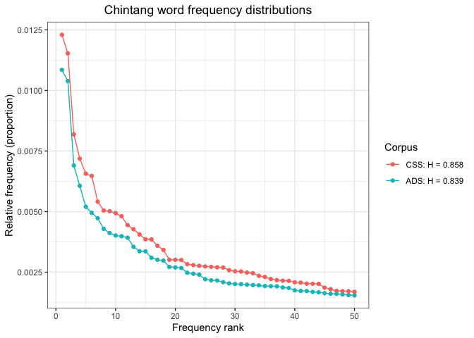
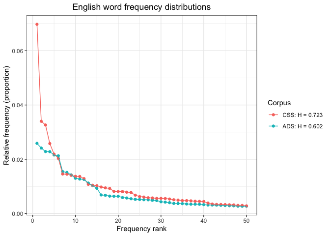

random\_text\_processing
================
Nicholas A. Lester

## Summary

This file processes the variation set count-level data from the randomly
simulated texts.

**Clear memory**

``` r
rm(list=ls(all=T))
```

**Load libraries**

``` r
library(dplyr)
library(tidyr)
library(entropart)
```

**Load data** Random CSS data

``` r
## Words
#### Fuzzy
css.fuzzy.word.rand = read.table("../../Data/Public/random_text_counts/words_w_2_10_m_1_v_z055_counts.csv", sep=",", comment.char="", quote='"', header=T)

#### Strict
css.strict.word.rand = read.table("../../Data/Public/random_text_counts/words_w_2_10_m_1_v_counts.csv", sep=",", comment.char="", quote='"', header=T)

## Morphemes
#### Fuzzy
css.fuzzy.morph.rand = read.table("../../Data/Public/random_text_counts/morphemes_w_2_10_m_1_v_z055_morph_counts.csv", sep=",", comment.char="", quote='"', header=T)

#### Strict
css.strict.morph.rand = read.table("../../Data/Public/random_text_counts/morphemes_w_2_10_m_1_v_morph_counts.csv", sep=",", comment.char="", quote='"', header=T)
```

Random ADS data

``` r
## English
#### fuzzy
ads.eng.fuzzy.rand = read.table("../../Data/Public/random_text_counts/words_ads_eng_w_2_10_m_1_v_z055_counts.csv", sep=",", comment.char="", quote='"', header=T)

ads.eng.fuzzy.rand = ads.eng.fuzzy.rand %>%
                     mutate(corpus = "English_Adults",
                            random = "random",
                            level.of.analysis = "word")
#### strict
ads.eng.strict.rand = read.table("../../Data/Public/random_text_counts/words_ads_eng_w_2_10_m_1_v_counts.csv", sep=",", comment.char="", quote='"', header=T)

ads.eng.strict.rand = ads.eng.strict.rand %>%
                      mutate(corpus = "English_Adults",
                            random = "random",
                            level.of.analysis = "word")

## Chintang
#### fuzzy
ads.cnt.fuzzy.rand = read.table("../../Data/Public/random_text_counts/words_ads_cnt_w_2_10_m_1_v_z055_counts.csv", sep=",", comment.char="", quote='"', header=T)

ads.cnt.fuzzy.rand = ads.cnt.fuzzy.rand %>%
                     mutate(corpus = "Chintang_Adults",
                            random = "random",
                            level.of.analysis = "word")
#### strict
ads.cnt.strict.rand = read.table("../../Data/Public/random_text_counts/words_ads_cnt_w_2_10_m_1_v_counts.csv", sep=",", comment.char="", quote='"', header=T)

ads.cnt.strict.rand = ads.cnt.strict.rand %>%
                      mutate(corpus = "Chintang_Adults",
                            random = "random",
                            level.of.analysis = "word")
```

Source data (for merging corpus information)

``` r
load("../../Data/Private/random_texts.Rdata")
```

Original dataset

``` r
load("../../Data/Public/modeling_data.Rdata")

original = final.dataset %>%
           mutate(random = "original")
```

Add corpus info to CSS

``` r
# Prepare the source data for merging
## CSS
morphemes = morphemes %>% select(session_id_fk, corpus) %>%
                          rename(session_id = session_id_fk) %>%
                          distinct()

words = words %>% select(session_id_fk, corpus) %>%
                  rename(session_id = session_id_fk) %>%
                  distinct()

# CSS
## Words
#### Fuzzy
css.fuzzy.word.rand = left_join(css.fuzzy.word.rand, words) %>%
                      mutate(random = "random",
                             level.of.analysis = "word")

#### Strict
css.strict.word.rand = left_join(css.strict.word.rand, words) %>%
                      mutate(random = "random",
                             level.of.analysis = "word")

## Morphemes
#### Fuzzy
css.fuzzy.morph.rand = left_join(css.fuzzy.morph.rand, morphemes) %>%
                      mutate(random = "random",
                             level.of.analysis = "morpheme")

#### Strict
css.strict.morph.rand = left_join(css.strict.morph.rand, morphemes) %>%
                      mutate(random = "random",
                             level.of.analysis = "morpheme")
```

Add additional measures

``` r
add.measures = original %>%
               select(corpus,
                      target.child,
                      session_id, 
                      number.of.speakers.scaled, 
                      number.of.utterances.scaled,
                      mean.nv.lens.words.scaled,
                      mean.nv.lens.morphs.scaled,
                      MLUw.scaled,
                      MLUm.scaled,
                      PC1_morpheme,
                      PC1_word,
                      PC.word.groups,
                      PC.morpheme.groups,
                      age.groups,
                      MLUw.groups,
                      MLUm.groups,
                      WordEnt.groups,
                      MorphEnt.groups,
                      old_id,
                      logAge.scaled,
                      WordEnt.scaled,
                      MorphEnt.scaled) %>%
              mutate(session_id = old_id) %>%
              distinct()

# CSS
## Words
#### Fuzzy
css.fuzzy.word.rand = left_join(css.fuzzy.word.rand, add.measures,
                                by = c("corpus", "session_id"))

#### Strict
css.strict.word.rand = left_join(css.strict.word.rand, add.measures,
                                 by = c("corpus", "session_id"))

## Morphemes
#### Fuzzy
css.fuzzy.morph.rand = left_join(css.fuzzy.morph.rand, add.measures,
                                  by = c("corpus", "session_id"))
#### Strict
css.strict.morph.rand = left_join(css.strict.morph.rand, add.measures,
                                  by = c("corpus", "session_id"))

# ADS
## English
#### Fuzzy
ads.eng.fuzzy.rand = left_join(ads.eng.fuzzy.rand, add.measures, by = c("corpus", "session_id"))

#### Strict
ads.eng.strict.rand = left_join(ads.eng.strict.rand, add.measures, by = c("corpus", "session_id"))

## Chintang
#### Fuzzy
ads.cnt.fuzzy.rand = left_join(ads.cnt.fuzzy.rand, add.measures, by = c("corpus", "session_id"))

#### Strict
ads.cnt.strict.rand = left_join(ads.cnt.strict.rand, add.measures, by = c("corpus", "session_id"))
```

**Functions**

``` r
# Compute variation set proportions
vs.prop.fnc = function(df, match.type){
    new.df = df %>% 
             gather(type, match, 3:11) %>%
             separate(type, c("match_type", 
                              "window_size", 
                              "num_match"), "_") %>%
             mutate(vs_percentage = match/total_utterances)

    new.df$match_type = as.factor(rep(match.type, nrow(new.df)))
    
    new.df = new.df %>%
             filter(window_size > 1 & is.finite(vs_percentage)) %>%
             mutate(logit.vs.percentage = logit(vs_percentage)) %>%
             as.data.frame()

    return(new.df)
}

# Transform probabilities into {-inf, inf} scale
logit = function(p){
  return(log(p/(1-p)))
}
```

**Compute VS proportions** CSS

``` r
# Words
## Fuzzy
css.fuzzy.word.rand = vs.prop.fnc(css.fuzzy.word.rand, "fuzzy")

## Strict
css.strict.word.rand = vs.prop.fnc(css.strict.word.rand, "strict")

# Morphemes
## Fuzzy
css.fuzzy.morph.rand = vs.prop.fnc(css.fuzzy.morph.rand, "fuzzy")

## Strict
css.strict.morph.rand = vs.prop.fnc(css.strict.morph.rand, "strict")
```

ADS

``` r
# English
## Fuzzy
ads.eng.fuzzy.rand = vs.prop.fnc(ads.eng.fuzzy.rand, "fuzzy")

## Strict
ads.eng.strict.rand = vs.prop.fnc(ads.eng.strict.rand, "strict")

# Chintang
## Fuzzy
ads.cnt.fuzzy.rand = vs.prop.fnc(ads.cnt.fuzzy.rand, "fuzzy")

## Strict
ads.cnt.strict.rand = vs.prop.fnc(ads.cnt.strict.rand, "strict")
```

Join the random and original data

``` r
# Random
## CSS
all.css.rand = bind_rows(css.fuzzy.word.rand,
                         css.strict.word.rand,
                         css.fuzzy.morph.rand,
                         css.strict.morph.rand) %>%
                mutate(window_size = as.numeric(window_size))

## ADS
all.ads.rand = bind_rows(ads.eng.fuzzy.rand,
                         ads.eng.strict.rand,
                         ads.cnt.fuzzy.rand,
                         ads.cnt.strict.rand) %>%
               mutate(window_size = as.numeric(window_size))

# Join with original
all.data = rbind(all.css.rand, 
                 all.ads.rand,
                 original %>% 
                    select(colnames(all.ads.rand)))

# Clean up
## Reorder the data
all.data = all.data[with(all.data, order(corpus, random, level.of.analysis, session_id, match_type, window_size)),]

## Create unique session ids
all.data$unique.session.id = cumsum(c(1,as.numeric(diff(all.data$session_id))!=0))

## Save
all.data.rand = all.data; rm(all.data)
save(all.data.rand, file = "../../Data/Public/modeling_data_random.Rdata")
```

**Rank v. Frequency (relative) plots** First, we get the words.

``` r
# Load the Chintang and English raw word data for CSS and ADS
## CSS
load("../../Data/Private/acqdiv_data.Rdata")
css.words = words %>%
            left_join(utterances %>% 
                      select(utterance_id, uniquespeaker_id_fk, session_id_fk) %>%
                      rename(utterance_id_fk = utterance_id) %>%
                      left_join(speakers %>%
                                select(uniquespeaker_id_fk, macrorole, session_id_fk),
                                by = c("session_id_fk", "uniquespeaker_id_fk")),
                      by = c("session_id_fk", "utterance_id_fk")) %>%
            filter(macrorole == "Adult") %>%
            select(word, corpus, pos_word_ud, session_id_fk) %>%
            filter(pos_word_ud %in% c("NOUN", "VERB"),
                   corpus %in% c("Chintang", "English_Manchester1"))
            
rm(morphemes, sessions, speakers, utterances, words)

## ADS
load("../../Data/Private/ads.acqdiv.format.Rdata")

ads.words = bind_rows(words.ads.cnt, words.ads.eng) %>%
            select(word, corpus, pos_word_ud) %>%
            filter(pos_word_ud %in% c("NOUN", "VERB"))

rm(speakers.ads.cnt, speakers.ads.eng, utterances.ads.cnt, utterances.ads.eng, words.ads.cnt, words.ads.eng)
```

Next, we compute frequencies and ranks for nouns and verbs (pooled
together).

``` r
# CSS
css.freq.rank = css.words %>%
                group_by(corpus, word) %>%
                summarize(freq = n()) %>%
                group_by(corpus) %>%
                mutate(freq.rank = rank(-freq, ties.method = "random"),
                       relative.freq = freq/sum(freq)) %>%
                arrange(corpus, freq.rank)


# ADS
ads.freq.rank = ads.words %>%
                group_by(corpus, word) %>%
                summarize(freq = n()) %>%
                group_by(corpus) %>%
                mutate(freq.rank = rank(-freq, ties.method = "random"),
                       relative.freq = freq/sum(freq)) %>%
                arrange(corpus, freq.rank)

## Also by session; the goal here is to see how
## the entropies of the input from adults change
## over time
## -- not sure why, but the trends are negative
## m = lmer(Hcwj ~ logAge.scaled*corpus + (1|target.child), data = css.freq.by.session)
## This could help to explain why Chintang VS estimates go up in CSS, even in 
## the random data: there is a background shift in lexical diversity in the 
## input. But why? Maybe CSS is less geared towards the child early, but 
## as the child begins to speak and interact in more complex ways, language becomes
## implicitly tailored (simplified) for them.
css.freq.by.session = css.words %>%
                      group_by(corpus, session_id_fk, word) %>%
                      summarize(freq = n()) %>%
                      group_by(corpus, session_id_fk) %>%
                      mutate(freq.rank = rank(-freq, ties.method = "random"),
                             relative.freq = freq/sum(freq),
                             Hcwj = bcShannon(freq)) %>%
                      arrange(corpus, session_id_fk, freq.rank) %>%
                      select(corpus, session_id_fk, Hcwj) %>%
                      distinct() %>%
                      left_join(final.dataset %>% 
                                select(session_id, target.child, logAge.scaled) %>%
                                rename(session_id_fk = session_id),
                                by = "session_id_fk")
```

Now we can plot (we also compute entropies overall to get an idea about
the relative skewedness of the distributions).

``` r
library(ggplot2)
library(entropart)

# Chintang
## Extract data
cnt.plot.dat = bind_rows(css.freq.rank %>% filter(corpus == "Chintang"),
                         ads.freq.rank %>% filter(corpus == "Chintang_Adults"))

## Compute entropy
cnt.ent.ads = bcShannon(cnt.plot.dat$freq[cnt.plot.dat$corpus == "Chintang_Adults"])/log(length(cnt.plot.dat$freq[cnt.plot.dat$corpus == "Chintang_Adults"]))

cnt.ent.css = bcShannon(cnt.plot.dat$freq[cnt.plot.dat$corpus == "Chintang"])/log(length(cnt.plot.dat$freq[cnt.plot.dat$corpus == "Chintang"]))

## Plot
cnt.plot = ggplot(cnt.plot.dat %>% filter(freq.rank <= 50), aes(x = freq.rank, y = relative.freq, color = corpus)) +
          geom_point() +
          geom_line() +
          ylab("Relative frequency (proportion)") +
          xlab("Frequency rank") + 
          ggtitle("Chintang word frequency distributions") + 
          scale_color_discrete(name = "Corpus", labels = c(paste0("CSS: H = ", round(cnt.ent.css, 3)), paste0("ADS: H = ", round(cnt.ent.ads, 3)))) +
          theme_bw() +
          theme(plot.title = element_text(hjust=0.5))

cnt.plot
```

<!-- -->

``` r
# English
## Extract data
eng.plot.dat = bind_rows(css.freq.rank %>% filter(corpus == "English_Manchester1"),
                         ads.freq.rank %>% filter(corpus == "English_Adults"))

## Compute entropy
eng.ent.ads = bcShannon(eng.plot.dat$freq[eng.plot.dat$corpus == "English_Adults"])/log(length(eng.plot.dat$freq[eng.plot.dat$corpus == "English_Adults"]))

eng.ent.css = bcShannon(eng.plot.dat$freq[eng.plot.dat$corpus == "English_Manchester1"])/log(length(eng.plot.dat$freq[eng.plot.dat$corpus == "English_Manchester1"]))

## Plot
eng.plot = ggplot(eng.plot.dat %>% filter(freq.rank <= 50), aes(x = freq.rank, y = relative.freq, color = corpus)) +
          geom_point() +
          geom_line() +
          ylab("Relative frequency (proportion)") +
          xlab("Frequency rank") + 
          ggtitle("English word frequency distributions") + 
          scale_color_discrete(name = "Corpus", labels = c(paste0("CSS: H = ", round(eng.ent.css, 3)), paste0("ADS: H = ", round(eng.ent.ads, 3)))) +
          theme_bw() +
          theme(plot.title = element_text(hjust=0.5))

eng.plot
```

<!-- -->
For both languages, CSS shows higher normalized entropy than ADS (i.e.,
it is richer in lexical diversity, word for word). The rank graphs show
that for the top 50 most frequent nouns and verbs, CSS frequncies
decline less rapidly, particularly for the most frequent words.

TODO: Get the by-session CSS lexical entropies and plot against VS
percentage for each language.

Here we ask to what extent the lexical entropy of the CSS in any given
session affects the VS percentage (note that this measure is computed in
the same manner as our measure of development; however, we now apply it
to the adult-produced CSS rather than the child’s own speech).

``` r
css.ents = css.words %>%
           group_by(corpus, session_id_fk, word) %>%
           summarize(freq = n()) %>%
           group_by(corpus, session_id_fk) %>%
           summarize(ent = bcShannon(freq)/nrow(.)) %>%
           as.data.frame()

css.ents.plus = css.ents %>%
                left_join(., add.measures %>%
                             rename(session_id_fk = old_id), 
                          by = c("corpus", "session_id_fk"))
```
