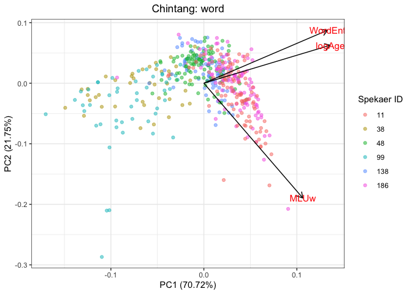
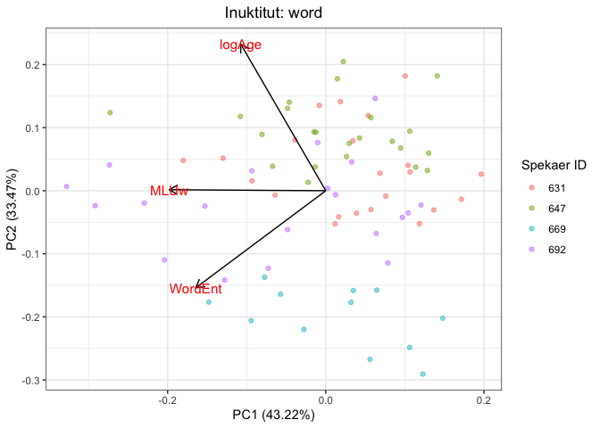
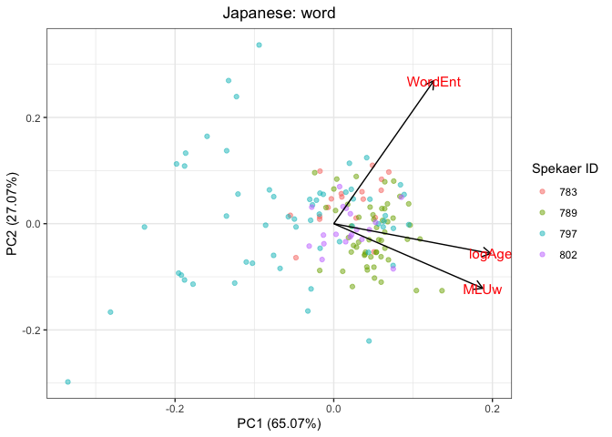
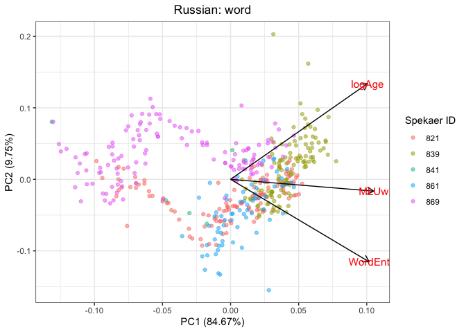
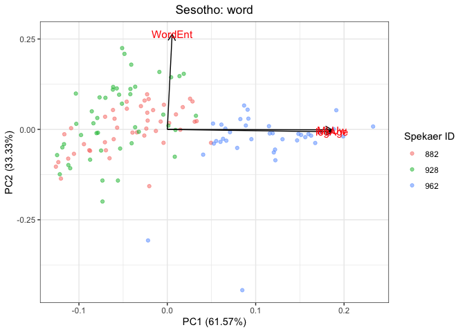
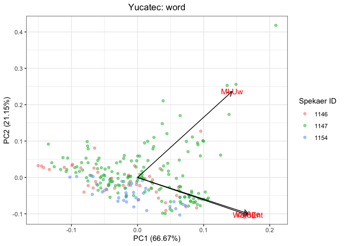
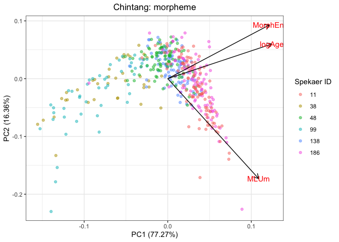
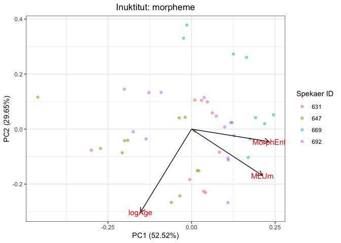
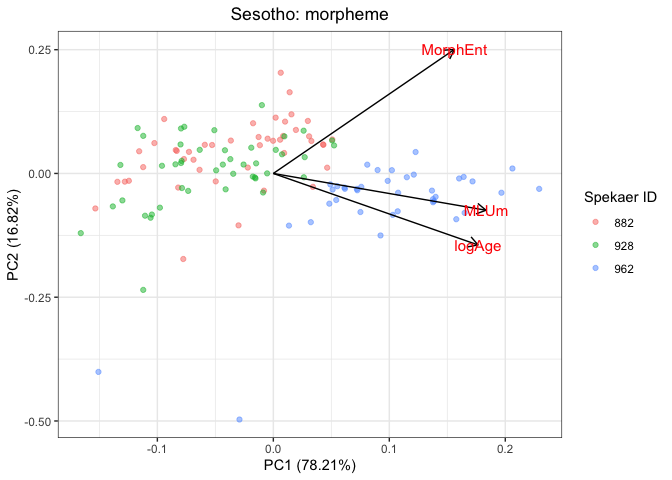
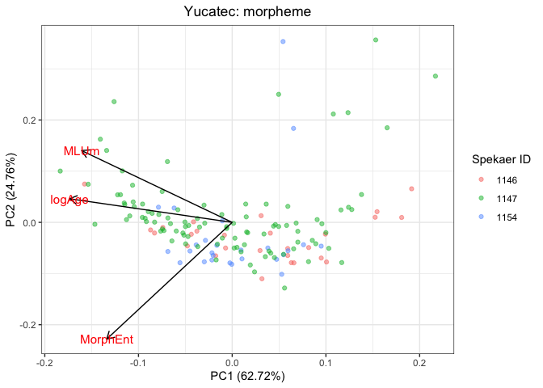

(For second revision, Cognition)
================
Nicholas A. Lester

## Summary

This file prepares the ACQDIV-based counts of variation sets for
analysis.

## Preliminaries

**Clear memory**

**Load libraries**

``` r
library(dplyr)
library(tidyr)
library(ggplot2)
library(entropart)
library(ggfortify)
```

**Load the data**  
Child-surrounding speech (CSS)

``` r
# Corpus mapping (links session ids to corpus name)
corpus = read.csv("../Data/Public/session_id_labels.csv")

#######
# Words
#######
# Fuzzy data
fuzzy = read.csv("../Data/Public/acqdiv_fuzzy_raw.csv")

# Strict data
strict = read.csv("../Data/Public/acqdiv_strict_raw.csv")

# Find the all-zero rows
zero.rows.fuzzy = rowSums(fuzzy[, -c(1, 2)]) == 0
zero.rows.strict = rowSums(strict[, -c(1, 2)]) == 0

## Merge in corpus info
fuzzy = left_join(fuzzy, corpus, by = "session_id")
strict = left_join(strict, corpus, by = "session_id")

# Age and speaker ID info
old.fuzzy = read.table(file = "../Data/Public/w2_10_m1_4_v_z055.txt", header = T, sep = "\t", comment.char = "", quote = "")

old.strict = read.table(file = "../Data/Public/w2_10_m1_4_v.txt", header = T, sep = "\t", comment.char = "", quote = "")

old.strict$match_type = as.factor(rep("strict", nrow(old.strict)))

# Old raw tables to find all-0 rows
## Fuzzy
zero.rows.old.fuzzy = old.fuzzy %>% filter(num_match==1) %>%
                      group_by(session_id) %>%
                      summarize(zeroCount = all(match==0))

## Strict
zero.rows.old.strict = old.strict %>% filter(num_match==1) %>%
                       group_by(session_id) %>%
                       summarize(zeroCount = all(match==0))

###########
# Morphemes
###########
fuzzy.morph = read.csv("../Data/Public/acqdiv_fuzzy_morphs.csv")

strict.morph = read.csv("../Data/Public/acqdiv_strict_morphs.csv")

# Find all-zero rows
zero.rows.fuzzy.morph = rowSums(fuzzy.morph[, -c(1, 2)]) == 0
zero.rows.strict.morph = rowSums(strict.morph[, -c(1, 2)]) == 0

# Merge in corpus info
fuzzy.morph = left_join(fuzzy.morph, corpus, by = "session_id")

strict.morph = left_join(strict.morph, corpus, by = "session_id")

# Load old morpheme data
old.fuzzy.morph = read.table("../Data/Public/w2_10_m1_4_v_z055_morph.txt", sep="\t", header=T, comment.char="", quote="")

old.strict.morph = read.table("../Data/Public/w2_10_m1_4_v_morph.txt", sep="\t", header=T, comment.char="", quote="")

old.strict.morph$match_type = as.factor(rep("strict",
                                            nrow(old.strict.morph)))

# Old raw tables to find all-zero rows
## Fuzzy
zero.rows.old.fuzzy.morph = old.fuzzy.morph %>% 
                            filter(num_match==1) %>%
                            group_by(session_id) %>%
                            summarize(zeroCount = all(match==0))

## Strict
zero.rows.old.strict.morph = old.strict.morph %>% 
                             filter(num_match==1) %>%
                             group_by(session_id) %>%
                             summarize(zeroCount = all(match==0))
```

ACQDIV database

``` r
load("../Data/Private/acqdiv_data.Rdata")
speakers.css = speakers; rm(speakers)
utterances.css = utterances; rm(utterances)
words.css = words; rm(words)
sessions.css = sessions; rm(sessions)
morphemes.css = morphemes; rm(morphemes)
rm(all_data)
```

Adult-directed speech (ADS)

``` r
# Fuzzy matches, English 
fuzzy.ads.eng = read.csv(file = "../Data/Public/bnc_fuzzy.csv")
fuzzy.ads.eng$corpus = rep("English_Adults", nrow(fuzzy.ads.eng))

# Strict matches, English
strict.ads.eng = read.csv(file = "../Data/Public/bnc_strict.csv")
strict.ads.eng$corpus = rep("English_Adults", nrow(strict.ads.eng))

# Fuzzy matches, Chintang 
fuzzy.ads.cnt = read.csv(file = "../Data/Public/chintang_fuzzy.csv")
fuzzy.ads.cnt$corpus = rep("Chintang_Adults", nrow(fuzzy.ads.cnt))

# Strict matches, Chintang
strict.ads.cnt = read.csv(file = "../Data/Public/chintang_strict.csv")
strict.ads.cnt$corpus = rep("Chintang_Adults", nrow(strict.ads.cnt))

# Load the BNC database for adult data
load("../Data/Public/bnc_data.Rdata")
speakers.ads.eng = speakers; rm(speakers)
utterances.ads.eng = utterances; rm(utterances)
words.ads.eng = words; rm(words)

# Load Chintang adult data
load("../Data/Private/chintang_acqdiv_format.Rdata")
speakers.ads.cnt = speakers; rm(speakers)
utterances.ads.cnt = utterances; rm(utterances)
words.ads.cnt = words; rm(words)
sessions.ads.cnt = sessions; rm(sessions)

## Make sure the dataframes conform to ACQDIV
#### English
###### Speakers
#setdiff(colnames(speakers.css), colnames(speakers.ads.eng))
#setdiff(colnames(speakers.ads.eng), colnames(speakers.css))
#colnames(speakers.ads.eng); colnames(speakers.css)
speakers.ads.eng = speakers.ads.eng %>%
                   mutate(uniquespeaker_id_fk = speaker_id) %>%
                   select(colnames(speakers.css))

###### Utterances
#setdiff(colnames(utterances.css), colnames(utterances.ads.eng))
#setdiff(colnames(utterances.ads.eng), colnames(utterances.css))
#colnames(utterances.ads.eng); colnames(utterances.css) # good

###### Words
#setdiff(colnames(words.css), colnames(words.ads.eng))
#setdiff(colnames(words.ads.eng), colnames(words.css))
#colnames(words.ads.eng); colnames(words.css)
words.ads.eng = words.ads.eng %>%
                mutate(word_target = rep(NA, nrow(.))) %>%
                select(colnames(words.css))

#### Chintang
###### Speakers
#setdiff(colnames(speakers.css), colnames(speakers.ads.cnt))
#setdiff(colnames(speakers.ads.cnt), colnames(speakers.css))
#colnames(speakers.ads.cnt); colnames(speakers.css)
speakers.ads.cnt = speakers.ads.cnt %>%
                   mutate(speaker_id = uniquespeaker_id_fk,
                          corpus = rep("Chintang_Adults", nrow(.)),
                          language = rep("Chintang", nrow(.)),
                          speaker_label = uniquespeaker_id_fk,
                          name = uniquespeaker_id_fk,
                          gender_raw = rep(NA, nrow(.)),
                          gender = rep(NA, nrow(.)),
                          birthdate = rep(NA, nrow(.))) %>%
                   select(colnames(speakers.css))

###### Utterances
#setdiff(colnames(utterances.css), colnames(utterances.ads.cnt))
#setdiff(colnames(utterances.ads.cnt), colnames(utterances.css))
#colnames(utterances.ads.cnt); colnames(utterances.css)
utterances.ads.cnt = utterances.ads.cnt %>%
                     mutate(utterance_id = id,
                            utterance_id_source = source_id,
                            uniquespeaker_id_fk = speaker_id_fk,
                            corpus = rep("Chintang_Adults", nrow(.)),
                            language = rep("Chintang", nrow(.)),
                            speaker_label = uniquespeaker_id_fk,
                            addressee = addressee_id_fk,
                            utterance_morphemes = morpheme,
                            utterance_gloses_raw = gloss_raw,
                            utterance_poses_raw = pos_raw,
                            warning = rep(NA, nrow(.))) %>%
                    select(colnames(utterances.css))

###### Words
#setdiff(colnames(words.css), colnames(words.ads.cnt))
#setdiff(colnames(words.ads.cnt), colnames(words.css))
#colnames(words.ads.eng); colnames(words.css) 
words.ads.cnt = words.ads.cnt %>%
                left_join(., utterances.ads.cnt %>% 
                             select(utterance_id, session_id_fk) %>%
                             rename(utterance_id_fk = utterance_id),
                          by = "utterance_id_fk") %>%
                mutate(word_id = id,
                       corpus = rep("Chintang_Adults", nrow(.)),
                       word_language = rep("Chintang", nrow(.)),
                       pos_word_stem = pos,
                       pos_word_ud = pos_ud,
                       warning = rep(NA, nrow(.))) %>%
                select(colnames(words.css))

save(words.ads.cnt, words.ads.eng, utterances.ads.cnt, utterances.ads.eng, speakers.ads.cnt, speakers.ads.eng, file = "../Data/Private/ads.acqdiv.format.Rdata")
```

**Functions**  
Various functions for processing the data

``` r
# Compute variation set proportions
vs.prop.fnc = function(df, match.type){
    new.df = df %>% 
             gather(type, match, 3:(ncol(df)-1)) %>%
             separate(type, c("match_type", 
                              "window_size", 
                              "num_match"), "_") %>%
             mutate(vs_percentage = match/total_utterances)

    new.df$match_type = as.factor(rep(match.type, nrow(new.df)))
    
    new.df = new.df %>%
             filter(window_size > 1) %>%
             as.data.frame()

    return(new.df)
}

# PCA analysis
pca.fnc = function(df, language, level.of.analysis){
  if(level.of.analysis == "word"){
      cols = c(1:4, 6, 9)
  } 
  else{
      cols = c(1:3, 5, 7, 9)
  }
  
  pca.dat = df %>% 
            filter(corpus == language) %>%
            dplyr::select(cols) %>%
            na.omit()
  
  pca.dat$target.child = as.factor(pca.dat$target.child)
  
  pca = prcomp(pca.dat[,-c(1:3)], scale=T, center=T)
  
  if(language=="English_Manchester1"){
      language = "English"
  }
  else if(language=="Japanese_MiiPro"){
      language = "Japanese"
  }
  
  pca.plot = autoplot(pca, 
                      data=pca.dat, 
                      colour="target.child", 
                      loadings=T, 
                      loadings.label=T, 
                      loadings.colour="black", 
                      loadings.label.size = 4, 
                      alpha=0.5) +
             labs(colour = "Spekaer ID") +
             theme_bw() + 
             ggtitle(paste0(language, ": ", level.of.analysis)) + 
             theme(plot.title=element_text(hjust=0.5))

  pca.dat = bind_cols(pca.dat, as.data.frame(pca$x))
  
  return(list(pca, pca.dat, pca.plot))
}

# Cut variables into 3 equally sized chunks (age, MLU, etc)
grouping.fnc = function(var){
  new.col = cut_number(var, 3)
  return(new.col)
}

# Detect and label outliers
outlier.fnc = function(col){
    # Using the IQR criterion
    IQR.outliers = boxplot.stats(col)$out
    IQR.outlier.labels = as.factor(ifelse(col %in% IQR.outliers, "yes", "no"))
    
    # Using 2*Standard deviation above/below mean
    finite.col = col[is.finite(col)]
    mean.col = mean(finite.col, na.rm=T)
    sd.upp = mean.col + sd(finite.col, na.rm=T)
    sd.low = mean.col - sd(finite.col, na.rm=T)
    sd.outlier.labels = as.factor(ifelse(col<sd.low | col>sd.upp, "yes", "no"))
    
    # Merge the results
    out.df = bind_cols(IQR.outliers = IQR.outlier.labels, SD.outliers = sd.outlier.labels)
    
    # Return the values
    return(out.df)
}

# Transform probabilities into {-inf, inf} scale
logit = function(p){
  return(log(p/(1-p)))
}
```

## Processing

**Derive VS percentages**  
Get the proportion of utterances belonging to variation sets in each
session.

CSS

``` r
# Words
## Fuzzy matches
fuzzy = vs.prop.fnc(fuzzy, "fuzzy")

## Strict matches
strict = vs.prop.fnc(strict, "strict")

# Morphemes
## Fuzzy matches
fuzzy.morph = vs.prop.fnc(fuzzy.morph, "fuzzy")

## Strict matches
strict.morph = vs.prop.fnc(strict.morph, "strict")
```

ADS

``` r
# English
## Fuzzy matches
fuzzy.ads.eng = vs.prop.fnc(fuzzy.ads.eng, "fuzzy")

## Strict matches
strict.ads.eng = vs.prop.fnc(strict.ads.eng, "strict")

# Chintang
## Fuzzy matches
fuzzy.ads.cnt = vs.prop.fnc(fuzzy.ads.cnt, "fuzzy")

## Strict matches
strict.ads.cnt = vs.prop.fnc(strict.ads.cnt, "strict")
```

**Align the original CSS data with the new data**  
Making sure that all session ids and languages align properly across the
samples.

``` r
# Cleaning old data
## Restrict to single matches (what we analyze here)
old.fuzzy = old.fuzzy %>%
            filter(num_match == 1)

old.strict = old.strict %>%
             filter(num_match == 1)

## Re-order by corpus (alphabetically) and window size
old.fuzzy = old.fuzzy[with(old.fuzzy, order(corpus, session_id)),]

old.strict = old.strict[with(old.strict, order(corpus, session_id)),]

## See if we have compatible datasets
table(unique(fuzzy[,c("session_id", "corpus")])$corpus)
```

    ## 
    ##            Chintang                Cree English_Manchester1 
    ##                 473                  25                 804 
    ##          Indonesian           Inuktitut     Japanese_MiiPro 
    ##                 990                  75                 192 
    ##     Japanese_Miyata             Ku_Waru              Nungon 
    ##                 213                   9                   4 
    ##               Qaqet             Russian             Sesotho 
    ##                  99                 447                  69 
    ##           Tuatschin             Turkish             Yucatec 
    ##                  48                 373                 233

``` r
table(unique(old.fuzzy[,c("session_id", "corpus")])$corpus)
```

    ## 
    ##            Chintang                Cree English_Manchester1 
    ##                 473                  41                 804 
    ##          Indonesian           Inuktitut     Japanese_MiiPro 
    ##                 990                  75                 148 
    ##     Japanese_Miyata             Russian             Sesotho 
    ##                 214                 447                 129 
    ##             Turkish             Yucatec 
    ##                 373                 233

``` r
# They are not: 
## Cree (> old)
## Japanese_MiiPro (> new)
## Japanese_Miyata (> old)
## Sesotho (> old) 

# Align the languages we can using the order of utterance counts
## Chintang
cnt.new = fuzzy %>% filter(corpus == "Chintang")
cnt.new.sess = unique(cnt.new[, c("session_id", "total_utterances"),])

cnt.old = old.fuzzy %>% filter(corpus == "Chintang")
cnt.old.sess = unique(cnt.old[, c("session_id", "total_utterances"),])

head(cnt.new.sess)
```

    ##   session_id total_utterances
    ## 1          1              175
    ## 2          2              526
    ## 3          3              968
    ## 4          4              565
    ## 5          5              413
    ## 6          6              683

``` r
head(cnt.old.sess)
```

    ##    session_id total_utterances
    ## 1           1              175
    ## 10          2              526
    ## 19          3              968
    ## 28          4              565
    ## 37          5              413
    ## 46          6              683

``` r
tail(cnt.new.sess)
```

    ##     session_id total_utterances
    ## 468        472              343
    ## 469        473              401
    ## 470        474              229
    ## 471        475              417
    ## 472        476              368
    ## 473        477              810

``` r
tail(cnt.old.sess) # Looks good
```

    ##      session_id total_utterances
    ## 4204        472              343
    ## 4213        473              401
    ## 4222        474              229
    ## 4231        475              417
    ## 4240        476              368
    ## 4249        477              810

``` r
cnt.new.sess$new_id = seq(1:nrow(cnt.new.sess))
cnt.old.sess$new_id = seq(1:nrow(cnt.old.sess))

cnt.new.sess$old_id = cnt.old.sess$session_id

cnt.comp = merge(cnt.new.sess, unique(old.fuzzy[, c("session_id", "age_in_days", "unique_speaker_id"),]), by.x = "old_id", by.y = "session_id")

## English
eng.new = fuzzy %>% filter(corpus == "English_Manchester1")
eng.new.sess = unique(eng.new[, c("session_id", "total_utterances"),])

eng.old = old.fuzzy %>% filter(corpus == "English_Manchester1")
eng.old.sess = unique(eng.old[, c("session_id", "total_utterances"),])

head(eng.new.sess)
```

    ##   session_id total_utterances
    ## 1        503              434
    ## 2        504              475
    ## 3        505              626
    ## 4        506              454
    ## 5        507              565
    ## 6        508              572

``` r
head(eng.old.sess)
```

    ##    session_id total_utterances
    ## 1        3154              434
    ## 10       3155              475
    ## 19       3156              626
    ## 28       3157              454
    ## 37       3158              565
    ## 46       3159              572

``` r
tail(eng.new.sess)
```

    ##     session_id total_utterances
    ## 799       1301              368
    ## 800       1302              362
    ## 801       1303              380
    ## 802       1304              417
    ## 803       1305              394
    ## 804       1306              430

``` r
tail(eng.old.sess) # Looks good
```

    ##      session_id total_utterances
    ## 7183       3952              368
    ## 7192       3953              362
    ## 7201       3954              380
    ## 7210       3955              417
    ## 7219       3956              394
    ## 7228       3957              430

``` r
eng.new.sess$new_id = seq(1:nrow(eng.new.sess))
eng.old.sess$new_id = seq(1:nrow(eng.old.sess))

eng.new.sess$old_id = eng.old.sess$session_id

eng.comp = merge(eng.new.sess, unique(old.fuzzy[, c("session_id", "age_in_days", "unique_speaker_id"),]), by.x = "old_id", by.y = "session_id")

## Inuktitut
ink.new = fuzzy %>% filter(corpus == "Inuktitut")
ink.new.sess = unique(ink.new[, c("session_id", "total_utterances"),])

ink.old = old.fuzzy %>% filter(corpus == "Inuktitut")
ink.old.sess = unique(ink.old[, c("session_id", "total_utterances"),])

head(ink.new.sess)
```

    ##   session_id total_utterances
    ## 1       2304               16
    ## 2       2305              157
    ## 3       2306              179
    ## 4       2307              106
    ## 5       2308               83
    ## 6       2309               21

``` r
head(ink.old.sess)
```

    ##    session_id total_utterances
    ## 1        1525               16
    ## 10       1526              157
    ## 19       1527              179
    ## 28       1528              106
    ## 37       1529               78
    ## 46       1530               21

``` r
tail(ink.new.sess)
```

    ##    session_id total_utterances
    ## 70       2375               45
    ## 71       2376               51
    ## 72       2377               37
    ## 73       2378              385
    ## 74       2379              188
    ## 75       2380               65

``` r
tail(ink.old.sess) # Looks good
```

    ##     session_id total_utterances
    ## 622       1596               45
    ## 631       1597               51
    ## 640       1598               37
    ## 649       1599              385
    ## 658       1600              188
    ## 667       1601               65

``` r
ink.new.sess$new_id = seq(1:nrow(ink.new.sess))
ink.old.sess$new_id = seq(1:nrow(ink.old.sess))

ink.new.sess$old_id = ink.old.sess$session_id

ink.comp = merge(ink.new.sess, unique(old.fuzzy[, c("session_id", "age_in_days", "unique_speaker_id"),]), by.x = "old_id", by.y = "session_id")

## Russian
rus.new = fuzzy %>% filter(corpus == "Russian")
rus.new.sess = unique(rus.new[, c("session_id", "total_utterances"),])

rus.old = old.fuzzy %>% filter(corpus == "Russian")
rus.old.sess = unique(rus.old[, c("session_id", "total_utterances"),])

head(rus.new.sess)
```

    ##   session_id total_utterances
    ## 1       2905              255
    ## 2       2906              683
    ## 3       2907              648
    ## 4       2908              526
    ## 5       2909              698
    ## 6       2910              616

``` r
head(rus.old.sess)
```

    ##    session_id total_utterances
    ## 1        1964              255
    ## 10       1965              683
    ## 19       1966              648
    ## 28       1967              526
    ## 37       1968              698
    ## 46       1969              616

``` r
tail(rus.new.sess)
```

    ##     session_id total_utterances
    ## 442       3349             1597
    ## 443       3350             1261
    ## 444       3351              474
    ## 445       3352             1488
    ## 446       3353             1042
    ## 447       3354             1174

``` r
tail(rus.old.sess) # Looks good
```

    ##      session_id total_utterances
    ## 3970       2408             1597
    ## 3979       2409             1261
    ## 3988       2410              474
    ## 3997       2411             1488
    ## 4006       2412             1042
    ## 4015       2413             1174

``` r
rus.new.sess$new_id = seq(1:nrow(rus.new.sess))
rus.old.sess$new_id = seq(1:nrow(rus.old.sess))

rus.new.sess$old_id = rus.old.sess$session_id

rus.comp = merge(rus.new.sess, unique(old.fuzzy[, c("session_id", "age_in_days", "unique_speaker_id"),]), by.x = "old_id", by.y = "session_id")

## Turkish
tur.new = fuzzy %>% filter(corpus == "Turkish")
tur.new.sess = unique(tur.new[, c("session_id", "total_utterances"),])

tur.old = old.fuzzy %>% filter(corpus == "Turkish")
tur.old.sess = unique(tur.old[, c("session_id", "total_utterances"),])

head(tur.new.sess)
```

    ##   session_id total_utterances
    ## 1       3475              715
    ## 2       3476             1443
    ## 3       3477              406
    ## 4       3478              516
    ## 5       3479              670
    ## 6       3480              543

``` r
head(tur.old.sess)
```

    ##    session_id total_utterances
    ## 1        2543              715
    ## 10       2544             1443
    ## 19       2545              406
    ## 28       2546              516
    ## 37       2547              669
    ## 46       2548              543

``` r
tail(tur.new.sess)
```

    ##     session_id total_utterances
    ## 368       3842             1003
    ## 369       3843             1067
    ## 370       3844              803
    ## 371       3845              650
    ## 372       3846              976
    ## 373       3847              780

``` r
tail(tur.old.sess) # Looks good
```

    ##      session_id total_utterances
    ## 3304       2910             1003
    ## 3313       2911             1067
    ## 3322       2912              802
    ## 3331       2913              650
    ## 3340       2914              976
    ## 3349       2915              780

``` r
tur.new.sess$new_id = seq(1:nrow(tur.new.sess))
tur.old.sess$new_id = seq(1:nrow(tur.old.sess))

tur.new.sess$old_id = tur.old.sess$session_id

tur.comp = merge(tur.new.sess, unique(old.fuzzy[, c("session_id", "age_in_days", "unique_speaker_id"),]), by.x = "old_id", by.y = "session_id")

## Yucatec
yuc.new = fuzzy %>% filter(corpus == "Yucatec")
yuc.new.sess = unique(yuc.new[, c("session_id", "total_utterances"),])

yuc.old = old.fuzzy %>% filter(corpus == "Yucatec")
yuc.old.sess = unique(yuc.old[, c("session_id", "total_utterances"),])

head(yuc.new.sess)
```

    ##   session_id total_utterances
    ## 1       3848              212
    ## 2       3849               67
    ## 3       3850              101
    ## 4       3851              204
    ## 5       3852              148
    ## 6       3853              123

``` r
head(yuc.old.sess)
```

    ##    session_id total_utterances
    ## 1        2916              212
    ## 10       2917               67
    ## 19       2918              101
    ## 28       2919              204
    ## 37       2920              148
    ## 46       2921              123

``` r
tail(yuc.new.sess)
```

    ##     session_id total_utterances
    ## 228       4076              144
    ## 229       4077                3
    ## 230       4078               58
    ## 231       4079               56
    ## 232       4080               65
    ## 233       4081               73

``` r
tail(yuc.old.sess) # Looks good
```

    ##      session_id total_utterances
    ## 2044       3144              144
    ## 2053       3145                3
    ## 2062       3146               58
    ## 2071       3147               56
    ## 2080       3148               65
    ## 2089       3149               73

``` r
yuc.new.sess$new_id = seq(1:nrow(yuc.new.sess))
yuc.old.sess$new_id = seq(1:nrow(yuc.old.sess))

yuc.new.sess$old_id = yuc.old.sess$session_id

yuc.comp = merge(yuc.new.sess, unique(old.fuzzy[, c("session_id", "age_in_days", "unique_speaker_id"),]), by.x = "old_id", by.y = "session_id")

# Add the databases together
sess.info = bind_rows(cnt.comp, eng.comp, ink.comp, rus.comp, tur.comp, yuc.comp) %>% select(session_id, age_in_days, unique_speaker_id, old_id)

# Merge session info into new data
new.dat.fuzzy = merge(fuzzy, sess.info, by = "session_id")
new.dat.fuzzy$window_size = as.numeric(new.dat.fuzzy$window_size)
new.dat.fuzzy$num_match = as.numeric(new.dat.fuzzy$num_match)

new.dat.strict = merge(strict, sess.info, by = "session_id")
new.dat.strict$window_size = as.numeric(new.dat.strict$window_size)
new.dat.strict$num_match = as.numeric(new.dat.strict$num_match)

new.dat.strict.morph = merge(strict.morph, sess.info, by = "session_id")
new.dat.strict.morph$window_size = as.numeric(new.dat.strict.morph$window_size)
new.dat.strict.morph$num_match = as.numeric(new.dat.strict.morph$num_match)

new.dat.fuzzy.morph = merge(fuzzy.morph, sess.info, by = "session_id")
new.dat.fuzzy.morph$window_size = as.numeric(new.dat.fuzzy.morph$window_size)
new.dat.fuzzy.morph$num_match = as.numeric(new.dat.fuzzy.morph$num_match)

# Add in the rest of the data
## Words
old.fuzzy$old_id = old.fuzzy$session_id
old.strict$old_id = old.strict$session_id

old.fuzzy = old.fuzzy %>% 
            left_join(., zero.rows.old.fuzzy, by = "session_id") %>%                  filter(zeroCount == FALSE)

old.strict = old.strict %>%
             left_join(., zero.rows.old.strict, by = "session_id") %>%
             filter(zeroCount == FALSE)              

new.dat.fuzzy = bind_rows(new.dat.fuzzy, old.fuzzy[old.fuzzy$corpus %in% c("Sesotho", "Japanese_MiiPro", "Japanese_Miyata"),])

new.dat.strict = bind_rows(new.dat.strict, old.strict[old.strict$corpus %in% c("Sesotho", "Japanese_MiiPro", "Japanese_Miyata"),])

## Morphemes
old.fuzzy.morph$old_id = old.fuzzy.morph$session_id
old.strict.morph$old_id = old.strict.morph$session_id

old.fuzzy.morph = old.fuzzy.morph %>% 
                  left_join(., zero.rows.old.fuzzy.morph, 
                            by = "session_id") %>%            
                            filter(zeroCount == FALSE)

old.strict.morph = old.strict.morph %>%
             left_join(., zero.rows.old.strict.morph, 
                       by = "session_id") %>%
             filter(zeroCount == FALSE)              

new.dat.fuzzy.morph = bind_rows(new.dat.fuzzy.morph, old.fuzzy.morph[old.fuzzy.morph$corpus %in% c("Sesotho"),])

new.dat.strict.morph = bind_rows(new.dat.strict.morph, old.strict.morph[old.strict.morph$corpus %in% c("Sesotho"),])
```

**Number of speakers per file**  
CSS

``` r
# First, isolate the adults
utt.expanded = left_join(utterances.css, speakers.css %>% 
                                     select("macrorole", "uniquespeaker_id_fk") %>%
                                     distinct(), 
                         by="uniquespeaker_id_fk")

## Count the number of unique speakers per session (we treat NA as a single speaker)
counts = utt.expanded %>% 
         select(session_id_fk, speaker_id_fk) %>% 
         distinct() %>%
         group_by(session_id_fk) %>% 
         tally(name = "number.of.speakers")


# Words
## Add to fuzzy
fuzzy.w.counts = left_join(new.dat.fuzzy, counts %>% 
                                          rename(old_id = session_id_fk), 
                           by = "old_id") %>% 
                 select(-zeroCount) %>%
                 rename(target.child = unique_speaker_id) %>%
                 as.data.frame()

## Add to strict
strict.w.counts = left_join(new.dat.strict, counts %>% 
                                            rename(old_id = session_id_fk), 
                            by = "old_id") %>% 
                  select(-zeroCount) %>%
                  rename(target.child = unique_speaker_id) %>%
                  as.data.frame()

# Morphemes
## Add to fuzzy
fuzzy.morph.w.counts = left_join(new.dat.fuzzy.morph, counts %>%
                                                      rename(old_id = session_id_fk), 
                                 by = "old_id")  %>% 
                       select(-zeroCount) %>%
                       rename(target.child = unique_speaker_id) %>%
                       as.data.frame()

## Add to strict
strict.morph.w.counts = left_join(new.dat.strict.morph, counts %>% 
                                                        rename(old_id = session_id_fk),
                                  by = "old_id")  %>% 
                        select(-zeroCount) %>%
                        rename(target.child = unique_speaker_id) %>%
                        as.data.frame()
```

ADS

``` r
## Get unique speaker/session combos
#### English
utt.spkrs.eng = unique(utterances.ads.eng[,c("session_id_fk", "speaker_id_fk")])

## Count the number of unique speakers per session (we treat NA as a single speaker)
counts.eng = utt.spkrs.eng %>% 
             group_by(session_id_fk) %>% 
             tally(name = "number.of.speakers")

#### Chintang
utt.spkrs.cnt = unique(utterances.ads.cnt[,c("session_id_fk", "speaker_id_fk")])

## Count the number of unique speakers per session (we treat NA as a single speaker)
counts.cnt = utt.spkrs.cnt %>% 
             group_by(session_id_fk) %>% 
             tally(name = "number.of.speakers")

## Add to fuzzy
#### English
fuzzy.ads.eng = merge(fuzzy.ads.eng, counts.eng, by.x = "session_id", by.y = "session_id_fk")

#### Chintang
fuzzy.ads.cnt = merge(fuzzy.ads.cnt, counts.cnt, by.x = "session_id", by.y = "session_id_fk")

## Add to strict
#### English
strict.ads.eng = merge(strict.ads.eng, counts.eng, by.x = "session_id", by.y= "session_id_fk")

#### Chintang
strict.ads.cnt = merge(strict.ads.cnt, counts.cnt, by.x = "session_id", by.y= "session_id_fk")
```

**Number of utterances per session**  
CSS

``` r
## Number of utterances
#### Compute the number of utterances
utt.cts = utt.expanded %>% 
          group_by(session_id_fk) %>%
          summarize(number.of.utterances = n())

# Words
## Fuzzy
fuzzy.w.counts = left_join(fuzzy.w.counts, utt.cts %>% 
                                           rename(old_id = session_id_fk), 
                           by = "old_id")

## Strict
strict.w.counts = left_join(strict.w.counts, utt.cts %>% 
                                             rename(old_id = session_id_fk),  
                            by = "old_id")

# Morphemes
## Fuzzy
fuzzy.morph.w.counts = left_join(fuzzy.morph.w.counts, utt.cts %>%
                                                       rename(old_id = session_id_fk), 
                                 by = "old_id")

## Strict
strict.morph.w.counts = left_join(strict.morph.w.counts, utt.cts %>%
                                                         rename(old_id = session_id_fk), 
                                  by = "old_id")
```

ADS

``` r
# Number of utterances
## Compute the number of utterances
#### English
utt.cts.ads.eng = utterances.ads.eng %>% 
                  group_by(session_id_fk) %>%
                  summarize(number.of.utterances = n())

#### Chintang
utt.cts.ads.cnt = utterances.ads.cnt %>% 
                  group_by(session_id_fk) %>%
                  summarize(number.of.utterances = n())
# Merge data
## English
#### Fuzzy
fuzzy.ads.eng = left_join(fuzzy.ads.eng, utt.cts %>% 
                                         rename(session_id = session_id_fk), 
                           by = "session_id")

#### Strict
strict.ads.eng = left_join(strict.ads.eng, utt.cts %>% 
                                           rename(session_id = session_id_fk),  
                           by = "session_id")

## Chintang
## Fuzzy
fuzzy.ads.cnt = left_join(fuzzy.ads.cnt, utt.cts %>%
                                         rename(session_id = session_id_fk), 
                          by = "session_id")

## Strict
strict.ads.cnt = left_join(strict.ads.cnt, utt.cts %>%
                                           rename(session_id = session_id_fk), 
                           by = "session_id")
```

**Average utterance lengths (i.e., the MLU of the adults)**  
We count only nouns and verbs, as these are the targets of our
extraction algorithm.

CSS

``` r
# Nouns and verbs only
nv.counts.words = words.css %>%
                  filter(pos_word_ud %in% c("NOUN", "VERB")) %>%
                  group_by(session_id_fk, utterance_id_fk) %>%
                  summarize(nv.lengths.words = n()) %>%
                  mutate(mean.nv.lens.words = mean(nv.lengths.words), 
                         sd.nv.lens.words = sd(nv.lengths.words)) %>%
                  dplyr::select(session_id_fk, 
                                mean.nv.lens.words, 
                                sd.nv.lens.words) %>%
                  mutate(sd.nv.lens.words = replace_na(sd.nv.lens.words, 0)) %>%
                  distinct()

nv.counts.morphs = morphemes.css %>%
                   filter(pos %in% c("N", "V")) %>%
                   group_by(session_id_fk, utterance_id_fk) %>%
                   summarize(nv.lengths.morphs = n()) %>%
                   mutate(mean.nv.lens.morphs = mean(nv.lengths.morphs), 
                          sd.nv.lens.morphs = sd(nv.lengths.morphs)) %>%
                   dplyr::select(session_id_fk, 
                                 mean.nv.lens.morphs, 
                                 sd.nv.lens.morphs) %>%
                  mutate(sd.nv.lens.morphs = replace_na(sd.nv.lens.morphs, 0)) %>%
                  distinct()
# Merge
nv.counts = left_join(nv.counts.words, nv.counts.morphs, by = "session_id_fk") %>%
            rename(old_id = session_id_fk)

## Add into the central CSS dataframes 

## Words
#### ...to fuzzy
fuzzy.w.counts = left_join(fuzzy.w.counts, 
                           nv.counts,
                           by = "old_id")

#### ...to strict
strict.w.counts = left_join(strict.w.counts, 
                            nv.counts,
                            by = "old_id")
## Morphemes
#### Fuzzy
fuzzy.morph.w.counts = left_join(fuzzy.morph.w.counts,
                                 nv.counts,
                                 by = "old_id")
#### Strict
strict.morph.w.counts = left_join(strict.morph.w.counts,
                                  nv.counts,
                                  by = "old_id")                              
```

ADS

``` r
# Get the counts
## English
nv.counts.ads.eng = words.ads.eng %>%
                    filter(pos_word_ud %in% c("NOUN", "VERB")) %>%
                    group_by(session_id_fk, utterance_id_fk) %>%
                    summarize(nv.lengths.words = n()) %>%
                    mutate(mean.nv.lens.words = mean(nv.lengths.words), 
                           sd.nv.lens.words = sd(nv.lengths.words),
                           # Add in the morpheme columns to conform with the CSS tables
                           mean.nv.lens.morphs = NA,
                           sd.nv.lens.morphs = NA) %>%
                    dplyr::select(session_id_fk, 
                                  mean.nv.lens.words, 
                                  sd.nv.lens.words,
                                  mean.nv.lens.morphs,
                                  sd.nv.lens.morphs) %>%
                    mutate(sd.nv.lens.words = replace_na(sd.nv.lens.words, 0)) %>%
                    distinct()

## Chintang
nv.counts.ads.cnt = words.ads.cnt %>%
                    filter(pos_word_ud %in% c("NOUN", "VERB")) %>%
                    group_by(session_id_fk, utterance_id_fk) %>%
                    summarize(nv.lengths.words = n()) %>%
                    mutate(mean.nv.lens.words = mean(nv.lengths.words), 
                          sd.nv.lens.words = sd(nv.lengths.words),
                          # Add in the morpheme columns to conform with the CSS tables
                          mean.nv.lens.morphs = NA,
                          sd.nv.lens.morphs = NA) %>%
                    dplyr::select(session_id_fk, 
                                  mean.nv.lens.words, 
                                  sd.nv.lens.words,
                                  mean.nv.lens.morphs,
                                  sd.nv.lens.morphs) %>%
                    mutate(sd.nv.lens.words = replace_na(sd.nv.lens.words, 0)) %>%
                    distinct()

# Add to data
## English
#### ...to fuzzy
fuzzy.ads.eng = left_join(fuzzy.ads.eng, 
                          nv.counts.ads.eng %>% 
                              rename(session_id = session_id_fk), 
                           by = "session_id") %>%
                mutate(age_in_days = rep(NA, nrow(.)),
                       target.child = rep(NA, nrow(.)),
                       old_id = session_id) %>%
                select(colnames(fuzzy.w.counts))
                           
                
#### ...to strict
strict.ads.eng = left_join(strict.ads.eng, 
                           nv.counts.ads.eng  %>% 
                              rename(session_id = session_id_fk), 
                           by = "session_id") %>%
                mutate(age_in_days = rep(NA, nrow(.)),
                       target.child = rep(NA, nrow(.)),
                       old_id = session_id) %>%
                select(colnames(strict.w.counts))
## Chintang
#### Fuzzy
fuzzy.ads.cnt = left_join(fuzzy.ads.cnt, 
                          nv.counts.ads.cnt %>% 
                              rename(session_id = session_id_fk), 
                          by = "session_id") %>%
                mutate(age_in_days = rep(NA, nrow(.)),
                       target.child = rep(NA, nrow(.)),
                       old_id = session_id) %>%
                select(colnames(fuzzy.w.counts))

#### Strict
strict.ads.cnt = left_join(strict.ads.cnt, 
                           nv.counts.ads.cnt %>% 
                                rename(session_id = session_id_fk), 
                           by = "session_id") %>%
                  mutate(age_in_days = rep(NA, nrow(.)),
                       target.child = rep(NA, nrow(.)),
                       old_id = session_id) %>%
                  select(colnames(strict.w.counts))
```

**MLU per file**  
As per the suggestions of two reviewers, we compute mean length of
utterance (MLU) as an alternative to age (based on well-documented
individual differences in development, esp. in the Manchester corpus).

We compute MLU for morphemes and words, as well as standard deviations,
for all speakers.

``` r
# Morpheme-level analysis
## Corpora with morphemes
morph.corp = c("Chintang", "Inuktitut", "Sesotho", "Turkish", "Yucatec")

mlum.dat = morphemes.css %>%
           filter(corpus %in% morph.corp) %>%
           left_join(., utterances.css %>% 
                        rename(utterance_id_fk = utterance_id) %>%
                        select(utterance_id_fk, uniquespeaker_id_fk),
                     by = "utterance_id_fk") %>%
           group_by(corpus, session_id_fk, uniquespeaker_id_fk, utterance_id_fk) %>%
           tally(name = "utt.len") %>%
           group_by(corpus, session_id_fk, uniquespeaker_id_fk) %>%
           summarize(MLUm = mean(utt.len, na.rm=T))

# Word-level analysis
## Corpora with words (and that we have VS data for)
word.corp = c("Chintang", "English_Manchester1", "Inuktitut", "Japanese_MiiPro", "Russian",  "Sesotho", "Turkish", "Yucatec")

mluw.dat = words.css %>%
           filter(corpus %in% word.corp) %>%
           left_join(., utterances.css %>% 
                        rename(utterance_id_fk = utterance_id) %>%
                        select(utterance_id_fk, uniquespeaker_id_fk),
                     by = "utterance_id_fk") %>%
           group_by(corpus, session_id_fk, uniquespeaker_id_fk, utterance_id_fk) %>%
           tally(name = "utt.len") %>%
           group_by(corpus, session_id_fk, uniquespeaker_id_fk) %>%
           summarize(MLUw = mean(utt.len, na.rm=T))

# Combine the datasets
mlu.dat = left_join(mluw.dat, mlum.dat, 
                    by = c("corpus", "session_id_fk", "uniquespeaker_id_fk")) %>% 
          rename(old_id = session_id_fk,
                 target.child = uniquespeaker_id_fk)
```

**Compute lexical entropies for the children**  
Lexical (or morphological) entropy provides another window on
development (the variety of words used). Because of the small sample
sizes, we apply a bias correction based on Chao, Wang, and Jost (2013).
These estimates are still suspect, but can be combined via PCA to
perhaps add additional information regarding the developmental
trajectory of the children, physical and in terms of ability. We attampt
further to control for sampling biases by normalizing the entropy
estimates against the maximum entropy for each session.

``` r
# Morpheme-level analysis
## Corpora with morphemes (that we have data for)
entm.dat = morphemes.css %>%
           filter(corpus %in% morph.corp) %>%
           left_join(., utterances.css %>% 
                        rename(utterance_id_fk = utterance_id) %>%
                        select(utterance_id_fk, uniquespeaker_id_fk),
                     by = "utterance_id_fk") %>%
           group_by(corpus, session_id_fk, uniquespeaker_id_fk) %>%
           summarize(MorphEnt = as.numeric(bcShannon(as.numeric(table(morpheme)), Correction = "Best"))/log(length(table(morpheme)))) %>%
           mutate(MorphEnt = replace_na(MorphEnt, 0))

# Word-level analysis
## Corpora with words
entw.dat = words.css %>%
           filter(corpus %in% word.corp) %>%
           left_join(., utterances.css %>% 
                        rename(utterance_id_fk = utterance_id) %>%
                        select(utterance_id_fk, uniquespeaker_id_fk),
                     by = "utterance_id_fk") %>%
           group_by(corpus, session_id_fk, uniquespeaker_id_fk) %>%
           summarize(WordEnt = as.numeric(bcShannon(as.numeric(table(word)), Correction = "Best"))/log(length(table(word)))) %>%
           mutate(WordEnt = replace_na(WordEnt, 0))

# Combine the datasets
ent.dat = left_join(entw.dat, entm.dat, by = c("corpus", "session_id_fk", "uniquespeaker_id_fk")) %>%
          rename(old_id = session_id_fk,
                 target.child = uniquespeaker_id_fk)
```

**Prepare data for PCA analyses**

``` r
# Developmental indices
dev.ind = left_join(mlu.dat, ent.dat, by = c("corpus", "old_id", "target.child"))

# Define target children
target.children = speakers.css %>%
                  filter(macrorole=="Target_Child") %>%
                  select(macrorole, session_id_fk, uniquespeaker_id_fk) %>%
                  rename(target.child = uniquespeaker_id_fk,
                         old_id = session_id_fk) %>%
                  distinct()

## ... and add age + log(age)
dev.ind = dev.ind %>% 
          left_join(., speakers.css %>%
                       filter(macrorole == "Target_Child") %>%
                       select(uniquespeaker_id_fk, session_id_fk, age_in_days, corpus) %>%
                       rename(old_id = session_id_fk, target.child = uniquespeaker_id_fk),
                    by = c("corpus", "old_id", "target.child")) %>%
          mutate(logAge = log(age_in_days+1)) %>%
          left_join(., target.children, by = c("old_id", "target.child")) %>%
          filter(macrorole == "Target_Child") %>%
          as.data.frame()
```

**PCA analyses**  
These analyses tease apart the various indices of development that we
have for our sample (age, MLU, and lexical/morphological diversity). The
resulting components are examined and included insofar as they capture a
relatively unanimous perspective on development.

``` r
#####################
# Word-level analysis
#####################
## Chintang
pca.word.cnt = pca.fnc(dev.ind, "Chintang", "word")
pca.word.tab.cnt = pca.word.cnt[[2]]
pca.word.cnt[[3]]
```

<!-- -->

``` r
## English
pca.word.eng = pca.fnc(dev.ind, "English_Manchester1", "word")
pca.word.tab.eng = pca.word.eng[[2]]
pca.word.eng[[3]]
```

<!-- -->

``` r
## Inuktitut
pca.word.ink = pca.fnc(dev.ind, "Inuktitut", "word")
pca.word.tab.ink = pca.word.ink[[2]]
# Reverse sign based on plot
pca.word.tab.ink[7] = -pca.word.tab.ink[7]
pca.word.ink[[3]]
```

<!-- -->

``` r
## Japanese
pca.word.jpn = pca.fnc(dev.ind, "Japanese_MiiPro", "word")
pca.word.tab.jpn = pca.word.jpn[[2]]
pca.word.jpn[[3]]
```

<!-- -->

``` r
## Russian
pca.word.rus = pca.fnc(dev.ind, "Russian", "word")
pca.word.tab.rus = pca.word.rus[[2]]
pca.word.rus[[3]]
```

<!-- -->

``` r
## Sesotho
pca.word.ses = pca.fnc(dev.ind, "Sesotho", "word")
pca.word.tab.ses = pca.word.ses[[2]]
pca.word.ses[[3]]
```

<!-- -->

``` r
## Turkish
pca.word.tur = pca.fnc(dev.ind, "Turkish", "word")
pca.word.tab.tur = pca.word.tur[[2]]
pca.word.tur[[3]]
```

<!-- -->

``` r
## Yucatec
pca.word.yuc = pca.fnc(dev.ind, "Yucatec", "word")
pca.word.tab.yuc = pca.word.yuc[[2]]
pca.word.yuc[[3]]
```

<!-- -->

``` r
## Combine tables
pca.word.all = bind_rows(pca.word.tab.cnt, pca.word.tab.eng, pca.word.tab.ink, pca.word.tab.jpn, pca.word.tab.rus, pca.word.tab.ses, pca.word.tab.tur, pca.word.tab.yuc)

colnames(pca.word.all)[7:9] = c("PC1_word", "PC2_word", "PC3_word")

#########################
# Morpheme-level analysis
#########################
## Chintang
pca.morpheme.cnt = pca.fnc(dev.ind, "Chintang", "morpheme")
pca.morph.tab.cnt = pca.morpheme.cnt[[2]]
pca.morpheme.cnt[[3]]
```

<!-- -->

``` r
## Inuktitut
pca.morpheme.ink = pca.fnc(dev.ind, "Inuktitut", "morpheme")
pca.morph.tab.ink = pca.morpheme.ink[[2]]
pca.morpheme.ink[[3]]
```

<!-- -->

``` r
## Sesotho
pca.morpheme.ses = pca.fnc(dev.ind, "Sesotho", "morpheme")
pca.morph.tab.ses = pca.morpheme.ses[[2]]
pca.morpheme.ses[[3]]
```

<!-- -->

``` r
## Turkish
pca.morpheme.tur = pca.fnc(dev.ind, "Turkish", "morpheme")
pca.morph.tab.tur = pca.morpheme.tur[[2]]
pca.morpheme.tur[[3]]
```

<!-- -->

``` r
## Yucatec
pca.morpheme.yuc = pca.fnc(dev.ind, "Yucatec", "morpheme")
pca.morph.tab.yuc = pca.morpheme.yuc[[2]]
# Reverse sign based on plot
pca.morph.tab.yuc[7] = -pca.morph.tab.yuc[7]
pca.morpheme.yuc[[3]]
```

<!-- -->

``` r
## Combine tables
pca.morpheme.all = bind_rows(pca.morph.tab.cnt, pca.morph.tab.ink, pca.morph.tab.ses, pca.morph.tab.tur, pca.morph.tab.yuc)

colnames(pca.morpheme.all)[7:9] = c("PC1_morpheme", "PC2_morpheme", "PC3_morpheme")

# Combine all tables
pca.all = droplevels(left_join(pca.word.all, pca.morpheme.all[,c(1:5, 7:9)], by = c("corpus", "old_id", "target.child")))
```

There is only one case in which the principal component (PC1) does not
show loadings in the same direction for the variables of interest:
Inuktitut with the morpheme-level analysis. In all other cases, either
all of the variables load in the same direction, or one of the variables
is nullified while the others load in the same direction. It is
therefore possible to rely on the first component as a cross-linguistic
index of temporal (physical) and linguistic development.

NB: for the sake of continuity in the analyses, we reverse the sign of
the PC1 values for Inuktitut and Yucatec (which load negatively, as
shown in the plot; all other PC1s load positively).

**Split variables from the CSS sample into even-sized groups** …for
comparison with ADS sample

``` r
pca.all$PC.word.groups = as.factor(as.numeric(cut_number(pca.all$PC1_word, 4)))
pca.all$PC.morpheme.groups = as.factor(as.numeric(cut_number(pca.all$PC1_morpheme, 4)))
pca.all$age.groups = as.factor(as.numeric(cut_number(pca.all$logAge, 4)))
pca.all$MLUw.groups = as.factor(as.numeric(cut_number(pca.all$MLUw, 4)))
pca.all$MLUm.groups = as.factor(as.numeric(cut_number(pca.all$MLUm, 4)))
pca.all$WordEnt.groups = as.factor(as.numeric(cut_number(pca.all$WordEnt, 4)))
pca.all$MorphEnt.groups = as.factor(as.numeric(cut_number(pca.all$MorphEnt, 4)))
```

**Add new measures**

``` r
pca.all$target.child = as.integer(pca.all$target.child)

# Words
## Fuzzy
fuzzy.w.pca = left_join(fuzzy.w.counts, pca.all %>% select(-target.child), by = c("corpus", "old_id"))

## Strict
strict.w.pca = left_join(strict.w.counts, pca.all %>% select(-target.child), by = c("corpus", "old_id"))

# Morphemes
## Fuzzy 
fuzzy.morph.w.pca = left_join(fuzzy.morph.w.counts, pca.all %>% select(-target.child), by = c("corpus", "old_id"))

## Strict
strict.morph.w.pca = left_join(strict.morph.w.counts, pca.all %>% select(-target.child), by = c("corpus", "old_id"))
```

**Create conformable CSS/ADS tables**  
Make versions of the tables that can be combined for the CSS vs. ADS
analysis.

``` r
# Add columns to ADS tables
all.adults = bind_rows(fuzzy.ads.eng, strict.ads.eng, fuzzy.ads.cnt, strict.ads.cnt)

all.adults = all.adults %>%
             mutate(MLUw = as.numeric(rep(NaN, nrow(.))),
                    WordEnt = as.numeric(rep(NaN, nrow(.))),
                    PC1_word = as.numeric(rep(NaN, nrow(.))),
                    MLUm = as.numeric(rep(NaN, nrow(.))),
                    PC1_morpheme = as.numeric(rep(NaN, nrow(.))),
                    PC.word.groups = as.factor(rep("adult", nrow(.))),
                    MLUw.groups = as.factor(rep("adult", nrow(.))),
                    MLUm.groups = as.factor(rep("adult", nrow(.))),
                    PC.morpheme.groups = as.factor(rep("adult", nrow(.))),
                    age.groups = as.factor(rep("adult", nrow(.))),
                    WordEnt.groups = as.factor(rep("adult", nrow(.))),
                    MorphEnt.groups = as.factor(rep("adult", nrow(.))),
                    level.of.analysis = as.factor(rep("word", nrow(.))),
                    logAge = as.numeric(rep(NA, nrow(.))),
                    PC2_word = as.numeric(rep(NaN, nrow(.))),
                    PC3_word = as.numeric(rep(NaN, nrow(.))),
                    MorphEnt = as.numeric(rep(NaN, nrow(.))),
                    PC2_morpheme =as.numeric(rep(NaN, nrow(.))),
                    PC3_morpheme = as.numeric(rep(NaN, nrow(.)))) %>%
            select(c(colnames(fuzzy.w.pca), "level.of.analysis"))
```

Clean up the data further (i.e., remove files with fewer than 50
utterances and those which contain all 0s in the new extraction)

``` r
# Words
## Fuzzy
fuzzy.final = fuzzy.w.pca %>%
              filter(!session_id %in% zero.rows.fuzzy &
                     total_utterances >= 50) %>%
              mutate(level.of.analysis = rep("word", nrow(.)))

#summary(fuzzy.final)

## Strict
strict.final = strict.w.pca %>%
               filter(!session_id %in% zero.rows.strict &
                      total_utterances >= 50) %>%
               mutate(level.of.analysis = rep("word", nrow(.)))

#summary(strict.final)

## Combined word-level data
all.final = bind_rows(fuzzy.final, strict.final)

# Morphemes
## Fuzzy
fuzzy.morph.final = fuzzy.morph.w.pca %>%
                    filter(!session_id %in% zero.rows.fuzzy.morph &
                    total_utterances >= 50) %>%
                    mutate(level.of.analysis = rep("morpheme", nrow(.)))

#summary(fuzzy.morph.final)

## Strict
strict.morph.final = strict.morph.w.pca %>%
                     filter(!session_id %in% zero.rows.strict.morph &
                     total_utterances >= 50) %>%
                     mutate(level.of.analysis = rep("morpheme", nrow(.)))

#summary(strict.morph.final)

## Combined morpheme-level data
all.morph.final = bind_rows(fuzzy.morph.final, strict.morph.final)

## All CSS data
all.css = bind_rows(all.final, all.morph.final)
```

**Now combine all data**

``` r
all.css = all.css %>%
          mutate(window_size = as.numeric(window_size),
                 num_match = as.numeric(num_match))

all.adults = all.adults %>%
             mutate(window_size = as.numeric(window_size),
                    num_match = as.numeric(num_match))

all.data = bind_rows(all.css %>% as.data.frame(), all.adults %>% as.data.frame())
```

**Add some final transformations of the variables**  
We…  
\- set appropriate object classes for the variables - identify and label
outliers within each match type (outliers are defined as observations
that fall two standard deviations above or below the overall mean;
calculated per corpus, per match type, per developmental group, defined
as PC1.word group)  
\- scale the numeric variables (z-scoares)  
\- transform the VS proportion (ilogit)

``` r
final.dataset = all.data %>% 
                mutate(session_id = as.numeric(session_id),
                       logit.vs.percentage = logit(vs_percentage),
                       mean.nv.lens.words.scaled = scale(mean.nv.lens.words),
                       mean.nv.lens.morphs.scaled = scale(mean.nv.lens.morphs),                       
                       number.of.utterances.scaled = scale(number.of.utterances),
                       number.of.speakers.scaled = scale(number.of.speakers),
                       MLUw.scaled = scale(MLUw),
                       logAge.scaled = scale(logAge),
                       WordEnt.scaled = scale(WordEnt),
                       PC1_word.scaled = scale(PC1_word),
                       MLUm.scaled = scale(MLUm),
                       PC1_morpheme.scaled = scale(PC1_morpheme),
                       MorphEnt.scaled = scale(MorphEnt)) %>%
                mutate(logit.vs.percentage = ifelse(!is.finite(logit.vs.percentage), 
                                                    0, 
                                                    logit.vs.percentage)) %>%
                group_by(corpus, match_type, PC.word.groups) %>%
                mutate(outlier.fnc(logit.vs.percentage)) %>%
                as.data.frame()
```

**Save the data**

``` r
save(final.dataset, file="../Data/Public/modeling_data.Rdata")
write.table(final.dataset, file="../Data/Public/modeling_data.txt", sep="\t", quote=F, row.names=F)
```
